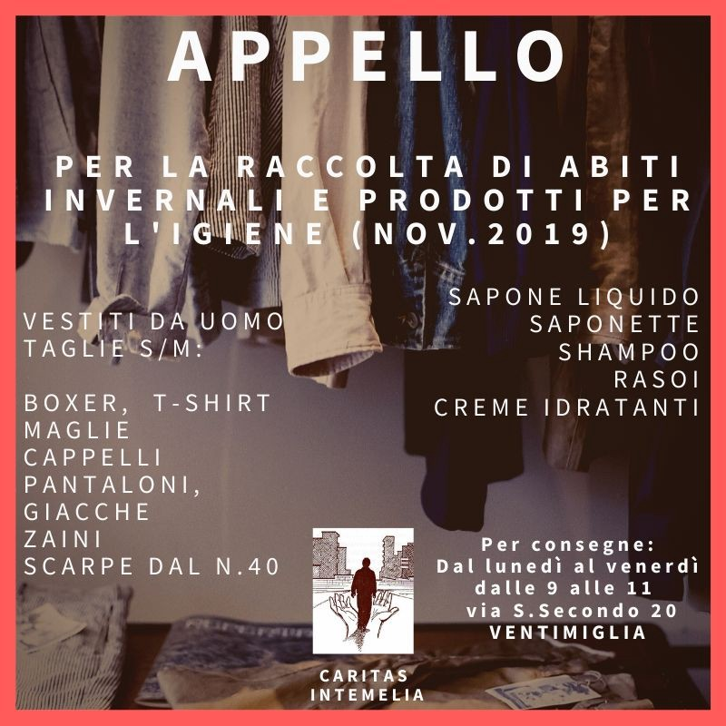

### AYS Daily Digest 25\.11\.2019 — No Surprises, Severe Weather Punishing People in Camps in Greece
#### Storms cause dangerous crossing conditions /// Evacuation of refugees from Libya /// Pushbacks at the French\-Italian border …

](assets/258b59d33a35/1*cA49tgb4AlQm4OclF_bYAg.jpeg)

Flooded camps in Greece\. Photographer: [@Theurgia\_Goetia](https://twitter.com/Theurgia_Goetia/status/1198962388004954116?fbclid=IwAR2JQJr_O0fR_MdBkmPTWEJ6YrMJUKsjr9BjCeqqPWIymZfQkAreyjlT3Wg)
### FEATURE — Extreme weather exposes inadequate living facilities in Greek camps

Severe thunderstorms that caused widespread flooding hit Greece over the weekend and continued into Monday\. Refugee camps on the islands were especially hit hard\.

■■■■■■■■■■■■■■ 
> **[MSF Sea](https://twitter.com/MSF_Sea) @ Twitter Says:** 

> > This is where some of the 5,700 #Refugeesgr live in Vial camp in #Chios. Since last night #Greece is on high alert against extreme weather conditions. Severe storms already hit parts of the country overnight and yet thousands of people in the Greek islands sleep in summer tents. https://t.co/qWX5vliFWE 

> **Tweeted at [2019-11-25 12:24:02](https://twitter.com/msf_sea/status/1198940405888360457).** 

■■■■■■■■■■■■■■ 

The extreme weather further exposed the inadequate living facilities refugees in Greek camps are expected to live in\. Many still live in summer tents that cannot withstand wind, cold, and rain\. Others do not even have tents and construct makeshift shelters out of materials that are too fragile to survive storms\.

■■■■■■■■■■■■■■ 
> **[uli vsanden](https://twitter.com/ulimuc1) @ Twitter Says:** 

> > #Greece #KOS #[Refugees](https://twitter.com/Refugees)GR 
today's #storm destroyed all makeshift shelters 
@[rspaegean](https://twitter.com/rspaegean) @[metadrasi](https://twitter.com/metadrasi) @[Refugees](https://twitter.com/Refugees) @[koppeu1](https://twitter.com/koppeu1) @[newhumanitarian](https://twitter.com/newhumanitarian) @[JFCrisp](https://twitter.com/JFCrisp) https://t.co/fIZGW9xa38 

> **Tweeted at [2019-11-25 14:31:19](https://twitter.com/ulimuc1/status/1198972439004356608).** 

■■■■■■■■■■■■■■ 

In addition to destroying camps, flooding worsened already\-unsanitary living conditions\. Piles of garbage bags which were not collected were swept into food distribution areas\. Worms that were in the garbage are now dispersed among people’s tents\.

■■■■■■■■■■■■■■ 
> **[Եհҽմɾցíɑ_ցօҽԵíɑ ⛧](https://twitter.com/Theurgia_Goetia) @ Twitter Says:** 

> > ΒΙΑΛ σήμερα.Οι σακούλες σκουπιδιών,που δεν είχαν μαζευτεί,παρασύρθηκαν από τη βροχή κ τελικά σκορπίστηκαν κυρίως στην περιοχή που διανέμεται το φαγητό. Εκτός από αυτό, στις σακούλες είχαν πλέον δημιουργηθεί σκουλήκια,τα οποία και γέμισαν τις σκηνές των ανθρώπων
#refugeesgr #chios https://t.co/o07ZdcFMkg 

> **Tweeted at [2019-11-25 13:51:23](https://twitter.com/theurgia_goetia/status/1198962388004954116).** 

■■■■■■■■■■■■■■ 

Even for refugees in Greece that are not living in camps, living conditions are precarious\. In the past few weeks, police in Athens have been cracking down on squats that often serve as homes for people without papers\.

The blog _Stateless_ published [an interview series](https://stateless.noblogs.org/post/2019/11/24/voices-of-notara-part-3-a-place-of-love-and-revolution/) with participants in one of the squats, Notara, that testify to the community that forms around these places\.

> From the beginning until now, more than 9,000 people have been hosted in Notara, coming from more than 15 countries\. 

> And the squat has also become a site of many projects and initiatives\. We have had four convoys coming from other countries, particularly France, bringing supplies\. We have had groups for women’s empowerment, language lessons, children’s activities, collective kitchens, photography, dance, theatre\. One of our core principles has been the acceptance of difference, and one sign of that is that some of the first assemblies of the community of LGBTQI refugees started here\. 

> I want to quote our first declaration, which we still say until now\. It says: “let’s make the odyssey of refugees for survival the voyage of humanity towards freedom\.” 

When the Greek government demolishes these squats, they not only deprive people of shelter but also rip away the communities that they have built for themselves out of precarious conditions\. This is a targeted effort in order to ensure that only people who are under the control of the authorities are recognised\. However, as can be seen, the people within the ‘legitimate’ system are punished further\.

Despite the weather and the conditions in Greece, refugees keep coming\. [Aegean Boat Report](https://www.facebook.com/AegeanBoatReport/photos/a.285312485325196/704857560037351/?type=3&theater) ’s weekly summary shows that numbers of arrivals on island camps increased last week, while transfers to the mainland decreased\. More and more people are stuck in already\-crowded camps as winter sets in and more severe weather threatens the islands\. Moria alone holds [16,000 people](https://twitter.com/daphnetoli/status/1198958259740258304?fbclid=IwAR2ZMUU8fxPxqFFCdClbEEaH9WV9WfsXGpZwAhp0a3x_0DVkFBBoWuQqPkQ) whose homes have now been destroyed by the weather\.

weekly report from Aegean Boat Report

While refugees are housed in unlivable conditions or turned out of their homes, politicians continue to treat them as a bargaining chip\. Greek Foreign Minister Nikos Dendias [warned Turkey](https://www.amna.gr/en/article/410817/Greece-will-not-allow-Turkey-to-consider-migration-a-bilateral-issue--Dendias-says?fbclid=IwAR1dC--jfaxvganWNfDoPdFmTkrXmdTJewM__mlT5RPCQCXviRMx3R3YroA) that it will not be allowed to blackmail Greece with the issue of refugees\.

> Greece is making an effort to explain to Turkey that there are specific obligations and the government must make an effort to organise the way it will handle the migration issue while shielding its borders\. 

The countries have a history of collaboration when it comes to pushing back migrants, but it is clear that both prioritise keeping refugees out of their own countries over any obligation to their neighbour or to human rights\.
### SEARCH AND RESCUE AT SEA

**A weekend of storms caused dangerous conditions at sea\. Many lost their lives\.**

Dramatic [footage](https://www.facebook.com/watch/?v=2221528578144853) emerged from the Italian coast guard’s rescue of migrants this Saturday off the coast of Lampedusa, in which at least [20 people](https://twitter.com/saracreta/status/1198955137148039169?fbclid=IwAR1-1zDsIsM0_GR0iEdPCM9rX6z444IknLJHA0y8wiZzcDOJ7G1D7bNgltY) are thought to have perished\. 5 are confirmed dead, but bad weather is preventing the search for the [15 missing](https://twitter.com/GDS_it/status/1198910962675441664?fbclid=IwAR2OHcLMJo1NaEDnJWzrOldI_f2elVd23Aq72EBHfZf-x_p9imfDzWjFEsE) people\.

In the Central Mediterranean as a whole, [10 people](https://twitter.com/MSF_Sea/status/1199067624409313280?fbclid=IwAR1Hi9Zcre5nh3CluSZAfpEV_VDUdaI592UVNPyZWm7a8XsPMyCCs7zyPy8) are confirmed to have drowned this past week, while dozens more are feared dead\.

In Spain, 28 migrants were rescued from a small boat\. Of the 28, 6 were minors\.

■■■■■■■■■■■■■■ 
> **[RTVC](https://twitter.com/RTVCes) @ Twitter Says:** 

> > Seis de los 28 ocupantes de la patera localizada este lunes en la costa de El Médano son menores. En el Avance Informativo (18.40 hs.) te contaremos la última hora. 

➡️ [rtvc.es/noticias/inter…](http://www.rtvc.es/noticias/interceptan-una-patera-con-27-personas-a-bordo-en-el-sur-de-tenerife-206177.aspx#.XdwWRVT7QdW)
#RTVCNoticias https://t.co/noRFHK4DsV 

> **Tweeted at [2019-11-25 18:06:20](https://twitter.com/rtvces/status/1199026547535028224).** 

■■■■■■■■■■■■■■ 

In the Canary Islands, two more boats arrived, one containing [28 people](https://twitter.com/112canarias/status/1198993587310125056?fbclid=IwAR1Hi9Zcre5nh3CluSZAfpEV_VDUdaI592UVNPyZWm7a8XsPMyCCs7zyPy8) and another with 27\. Authorities in Lanzarote also discovered a [dead body](https://twitter.com/RTVCes/status/1198981691525750784?fbclid=IwAR1-1zDsIsM0_GR0iEdPCM9rX6z444IknLJHA0y8wiZzcDOJ7G1D7bNgltY) that could belong to a person who disappeared last week during a storm\.

Despite the rough conditions, approximately [1,300 peop](https://twitter.com/yaxle/status/1198987043428356097?fbclid=IwAR07l5bemlaXBojk2Txym_JBbBVgP-8Zb9PE4oYKXX1Ysh62qNsabPeVRco) le attempted to cross the Mediterranean from Libya between the 18th and 23rd of November\. Many did not survive\. Violent and repressive conditions in Libya are pushing more people to attempt the crossing anyway, despite knowing the dangers\.

Existing search\-and\-rescue operations are not enough to make sure all these people cross safely\. Currently, Sea Eye’s _Alan Kurdi_ is the [only civil rescue ship](https://twitter.com/seaeyeorg/status/1198896738326765573?fbclid=IwAR12NlgjknOFlX7bUNU2oNBsgFrdg6LGKU1_Dnq_KxgK-3DGctHH3mfAC0I) in the Central Mediterranean\.

**Fundraiser: SOS Mediterranee needs your help\!**

> Winter is coming — even in the Mediterranean\. While we spend a cozy time with family and friends — especially these days — a ship is supposed to be on site that can accommodate people safely and in dignity\. 

> In isolated, heated and wave\-protected rooms, the rescued children, women and men can rest after life\-threatening escape and violence in Libyan camps\. You get warm blankets, food and warm tea\. 

> Even in winter, in storm and storms, we bring the rescued people safely ashore\. The Ocean Viking is currently the only civil rescue ship in the central Mediterranean that is large and stable enough for winter use in storm and storms\. 

> Make it possible with us\! Every day in action costs 14\.000 EUR\. If you and all our followers donate 3 EUR, then we can finance the effort between Christmas Eve and New Year’s Eve\. 

You can donate [here](https://www.facebook.com/donate/2390909231169360/2358019111082115/) \.
### BOSNIA

**Footage from Miral Camp in Velika Kladuša shows the inhumane conditions migrants are subjected to\.**

The video can be found [here](https://www.facebook.com/lorena.fornasir/posts/2529424160507999) and more photos can be found [here](https://www.facebook.com/lorena.fornasir/posts/2530601907056891?hc_location=ufi) \.

More images from Miral\. Photographer: Lorena Fornasir

Photographer: Lorena Fornasir
### LIBYA
#### Increased violence in Libya puts refugees at risk\.

As clashes in Libya intensify, refugees are being evacuated from detention centers and directly from the GDF\. On Sunday, [116 refugees](https://twitter.com/UNHCRLibya/status/1198976997814362112?fbclid=IwAR1Si1CLiENdwme-cUXT9IyIiUPvD6YFKqWLhWZwzm146Mk96-Wzkx-g99A) were evacuated to Rwanda\. However, people are being brought to detention centers [faster](https://twitter.com/yaxle/status/1198963728802369537?fbclid=IwAR2oFPmXGfq9Pcxvf8rlGNr9r2SEVROHYrYGwjcE5sgDKwWfRMLV_GucHv0) than the UNHCR can organize evacuations\. Refugees are evacuated in order of vulnerability, with priority given to babies and children\. However, all are vulnerable in the increasingly dangerous conditions in Libya\.
### ITALY
#### 578 people were pushed back at the French\-Italian border this week\. At least 27 were minors\.

Pushbacks at the French\-Italian border are becoming increasingly frequent\. This week saw the largest number since the [Kesha Niya project](https://www.facebook.com/KeshaNiyaProject/posts/1059006427777557?hc_location=ufi) began keeping track\.

Many asylum seekers reported violence and intimidation tactics at the hands of the French police\.

> One person lost self\-restraint during detention in the containers and smashed a window with his head and hands\. He said he was then punched by the French police\. Another saw it happen and also how a person injured himself on the shards of the broken window\. The injured person asked for help, but the police claimed it was nothing and refused to help\. 

> One person asked after 16 hours of detention if he could be released\. He told us the French police urged him to come to the door and when he got there, he was beaten first and then released\. 

Asylum seekers reported other irregularities at the hands of the police\. Arresting officers wrote down wrong information about the place, time and circumstances of arrests and detained migrants for many hours\. French authorities registered several minors as adults, which will negatively impact any future asylum claims they make\.
#### After dozens of people drowned in Italian state waters, politicians deny the need to increase search and rescue missions\.

Italian Interior Minister Luciana Lamorgese refused to answer a [journalist’s question](https://twitter.com/lorenzodago/status/1198932854098530304?fbclid=IwAR2JQJr_O0fR_MdBkmPTWEJ6YrMJUKsjr9BjCeqqPWIymZfQkAreyjlT3Wg) if Italy’s search and rescue capacities are inadequate given the many migrant deaths this past month\. Instead, she reframed the issue of human rights for migrants as one for security and safe borders for Italy\.

> Immigration is a very serious issue and needs to be addressed seriously, also with Europe\. 

#### Alarm Phone in Bologna is participating in “From the Sea to the Cities,” an event aiming to create solidarity with migrants across Europe and the Mediterranean\.

The event is open to the public\. More information can be found [here](https://twitter.com/alarm_phone/status/1198930725870952450?fbclid=IwAR0RsxfRFOT4PTDDK-ENR_RVzKfXwt4Fo1rcYQJKKDIHVw7dasNAHuBdOUw) \.
#### Updates on protests in Turin detention center: two areas of the detention center burned down, leaving many migrants out in the rain\.

Migrants were redistributed among the surviving areas of the center, although [many](https://www.facebook.com/LasciateCIEntrare/posts/3513300125361836?hc_location=ufi) were taken in isolation\.
#### Caritas Intemelia is calling for donations of men’s winter clothing and hygiene products\.

Credit: Caritas Intemelia

More information can be found [here](https://www.facebook.com/caritasventimiglia/photos/a.1071772512850907/3018798391481633/?type=3&theater) \.
### MOROCCO

**Sub\-Saharan migrants subjected to violence in Monday’s wave of arrests in Nador** \.

Approximately 100 men and 59 women were arrested and subjected to [violent beatings and torture](https://elfarodeceuta.es/detenciones-subsaharianos-marruecos/?fbclid=IwAR2P-q4B-zaW3O4-xXXEbMItODuoe2bWD-wJ2IZ6jzLNIx5WX0kl1VPwjG8) \. Some were sent back to the Moroccan interior immediately, while others are currently being held in the Arekmane detention center\. Injured people were not taken to the hospital but immediately put on a bus to the Algerian border and given only bread and water to eat\.

Women and children were [separated](https://www.facebook.com/AmdhNador/posts/2475194589359468?hc_location=ufi) from the men in their family and are not certain where their loved ones are\. Many were immediately subjected to refoulement as seen in this [video](https://www.facebook.com/watch/?v=2755592061129644) \.

This violent treatment is part of Morocco’s agreement to [increase cooperation with Spain](https://www.reuters.com/article/us-europe-migrants-morocco-spain/morocco-spain-to-bolster-cooperation-to-curb-illegal-migration-idUSKCN1VP28N) to prevent migration\. In addition to police brutality against migrants, the Moroccan authorities installed a own [razor wire fences](https://twitter.com/saracreta/status/1198937512091230209?fbclid=IwAR2n-POASxfWc5Bc4uY0T8UbSre0i6zFsLR3HVxlN8srHG5_TRiJMQSsEjo) on the Moroccan border with Spain, after the Spanish government was ordered to take theirs down\.
### GERMANY

**Refugee Black Box calls for resistance against Dublin deportations in Germany\.**

This weekend, the organization is celebrating the 25th anniversary of its THE VOICE Refugee Forum, a conference organized by refugees about their rights, with a symposium on the refugee community\. Events planned include presentations and music as well as demonstrations\.

For more information about the symposium as well as information about how to donate, click [here](https://www.facebook.com/RefugeeBlackBox/videos/vb.401555653516505/2176766022620053/?type=2&theater) \.
### FRANCE

**Another “clearing” of the Calais camp is anticipated for Tuesday morning\.**

Migrants and local organizations are calling for mobilization to protest, and ideally prevent, the destruction of their homes\. More information can be found [here](https://www.facebook.com/RefugeeYouthServiceFrance/posts/732326357256496) \.
### BELGIUM

**The Coordination of Those Without Papers is organizing a demonstration in front of the Cabinet Minister of Social Affairs on Tuesday\.**

All those living without papers are invited to come demonstrate for a regularisation of the asylum system\. The demonstration has been approved by the police\.

More information can be found [here](https://www.facebook.com/permalink.php?story_fbid=2666870990207636&id=1667773550117390) \.
### IRELAND

**1,000 asylum seekers stuck in application limbo for over four years**

The Irish Department of Justice supplied information to the Public Accounts Committee that reveals the dismal state of affairs for asylum seekers in Ireland\.

There are currently [8,560 asylum seekers in Ireland](https://www.irishexaminer.com/breakingnews/ireland/figures-reveal-nearly-1000-asylum-seekers-waiting-over-four-years-to-be-processed-965504.html) , of which 6,760 are living in direct provision centers\. While the average length of stay in the centers was about 22 months, many have lived in them for longer\. 116 applicants have been there for over seven years\.

Those living in direct provision have a very restricted life\. Although food and accomodation is provided, other expenses must be paid from a meager weekly allowance of [€38\.80 per week](https://www.infomigrants.net/en/post/20943/direct-provision-in-ireland-explained) \. Direct provisioners have very limited access to the job market and to higher education\. These conditions, which are especially dehumanizing after years and years of waiting, have caused a number of protests by asylum seekers and their supporters\.

Organizations such as the [Movement of Asylum Seekers in Ireland \(MASI\)](https://www.facebook.com/MASI-Movement-of-Asylum-Seekers-in-Ireland-321969801334321/) have already proposed simple solutions to help those forced to wait for years for their applications to be processed:

> This is why we proposed a change in law to give long\-term residency to any asylum seeker waiting 18 months\+ for a final decision\. The Special Rapporteur on Child Protection made a similar recommendation\. 

### EUROPE
#### EU official immigration policy shows growing apathy towards migrant deaths\.

■■■■■■■■■■■■■■ 
> **[omer shatz](https://twitter.com/shatzomer) @ Twitter Says:** 

> > The 2013 Lampedusa shipwrecks shocked Europe, were perceived as an exceptional failure, and led to Mare Nostrum, tasked with "saving all civilians fleeing Libya". 

Today it's EU's official policy: 20,000 deaths. 

Our #EU2ICC case at the EU Parliament:

[europarl.europa.eu/streaming/fr.h…](https://www.europarl.europa.eu/streaming/fr.html?event=20191121-0900-COMMITTEE-LIBE&start=2019-11-21T08:52:20Z&end=2019-11-21T08:53:44Z&language=fr) 

> **Tweeted at [2019-11-25 08:50:20](https://twitter.com/shatzomer/status/1198886627499745280).** 

■■■■■■■■■■■■■■ 

### GENERAL
#### Female migrants are exposed to additional dangers, articles show\.

While living as a migrant is dangerous and precarious for everyone, women are exposed to additional challenges that can negatively impact their mental and physical health\.

In many European countries, asylum seekers are required to live in government shelters\. However, shelters tend to have a majority male population and [little to no privacy](https://www.infomigrants.net/en/post/19299/how-are-women-protected-in-german-refugee-shelters?preview=1574690883814&fbclid=IwAR31EY9R8llo94ANbixJ3lmyH97VzvbNYT9IcWVFekYXHx6bnCdA7dHsmrA) \. Most bathrooms are communal and rooms cannot be locked\. This makes women vulnerable to sexual harassment and violence from security guards as well as other asylum seekers\.

Living in a space dominated by men is also triggering for women suffering from PTSD, many of whom were subject to sexual violence in their countries of origin or en route to Europe\.

Female migrants also face the challenge of obtaining adequate medical care, especially [while pregnant](https://www.infomigrants.net/en/post/20679/pregnant-without-papers-it-s-hell?preview=1574690397189&fbclid=IwAR1-wkHBiSEtYvq1KCngvVAEX5IMHkAgFCxQtDcCcoCVgOc0wRzPWRnM6ZU) \. Those without papers do not have access to health insurance and cannot afford private medical care or to maintain a healthy lifestyle\. Many do not seek medical care out of fear of deportation\. There are medical clinics for undocumented migrants run by charitiable organizations, however, staff are often overworked\. Migrants are repeatedly unable to access consistent medical care or even the stable living situation that is needed to manage a high\-risk pregnancy\.

**Find daily updates and special reports on our [Medium page](https://medium.com/are-you-syrious) \.**

**If you wish to contribute, either by writing a report or a story, or by joining the info gathering team, please let us know\.**

**We strive to echo correct news from the ground through collaboration and fairness\. Every effort has been made to credit organisations and individuals with regard to the supply of information, video, and photo material \(in cases where the source wanted to be accredited\) \. Please notify us regarding corrections\.**

**If there’s anything you want to share or comment, contact us through Facebook, Twitter or write to: areyousyrious@gmail\.com**

_Converted [Medium Post](https://medium.com/are-you-syrious/ays-daily-digest-25-11-2019-severe-weather-worsens-conditions-in-camps-258b59d33a35) by [ZMediumToMarkdown](https://github.com/ZhgChgLi/ZMediumToMarkdown)._
