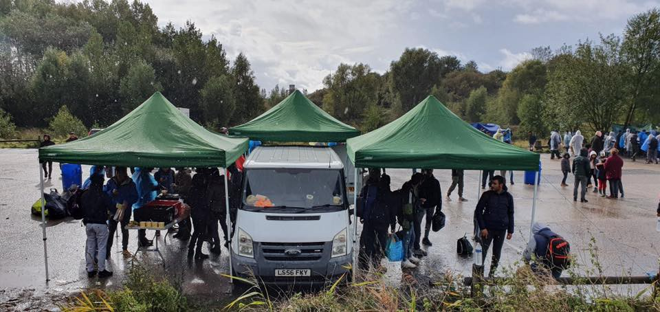
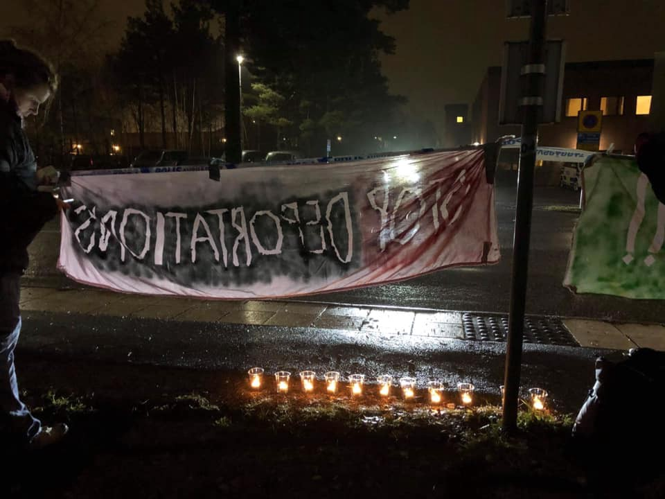
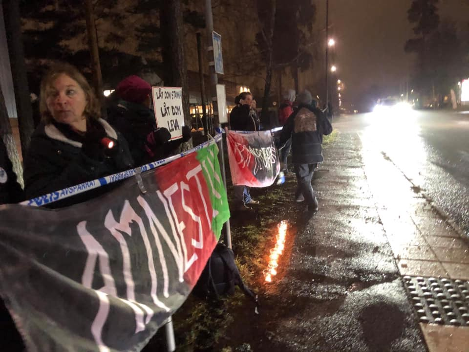

### AYS Daily Digest 26/11/19 NGOs in Greece: Register in 10 days or be banned, says gov\.

_21 people died off the coast of Lampedusa // deportation stopped in Greece // updated stats on BoH // protests in Sweden // undue arrests in Belgium // new proposal for scrapping Dublin Agreement // and more…_

](assets/51d3b9dd9070/1*IRhWLR12m6IAy06TmWu0Pg.jpeg)

NGOs on Samos play a vital role; one that the government has been unable to provide\. Photo by [Louisa Waugh](https://www.the-waugh-zone.org/why-samos-is-still-the-real-story-of-2018/)
### Feature

NGOs working with refugees in Greece have 10 days from Tuesday to register with the Citizen Protection Ministry or risk being banned\. The government is proclaiming that registering will be a “necessary precondition” to be accredited for continued work\. Many ministries have separate lists of NGOs, but apparently there is not one unified source within the government\.

The government wants to investigate the possibility of money laundering with organizations\. Yet this is just a continued scare tactic against the civil society responding to the crisis in efforts to protect human rights\. AYS will continue to cover this developing story, more [here](http://www.ekathimerini.com/246872/article/ekathimerini/news/greece-gives-ngos-10-days-to-register-or-face-ban?fbclid=IwAR2bABTz-_RMKsef3vy9cerjdvjEJ8qw5k-9Vk_0oG2da49IcdoyeHIUSh4) \.
### Sea

](assets/51d3b9dd9070/1*3N6XUM0ZyssacO57gb1tiw.jpeg)

Photo by [Mikail Çiftçi](https://www.facebook.com/artagainstproject/photos/a.704384742944296/2569337956448956/?type=3&theater)

In an update from [IOM](https://www.iom.int/news/deaths-rise-central-mediterranean-latest-lampedusa-tragedy) :

> “ **Twenty\-one people lost their lives in a shipwreck off the coast of Lampedusa, Italy, on Saturday \(23/11\)** when a boat, carrying 170 Europe\-bound migrants, capsized 1\.6km from the island as it was being escorted by the coast guard…Five bodies have so far been recovered, and at least 16 others remain missing\. Recovery efforts have now resumed after being hampered for several days by poor weather, IOM officials said today\. The process of victim identification has begun\. 

> Among the 149 survivors are 26 minors, some of whom lost their parents in Saturday’s tragedy…This tragedy comes during an apparent spike in departures from Libya\. In the past week, at least 12 boats were either intercepted or rescued in the central Mediterranean\. IOM Missing Migrants Project recorded 45 deaths in the central Mediterranean route on 22 and 23 November\.” 

[Salvamento Marítimo](https://twitter.com/EFE_Canarias/status/1199385202201702401) rescued 36 people in a boat 130 kilometers from Gran Canaria on Tuesday\.

■■■■■■■■■■■■■■ 
> **[Alarm Phone](https://twitter.com/alarm_phone) @ Twitter Says:** 

> > Alarm Phone Press Release! Last week, we were alerted to 13 boats escaping from Libya, carrying about 730 people. About 420 of them were rescued to Europe, 287 by NGOs &amp; 133 by the Maltese authorities. About 190 of them were forced back to #Libya. 
[alarmphone.org/en/2019/11/26/…](https://alarmphone.org/en/2019/11/26/four-days-of-struggle/?post_type_release_type=post) 

> **Tweeted at [2019-11-26 14:14:42](https://twitter.com/alarm_phone/status/1199330643106320389).** 

■■■■■■■■■■■■■■ 

■■■■■■■■■■■■■■ 
> **[Alarm Phone](https://twitter.com/alarm_phone) @ Twitter Says:** 

> > Apart from these 13 boats that reached out to us, we know of several other boats that were intercepted by Libyan forces with hundreds of people on board. We can assume that overall about 1,500 people were trying to flee from Libya over four days in November. 

> **Tweeted at [2019-11-26 14:15:20](https://twitter.com/alarm_phone/status/1199330803026669583).** 

■■■■■■■■■■■■■■ 

Alarm Phone can still not account for 94 people\. Learn more [here](https://twitter.com/alarm_phone/status/1199330903102672896) \.
### Greece

Following Greece’s new plan to create detention centres on the islands, Eva Cossé, Greece researcher at [Human Rights Watch](https://www.hrw.org/news/2019/11/26/greece-put-rights-heart-new-border-plan?fbclid=IwAR3xaITztswJjDAviRHKXV8h0ClOkA09-9oqAFtIxXq2mWqVg0GnmEvZ1FY#) , responds:

> “The government’s pledge to transfer thousands of people quickly out of overcrowded and inhumane conditions on the islands is right, but locking up everyone else is not…Greece should ensure adequate conditions in open reception facilities on the islands and a fair, efficient process for regular transfer to avoid chaotic, unsafe overcrowding\.” 

For more emphasis and stats, [Aegean Boat Report](https://www.facebook.com/AegeanBoatReport/posts/705763543280086?hc_location=ufi) adds:

> “Greek government announced October 22th that they would move 20\.000 people to mainland by the end of this year\. Since then they have transferred 5600 people\. In the same period 10600 has arrived on the islands, increasing population by 5000 people\. If arrivals and transfers continue in this pace, there will be close to 45000 people trapped on the islands by the end of this year\. 

> Since the new government took over in July, population on the islands have increased by 22200 people, from 17200 to 39400\. 

> Last winter the situation on the islands was critical, with a total population of 15000 people\. This winter there will be over 40000 people on the islands, living under even worse conditions\. I fear the time to come, while Europe are building even higher walls, numerous life will be lost on the Greek Aegean Islands\.” 

At least 5 boats arrived to the Aegean Islands on Tuesday with 178 people, according to [Aegean Boat Report](https://www.facebook.com/AegeanBoatReport/photos/a.285312485325196/705834269939680/?type=3&theater) :

Boats 1, 2 and 3→ Lesvos; 38 people, 41 people, and 20 people\.

Boat 4 → Chios; 39 people \(13 children, 8 women, and 18 men\)

Boat 5 → Samos; 40 people

Also:

■■■■■■■■■■■■■■ 
> **[Aegean Boat Report](https://twitter.com/ABoatReport) @ Twitter Says:** 

> > #GREECE: Last week, 87 boats arrived on the #Greek #Aegean islands, carrying 3,286 ppl.

#Lesvos: 41 boats, 1,646 ppl
#Samos: 16 boats, 632 ppl
#Chios: 13 boats, 508 ppl
#Leros: 7 boats, 207 ppl
#Kos: 5 boats, 125 ppl
Other islands: 5 boats, 168 ppl https://t.co/6orX1jdeMy 

> **Tweeted at [2019-11-26 22:01:07](https://twitter.com/aboatreport/status/1199448021450330112).** 

■■■■■■■■■■■■■■ 

[A 35 year old woman](https://www.stonisi.gr/post/5375/nekros-prosfygas-sth-moria?fbclid=IwAR0hoRyYGKgWeCCZnvgPcSzZQ4gVueb6UnkpDdRx0V_JoDEp5wx8PwH5Cqg#.XdzZoqyJz0g.facebook) died in from a medical emergency in Moria late Monday night\. Another tragedy for a camp who’s population has already faced enough a thousand times over\.

■■■■■■■■■■■■■■ 
> **[Franziska Grillmeier](https://twitter.com/f_grillmeier) @ Twitter Says:** 

> > Got some resilience lessons back in #moria today. #refugeesgr https://t.co/ifSnC67YQJ 

> **Tweeted at [2019-11-26 15:33:38](https://twitter.com/franzieire/status/1199350507418062848).** 

■■■■■■■■■■■■■■ 

A deportation of an Afghani man was stopped on the 21st of November from Lesvos to Turkey by the European Court of Human Rights\. The court was seriously concerned that the man would be subjected to inhumane or degrading treatment in Turkey if returned\. The court will further examine the Greek Government’s lack of consideration for Article 3 and the Legal Centre of Lesvos is hoping that this intervention will serve as a warning to the Greek Government, as they are increasingly rejecting asylum applications\. More [here](https://dm-aegean.bordermonitoring.eu/2019/11/25/legal-centre-lesvos-press-release-deportation-of-legal-centre-lesvos-client-halted-by-intervention-of-the-european-court-of-human-rights/?fbclid=IwAR3P8cAPcn7NwaU8iAotC5iOgoBhEPzh6IHEr5kaspDN8IuXNz9H5k6t8pQ) \.
### Italy

 arrived at the Port of Pozzallo on Tuesday with 78 rescued people: 71 men, 6 women and 1 child\. Photo by [Ane Irazabal](https://twitter.com/AneIrazabal/status/1199271371014131712?fbclid=IwAR0ZGd2zHKfZMBcahddojk2lS-yBXOA7vubmBL1MGVMZ38Hq8j4K-jfNITc)](assets/51d3b9dd9070/1*BeMD5ehr_AlGXv_D2SqYaQ.jpeg)

[NGO Aita Mari](http://www.ansa.it/sicilia/notizie/2019/11/26/nave-mari-con-78-migranti-a-pozzallo_fb8baf53-7ab7-40ca-af9d-8735becf4cce.html) arrived at the Port of Pozzallo on Tuesday with 78 rescued people: 71 men, 6 women and 1 child\. Photo by [Ane Irazabal](https://twitter.com/AneIrazabal/status/1199271371014131712?fbclid=IwAR0ZGd2zHKfZMBcahddojk2lS-yBXOA7vubmBL1MGVMZ38Hq8j4K-jfNITc)
### Bosnia and Herzegovina

In the International Federation of Red Cross and Red Crescent Societies’ [**Revised Emergency Appeal Bosnia and Herzegovina: Population Movement**](https://reliefweb.int/sites/reliefweb.int/files/resources/Revised%20Emergency%20Appeal%20Bosnia%20and%20Herzegovina%20-%20Population%20Movement%20n%C2%B0%20MDRBA011%20.pdf?fbclid=IwAR26DOvfZVLx9TNoJ1fgVALZtLN3S6srbukkFgQw5NbxdvZ5wzw5sLflrK4) analysis:

> “The most recent update provided by the Ministry of Security Office for Foreigners’ Affairs indicates 26,864 people as registered arrivals entering BiH from January up to mid\-November 2019 \(compared to a total of 24,000 for 2018\) \. Above the official numbers, the United Nations High Commissioner for
 

> Refugees \(UNHCR\)/IOM estimates up to 20% non\-registered arrivals\. There are estimates about up to 10,000 migrants being in the country, with up to 7,000 in Una\-Sana Canton, **for half of whom there is no available place** in the current TRCs due to the lack of capacity\.” 

The overall situation in the country elaborates with:

> “An average of 1,000 people is staying daily at Vucjak Camp with no functioning toilets, no running water, no electricity, no access to health, insufficient food supplies and dire shelter conditions \(unheated, leaking, damaged tents\) \. Health conditions are alarming — many have untreated injuries and scabies is widespread\. 

> **Red Cross is the only organization currently present in Vucjak\.** Considering very harsh winter conditions in the country, there are serious concerns about safety and wellbeing of all, not only those staying at Vucjak Camp but all those staying outside of TRCs, sleeping at open public spaces such as bus terminals, abandoned buildings, by the roadside and other public places\. The Red Cross is equally concerned about those who have been pushed back while trying to cross the border — returning without shoes, jackets, undernourished, physically exhausted and many kilometres to walk before reaching populated areas — among whom there are also families with children\.” 

If time permits, a further reading of [the report](https://reliefweb.int/sites/reliefweb.int/files/resources/Revised%20Emergency%20Appeal%20Bosnia%20and%20Herzegovina%20-%20Population%20Movement%20n%C2%B0%20MDRBA011%20.pdf?fbclid=IwAR26DOvfZVLx9TNoJ1fgVALZtLN3S6srbukkFgQw5NbxdvZ5wzw5sLflrK4) will be well worth your time\.
### Belgium

](assets/51d3b9dd9070/1*0qzt7077wXoyJGuw9XSfSQ.jpeg)

The Federal Police at Brussels North Station were arresting people on Tuesday who came into the station to find some heat inside from the cold and took them away for “identity” checks\. Photos by [Plateforme citoyenne de soutien aux réfugiés Bruxelles](https://www.facebook.com/bxlrefugees/posts/996890247316604)
### France

![“Over the past few weeks, almost every single one of our service and distribution sessions in **Dunkirk has been accompanied by torrential rain** …These conditions have led to an extremely high number of cases of **fungal infections** and conditions such as **trench foot** \. This is simply where, due to prolonged exposure to moisture and little room to dry, the skin on a person’s feet becomes infected and begins to rot…In order to prevent conditions and ailments such as these, we endeavor to replace peoples’ shoes…In order to continue to do this, we desperately need donations → **If you are able to donate any \(winter supplies\) please get in contact\.** Alternatively, you can donate to help us purchase these essential items in bulk, via our partner organisation People Not Borders \(to help\) purchase high quality, lasting footwear at affordable prices\.” Message by [Mobile Refugee Support](https://www.facebook.com/MobileRefugeeSupport/posts/1116452811893662) ; Photos by FAST \(First Aid Support Team\)](assets/51d3b9dd9070/1*M8fc6-1ZY9fpgxn0eAhFGQ.jpeg)

“Over the past few weeks, almost every single one of our service and distribution sessions in **Dunkirk has been accompanied by torrential rain** …These conditions have led to an extremely high number of cases of **fungal infections** and conditions such as **trench foot** \. This is simply where, due to prolonged exposure to moisture and little room to dry, the skin on a person’s feet becomes infected and begins to rot…In order to prevent conditions and ailments such as these, we endeavor to replace peoples’ shoes…In order to continue to do this, we desperately need donations → **If you are able to donate any \(winter supplies\) please get in contact\.** Alternatively, you can donate to help us purchase these essential items in bulk, via our partner organisation People Not Borders \(to help\) purchase high quality, lasting footwear at affordable prices\.” Message by [Mobile Refugee Support](https://www.facebook.com/MobileRefugeeSupport/posts/1116452811893662) ; Photos by FAST \(First Aid Support Team\)
### Sweden

Another big deportation was set to take place from Arlanda airport Tuesday night\. 45 people are on the list, not much more is known as of now\. [Protests](https://www.facebook.com/groups/212935029139489/permalink/818686351897684/?hc_location=ufi) have occurred outside of the detention facility in Märsta since the late afternoon\.

Photos by Elisabet Rundqvist

During the weekend there were protests in 77 locations across Sweden\. The 24th of November marked 4 years of very strict, EU minimum, asylum policies in Sweden\. But — no mainstream media covered it or gave it any attention\. Only small papers — which is remarkable given that 77 places and thousands of protesters is quite noteworthy\.
### EU
#### Germany is trying to establish [a new automatic relocation scheme](https://www.politico.eu/article/germany-sets-out-plan-for-automatic-relocation-of-asylum-seekers/?fbclid=IwAR3BaClwnYY5wlrTS0rMHzEU3nOIFrHXrg469p9BRx37syMZ6LJva675Cz8) for asylum seekers\.

The 4 page draft document does not mention the proposal being compulsory, yet that’s clearly the intention\. The proposal will mainly throw out the Dublin Agreement and EASO, the EU agency for asylum, will have significantly more responsibility for asylum claims\. Responsibility will be assessed for countries based on “fair share” including factors such as population size and GDP\.

This is part of the migration proposals of European Commission President\-elect Ursula von der Leyen, a former German defense minister, which she is expected to initiate in February\. Meetings are scheduled next week to discuss the proposal with different member states\.

**Find daily updates and special reports on our [Medium page](https://medium.com/are-you-syrious) \.**

**If you wish to contribute, either by writing a report or a story, or by joining the info gathering team, please let us know\.**

**We strive to echo correct news from the ground through collaboration and fairness\. Every effort has been made to credit organisations and individuals with regard to the supply of information, video, and photo material \(in cases where the source wanted to be accredited\) \. Please notify us regarding corrections\.**

**If there’s anything you want to share or comment, contact us through Facebook, Twitter or write to: areyousyrious@gmail\.com**

_Converted [Medium Post](https://medium.com/are-you-syrious/ays-daily-digest-26-11-19-ngos-in-greece-register-in-10-days-or-be-banned-says-gov-51d3b9dd9070) by [ZMediumToMarkdown](https://github.com/ZhgChgLi/ZMediumToMarkdown)._
