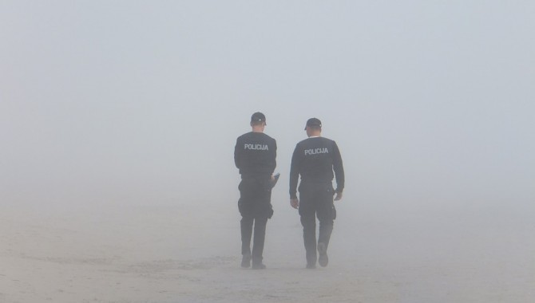
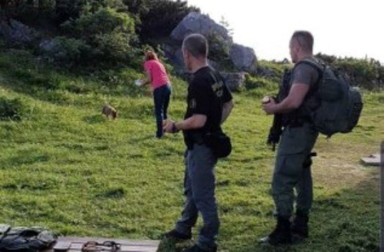
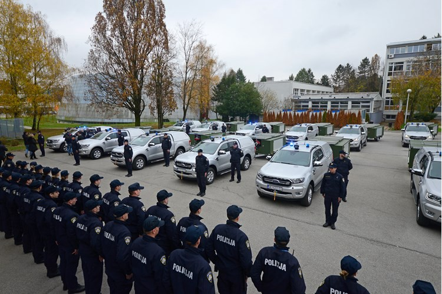
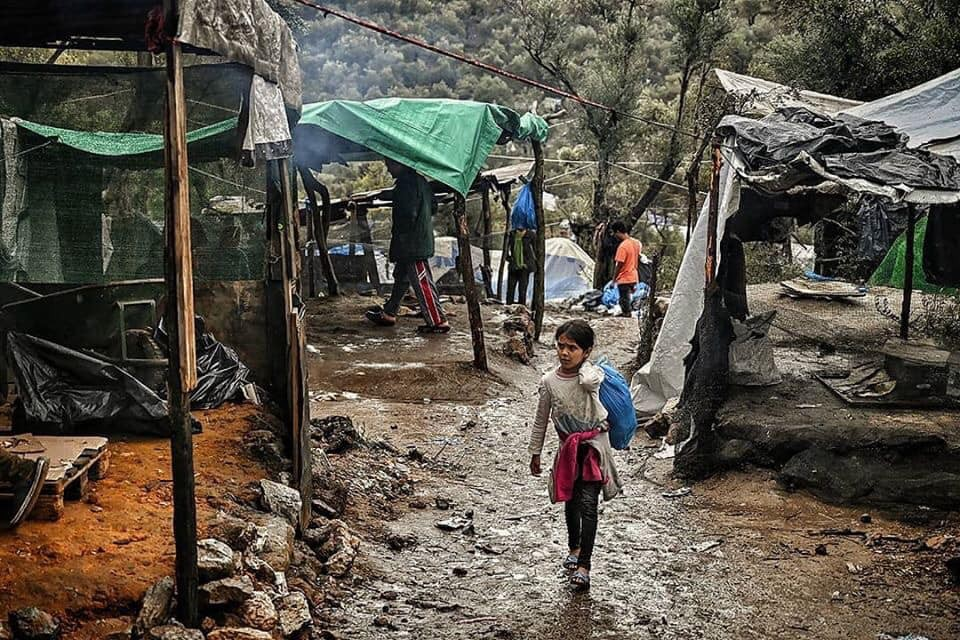

### AYS Daily Digest 28/11/19: Two people shot by Croatian police in less than 2 weeks
#### Croatian Ministry of Interior blames the victim, says he was “disabling police officers of performing their duties” / UNHCR accused of starving people in Libya / Aegean mayors reject governmental plan for the islands / Mental health crisis, suicide attempts on the rise in Malta

Croatian police are increasing their operations in Gorski Kotar area\. Photo: Pixabay
#### FEATURED

Croatian police shot another migrant, claim the victim is to be blamed

Only 11 days after [a young migrant was shot by Croatian police officers](https://medium.com/are-you-syrious/ays-news-digest-16-17-11-19-a-man-shot-by-a-police-officer-is-fighting-for-his-life-at-a-hospital-241e9f919074?source=collection_category---5------10-----------------------) in the Tuhobić mountain, another shooting happened in the same region, near the town of Mrkopalj\. This time, a Croatian police officer shot a man in the shoulder\. Surgical treatment was provided in the hospital in Rijeka\.

At the moment, the hospital in Rijeka is treating both victims\. The first man, who is “very young” according to medical sources, is still recovering from severe internal injuries\. The prognosis for his full recovery is not good\.

In both cases, the Ministry of Interior tried to spin the news by portraying perpetrators as heroes and describing the events as, “accidental, isolated incidents with no intention to cause any harm\.”

Police officers with long guns are regularly patrolling the area\. Photo: Anonnymous source

For the first man, they even had the nerve to say the police officer who shot him “actually saved his life” by helping to carry him, in a near\-death condition, towards the ambulance\. The official explanation of the incident, unconfirmed by any witnesses, it that the, “police officer tripped and his rifle fired accidentally\.” The bullet then, the Ministry claims, “bounced off the rock and unintentionally injured the man\.”

Chief of the police worker’s union went even further, saying, “the man is now a burden to our country, because we have to pay for his medical expenses\.”

For the second victim, they changed the strategy by implying he is to be blamed for his own injuries, because he, “prevented the officers from performing their duties” \(probably push\-back\) \. Again, the Ministry said the shooting happened by accident and therefore they don’t see the police officer responsible for heavy injuries of the victim\.

> While the Ministry claims their weapons are firing on their own, with bullets magically flying through air and injuring migrants by accident, only to be “saved” by the police, information from the Border Violence Monitoring database and other monitoring groups shows the [gun violence against migrants in Croatia is on the rise since 2017](ays-special-it-is-proven-croatian-police-regularly-shoots-at-people-45f2308ce0a1) , and at least 1279 people, including children, have been shot at or threatened with guns in that period\. 

The Ministry of Interior says they are, “carrying out intensified activities in combating illegal migration and prevention of property crimes,” in the Gorski Korat area, following the meetings with local authorities\. This raises fears of more potentially deadly incidents, as many people are trying to cross this area in hopes of reaching Western Europe before the winter\.

According to independent security experts, situation in Croatian police, “is as bad as during the wartime period in the 1990s\.” They are describing total chaos, especially among those who are sent to “prevent illegal migration” at all cost\. They are even returning 2000 retired police officers to service, just to have enough people who would be willing to perpetrate push\-backs at Croatian borders with Bosnia, Serbia and Montenegro\.

17 new thermal imaging systems are deployed to borders\. Photo: MUP

Two days ago, the Minister of Interior presented 17 new thermal imaging systems that will be used by police departments at borders with Bosnia and Herzegovina and Serbia\. By the end of the year, they’ll also get five long\- and medium\-range drones to increase border surveillance\.

The total value of the aquisition is EUR 6,290,000\.00, of which 75% is financed by the Internal Security Fund \(ISF\) of the European Union \(EUR 4,717,500\.00\) and 25% by the state budget\.
### Support the Complaint Against Frontex

The General Court of the European Union has ruled that the European Border Police \(Frontex\) does not have to disclose information regarding their border operations\.

The judgement takes for granted Frontex’s speculations on the disadvantages of even the most simple public knowledge about its missions\. European Law requires a critical test of the agency´s arguments, which has been sadly missed, the lawyer in the case of the freedom of information activists against Frontex said\.

A complaint by human rights lawyers against the EU’s migration policy is currently pending before the International Criminal Court in The Hague\.

If you want to support them \(as the legal costs might sky rocket\), find out more information [here](https://fragdenstaat.de/en/blog/2019/11/27/frontex-judgement-luxemburg-transparency/?fbclid=IwAR1HFw2LtEbEGjBjGBT0CgOkGUsBK2cXdB7efC7jZ7Ba13oD-qEP-40K7HU) \.
#### LIBYA
### UNHCR Accused of Starving People

The UN has been accused of trying to starve out refugees and asylum seekers who are sheltering for safety inside a centre run by the UN refugee agency in the Libyan capital of Tripoli\.

> One group of about 400 people, who came to the Tripoli gathering and departure facility in October from Abu Salim detention centre in the south of the country, have apparently been without food for weeks\. 

Among them are **100 minors, according to a recent assessment by the International Organization for Migration** \. They are “currently starving” apart from some food that other refugees manage to sneak out of another part of the centre, the IOM assessment said\. They last received food assistance a “couple of weeks ago\.”

Unfortunately, in a bleak response to the many accusations, the UN Agency has only been able to say the accusations are based on a number of whatsapp messages \(sic\! \), though part of the basis for the articles and reports are in fact whistleblowers and leaked documents as well, not that we diminish the main resource: human experience\. We hope, though we don’ expect, the UN changes their stance and their policies, or at least takes responsibility for this, and we are following the issue\.
#### SEARCH AND RESCUE

Sea Eye reports that Alan Kurdi found the second unseaworthy rubber boat in distress at around 5:00p and rescued another 40 people, including three small children\. One unconscious woman was taken from the boat and directly to the on\-board hospital\. Her condition is critical\.

The doctor on board Alan Kurdi wrote:

> “The critical condition of a rescued woman fortunately has improved\.
 

> But an eight\-week\-old baby is in a very weak condition and has not been drinking for two days\. We asked [\#Malta](https://www.facebook.com/hashtag/malta?source=feed_text&epa=HASHTAG&__xts__%5B0%5D=68.ARB7QTdXfv9XdFA_OZS0zBJfkeKei8a41klQlFFAGmGeorWe5U1t6-CljeerduTbcreDZ7Y3UzLa5Lc_k18NUoppoNeVH2Ld7dPVAe6PWBs5xSVcxn40rFaAx0TL8XA3GVs0SrG7MMDpZGWEXMyK6WgTagbqn5iPny1jJRxWuUFrn36L46b9TqAVcj6MFdywQ9QPA4m7tDFhXLBBVi0yMtlbXyWuf8qBOsCGx63uH1DQIOYGhPkp1MXRbUg7_wVkhW0_dk-8aSvmi30rOLR9B3Usbi-PiLAtGQanezx5iWEM9zbkCwT1yz2TFvFJkbvY-RDMx9IIrUo51gdLVnRnopp8rA&__tn__=%2ANK-R) for an immediate evacuation\.”
 

> We are now having 84 guests on board our vessel\. Among them are six small children, the youngest just being four weeks old\. 

[Missing Migrants Project](https://l.facebook.com/l.php?u=https%3A%2F%2Ftwitter.com%2FMissingMigrants%3Ffbclid%3DIwAR0QTSQ_ybeOI-6cl5NlrchkObypid6gBFL12BfQBSV5vB4_-TAiffOYiWI&h=AT1Od7CAdh_T1u3lEVjMfaCegekbbcidfE-jf_Dde6Phidl2Q894hW3TaXrbZtfN0qefcphiHSyXC6gpn_cl6a_DZzJjqBflV7XMtXN7-hrmHZoWhQujwJQlWMRj-NureBkySVNmLaXtRZc9cPc) confirms that the reduction in SAR capacity in the central [M](https://l.facebook.com/l.php?u=https%3A%2F%2Ftwitter.com%2Fhashtag%2FCentralMed%3Fsrc%3Dhashtag_click%26fbclid%3DIwAR3z92FfhdwfQ6zDXeeJjvIEa7A97OuylHg8YdBlmHFRPloJnUvMMjpPko4&h=AT3eo40-_1IY68qbGh9MtQRyIHVAizJ_HToUfyC8FstrQMgmfNSZWdB38qg0V-VE6k25cr5fU2j9gO-cOXOP_z3qGcwUGpqjLm3uREnzF6IrUMy-_EwYTn0NGWFRGSHOl4YzeVm8bzY57BlsPZ0) editerranean has likely contributed to the worsening of conditions for people taking this route\. In 2017, for every 50 people who attempted the crossing, one person died\. In 2019, the mortality rate increased to one death for every 30 people\.
#### GREECE
### Aegean Mayors Reject Governmental Plan for the Islands

Last week the government announced it will shut down the three largest of its overcrowded migrant camps on islands facing Turkey, and replace them with new closed facilities with much larger capacity\.

Conditions remain difficult in the overcrowded Moria refugee camp in Greece with winter fast approaching\. Photo: Amir Karimi

The five mayors of the eastern Aegean islands affected by the refugee / migrant issue reject the governmental plans for closed pre\-departure centers with capacities exceeding 5,000 people\.

_“We do not accept the government’s recent announcements about the pre\-departure centers\._

_We demand that her pre\-election commitments be respected\._

_The government should respect the decisions of our City Councils immediately and massively decongest the islands and proceed to safeguarding the maritime borders\.”_
#### MALTA
### Mental Health Crisis, Suicide Attempts on the Rise

Urine\-soaked passageways between housing units, and garbage and vermin throughout the complex are just some of the devastating images depicted in the recent report by European Council on Refugees and Exiles that was reported after a riot broke out at the centre in Ħal Far\. Concerns about poor hygiene, severe overcrowding, and rat and cockroach infestations were all flagged in the report\. Now, even without a consistent quest for information, simply by looking at the hospital records, it is safe to say the mental health concerns grew into a crisis\.

A growing number of people has been hospitalized for suicide attempts, psychotic episodes, substance abuse, intentional overdoses, acute stress and adjustment disorders\.

Media have reported a Maltese doctor stating the provision of refuge should include physical, emotional and material security — mental health was a critical element of wellbeing on both an individual and societal level\.

> She said the increase in referrals merited further investigation\. “But let us be honest\. Do we really think that the prevailing context, marked by racism and discrimination, illegal detention and a camp context in dire need of financial, physical and human investment, is conducive to mental health and social wellbeing? Of course not\.” 

#### ITALY

113 **people arrived from refugee camps in Lebanon to Rome** , all thanks to the safe passage system organized by a number of Italian organisations\.

> “These kids have only known the war and refugee camps\. But now they’ll have a future in Italy,” said Marco Impagliazzo, president of the Community of Sant’Egidio, which together with the Federation of Evangelical Churches in Italy \(FCEI\) and the Waldensian Evangelical Church, organised and financed the safe passage\. 

Since 2016, the groups have together brought over 3,000 Syrians to Italy, France, Belgium and Andorra, 1,800 of them to Italy alone\.
#### FRANCE
### People Moved From the Streets of Paris

Evacuation of the provisional camps took part on Thursday 28th, in the area of Aubervilliers on the outskirts of Paris\. A number of buses had arrived in place to evacuate and “place in shelter about 200 to 300 people,” as the official police statement said\. According to authorities, around 2000 people live around the Porte d’Aubervilliers\. A month ago, the camp close to the Chapelle has already been evacuated\. According to volunteers on site, around 500 men could not access the buses\. Those who did will be put in shelters or returned to streets, depending on their administrative status\.

](assets/52179785c7f9/1*vPItCmz3MDFzT7vPzQEXCg.jpeg)

Photo: [Utopia 56](https://web.facebook.com/asso.utopia56/?__xts__%5B0%5D=68.ARDmWosEmc3jVSVEeDuB__CwPBk4cdXEroEnQSflx1gvqrs0JGOEK8-7WeyWVtTSmY-CNPTlZgR6W4vqXhFBLOG3CE4hnFxRMbSu96M6QfUNOZb-fRtqEz-MUsp9P8sl9tROHq6Oe6rC2NYA9dTC8kZ04ZYoiEc8qf6WEabNQNH8Gpt-oIvWUPuDCkkKqXUbzM1iW0rYs0soBm1hIIZUaK2s1yQLW7U0PbjAI2R135bv-SdqRZxuxjjzauAk1ACiqQRLImAAFra8xNBfG6M-4ehZw28BJDk5yMVr88le5NA1q2ftoDxpm4_m1My9H_nlYneUotWjeQOI3-R35YfmtAMqCxDp&__tn__=k%2AF&tn-str=k%2AF)
### Highway Checks on the Rise

Police checks between the EU member states are not a common practice, but lately there have been more and more accounts of highway checks\. In trucks at the highway A9 in the direction of Spain 15 people were intercepted by a police patrol in Grand\-Gallargues dans le Gard\. Read more [here](https://france3-regions.francetvinfo.fr/occitanie/herault/15-migrants-interpelles-hier-matin-aire-autoroute-a9-herault-1755997.html?utm_source=dlvr.it&utm_medium=twitter&fbclid=IwAR0CNKvN4kb2oBVATQ_3eVN7B2KlOyLnCK2h0qDQplCQR7hq2sf-ICxuwjo) \.
### Massive Fight Breaks Out in Calais

Fights among the groups present in the vicinity of the former Calais jungle, approximately 200 people wounded\.
More than 600 people are present in the area, with no solution to housing or primary needs, as the winter draws near and people’s hopes of reaching the UK persist\.
#### GERMANY
### Insisting on Receiving the Unaccompanied Minors

With a follow\-up appeal, numerous organizations and refugee councils will once again appeal to the Federal Government, calling for immediate admission of vulnerable minors from Greece to Germany, activists report\.
Over 3,000 unaccompanied minors are housed in catastrophic conditions or homeless in Greece due to a lack of child and youth housing and [Flüchtlingsrat Niedersachsen](https://www.facebook.com/Fluechtlingsrat.Niedersachsen/?__xts__%5B0%5D=68.ARD2ryQ9Vs4926EmhUKdCK7Ye3A5KMldxwN_j2b0urS459I2S9u6aytswvgLvoXWZG98_qlbuzvp-mW_f5YJHeE1K1Zhn-m6iD-30e1snWPtFd7VsUUlGsfQzFriLiDC40dAHbD8njKud-k7kA4RmxJ6TSltUvRqNSDjpRDjCjc3iVCjfmgxrYMn1kijXz4tcaa6bvz2inEFCk1DbDoH54IR7qwUUsoi-LHCBE7ammQjFcwBBIKqhuHwY4Sv5RXyMdoupBI-ppdLlNcEw8iSba95I6XP9coaB6zwtDXR_5zU6SvaPHqIjQgZByzi_WTm1V-QKVTnDaYhuSWfHi8hP8mH4fRKHcTGVenZum9Rdy9Oo9JG&__tn__=%2CdkCH-R-R&eid=ARD3wUtgusfu8taLsGkNoM46Q1ibq5dtRlkuF_jrNQoXBygUlJS-f7LOZ0ywWqgliQSqWSjDWJ9byJ_Z&hc_ref=ARRjzvBkWWf3T7enpzuOcqd_QP212qoDSaUsS7dA8AHVs6NDZglhGxe4PzHc_u7441k&fref=nf&hc_location=group) reports that more than a dozen organisations are now applying pressure to the Bundestag in order to push for a quicker reception, during December, as they say\.
#### SWEDEN
### Asylum Seekers Must “Prove” They Are LGBT\+

Many asylum seekers in Sweden are put through degrading processes to “prove” they are LGBT\+ \. Many are sent straight back into danger\.

A petition directed at Morgan Johansson, Justice Minister of Sweden, and Mikael Ribbenvik Director General of the Swedish Migration Agency is now available [here](https://action.allout.org/en/a/Sweden/?utm_campaign=a-Sweden&utm_source=twitter&utm_medium=social&fbclid=IwAR1E66_OTw9e9eSxMfnmhJ-u0Ef0zRo-aDbk-NqnsZ1C9QfPM0diH3Q_rwQ) and it states:

> There are many LGBT\+ refugees in Sweden whose asylum appeals were rejected\. Research shows that more than 20% of these decisions were wrong\.
 

> Questions asked in the interviews often violate the asylum seekers’ privacy, which is a violation of European regulations\. Bad interpreters cause misunderstandings leading to false assumptions\.
 

> We urge you to fix the asylum process for LGBT\+ people and implement better training for migration staff working on LGBT\+ asylum cases\. 

**Find daily updates and special reports on our [Medium page](https://medium.com/are-you-syrious) \.**

**If you wish to contribute, either by writing a report or a story, or by joining the info gathering team, please let us know\.**

**We strive to echo correct news from the ground through collaboration and fairness\. Every effort has been made to credit organisations and individuals with regard to the supply of information, video, and photo material \(in cases where the source wanted to be accredited\) \. Please notify us regarding corrections\.**

**If there’s anything you want to share or comment, contact us through Facebook, Twitter or write to: areyousyrious@gmail\.com**

_Converted [Medium Post](https://medium.com/are-you-syrious/ays-daily-digest-28-11-19-two-people-shot-by-croatian-police-in-less-than-2-weeks-52179785c7f9) by [ZMediumToMarkdown](https://github.com/ZhgChgLi/ZMediumToMarkdown)._
