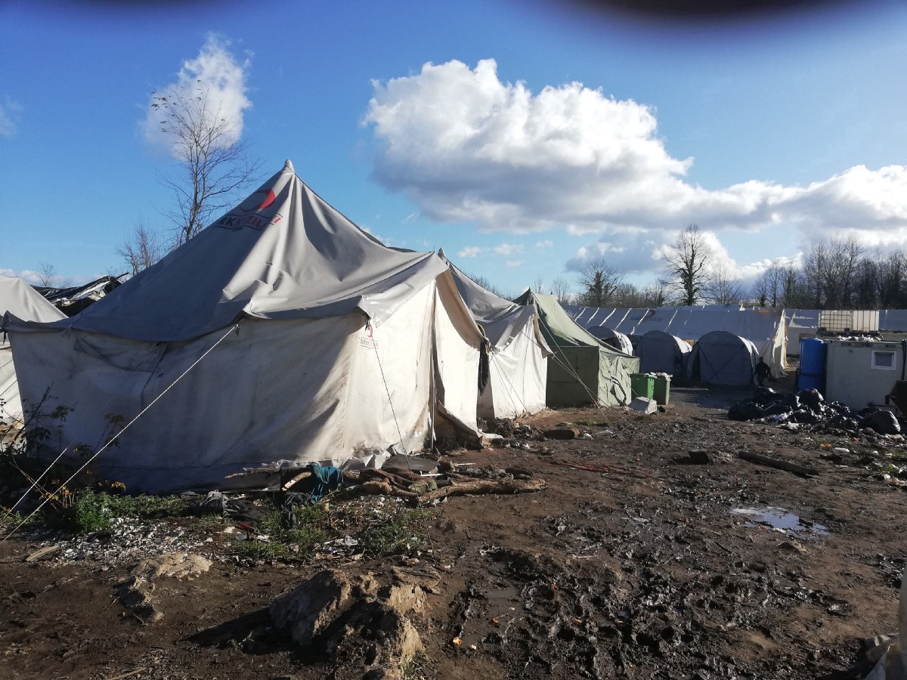
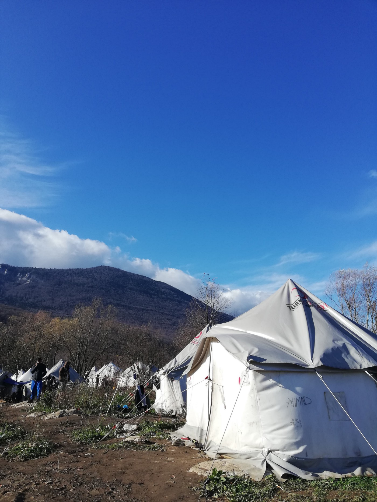
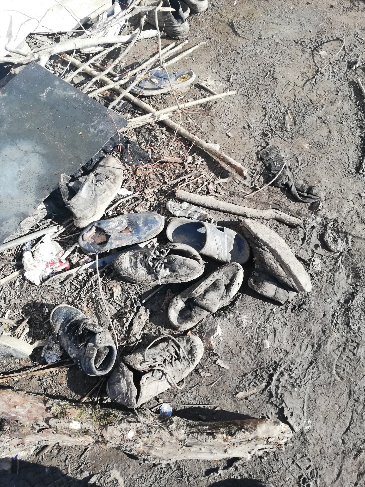
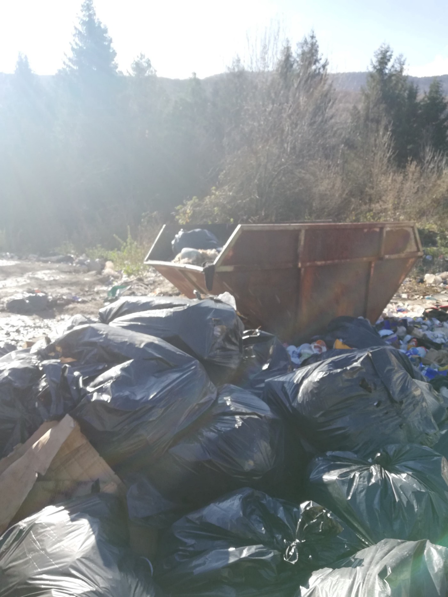
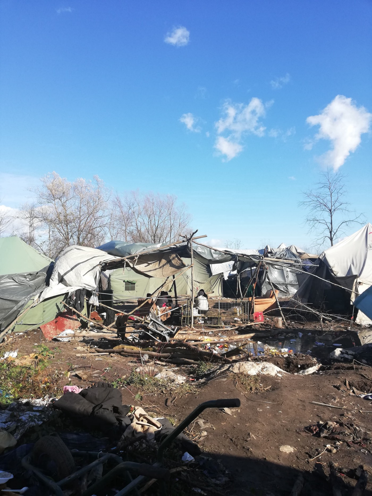
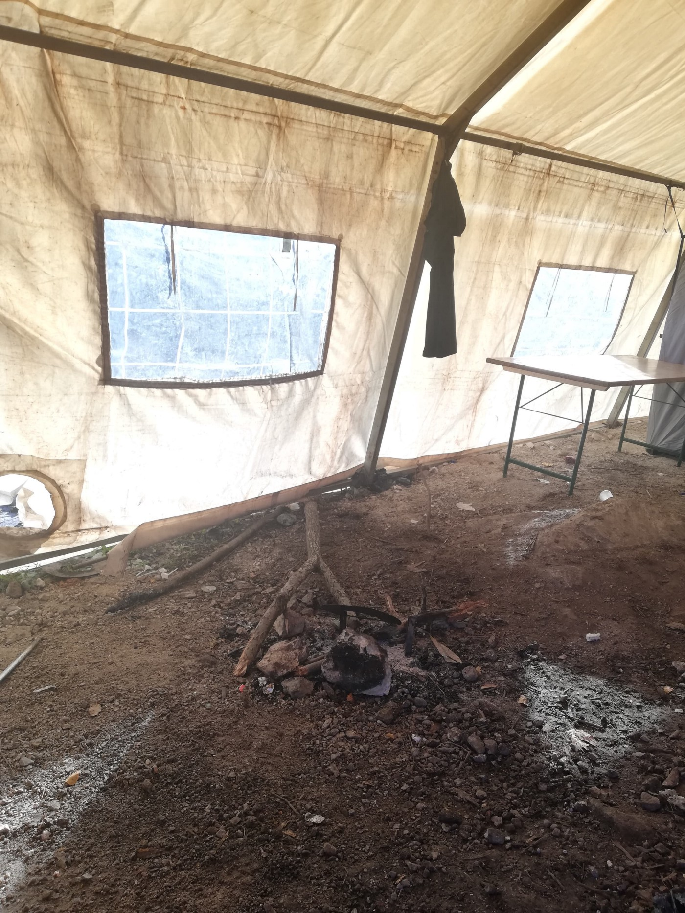
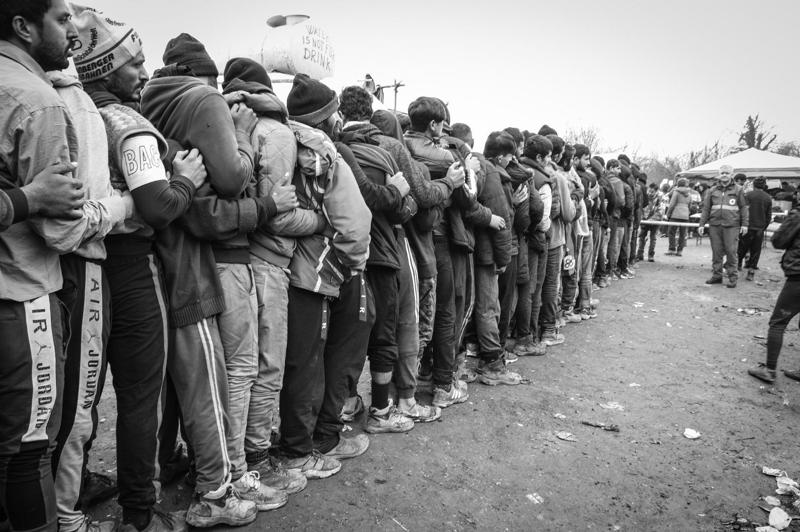
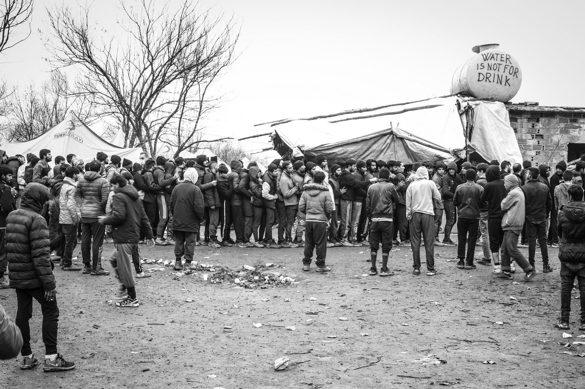
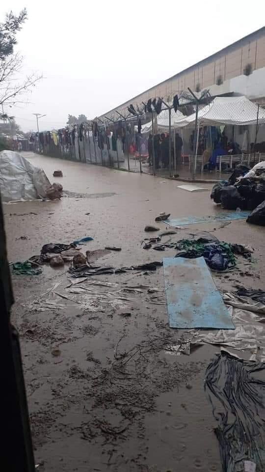
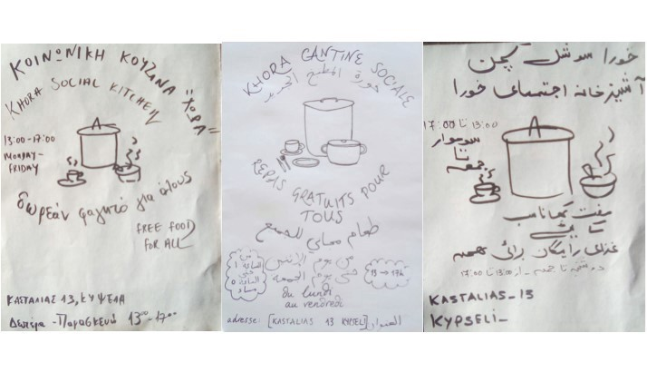

### AYS Weekend Digest 30/11–01/12/2019: Impotence and hypocrisy\. Vučjak camp

[Are You Syrious?](@AreYouSyrious?source=post_page-----d55313aad34----------------------)

[Dec 2](ays-weekend-digest-30-11-01-12-2019-impotence-and-hypocrisy-vučjak-camp-d55313aad34?source=post_page-----d55313aad34----------------------) · 12 min read

Libya: fire in Zintan ///Greece: New details on closed island centres and new fence on the Evros border /// Sea: Several rescues in the Western Med and worsening situation aboard the Alan Kurdi /// Italy: tens of thousands of people take to the streets against racism while Salvini risks new charges /// France: Court recommends improvements to asylum system

Vucjak \(Photo by AYS\)
### Feature Story — Impotence and hypocrisy: Vučjak camp

_In spite of all the announcements and the international outrage of everyone who saw the photo stories from Vučjak, it remains a sad illustration of the powerful lack of political will on the local/regional level and the impotence and hypocrisy of the international community present in the area and very vocal about the many issues connected to the situation people in transit find themselves in\._

On the one sunny day of the past week the bloody puddles between the loosely set up tents, most of which will probably fall apart with the coming winds and snowy months ahead, were not hidden in the morning frost\. The mud and the stink of the soil were there to remind everyone of the desperate result of a lack of political will of the cantonal and the federal government, the indifference of the neighbouring EU\-member state Croatia \(along with the entire Union\) and the impotence of the international organisations who haven’t been able to address this huge disaster during all this time and seem to have no problem having only two young men working with the local Red Cross bearing all the burden on the ground\. One can’t help but wonder where is some concrete support from the Red Cross Federation or the biggest ‘player’ in the area, the UNHCR? The people are still refugees and in need of protection, however much the two sides \(the local governments and the international organisations\) might disagree on the locations etc\. As some locals comment on the margins of the high end meetings — if you think there’s nothing you can do, leave\. ‘Do no harm’ is at question here\.

Coming back from the difficult terrain, the dangerous mountain area which is their only option on the way forward, people are still found arriving barefoot or sent back in flip flops, beaten, wounded and robbed\.

Plješivica mountains in the back, tents set up on top of a toxic dump / Broken shoes of people who disposed of them as they managed to move on, went back or are still in the area, hoping to get a new chance — to survive \(Photo: AYS\)

The dump beneath the ground the people sleep on makes the area even more dangerous and impossible to live with the growing amounts of different types of waste that are inevitably piling up\.

Following one of the group actions of rubbish collection by the people staying in Vučjak and the young Red Cross workers of Bihać / provisional tents were built by the people staying in the place, but unfortunately, neither these, nor most of the real tents are positioned in a way that would secure a firm and secure shelter from the harsh weather of the area \(Photos: AYS\)

People have been lighting fires inside the tents as they seek a way to warm themselves up during the long cold nights\. However, that presents a danger both for the tents to catch fire, and for the people to get sick from the fumes and potential fire hazard\.

One of the larger tents where people were warming up around a fire\. There are fires lit in the smaller tents where people sleep, too \(Photo: AYS\)

Private donations delivered and organised by a small activist group of people from Austria and Bosnia and Herzegovina on board 4 trucks contained clothes, blankets, shoes and other basic items lacking among the people stuck in Vučjak\.

Queueing for the newly arrived blankets and clothes\. \(Photos: [Dean Dean](https://www.facebook.com/dean.blazevic?__tn__=%2CdK-R-R&eid=ARCKNz2YEbB9kOSOjNeu55giA1NHo2pnNIjDVaSyx3vdNyLnesRP-npclVjAvu1kiZH8AWXysMouEfYU) via [Dirk Planert](https://www.facebook.com/dirk.planert?__tn__=%2CdlC-R-R&eid=ARBTze66FwfNhOGmo-15YS7055gDwb9DbeOOblIZnRUatspipFXYOdYIEKHl369MGsvTcyVUuhiOsYQS&hc_ref=ARS1G6VGWX4EQpjVH1Uds0Sqg-uJ_yM_5syZV8DTLmbe68_8voYzV2r60vbn43xkSqc) \)

> _All the new clothes and blankets can hardly be a solution for people who have been struggling with scabies and other consequences of the terrible circumstances they are in, through thanks to the MSF medical support during the workdays from Monday to Thursday, further escalation of some of the medical issues has been addressed, but the only solution is to provide people with a decent lodging and access to their rights\. Medical teams can’t cure sick politics\._ 

Among others, they also brought much\-needed tent stoves to be used in the larger tents that have holes for heating so the improvised heating system, powered with wood bought in the area, just might put a bandage where a huge need for a sustainable solution is still a burning question\.

Installed stove in a tent \(Photo: [Dean Dean](https://www.facebook.com/dean.blazevic?__tn__=%2CdK-R-R&eid=ARCKNz2YEbB9kOSOjNeu55giA1NHo2pnNIjDVaSyx3vdNyLnesRP-npclVjAvu1kiZH8AWXysMouEfYU) via [Dirk Planert](https://www.facebook.com/dirk.planert?__tn__=%2CdlC-R-R&eid=ARBTze66FwfNhOGmo-15YS7055gDwb9DbeOOblIZnRUatspipFXYOdYIEKHl369MGsvTcyVUuhiOsYQS&hc_ref=ARS1G6VGWX4EQpjVH1Uds0Sqg-uJ_yM_5syZV8DTLmbe68_8voYzV2r60vbn43xkSqc) \)

LIBYA
### Support or Control? The problem with international agencies\.

In our last feature in Friday’s digest, we reported on the GDF centre in Tripoli, and on the “starving” of people to force them out of the centre, as denounced by journalist Sally Hayden in a recent article\.

UNHCR replied denying everything:

This denial contradicts several messages sent from inside the facility, confirming that no proper food has been distributed to people who are living in the centre but are not registered\.

Official [letters](https://twitter.com/sallyhayd/status/1200481074511536130) have been given to residents offering urban assistance packages, as the centre will be phasing out food distribution from January 2020\.

In the same day, UNHCR sent an appalling response to MSF about the inhuman situation & 23 deaths in Zintan\.

We join MSF in their reply:

> _If agencies were doing what they can, how come that at least 22 people \(over 900 in detention\) died from diseases/TB in Jebel Nafusa? We’re told there wasn’t enough UN funds for hospital referrals\. Is that the best UNHCR can do with \+$60million budget to help refugees in [\#Libya](https://twitter.com/hashtag/Libya?src=hashtag_click) ?_ 

### Emergency in Zintan

SEA

Alarm Phone received two distress calls\. The first, on Friday, reached Maltese SAR\. Sea Eye’s vessel, Alan Kurdi, who was in the area waiting for a safe port, tried to reach it, but was [stopped](https://twitter.com/seaeyeorg/status/1200748989928394752) by the Maltese Coast Guard, who told them that their action was not appreciated and unnecessary\. Since then Maltese authorities have [refused](https://twitter.com/alarm_phone/status/1200847234142736384) to communicate any information about the situation\.

The second boat was [rescued](https://twitter.com/alarm_phone/status/1201115405378621440) by MCG on Sunday\. All 94 people on board are heading back to the island\.

Hundreds of people were instead [intercepted](https://twitter.com/zuhairabusrewil/status/1200717757916033024?fbclid=IwAR0T2QLcOD-oB1cisnAJUHiB06VExFd5f57_sub9Eki7U6NZQX4kycLkSl8) by LCG and brought back to Libya\.

Over the weekend the situation onboard the Alan Kurdi has worsened\. On Saturday 8 people were [evacuated](https://twitter.com/seaeyeorg/status/1200852138047541254) due to medical emergencies\. One person attempted suicide\. Now, with 69 people on board, Alan Kurdi is still waiting for a safe port in Italy or Malta\. They both are refusing to cooperate and are pushing for an intervention by the Libyan coast guard\.

A dead body [washed up](https://twitter.com/DrAZoubeidi/status/1201077207432671232?fbclid=IwAR0EGaHUYUMykF9Ab1_SvR-nNzsfiihE8dJT18XQp9Pad_0IIZmcrsnjWyM) yesterday on Sidi Kacem beach of Tangier, Moroccos after a boat disaster\. The body was found in advanced stages of decomposition, as a result of staying in the sea for up to two weeks\.

GREECE
### Arrivals on the Islands and transfers to mainland

[Aegean Boat Report](https://www.facebook.com/AegeanBoatReport/?__xts__[0]=68.ARBuxO7W_3T_GRxTtmiB6KCQCb5ZiYjuwHZjaf_HgdhpI_SLWezkJYNw6e8OKbUnllmJ-8tH9Qf4CJCJWPf-j0dnz3DZwt-jDNJJfk8TPJN3EQE7x68Mwlqlx1ifQg4AJy8NOhz9vQaqcyCTPYnnnrjJMyvEKYuKz1fBIlUKusSsur3f7lRzaqKcJyy14iRcT0NgoWby3G6p_OkrB71jF4zFu3AxHMJfDcVX-DHLoE12kpSWXS446rFUjypZVAIiyNCNk8LuD7nD9Kk6T23iT-3uqutaVlbkaa8cep2YFHyRA9XnZEoh8TjFvIlIUaTkH6hfmxZD3U3iEtwLipbcLkc&__tn__=k*F&tn-str=k*F) , [CESRT](https://www.facebook.com/groups/421759534684819/permalink/1267531800107584/?hc_location=ufi) and [Lighthouse Relief](https://twitter.com/LighthouseRR/status/1200890028353826818?fbclid=IwAR1qXMmFvWF5zMDfwxmkEVtvJhG1A0THitqwtt-Z2qDQuVBqKR0DguHfBQ8) inform that at least 3 landings occurred on Friday night on the Greek Islands\. See [ABR’s post](https://www.facebook.com/AegeanBoatReport/?__xts__[0]=68.ARBuxO7W_3T_GRxTtmiB6KCQCb5ZiYjuwHZjaf_HgdhpI_SLWezkJYNw6e8OKbUnllmJ-8tH9Qf4CJCJWPf-j0dnz3DZwt-jDNJJfk8TPJN3EQE7x68Mwlqlx1ifQg4AJy8NOhz9vQaqcyCTPYnnnrjJMyvEKYuKz1fBIlUKusSsur3f7lRzaqKcJyy14iRcT0NgoWby3G6p_OkrB71jF4zFu3AxHMJfDcVX-DHLoE12kpSWXS446rFUjypZVAIiyNCNk8LuD7nD9Kk6T23iT-3uqutaVlbkaa8cep2YFHyRA9XnZEoh8TjFvIlIUaTkH6hfmxZD3U3iEtwLipbcLkc&__tn__=k*F&tn-str=k*F) for more detail\. Turkish media report that 99 people were [intercepted](https://twitter.com/DailySabah/status/1201133913474838538?fbclid=IwAR1iNbcIIkRsaUnEEePLWN4BEXEuPnvPnzxUcES-Ffl3fX2TKACq-OC064U) by the country’s coast guard off the coast of Çanakkale and brought back to Turkey\.

According to [government data](https://infocrisis.gov.gr/6981/national-situational-picture-regarding-the-islands-at-eastern-aegean-sea-28-11-2019/?lang=en) , before the weekend, 39,772 people were prisoners of the islands\. 19,080 in Lesvos, 5,788, in Chios, 7,582 in Samos, 2,406 in Leros, 4,285 in Kos and 161 on other islands\.

On Saturday, 250 people were transferred from Lesvos, 120 from Chios and and 7 from Kos\. According to [media outlets](http://www.ana.gr/home/article/412092/Sto-limani-tou-Peiraia-apo-Chio-Mutilini-370-metanastes-kai-prosfuges) , they all arrived at Pireaus Port, but no information was provided regarding which camp on the mainland they were transferred to\.
### Islands Updates

Chios is flooded again\. NoBorder received a message from residents of Vial camp:

Vial camp flooded at the point of UNHCR infopoint & food distribution\. Garbage bags stuck there for a week now seeping into the water and entering surrounding tents\. People asking for help\. \(via [NoBorders](https://twitter.com/Refugees_Gr/status/1200693036348518400) \)

On Lesvos, despite the opposition of the mayors of the North Aegean islands, more details were published by Greek [media](https://www.stonisi.gr/post/5468/apokleistiko-kleisth-domh-to-diavolorema-pics-video?fbclid=IwAR2Rg5juho2Wh7X7Gk3EwaehjIKnKpSwZ8AHvgvvtOdhbhh5-YSK-y4X4N8) on the planned construction of new pre\-deportation centre\. As we reported before, in the government plan, these structures will replace hotspots and will be closed centres\. It should be built in Diavolorema, on the road between Kalloni and Mytilene, not far from a landfill area\.

The deputy minister of national defense, Alkibiades Stephanis, \(coordinator responsible for migration\) met with the North Aegean regional governor Costas Moutzouris , and the mayors of Mytilene Stratis Kitselis and West Lesvos Taxiarchis Verros, announcing that the construction of a closed structure with a capacity of up to 7,000 people will start next week, with the aim to be fully functional by June 2020\.

In the last week, [electricity has been disconnected](https://twitter.com/FranziEire/status/1201055052783329280?fbclid=IwAR1fURbCClSurE_XG_67o80GeuxLjXw7aj6J4lTamgthl18yw_G8_0QPB3E) for the area surrounding Moria\. That means no hot water, no heating, no phone charging, no light at night, for more than 8,000 people living in the olive grove outside the hotspot\.
### New fence to be built on the Greek/Turkish Border in the Evros region

According to Greek [media](https://www.dikaiologitika.gr/eidhseis/koinonia/279200/ektakta-metra-gia-metanasteftiko-stinoun-ilektroniko-frakti-ston-evro-epi-topou-o-xrysoxoidis?fbclid=IwAR3ftGRK-9EFh-wmUzt2LHTHJoqo02RmUGpE9GMed3tdsS1Hgz3uPWm-KQg&m=1) , a new “electronic” fence, with state\-of\-the\-art thermographic cameras will be installed on the border\. The minister of citizens protection Chrysochoidis announced it together with a new draft for a presidential decree, already submitted to the state council, which will increase border guard posts in the area by 400 units in 2020\. Notwithstanding the difficult economic situation of the country, the new government is ready to spend around 7 million euro per year on this project\.
### Important information for applying to HELIOS housing program

From [Mobile Info Team for refugees in Greece — الفريق المتنقل لمعلومات اللاجئين](https://www.facebook.com/mobileinfoteam/?__xts__%5B0%5D=68.ARCvRf6_esTS-ayVJUzjgD4HlktSvS-vUCmaJVimUFRpHzOdLaWudOEgXva4f1UXFejAF1vdi7l0ajPGwCZEKQ74ZjlPPTi4sGq-kNlEchjwLSS5nRWBEV8XkALK1f7Vo0SJ2HVhsECbo8wDk_tm1hi44Xblv21SkfKp5LSpDkI3EI2vdjA2V1_DSXvTTGlEYtXVkqVbJLYp_NX05k1pLPVLglOh2Dgf8r0u3KHCY-1q1MIjIA4_3wpngocoZpvm7vy1YjHf2knvVfaIulqozKj2yZQsBC4cC4nRLjXVIYY4jwqiFug4NKc8-LThwAYsBVGZKLsPMVPBj_T75sOY6zaP2dOC2TgMVdpOolQxGeUoOduDB0SOzuC54g&__tn__=k%2AF&tn-str=k%2AF) :

HELIOS is a housing program for beneficiaries of international protection\. It is run by IOM and it provides financial support to rent accommodation, attend integration courses and help with employability\.

Normally applicants who receive a positive decision in their asylum application have to leave their accommodation or camp after 6 months\. By that time they will also lose their cash card assistance\.

Because of this, you should get in contact with the HELIOS project of IOM as soon as you receive a positive decision\. Please don’t wait until you receive a notice that you have to leave your accommodation or the camp\. The sooner you get in contact with HELIOS after your positive decision the better\.

To be elegible you have to:
- Have received a positive decision
- live in a camp or in accommodation provided by UNHCR

You can find further information on how to contact HELIOS and what they will be able to provide for you [HERE](http://www.mobileinfoteam.org/helios) \.
### Athens: Khora Social Kitchen is open

From today Khora Social Kitchen is open from Monday to Friday, 1PM to 5PM, Serving free food and tea in Kastalias 13, Kipseli, 113 61 Athens\.

ITALY
### Arrivals

Two boats carrying 46 and 49 people [arrived](https://twitter.com/scandura/status/1200773023516758016) autonomously on Saturday in Lampedusa\. They were all intercepted by police guards on the coast\. Both boats left Zuwarah respectively 2 and 3 days ago\. People of one of the boats stated that they had been surveilled by three army aircrafts during the crossing\.

The divers of the Coast Guard have [recovered](http://www.ansa.it/sicilia/notizie/2019/12/01/naufragio-lampedusa-trovati-altri-corpi_06f0ba40-995f-4150-8a8e-676c8692ef74.html) more bodies belonging to the shipwrecked migrants from Saturday, November 23 in the sea off Lampedusa\. So far 17 bodies have been recovered\. According to the 149 survivors, the boat was carrying 170 people\. At least 4 more people are still missing\.
### Anti\-Racist protests all over Italy

Tens of thousand people took to the streets in several Italian cities over the weekend, standing against racism and the far\-right\. The “Sardine” movement organised the protests\. The largest took place in Florence, at the same time that Matteo Salvini was holding a talk in the city\.
### New charges against Salvini

Salvini has been [charged](https://twitter.com/campsoscar/status/1200750172227153920?fbclid=IwAR1KqFgmnApDElZXQQG4E5ls9WoBfu2ATlF-FYsEJWVmvUfhgp28Ei6MsXg) with kidnapping and neglect of duty by Palermo prosecutors\. Salvini had already been accused by Mediterranea — Saving Humans\. The new accusations regard the privation of freedom of people rescued by Open Arms and held on the boat last August\.

Both cases are now in the hands of the Ministries Court, who will investigate further, and will decide whether to transfer it to the Parliament to obtain the authorisation for prosecuting an MP\.

SPAIN
### Arrivals

Several people were rescued in the Alboran Sea and off the Canary islands\. 30 people arrived autonomously on Sunday in Tarifa, southern Spain\.

With this group, a total of 604 people arrived, this week, to Spain from Morocco\.

[Caminando Fronteras — Walking Borders](https://twitter.com/walkingborders/status/1201170566008516608?fbclid=IwAR3cOHb3kJffqwXwF473YCmJqO1OP1RA1nwNmC9IxDilzm4dF95uxj-Xt_8) published a call for help:

> _Since October 27 we do not know the whereabouts of five people who arrived at Isla De Mar, \[Spanish island off the Moroccan coast\] \. Intercepted by the military, Maritime Rescue received no orders for their transfer\. Family members suffer terrible anguish wishing to find them\._ 

FRANCE
### Court recommends improvements to asylum system

From [InfoMigrants](https://www.infomigrants.net/en/post/21157/french-court-orders-improved-services-for-migrants-in-paris-region?preview=1574928849301&fbclid=IwAR1QxVx1WkkyZ4qIB0cytOMG6WulmF6GNXHbR2nTxY-44ZpLdcRcBHUmYFU) :

> _Toll\-free phone numbers and slashed waiting times for an appointment with asylum application services\. Those are just some of the recommendations that Paris’s administrative court on Tuesday handed the French government in a bid to improve the Paris region’s failing migrant services\._ 

> _In its ruling, the Administrative court in Paris ordered Ofii, the agency in charge of immigration and integration, to resume its negotiations with Arcep, the French telecommunications and postal regulatory body, to ensure that any calls placed to its platform will be free of charge\. The phone call is a mandatory step for migrants to set up a meeting in order to have their asylum applications processed\._ 

### Artist\-in\-residence program for refugees exiled in France

The program has so far permitted to host in French Cultural centers for several months 35 artists from the Middle East\. The experience helped them to connect with various professional structures working with poetry and visual arts and gave them time to concentrate on their artistic projects\. Some of them managed to publish their first book, others were able to continue to create, make exhibitions, films etc\.

The call for 2020 is now open and is aimed at artists, researchers and culture professionals from the Middle East and Africa, who have recently received refugee status in France\. People from the following countries will be given priority: Syria, Iraq, Libya, South Sudan, Eritrea and Yemen\.

If you know someone who might be interested, please share [this link](http://www.les-dominicains.com/accueil/focus-accueil/nora2019) with more detailed information\.

DENMARK
### Close the Camps demonstration

On Saturday a demonstration was held in Copenhagen, to pressure the government to shut down detention centres and pre\-departure centres\. More than 100 people from the camps participated and used the stage to share what life behind bars is like\.

In particular, the demo was demanding the closure of SJÆLSMARK, AVNSTRUP, KÆRSHOVEDGÅRD AND ELLEBÆK\.

> _These four different institutions have different names in the terminology of the authorities — “immigration center”, “depart center” and so on\. They are all different from each other but they are all in reality deportation centers and prisons\. People are deprived of basic freedoms\. People are placed here without trial, without rights and without knowing when they will get out\._ 
 

> _CLOSE THE CAMPS\!_ 

> _AVNSTRUP has recently been made into a ‘hjemrejsecenter’\. Rejected asylum seekers are placed here and put under pressure to leave Denmark\. If they are not able to or refuses to, the authorities can assess them as not cooperating and move them to Sjælsmark or Kærshovedgård deportation camps\._ 

> _SJÆLSMARK is located in Hørsholm a couple of kilometres from Allerød, Sealand\. Families with children are placed here\. Around 150 children live at Sjælsmark currently\. From April they will be moved to a new, non\-fenced “departure centre” to be administrated by professionals in the field of vulnerable children instead of Kriminalforsorgen — the Prison Service\. The new centre will allow the families more basal rights like cooking for themselves and better activities for the children\. But it will still be a deportation centre\._ 

> _KÆRSHOVEDGÅRD is located 10 km away from Ikast in Jutland without access to public transportation\. People here are mostly single rejected asylum seekers\. A minor group is people on “tålt ophold” \(tolerated stay\) who have been convicted of a crime and have a deportation sentence\. After they have served their time, they are placed at Kærshovedgård\. They do not have the right to cook or receive Danish classes\._ 

> _The people incarcerated at SJÆLSMARK and KÆRSHOVEDGÅRD have report duty three times a week and are required to stay at the camps every night\. The camps are fenced in and the people who are incarcerated are registered when they enter and exit\. If people neglect the report or stay duty they are often punished with prison\._ 

> _ELLEBÆK PRISON is a closed prison, where people can be imprisoned up to a couple of years\. Rejected asylum seekers who neglect report or stay duty or are assessed not to cooperate their deportation are placed in Ellebæk\. Asylum seekers whose case is still ongoing are also imprisoned here\. Ellebæk Solitary confinement is used as punishment at Ellebæk\. The conditions at Ellebæk are much harsher than other prisons in Denmark, and the effect on the mental health people who are incarcerated is unacceptable\._ 

They are also fundraising for families in SJÆLSMARK\.

**Find daily updates and special reports on our [Medium page](https://medium.com/are-you-syrious) \.**

**If you wish to contribute, either by writing a report or a story, or by joining the info gathering team, please let us know\.**

**We strive to echo correct news from the ground through collaboration and fairness\. Every effort has been made to credit organizations and individuals with regard to the supply of information, video, and photo material \(in cases where the source wanted to be accredited\) \. Please notify us regarding corrections\.**

**If there’s anything you want to share or comment, contact us through Facebook, Twitter or write to: areyousyrious@gmail\.com\.**
### [Are You Syrious?](/are-you-syrious?source=post_sidebar--------------------------post_sidebar-)
#### Daily news digests from the field, mainly for volunteers and refugees on the route, but also for journalists and other parties\.

Following
- [Refugees](/tag/refugees)
- [Digest](/tag/digest)
- [Unhcr](/tag/unhcr)
- [Vučjak](/tag/vučjak)
- [Sardine](/tag/sardine)

### AYS Weekend Digest 30/11–01/12/2019: Impotence and hypocrisy\. Vučjak camp

Following
- [Refugees](/tag/refugees)
- [Digest](/tag/digest)
- [Unhcr](/tag/unhcr)
- [Vučjak](/tag/vučjak)
- [Sardine](/tag/sardine)

_Converted [Medium Post](https://medium.com/are-you-syrious/ays-weekend-digest-30-11-01-12-2019-impotence-and-hypocrisy-vu%C4%8Djak-camp-9022df583cd1) by [ZMediumToMarkdown](https://github.com/ZhgChgLi/ZMediumToMarkdown)._
