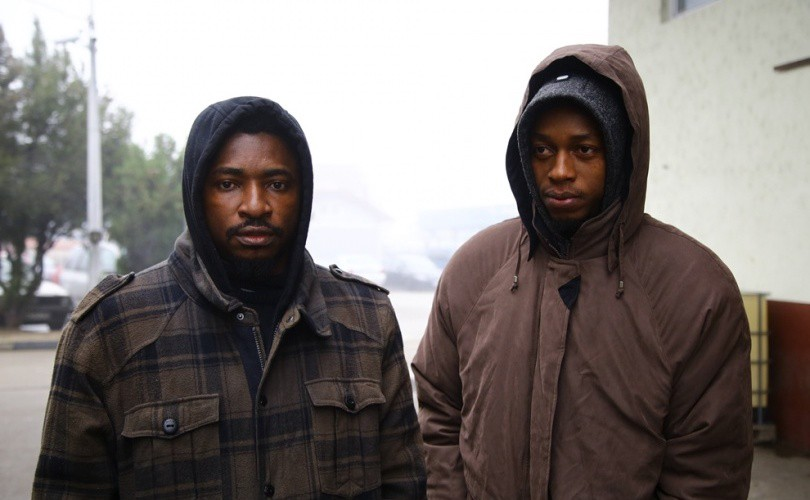
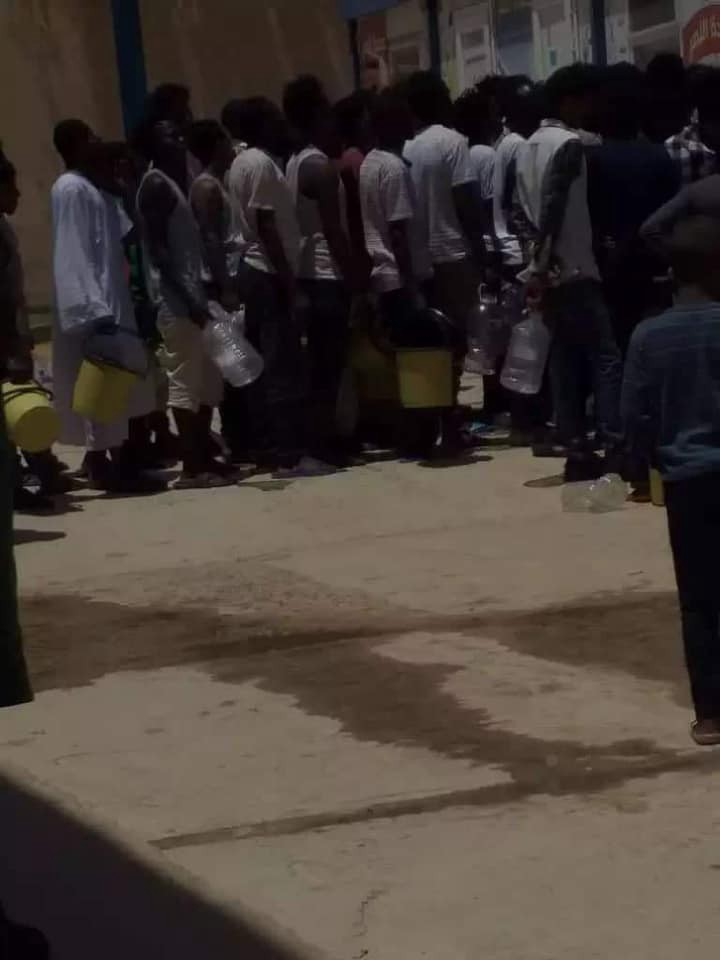
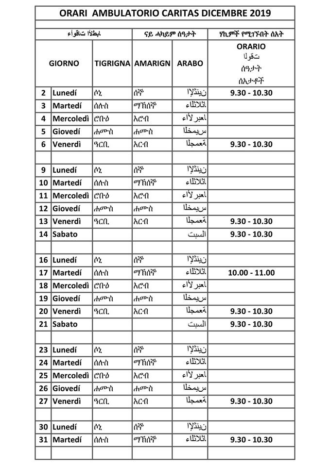
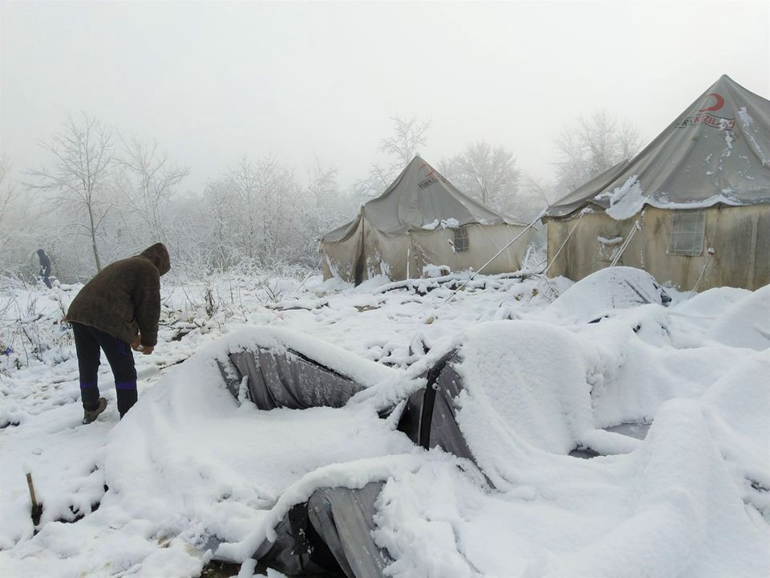

### AYS Daily Digest 03/12/19: Croatian police ‘pushed back’ two Nigerian students visiting the country for a sports competition
#### _Alan Kurdi_ and _Ocean Viking_ Finally Allowed to Dock in Italy///Greek Government’s Plan for the Islands Does Not Impress///Horrible Conditions in Bosnia’s Camps///Afghanistan Most Dangerous Country in the World, but Deportations Continue

Boys stranded in Bosnia and Herzegovina \(Photo: Adi Kebo/zurnal\.info\)

**Feature Story — Croatian Police Deported Two Nigerian Students to Bosnia and Herzegovina**

Abia Uchenna Alexandro and Eboh Kenneth Chennedu arrived in Croatia to participate in a table tennis tournament in Pula on November 12th\. They did not know that their sporting competition would end in a nightmare\.

After the tournament was over, their group went to Zagreb on November 17th to prepare for their flight to Istanbul, which was the next morning\. That night, Alexandro and Chinedu went out and were reportedly stopped by the Croatian police\. One of them described the ordeal to the Bosnian newspaper Ž [urnal:](https://zurnal.info/novost/22588/croatian-police-kidnapped-nigerian-students-and-transferred-them-to-bih?fbclid=IwAR1dG7YBCYyMs473BCakszKMgOejq9fO4M5dCQKqz2kKAmcmhaIuCqkl0lM)

> On entering the tram, we were stopped by the police\. They took us to the police station\. We tried to explain who we were and that our documents were in the hostel\. They did not pay attention to what we were saying\. 

The police then put the two in a van and drove them to a forest on the Bosnian border\. When Kenneth Chinedu refused to enter the woods, saying he had never even been to Bosnia, the police kicked them and [threatened to shoot them\.](https://zurnal.info/novost/22587/hrvatska-policija-kidnapovala-nigerijske-studente-i-prebacila-ih-u-bih?fbclid=IwAR08tQdPHLDvqnzEo9hsv2II-JKbYSRSOcidjtO_oj_C9y0NE9luk9x0oR0) Some other people also being pushed back helped them reach Miral camp in Velika Kladuša, from where the two young men were able to call their colleagues who were still back in Zagreb to mail them their passports\. After IOM confirmed their identities, their case was given to the Sarajevo\-based legal organization Your Rights\.

A video interview with Chinedu and Alexandro can be found [here](https://zurnal.info/novost/22587/hrvatska-policija-kidnapovala-nigerijske-studente-i-prebacila-ih-u-bih?fbclid=IwAR08tQdPHLDvqnzEo9hsv2II-JKbYSRSOcidjtO_oj_C9y0NE9luk9x0oR0) \. The two are still stuck at Miral Camp as of this writing\. We reported [yesterday](ays-daily-digest-2-12-19-left-to-die-trial-a-reminder-that-many-are-left-to-die-tonight-too-1ac48e89cce2) on the horrible conditions in the Bosnian camps, where people are not given adequate shelter from the bitter winter cold\. It is difficult to even imagine what any of the people living there must be going through, including these students\.

Unfortunately, this incident is simply the latest in a litany of violent acts the Croatian police has committed\. The police claims they have no record of having deported the boys, but they mostly don’t when they deport other boys, men, students, sons and daughters, fathers and mothers, even children, to Bosnia and Herzegovina\. The point is not that wrongdoing was made in the case of these two students simply because somewhere they had their passports, nor were they the first ones to be expelled from Croatia to Bosnia and Heregovina although they were never in that country, but the case simply brings the current illegal practice to a new, bizarre level\.

In the past two and a half weeks alone, the police [shot two people](ays-daily-digest-28-11-19-two-people-shot-by-croatian-police-in-less-than-2-weeks-52179785c7f9) and the government justified their actions by claiming the latest victim was [“resisting deportation actively\.”](https://www.jutarnji.hr/vijesti/crna-kronika/migrant-ranjen-u-gorskom-kotaru-policija-osoba-je-pruzala-aktivan-otpor-i-uzrokovala-opaljenje-iz-vatrenog-oruzja-lakse-je-ozlijeden/9676345/) The increased police presence and militarization of the Croatian border, coupled with the racist and far\-right turn that the state has taken in recent years, show that all people who are seen as “different” from the status quo are in danger of violence, regardless of immigration status\.
#### LIBYA
### Libyan Police Seem to Have a New, Secret Detention Center, Worrying Watchers

Photographer: Giulia Tranchina

In a [Facebook post,](https://www.facebook.com/photo.php?fbid=10157160708313621&set=a.10150438475713621&type=3&theater) Giulia Tranchina writes:

> In [\#Zawiyah](https://www.facebook.com/hashtag/zawiyah?epa=HASHTAG) the head police\-traffickers\-torturers [\#Osama](https://www.facebook.com/hashtag/osama?epa=HASHTAG) and [\#Bija](https://www.facebook.com/hashtag/bija?epa=HASHTAG) seem to have moved their business to another hidden detention centre after all the pressure and attention raised on their activities\. While many are still detained and tortured for ransom in the locked\-up hangar of \#Zawiyah for people caught are sea or raided in their streets and in their houses, it would appear that now the new groups of migrants captured at sea and taken back to Libya by \#Osama’s and \#Bija’s militias are being taken to a new hidden detention centre near \#Zawiyah, away from the public attention and exposure, so they can torture them and sell them in peace\. In the detention centre refugees have been left without clean water from days amd are being forced to drink the salty water from the toilets\. Many are sick and [\#UNHCR](https://www.facebook.com/hashtag/unhcr?epa=HASHTAG) has not been seen in a month\. Men, women and children detained from years, losing all hopes\. They need urgent [\#evacuation](https://www.facebook.com/hashtag/evacuation?epa=HASHTAG) 

The situation in Libya, while already dire, has been worsening in the past few weeks as more and more violence forced the UNHCR to [evacuate people from refugee camps to other countries](https://www.unhcr.org/news/press/2019/11/5ddbd69b4/third-group-refugees-evacuated-rwanda-libya-unhcr-support.html) \. Human rights abuses in Libyan camps are already well\-documented, so it is worrisome to think what the Libyan police and coast guard will do with even less oversight\.

ITALY
### New Hours for Caritas Intermelia

Photo Credits: Caritas Intermelia Organizzazione di Volontariato di Ventimiglia

More information can be found [here](https://www.facebook.com/caritasventimiglia/posts/3038530812841724?hc_location=ufi) \.
#### SEARCH AND RESCUE AT SEA
### Italy Finally Authorizes Docking of Two Rescue Ships After Days\-Long Standoff

[Late Tuesday night](https://www.france24.com/en/20191204-italy-authorises-arrival-of-two-ships-carrying-rescued-migrants) , the Italian government decided to allow the _Alan Kurdi_ to dock in Messina while the _Ocean Viking_ docked in the town of Pozzallo\.

61 people were stuck on board the _Alan Kurdi_ for 5 days in choppy seas while the Italian interior ministry refused them permission to land\. After urgent video messages from Sea\-Eye and appeals from other organizations, they were allowed to come ashore\. Many on board the _Alan Kurdi_ and the _Ocean Viking_ were in need of [urgent medical attention](https://twitter.com/msf_sea/status/1201806779849596928?s=21&fbclid=IwAR3wOkQv5d3i9XQoJ_YJ8nSXB1XH5da1IBvbAeTz_AsLNmnUz7lbnr3J2Uc) for injuries sustained during the crossing and while in camps in Libya\.

■■■■■■■■■■■■■■ 
> **[Alarm Phone](https://twitter.com/alarm_phone) @ Twitter Says:** 

> > The rescued on board the #AlanKurdi suffer in yet another shameful stand-off with the Italian interior ministry. We stand in solidarity with the survivors of the violent  European border regime and the crew of @[seaeyeorg](https://twitter.com/seaeyeorg)!  #portiaperti 

> **Tweeted at [2019-12-03 15:20:38](https://twitter.com/alarm_phone/status/1201883952920834048).** 

■■■■■■■■■■■■■■ 

Unfortunately, these people are lucky compared to others who also attempted to cross the Mediterranean\. Alarm Phone released that at least two boats that called them for assistance in the month of November [disappeared,](https://twitter.com/alarm_phone/status/1201770587439476736?fbclid=IwAR1W9IuVN8pIsoqaUD3OBFyz9e4SKLEZhdVG95v7eXYF0l0iaBR1hGcwFrk) presumed to be shipwrecked\. EU authorities did not respond to calls for distress and refuse to acknowledge these shipwrecks in an attempt to hide just how many people are dying because of draconian border policies\.
#### GREECE
### Greek Government Unclear About Its Plan for the Aegean Islands as Arrivals Continue

Dunja Milatović, Commissioner for Human Rights for the Council of Europe, called on the Greek government to share more information about the closed reception centers it plans to set up on the Aegean Islands after news of overcrowded, horrendous conditions in the current camps\. Her office urged the Greek government to consider deprivation of liberty “ [a measure of last resort](https://www.coe.int/en/web/commissioner/-/commissioner-seeks-information-from-the-greek-government-on-its-plans-to-set-up-closed-reception-centres-on-the-aegean-islands) ” and to provide other options for housing vulnerable people, especially children\.

In response, the Greek Minister of Citizen Protection clarified that the new, closed detention centers will not replace current camps such as Moria, but will [“operate in parallel”](https://twitter.com/LSpyropoulou/status/1201808982458929153?fbclid=IwAR36u2t_LFU51KLH4LXoVtxSsqifeZC6g5LnN1c_7RNqRE4aMeD8qU1XreA) \. Conditions in those existing camps are best described as “hellish\.”

Greece has time and again proved to be unable and unwilling to cope with the increasing flow of migrants to its islands\. Today alone, at least [ten boats carrying 387 people](https://www.facebook.com/AegeanBoatReport/photos/a.285312485325196/711336812722759/?type=3&theater) arrived in the Aegean Islands\.

Aegean Boat Report offers a summary of all arrivals in the month of November here:

■■■■■■■■■■■■■■ 
> **[Aegean Boat Report](https://twitter.com/ABoatReport) @ Twitter Says:** 

> > #GREECE: 558 boats carrying 20,475 people started their trip towards the #Greek #Aegean islands in November. 318 boats w/ 11,922 people were stopped by the #Turkish Coast Guard or Police, while 240 boats w/ 8,553 people made it to Greece.

Check out the full monthly report: https://t.co/6Um2UkjgCD 

> **Tweeted at [2019-12-03 13:57:32](https://twitter.com/aboatreport/status/1201863038204293120).** 

■■■■■■■■■■■■■■ 

In all of Greece, migrants are subject to surveillance and violence from the police\. In Thiva, [14 people were arrested](http://www.ekathimerini.com/247129/article/ekathimerini/news/police-arrest-14-migrants-following-camp-raid?fbclid=IwAR3R_E_Jjd7shsWqGjPX9cbxjU3qJEYrdqjtVqOwbCr4xRmO-PLkSkRQ6fc) after a police raid on a migrant camp, part of a wider pattern of checkpoints and detentions carried out by regional authorities\. In Athens, a police drone [crashed in Exarchia](https://www.keeptalkinggreece.com/2019/12/03/athens-exarchia-police-drone-crash/) as it was conducting surveillance\. This news come after weeks of police evicting squats in the neighborhood that were home to many people, including people without papers\. The state is using technology in addition to old\-fashioned violence and arrests to intimidate people with the excuse of “fighting crime\.”
#### BOSNIA AND HERZEGOVINA
### Winter Weather Causes Tents to Collapse in Vučjak Camp, EU Commissioner insists on immediate closure

Photo: Hannu\-Pekka Laiho

Horrible conditions in refugee camps across Bosnia and Herzegovina show no sign of improving as the weather gets worse\. Snow has been falling and temperatures are falling to [\-11 degrees Celsius](https://www.facebook.com/aidbrigade/photos/a.1845099678932346/2591962170912756/?type=3&theater) as more and more people are forced to sleep rough\. Even in official migrant camps, people have no safety, while in Vučjak there is not a single dry place to live as tents collapse from heavy snowfall and water comes into tents that are able to stay upright\. Wood is becoming too damp to burn, causing people to burn plastic bottles for warmth\. [These photos](https://www.facebook.com/permalink.php?story_fbid=2371952673116813&id=100009063096692&hc_location=ufi) come after the Commissioner for Human Rights Dunja Milatović called conditions in the camps “intolerable\.”

Her visit was greeted by protests from people living there who are demonstrating for better living conditions and a more dignified existence\. Residents are going on a [collective hunger strik](https://www.6yka.com/novosti/migranti-u-vucjaku-odbijaju-vodu-i-hranu-protest-zbog-nehumanih-uslova-u-kojima-borave?fbclid=IwAR00mkZjPpoCy63MKQcwTz_dhzf06lRhjq9reFixNYmnGl8uVXESo3tVCcE) e and refusing all water and food until better conditions are provided\.

> It is so embarrassing to live like [this](https://www.facebook.com/photo.php?fbid=10157740018584243&set=pcb.10157740022259243&type=3&theater) \. 

■■■■■■■■■■■■■■ 
> **[MSF Sea](https://twitter.com/MSF_Sea) @ Twitter Says:** 

> > Right now the temperature in #Vucjak camp in #Bosnia is -1 and the first snow has fallen. 600 people still stay in tents, many of them don't even have socks or proper shoes. Vucjak doesn't meet any humanitarian standards &amp; puts people's well-being in danger, it should close now! https://t.co/Ik62JvyosM 

> **Tweeted at [2019-12-03 13:12:09](https://twitter.com/msf_sea/status/1201851617643048960).** 

■■■■■■■■■■■■■■ 

The citizens of **Sarajevo** are collecting aid to support people in the streets of their city, as they struggle to approach providing aid to everyone they encounter and for the time being, they are collecting clothes, blankets and similar equipment that could help warm those in the most precarious situations\. Warm clothes and shoes for men are needed\. If you happen to be able to contribute, you can contact [Ines Tanovic Sijercic](https://www.facebook.com/tanovic.ines?__tn__=lC-R&eid=ARDiKLhyzXXH1NhUucr_OYbZs8ngY3Wl2vtg9JBwsI-qCvO0RpPdDoTyXZHZSSHNgv1eecI9fFubeRR1&hc_ref=ARRy0NEBDPGimSXb15v_-p18heHpPGA4LRoNvv8RIrGni_y6e0ZR6vCR920kmMFPN30&__xts__%5B0%5D=68.ARCcaFDTWQmEJzglsP8y1csFlgvcjtda3ZstJIh11KJCuiE4MHqdsJt3REegq-_dtLgGFF6l99PqnMkzCf_vumIXhFKDBOvShWsfb8aFiLEglTFI2mH8qrx1vNM4BssqGk5GHUfcrrG5x4PROY0iOS0vsMJaoBL4QfiEBibGOQH8OotVn2lcrLfTV_A7px7FYNGpjVkSVnQ4QS2jggtPTB-sSx3gY-yxNK5qQmhnea1ZokNEpxJQrKGoeFveF9DFidA) for more information on the current initiatives of the locals\. Also, some of the students have been collecting aid at their faculty, but the need is overwhelming\.
Also, international organizations based in BiH, AidBrigade and Fresh Response are calling for donations to be able to buy warm clothing and blankets for people across Sarajevo, many of whom do not even have socks\. More information on how to donate can be found [here](https://www.facebook.com/aidbrigade/photos/a.1845099678932346/2591962170912756/?type=3&theater) \.
#### SPAIN
### Arrivals to Canary Islands Are Up 57% Compared to Last Year

Even as overall arrivals to Spain have decreased by 50% compared to last year, the Canary Islands alone saw [58% more peopl](https://www.efe.com/efe/espana/sociedad/cae-un-54-la-llegada-de-migrantes-en-patera-pero-se-multiplica-canarias/10004-4124382) e arrive by patera in 2019 compared to 2018\.

These numbers are unprecedented since the Cayuco crisis of the last decade\.
#### NORWAY
### Oslo’s Former Bishop In Legal Trouble After Employing An Undocumented Person

Gunnar Stalsett, who is also the former General Secretary of the Lutheran World Foundation, [could face jail time](https://www.infomigrants.net/en/post/21249/former-bishop-of-oslo-faces-jail-time-for-employing-undocumented-migrant-from-eritrea?fbclid=IwAR0a6Os46EOoQE6iEeCj5TRH1b2HO4JELV-D5z_PkKR_vZtxwuzB6xktPck) for employing Lula Tekle, a woman who has been living in Norway for 14 years\.

According to Norwegian law, people whose applications for asylum or residency have been refused are not allowed to work in the country\. However, if their home countries are too dangerous, they cannot be deported\. Over 3,000 people are living in this legal limbo where they are not allowed to have a job or build a life for themselves in Norway but also have nowhere else to go\. Ms\. Tekle’s home country of Eritrea is characterized as an “oppressive regime” so she could not be deported, but since her residence permit was denied 14 months ago, she had no legal way of finding employment\.

Mr\. Stalsett characterizes his actions as civil disobedience\.

> The employment was directed against what I call an immoral order \[…\] The duty to help a human being in distress was more important than an unclear legal system\. 

Stalsett is due in court on December 19th\. His case highlights the increasingly draconian nature of Norwegian immigration law, which is now one of the strictest in Europe\. However, Norway is far from alone in using the purported refugee crisis as an excuse to violate the human rights of people seeking asylum\.
#### SWEDEN
### Sweden Threatens to Deport Father and Son Who Fled Torture in Afghanistan

Young Aliashgar and his family arrived in Sweden in 2015, fleeing the conflict in Afghanistan\. His father, Ali, had received serious threats while in Afghanistan and arrived in Sweden after being the victim of [severe torture](https://www.gp.se/nyheter/g%C3%B6teborg/mor-och-son-dog-nu-utvisas-familjen-1.20957746?fbclid=IwAR2-Ve5RsE9tR4bFU-J8ohuA6436mI6KXjh6HJzJ3QQOMRUlm7qENAHsaYs) \. Unfortunately, their tragic story did not end after arriving\. The mother of the family and a baby who was born in Sweden both passed away\. Now, the Swedish state is threatening to [deport](https://www.facebook.com/permalink.php?story_fbid=737070636775101&id=100014165134189) the little boy and his father\.

The Uppsala Conflict Data Program, ironically based in Sweden, recently named the conflict between the Afghan government and the Taliban the deadliest conflict in the world for the second year running\. Violence is only getting worse\. In the first ten months of 2019 alone, around [24,000 people died,](https://pcr.uu.se/digitalAssets/806/c_806526-l_1-k_ucdp-bulletin---afghanistan.pdf?fbclid=IwAR0ewfEMSP7bHDNKe4nJj00pgQhOZ275wuYfpZn3TQPv3zNRCBdHhJLnQ20) already 1,000 more casualties than last year\.

However, EU countries such as Sweden and Germany continue to classify Afghanistan as a “safe area,” using the justification that violence is concentrated only in certain regions\. The Afghan government has also been engaging in a deliberate campaign of misrepresenting the situation in its state, claiming it has full control of security and that most people who flee Afghanistan are simply economic migrants\. Deportations back to Afghanistan continue, despite the tangible danger returnees will face\.

In addition to physical danger, people who have been returned to Afghanistan experience psychological trauma, disdain from the state, and high levels of debt from their attempt to reach Europe\. There is concern that returnees, now a significant portion of the population, are vulnerable to radicalization and could further [destabilize the Afghan state](https://www.medico.de/fileadmin/user_upload/media/en/deportation-to-afghanistan.pdf) \.

Although we hope that the Swedish government will review the case of Aliashgar and Ali, allowing them to remain to their family’s graves, expecting mercy from immigration authorities is often a futile exercise\. Sweden’s actions have been widely condemned by those concerned about human rights\.

■■■■■■■■■■■■■■ 
> **[Anders Wijkman](https://twitter.com/AndersWijkman) @ Twitter Says:** 

> > Humanitär katastrof! Något annat omdöme kan inte ges Sveriges behandling av tusentals afghanska ungdomar. Många flyr till Frankrike, som p g a säkerhetsläget ej sänder någon tillbaka till Kabul, men hamnar i flertalet fall på gatan. Hur kan regering o riksdag?! 

> **Tweeted at [2019-12-03 20:50:49](https://twitter.com/anderswijkman/status/1201967045807661056).** 

■■■■■■■■■■■■■■ 

**Find daily updates and special reports on our [Medium page](https://medium.com/are-you-syrious) \.**

**If you wish to contribute, either by writing a report or a story, or by joining the info gathering team, please let us know\.**

**We strive to echo correct news from the ground through collaboration and fairness\. Every effort has been made to credit organisations and individuals with regard to the supply of information, video, and photo material \(in cases where the source wanted to be accredited\) \. Please notify us regarding corrections\.**

**If there’s anything you want to share or comment, contact us through Facebook, Twitter or write to: areyousyrious@gmail\.com**

_Converted [Medium Post](https://medium.com/are-you-syrious/ays-daily-digest-03-12-2019-croatian-police-kidnapped-two-nigerian-students-1e316422ce21) by [ZMediumToMarkdown](https://github.com/ZhgChgLi/ZMediumToMarkdown)._
