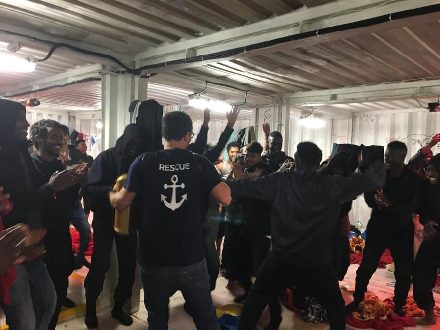
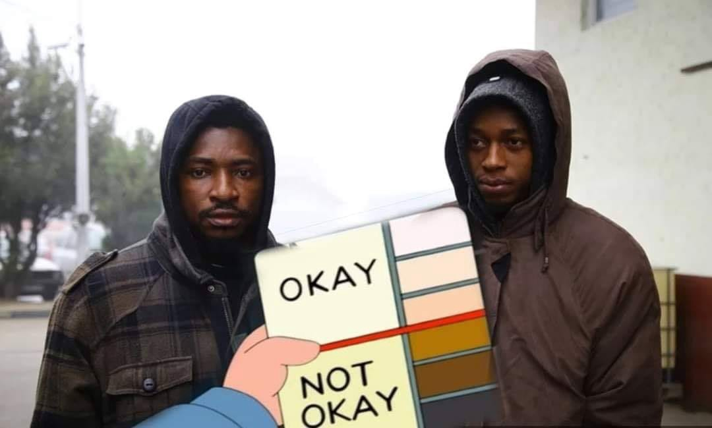

### AYS Daily Digest 4/12/19 Both Alan Kurdi and the Ocean Viking will disembark in Italy

_57 people died heading to Canary islands // New Greek closed detention plan possibly halted // Deportations from Germany and Sweden to Afghanistan // and more…_
### Feature: Both Alan Kurdi and the Ocean Viking will land in Italy

Photo by SOS MEDITERRANEE

In an update from [Sea Eye](https://www.facebook.com/seaeyeorg/videos/2433225263614899/?__xts__[0]=68.ARDkMDjnCU3u7u5JCKiaXbiImSiKAyL6USmaFnUK2odo688sna0SliGv7pUxcsw-jOlnMcZ0bJ1a7arAkGfCdsVt40lIVr5v7rP39wPR9flnGTQFDAglzhmarkBGCVTI8E_8VLWEw5o7SBcSkCUCc7IC2HtrRQbq2lU2ZJJ2x4Gyr7zgTVrsCRV5ya4XzNfTOLmTLcVw3HFi8PmCIq_3-JECEHhDGWz67XFQ97wGKhSA3wpCM6DQM8wqM9OACU3qwjsFOvDbGNs3vilBsbE58y6cBJAxHhm8pQwT0UCk7KfT8d-eSuocjAw9dZjAFL69NAz3oxPrQ5J87iIMGfbF7PUW8MJVFxg0BFy5gg&__tn__=-R) Wednesday morning:

> **“Finally, the news in the night: Safe Port for the ALAN KURDI in Messina\.** It’s over\. After rescuing 84 people from distress and a six\-day\-long stand\-off, our vessel was finally allow to dock in Messina, Italy\. 23 rescued persons had to be evacuated over the past days, among them three infants and twelve people, who collapsed unconscious on board our rescue vessel\. Even though ministers celebrate themselves for their deals, we are everything but satisfied\. Humans are not up for negotiation\. We urgently need a mechanism that allows for a swift and humane disembarkation\.” 

In an update from [SOS MEDITERRANEE](https://www.facebook.com/SOSMEDITERRANEE/photos/a.806663182774325/2600939250013367/?type=3&theater) on Wednesday:

> “Relief when Italian maritime authorities informed **the Ocean Viking** late last night that they have assigned Pozzallo to the rescued people on board as a safe place\. The 60 survivors who were rescued on Thursday will go ashore \(Wednesday\) morning\.” 

[Both ships](https://www.infomigrants.net/en/post/21302/migrant-rescue-ships-ocean-viking-alan-kurdi-permitted-to-dock-in-italy?fbclid=IwAR1c94XW9HsglfqyJx6lIEOg-hOu-yPcZKwU1xU-fJQWuDv6NE-Q5DB6BY4) rescued people on November 28th \(five days ago…\) \.
### Afghanistan

In an update from [UNAMA](https://www.facebook.com/pg/UNAMA.News/posts/?ref=page_internal) \(United Nation’s Assistance Mission in Afghanistan\): _“Afghans needing humanitarian aid up from 6\.3 million \(2019\) to 9\.4 million for 2020, a quarter of the population\. UN looking to raise US$732 million for 2020 to help the most vulnerable with emergency support\.”_
### Libya

D’Agostino, a notable journalist, notes that while the thread of the UNHCR spokeperson below does finally share some of the harshest facts about Libya, he adds that _“Instead of advocating for a failing ‘war on smugglers’ \(it doesn’t work, makes people less safe\), what about calling for legal passage for migrants?”_

Very true, but the thread does create a concise picture of the trafficking situation:

■■■■■■■■■■■■■■ 
> **[Charlie Yaxley](https://twitter.com/yaxle) @ Twitter Says:** 

> > East Africa refugees 4X more likely to be detained in Libya

Perception with smugglers that they can pay more money for ransoms+smuggling

Smugglers becoming increasingly brutal. Nearly all men tortured, nearly all women raped.  3/5

[mixedmigration.org/wp-content/upl…](http://www.mixedmigration.org/wp-content/uploads/2019/12/082_determinants_of_detention.pdf) https://t.co/xBqHHVkKN6 

> **Tweeted at [2019-12-04 10:43:42](https://twitter.com/yaxle/status/1202176645467189248).** 

■■■■■■■■■■■■■■ 

Also: “ _Smugglers and traffickers are increasingly diversifying their business models\. No longer so reliant on sea crossings\. Also look to make money from refugees through extortion, forced labour, recruitment to armed groups, selling people as slaves, etc\.”_ More [here](https://twitter.com/yaxle/status/1202176633031008256) \.
### Sea

At least 57 people have died in a ship wreck in the Atlantic off the coast of Mauritania on Wednesday\. Seventy\-four people in the same boat were able to stay alive by swimming to shore\. The boat left Gambia on Thursday carrying 150 people\. They were heading toward the Canary Islands, which continue to see an [increasing number of new arrivals](ays-daily-digest-03-12-2019-croatian-police-kidnapped-two-nigerian-students-1e316422ce21) for 2019 compared to the year before\. Learn more about this tragedy [here](https://www.laprovincia.es/sucesos/2019/12/04/60-muertos-naufragio-patera-iba/1233464.html) \.
### Greece

The government’s plan to build closed camps on the islands might be halted, since European Authorities told the Greek government that they are not willing to fund closed camps:

> “According to [tvxs\.gr](https://tvxs.gr/news/ellada/eyropaiko-stop-sta-kleista-kentra-kratisis) , the Greek government was informed last week by European officials that it is extremely difficult, until impossible to obtain funding for the construction and operation of closed pre\-departure detention centers, as in the two plans submitted by the Greek side to the European Commission for 2020 funding, no such request\. The first plan was drafted by the SYRIZA government and the responsible Minister Dimitris Vitsas and apparently did not contain any such plan for closed\-type detention centers\.” 

](assets/1d303c0420d/1*Tptbl8I1OAhCmCozzQQO-Q.jpeg)

**A four\-year\-old** arrived without any parents to Moria on Tuesday\. “He’s got pink crocs and dirty Olaf pants\. He’s probably from Syria…” Photo by [Trude Jacobsen](https://www.facebook.com/groups/763313107147281/permalink/1973386429473270/)
### Bosnia and Herzegovina

](assets/1d303c0420d/1*RXoObuoBPQKMCpclluLHJw.jpeg)

Vujak camp 2019\. Photo provided by [Info Migrants](https://www.facebook.com/InfoMigrants/photos/pcb.2423597541095350/2423632451091859/?type=3&theater)

As covered in yesterday’s digest, continued sever winter conditions are haunting Vucjak\. As Council of Europe Commissioner for Human Rights Dunja Mijatovic, said on Tuesday _“If we don’t close the camp today, tomorrow, people will start dying here\.”_

[4,000 people](https://erccportal.jrc.ec.europa.eu/ercmaps/20191128_DM_Bosnia_refugee.pdf?fbclid=IwAR3U6bVbSciyyvwmERdoRMNoGnzmTSbHnRFmMF0mFwjljPmdwr47oJguKCU) are estimated to be sleeping in these “rough conditions\.”

](assets/1d303c0420d/1*_9QFDdvd-3w0xyHLs8KdhA.jpeg)

“It snowed so heavily in Vucjak camp on the Bosnia & Herzegovina–Croatian Border last night that many tents collapsed\! This is what happens when the Balkan Route From Hell Freezes over\! \! But what about the almost 1000 men and boys living there?\! What about them\!” Photo by [Ruhi Loren](https://www.facebook.com/photo.php?fbid=3074963869187167&set=gm.529490177900899&type=3&theater)
### Germany

On the same day that the Japanese doctor was murdered in Afghanistan along with five others, Germany is deporting 44 men back to the country\. It was Germany’s 30th deportation to the country since December 2016 and the federal and state governments have deported 800 men\. Some the the 44 men were criminal offenders\. Learn more [here](https://www.greenpeace-magazin.de/ticker/44-afghanen-aus-deutschland-nach-kabul-abgeschoben-0?fbclid=IwAR3SfywZMcbuY7vOS_uw2E88x1pPlXUu1rI0dyI5UXmrsuvm_0MH7cmVhfM) \.
### Sweden

](assets/1d303c0420d/1*VDsG81rXr__xkuHDcJq-SA.jpeg)

“Protest: against the new forced deportation which as been ordered, Tuesday, 10 December 2019\! \! \! Stockholm: 1\. At The City Hall, Craft Street, 5:45 pm–7\.00 pm\. 2\. at the storage units in mast at 1:00 pm–until the buses go to Arlanda\. For Info: Elizabeth Golden, 0739 52 90 91” Photo by [Look at Sweden Now](https://www.facebook.com/LookAtSwedenNow/photos/bc.AbqG3SbsVFIflEThKij-U46toNEvg0XXe2ywWaWLJDUrMQ0zWW3WRt5Uya8YkG49lLE5yqRQTS2-exvOgkxuNXjg_VtwBkMBYMUZMQJMzWq3uvnoYBVaOlx2gvUsE134Yy2XsIvd6yy1btKewlVdpd0Hi1TfQwnbYokw3MfjDzVn0qJSVf_0r6K_uY4dssl6X_M/103065321184443/?type=1&opaqueCursor=Abp09vZpDAJVeITFob9-Hs3fvPxk_H_zG9LgugdLmLf2I07mVZpKfEAfdjm-pVfR_ILGiqnDGVOZUKI2C8G35nlxjIBua2RZLbBKoLoiGk2E4UZnkJ-TFymwu6LIYVWeVo-pAOB8m_DAurJKvOgF18P18twvnwg15JmbylV_veCzUh1jZhNMkve75t3P3U3BwGBI7tGVVWXv_SXyuh5EaUgwk01MYXrXTacfh8EhnFPdgXPmNGimpLcVfEQEZcxlz_aHePXcDdK0QaAgFmzsJXViTnmAEFnk-FdIpKeLuOOdm5ScTE9-fBgo2zJ_E1js99kt7-28eBNGL_40TslTlv_x9iBOkhJm_hhKMWtAM9PgJx1VH9jNb0Aze07kTWP9yyHSq7bfNDqVLu0LeKiaSFasaMwdnqJ7AITsxPCjjtsaZalqjKyNZ1wP1a3hVxOVz19-pZ1UyjoSK1pSgKbBQ-pD&theater)
### Lastly…

… in reference to the news from yesterday’s digest about Croatian police deporting Nigerian students to Bosnia and Herzegovina \(who had literally only come to the country to play in a tennis tournament\)…

“Sad but true” Photo provided by Erman Hadzic

**Find daily updates and special reports on our [Medium page](https://medium.com/are-you-syrious) \.**

**If you wish to contribute, either by writing a report or a story, or by joining the info gathering team, please let us know\.**

**We strive to echo correct news from the ground through collaboration and fairness\. Every effort has been made to credit organizations and individuals with regard to the supply of information, video, and photo material \(in cases where the source wanted to be accredited\) \. Please notify us regarding corrections\.**

**If there’s anything you want to share or comment, contact us through Facebook, Twitter or write to: areyousyrious@gmail\.com\.**

_Converted [Medium Post](https://medium.com/are-you-syrious/ays-daily-digest-both-alan-kurdi-and-the-ocean-viking-will-disembark-in-italy-1d303c0420d) by [ZMediumToMarkdown](https://github.com/ZhgChgLi/ZMediumToMarkdown)._
