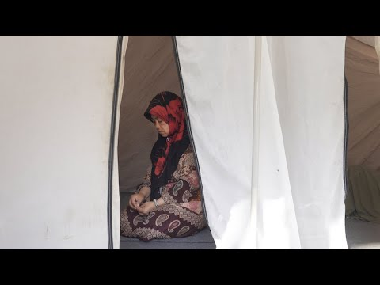

### AYS Daily Digest 5/12/2019 — Hand grenade thrown into minors centre in Madrid

Tragedy off the coast of Mauritania /// Athens: 15 squats occupied in response to government ultimatum /// Court rules in favour of people illegally pushed back to Libya by Italian authorities in 2009 /// 79 people arrive in the UK /// German ministers propose to lift the ban on deportation to Syria…

](assets/64ba7578e317/1*A5yzXTVkxsifow0NY59YVA.jpeg)

Artwork via [Gonzalo Semprun](https://twitter.com/gsemprunmdg/status/1202873166621814784)
#### FEATURE STORY: Hand grenade thrown into an unaccompanied minors centre in Madrid

[Media outlets](https://www.theguardian.com/world/2019/dec/04/grenade-thrown-at-migrant-childrens-centre-in-madrid) and local [organisations](https://www.facebook.com/RISpain/posts/3031039373591883) report that a hand grande was thrown into the unaccompanied minors centre in Hortaleza, northen Madrid borough\. The grenade was found by staff in the morning of December 4, and the bomb squad was called in to carry out a controlled explosion\.

The centre had been singled out and criminalised by far\-right party Vox during the last electoral campaign\.

In October and November residents of the centres were racially insulted and violently [attacked](https://twitter.com/javieritostone1/status/1202868098598146053) in a number of occasions, and nationalist and anti\-migrants organisations had rallied in front of the centre\.

Madrid’s council was [unable](https://spanishrevolution.org/pp-y-vox-bloquean-una-declaracion-en-madrid-para-condenar-el-atentado-en-hortaleza/) to pass a motion blaming the attack and the hate\-speech that caused it, due to the opposition of both Vox and the right\-ring Partido Popular\. Vox’s leader blamed instead the attack on the parlamentarian left, which according to him in fomenting hate against his party\.

The diffusion of racist behaviours and attacks is far from being exclusively a Spanish issue\. It is endemic in several other European countries\. Recently we reported about rallies against the opening of new reception centres in Greece, and about para\-military training of fascist groups in Slovenia\. Racist and anti\-migrant abuse and violence go often unreported and it is one of the key points of many right\-wing populist political groups throughout Europe and beyond\. Liberal organisations and politicians from all sides have too often accepted and incorporated this rhetoric in their ranks for political opportunism and to gain more votes\. These are the effects\.

IRAQ
#### Updates on the protests

We recently updated our special “ [Updates from local activists on the uprisings in Iraq](ays-special-updates-from-local-activists-on-the-uprisings-in-iraq-9ac3116198ac) ”, with latest news from the ground\. Read it\!

SEA
#### Tragedy in the Atlantic Ocean

Media outlets [report](https://www.theguardian.com/world/2019/dec/05/dozens-killed-as-migrant-boat-sinks-off-mauritania-coast?CMP=Share_iOSApp_Other&fbclid=IwAR18fG4E9gYxL4_sz2ZONxE72gW14eVIf8r2iPLHgcAcR8KT_z7Rw6oOR3Q) that Dozens of people have lost their lives during an attempt to reach the Canary islands from the Gambia\. The boat capsized off the coast of Mauritania, “in one of the deadliest disasters this year involving people attempting the perilous journey to Europe”\.

IOM [report](https://www.iom.int/news/fifty-eight-migrants-confirmed-dead-after-boat-gambia-capsizes-near-coast-mauritania) that at least 58 men, women and children died in the shipwreck\. The boat had left the Gambia on Wednesday 27 November, and it capsized while approaching Mauritanian coasts to get fuel and food\. 83 people managed to swim to shore, and they are reportedly receiving medical assistance in Nouadhibou, Mauritania\.

GREECE
#### Moria: camp’s conditions endanger women and girls

HRW [denounce](https://www.hrw.org/news/2019/12/04/greece-camp-conditions-endanger-women-girls) the disastrous situation in Moria, where Greek government and EU are showing their unwillingness to provide humane basic living standards to the over 16,800 \(as of December 2\) people living there, on a capacity of 3,100\.

Watch the video:

#### Woman dies in a fire in Kara Tepe, Lesvos

Movement On the Ground announced yesterday that [a 27\-year\-old woman passed away in a fire](https://www.facebook.com/pg/movementontheground/about/?ref=page_internal) that broke out inside her isobox\.

> The cause of the fire is still to be confirmed, but the fire unfortunately spread quickly, causing the neighbouring isobox to also burn\. The family inside the second isobox were able to escape unharmed\. 

> Our Kara Tepe team, together with other actors and site management, are providing support to the relatives and affected families\. 

> It is always difficult for us to share this kind of devastating news\. We will relentlessly continue to care for our residents during these hard times, however, we are being challenged — more than ever before — by the overwhelming humanitarian gaps and the pressing conditions on the island of Lesvos\. 

#### Athens: 15 squats occupied in response to government ultimatum

Today, December 5th, is the deadline of the 15\-day ultimatum imposed by the Greek government to all greek squatters for leaving their occupied buildings\. In response, Athenian activists have occupied 15 buildings in Exarchia, Kipseli, Gizi, Ilissia, Victoria and Agios Panteleimonas\.

> The first target is the deconstruction of the state rhetoric that demonizes squatted spaces with potential for self\-organization and their utilization by subjects of state repression\. In response to the Panhellenic call for action on December 5th, we have liberated 15 buildings \(15 is the number of your fate\) in the aforementioned areas, posting banners reading “Property is Theft,” and claiming the spaces to serve as a pool of options for future use\. 

Read the activists’ [statement](https://enoughisenough14.org/2019/12/05/athens-from-theory-to-practice-an-initial-response-15-buildings-liberated/?fbclid=IwAR3xilHS5V4jtgC0RiUQ3SDMEmXrwQWTPSkuPkDy3I9gfWPeXnIdiKmrXKc) \.

ITALY
#### Field workers on Strike in southern Italy against racist violence\.

After a migrant worker was ran over by a car in the port of Gioia Tauro \(Calabria\), today workers are [blocking](https://www.facebook.com/comitatolavoratoridellecampagne/posts/2914672115265561?hc_location=ufi) the port and an important motorway around Foggia \(Puglia\) \.

> Today, we are here to respond to repression, evictions and to the law that wants us even more subject to control and exploitation\. We are acting at the same time in Foggia and Gioia Tauro, two places where many of us field workers live, and where too many of us died\. 

#### Court rule that people illegally pushed backs from Italy have the right to apply for asylum in the country

In 2008, much before the so\-called “European migration crisis”, Italian government had already reached a deal with Gheddafi’s government, in order to prevent people fleeing from north African shores to reach Europe\. Under this deal, Italian maritime authorities have operated a number of illegal pushbacks, bringing back to the Libyan coast or to Libyan vessels [2,000 people](http://www.zalab.org/projects/mare-chiuso/) between 2009 and 2010\.

On November 28, a court in Rome [ruled](https://www.meltingpot.org/IMG/pdf/sent_22917_1_.pdf) about one of these illegal pushbacks, dating back to 2009\. A group of Eritrean citizens was [brought back to Libyan shores](https://dossierlibia.lasciatecientrare.it/riconosciuto-il-diritto-ad-entrare-in-italia-a-chi-e-stato-respinto-illegittimamente-in-libia/?fbclid=IwAR3mO15RV2b7lDgtxkqMB-S5tpYHn-Sw2y-ZGDsiq2-4B1H-gaQHhKheYPs) , and decided to attempt reaching Europe via a land route, in order to avoid risking their lives in the Mediterranean\. They have been stuck in Israeli territory since\. The judge decided that the very illegal nature of the pushbacks is reason to allow victims to come in Italy and apply for asylum\.

BOSNIA AND HERZEGOVINA
#### Locals halt preliminary visits for the opening of a new reception centre in Zivinice

Representatives of the Demining Commission, of the Civil protection, and of IOM have been [denied access](https://tuzlanski.ba/infoteka/u-kasarni-ljubace-mujo-muratovic-drzi-vise-od-200-divljih-zivotinja-nije-voljan-da-se-razminira-lokacija-i-omoguci-smjestaj-migranata/?fbclid=IwAR1cCCkXltFDxxLD88srZezasE0FoVn4oXVaptJc-BacHVOePawLmKFiqYg) to the the Ljubaca barracks in Zivinice, Mostar, by local residents and the owner of a wild animal sanctuary in the area\. Previously, local authorities had approved a plan for de\-mining the area and using it as a reception centre for people on the move\. Now, access was refused as the demining process and the “the placement of the migrants would cause considerable financial damage”\.

SERBIA

Updates from Info Park

On Thursday, Info Park [assisted](https://www.facebook.com/groups/144469886266984/permalink/464584177588885/?hc_location=ufi) 6 newly arrived individuals, who all entered Serbia through North Macedonia\.

Also, a man from Eritrea approached Info Park seeking protection and legal referral\. He stated he travelled to Romania on a visa, however being deported to Serbia by the Croatian police after he entered this country\. He was given information and referred to Belgrade Center for Human Rights for further legal counselling, as well as Serbian Commissariat for Refugees and Migration for the accommodation\.

GERMANY
#### ‘Dangerous offenders’ should be deported to Syria, ministers say\.

At the Conference of Interior Ministers in Lübeck, a number of participants proposed to lift the ban to deportations to Syria\. The public statements made by various interior ministers are contradictory and unsettle the entire Syrian community\.

For Hans\-Joachim Grote \(CDU\) the main problem is a practical one: “There is currently no contact person in Syria for us, that’s the difficulty, but the will to deport offenders to Syria as well as Afghanistan is here\.” According to Grote, the ministers of both CDU and SPD have already agreed\. “We want to conclude this tomorrow”, he concluded\.

Pro Asyl [denounce](https://m.facebook.com/story.php?story_fbid=2665543420157966&id=123103607735306) that focusing on criminal offenders, for whom no one has sympathy, is the first step to expand deportations to all rejected asylum seekers\. This is what happened for Afghanistan\. “A criminal can lose the status of a refugee, but not elementary human rights\. The European Convention on Human Rights also caters for offenders\.”

> The latest State Department report from the Foreign Office \(AA\) clearly states that there are no safe regions for returnees in Syria\. Laws on “general amnesty” have been ineffective, according to the AA\. The wave of arrests holds and endangers returning Syrians\. In March 2018, a database of 1\.5 million names wanted by the Syrian regime on warrant was published\. 

> Syria continues to be shaped by arbitrary arrests and torture — carried out by police, intelligence services and state\-organized militia who have their own wanted lists\. Returnees are systematically checked\. _\( [PRO ASYL](https://m.facebook.com/story.php?story_fbid=2665543420157966&id=123103607735306) \)_ 

Adopt a Revolution participated to the protest against the conference in Lübeck and [stated](https://www.facebook.com/AdoptaRevolution/posts/2645392018883883?hc_location=ufi) in response:

> When the federal government and the interior minister deport refugees to Syria, they make themselves accomplices of the war criminal and mass murderer Assad\. That must not happen: Refugees still need protection\. 

#### 5 months later, none of the people rescued by capt\. Carola Rakete has been accepted in Germany

In July, Sea Watch 3 vessel carried out a rescue and forced its entry into Italian port to secure a safe disembarkation to people on board\. The vessel’s captain was then arrested\. This caused indignation in Germany and prompted to government to assure its Italian counterpart that 14 of the rescuees would be transferred to Germany\.

Investigate Europe reveal that as of yesterday, 5 months after the rescue, no one arrived in Germany, and those 14 people still live in extremely harsh conditions in reception centres in southern Italy\. German Federal government, Regional government and Italy all blame each other and refuse to take any responsibility\.

[Read the whole story](https://www.investigate-europe.eu/the-forgotten-people-of-sea-watch-3/) \.

UK
#### Arrivals

Media [report](https://www.independent.co.uk/news/uk/home-news/migrant-rescue-channel-dover-boats-kent-border-force-a9233261.html?fbclid=IwAR3tydlXk0xXg1VKtuEcnKS7-KepOC2Ma05twYtFOfC_329qNzKVc_d2uD8) that 79 people arrived on Wednesday, crossing the Channel on five boats\. All have being taken to facilities were they will be interviewd to assess their claims for asylum\.

**Find daily updates and special reports on our [Medium page](https://medium.com/are-you-syrious) \.**

**If you wish to contribute, either by writing a report or a story, or by joining the info gathering team, please let us know\.**

**We strive to echo correct news from the ground through collaboration and fairness\. Every effort has been made to credit organisations and individuals with regard to the supply of information, video, and photo material \(in cases where the source wanted to be accredited\) \. Please notify us regarding corrections\.**

**If there’s anything you want to share or comment, contact us through Facebook, Twitter or write to: areyousyrious@gmail\.com**

_Converted [Medium Post](https://medium.com/are-you-syrious/ays-daily-digest-5-12-2019-hand-grenade-thrown-into-minors-centre-in-madrid-64ba7578e317) by [ZMediumToMarkdown](https://github.com/ZhgChgLi/ZMediumToMarkdown)._
