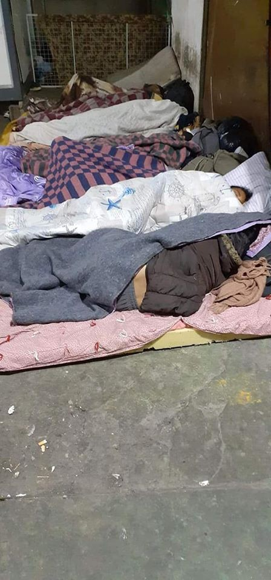

### AYS Daily Digest 09/12/19: App for People on the Move Launches in Turin
#### Police Patrols Increase Along Cyprus’ Dividing Line / 70 Minors Evacuated From Moria as Arrivals Continue / What Will Happen to The People in Vučjak? / People Are Paying to Reach Libya’s Detention Camps / & more news

](assets/bedd1860970b/0*F-vSdtJ29I7JE0cZ)

A man washes himself in the Sava river, Belgrade Photographer: [Vladimir Zivojinovic](https://www.facebook.com/photo.php?fbid=2821844477835370&set=a.634694756550364&type=3&theater)
### Feature — App with Useful Information for People on the Move Launches in Northern Italy

The ‘OASI on the street’ app, which launched [last week](https://www.infomigrants.net/en/post/21397/italy-a-refugee-app-made-by-refugees?fbclid=IwAR1UnEmtDNHr7TvjBL0_emZfAkuI40lk6DxyyeCvuEuITdlpeekUOI4SpAo) , features a map with useful information such as nearby toilets and dormitories and helps connect users to legal services\. It is useful for all people in need of an urgent place to stay or other services, whether they come from Turin or elsewhere\.

Source: mosaico

It was developed by Mosaico Association, an organization run by people from refugee backgrounds, with assistance from communication specialists Web & Com\. They hope that in addition to providing access to basic services, the app can give people access to information they need in order to navigate complicated asylum laws and make decisions about future steps\.

Mosaico was founded in 2018 after more and more people began using a route beginning near Turin and going through the Alps to cross from Italy to France, in response to increased border controls \(and increased border violence\) around Ventimiglia and on the Swiss and Austrian borders\. Unfortunately, this route goes through dangerous terrain that experiences severe weather\. This has caused [several people](https://www.thelocal.fr/20190208/migrant-found-dying-on-roadside-in-french-alps-near-italy-border) to die during the crossing\. Mosaico provides supplies such as warm blankets and maps as well as information to people arriving in Turin, many of whom have already decided to attempt the Alps crossing\. The app was created in order to provide a faster, more accurate way of delivering information to people who need it\.

While the app will certainly be a useful tool for people in Turin, ideally it would not even be necessary in the first place\. Increased border security and violence only pushes people to make more desperate choices that can lead to tragedy\.
#### LIBYA
### People Are Paying To Stay to Libya’s Detention Centers

Even as reports trickle out about the horrifying conditions in Libya’s detention centers and more and more people have to be evacuated to other countries as a result of increasing violence, hundreds are paying traffickers to [gain access to those centers](https://euobserver.com/migration/146837?fbclid=IwAR0GgwMn_K2edd13fhSQB1ssh_OKrRx0WAra3DJTKzRFeUbuyfxDxWnCgVU) \.

Many hope that once they get to the centers, they will be able to register quickly with UNHCR and be sent on to Europe\. Traffickers feed this false hope in order to extract money, even though many languish in camps for months and are subject to slavery, violence and rape\.

In response to what they see as refugees trying to “game the system,” the UN has announced that [food will be stopped](https://twitter.com/sallyhayd/status/1203936326497832960) to Gathering & Departure Facilities and people’s cases will not be evaluated until they leave\. As a result, over 100 people have agreed to leave the GDF, despite unsafe conditions outside of the camps\. Food is already running low because the UNHCR stopped feeding people who were released from Abu Salim prison over a month ago, and others have been helping them survive by [sharing](https://twitter.com/sallyhayd/status/1203956854210121729) their own meager meals\. There is no explanation as to why certain groups of residents received food and others did not; since people were still being fed it is clear that the problem did not lie in a lack of food but that the choice was made as an intimidation tactic\. Many are starting to lose hope, according to the testimony of a person living in a GDF\.

> Humanitarian organizations and human corridors not mind or care about us\. 

Despite the UNHCR’s efforts to dissuade people from coming to camps by any means necessary, even inhumane ones, for many their best hope for survival is reaching a GDF\. As the conflict in Tripoli worsens, those who are visibly foreign, especially Africans, are at an even higher risk of violence, abduction and slavery\.

Even as one million Libyans have fled to Tunisia, an estimated 46,000 refugees from other countries are currently in Libya, living under horrible conditions\. European states have been stingy with accepting asylum seekers\. This is just the latest desperate measure people are taking to improve their lives within an unsympathetic system\.
#### CYPRUS
### Increased Security Comes Back to Cyprus’ Dividing Line

Interior Minister Nicos Nouris [announced](http://www.ekathimerini.com/247337/article/ekathimerini/news/nicosia-steps-up-dividing-line-patrols-amid-migrant-influx?fbclid=IwAR2ADBiRDMPR9p569XeCkCPVfwhVtF-KGUjgL92zTUs0L-iVD-z_RVQDhqQ) 24\-hour police and military patrols especially around the nation’s capital, Nicosia, to stop people who are crossing the border\. He says these measures are done in part to “bolster citizen’s sense of security\.”

The island has seen an influx of people from the Middle\-East who come from the Turkish north and then cross the dividing line to reach the south and request asylum\.

The last few years in Cyprus have seen a gradual increase in communication and crossing, across the ethnically\-divided island\. In addition to formal peace initiatives, sections of the 180\-kilometer dividing line became porous on their own after guard posts were abandoned\. It is disheartening to see an uptick in securitisation of the border, especially when it is done as a response to baseless panic about migrants\.
#### GREECE
### Horrible Conditions in Moria Continue, Despite Some Attempts to Improve

The Greek National Organization for Public Health is planning a mass [vaccination](http://www.ekathimerini.com/247341/article/ekathimerini/news/health-body-plans-mass-vaccination-of-children-teenagers-at-moria-camp?fbclid=IwAR3vKlK9SgJEBALeE6N-YmXoyu3WZ5GPoAEWkYbe3x8znuae95SqJVpUtHI) of children and teenagers against measles, rubella, mumps and pneumonia\. They hope this measure can help prevent epidemics in the camp, where many people are vulnerable to disease as a result of overcrowding and unsanitary living conditions\.

70 minors from Moria will receive asylum in Berlin, and other German states have announced they will also accept small groups of unaccompanied minors\.

While we hope that these 70 minors will be able to start a new life in Germany, there are still [4,100](https://www.infomigrants.net/en/post/21409/70-unaccompanied-migrant-children-to-fly-from-lesbos-to-berlin?fbclid=IwAR3q3s_b8nSvo8Q3xNJOAc76FZT3lTk1ILy-qxM5ppQbgIc1PQQlmjld7_8) unaccompanied minors left out of the over 17,000 people in Moria\. Those people also deserve dignified living conditions, which they cannot find in Moria\.

■■■■■■■■■■■■■■ 
> **[Franziska Grillmeier](https://twitter.com/f_grillmeier) @ Twitter Says:** 

> > City Bus of Mytilini, transporting hundreds of people from the camp daily into the port town to breath, get money, go to the pharmacy or see a lawyer, parked in front of the overcrowded military facility of #Moria. Juxtaposed realities. #refugeesgr https://t.co/6VcLXGgeJu 

> **Tweeted at [2019-12-09 09:41:40](https://twitter.com/franzieire/status/1203972976397504512).** 

■■■■■■■■■■■■■■ 

In case you needed a reminder about what life in Moria is really like, MSF International published a video about it\.

■■■■■■■■■■■■■■ 
> **[MSF International](https://twitter.com/MSF) @ Twitter Says:** 

> > Lesbos is one of the most beautiful islands of the Aegean Sea. 

We'd like you to see some of the most hidden places on the island. 🌊🌞 https://t.co/TjceNj06uz 

> **Tweeted at [2019-12-08 11:07:00](https://twitter.com/msf/status/1203632060272742401).** 

■■■■■■■■■■■■■■ 

Arrivals to Greece continue\. [29 people](https://twitter.com/smhumanitario/status/1204154519136931845?fbclid=IwAR2vVOGpn8rxIFeYoZDq2LSms61T5pZY7ZbHEW2uPClCeF_PkhiWoakBhsk) arrived in Chios late Monday night, in addition to the [1,256 total arrivals](https://twitter.com/ABoatReport/status/1204067154313789440?fbclid=IwAR0e5v-7IaDB48vXDwhQu2u7DCnb9nSaneKxMYfiwKra5K1CtAAJmyEebfY) of the past 6 days\.

■■■■■■■■■■■■■■ 
> **[Bruno Tersago](https://twitter.com/BrunoTersago) @ Twitter Says:** 

> > There are now more than 40,000 refugees and migrants on the Greek islands. 
Lesvos 19,518 - Moria 17,330
Chios 5,978 - Vial 5682
Samos 7,791 - Vathy 7502
Leros 2,519 - camp 2,273
Kos 4,289 - camp 3,913
other islands 218
Total 40,313 

> **Tweeted at [2019-12-09 15:57:38](https://twitter.com/brunotersago/status/1204067590060068864).** 

■■■■■■■■■■■■■■ 

While people languish in unsanitary camps, a political battle is being fought in the Mediterranean\. Turkey’s treaty inventing a maritime border with Libya has been met with [outrage](http://www.ekathimerini.com/247348/article/ekathimerini/news/eus-borrell-says-turkey-libya-maritime-border-deal-problematic?fbclid=IwAR33wu1yQoc8WLs1kbyADFZjPSWQF-fYJCGZxTr_A5JVFJwxR-is60yFYTo) from the EU, especially from Greece, which called on the EU to [impose sanctions](http://www.ekathimerini.com/247355/article/ekathimerini/news/dendias-asks-eu-to-condemn-turkey-libya-mou-impose-sanctions-if-law-is-ignored?fbclid=IwAR3NkRU-nMIWL65kp7N9Qqmv74S-7m2IKhLJoh37TtpU6UgmXnzOrkBxtM4) \. The deal was met with internal resistance in Libya as well, with Aguila Saleh, the speaker of the House of Representatives, calling it “ [null and void\.](http://www.ekathimerini.com/247339/article/ekathimerini/news/libya-parliament-speaker-denounces-turkey-pact?fbclid=IwAR3eKJEAmzFCA47eOdS01QDy_Gws15zF5sB0zBXCBxNbLeHxV5ccH-VA0wI) ” For now, cooperation between the EU, Turkey and Libya on pushback of people trying to cross the Mediterranean continues, but the political conflict may strain existing agreements\. Whatever happens, it is probable that the first people that will suffer due to any increased conflict or tension in the region will be the most vulnerable\.

Our friends from Mobile Info Team, an NGO based in Thessaloniki which provides informational support and individual assistance for asylum\-seekers and refugees, are organising their first ever fundraiser — ‘Party Extravaganza’\! It will take place on Wednesday \(in 2 days\! **the 11th of December\) from 7pm\-12am, at the converted factory space of Fix in Art \(26is Oktovriou 15, Thessaloniki 546 27\) \.**

The event will feature local musicians and DJs, art exhibitions from local young artists, a winter collection by IHA \(please bring men’s winter clothes, sleeping bags and blankets\! \), raffle prizes \(including The Body Shop products and vouchers for a women’s clothing store\), a bar, photographer, and more\!

Even if you can’t make it to the event, simply purchasing a 5 Euro ticket will still help to fundraise\. The 5 Euros will go directly to the cause, because the event sponsor, The Body Shop, has covered all operational costs\! Find out more information, including what the money raised will be used for, in the links below:

Purchase tickets / donate here: [https://partyextravaganza\.yapsody\.com/](https://partyextravaganza.yapsody.com/?fbclid=IwAR1JvLnNBViTxYFmjH0Ma5hlHqSKdaB7mGmPwgv4xxZuunbq1Ioz9PvFcP8) 
Facebook event link: [https://www\.facebook\.com/events/1845291362271010/](https://www.facebook.com/events/1845291362271010/)
#### SERBIA
### 37 New Arrivals in Belgrade

The Belgrade\-based refugee center Info Park has identified 37 new arrivals, mostly from Syria and Afghanistan who arrived via North Macedonia\. This brings the total number of people present in the Savamala area up to 412, including many minors\. Although there are centers solely for unaccompanied minors, many are reluctant to go there because that would require splitting from their travel companions who may be their only sources of security and stability at the moment\.

As winter falls, more arrivals are expected\.
#### BOSNIA AND HERZEGOVINA
### Rumors That Vučjak Might Be Shut Down This Week Continue

The officials have spread the news that Vučjak will be shut down [earlier this week](https://www.facebook.com/InfoMigrants/?__tn__=%2CdkCH-R-R&eid=ARDljSQuucsOsqYdT7V1BCqp0pgmYTXMKNiDoaucvO4oufI9M1Bm-SldbpImKtY3s4yfsb7tkA6QTJTi&hc_ref=ARQguXJYzOafmoV_WC3lf74GYSfgZS-xlBGQr3iyi5mi8y9TwESOC039BNpy0bdSwLo&fref=nf&hc_location=group) , but other sources confirm that the media will not be welcome on site once this starts happening, most likely in the early morning hours\. This decision comes after harsh criticism from the Council of Europe Commissioner for Human Rights, Dunja Milatović, and a hunger strike by people living there\. Plans have been made to close the camp before without success and details around the closure are still unclear to the public\. Already plans to transfer people to other places in Bosnia and Herzegovina have been [postponed](http://www.ansamed.info/ansamed/en/news/sections/generalnews/2019/12/09/bosnia-postpones-vucjak-refugees-transfer_45ba1350-4f5c-4afd-8c48-eeb7fe65b982.html) with no explanation, due to political disagreements and the question of money, of course, so it is doubtful that the camp will close in a timely manner and with access to the journalists to follow what \(and how\) is going on\.

As authorities dither on closing the camps, horrible living conditions continue\. [These photos](https://www.facebook.com/lorena.fornasir/posts/2562787923838289?hc_location=ufi) are from the official IOM run Bira camp in Bihać\.

Photographer: Lorena Fornasir

More and more people continue to be pushed back into Bosnia and Herzegovina\.
#### ITALY

A pregnant mother and her four children who were rescued from a sealed train wagon near Trieste on Friday have settled into a [Caritas center](https://www.rainews.it/tgr/fvg/video/2019/12/fvg-bimbi-siriani-famiglia-treno-merci-opicina-stazione-vagone-migranti-c46499d3-2440-4fda-8918-461ee0c162b2.html?wt_mc=2.www.fb.tgrfvgita_ContentItem-c46499d3-2440-4fda-8918-461ee0c162b2.&wt&fbclid=IwAR19AIdwIpCQjpfEkY1BIHixClpMOd4svzzy53C3LvQNaghJyCO_MffiayY) and are recovering from their ordeal\.

In Sardinia, [Macomer’s CPR](https://www.unionesarda.it/articolo/news-sardegna/nuoro-provincia/2019/12/08/il-cpr-di-macomer-riapre-il-18-dicembre-in-arrivo-un-centinaio-di-136-962368.html?fbclid=IwAR2QmRpGz4OczQu4SHeojt5313p4oXxeo3TfOfA9GKkx2nN8aquUhEdU_C8) is rumored to be reopening on December 18th, although all details surrounding its operations are shrouded in complete secrecy\. All the public knows is that about a hundred people are expected to arrive\.
#### SWEDEN
### Despite Outrage, Group Deportation Planned for Tomorrow

The Swedish government is planning a group deportation from Stockholm’s Arlanda airport tomorrow\. In response, protests will be held outside City Hall where the Nobel awards dinner is being held\. More information about the demonstration can be found [here](https://www.facebook.com/groups/212935029139489/permalink/829509357482050/?hc_location=ufi) \.

News of these deportations come after outrage over the weekend that the Swedish government [deported a young man named Abbas](https://www.dagen.se/nyheter/pastorn-jag-foljer-abbas-anda-till-arlanda-om-det-kravs-1.1630043?fbclid=IwAR2MWJGAZ_gj1_bOBOTPRSVnjxet-8Q8_43FtoDgs7MtE4Oom0lMhbv8ALQ&paywall=true) back to Afghanistan a day earlier than planned\. Abbas is a devout Christian who is at risk of persecution for his faith back in Afghanistan, but the state did not believe his claims of religious persecution\. Although the Uppsala Conflict Data Project recently named Afghanistan the most dangerous country in the world, Sweden continues to deport people back to there, including [children](https://www.facebook.com/permalink.php?story_fbid=737070636775101&id=100014165134189) \.
#### GENERAL
### Legal Centre Samos — ASF France is Looking For A Greek Lawyer to Join Its Team\.

The ideal candidate is specialized in human rights, has field experience, and is fluent in French or English\. More information about the job posting can be found [here](https://www.facebook.com/LegalCentreSamos/posts/446748849602331) \.

**Find daily updates and special reports on our [Medium page](https://medium.com/are-you-syrious) \.**

**If you wish to contribute, either by writing a report or a story, or by joining the info gathering team, please let us know\.**

**We strive to echo correct news from the ground through collaboration and fairness\. Every effort has been made to credit organisations and individuals with regard to the supply of information, video, and photo material \(in cases where the source wanted to be accredited\) \. Please notify us regarding corrections\.**

**If there’s anything you want to share or comment, contact us through Facebook, Twitter or write to: areyousyrious@gmail\.com**

_Converted [Medium Post](https://medium.com/are-you-syrious/ays-daily-digest-09-12-2019-app-for-people-on-the-move-launches-in-turin-bedd1860970b) by [ZMediumToMarkdown](https://github.com/ZhgChgLi/ZMediumToMarkdown)._
