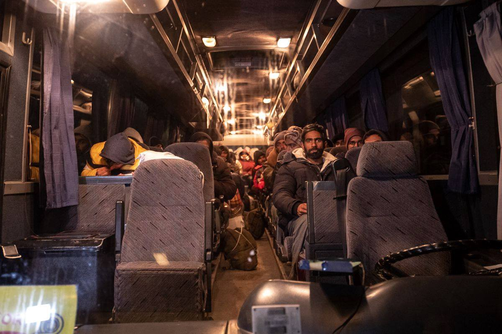
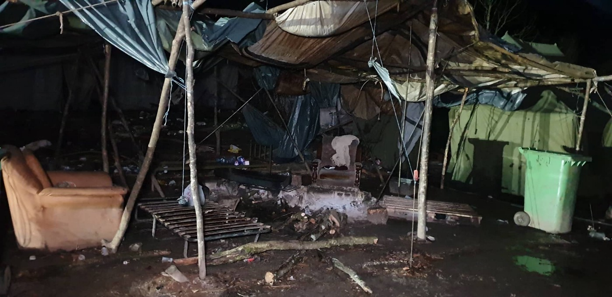
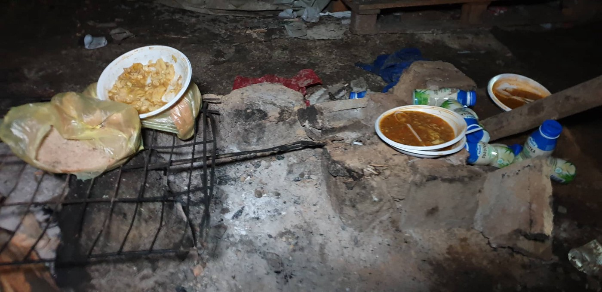
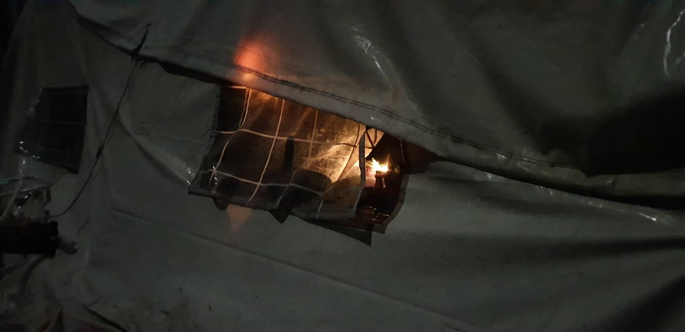
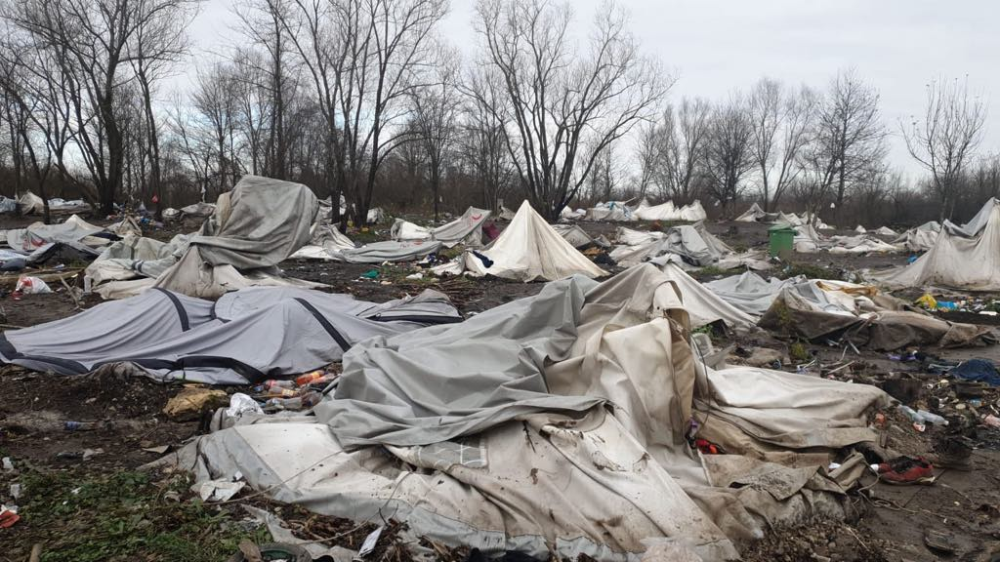
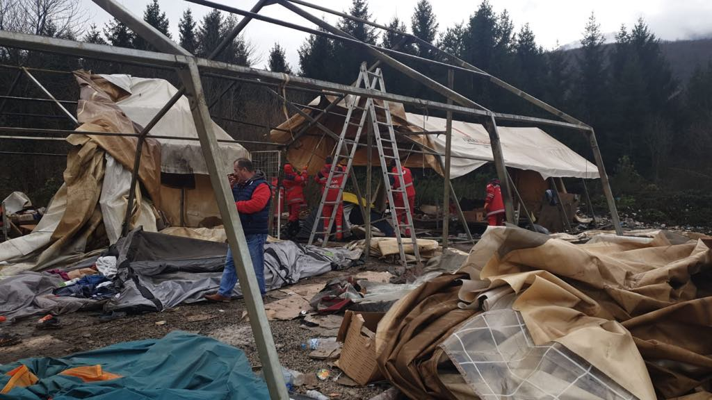
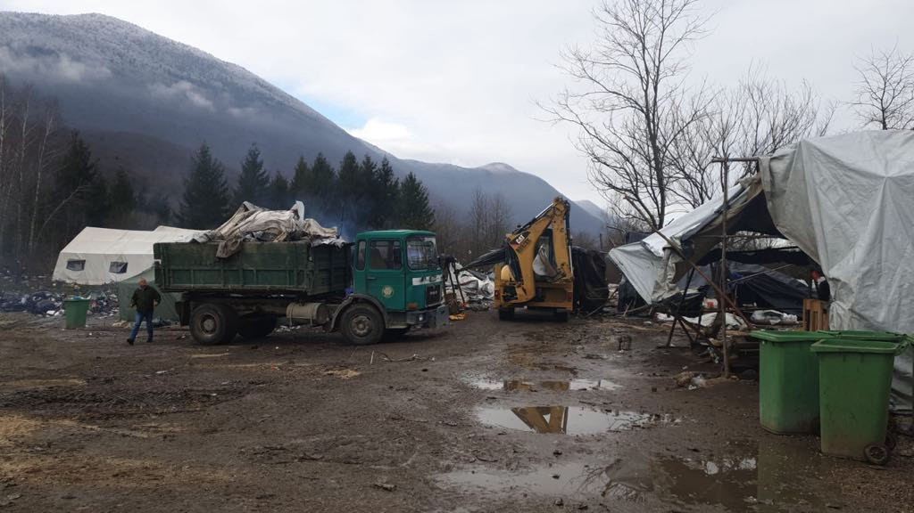
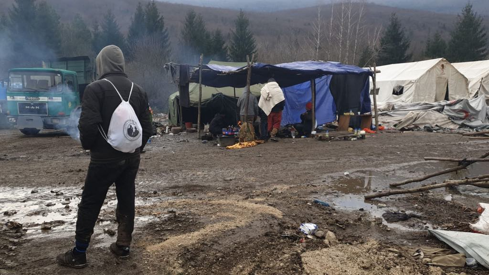

### AYS Daily Digest 10/12/19: Vučjak evicted, six young people froze to death in Greece
#### The victims of freezing were two women and four men, aged under 30 years old / AYS in the Vučjak camp: the horrid place is being bulldozed down, but the people are returning / Turkey begins resettling refugees in Northeastern Syria / Deportations from Sweden continue ahead of schedule / Donations needed\!

Eviction of Vučjak camp: people were taken to Ušivak near Sarajevo, but many have already returned to the border region in hopes of entering Croatia\. Photo: AYS
#### FEATURED
### With all eyes set on overcrowded island hot spots, pushbacks at Evros are happening at large and people are dying in the Northern Greece

Although most of the people enter Greece from the coastal side, many still opt for the Evros land corridor, in spite of the dangers that didn’t pass by this side of the border crossing as well\.

> Thousands of people are trapped in freezing conditions, and it is reported that in northeastern Greece six people have lost their lives due to cold\. 

The victims were two women and four men, aged under 30 years old\. Their identities and nationalities were unknown, according to the official report\.
In winter temperatures in the area drop well below freezing and many people who manage to reach the area are left with few options, thus being in risk of freezing if nobody provides them with any assistance, as the case is at the moment\.

As we wrote earlier, Mobile Info Team have published a [report](https://static1.squarespace.com/static/597473fe9de4bb2cc35c376a/t/5dcd1da2fefabc596320f228/1573723568483/Illegal+Evros+pushbacks+Report_Mobile+Info+Team_final.pdf?fbclid=IwAR2824qpEiQfOlr5PgB7bu9HzwQqsv0fryn4lHB-qvqpe_UJ6tSgA8dzH3k) on pushbacks from Greece to Turkey in the Evros region\. They have been gathering data since August 2018 and have brought together 27 testimonies from people who have experienced this illegal practice\.

The procedure is similar in all cases\. Firstly, arrest and capture by Greek police inside Greek territory, then detention and confiscation of personal property, followed by coordinated handoffs/transfers to authorities and finally, collective expulsion across the Evros River in small boats\. Read more [here](ays-daily-digest-27-11-19-evros-pushbacks-report-human-rights-abuses-at-greece-turkey-border-dec9c89045fe) \.

On the coastal side, the [Aegean Boat Report](https://www.facebook.com/AegeanBoatReport/?__tn__=%2CdkCH-R-R&eid=ARCx8bPnA9aTwdvEMQ2TPKK_1QT4bdMcHGTDtN5QH2PSoePRVtkgBa56AfMuVgblADFvI3UavPc9FK7x&hc_ref=ARSflvp2Y041nK_sLyA-MPWsETp_Jo4ogBG6rFd-Jv6MZCtg74FZ2mxt1q1TApfiDf8&fref=nf&hc_location=group) team reports that they noticed although arrivals on the Greek islands usually calms down this time of year, this year it was not the case\. The Hellenic Ministry of Public Order and Citizen Protection announced that over the past weekend, the number of migrants stuck on the islands in the eastern Aegean Sea had officially reached **40,313\.**

**In the last three days alone, 25 boats have arrived on the islands, carrying 841 people\. 18 of these boats arrived on Lesvos, 721 people\.**

](assets/89213a668ca9/1*feXrzbuJZolpPW6B-5FCcA.jpeg)

Photo: [Aegean Boat Report](https://www.facebook.com/AegeanBoatReport/?tn-str=k%2AF&hc_location=group_dialog)

The government announced once again they plan to move another 10,000 people to the mainland by the end of the year, but that is in less than 3 weeks, and skepticism arises from all sides\.

> Greek government announced some time ago that they would reduce population on the islands by the end of the year, what we are seeing is the opposite\. For the first time since the refugee crisis started, population on the Greek islands exceeds 40000 people, 50% of them live on Lesvos\. In the last six months, total population on the Greek Aegean Islands has gone from 16300 to 40631 people\. 

> In 2018 32156 people arrived on the Greek Aegean islands, so far this year 56600 has arrived, and most likely we will see 60000 by the end of the year\. — ABR 

For more detailed statistics and information on boat arrivals to the Aegean islands, go to [aegeanboatreport\.com\.](http://aegeanboatreport.com/?fbclid=IwAR2euPqS2TUrkeU5LbvJ76VfOaSmTnp2_IygfRkxdih1jnqe178nmzPLbbA)

With the introduction of the new law \(according to this law, rejected asylum seekers who had entered the Greek mainland from neighboring Turkey will be sent back to Turkey as quickly as possible\), everyone expects the number of deportations to Turkey to rise\. However, in spite of the visits by all the high Commissioners and heads of the EU states in Greece, nobody seems to be coming up with a new solution that would work in favor of the human rights that everyone loves to celebrate so much\.

■■■■■■■■■■■■■■ 
> **[NoBorders](https://twitter.com/Refugees_Gr) @ Twitter Says:** 

> > Lesvos, Greece November 2019
In Moria refugee camp
Photograph by Ayhan Mehmet
#noborders #refugeesgr 
(from Art Against) https://t.co/eMNXaTMtrj 

> **Tweeted at [2019-12-10 13:27:55](https://twitter.com/refugees_gr/status/1204392298114682880).** 

■■■■■■■■■■■■■■ 

#### BOSNIA IN THE FOCUS
### Dismantling Vučjak camp: hundreds taken by buses to Sarajevo, only to return to the region

On Tuesday morning, first evictions started taking place in the notorious Vučjak camp in Bosnia, near Croatian border\. Built at the old landfill, Vučjak became a symbol of dehumanization of refugees and lack of sustainable solutions for people on the move in the Balkan region\. Eviction took place following the immense pressure from the EU to close the inhumane camp\. AYS provided the most comprehensive report on violations of human rights in Vučjak and Northen Bosnia, you can find it [here](ays-special-documenting-human-rights-violations-in-vu%C4%8Djak-camp-923607ace85d) \.

Around 350 hundred were taken to Ušivak camp near Sarajevo, until the new camp in the old military complex is prepared to host them\. A lonely Afghan man spent the night in the camp, having returned from “the game” injured by beatings of the Croatian police\.

Vučjak after closing on December 10 in the evening, as the last buses took the people to Sarajevo\. Only one injured man remained in the camp\. Photo: AYS

During the night, some of ex\-Vučjak residents have already appeared in the camps in the Una\-Sana canton, a Northern part of Bosnia from which they were taken away in order to “relieve the pressure” and reduce the number of border crossing attempts\. Many decided to hide in the landmine\-filled forests, in order to remain in the area and attempt new crossings\. Some of them returned to Vučjak in the morning, only to see it being bulldozed down by the local authorities\. This seems to be the final end of one of the most horrid parts of their journey, but it will not discourage them from their path towards EU\. It is expected that more people will now move towards informal camps in the Una\-Sana canton, which are regularly evicted by the police\. No sustainable solution is still in place for those on the move\.

Some residents have returned to the camp, only to see it demolished\. Photo: AYS
#### SYRIA/TURKEY
### People forcibly resettled to Syria

As Turkey Begins Resettling Refugees in Northeastern Syria, continued reports of atrocities by the Turkish\-backed Syrian National Army that now controls the area also raise fears that Turkish proxies are committing a form of ethnic cleansing by relocating people of Arab descent into the region while preventing the Kurdish population from returning\. Information provided to [_Foreign Policy_ i](https://foreignpolicy.com/2019/12/09/turkey-resettling-refugees-northeastern-syria/?fbclid=IwAR0r1txbQVS5evnmr-1iNnVhqG27Y2kewxSGs9K_AFY-nICrg_fCAtXUMd0) ndicates that the people now being resettled in the region are largely the families of Turkish\-backed fighters who are originally from elsewhere in Syria and are primarily Arab and Turkmen\.

The UN seem to have [reportedly](https://syriadirect.org/news/how-many-civilians-are-returning-to-the-turkish-%E2%80%98safe-zone%E2%80%99/?preview=1) lost much of its access to on\-the\-ground information due the conflict and the [subsequent flight](https://www.impact-repository.org/document/reach/98bdb4a5/REACH_SYR_Situation-Overview_Market-monitoring_October_2019.pdf) of international nongovernmental organizations, which it previously relied on for monitoring\.

> “At present, all deportations to Syria are illegal, because of the nature and severity of the human rights risks there, and people who have been returned have indeed been directly exposed to such dangers,” 

— Amnesty International said in their recent report\.
#### GREECE

> **Total official capacity in all the islands is 6178\. At the moment the number of people trying to fit into those parameters is 40,395 \.** 

 to 17800 \.](assets/89213a668ca9/1*dWQd2E9FXw9nbsB8Vqxo_g.jpeg)

9 boats arrived in Lesvos today carrying 351 refugees bringing up the number of human being stranded in [\#Moria](https://www.facebook.com/hashtag/moria?epa=HASHTAG) to 17800 \.
### Support the ground teams

> **A Drop in the Ocean** work to improve the lives for refugees\. Winter has arrived in Greece, and we are working to help the refugees get through the cold season\. You can support our work by purchasing a symbolic gift\.
 

> The Greek winters are biting cold, yet still a lot of children sleep in tents on the ground without any form of isolation\. A Drop in the Ocean is the only remaining Norwegian aid organisation that work inside the Greek refugee camps\. We assist with distributing to the people who reside in the refugee camps, who live under extremely challenging conditions\. Several people live in tents and under tarpaulin, but lack electricity and warm water\. Therefore, we are working to keep them warm this winter\.
 

>  In the refugee camp Skaramagas, A Drop in the Ocean offer an enclosed area for mothers with small babies, and women in the camp — the Women Space\. The centre creates a safe atmosphere where mothers can care for their children, and it is also a social space where women can share experiences with each other
 

> Support our work by purchasing symbolic gifts, to help us help refugees\. Together, we can make a difference\! 💙
 

> Buy our symbolic gifts for women and children here🎁:
 

> \- A WARM BLANKET:
 

> [https://www\.drapenihavet\.no/](https://www.drapenihavet.no/?fbclid=IwAR0ioctLGyK42NT0TT1ANWjgy9zBOGjUTeT40qAox9ok4oaMCUI58LKPZt4) …/blanket\-keep\-a\-freezing\-chil…/
 

> \- A WINTER JACKET:
 

> [https://www\.drapenihavet\.no/](https://www.drapenihavet.no/?fbclid=IwAR2zWNABOM1qdmSmXJnSsLSbetlkuiWHWSbZGHAZg8JKhwh5RlqYvsnLOXo) …/prod…/winter\-jacket\-a\-refugee/
 

> \- DIAPERS — GIVE A BABY A DRY DIAPER:
 

> [https://www\.drapenihavet\.no/](https://www.drapenihavet.no/?fbclid=IwAR2CZj3SURcjccBElSmYilu8q9orK1fDWj1QIXUp_JoOUhdMVWHcv3Y7ovQ) …/diapers\-give\-a\-baby\-a\-dry\-di…/ 

As we published yesterday, **Mobile Info Team** is organising their first ever fundraiser — ‘Party Extravaganza’\! It will take place on Wednesday \(in 2 days\! the 11th of December\) from 7pm\-12am, at the converted factory space of Fix in Art \(26is Oktovriou 15, Thessaloniki 546 27\) \. Support their fundraiser\!

#### SWEDEN
### Deportation and fight against deportation at the same time

At least 10 people were deported on Sunday, media [reports\.](https://l.facebook.com/l.php?u=https%3A%2F%2Fwww.qx.se%2Fsamhalle%2Fvarlden%2F179159%2Fskammens-listan-over-lander-som-mordar-oss%2F%3Ffbclid%3DIwAR1X8RyWD800LFDOD1LWFeU1-ZHija1CZwIje8IY57yamus5BHakkhbHV9I&h=AT0MM1gTunaG5zJQajB-Q_pILDh9eRzLtY-rqBLzUmfzMCpDnqjQe_8JY4Mep6_G6Z_g5jD6FIlaWZcnVLotqNvUJWgQy1eeck4iq8Bu25SXhIgJkRodn1NxENBHUaFJyW0MputO73F6Vg)

Also, Christian Abbas was [deported](https://l.facebook.com/l.php?u=https%3A%2F%2Fwww.sandaren.se%2Fabbas-fran-kabul-varre-jag-trodde%3Ffbclid%3DIwAR3LkbTarJRffc1Rla11EyFah4JHaTy5cjsU1u7SJVGuHZJvdAikPniduk4&h=AT2k48lA0JCr95jJtdYk3hi7D6HmnmdV9eQH5hQfWUgcW5ojNs3wpjdlX4QJyGilDtqmcom6PxZ9Oe_gOdDrEk2kdhnwz-nkCnd2kruGRTQFItDRT6-E6pV7KrQbVmQdrO0BdtVmlKrWeQ) on Sunday, one day earlier than it was planned, as AYS previously reported\. He is now staying with a friend in Kabul, and describes the situation as “worse than imagined”, according to the priest Maria Linder, who spoke to him\. His plan is to leave the country again\.

The police took him by surprise when they showed up one day before it was scheduled, handcuffed him, and brought him to the airport\. He was sitting by the computer when he suddenly had to leave, not only the detention facility — but the country\.

](assets/89213a668ca9/1*vnGKOOzxpkwerlgZA01feg.jpeg)

Illustration by [Marit Törnqvist](https://www.facebook.com/profile.php?id=100014165134189&__tn__=%2Cd%2AF%2AF-R&eid=ARBSu3NIsU7hqCt8_3PCqV7P4YZ8YIf34bgbiu0mmr6pDefBsKWB9Y04dyAMijA4gtj_Lodpx3h3mKlm&tn-str=%2AF)

On the other side, [Look at Sweden Now — Stop deportations 10 dec 2019](https://www.facebook.com/LookAtSwedenNow/?__tn__=%2CdkCH-R-R&eid=ARCsKCaFkLgK4tueWtG3vk9RSJjojPm7_5hds9xFfJ4oGEXeg4yVGvg2VdhJcHZxk7chu_-RDU1ZGonk&hc_ref=ARR6p4lJkxVV9q5lNLdBdHfmeTsHYR8w8stU_cwZ2MdcVtvtfgIHAUcrQZtL_x37QNA&fref=nf&hc_location=group) published a video showing a powerful protest against deportations to Afghanistan, that took place in front of the venue of the Nobel Prize Laureates dinner, in which a genocide denier Peter Handke was one of the laureates\.

**Find daily updates and special reports on our [Medium page](https://medium.com/are-you-syrious) \.**

**If you wish to contribute, either by writing a report or a story, or by joining the info gathering team, please let us know\.**

**We strive to echo correct news from the ground through collaboration and fairness\. Every effort has been made to credit organisations and individuals with regard to the supply of information, video, and photo material \(in cases where the source wanted to be accredited\) \. Please notify us regarding corrections\.**

**If there’s anything you want to share or comment, contact us through Facebook, Twitter or write to: areyousyrious@gmail\.com**

_Converted [Medium Post](https://medium.com/are-you-syrious/ays-daily-digest-10-12-19-vu%C4%8Djak-evicted-six-young-people-froze-to-death-in-greece-89213a668ca9) by [ZMediumToMarkdown](https://github.com/ZhgChgLi/ZMediumToMarkdown)._
