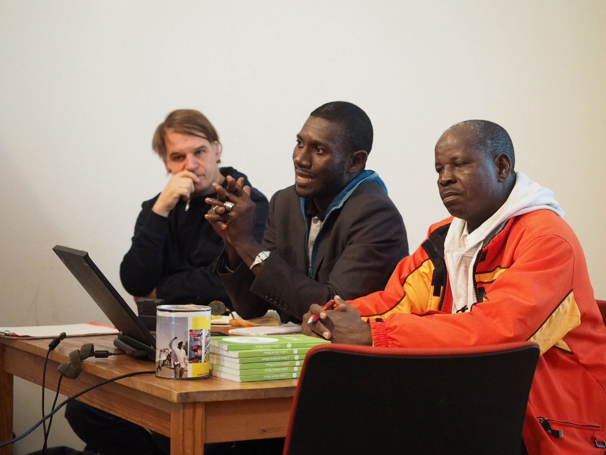

### AYS Special: How the EU externalized its border into Niger
#### Volunteers of Alarmphone Sahara explain the impact of the migration policy in the Sahara region

Moctar Dan\-Yayé \(middle\) und Azizou Chehou \(right\) inform about the situation in the Sahara region\.

It was only one law that affected almost a whole region; amongst others\. It decreased the economy, the business of thousands of people and whole families: law 036/2015\. It was passed by Niger’s parliament in May 2015\. “By law, now the freedom of movement is condemned,” Moctar Dan\-Yayé from Alarmphone Sahara criticizes the migratory policy imposed by European policy\.

Alarmphone Sahara is the sister\-organization of Alarmphone — Watch the Med, which provides emergency assistance for people on distress on the Mediterranean Sea and is part of the Afrique Europe Interact network\. The Sahara team has similar tasks\. “Our aim is to protect migrants and their rights on the route, document and rescue, if we can”, says Dan\-Yayé\.

■■■■■■■■■■■■■■ 
> **[BBC News Africa](https://twitter.com/BBCAfrica) @ Twitter Says:** 

> > Three-quarters of all African migrants landing in Europe try to pass through the Sahara desert and the UN @[Refugees](https://twitter.com/Refugees) says twice as many die there as in the Mediterranean Sea.

@[ThomsonRadio](https://twitter.com/ThomsonRadio) reports from Niger for @[BBCr4today](https://twitter.com/BBCr4today) https://t.co/D8cTm7g7gZ 

> **Tweeted at [2019-01-14 15:29:24](https://twitter.com/bbcafrica/status/1084834876690448384).** 

■■■■■■■■■■■■■■ 

With the European Union externalizing its borders to the African continent and putting pressure on governments to stop migrants already on their way to the Mediterranean, Niger got an artificial border within the country — and crossing it became more difficult\. The city Agadez is located in the centre of Niger and with the Sahara desert north of it, it has been a major hotspot of trade and migration for years\. But nowadays “the controls make it hard to move within the own space”, explains Alarmphone’s Dan\-Yayé\. Hence, Agadez is one of the cities, the NGO is operating from\.

> “It was easy and free\.” 

Also Dan\-Yayé’s fellow Azizou Chehou remembers how the situation was before the 036/2015 law: “It was easy and free\.” Every Monday, up to 300 cars departed northwards towards to the Libyan border, which is some 500 kilometres away\. Migrants were prepared with water, turbans, sunglasses — and information\. Moreover, with open borders and visa\-free travel \(except Libya and Algeria\), migration within African countries was — and is — quite common\. Driving them was a regular and legal business, Chehou recalls\.

The pressure from Europe changed it\. “The official routes are now only open for Niger’s citizens,” says Chehou\. People who were regular drivers before, were now considered as human traffickers\. If checked, they get arrested and their cars seized\. Later the cars are sold, often back to the previous owners\.
#### Checkpoints every few kilometers

The Sahara are is now controlled by national and international forces\. Local authorities set up checkpoints every few kilometres and patrols\. With this, corruption and repression were boosted\. Without reason or a receipt, people were charged for crossing these checkpoints\. People who are caught giving a ride to foreigners, were considered as traffickers\. But due to a lack of alternatives, many people continued the business they’ve been running legally for years; for them giving a ride now is a cat and mouse game\. “If they are caught, they just arrest the drive, seize the car and send back the passengers,” Dan\-Yayé explains\. Later the seized cars were sold with a priority for the owners to buy them back\.

But as the drivers cannot use the official ways anymore, they need to take more dangerous routes and start in the night or early morning\. “Before the law, they had quick help when the car broke, because usually they were travelling in caravans\. Now they are left on their own and it is difficult to find them,” says Dan\-Yayé\. For the whole way there was only one driver for the whole way carrying up to 35 people in just one Hilux\.
#### Trust fund from the EU

The European Union launched a trust fund to help the drivers and people affected by the changes of the law to find new businesses\. However, from 6000 projects which applied, only 350 of them have been financed, says Dan\-Yayé: “Drivers do not succeed as traders\. They return to their old jobs with all the consequences\.”

■■■■■■■■■■■■■■ 
> **[Ursula Mueller](https://twitter.com/UschiMuller) @ Twitter Says:** 

> > I am concerned about the worsening situation in #LakeChad region. Here in #Diffa, one of poorest regions of #Niger, refugees &amp; communities that host them, continue to face violence. Many have fled multiple times. More attention to their situation is urgently needed. https://t.co/HhtruntObX 

> **Tweeted at [2019-12-12 06:51:52](https://twitter.com/uschimuller/status/1205017404650082304).** 

■■■■■■■■■■■■■■ 

Another point are the push\-backs carried out by for example by Algeria\. With trucks they are bringing people to the no man’s land called Point Zero at the border to Niger, Chehou says: “They bring the people 15 kilometre from the next city with no light — even women, pregnants and children\.” Some get lost on the way or even die\. But volunteer teams like Alarmphone Sahara do not have the resources or the material to help in such cases\. Chehou remembers one woman they found 100 kilometres far from the border town of Assamaka who — like many others — still wanted to continue her way northwards\. “The conditions in their origins are more difficult than the desert,” he comments\.

Law 036/2015 changed how the people cross the desert\. But it did not change the reason, why they try it\.

**Find daily updates and special reports on our [Medium page](https://medium.com/are-you-syrious) \.**

**If you wish to contribute, either by writing a report or a story, or by joining the info gathering team, please let us know\.**

**We strive to echo correct news from the ground through collaboration and fairness\. Every effort has been made to credit organizations and individuals with regard to the supply of information, video, and photo material \(in cases where the source wanted to be accredited\) \. Please notify us regarding corrections\.**

**If there’s anything you want to share or comment, contact us through Facebook, Twitter or write to: areyousyrious@gmail\.com\.**

_Converted [Medium Post](https://medium.com/are-you-syrious/ays-special-how-the-eu-externalized-its-border-into-niger-afe7fa3de009) by [ZMediumToMarkdown](https://github.com/ZhgChgLi/ZMediumToMarkdown)._
