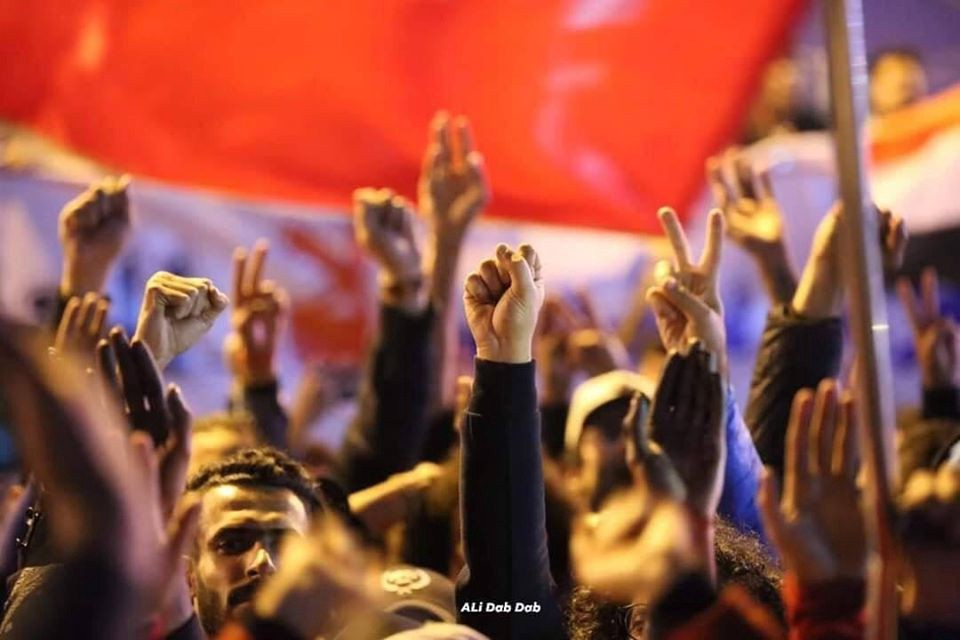

### AYS Special: Updates from Baghdad \(2\)
#### Main events and news concerning the uprisings for the week 8th –15th December

Credit: Ali Dab Dab\.
#### Repression, kidnapping, torture, killing and intimidation of activists in demonstrations\.

In the first half of December, kidnappings of demonstrators and activists, by armed militias, took place throughout the country\. Some of them were released within a week or two, and they showed signs of torture, others were tortured and killed\.

> Zahraa Ali Salman, 19, contributed to the revolution by providing food, drinks and blankets for those on the streets\. On December 11th, she was kidnapped near her family house and, after 10 hours, her body was found in front of an hospital, probably brought there by unidentified people\. The father said that “one of the doctors confirmed that the beatings with metal tools that she suffered were the cause of the broken bones and death\. The torture lasted about 7 hours, according to the medical personnel, and it was conducted with metal bars and electric shocks\.” 

Zahra was the eldest daughter of a family of Filipino Kurdish minorities living in Baghdad\. Minorities have suffered persecution by Iranian militias since 2006 and the sectarian civil war has left minorities and Christians abandoned; militias have seized their property in different areas of Baghdad\.

On Monday 9th, the headquarters of the national anti\-terrorist agency, situated in Baghdad’s international airport, were hit by 4 rockets, killing a total number of 6 people\.

> Thousands of protesters in Tahrir Square are mourning the civil activist Ali Najm al\-Lami, a member of the Iraqi Writers Union and member of the Iraqi Communist Party, who was assassinated yesterday in al\-Shaab neighborhood after returning from Tahrir Square\. Protesters are demanding accountability for the perpetrators and bring them to justice \(Icssi Solidarity Initiative\) \. 

In the light of the suppression targeting demonstrators in Southern Iraq since the beginning of October, which killed hundreds of people and wounded thousands, activists in the area called for a mass gathering on December 10th, the anniversary of the victory over ISIS, in Baghdad\. Tahrir Square’s protesters issued a statement welcoming the demonstrators from all Iraqi cities, but called for a commitment to peace, despite the massacres committed by authorities in the past two months, and the promise to not cross the Green Zone, which will give the government an occasion to increase repression and violence\. The demonstrators committed themselves to peace and expressed their anger for [the massacre committed in Al\-Khulani](ays-special-updates-from-baghdad-1-caf4159ce913) the previous week, where 25 people were killed\.
#### Al\-Wathba Square\.

Videos emerged showing the body of a young man hanged by the feet, on the public square\. In the early hours of December 11th, gunfire was heard in Al\-Wathba Square, coming from a house nearby, resulting in one person killed and four others wounded\. Later in the morning, members of the regular police and riot police gathered in front of the house and engaged in a fight with the attacker\. The man was killed in his house, but was later handed over to the demonstrators, who allegedly mutilated his body and hanged him in the public square\.

> The protesters in Tahrir Square issue a statement denouncing the killing and suspension of an armed person, Al\-Wathba Square, who is accused of killing a number of demonstrators\. The demonstrators’ statement confirms that this incident was fabricated to tarnish the image of the peaceful uprising \(Icssi Solidarity Initiative\) \. 

This brutal act was seen as an attempt to push people to enter the Green Zone, unsuccessfully, and now the same parties and militias are denigrating the demonstrations\. The security forces arrested some of those who participated in the horrible act\.

On Thursday 12th December, activists Omar Kadhem Ali Al\-Amri and Salman Khairallah Salman Al\-Mansoori were kidnapped by governmental forces\. Their destiny is still uncertain\.

On Sunday 15th December, activists Ismail Hakki and Mohammed Al\-Dujaili lost their lives when attacked with a Kalashnikov weapon in Baghdad\. An explosive device placed under the car of activists Ali Al\-Madani and Thaer Karim resulted in heavy injuries for the two\. The incident took place in Diwaniyah\.
#### Karbala\.

Militias [targeted activist Fahim al\-Ta\`i](https://m.facebook.com/story.php?story_fbid=2469881836586919&id=70081687667) and killed him with silenced weapons while he was returning home from the demonstration\.

On December 13th, masked men stabbed 5 protesters in the Education Square and burned 3 civilian wheels\.

The next day, civilian activist Ihab al\-Wazani was seriously wounded as a result of a failed attempt to assassinate him\.

Karbala is a fortified city with only three entry points, where Iraqi security forces and security cameras are located at each intersection and checkpoint\. People are surprised then of how gunmen can pass through checkpoints so easily, without being arrested nor identified\. The Iraqis expressed their anger toward these terrorists and condemned the clear cooperation between the government of Iraq and the Iranian militias, serving the interests of the corrupted authorities\.

Basrah\. Between December 13th and 14th, 4 civilians were assassinated with silent guns\.

The military base of Al\-Qaytarah, where the American soldiers are stationed, was hit by 17 missiles, allegedly shot by Iraqi militias, as a consequence to the statement by the US State Department supporting the independency and sovereignty of the Iraqi people\.
#### Daily summaries and updates by Icssi Solidarity Initiative\.

9th December: daily updates [here](https://www.facebook.com/solidarityinitiative.icssi/posts/2775272032533377) \.

10th December: daily updates [here](https://www.facebook.com/solidarityinitiative.icssi/posts/2777624245631489) \.

12th December: daily updates [here](https://www.facebook.com/solidarityinitiative.icssi/posts/2780161085377805) and [here](https://www.facebook.com/solidarityinitiative.icssi/posts/2782305445163369) \.

13th December: daily updates [here](https://www.facebook.com/solidarityinitiative.icssi/posts/2784115531649027) \.

14th December: daily updates [here](https://www.facebook.com/solidarityinitiative.icssi/posts/2786537734740140) \.

**Author: Local activists based in Baghdad\.**

**Find daily updates and special reports on our [Medium page](https://medium.com/are-you-syrious) \.**

**If you wish to contribute, either by writing a report or a story, or by joining the info gathering team, please let us know\.**

**We strive to echo correct news from the ground through collaboration and fairness\. Every effort has been made to credit organizations and individuals with regard to the supply of information, video, and photo material \(in cases where the source wanted to be accredited\) \. Please notify us regarding corrections\.**

**If there’s anything you want to share or comment, contact us through Facebook, Twitter or write to: areyousyrious@gmail\.com\.**

_Converted [Medium Post](https://medium.com/are-you-syrious/ays-special-updates-from-baghdad-2-aa711055b5c5) by [ZMediumToMarkdown](https://github.com/ZhgChgLi/ZMediumToMarkdown)._
