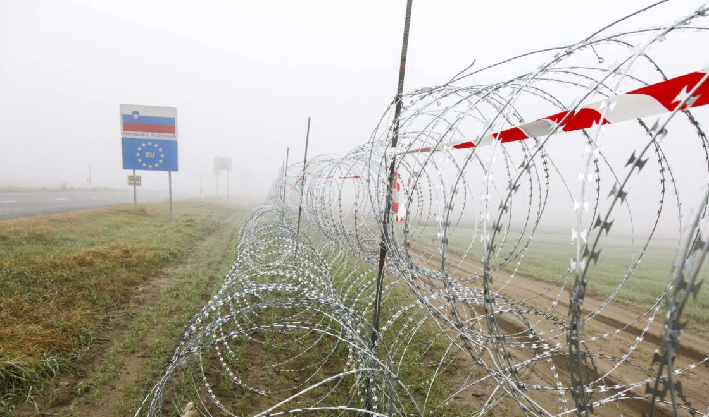
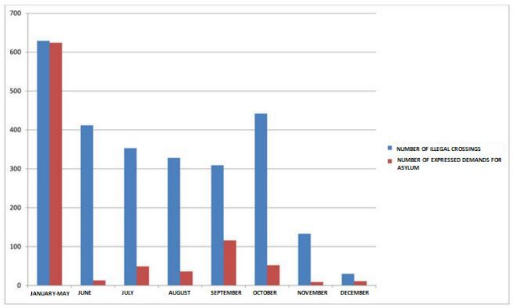
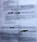
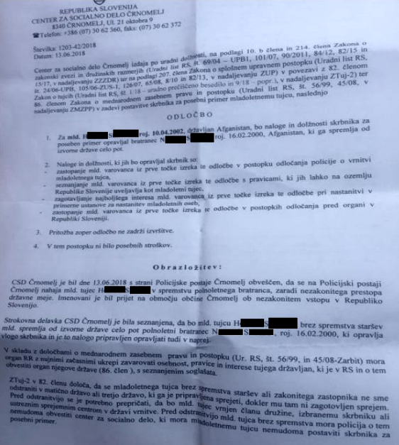
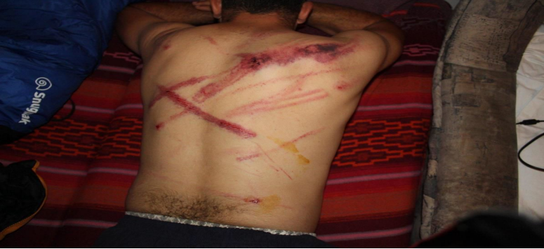

### AYS Daily Digest 20/12/19: Internal docs of Slovenian police show how they disregard asylum requests
### New arrivals in Greece // Rescues by Ocean Viking // Scheduled deportation to Kabul from Germany // Turkish PKK member in prison although granted asylum in Norway

[Are You Syrious?](@AreYouSyrious?source=post_page-----32dd347c035f----------------------)

[Dec 21](ays-daily-digest-20-12-20-internal-docs-of-slovenian-police-show-how-they-disregard-asylum-32dd347c035f?source=post_page-----32dd347c035f----------------------) · 6 min read

Slovenia raised a razor wire fence at its borders in 2016 and has been fortifying the border perimeter and finding ways to reject people since\. Photo: AYS archive
### Feature
### Slovenians disclose how they abuse the readmission agreement with Croatia to get rid of asylum seekers

Last week the Administrative Court in Slovenia ordered the Slovenian police to disclose a number of internal documents revealing internal orders regarding how police officers should operate when dealing with migrants who had crossed the border and requested asylum\.

> _In one of the documents from the Police Administration of Novo Mesto it is written that when a migrant requests asylum in Slovenia in the presence of Slovenian and Croatian police, this should be interpreted by the Slovenian police officer as meaning that the migrant has requested asylum in Croatia\._ 

The directive in this document is similar to already published documents from 25\.5\.2018, when the former General Director of the Slovene Police Simon Velički ordered Slovene police officers working in mixed patrols with Croatian police to return migrants to Croatia even if they request an asylum procedure in Slovenia\.

The vague content of these instructions is a clue to the administrative basis for the systematic denial of the right to international protection and to the massive malversation in the official procedures at border police stations in Slovenia\. For example, at the Police Station of Črnomelj, a municipality bordering Croatia, which is under the administration of Novo Mesto, the number of asylum requests dropped from 371 in May 2018 to only 13 in June 2018\.

Chart of border crossings side by side with demands of asylum in 2018 on border Police Station Črnomelj

This dramatic drop in asylum requests is a direct result of the revealed documents, although they do not explain what is the legal basis for returning migrants who are found in central Slovenia or even at the border with Italy\. Testimonies of migrants who were processed at Slovene police stations report verbal and sometimes physical abuse; requests for asylum are met with threats of violence and many are forced to sign untranslated documents renouncing any claim to asylum, providing the basis for their “push back” to Croatia\. These documents are signed with no given explanation or with the explicit promise that their signature is required for entering the asylum procedure\.

On the 13 th of June 2018, a group of 4 people from Afghanistan \(16, 17, 30 and 39 years old\) crossed the border near the village of Zilje\. Hamid expressed the intention to seek asylum in Slovenia, but the police ignored his request\. The group was forced to sign documents in the Slovene language without translations\. One of the documents which Hamid signed was about legal representation in the official procedure because he was underage\. They were kept at Črnomelj Police Station for 7 hours before they were expelled to Croatia and then BH\.

Newly revealed internal documents requested by Amnesty International Slovenia and revealed by the Court, which are still not fully available to the public, additionally prove the clearly discriminatory and illegal policy of the Slovenian police\.

> _The instructions written by the general command also state that state officials in the Vič Asylum Centre should issue decisions for asylum seekers from Algeria and Morocco to be transferred to the Detention Centre in Postojna, where they have no right to free movement, as they are more likely to be violent, use drugs and abuse the right to asylum by leaving the country before their procedure has been completed\._ 

Despite clear evidence of a high risk of physical abuse, numerous other forms of official disrespect \(confiscating valuables, destroying their meager possesions including telephones and even jackets and shoes\) and even torture at the hands of Croatian authorities, the Slovenian Police last year returned more that 4,500 people to Croatia under the readmission agreement between Croatia and Slovenia\.

> _This year the Slovene police has by the end of November returned to Croatia more than 10,500 people with 15,200 recorded irregular border crossings\._ 

On 27th July, a group of six men from Algeria, Tunisia and Morocco arrived in the vicinity of Črnomelj after many days of walking from Velika Kladuša, Bosnia\. Hakim expressed the intention to seek asylum in Slovenia many times, but the Palestinian translator said they had no option to apply for asylum because of their nationality\. Out of six people the police interviewed only one person for the whole group\. The following day they were forced to sign documents in the Slovene language, and then at around 19\.00 h, the Slovenian police took them to a place that looked like a rubbish dump where there were collectively handed over to the Croatian police\. From there they were driven in a van to a green border with Bosnia and Herzegovina near Velika Kladuša\. The people left the van two by two and when they stepped out they were attacked by police in masks and beaten\. The policemen also used electric sticks\.

The “readmission agreement” between Croatia and Slovenia, it is suspected, forms the official basis for this massive international disrespect of numerous basic liberties, not to mention international treaties starting with the principle of “non\-refoulement” \(Article 33, 1951 Refugee Conventions\) \.

Even if the readmission agreement was legal, it would still be problematic\. As the agreement is an international contract between an EU member state and a non\-member state \(as Croatia was not a member at the time of the agreement\) it should not be valid even under the most transparent and humane conditions, though they are by no means either transparent or humane\.

> _It is important to note that in 2019 Slovenia has granted international protection to only 67 people, while 3,640 asylum requests were filed\. Additionally, asylum seekers in Slovenia wait usually more than one and up to four years to receive a decision on their asylum procedure, receive only 18 euros per month of allowance and have to wait 9 months for a work permit, so many are forced to seek options for survival outside the country\._ 

### Greece
### At least 522 people arrive on the islands

Aegean Boat Report says at least 10 boats landed today\. Six boats landed on Lesvos, one on Chios and three on Farmakonisi, from where the people were transferred to Leros\.
### [Aegean Boat Report](https://www.facebook.com/AegeanBoatReport/photos/a.285312485325196/726297084560065/?type=3&theater&ifg=1)
### [In the last two days at least 15 boats have arrived on the Greek Aeg… ean islands, carrying 522 people\. 10 of these…](https://www.facebook.com/AegeanBoatReport/photos/a.285312485325196/726297084560065/?type=3&theater&ifg=1)
#### [www\.facebook\.com](https://www.facebook.com/AegeanBoatReport/photos/a.285312485325196/726297084560065/?type=3&theater&ifg=1)
### Search and Rescue

MSF reports that 112 people were rescued in the early morning hours:
### Germany
### New deportation to Kabul announced

Several signs indicate that there will be a deportation to Kabul on January 14\. It is recommended that all Afghans with invalid residence permits should seek legal advice\. Official authorities should be informed about all integration steps, such as upcoming apprenticeships\.

More information in German, Dari and Farsi:
### [Start — Bayerischer Flüchtlingsrat](https://www.fluechtlingsrat-bayern.de/)
### [Mittwoch, 2\.10\.2019 \| Feierwerk \(Hansa 39, Kranhalle\), Hansastr\. 39–41, München \(U4/5 Heimeranplatz / Bus 31…](https://www.fluechtlingsrat-bayern.de/)
#### [www\.fluechtlingsrat\-bayern\.de](https://www.fluechtlingsrat-bayern.de/)
### Norway
### PKK member denied and then granted asylum, but remains a political prisoner

In Turkey, Gülizer Tasdemir, a Turkish national, has been sentenced to 12 years in prison for being a member of the PKK \(Kurdistan Workers’ Party\) \. She had previously applied for asylum in Norway on the grounds of having to face prison and political prosecution in her home country\. Her application was denied\. She was arrested at an airport in Turkey in July 2018\. After her arrest, Norwegian institutions acknowledged their mistake and granted her asylum, but at that moment she was already in prison\. Since then, no efforts have been undertaken to get her out of prison and back to Norway, as stated by her lawyer\. According to a friend of hers, with whom she is corresponding by letter as no other means of communication are allowed, Tasdemir is in a serious health condition but has been denied any medical assistance\.
### You can read more in Norwegian here:
### [Norske asylmyndigheter trodde ikke på Gülizer Tasdemir\. Nå er hun dømt til 12 års fengsel i Tyrkia\.](https://www.aftenposten.no/verden/i/3Jw5gq/norske-asylmyndigheter-trodde-ikke-paa-gulizer-tasdemir-naa-er-hun-doemt-til-12-aars-fengsel-i-tyrkia?fbclid=IwAR2Pup_9PqpZX2QC3WR8WVO-EFvJYiz2wfp6HC-KnpceyBI2Br6ynyynVLI)
### [Gülizer Tasdemir \(43\) ble torsdag dømt til 12 år og seks måneders fengsel av en tyrkisk domstol\. Tasdemir har sittet i…](https://www.aftenposten.no/verden/i/3Jw5gq/norske-asylmyndigheter-trodde-ikke-paa-gulizer-tasdemir-naa-er-hun-doemt-til-12-aars-fengsel-i-tyrkia?fbclid=IwAR2Pup_9PqpZX2QC3WR8WVO-EFvJYiz2wfp6HC-KnpceyBI2Br6ynyynVLI)
#### [www\.aftenposten\.no](https://www.aftenposten.no/verden/i/3Jw5gq/norske-asylmyndigheter-trodde-ikke-paa-gulizer-tasdemir-naa-er-hun-doemt-til-12-aars-fengsel-i-tyrkia?fbclid=IwAR2Pup_9PqpZX2QC3WR8WVO-EFvJYiz2wfp6HC-KnpceyBI2Br6ynyynVLI)

**Find daily updates and special reports on our [Medium page](https://medium.com/are-you-syrious) \.**

**If you wish to contribute, either by writing a report or a story, or by joining the info gathering team, please let us know\.**

**We strive to echo correct news from the ground through collaboration and fairness\. Every effort has been made to credit organizations and individuals with regard to the supply of information, video, and photo material \(in cases where the source wanted to be accredited\) \. Please notify us regarding corrections\.**

**If there’s anything you want to share or comment, contact us through Facebook, Twitter or write to: areyousyrious@gmail\.com\.**

_Converted [Medium Post](https://medium.com/are-you-syrious/ays-daily-digest-20-12-19-internal-docs-of-slovenian-police-show-how-they-disregard-asylum-937d1b8a675c) by [ZMediumToMarkdown](https://github.com/ZhgChgLi/ZMediumToMarkdown)._
