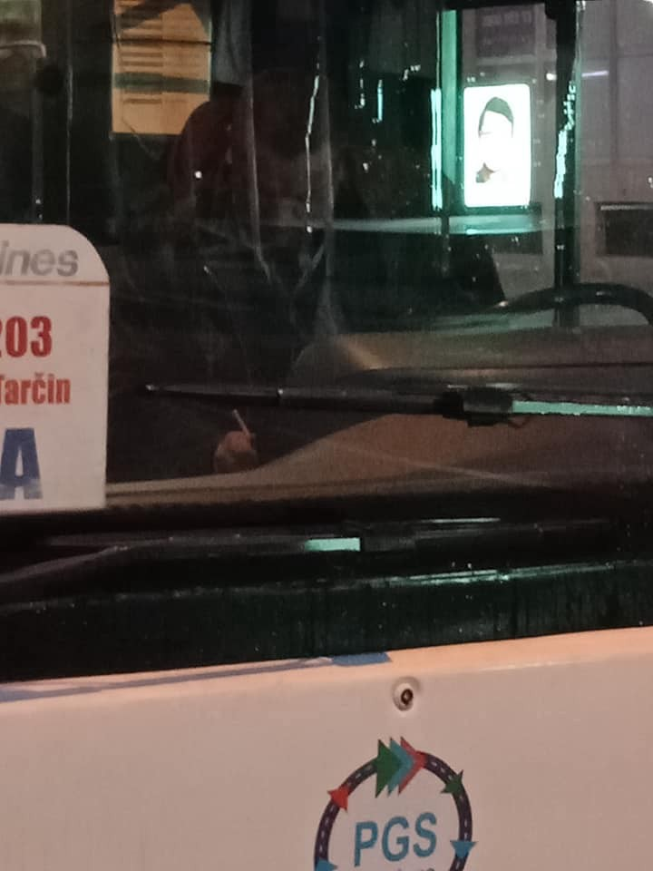

### AYS Weekend Digest 21–22/12/19: Six people, including 2 children, feared drowned in the Danube river
#### A man died in Zawiyah camp of consequences of the Libyan police torture / Court in Lille decides the Calais mayor “was incompetent to take the orders” about stopping the aid distribution / & more news from other areas

### FEATURED

This morning \(Monday\) 6 people, including 2 children, disappeared in the Danube river around 6am in the morning, while they were trying to cross from Serbia to Croatia\. According to initial information, their overcrowded boat capsized near the Serbian village of Karavukovo, the approximate location marked on the map below\. Between 10 and 15 people from the boat managed to swim back to the coast\. There is a very slim possibility the six people might be found alive\. 
There is an ongoing search for the bodies of the missing people, including the two children who, unfortunately, most likely have drowned\.

It is important to be aware that there are many victims freezing, barely surviving, being neglected and left to suffer poor living conditions, starvation, illnesses, and most of all — inhumanity\.
### LIBYA

One of the most active reporters from Libya wrote about the most recent loss of lives there:

> _“A man died yesterday in Zawiyah of the horrific torture he suffered at the hands of the Libyan police in the locked up hangar\._ 

A group of 25 refugees have been at sea for over 40 hours and they never got in contact with anyone\. We don’t know if they are alive in this horrible weather in the high sea\. People in detention centres such as Zintan, Sabhaa, and Zawiyah haven’t seen [@](https://web.facebook.com/hashtag/unhcr?source=feed_text&epa=HASHTAG) unhcr in months\. Hundreds are homeless and used as slaves in the streets of Tripoli\. Many are deciding to try the sea, the terrifying sea of these days, because they would they prefer to risk their lives at sea than to keep suffering in Libya\. Remember about all of them while you celebrate Christmas\. Remember their torturers that we are paying to detain them, rape them, sell them and kill them\. All is allowed as long as they are kept in Libya” — [Giulia Tranchina](https://web.facebook.com/rastajuly?__tn__=%2CdCH-R-R&eid=ARAuq9CgCeyyTNUWYfjLU8SprCuqcMNIpE8Hz2OtVLtHbw0H2rovGoFPHQDVdLOWsr7jraVvMy_gqmhW&hc_ref=ARRl_zAhPhcd-VI6iP3FdsQoUU4UXNvR4MyKulYBsE4PcTz99KAELqnK5PcSKX_k0hQ&fref=nf&hc_location=group)
### SEARCH AND RESCUE AT SEA

In severe weather conditions, the crew of Ocean Viking and MSF rescued 162 people at sea\. [Alarmphone](https://twitter.com/alarm_phone/status/1208345147756490758?fbclid=IwAR1vNvgfM56thzcW2P2P95GAmmAcw-NR7kH0UFbBEiZb4hcV0CWWmJ71KmI) alerted the team, after they received two calls about boats in distress\. One patient and her child were evacuated from the ship\. In the [night](https://twitter.com/MSF_Sea/status/1208876070944018432?fbclid=IwAR33AfktibVXV0ZC-kWEN34d-RbjKXNmVX0BCI72gVonnPyHc0Rt_CyxY8Q) , Italy allowed the rest of the people to be disembarked in Taranto\.

130 kilometers south of the island of Gran Canaria, a boat with 28 people was [rescued](https://twitter.com/txemita/status/1208162717279948800?fbclid=IwAR1Tycb9V1uE0hYVNhaVRYdDmbrTNEWUtiI93BuLvmudBc9kKgr0ml2crsA) by the Salvamento crew\.
### GREECE
### Samos

After a fire broke out at the [Refugee 4 Refugees](https://web.facebook.com/Refugee4Refugees/?__xts__%5B0%5D=68.ARAt4zndZSebCcmlyaM8q0u8_YtJqkyDpPlI8Fvfnh4_mIA7rw25BTXq6g5Slgh2xpbkRkvzawFVmuorkMWFYaOCFhkgo-Gy-ZTi9HGCdlF6PYUaIKiDQ5UxAalPte_-POVZRTw4HvVE8zgpj5Yv3zOAEppJfov2dECR6ZVylk0XXd2RDoJ9jjOjehWgOnB0uNtuhsX3CtX1KtfZveVob0UOLyZs0z0ak-GleDm84IMHMjUtJngrU-SHnm2UU2ZPX8rSxOytEUHSOgtsbrGaNXoMSsaUWjhg8GsiSTwkxyZot_nEBOoU-ElzvCmSy5LnVAGCSIrcrUxWsnbOmBfrkUChGznjN4Bdzg3SAjac1RvfBYL4rHpTIA) warehouse, the team is asking for help and support in putting everything back together and restarting their activities\.

> _Our team, and so many of our past volunteers who have worked day after day unloading, sorting and distributing items from the warehouse are absolutely devastated\. But we will rebuild, and our operations must continue to provide emergency relief to over 7000 people currently in Vathi camp\._ 

For information about sending items for distribution on Samos, please email info@refugee4refugees\.gr or message us directly on Facebook\. To donate in support of R4R, visit their GoFundMe campaign — [https://bit\.ly/2ZbIUU5](https://bit.ly/2ZbIUU5?fbclid=IwAR0tDMRHZ8rCVhAkRdhGnCmPFMM_e0tqvk6cqnCUB2R4kOtdHwIaS77x9sY) \.

As the \(weather\) conditions in the Greek hotspots remain bad and get worse day by day, more people keep arriving on the islands\. On Saturday alone, the Aegean Boat Report [counted](https://twitter.com/ABoatReport/status/1208306934069239808?fbclid=IwAR0RVFwoaiWy0FpxIkugoWR6xPKkafDqgD9rUtug0CsuBcIgyBOkH8m-uB4) six boats on Lesvos \(222 people\), three on Leros \(103 people\) and one on Chios \(56 people\) \. In the last two weeks, alarmphone [had](https://twitter.com/alarm_phone/status/1208366595829116929?fbclid=IwAR3x0EVjKJzouHp2CWck2HzpXXhDU0bJVhhAsV4jB-1oegQ6EL1djmflcdA) eleven cases of boats in distress\. While nine were rescued to or arrived in Greece, two were intercepted and deported back to Turkey with the use of police violence\.
### BOSNIA AND HERZEGOVINA
### Racism in Sarajevo

On Saturday afternoon in Hadžići a driver of the company Centrotrans Arnaut denied access onto the bus to a man who had a regular monthly pass, his wife reported\. She wrote that some of the drivers in two of the bus companies are harrassing people according to their skin colour, although they have a ticket, which should be the only criteria to use the bus\. Previously, when the man had no monthly pass, they would reportedly charge him the ticket price and never issue the ticket itself, until once his wife asked about why he didn’t get a ticket and the driver responded “I thought he was a migrant”\.

Photos: [Mija Nour Ahmed](https://web.facebook.com/mija.ukropina?__tn__=%2CdCH-R-R&eid=ARCwfF45aLKytyh5FPeYq2kFy28bqzPvfKMiy18kCqNj4Z7vWPr00mTfEnDnUwA73qBOfRT-Y0KrLdUx&hc_ref=ARTa_6f8Tm0LyUs-vHDZ2xLh4YP43Gd6BHfMJaJitcEW8_0wZhPza4Vkfo3rWGzfEjQ&fref=nf&hc_location=group)

The man in question is an Egyptian working at a local company, but just like in the cases of the two Nigerian sportsmen recently deported and pushed back from Croatia on the grounds of being black in the “wrong area”, it is not about whether the man is a refugee/asylum seeker in the country or not\. The fact is that officials are continuously practicing racism in all public spheres and parts of the society, from the bus, to the shop and police, the ones who should be the place to turn to for help\.

The woman in this case also wrote:

> _“On a daily basis we see people cheating on the \(im\)migrants, including my husband, by charging them more in the shops, not letting them eat in fast food stores, etc\. People complain about the migrants all the time, but nobody speaks about what is being done to them, and how a single driver earns at least 20KM because they don’t charge the tickets regularly, how the people call the police on them for no reason, how the same police doesn’t ask what happened, but just throw them out of the bus and start beating them… How they are being spoken to in a rude and agressive manner\. \. ”_ 

### FRANCE
### Calais

According to a court decision from December 16, the administrative court in Lille has annulled three decisions that the mayor of Calais previously signed \(on March 2, 6 and 9 of 2017\) \. These previous decisions were made at the beginning of the food and aid distribution to the people on the ground, in transit, which she qualified as “abusive occupation” in the industrial zone of the Dunes and the Place d’Armes, French media [reported](https://www.lavoixdunord.fr/684270/article/2019-12-21/la-maire-de-calais-jugee-incompetente-pour-interdire-les-distributions-de?utm_campaign=echobox_calais&utm_medium=Social&utm_source=Facebook&fbclid=IwAR1aBM2VlnXrEK7ahPMDjwl1-kQEEvR46Dr88IEVy6u6q7ZkGIkGh-EKPpc#Echobox=1576949955) \. According to those decisions, the court had then decided the activities should stop\.

However, after the organisations took things into their own hands, addressed the issue to the court, it has now come with a new decision stating that in Calais, the police powers with regard to the supervision of rallies belong to only to the prefecture, concluding that the mayor “was incompetent to take these orders”\.
### Paris

Many shocking images featuring people in misery completely ignored in the midst of the European capitals have been published in the media, but there are not that many people or organisations active to provide solidarity and assistance to people in those situations\. There is a number of organisations in Paris working in different ways to house people, to help them reach places where they can pursue their asylum requests, but there are also those active since a long time ago to provide them the most needed items to survive the cold winters in rough conditions\. If you want to support, this is one of the ways:
### [Click here to support Refugees in Paris // WINTER 2019 organized by Danica Jurisic](https://www.gofundme.com/f/refugees-in-paris-winter-2019?sharetype=teams&member=2768830&utm_medium=social&utm_source=facebook&utm_campaign=p_na+share-sheet&pc_code=fb_co_postupdate_a&rcid=3bd9994285eb4b6ba4efe0e34f66d880&fbclid=IwAR1WDNqWnh2IWkRMOyq0OZnvUKed3A9LSwSTBg5oUkFACjNbno_0y8txnIs)
### [Since 2015 we have witnessed the horrible conditions refugees have faced in Paris\. Help us provide for refugees in this…](https://www.gofundme.com/f/refugees-in-paris-winter-2019?sharetype=teams&member=2768830&utm_medium=social&utm_source=facebook&utm_campaign=p_na+share-sheet&pc_code=fb_co_postupdate_a&rcid=3bd9994285eb4b6ba4efe0e34f66d880&fbclid=IwAR1WDNqWnh2IWkRMOyq0OZnvUKed3A9LSwSTBg5oUkFACjNbno_0y8txnIs)
#### [www\.gofundme\.com](https://www.gofundme.com/f/refugees-in-paris-winter-2019?sharetype=teams&member=2768830&utm_medium=social&utm_source=facebook&utm_campaign=p_na+share-sheet&pc_code=fb_co_postupdate_a&rcid=3bd9994285eb4b6ba4efe0e34f66d880&fbclid=IwAR1WDNqWnh2IWkRMOyq0OZnvUKed3A9LSwSTBg5oUkFACjNbno_0y8txnIs)
### GERMANY

132rescued people have been transferred from Italy to Germany on Friday, the German Interior Ministry [announced](https://twitter.com/CaroRackete/status/1208375989170032641?fbclid=IwAR3N4yGPp_t4iVqaPzPzwsaARbvUTpeJKOcAQP62-3wKAWA4wCD6kl9kovI) \. Carola Rackete, former capatain of the Sea Watch, criticized a slow process, as it took almost six months to transfer eleven people from her rescue mission:

> _“This is the reason why Italy and Malta feel a lack of solidarity\. Big words, no actions\. And not the first case of delay\.”_ 

### NORWAY

Gülizer Tasdemir sought asylum in Norway, because she believed she risked torture and imprisonment in her native Turkey\. The Norwegian authorities nevertheless sent her back to Turkey in July 2018, where she was detained immediately\. Now she is sentenced to over 12 years in a Turkish prison, [Aftenposten](https://www.aftenposten.no/verden/i/3Jw5gq/norske-asylmyndigheter-trodde-ikke-paa-gulizer-tasdemir-naa-er-hun-doemt-til-12-aars-fengsel-i-tyrkia?fbclid=IwAR1c9IUVS0H0uek13BUtp3fOtE9OAKC-VzRvIPjc8pQATyuzF03Ea6ybf68) reports\. An Oslo court ruled in September this year, that the Norwegian Ministry of Justice had violated human rights and the European Convention on Human Right with this deportation, [wrote](https://anfenglishmobile.com/human-rights/norway-convicted-of-extradition-of-kurdish-activist-to-turkey-37523) ANF English\. However, this will not help her much anymore\.
### EU

Margaritis Schina, vice president of the European Commission, announced they will propose a new migration and asylum agreement, [Amna](https://www.amna.gr/en/article/417428/Margaritis-Schinas-Commission-will-propose-a-new-migration-and-asylum-agreement) reports from an interview with the Greek public broadcaster ERT\. The Commission wants “to find a new solidarity network in order for the asylum applications to be distributed among all the EU state members and not to the entrance points as it happens today\. Additionally, the new agreement will foresee returns for those not entitled to asylum and will also include agreements with third countries conditions in order to be able to create opportunities for citizens to remain in their homeland while there will also be a provision for legal migration”\.

**Find daily updates and special reports on our [Medium page](https://medium.com/are-you-syrious) \.**

**If you wish to contribute, either by writing a report or a story, or by joining the info gathering team, please let us know\.**

**We strive to echo correct news from the ground through collaboration and fairness\. Every effort has been made to credit organizations and individuals with regard to the supply of information, video, and photo material \(in cases where the source wanted to be accredited\) \. Please notify us regarding corrections\.**

**If there’s anything you want to share or comment, contact us through Facebook, Twitter or write to: areyousyrious@gmail\.com\.**
### [Are You Syrious?](/are-you-syrious?source=post_sidebar--------------------------post_sidebar-)
#### Daily news digests from the field, mainly for volunteers and refugees on the route, but also for journalists and other parties\.

Following

\)
- [Refugees](/tag/refugees)
- [Digest](/tag/digest)
- [France](/tag/france)
- [Europe](/tag/europe)
- [Migration](/tag/migration)

_Converted [Medium Post](https://medium.com/are-you-syrious/ays-weekend-digest-21-22-12-19-six-people-including-2-children-feared-drowned-in-the-danube-ff5a96d1d5e6) by [ZMediumToMarkdown](https://github.com/ZhgChgLi/ZMediumToMarkdown)._
