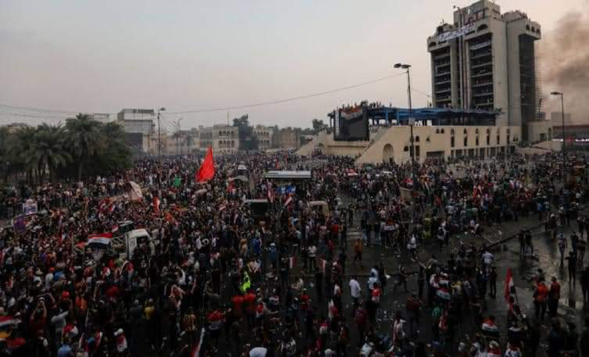

### AYS Special: Updates from Baghdad \(3\)
#### Main events concerning the uprisings for the week 15th\-22nd December

Credit: repost from local source\.
#### Throughout December, kidnappings and killings continued in various forms including deaths by the use of bullets and bombs, clear signs of the manslaughter the Iraqi government is committing against its own people\.

After the incident in [Al Wathba](ays-special-updates-from-baghdad-2-aa711055b5c5) square, where the corpse of a man was hanged on the public square, the security forces arrested the perpetrators of this crime in just two days\. An event and an efficiency by the armed forces that is quite controversial considering that none of the perpetrators of the killings, kidnappings and stabbings, which resulted in dozens of deaths in different areas of Iraq, were arrested\. However, protesters are not surprised at all, given that they are aware the government has been trying to oppress them since October 1st and all the official statements are a clear cover\-up to the violations committed by the security forces\.

But [a new investigation carried out by Human Rights Watch](https://www.hrw.org/news/2019/12/16/iraq-state-appears-complicit-massacre-protesters) seems pretty clear in recognising the hypocrisy of Western countries and Iran, when stating that:

> “The US, UK, and Iran can’t have it both ways, calling on the Iraqi government to respect the rights of protesters while supporting the Iraqi forces killing protesters or standing by,” said Sarah Leah Whitson, Middle East director at Human Rights Watch\. “With killings of protesters continuing day after day, they should end this support\.” \[military and law enforcement support\] 

#### According to the Ministry of Health, 511 people have been killed since October 1st, by the hand of military forces conducting unlawful killings\.

> The government has taken some limited steps towards accountability, but no serious efforts to quell the abuse against protesters\. On December 1, the Criminal Court in Wassit convicted two police officers for using excessive force and killing protesters, and other southern courts have issued arrest warrants against officers in Najaf and Dhi Qar for excessive force and issuing orders that led to the killing of protesters\. As far as Human Rights Watch is aware, judicial authorities have yet to take action against officers in Baghdad\. However, on December 8, the government [dismissed](http://www.basnews.com/index.php/ar/news/iraq/565837?__cf_chl_jschl_tk__=60cd066f5d8d790b513611f9fc9ce90ab5a068cd-1576508286-0-AaEx0AMdOiKxzPVBNIx7499xk1OoJlWd8RsWUmdRVKD8oHMJ3TvS1MxwjAdMqklUuboVXtJx-PDM9PgqLGA4RsxyUQEL1c2AvlIoSctSo6oPwrCyPDmW4xT7vSj3FUXoEq5nhNz2QtlbHd3cBDVSVzkAHS2Jwc41QnrwxVoaqZ5hFR41Yf901ABml5IcW-SdZrNIunoI88AVzDH7V7kYnklWL9iXatgJZVF47CZexDCGubFJz_Aw0MyDTz129amiOuD3wjjjIfxKin3sp1O_VRfmm6eh3Gmu3SBgs_Q5bOt-) the head of Baghdad Operations Command, Major General Qais al\-Muhammadawi\. 

> The Iraqi government bears the leading responsibility to protect Iraqis’ right to life\. It should urgently identify and make public the groups and security forces that engaged in or coordinated these killings and hold perpetrators to account\. It should compensate victims of all unlawful killings\. 

Iraqis expressed their anger and indignation through peaceful demonstrations throughout the country\. In the Southern provinces, demonstrators protested in front of the oil refineries, while others pushed for the temporary closure of Basra General Company, situated at the country southern ports\. As for Baghdad, various forms of solidarity with protestors took place in the city: the Chaldean Patriarchate, for example, announced its refusal to celebrate New Year’s holidays as a sign of respect toward those who lost their lives in the country\.

Despite all these events, the government is procrastinating the decision to determine possible candidates for the role of Prime Minister\. Two weeks after his resignation, former Prime Minister Adel Abdel\-Mahdi al\-Muntafiki \(who apparently has been accused of constitutional breaches during the formation of his government\) stated that his team will continue administrating the country until a new government is formed\.

**The demonstrators presented their conditions for accepting the new leaders, which mainly called for new representation: candidates should not have participated in any previous coalitions or should not have covered any governmental position, either as minister or as under\-secretary, from 2003 until now\. Moreover, those who wish to be considered for ministerial roles should be accepted by the citizens\.**

The deadline to propose a candidate for the role of PM has expired since December 19th and the Iraqi Parliament is not constant in its sessions, repeatedly confirming the possibility of a crisis sooner than later, while continuing terrifying its own people\.

The President of the Republic, Barham Salih, is waving the resignation, if political parties will not manage to appoint a candidate that received full support by the demonstrators\.

Iran’s interference within Iraqi politics continues, despite people rejecting all the candidates presented by the neighbouring country so far, candidates belonging to the same, old, corrupt political class\. The crowded group of protestors in Baghdad rejects what is being planned under the table for the country; millions of students took the streets of the capital and other major cities on Sunday 15th, carrying messages of resistance and resilience\.

The one of the people is the largest party\.
#### Full daily summaries by ICSSI Solidarity Initiative can be found at [this link](https://www.facebook.com/solidarityinitiative.icssi) \.

**Author: Local activists based in Baghdad\.**

**Find daily updates and special reports on our [Medium page](https://medium.com/are-you-syrious) \.**

**If you wish to contribute, either by writing a report or a story, or by joining the info gathering team, please let us know\.**

**We strive to echo correct news from the ground through collaboration and fairness\. Every effort has been made to credit organizations and individuals with regard to the supply of information, video, and photo material \(in cases where the source wanted to be accredited\) \. Please notify us regarding corrections\.**

**If there’s anything you want to share or comment, contact us through Facebook, Twitter or write to: areyousyrious@gmail\.com\.**

_Converted [Medium Post](https://medium.com/are-you-syrious/ays-special-updates-from-baghdad-3-2a979b5d8844) by [ZMediumToMarkdown](https://github.com/ZhgChgLi/ZMediumToMarkdown)._
