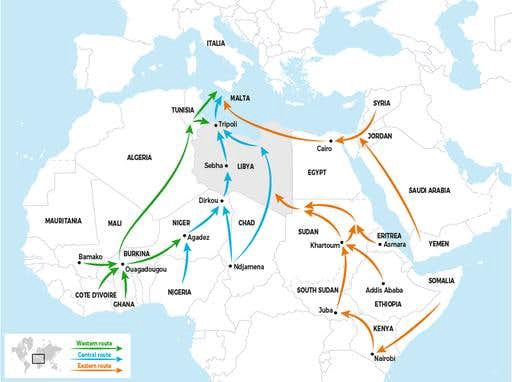
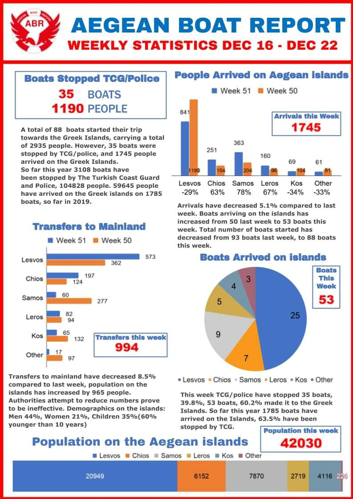
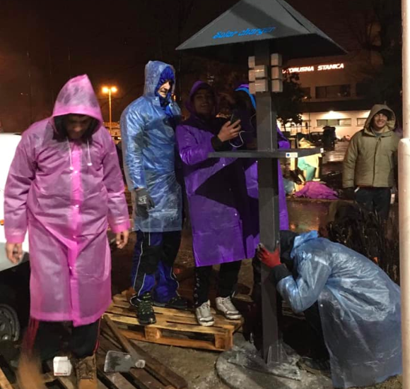
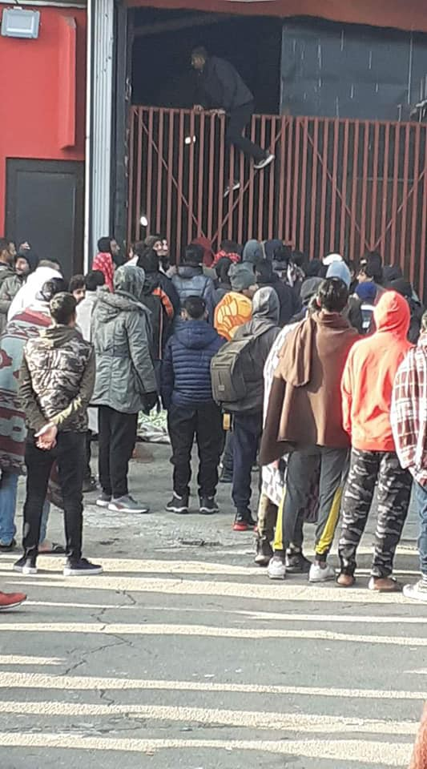

### AYS Daily Digest 24/12/19: EU money used to fund torture in Libya
#### Ocean Viking allowed to disembark, 159 survivors reach safety // **So far in 2019, 53,443 people arrived in Greece by sea // The White Helmets document new civillian tragedies in Syria //** Phone chargers arrive to Tuzla bus station in Bosnia // A man deported to Afghanistan after 10 years in Hungary // Boris Johnson’s Brexit bill removes legal protection for child refugees in the UK

 \)](assets/c60a68a5fae0/1*UxyqwJpppt1JeTy73U_tMA.jpeg)

Moria, Lesvos, Greece \(Photo: [Knut Bry](https://web.facebook.com/knut.bry?__tn__=%2Cd%2AF%2AF-R&eid=ARA24QHnw0e5lXhGXkAn4da_KQaAYnNP1uy2GBSBDEPuk6t_GLUQg6R-nfmorKQFrf46-4VvMRxPwGOk&tn-str=%2AF&hc_location=group_dialog) \)
#### FEATURED
### Human trafficking, abduction, detention and extortion of migrants and refugees flourished in Libya

We are drawing attention to the recently published report by the MSF Libya\. MSF teams have been witnessing the desperate situation of thousands of people, condemned to languish in detention centres or left to survive on their own outside, trapped in an endless cycle of violence\.

> Despite being properly funded, political constraints, security challenges, and a lack of transparency on the ground mean these programmes fail to meet even the minimum that could be expected from a humanitarian intervention\. 

Whether people on the move see Libya as a stop on their journey or their destination, all of them ultimately become targets on migratory routes made more dangerous, costly and fragmented\.

Human trafficking, abduction, detention and extortion of migrants and refugees continued to flourish in Libya while people’s chances of dying in a bid to cross from Libya to Europe have only increased, MSF reminds\.

> European taxpayers’ money is being used to contain people in inhumane conditions to prevent them from exercising in Europe their fundamental right to seek asylum\. They are held indefinitely in squalid prisons without judicial review\. 

> An unknown number of people are being held captive across the country in clandestine prisons and warehouses by smugglers and traffickers, who use torture and abuse to extort money from them\. 

“ We have seen the scarred and broken bodies and heard stories of burning plastic poured on skin, daily beatings, and torture inflicted during a phone call to the victims’ relatives to convince them to pay\. This continued to happen on a large scale in 2019 in Libya\.”

Find the entire MSF report [**here**](https://www.msf.org/libya%E2%80%99s-cycle-detention-exploitation-and-abuse-against-migrants-and-refugees?fbclid=IwAR0ritsjPhBEiZ2Vp4U14VBXAdJ7CshF30pwCSViumoGfDjnylQrEbbcbwo) and please take time to read it\.
### **Killed in refugee tents — tragic reminder of over 6 million displaced people in Syria**

While Europe seems to struggle in providing support to around a million Syrian refugees, at least six times more remain internally displaced in the country\. This Xmas, The White Helmets published a heartbreaking reminder of those who are left behind\.

■■■■■■■■■■■■■■ 
> **[The White Helmets](https://twitter.com/SyriaCivilDef) @ Twitter Says:** 

> > Scenes from the recovery operations of displaced civilian victims after targeting their tents near #Jobas School in #Idlib this morning. 8 people were killed, including 5 children and 2 women. https://t.co/C9oz9gPNpe 

> **Tweeted at [2019-12-24 14:50:00](https://twitter.com/syriacivildef/status/1209486386081910784).** 

■■■■■■■■■■■■■■ 

#### SEARCH AND RESCUE AT SEA

■■■■■■■■■■■■■■ 
> **[Alarm Phone](https://twitter.com/alarm_phone) @ Twitter Says:** 

> > We continue with our Alarm Phone hotline because the #Mediterranean remains one of the deadliest #borders in the world. Today more than ever we are convinced to struggle on for the #FreedomOfMovement for all.

To do that, we need donations:
[alarmphone.org/en/donate/](https://alarmphone.org/en/donate/) https://t.co/Ai94mDqgGF 

> **Tweeted at [2019-12-24 12:27:53](https://twitter.com/alarm_phone/status/1209450621683879936).** 

■■■■■■■■■■■■■■ 

Following two difficult rescues, 159 survivors finally disembarked before Christmas, “The survivors endured an ordeal fleeing Libya in this winter season,” Nico, SAR Coordinator onboard the Ocean Viking reported\.

■■■■■■■■■■■■■■ 
> **[sea-eye](https://twitter.com/seaeyeorg) @ Twitter Says:** 

> > TRIGGER WARNING: Descriptions of massive violence

We have long considered whether to publish these reports. We decided to do this because they are part of the brutal reality at Europe's external borders. The report was made on board our ship #ALANKURDI in November ’19. https://t.co/qqJN9uCMRY 

> **Tweeted at [2019-12-24 10:11:30](https://twitter.com/seaeyeorg/status/1209416299476070401).** 

■■■■■■■■■■■■■■ 

#### GREECE

**So far in 2019, 53,443 people arrived in Greece by sea\.** Arrivals during 2019 are 81% higher than those in 2018\.

> We need your support to help us save lives at sea\. Please support us by donating, and telling your friends and family this Christmas, Refugee Rescue teams remind\. 

Despite the bad weather, two boats have arrived on Lesvos since last night, carrying 101 people\. We have no further information on arrivals on the other Aegean islands\.
### Samos and Nea Kavala need volunteers

As we have published earlier on, the **Samos Volunteers** team is looking for volunteers for January and February\. Next, they are recruiting an education coordinator\. The education coordinator in their Alpha Center is a central role for their psychosocial offering, and involves the management of over 23 daily classes, catering to hundreds of students\.

The ideal candidate would have fluent English, a background in teaching, and experience developing educational programs\.

> Currently, almost 7500 people are stuck in a camp that is designed for 650 people\. Some of them have to stay here for over a year to wait for their asylum decision and in the meantime have to live in tents or makeshift shelters, without access to basic hygiene or water\. 

They are running one of the community centres on the island, offering informal education and recreational activities six days a week for people above 15 years\. It is the only centre where \(‘single’\) men above 23 can join classes\. They also have a laundry station, where they wash clothes for people living in the camp and are providing activities for women and children\.

They urgently need volunteers to keep their activities running in January and February\. So if you have a few weeks off and would like to support them or if you know someone who might be interested, take a [look here](https://samosvolunteers.org/volunteer) \.

A **Drop in the Ocean** is currently seeking a Project / Logistics Coordinator who can join our team in Nea Kavala as soon as possible\! He/She would be responsible for operating projects and activities at the location and for overall logistics including operating of warehouse, preparing for seasonal distributions, etc\.
If you are interested: 
\- You must be over 25
\- You must have experience from humanitarian field work
\- You must hold a valid international driver’s licence
\- You must be able to commit for minimum 3 months

A Drop in the Ocean will reimburse expenses related to travel to the location, rental car and phone\. All coordinators live in our shared apartment at the location\. [Contact them](https://www.drapenihavet.no/en/home/) for more information\.
#### BOSNIA AND HERZEGOVINA
### Phone chargers arrive to Tuzla bus station, where people sleep in conditions below minimum dignity

Migrants sleeping rough at the Tuzla bus station below every minimum of human dignity, apart from the cold and life\-threatening illnesses are also facing an inability to use electricity to charge their cell phones\. For them, phones are the only connection to families eagerly awaiting their call, and the only means of orientation on their difficult journey\. In order to alleviate this major problem, the association [Zemlja djece u BiH](https://www.facebook.com/zemljadjece/) , which has been helping migrant families with unaccompanied children and minors for months in many ways, has decided to undertake the construction and installation of a solar pillar on the plateau of the Tuzla Railway Station\. With the consent of the FBiH Railways, and the financial support of the Tuzla Community Foundation, last night, despite the heavy rain, the Association has set up a pillar and the first users, whose happiness is hard to describe in words, are already charging their cell phones\! This Association points out that the migrants themselves did all the physical work that was necessary to pour the plinth and install this pillar\.
### University collecting donations in Sarajevo, another international team arrives to the streets

The Sociology Department of the local University keeps collecting donations for the people in Sarajevo\. They are collecting male warm clothes and shoes\. 
These should be clean, ready to wear, as they would be immediately distributed to people in tranzit who are stuck in the streets and parks of Sarajevo at the moment\. THe shoe size that is most needed is male 40–45\. THey also need blankets, jumpers, socks and new underwear, along with long warm underwear for men\. Any extra backpacks you might have at home will also be helpful, as well as vitamins and flu medicine\. For updates or more information, try contacting [Ines Tanovic Sijercic](https://web.facebook.com/tanovic.ines?__tn__=%2CdC-R-R&eid=ARB1PCLrY4ythAYHmOVCXWObR-8SqvVy56kdW6jjyfnPSCpHWTWV-Dk9y3ooZr1PCX_0WLBtWFAodkCF&hc_ref=ARS7M4FLHKrUeM_2_UYVYYuuTb6P_E4Nqn3scBC4M9M2GAOSBPqq-3c45ick7wh96Wk&fref=nf) on Facebook\.

Since recently, another volunteer team is active in the city\. 
[MiGreat](https://web.facebook.com/migreatorg/?__tn__=%2CdkCH-R-R&eid=ARDd5-70LaDOp3UEDh_QOLchvIUlYcREmbXaxUGi16O9C7w2RFqUAWPWRXZemj2jIvcDKd6I2TFbVe1K&hc_ref=ARTT2dpXZMrEOMQVvxj_v40RH4q2djE2rjUZz9ftkfznu2HdT5TiKnG3LsK3eZpVQDg&fref=nf&hc_location=group) posted on their social media:

> Out on the streets day and night, visiting homeless refugees and migrants in makeshift shelters and squats\. Making sure those who have nothing get a jacket, a jumper or a sleeping bag to survive the bitterly cold nights or shoes for those walking through the snow on flip flops\.We need funds to buy more pants, shoes and blankets, the team writes\. 

### No “legal” way to enter camps in Bihać

As all of the camps in Bihać and the surrounding area are officially full, the desperate people who end up in the city, either by being pushed back or arriving from Tuzla and other places with no official refugee reception centres, come to the closed doors\. Some try to enter, some succeed, but they have problems exiting unless they want to leave the centre for good, so they hide within the camp, trying not to draw any attention to them, some living in small tents within the camp, while others share places with people they know inside the camp\. Those who are not properly registered can’t get food in the camp\.

](assets/c60a68a5fae0/1*ZrysreYH5P2ZAOPngA_QUQ.jpeg)

Photos: [Lorena Fornasir](https://web.facebook.com/lorena.fornasir?__tn__=%2CdC-R-R&eid=ARBu02ztqD_SdzHK_vLPLj3G9NR7GYX1TlFuZaEfTBkThV2wujXDZfL2Ly4yTpSQ3YkAzRMAwm_TUly4&hc_ref=ARQ2CGTbjgh9tD-Us1Cm8cqSMemdxb9rcH-aus6c3pYxN2GmQ-CkuHQ1b4i4wOWRu7k&fref=nf)

Unfortunately, scenes like these are also very common, especially now that the winter has arrived in its full potential with characteristic strong winds in that area, hitting hardest those who were beaten, starved and out of any options now\. The volunteer groups still try to support those outside ‘the system’ and every support for those active in Kladuša, Bihać and other places is welcome\. However, please first get informed and in touch with those on the ground so that your best intentions wouldn’t go to waste, as would the wrong type of donations if they can’t be used in any way\. Contact us if you already don’t have direct contact with the people in the area or if you have some particular ideas about supporting\.
#### HUNGARY
### A man deported to Afghanistan after 10 years in Hungary

Many European states still believe Kabul, Mazar, and Herat are safe for Afghans to be returned to\. The reality on the ground, however, says otherwise, [Afghanistan Migrants Advice & Support Org](https://web.facebook.com/AmasoAfg/?__tn__=%2CdkCH-R-R&eid=ARANywqMUloc4sSm6QZgeb0uEQmpBeFmLU4iWRUWy5CPvPi3kHC7PNuDgnxxJuu9ZSpIlTwbIAqMtHKW&hc_ref=ARSN4cLZMCm8ZS1Ep4z-lsG9fdotjVLKlvcCu53mCjC9jh4k2qm9nLaDWZvIde5S-Lk&fref=nf&hc_location=group) remind, reporting about a case of a man who was deported exactly 4 months ago from Hungary to Afghanistan, after 10 years with a temporary residence permit, with the authorities stating a reason:

> Kabul is safe for him to return\. 

> After almost 10 years of living in exile, X is hopeless and questions the decision of his return\. For X, his safety was the first priority that forced him to flee the country\. Now that he has been forcibly deported, he is lost and unclear how and where to start from\. 

#### UK
### Brexit bill removes legal protection for child refugees

Boris Johnson’s Brexit bill, which comes to Parliament on Friday, will remove [legal protections for child refugees](https://inews.co.uk/news/politics/boris-johnson-keir-starmer-child-refugee-brexit-withdrawal-agreement-bill-1346000) \. Although the government says they are committed to ensuring that children claiming asylum can be reunited with specified family members in the EU and vice versa, the opposition MPs hit out at the change and accused ministers of a “shameful” reversal on the issue\.

**Find daily updates and special reports on our [Medium page](https://medium.com/are-you-syrious) \.**

**If you wish to contribute, either by writing a report or a story, or by joining the info gathering team, please let us know\.**

**We strive to echo correct news from the ground through collaboration and fairness\. Every effort has been made to credit organizations and individuals with regard to the supply of information, video, and photo material \(in cases where the source wanted to be accredited\) \. Please notify us regarding corrections\.**

**If there’s anything you want to share or comment, contact us through Facebook, Twitter or write to: areyousyrious@gmail\.com**

_Converted [Medium Post](https://medium.com/are-you-syrious/ays-daily-digest-24-12-19-eu-money-used-to-fund-torture-in-libya-c60a68a5fae0) by [ZMediumToMarkdown](https://github.com/ZhgChgLi/ZMediumToMarkdown)._
