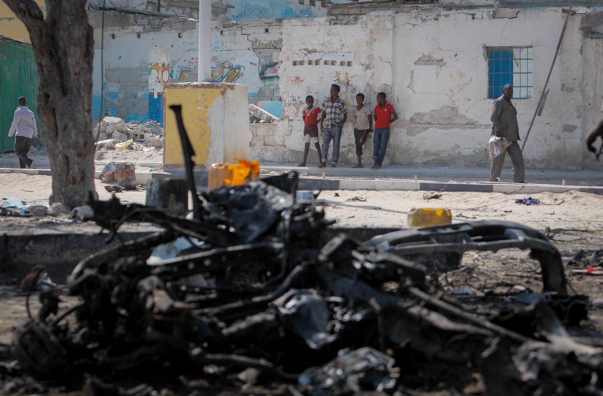
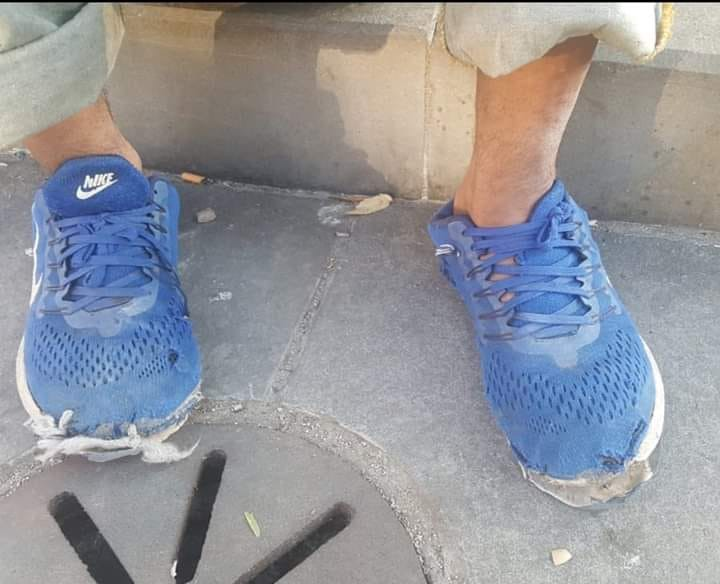

### AYS Weekend Digest 28–29/12/19: Possible violation of the UN Convention with the new wave of deportations from Denmark to Somalia
#### Is the secrecy surrounding the Denmark\-Somalia deal hiding possible violation of the UN Human Rights Convention? / Sea Eye lands in Sicily with recently rescued people on board Alan Kurdi / Kos getting another legal team to help the stranded people, Greek lawyers needed / More unaccompanied minors across the Balkan Route / Donations needed in Italy

Young Somalis look on near the wreckage of a car bomb after an earlier double suicide attack in Mogadishu several years ago \(Photo: AU\-UN IST PHOTO / STUART PRICE\)
#### FEATURED

**Recently, news has surfaced in the Danish news media about the beginning of a new wave of deportations of asylum seekers from Denmark to Somalia\.**

In the first of these cases, an apparently non\-Somalian Ethiopian woman has been forcefully deported to Mogadishu\.

The background for this new practice is allegedly a secret agreement made between the former center\-rightwing government in Denmark and the Somali authorities\. According to sources at the Danish daily [_Politiken_](https://l.facebook.com/l.php?u=https%3A%2F%2Fpolitiken.dk%2Findland%2Fart6270323%2FDokumenter-l%25C3%25B8fter-sl%25C3%25B8ret-for-Danmarks-hemmelige-aftale-med-Somalia%3Ffbclid%3DIwAR3vtgvFLGQ4AVz_kQ6_5iR-hgtI3K14MX7hXvbzrl8dClue59ViDmejWsA&h=AT1TNgu7jPefvWujiZ8fTceFl2vKkmKEX0FzIUigHhVkKkJik3wDo6iTrexEZQn2oCjJP21_U6H4fVwSJA6xGdYsAyK9BPxiy-czsvlDGyuI1rwapglgAvox2idG6fWS7P0DHLA0opsDQw) , Denmark is conducting a training program for police officers from the Somali immigration authorities in return for the deportation of one Somali citizen per month\.

> The agreement between the Danish government and Somalia, which is considered to be the world’s most corrupt country, has been kept secret since the agreement was signed in the spring of 2016\. But documents now reveal that the content is about Denmark running a “training program for policemen from the Somali immigration authorities’\. In return “one Somali citizen can be sent out per month\.” 

Mattias Tesfaye, former Social Democratic spokesperson for immigration affairs, now minister of immigration, stated in 2018:

> “I think this sounds serious\. Nobody should receive threats in a situation like this, so we plan to contact \(then immigration minister\) Inger Støjberg and ask for a confidential explanation of what is going on with this case”\. 

It is an interesting fact that the change in government has apparently not meant a change in practice or any lifting the secrecy regarding the agreement between Denmark and Somalia

Furthermore, the agreement has been used as a rationale for revoking the residence permit for hundreds of Somalis already in Denmark, raising questions as to the possible violation of the UN Human Rights convention\.

The practice and the agreement has turned out to be highly opaque and clouded in secrecy, even to MPs and to the media\.

**Seen in the light of the [bomb attack in Mogadishu](https://l.facebook.com/l.php?u=https%3A%2F%2Fwww.bbc.co.uk%2Fnews%2Fworld-africa-50932130%3Ffbclid%3DIwAR2mj0RKtfPNFwzPEoySuO3C_HqbxS8QuBGt_UUVGwxzVTpEGPdR6nhqlPI&h=AT1kUVUZ3yW5D8VnnymuGaXWa_WGtI7f2PyeZtbTSt59XcrDYOLpi5qDaem1D8t_LFHkk7eNU7V_D3CvoCRKUcp8zRBl1eHgxeFMX2TX4UuKjzJslWdpMqYNAKJ8GgUcPjgoaI6wGQeuaw) earlier this Sunday, the questions forthe secret agreement and the practice grows only stronger\.**
#### AFGHANISTAN

6 civilians were killed and another four wounded during operations by Afghan and foreign forces in central Kapisa province, as reported by the Afghanistan Independent Human Rights Commission \(AIHRC\) on Sunday\.
#### SEARCH AND RESCUE

The Alan Kurdi ship reached a rubber boat carrying 32 people, among them a pregnant woman and 10 children, the youngest being three years old\.

> “Had we not found these people, they would have encountered a storm at sea tomorrow at the latest\. Their chances of survival would have been drastically reduced,” _said the Sea Eye organisation’s spokespeerson\._ 

Although Pozzallo on Sicily was made available as a landing port, that still doesn’t provide an answer to the ever\-growing problem of not having a safe\-cities network across Europe, safe harbours, a safe atmosphere to save lives in, if already there is no common system to do so… \. This is one of the issues that remain open for the year to come\.
#### GREECE
### A new centre opening up on Kos

[Equal Rights Beyond Borders](https://www.facebook.com/EqualRightsBB/?__tn__=%2CdkCH-R-R&eid=ARBfeEMVzmHYVZl2B9Iz9P6xz3BHk1z-tXIvSCheEmqUc2dtx-LgAMZ2nGbIxzs6we7Xt0HYpm6vAojM&hc_ref=ARTnSkZIgA-MQC0q_vEQPrrdxsIlXXM1ESocbhpl3LUixI04Xz_a6aZuh1MskKXmOHA&ref=nf_target&hc_location=group) has published they will open a centre on the island of Kos in order to assist the people stranded on the island at the moment\.

“We are opening an office on Kos at the beginning of 2020, to help make the situation a bit more bearable and to stand up for the rights of asylum seekers\.
Legal protection is a question of resources on Kos\. For the European Union this is a sign of moral destitution\. For every individual who arrives there seeking protection from persecution it is a personal tragedy”, the [Equal Rights Beyond Borders](https://www.facebook.com/EqualRightsBB/?__tn__=%2CdkCH-R-R&eid=ARBfeEMVzmHYVZl2B9Iz9P6xz3BHk1z-tXIvSCheEmqUc2dtx-LgAMZ2nGbIxzs6we7Xt0HYpm6vAojM&hc_ref=ARTnSkZIgA-MQC0q_vEQPrrdxsIlXXM1ESocbhpl3LUixI04Xz_a6aZuh1MskKXmOHA&ref=nf_target&hc_location=group) team writes\.

[At this hotspot](http://Equal Rights Beyond Borders) with its capacity for 826 people, there are reportedly 4,500 people staying at the moment, and many of these people are being detained iat the Pre Removal Detention Centre for several months \- women, children, families\.
The situation for those outside the camp is even worse —

> There are no toilets outside of the hotspot; a cement trough is used as a shower for men, women and children, along with a hose from the fields nearby\. There, they collect water in buckets and take it to their sheds\. Alongside the road leading to the hotspot, refugees are carrying on their shoulders mattresses they have found in the trash, to put them in their tents and sheds\. 

The team is seeking new members, a Greek lawyer in particular\. See more details [here](https://bit.ly/358p0ul) \.

A Syrian refugee who was disabled after a Greek Coast Guard vessel opened fire on a smuggler’s speedboat he was on, off of the island of Kalymnos in 2014, is suing the Greek state for €100,000, the media are [reporting](https://neoskosmos.com/en/155010/syrian-refugee-sues-greek-state-for-injuries-from-coast-guard-pursuit/?fbclid=IwAR1uJIa1FOkqRL7XJ2mi5OPM_OBmzmCJbPRH0cIuuQmJHnbOXc-qcIQheZE) \.
#### SERBIA

Among the recently arrived people in Serbia, there are more unaccompanied minors\. Two unaccompanied boys who had been sleeping rough for approximately three months now and who were previously referred to outreach social workers for accommodation in AC in Krnjaca, were denied accommodation there during the day and referred to Sjenica, Info Park reported\. They remained sleeping rough\. Another 19 unaccompanied boys were referred to AC in Krnjaca and accommodated during Friday\.

Two unaccompanied boys from Algeria returned voluntarily from Bosnia after spending two months in the country\. They gave the unbearable living conditions as their reason for returning and asked for assistance in accommodation, they report\.
#### BOSNIA AND HERZEGOVINA

The conditions in Bosnia and Herzegovina are worsening with the weather and lack of sustainable solutions for the people in transit who in many areas rely largely on the kindness and efforts of the locals who are providing for the most essentials\.

In Sarajevo, volunteers are reporting discrimination from a security company called Flek Security hired by the [Bingo](https://www.facebook.com/bingotuzla/?hc_location=ufi) shopping centre in Sarajevo\. After having badly beaten a young man for stealing a chocolate bar, now they are stopping and frisking young people who were previously donated gloves bought at the Bingo centre\. Although the volunteers confirmed to the security \(whose questioning and communication is beyond any civilized manner\) the gloves were bought in the centre, the security guards took the gloves from the boys, leaving them barehanded in the cold, once again\.

Many such actions only deepen the discrepancies forced on the people by the authorities, the overall perception as shaped by the state\(s\) and the whole ‘system’ as designed and run by the international organisations, which often just provokes more dissatisfaction on all sides\.
#### ITALY

[L’ ALTRA VOCE](https://www.facebook.com/L-ALTRA-VOCE-1245970425495921/?tn-str=k%2AF&hc_location=group_dialog) team needs more men’s shoes in good condition \(for this weather, of course, please don’t ever donate anything that would not serve you in the current conditions, unless stated otherwise in the call\), sizes: 41–42–43–44\.

**Find daily updates and special reports on our [Medium page](https://medium.com/are-you-syrious) \.**

**If you wish to contribute, either by writing a report or a story, or by joining the info gathering team, please let us know\.**

**We strive to echo correct news from the ground through collaboration and fairness\. Every effort has been made to credit organizations and individuals with regard to the supply of information, video, and photo material \(in cases where the source wanted to be accredited\) \. Please notify us regarding corrections\.**

**If there’s anything you want to share or comment, contact us through Facebook, Twitter or write to: areyousyrious@gmail\.com\.**

_Converted [Medium Post](https://medium.com/are-you-syrious/ays-weekend-digest-28-29-12-19-possible-violation-of-the-un-convention-with-the-new-wave-of-1c3fd4dbe5e4) by [ZMediumToMarkdown](https://github.com/ZhgChgLi/ZMediumToMarkdown)._
