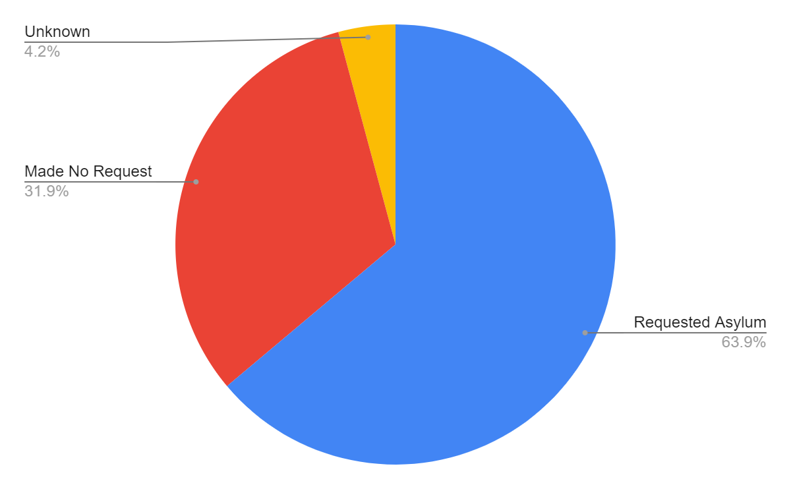

### AYS Special 2019/2020: **A Year of Violence — Monitoring Pushbacks on the Balkan Route**
#### **In 2019, The Border Violence Monitoring Network \(BVMN\) shared the voices of thousands of people pushed back from borders on the Balkan Route\. Each tells their own tale of illegal, and regularly violent, police actions\. Each represents a person denied their fundamental rights, eyewitnesses to EU led reborderization\. This article shares just some of the more startling trends which define border management on the eve of 2020, such as the denial of asylum rights, systemic firearms use, water immersion, and dog attacks\.**

**With a shared database of 648 reports, BVMN is a collaborative project of organisations with the common goal of challenging the illegal pushback regime and holding relevant institutions to account\.**

“Pushback” describes the unlegislated expulsion of groups or individuals from one national territory to another, and lies outside the legal framework of “deportations”\. On a daily basis, people\-on\-the\-move are subject to these unlawful removals; a violent process championed by EU member states along the Balkan Route\. In 2019, BVMN continued to shine a spotlight on these actions, perpetrated in the main part by states such as Croatia, Hungary, and Greece\. Supporting actors also included Slovenia and Italy, and non\-member states with the aid of Frontex which has seen its remit and funding widened heading into 2020\.

_](assets/1f8fbeb46dc3/1*ZRPwA-UW97iLPAce4n5Rlw.png)

_Pushback location data from 2019 \(Source: [BVMN\)](https://www.borderviolence.eu/violence-reports/?ri-incident-date-range=2019-01-01%20to%202019-12-24&ri-incident-date-start=20190101&ri-incident-date-end=20191224&ri-incident-location-geo-radius=50&ri-pushback_from=all&ri-pushback_to=all&ri-underage-involved=all&ri-intention-asylum-expressed=all&ri-page=1)_

Volunteers and activists worked across the route in 2019 to listen to the voice of people facing these violations, taking interviews in the field and amplifying their calls for justice\. Just some of the regular abuses that constitute pushbacks are listed below\.
### **Guns and Firearm Abuse**

The highest volume of BVMN reported pushbacks were from Croatia, a state which has been acting as a fulcrum of the EU’s external border policy in the West Balkans\. It’s approximately 1300 kilometer long border with the non\-member states of Bosnia\-Herzegovina, Serbia and Montenegro have been a flashpoint for extremely violent pushbacks\. Even in the challenging winter conditions, people make daily attempts to cross through the mountainous landscape of Croatia and are pushed back from the territory by a web of police actors who deny them the proper procedure and use crude physical abuse as a deterrent\.

 \)_](assets/1f8fbeb46dc3/1*yfc1nMkc_PwNHE-v8zxB5w.png)

_Firearms data recorded until 18th November 2019 \(Source: [BVMN](https://www.borderviolence.eu/croatian-police-shoot-person-in-transit/#more-13911) \)_

Of major concern is the huge rise in gun use by Croatian officials against transit populations\. In the first ten months of 2019 BVMN recorded 770 people who were pushed back by police officers who used guns to shoot or threaten\. In November, shots were fired directly at transit groups, resulting in the [near fatal wounding of one man](https://www.theguardian.com/global-development/2019/dec/22/blood-on-the-ground-at-croatia-borders-as-brutal-policing-persists?CMP=Share_iOSApp_Other) , and causing a puncture wound in the shoulder of another\. AYS reported on the [shooting of two minors in 2017](ays-special-it-is-proven-croatian-police-regularly-shoots-at-people-45f2308ce0a1) , showing this isn’t the first time guns were turned on unarmed transit people in Croatia\.
### **Dog Attacks and K9 Units**

The use of canine units in the apprehension and expulsion of transit groups is also a telling marker of the extreme violence that characterises pushbacks\. Since the summer of 2019, a spike in the level of brutal dog attacks, and the presence of K9 units during pushbacks has been noted by BVMN\. In a recent case, [one man was mauled by a Croatian police dog](https://www.borderviolence.eu/violence-reports/december-3-2019-0400-zeljava-air-base-hr/) for ten minutes under the direct guidance of the animals police handlers who laughed and shouted, _“good, good”,_ as it almost severed a major blood vessel in the victim’s leg\.

 \) \. Right image: Case from Croatia \(Source: [BVMN](https://www.borderviolence.eu/violence-reports/december-3-2019-0400-zeljava-air-base-hr/) \)_](assets/1f8fbeb46dc3/1*a3xOw5kKfsCLhavhZT6D3Q.png)

_Left image: Case from MNK \(Source: [BVMN](https://www.borderviolence.eu/violence-reports/september-26-2019-0000-nearby-gevgelija-train-station/) \) \. Right image: Case from Croatia \(Source: [BVMN](https://www.borderviolence.eu/violence-reports/december-3-2019-0400-zeljava-air-base-hr/) \)_

Fortunately, the man survived, but with permanent injuries that he nurses still today in Bosnia\-Herzegovina where he was illegally pushed back, in spite of his request for asylum and urgent physical condition\. Sadly this is not an unfamiliar story\. **Across the route canine units remain a severe threat within pushbacks** , as seen in cases recorded from North Macedonia to Greece where a [man was severely bitten](https://www.borderviolence.eu/violence-reports/september-26-2019-0000-nearby-gevgelija-train-station/) , or in chain a pushback from Slovenia where [12 unmuzzled police dogs](https://www.borderviolence.eu/violence-reports/july-21-2019-1600-bratkovec-croatia/) traumatised a large transit group\. Dogs as weapons are a timely reminder of the weighting of border policy towards violent aggression, and away from due legal access to asylum and regulated procedure\.
### **Gatekeeping Asylum Access**

K9 units and guns are ultra\-violent policing methods that contribute directly to the blocking of asylum access\. In the first eleven months of 2019, over 60% of Croatian pushbacks to Bosnia\-Herzegovina saw groups make a verbal request for asylum\. Yet in these cases, group members were pushed back from the territory without having their case heard, in direct contravention of [European asylum law](https://ec.europa.eu/home-affairs/what-we-do/policies/asylum_en) \.

_Statistics filtered from the shared database on pushbacks HR — BiH from January — November 2019 \(Source: [BVMN](https://www.borderviolence.eu/violence-reports/?ri-incident-date-range=2019-01-01%20to%202019-12-23&ri-incident-date-start=20190101&ri-incident-date-end=20191223&ri-incident-location-geo-radius=50&ri-pushback_from=Croatia&ri-pushback_to=Bosnia&ri-underage-involved=all&ri-intention-asylum-expressed=all&ri-page=1) \)_

Croatian authorities, along with a host of other states, have effectively mobilised pushbacks to remove people from their territories irrespective of claims for international protection\. A host of actors, such as police officers and translators have warped the conditions for claiming asylum, regularly coercing people to sign removal documents, doctoring the ages of minors, or avoid any processing at all by delivering them to the green border immediately where they are pushed back with violence\. Slovenia are also participants in this chain of asylum violation, seen most brutally in a [case from July when pepper spray was used](https://www.borderviolence.eu/violence-reports/july-21-2019-1600-bratkovec-croatia/) to target specifically the people who spoke out asking for asylum\.
### **Wet Borders: River Pushbacks**

Most pushbacks occur at remote areas of the green border, especially at night, where violence can be applied with effective impunity\. A particular feature of police violence on the border is the weaponisation of rivers to abuse groups\. Monitoring work from September revealed 50% of direct pushbacks from Croatia involved respondents being forced into rivers or immersed in water\. This is accompanied regularly by the stripping of people \(often to their underwear\) and burning of their possessions\. Then, police officer push them into the rivers that mark the boundary with Bosnia\-Herzegovina \(often the Glina and Korana\), putting people at a high risk of drowning and hypothermia\.

A recent [case from November](https://www.borderviolence.eu/violence-reports/october-31-2019-1800-korana-river-south-of-sturlic-bcp/) combined the use of firearms with this dangerous use of wet borders\. A group of Algerians were pushed into a river by Croatian officers who were returning them to Bosnia\-Herzegovina\.

 \)_](assets/1f8fbeb46dc3/1*3HF9Ew41ynfpT-68DL2F7Q.png)

_Pushback site where Korana river runs parallel to the HR/BiH border \(Source: [BVMN](https://www.borderviolence.eu/violence-reports/october-31-2019-1800-korana-river-south-of-sturlic-bcp/) \)_

> The respondent recalled how: [_“They pushed me into the river and said, ‘Good luck\.’”_](https://www.borderviolence.eu/violence-reports/october-31-2019-1800-korana-river-south-of-sturlic-bcp/) , while the officers fired guns into the air\. 

Meanwhile in the Evros region of Greece, the river border is used regularly to pushback people\-on\-the\-move into Turkey\. As in Croatia, the incidents often occur at night, and are carried out by officials wearing ski masks/balaclavas\. Taken by force, transit groups report being loaded violently onto small boats and ferried across to the Turkish side\. This regular and informal system of removal stands out as a common violation across Greece and the Balkan area, and raises major concerns about the associated risks of water immersion given the high levels of drowning which occur in the regions rivers\.
### **2019 at the EU’s Doorstep**

Border management on the Balkan Route has systematised a level of unacceptable, illegal and near fatal violence\.

> The trends noted in 2019 are an astonishing reminder that such boundaries are no longer governed by the rule of law, but characterised almost entirely by the informal use of pushback violations\. 

Gun use stands out as the most extreme marker of violence within pushbacks\. But the shooting of weapons sits within a whole arsenal of policing methods that also include blunt physical assault, unlawful detention, abuse during transportation, taser misuse and stripping\. Though Croatia emerged as a primary actor within BVMN’s dataset, common practive between EU member states were also clear, as across the region: Hungary, Slovenia and Greece continued to target people\-on\-the\-move with a shared set of illegal and violent methods\. The [new interventions of Frontex outside of EU territory](https://digit.site36.net/2019/11/25/frontex-expands-operations-in-eu-neighbouring-countries/) also look to compliment this reborderisation effort, as non\-member states in the Western Balkans become integrated into the pushback regime\.

> The Border Violence Monitoring Network will continue to elevate the brave voices of those willing to expose these violent institutions\. Their stories are a testament to the dire situation at Europe’s borders on the eve of 2020, and accountability will continue to be sought\. 

Read more from The Border Violence Monitoring Network [here](https://www.borderviolence.eu/) \.

**This is one of the texts written as a special edition series highlighting the biggest trends of 2019, accounts on worrying issues that continue into 2020\. Find the other specials as well as our usual daily updates and special reports on our [Medium page](https://medium.com/are-you-syrious) \.**

**If you wish to contribute, either by writing a report or a story, or by joining the info gathering team, please let us know\.**

**We strive to echo correct news from the ground through collaboration and fairness\. Every effort has been made to credit organizations and individuals with regard to the supply of information, video, and photo material \(in cases where the source wanted to be accredited\) \. Please notify us regarding corrections\.**

**If there’s anything you want to share or comment, contact us through Facebook, Twitter or write to: areyousyrious@gmail\.com\.**

_Converted [Medium Post](https://medium.com/are-you-syrious/ays-special-2019-2020-a-year-of-violence-monitoring-pushbacks-on-the-balkan-route-1f8fbeb46dc3) by [ZMediumToMarkdown](https://github.com/ZhgChgLi/ZMediumToMarkdown)._
