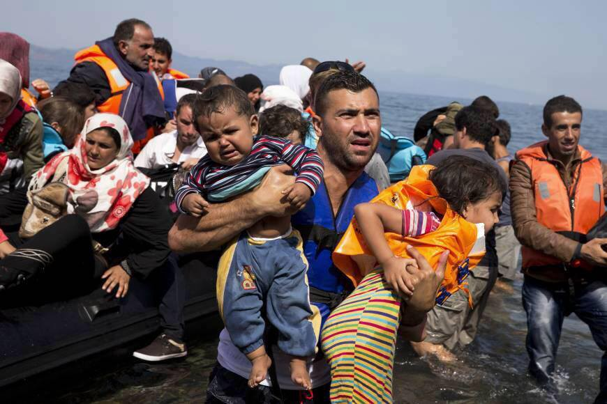
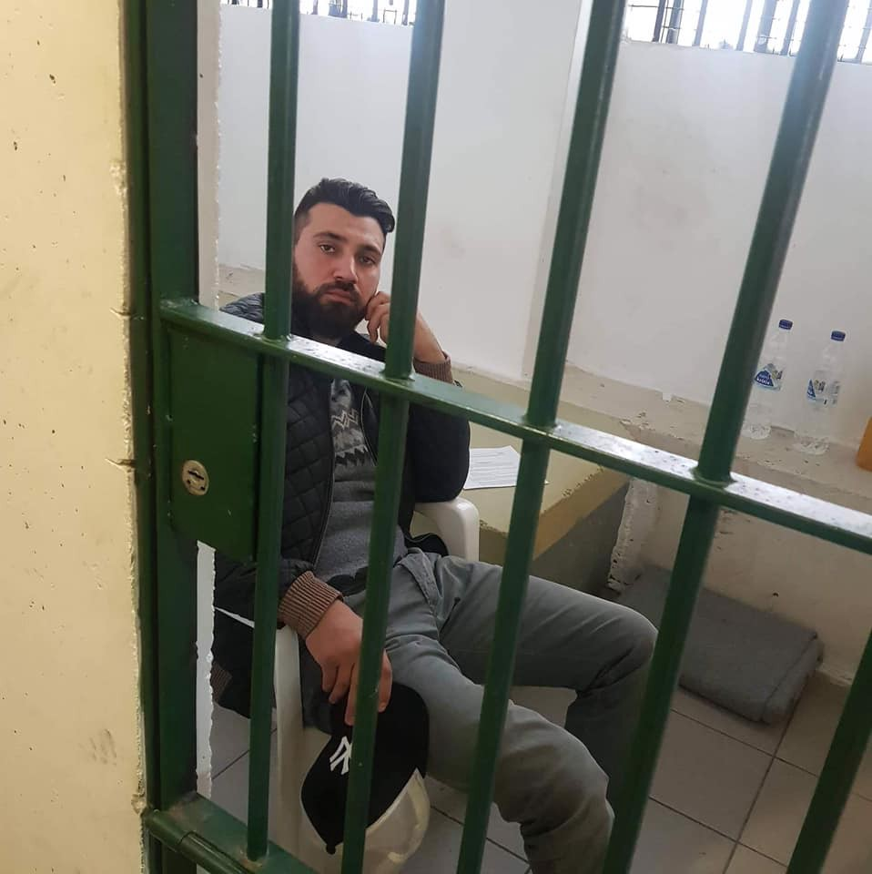
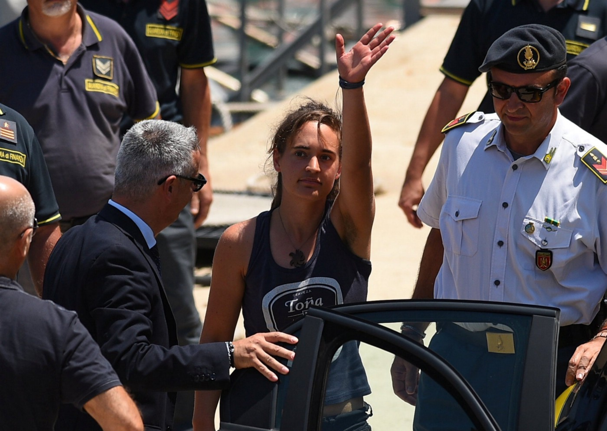
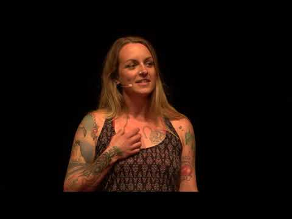
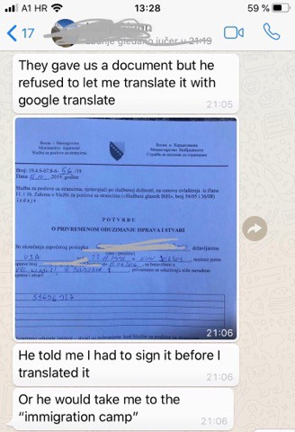
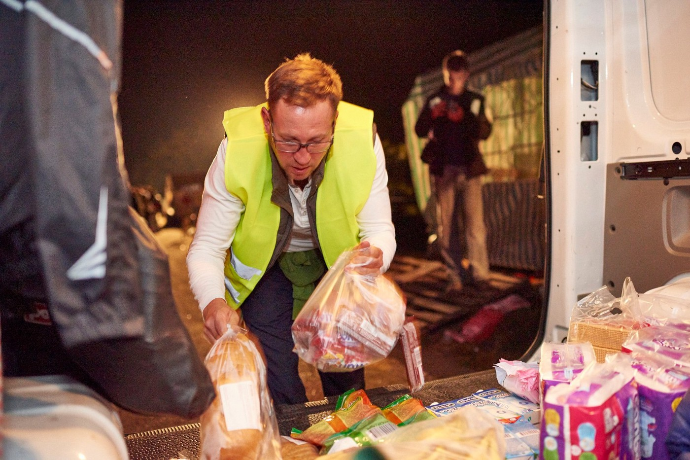
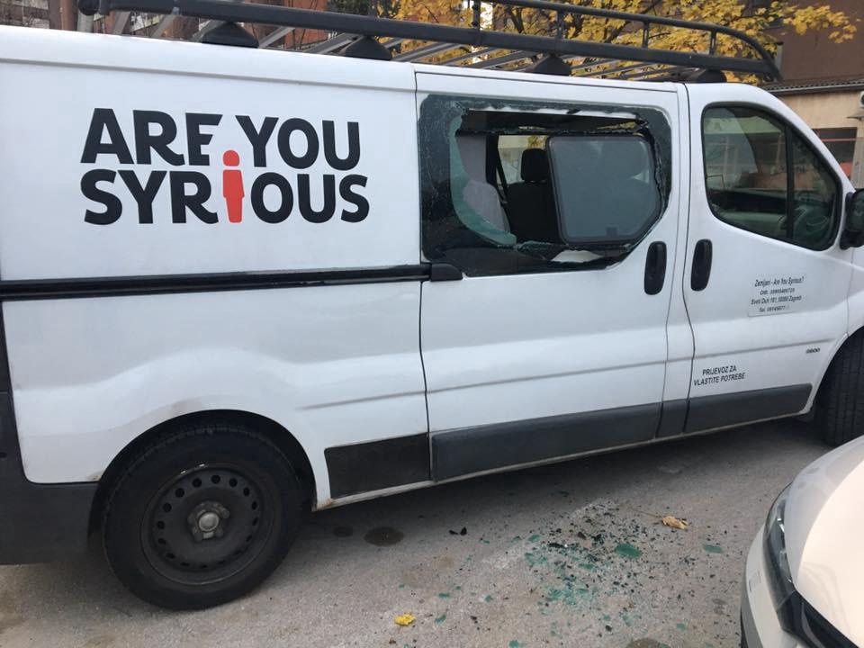
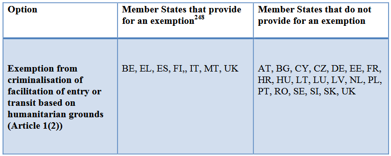

### AYS Special 2019/2020: On trial for saving lives — Criminalization of solidarity
#### From Greece to Italy, from Serbia and Bosnia to Croatia, activists and volunteers have been intimidated…

### Charged for providing humanitarian assistance on Greek islands: The case of Salam Aldeen

It was the last day of 2019\. Salam Aldeen, an Iraqi\-Danish rescue worker who dedicated almost five years of his life to supporting refugees on Lesvos, was paying final goodbye to people in Moria camp\. For many of them, Salam and his Team Humanity were the only ray of hope in dire conditions of the overcrowded island\. Some of them, Salam personally rescued from the Aegean sea\. He also documented violations of their basic human rights — something that’s being held against him by the local police\.

On 19 December, he was arrested on charges of being a “public threat” for merely working as a humanitarian emergency responder in Lesvos\. He was detained without formal charges for 16 days\. While in detention, he learned that he will be deported from Greece by the end of the year\.

> “The authorities on the island don’t want me and our Organization to help refugees\. After 16 days in jail without any proof that I did anything wrong, they let me go for only three days so I can pack my things and leave\. This island has its own rules and the authorities do whatever they want to”, Salam said on 31 December, few hours before leaving Lesvos, where he served since 2015\. 

Salam spent 16 days in detention without formal charges\. Photo: Team Humanity

Salam Aldeen has previously been charged with human trafficking while working as a lifeguard in Lesvos\. He was put on trial together with his friend Mohammed el\-Abassi, who also worked for Team Humanity, and Spanish firefighters Manuel Blanco, José Enrique Rodríguez and Julio Latorre who volunteered for the Spanish group [Proem\-Aid](http://www.proemaid.org/en/) \. The five were arrested on 14 January 2016, just a few hours after successfully rescuing 51 people from the sea\. They faced as many as 15 years in prison\. In May 2018, they were acquitted of all charges in a Greek court, but after his release, Salam experienced repeated attempts by the authorities to pressure him into quitting his job as a relief worker\. In the end, they forced him out of the country\.
### They docked at the safest port in Italy: cases of captains Carola Rackete and Pia Klemp

Around 700 nautical miles west of Lesvos, on the small island Lampedusa, German captain Carola Rackete faced questioning by an Italian prosecutor over allegedly aiding illegal immigration\. She was arrested on 29 June for entering Italy’s Lampedusa port despite a veto imposed by Matteo Salvini, far\-right Minister of the Interior, and pushing a Coast Guard boat out of the way to land 40 rescued people who needed medical and psychological assistance after being stranded at sea for over two weeks\.

> Three days after the incident, a [judge overturned the arrest](https://www.france24.com/en/20190702-italian-judge-frees-detained-sea-watch-captain-carola-rackete) , saying Carola had merely acted to save lives\. However, she is still the subject of two investigations — one for entering Italian waters despite a direct order to stop, and another for allegedly aiding illegal immigration\. If convicted, she could also face up to 15 years in prison\. 

Carola Rackete was escorted to detention immediately after docking a ship with 40 survivors\.

The Sea\-Watch 3 rescue vessel remained in police custody in the Sicilian port of Licata for months\. On 19 December, the organization won an appeal in an Italian civil court against the illegal seizure of the ship\. On 30 December, Sea\-Watch 3 left the port of Licata and is on its way to the search and rescue zone north of Libyan waters\. The current rescue mission of Sea\-Watch 3 is the first under the German flag\. Sea\-Watch was forced to change their flag during the seizure, after Van Nieuwenhuizen, Dutch Minister of Infrastructure and Water Management, introduced new politically motivated regulations to make further rescue missions under the Dutch flag almost impossible\.

> “ _Hundreds of people have drowned while Sea\-Watch 3 was unfairly held in port by Italian authorities\. But now, we are finally able to set sail for our next rescue mission\. We will never stop assisting people in distress in the Mediterranean, even despite the political games played all around us and the obstacles thrown at us,_ ” said Johannes Bayer, Head of Mission on board Sea\-Watch 3\. 

Carola Rackete is not the only captain to be charged for conducting search and rescue missions\. Her colleague Pia Klemp is among 10 people facing up to 20 years for “aiding illegal immigration”\.

Her rescue ship, Iuventa, which was operated by the Berlin association Jugend Rettet in 2015/2016, was seized on Lampedusa on 2 August 2017\. Italian authorities argued that the seizure was “pre\-emptive”; a measure geared to preventing its ‘possible’ future use to ‘criminal ends’\.

Previously, the IUVENTA — operated in a joint effort by more than 200 volunteers on board and supported by many thousands on shore — was deployed in 16 rescue missions off the coast of Libya between August 2016 and August 2017, saving more than 14,000 lives\.

> “We simply did, what had to be done: rescuing people where they can be rescued\. Never should that be subject to a political discussion”, said Captain Pia in her emotional TEDx speech\. 

Why was she giving a TEDx talk instead of sailing with her crew? She would be immediately imprisoned, she explained, if she saved another refugee life\. If she saved an EU passport holder, nothing would happen to her\. Their court case might linger for years, effectively preventing them from continuing their life\-saving work, and intimidating others from doing so\.

> **On 8 October, nine SAR NGOs published a [common position](https://sea-watch.org/en/common-position-on-jha/) on the EU Justice and Home Affairs Council, urging officials to to establish a fair and humane needs\-based relocation mechanism\. So far, no real political will to do so has been demonstrated by the EU or individual member states\.** 

### Intimidated and pushed out by Balkan authorities: The cases of No Name Kitchen and the BVM

As eyes of the international press were set on scandalous SAR cases, criminalization was silently happening in the Balkans, where independent volunteer teams were pushed out of border areas by Serbian and Bosnian police\. Over the past years, many small volunteer groups have been present in Belgrade and Sarajevo, but also in smaller areas around Šid and Subotica in Northern Serbia, as well as Bihać and Velika Kladuša in Northern Bosnia\. They have been there to provide basic necessities such as clothes and food and to document push\-backs from Croatia and Hungary — something that was being held against them\. By the end of 2019, only the Spanish NGO No Name Kitchen and individual members of the international Border Violence Monitoring Network, dedicated to human rights monitoring, succeeded in keeping their presence in northern parts of Serbia and Bosnia\.

In February 2019, volunteers of No Name Kitchen in Šid were arrested for filming the violent eviction of refugees from the abandoned factory\.

> “We received constant offensive comments about our countries of origin and particularly, verbal sexist attacks such as “You have all the nationalities to choose from\. Look how beautiful they are\! You can choose the one you like best for tonight” — comments made between the group of police officers in Serbian, but which one of the volunteers could understand because she speaks the language\. They also threatened to send us to prison if we did not follow their indications”, NNK volunteer told us\. 

Throughout 2019, they were severely targeted by the local authorities, who entered their premises on multiple occasions\. Both Serbian and Bosnian authorities bullied their volunteers, threatened with criminal proceedings and entered their premises in order to scare them out of the country\. In Bosnia, they went even further by confiscating their Spanish, German and USA travel documents without explanation or translation\.

An American volunteer explaining how Bosnian police took her documents without due procedure\. Photo: AYS

Volunteers have to leave both countries after three months, when their right to legal entry expires\. However, recently there have been manipulative attempts by Bosnian authorities to make them leave even before the deadline\.
### Facing prison and the end of work in Croatia: the case of Dragan Umičević and AYS

Across the border, in Croatia, AYS volunteer Dragan Umičević is still facing charges for alleged assisting of the illegal border crossing, after being brought to misdemeanor court on dubious and largely fabricated evidence provided by the Croatian Ministry of Interior\.

Dragan is facing imprisonment and a €43,000 fine for merely connecting a family of asylum seekers to the nearest police authorities so they could petition for asylum\. Interestingly, the asylum seekers in question were family members of little Madina Hussiny, a six\-year old Afghan girl who died minutes after she was illegally pushed back to Serbia by Croatian border patrols\.

Together with the Centre for Peace Studies, AYS raised formal charges on their behalf, against the unknown perpetrators in Croatian police\. Therefore it is not surprising that the Ministry asked not only for the imprisonment and ludicrous fine for our volunteer, but, against all legal procedures, they also asked the court to ban the work of AYS in Croatia\.

Dragan was one of the first volunteers to help refugees in the Balkan route\. Now he is facing imprisonment for connecting a family of asylum seekers to the nearest police station, so they could petition for asylum\.

In court we gave evidence proving that the family was already in Croatia when they contacted us, so there was no border crossing to start with\. The judge acknowledged that our volunteer had no direct contact with the family \(only with the police officers\), and that he had no intention or interest in facilitating any illegal activity\. Nevertheless, he was found guilty of “negligence without intent”\. The court argued that he should have thought that the family was maybe not in Croatia, even though they were and had confirmed this by sharing three GPS locations with us\. AYS has appealed the verdict and the case is underway before the higher court\.

In addition to the public defamation that we are exposed to, which often leads to vulgar attacks against our volunteers and our properties, pressures that our volunteers have been encountering from the police in general have been going on for a long time now\. Namely, they have frequently been detained for hours at a time in police stations although there were no formal charges brought against them, questioned in an inhumane and degrading way, yelled at and intimidated, as for example by saying that the police know of the volunteer’s whereabouts during his/her private hours and “no one will help her” if she is raped\. Details of the police pressures against AYS are described [here](ays-special-when-governments-turn-against-volunteers-the-case-of-ays-81fcfe0e80e7) \.

Direct consequences of public defamation of human rights defenders\. Photo: AYS
### European legal context: overly vague and not in harmony with UN standards

The UN [**Declaration on human rights defenders**](https://www.ohchr.org/en/issues/srhrdefenders/pages/declaration.aspx) states that everyone \(individual or group\) has the right to promote human rights and fundamental freedom\. The state has the responsibility to provide an enabling environment to implement those activities and “ _the state shall take all necessary measures to ensure the protection of everyone against any violence, threats, retaliation, discrimination or arbitrary action against the exercise of their rights”_ \. Regrettably, several laws and actions in different Member States are at odds with the UN Declaration\.

The [**UN protocol against the smuggling of migrants**](https://www.unodc.org/documents/middleeastandnorthafrica/smuggling-migrants/SoM_Protocol_English.pdf) **,** ratified by all Member States but Ireland, identifies the smuggling of migrants as “ _the procurement, in order to obtain, directly or indirectly, a financial or other material benefit, of the illegal entry of a person into a State Party of which the person is not a national or a permanent resident_ ”\. The protocol further details that criminal offences for smuggling \(facilitation of entry and stay\) can be established when committed intentionally and in order to obtain, directly or indirectly, a financial or other material benefit\. For the UN, **a for\-profit element is thus required to qualify for smuggling and to establish a criminal offence —** a requirement intending to exclude the assistance provided to migrants by family members and support groups\. Importantly, the UN protocol also states that smuggled migrants shall not become liable to criminal prosecution\.

Unfortunately, the [**EU legislative package on smuggling**](https://ec.europa.eu/home-affairs/what-we-do/policies/irregular-migration-return-policy/facilitation-irregular-migration_en) fails to reflect the UN protocol and leaves Member States wide space maneuverability to implement laws whose side effects can threaten acts of solidarity towards migrants\. In addition, it remains silent on the international obligation to rescue people in distress at sea and on SAR operations\. The [**2002 facilitation directive**](https://eur-lex.europa.eu/legal-content/EN/ALL/?uri=CELEX%3A32002L0090) defines smuggling as the facilitation of unauthorised entry, transit and residence\. It obliges Member States to provide sanctions for:

> 1\. intentional assistance to enter or transit a territory irregularly \(without specifying that this assistance is carried out on a for\-profit basis as the UN Protocol does\); 

> 2\. assistance to reside illegally on EU territory \(this time specifying the financial gain purpose\) \. 

The non\-binding “ **humanitarian exemption** ” \(Article 1\.2\) allows, but does not oblige Member States to exempt humanitarian assistance without defending it from sanctions in cases of facilitation of entry and transit\.

Application of the option provided in Article 1\(2\) of the Directive not to criminalise facilitation of entry or transit when carried out for humanitarian purposes\. Source: EC

In 2017, the European Commission introduced [**a working document**](http://www.europarl.europa.eu/RegData/docs_autres_institutions/commission_europeenne/swd/2017/0117/COM_SWD(2017)0117_EN.pdf) intended to evaluate the EU legal framework regarding the facilitation of unauthorized entry, transit and residence \(the Facilitators Package\) in the context of mass immigration to the European Union\. In 2018, the European Parliament published a major [research paper](http://www.europarl.europa.eu/RegData/etudes/STUD/2018/608838/IPOL_STU(2018)608838_EN.pdf) on the Facilitation directive\.

> When civil society is effectively \(self\- \)silenced and its accountability role undermined, policies to combat migrant smuggling may be overused and give rise to serious breaches of the EU’s founding values, notably the rule of law, democracy and fundamental rights\. The Facilitators’ Package is essentially a bad law that is not fit for purpose in the evolving political and legal context of the EU, explicitly wrote the authors of the study \. 

In October 2019, the Commission [acknowledged](https://ec.europa.eu/home-affairs/sites/homeaffairs/files/what-we-do/policies/european-agenda-migration/20191016_com-2019-481-report_en.pdf) that a follow\-up to the evaluation of the Facilitators Package is needed, in particular as regards non\-criminalization of humanitarian assistance to migrants\. However, the substance of the Package remains vague and open to arbitrary interpretation by the authorities\.

> If the Commission fails to clarify its directives, they might be used against European citizens and NGOs who are actually upholding the laws and values of European Union\. Without humanitarian search and rescue missions at sea, Mediterranean will be turned into an even bigger graveyard\. Without anyone to monitor access to asylum procedures, thousands of new victims will be pushed off of European soil into the hands of real smugglers and criminal networks, warned Milena Zajović from AYS during her intervention in the European Parliament\. 

We chose four paradigmatic cases to illustrate a Europe\-wide trend of criminalization of solidarity\. Hundreds of individual cases could be described in the same manner to portray **a vicious circle of suspicion towards humanitarian actors, intimidation and harassment, disciplining and formal criminalization** of volunteers, activists and rescue workers\.

> ReSOMA published a [study](http://www.resoma.eu/sites/resoma/resoma/files/policy_brief/pdf/Final%20Synthetic%20Report%20-%20Crackdown%20on%20NGOs%20and%20volunteers%20helping%20refugees%20and%20other%20migrants_1.pdf) showing that **at least 158 individuals have been involved in 49 court cases for offering humanitarian assistance** to migrants and refugees across 11 European countries between 2015 and 2019\. In addition to formal charges, a recent [openDemocracy investigation](https://www.opendemocracy.net/en/5050/hundreds-of-europeans-criminalised-for-helping-migrants-new-data-shows-as-far-right-aims-to-win-big-in-european-elections/) found that hundreds of Europeans have been targeted by authorities for providing food, shelter, transportation or other support to migrants without legal papers\. 

**The fight to decriminalize their life\-saving work will continue in 2020\.** 
**If you’d like to join forces in well\-elaborated and clearly targeted advocacy actions, feel free to contact us at areyousyrious@gmail\.com\.**

**This is one of the texts written as a special edition series highlighting the biggest trends of 2019, accounts on worrying issues that continue into 2020\. Find the other specials as well as our usual daily updates and special reports on our [Medium page](https://medium.com/are-you-syrious) \.**

**_If you wish to contribute, either by writing a report or a story, or by joining the info gathering team, please let us know\._**

**_We strive to echo correct news from the ground through collaboration and fairness\. Every effort has been made to credit organizations and individuals with regard to the supply of information, video, and photo material \(in cases where the source wanted to be accredited\) \. Please notify us regarding corrections\._**

**_If there’s anything you want to share or comment, contact us through Facebook, Twitter or write to: areyousyrious@gmail\.com\._**

_Converted [Medium Post](https://medium.com/are-you-syrious/ays-special-2019-2020-on-trial-for-saving-lives-criminalization-of-solidarity-d569fdffe50a) by [ZMediumToMarkdown](https://github.com/ZhgChgLi/ZMediumToMarkdown)._
