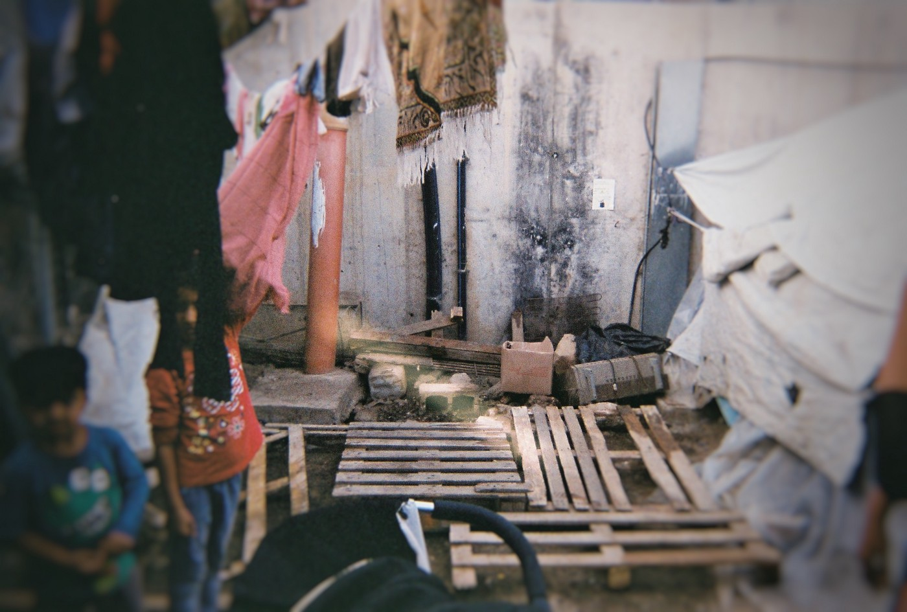

### AYS DAILY DIGEST 02\.01\.2020: “I Can’t Breathe” and a terrifying insight into the violence of deportations

Denmark still using violent restraint technique banned in Sweden, which has lead to deaths // Small victory in Greece — maybe a precedent set? // Tragic death on the route…

Photo Credit: Still I Rise
### FEATURE: Violence in Deportations with Deadly Results

A recent article sheds further light into the use of police violence in the restraint and control of people being deported from Denmark\. The article in the portal Information\.dk describes how Danish police are “allowed” and taught to use a particular technique to “pacify” a victim of deportation “In short, the particular means of force is that the head of the…foreigner is bent forward and pressed down against the chest\.”

This technique was mentioned as being part of police practice, but it has come to light that the police are not trained in an important aspect of this form of control \(torture\) \.

> “The National Police have asked a doctor to assess the aforementioned means of force\. In the spring of 2018, the doctor at the Police Academy has been shown a situation where ‘the person is sitting down, for example in an airplane seat\. A police officer then take a firm grip on the top of the head / forehead and push the head down towards the chest, ”as the doctor describes it\. 

> According to a file from the National Police, the doctor was asked to assess ‘whether the grip can prevent the person from breathing, thus causing airway obstruction’\. 

> The doctor’s conclusion is as follows: ‘The grip is of short duration, ie\. lasting seconds and being released as soon as the person stops shouting and spitting\. 

> And: “If the grip as described is maintained briefly and released as soon as the person ceases crying and saliva, my assessment is that it will not cause respiratory problems\.”” 

However although the National Police Guide includes this anecdote in their guidance manual for deportations, the phrase “lasting seconds” is omitted, leaving only the implication of “briefly\.”

This omission has terrifying consequences as this form of control can lead to asphyxiation, according to Jens Modvig, Chief Physician at the the Danish Institute Against Torture\. Additionally, Dr\. Modvig highlighted that the dangers of this violence are exacerbated through the presence of psychoactive drugs\. In many cases, drugs are administered to victims of deportation in order to “calm them,” further endangering them and reducing their agency\.

In 2017, an Algerian man who was facing a deportation was subjected to this kind of control on his deportation flight\. Additionally, the officer put his whole body weight onto the back of the man\. Other passengers described the man as nearly collapsing \(an account omitted in the later police report\) \. The Algerian man went into a state of cardiac arrest and died two days later\.

[In another article by the same paper, they highlighted that this used of force has been outlawed in Sweden after it was used on an Iraqi man who later died\.](https://www.information.dk/indland/2020/01/svensk-myndighed-bruger-laengere-livsfarligt-politigreb-tvangsudsendelser)

> “When the Swedish authorities were forced to deport a 44\-year\-old man to Iraq in March 2015, unrest occured when the man was placed in the plane seat\. “Once on board the plane, the person lost consciousness after an intervention in the airplane seat,” Johan Mellbring, chief of the National Transport Unit under the Prison and Probation Service, told the TT the following day\. The Iraqi was carried off the plane, taken to hospital and declared dead\. The death changed the rules for the use of force by the Prison Service\. Since 2016, the staff of the Prison and Probation Service, which accounts for the majority of forced expulsions of foreigners from Sweden, no longer had to use the means of force to bend a forced forward forward in the airplane seat\. This is stated by press secretary Ulf Mossberg from the Prison and Probation Service for Information\. Meanwhile, the grip is still allowed in Denmark\.” 

These events bear a sinister parallel to the death of Eric Garner in the US who was “restrained” by police during his arrest for selling single cigarettes on the street\. The officers involved placed their hands around Garner’s neck and wrestled him to the ground, whereupon he told them that he could not breathe due to his position and their restraint\. They ignored him, and Garner suffocated and died\. [“Specifically, an autopsy indicated that Garner’s death resulted from “\[compression\] of neck \(choke hold\), compression of chest and prone positioning during physical restraint by police”](https://www.nytimes.com/2014/08/02/nyregion/staten-island-man-died-from-officers-chokehold-autopsy-finds.html?smid=pl-share)

The officer involved in Garner’s murder was not indicted, settled out of court, and was only terminated from his position five years after his death\.

There is a long, interconnected and sordid legacy on the allowance of state violence upon those without privilege throughout the West\. Those who are facing deportation have little to no protection, are viewed as inherently violent and criminal, and are treated in vastly inhumane ways, often being abandoned to death after their deportation is completed\. In 2020, we must stay alert to the ways in which police violence and violence against those considered “outsiders” or undesirable intersect and feed one another\.

EASTERN MEDITERRANEAN AND BALKAN ROUTE

In **Greece** , there has been a small victory reported by Still I Rise where five unaccompanied minors will be immediately transported from the Samos Hotspot\. Their case was taken to the European Court of Human Rights by Greek Forum for Refugees, with the support of other organizations, where their dire situation was explained\. According to article 3 of the human rights convention, they were ruled to be obligated housing\. It is hoped that this will set a positive precedent for the future\.

For more details on the ruling, go [here](https://www.facebook.com/stilliriseNGO/photos/a.243175282942704/558779788048917/?type=3) \.

Aegean boat report published their monthly report for December\. [The number of people on the Greek Islands remains over 42,000 people](https://www.facebook.com/AegeanBoatReport/posts/737920226731084?hc_location=ufi) \. Although we are happy that some are being evacuated, this number is too small compared to the need\. Although the numbers of people arriving this month dropped, the number of transfers still cannot keep up with the number of arrivals as can be seen below\.

](assets/ac67469efd6b/1*Q64EzEd1YhtmTq__ItNUGg.jpeg)

Photo Credit: [Aegean Boat Report](https://www.facebook.com/AegeanBoatReport)

> At the **Italian\-Slovenian** border, a man has died while trying to cross a treacherous rocky pass, attempting to reach Italy\. The man fell into a ravine from a rocky precipice and died from the fall\. He is survived by his wife and two other companions\. A recovery operation for his body is now commenced\. 

**Find daily updates and special reports on our [Medium page](https://medium.com/are-you-syrious) \.**

**If you wish to contribute, either by writing a report or a story, or by joining the info gathering team, please let us know\.**

**We strive to echo correct news from the ground through collaboration and fairness\. Every effort has been made to credit organizations and individuals with regard to the supply of information, video, and photo material \(in cases where the source wanted to be accredited\) \. Please notify us regarding corrections\.**

**If there’s anything you want to share or comment, contact us through Facebook, Twitter or write to: areyousyrious@gmail\.com\.**

_Converted [Medium Post](https://medium.com/are-you-syrious/ays-daily-digest-02-01-2020-ac67469efd6b) by [ZMediumToMarkdown](https://github.com/ZhgChgLi/ZMediumToMarkdown)._
