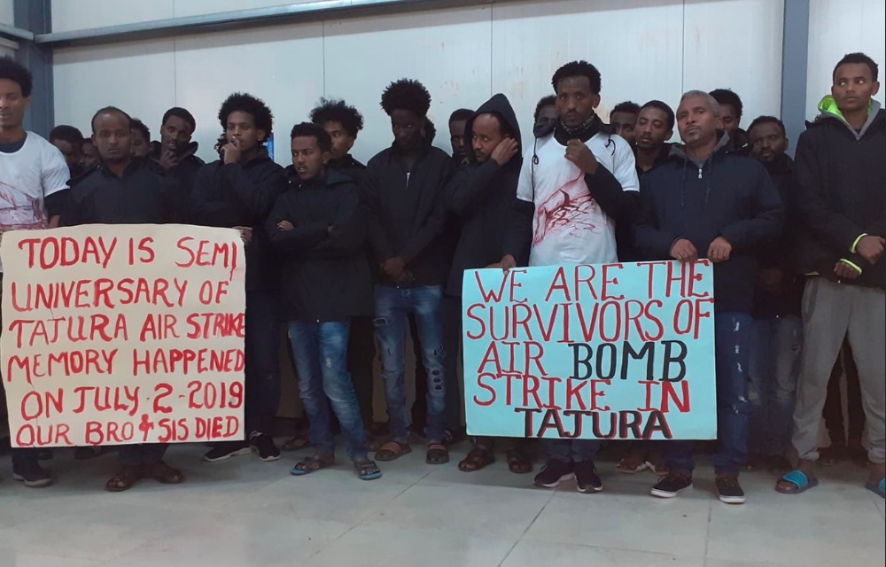
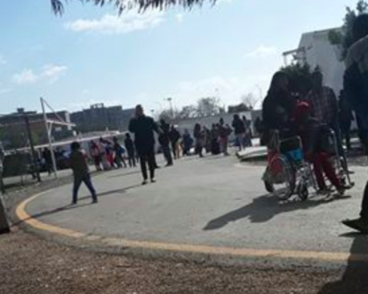
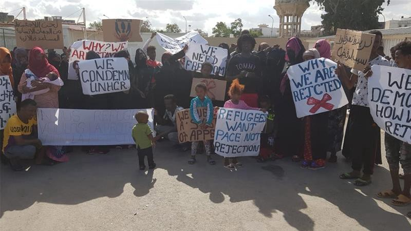
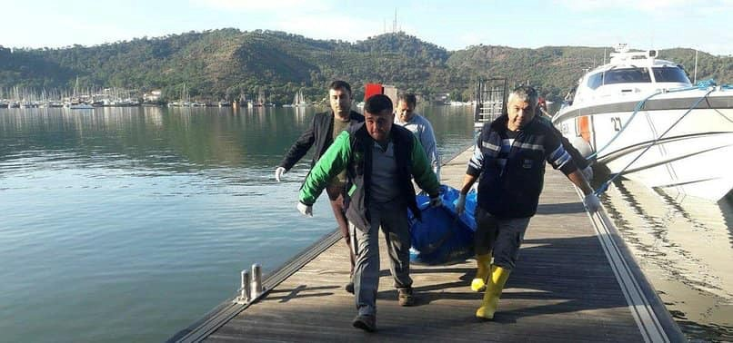
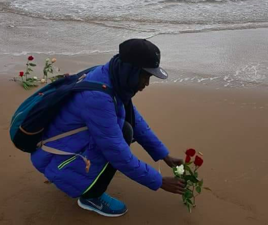
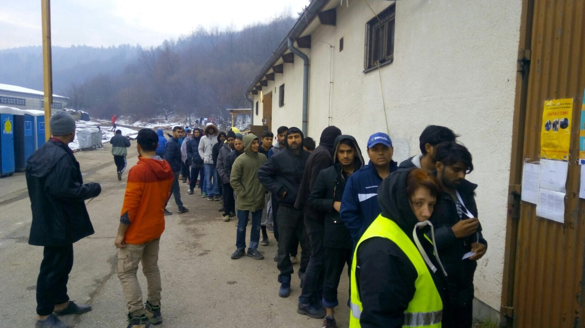
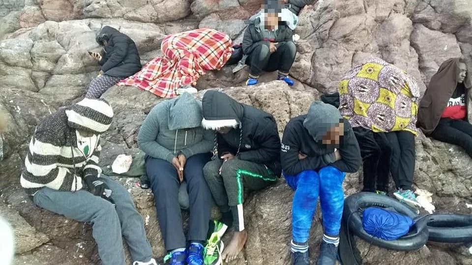

### AYS Daily Digest 3/1/20: Mortars fall on UNHCR “safe haven” in Tripoli
#### In the GDF centre, people are deliberately starved as UNHCR tries to make them leave / 25,000–50,000 refugees expected to flee Libya to Tunisia, new border camp announced / Up to 15 people drowned off Turkish coast / Greece publishes a list of 12 safe countries to deport people / Following months of local solidarity, Pomozi\.ba to host migrants in near Tuzla

The mortar attack at the site happened on the day of memorial of the deadly airstrike on Tajura detention center, when at least 53 people were killed in the airstrike and 130 were injured\. Photo: [Sally Hayden](https://twitter.com/sallyhayd)
### UNHCR staff evacuated, people left on site

According to witnesses at the UNHCR Gathering and Departure Facility \(GDF\) in Tripoli, yesterday, refugees were told to leave because “a missile fell inside the centre, 300 metres away from the people”\. Independent unofficial sources have confirmed at least three mortars fell in or around the GDR, but the one nearest to the residents fortunately didn’t explode\. It is still unclear if three rockets fell around the centre, or if one \(non\-exploding\) fell inside the GDR, as some residents of the centre claimed\. The UNHCR only confirmed three mortars falling in the nearest proximity of the centre\.

> _The UN Refugee Agency, is deeply concerned for the safety of refugees and asylum seekers at the Gathering and Departure Facility \(GDF\) in Tripoli, Libya, following news that three mortars fell close to the site earlier today\. Fortunately, there were no casualties, the UNHCR said in a statement\._ 

Following their usual protocol in such cases, UNHCR have evacuated the site immediately, leaving people to return at their own risk\.

Snapshot of the chaotic evacuation of the GDF\. Photo: Sally Hayden
### They got $6 million, but won’t feed people?

The site believed to have cost $6 million falls under the jurisdiction of the Libyan Ministry of Interior\. UNHCR and its partner, LibAid, have been allowed to operate services at the GDF by the Libyan authorities since it opened in December 2018\. In the beginning, they praised the GDR as a “safe haven” for those who managed to escape horror\-like Libyan detention centres\. However, the GDR soon became another appalling example of neglect\.

> _In November, [internal documents](ays-daily-digest-29-11-19-what-is-happening-in-unhcr-facility-in-tripoli-70ee767cd2e7) revealed testimonials of people inside the GDF that the UNHCR has decided to deprive of food in order to get them to leave the compound\. The UNHCR responded with a [statement](https://www.unhcr.org/news/press/2019/11/5ddffe994/unhcr-expands-help-refugees-urban-areas-libya-reassesses-role-gathering.html) saying they were “reassessing the role and functioning of the GDF” and announced “UNHCR will phase out food catering at the GDF in the New Year”\. In December, [they’ve asked people to leave](ays-daily-digest-11-12-19-people-asked-to-leave-gdf-or-lose-right-to-asylum-ffb3439b4e6f) GDF or lose right to asylum\._ 

The official capacity of the facility is 600, but it hosts up to 1100 people\. In July, following a deadly airstrike at the Tajoura detention centre, hundreds of former detainees made their way into the GDF\. They were followed by another group of around 400 people from Abu Salim detention centre in late October, as well as up to 200 people from urban areas\.

In late October, many people including the most vulnerable families were told by the UNHCR officials there are no spots for them in the reallocation scheme and were asked to leave the GDF\.

Families protesting rejections from UNHCR in front of the GDF in Tripoli\. Photo: Sally Hayden
### Mortar attack marks semi\-anniversary of the Tajoura tragedy

Yesterday’s mortar attack happened at the semi\-anniversary of the [deadly airstrike at the Tajoura detention](ays-daily-digest-3-7-19-an-increase-in-dublin-returns-to-italy-98888fce39fd) center 16 kilometers east of Tripoli, while hundreds of people were inside the facility\. According to the UN, at least 53 people were killed in the airstrike and 130 were injured\. Reports were made to the UN that guards shot at people trying to flee from the air strike\. The US [vetoed](https://www.thenational.ae/world/mena/un-renews-bid-for-libya-ceasefire-resolution-after-migrant-deaths-1.883060) a resolution of the UN Security Council condemning the attack\. Less than 48 hours after the attack, a vast majority of Italian MPs [voted to continue Italy’s mission in the country](http://www.ansa.it/sito/notizie/politica/2017/08/02/libia-in-senato-si-vota-la-risoluzione-sulla-missione-navale-la-diretta_3153feb1-180c-45eb-89a4-2abd77fe84ae.html) , extending the economic support for curbing migration from 1\.7 million € \(as agreed in the deal originally signed by the previous ‘left\-wing’ government\) to 7 million €\.
### Tunisia
### 25,000–50,000 refugees expected to flee Libya to Tunisia, new border camp announced

The Tunisian authorities in Tataouine have announced that a new camp will be set up to accommodate arrivals from the Libyan side\. The talks about the site have been going on for months, but they have now sped up “in anticipation of the security developments that Libya may witness”

> _Tunisian reports expects the number of arrivals from the Libyan side to Tunisia will reach between 25,000–50,000 thousand refugees\._ 

The governor of Tataouine, Adel Al\-Warghi said that the border area of ​​Bir Al\-Fatnasiya will be the site of the new camp\. He pointed out that the UNHCR assumed the logistical side of the camp from tents, financing, family and blankets, while the regional authority is responsible for overseeing and organizing the camp, while providing health and hygiene coverage\.
### Greece
### Up to 15 people drowned off Turkish coast

The boat was heading towards Rhodes\. Nationalities of deceased are not revealed\. Photo: ABR

According to the Aegean Boat Report, a boat carrying at least 15 people capsized late Thursday off the coast of Fethiye, Turkey\. The bodies of eight people, three of them women, were recovered while seven are still missing, believed to be drowned\. The boat was heading towards Rhodes\. The coast guard dispatched three boats, a team of divers, a plane and a helicopter to the area\.

> **_In 2019 the Turkish coast guard and police have stopped 107981 people to reach the Greek Aegean islands on 3140 boats\. Turkish coast guard stopped 60802 people on 1761 boats, joint operations between Turkish coast guard and police stopped 47179 people on 1379 boats\. Since the EU\-Turkey deal in March 2016, Turkish coast guard and police have stopped 181000 people on 4950 boats from reaching the Greek Aegean islands, ABR counted in their yearly resume\._** 

### Greece publishes a list of safe countries of origin, deportations to 12 countries made easier

Today, the Greek government published a joint ministerial decision, signed by Foreign Minister Nikos Dendias and Citizen Protection Minister Mihalis Chrysohoidi, that outlines 12 “safe countries of origin”\.

> _The decision lists Ghana, Senegal, Togo, Gambia, Morocco, Algeria, Tunisia, Albania, Georgia, Ukraine, India and Armenia as safe to return failed asylum seekers\._ 

Based on article 87 of the new 2019 law on applying for asylum, a country can be judged safe for an asylum seeker if an examination of his or her application shows that they have not cited “serious reasons why the country is not a safe country of origin for the applicant\.” The new law provides for the fast\-tracked consideration of asylum applications by individuals from safe countries of origin, allowing shorter processing times and easier deportations\.
### Mediterranean
### AlarmPhone counts hundreds of lives that might have been saved by SAR reaction

AlarmPhone has published a list of death and forced disappearances witnessed by their staff members in 2019\. They mostly include drownings in the Central and Western Mediterranean and the Aegean Sea, but also a case of drowning between Serbia and Bosnia\. It’s hard not to wonder if SAR ships that were confiscated or forced out of the Mediterranean might have prevented some of the unnecessary tragedies\.

> _“We cannot forget those who have been killed or forcibly disappeared\. Over the past year, we were directly involved in dangerous situations at sea that ended with people losing their lives\. In the situations listed below, we are certain that people lost their lives, or we strongly fear that boats went missing\. This is not an exhaustive list\. Sometimes we heard of boats but were never able to reach them and never found out what happened to them\. Regularly, relatives and friends reached out to us to report their loved ones missing and we just could not find out where and how they were”, AlarmPhone wrote in a heartbreaking [post](https://alarmphone.org/en/2020/01/02/death-and-forced-disappearances-witnessed-by-the-alarm-phone-in-2019/) \._ 

Families still mourn those who dissapeared in the sea\. Photo: AlarmPhone
### Bosnia
### Following months of local solidarity, Pomozi\.ba will host migrants in a new facility near Tuzla

Bosnian NGO Pomozi\.ba confirmed they will be supporting migrants in a new facility in Tuzla\. A formal migrant camp was announced weeks ago by a local mayor following months of local solidarity with people who are sleeping rough at Tuzla bus station\. Meanwhile, Pomozi\.ba stepped in by renting an old Hotel in Mihatovići near Tuzla\. So far they operate with 62 beds, but they plan to introduce a total of 100 beds in the following days\. Their plan is to provide a stop\-and\-go type of facility for people on the move, instead of the reception facility for long\-term stays of asylum seekers\. It is still unclear if the solution they’ve provided is the same solution the Mayor had announced, or if a more formal facility is being arranged at the same time\.

> _“We have enough food for people in Ušivak and Blažuj camps\. We don’t need additional support there\. However, as we’re in the last days of preparations for hosting people in Tuzla area, any help in that field would be highly appreciated”, Pomozi\.ba said\._ 

Pomozi\.ba has been distributing thousands of meals to refugees in Ušivak and Blažuj camps, where people evicted from Vučjak camp have been transferred\. The distribution in the camps is supported by EU funding\.

Distribution in one of the camps where people from Vučjak have been transferred\. Photo: Pomozi\.ba
### Serbia
### Subotica camp overcrowded, lacks provisions

As temperatures fall below zero degrees celsius, people in Serbian camps are trying to stay warm and save energy for the trip ahead of them\. A video emerged, showing conditions in Subotica camp, in the nearest proximity of the violent Hungarian border\. Residents say basic provisions are not given to everyone, or at least not soon enough\. During the day, they’re burning wood in the yard to keep themselves warm and to escape overcrowded tents and containers\.
### Spain
### A pushback of 42 people, including 2 small children, documented on Chafarinas Islands

A group of 42 people from Sub\-Saharan Africa, including 26 women and two small children, appeared at Chafarinas Islands this morning, trying to find refuge in Europe\. Against international laws and conventions, members of the Spanish Civil Guard collectivelly expelled them back to Morocco\. According to [Association Marocaine des Droits Humains — Section Nador](https://www.facebook.com/AmdhNador/) , upon arrival to Morocco, women and children were put on buses and brought back, even deeper into Morrocan territory, while men were put in detention\.

They asked for protection, only to be returned back to Morocco\. Photo: [Helena Maleno Garzón](https://www.facebook.com/helena.malenogarzon?__tn__=%2CdCH-R-R&eid=ARAhaih_gS7F5ZKj_deVl1QhRmSID-yBxGcY9hIVmPt5oeI036AJRFRmtI5aNFkHOigQG1rzqvH-RJVP&hc_ref=ARQ6fB6zA7IMRtpIlbLzpT3aVZ6ixN75ZuDQbtStuF7uTUN87N4PQ5wKlL0URSgjrQ4&fref=nf&hc_location=group)

**Find daily updates and special reports on our [Medium page](https://medium.com/are-you-syrious) \.**

**If you wish to contribute, either by writing a report or a story, or by joining the info gathering team, please let us know\.**

**We strive to echo correct news from the ground through collaboration and fairness\. Every effort has been made to credit organizations and individuals with regard to the supply of information, video, and photo material \(in cases where the source wanted to be accredited\) \. Please notify us regarding corrections\.**

**If there’s anything you want to share or comment, contact us through Facebook, Twitter or write to: areyousyrious@gmail\.com\.**
### [Are You Syrious?](/are-you-syrious?source=post_sidebar--------------------------post_sidebar-)
#### Daily news digests from the field, mainly for volunteers and refugees on the route, but also for journalists and other parties\.

Following
- [Refugees](/tag/refugees)
- [Migrants](/tag/migrants)
- [Lybia](/tag/lybia)
- [Unhcr](/tag/unhcr)
- [Asylum Seekers](/tag/asylum-seekers)

_Converted [Medium Post](https://medium.com/are-you-syrious/ays-daily-digest-3-1-20-mortars-fall-on-unhcr-safe-haven-in-tripoli-2072d607642b) by [ZMediumToMarkdown](https://github.com/ZhgChgLi/ZMediumToMarkdown)._
