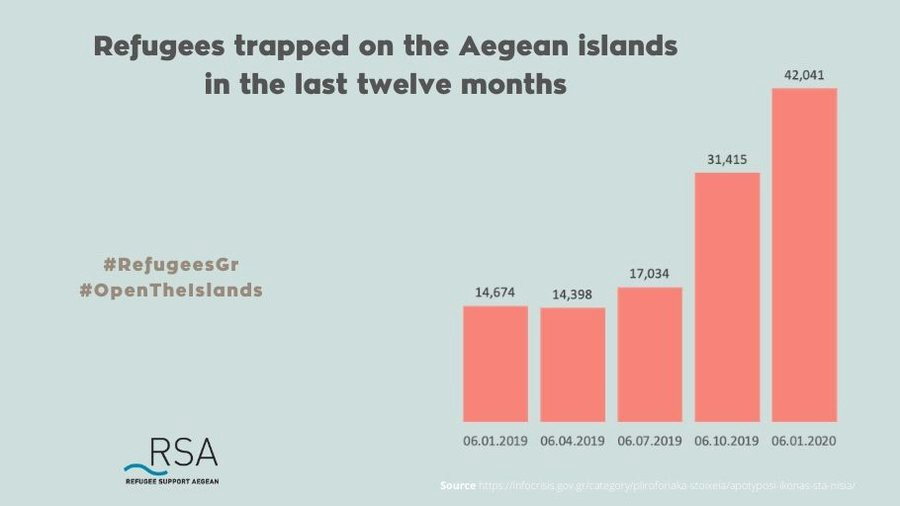
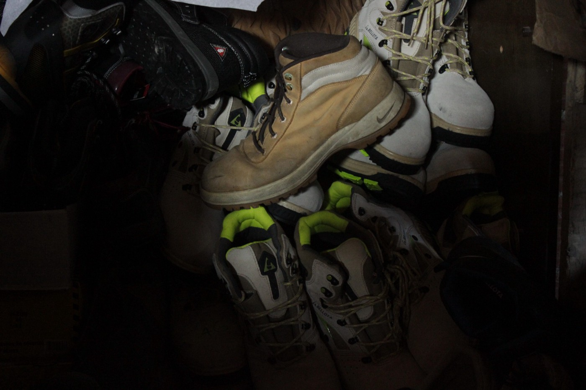
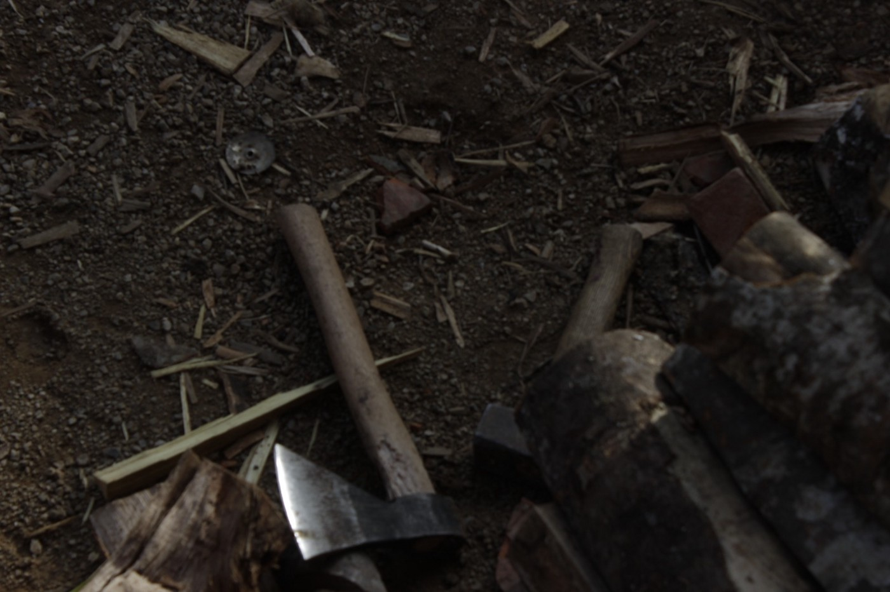

### AYS Daily Digest 8/1/20: EASO steps up in Greece ‘to ensure individual asylum cases are dealt with in a coherent way’
#### Additional 550 personnel to help with asylum claims in Greece, and support in Malta / Difficult situation for the people on the move stuck in Velika Kladuša continues / Germany: 20,000 people less asked for asylum in 2019 than did so the year before / Unaccompanied minors in the streets of Paris…

 \)](assets/63755d20ca8/1*jeRFAK7wj2nFMxbWfNoqdQ.jpeg)

While people wait for their cases to move from status quo, these are their living conditions\. Chios, Greece \(Photo: [Pothiti Kitromilidi](https://www.facebook.com/pothiti.kitromilidi?fref=gs&__tn__=%2Cd%2AF%2AF-R&eid=ARCxL9S6VgnFvw7OWzcHTcuY8p8r0F5jtUKuckLWeeunjUHQ1bEZ4XgFDolOGUsWjlSjX3zlY1c1jTAV&tn-str=%2AF&dti=421759534684819&hc_location=group_dialog) \)
#### FEATURED

The majority of the people stranded on the Greek islands are exposed to dire conditions and severe cold weather\. Their number has tripled in the past twelve months and reached over 42,000, according to Refugee Support Aegean\.

There are still many people classified as ‘vulnerable’ \(unaccompanied minors, women with children, sick men and women…\) who are living under unsuitable conditions in and around the official island camps\. Moria will surely be defined as one of our generation’s biggest disasters and missed opportunities to help and change it\. Recent figures say there are roughly 1,500 women at the camp on Chios, too\. Many single women are forced to live in a hostile male\-dominated space\. However, particularly single men are being trapped on the islands longest as the long wait for the asylum seekers in Greece has only gotten longer\. It seems that, at least in that field, some changes have now been announced\.

Unlike Italy, which apparently faces less workload within first\-instance asylum procedures, Greece more than ever needs support as the arrivals and pressure to the islands to speed up the first\-instance asylum procedure is accelerating, so 550 personnel will be sent to Greece to help the country with asylum procedures and reception infrastructure, announced EASO [in a statement](http://kno6.mjt.lu/nl2/kno6/m6s01.html?m=AMMAAFy8gaEAAckBp4IAAKNXmNsAAP-N-BkAF-fcAAliiABeFGxndMFOWWQCQ8-k6z53DZMd9gAI5Wk&b=1a91bcc4&e=78b67c11&x=muFalryEFsly6xgYdN81zITOSJ8UEH4ypdLnPajV5aw) \.

According to EASO, its presence on the mainland [will increase](https://www.infomigrants.net/en/post/21953/easo-to-increase-asylum-support-in-greece-in-2020?fbclid=IwAR1rPfNeYzysd-T4y9-1ta5GM8t5FAQHMbe8Tf1VgsCpLJEGEIWs529aS50) by four times the level of 2019, and EASO officers are now being deployed to eight new locations in Thessaloniki and Ioannina, with the aim of ensuring that individual asylum cases are dealt with in a coherent way\.

**Malta**

EASO will also double its support to Malta, increasing its support within the asylum procedure and, for the first time, offering support in reception, though it will not be involved in the direct management of the reception centers\. “In addition, EASO will continue to be ready to support the Maltese authorities with _ad hoc_ disembarkations and voluntary relocations,” says the [quoted](https://www.infomigrants.net/en/post/21953/easo-to-increase-asylum-support-in-greece-in-2020?fbclid=IwAR1rPfNeYzysd-T4y9-1ta5GM8t5FAQHMbe8Tf1VgsCpLJEGEIWs529aS50) statement\.
#### BOSNIA AND HERZEGOVINA
### Velika Kladuša

The volunteers of No Name Kitchen who are active in Velika Kladuša wrote about some of the results of the local discrimination against the people on the move who are currently in the town\. They say the town’s Christmas market prohibited entrance to these people\. “Municipal staff and the city police recklessly applied a security cordon\. We mustn’t extend municipal actions to the coexistence with locals, a relationship which is currently fragile and deteriorating and stems from different premises that have nothing to do with the repressive action of the government officials\.”

The volunteers are continuing their activities, providing clothes, shoes and food packages for the people stranded in the town\. The food boxes contain: onions, potatoes, carrots, garlic, spices, salt, sugar, flour, sunflower oil, beans, rice and tomato sauce\. Thanks to new donations they have also now added chocolate bars, cookies, milk, dates, canned fish and instant soup\.

Follow their social media for more updates on work in Šid \(Serbia\) and Patras \(Greece\) \.

](assets/63755d20ca8/1*LDXiBLESINmcv-uiFV79EA.jpeg)

Photos: [No Name Kitchen](https://www.facebook.com/NoNameKitchenBelgrade/?tn-str=k%2AF&hc_location=group_dialog)

However, in due respect to the locals, it must be said that there is a steadfast effort on behalf of some of the local people from Velika Kladuša who are still supporting and helping people in many different ways, and whom we visited in the beginnings, as they were supporting the people in transit long before any of the organizations or volunteers arrived from abroad\. Such practical, political, and symbolic acts are further raising the visibility and urgency of the matter to be better approached by the local authorities, those of the canton and Federation, but also of the international organisations who are merely doing their job as in any other industry, often without engagement to push for better viable solutions as they are not doing just ‘any job’, and they do represent the United Nations most of us are a part of, supporting the Agency \(and its subcontractors\) financially, thus there should be a space to say something, especially when it’s obvious\.
#### FRANCE

> “Unaccompanied minor in Paris\. \. my daily life is to walk and queue, to eat and sleep\. To survive\. This routine, it tires me\.” 

Many young people are living in this situation and struggle every day to have what is necessary to survive\. They find themselves alone and have to struggle on a daily basis to keep up\.

This is how the day of one of the young boys looks, as told through Utopia56 to the [media](https://www.la-zep.fr/societe/24-heures-dans-ma-vie-de-mineur-isole/?fbclid=IwAR2XrEmXkd28vmg1UbYUnh6dxwPjW17n52cITrQY-FenG5c533Aopnx9zEI) :

“As soon as I wake up, you have to be quick\. I get up between 6:00 and 7:00, depending on whether I have an appointment or not\. I barely have time to brush my teeth that I already have to leave\. I live in a camp at Porte d’Aubervilliers, and I have 40 minutes to walk to Stalingrad for breakfast\.
If I’m late, there’s less to eat because a lot of other people come to feed like me\. Sometimes all that’s left is coffee or tea, and there’s \[no\] more bread when I get there\. So I’m hungry until noon\.

Then I have to leave quickly because I have a 30\-minute walk to get to Belleville\. That’s where I’m going to wash up, but the problem is that there is a lot of tail\. There are between 50 and 60 people for two showers\. Sometimes I don’t wash for three or four days because I’m late\. And sometimes I have to choose between showering and eating\.

**I spend my life queueing up** 
We have to arrive before 11:30, otherwise we can’t go\. And often, I have to wait 30 minutes before I can go underwater\. Again, I only have five minutes to wash up, because others are waiting\. And if it takes more than eight minutes, we come knocking on the door to tell us that it’s over and that we have to get out\.

After that, head to Crowns, in the garden, to eat at the association Les Midi du MIE\. Fortunately, it is only five minutes walk\. There, there are still the same 50–60 miners who washed in Belleville\. I still find food, but it’s still the tail\. If we arrive after 2 p\.m\., we are told “sorry, it’s over”\.

Then I hurry to the library at Porte de la Villette so that I can plug my phone into a socket, because sometimes we have to wait two hours\. But that’s good because security comes to check that there’s only one phone plugged in per person\. After that, I leave around 5 pm from the library to eat at Porte de la Villette\. We can go there from 6 pm\. I’m tired of waiting, but there’s still a line\.

■■■■■■■■■■■■■■ 
> **[Utopia 56](https://twitter.com/Utopia_56) @ Twitter Says:** 

> > [PARIS] Il n'est que 18h30 et déjà 30 personnes, dont 15 enfants nous ont sollicité pour un hébergement ce soir. Aidez-nous à poursuivre nos actions auprès des exilé-es à la rue en participant à notre crowdfunding [helloasso.com/associations/u…](https://www.helloasso.com/associations/utopia56/collectes/un-toit-pour-toi) (📸 Julie Desbois) https://t.co/6Q7kjc4RKK 

> **Tweeted at [2019-12-24 17:31:33](https://twitter.com/utopia_56/status/1209527040543735808).** 

■■■■■■■■■■■■■■ 

After that, I have a 30\-minute walk back to Porte d’Aubervilliers\. At 7:00, we meet at Rosa Parks for a chat, and around 8:00, we pick up our tents at Utopia 56\. If you come after 10 pm, you can’t have a tent\. Then I take 20 minutes to set up my tent\. At 10:30 pm, I can finally sleep\. But tomorrow it’s happening again\.”

Fofana, 16 years old, Paris
#### GERMANY

In 2019, 142,509 people asked for asylum in Germany\. This means 20,000 people less than the year before\.

Officially, there were 111,094 requests, because the authorities do not count children of asylum seekers, who were born in Germany, anymore\. 
NGOs are criticizing this new procedure that is defined in such way because it makes it harder to compare the numbers to previous years\.

Most people came from Syria \(26,435\), Iraq \(10,894\) and Turkey \(10,275\) \.

Germany has an upper cap of 180,000–220,000 asylum requests per year\.

**Find daily updates and special reports on our [Medium page](https://medium.com/are-you-syrious) \.**

**If you wish to contribute, either by writing a report or a story, or by joining the info gathering team, please let us know\.**

**We strive to echo correct news from the ground through collaboration and fairness\. Every effort has been made to credit organizations and individuals with regard to the supply of information, video, and photo material \(in cases where the source wanted to be accredited\) \. Please notify us regarding corrections\.**

**If there’s anything you want to share or comment, contact us through Facebook, Twitter or write to: areyousyrious@gmail\.com\.**

_Converted [Medium Post](https://medium.com/are-you-syrious/ays-daily-digest-8-1-20-easo-steps-up-in-greece-to-ensure-individual-asylum-cases-are-dealt-with-63755d20ca8) by [ZMediumToMarkdown](https://github.com/ZhgChgLi/ZMediumToMarkdown)._
