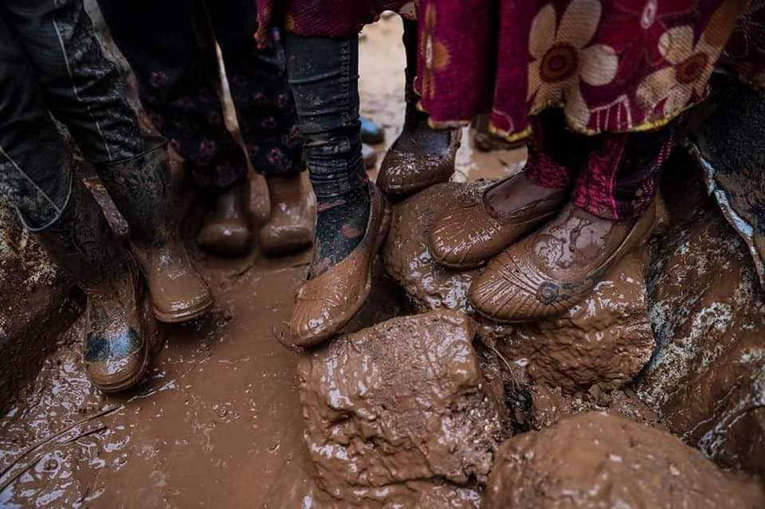

### AYS Daily Digest 09/01/20: New Report on actors and situation in Syria
#### New report by European Asylum Support Office on situation in Syria // Frontex reports decrease of irregular border crossing // Arrivals in Greece // Sea Watch 3 rescues 77 people // A letter to Danish ministries on situation in Ellebæk // Calls for support in the Balkans

Situation in regufee camps in the region of Idlib\. Copyright: Art against
### FEATURE

The European Asylum Support Office published a new piece, titled “Syria — Actors”\. The report is part of a series of reports that cover actors of protection, internal mobility, key socio\-economic indicators, and targeting of individuals and are supposed to provide information relevant for international protection status determination for Syrian asylum seekers\.

The report gives an in\-depth overview of the current situation in Syria concerning the main actors, their area of influence and relations to each other\.

**Abuses committed by government security forces and associated armed groups**

The report collects several different kinds of severe abuse inflicted on civilians by government security forces and associated armed groups\. Arbitrary detention and enforced disappearance of peaceful activists, deaths in government custody without giving notice to family members, severe torture and sexual violence are well documented\.

> “Since the summer of 2018, death registers have been issued by government authorities, officially confirming for the first time the deaths of thousands of people in government custody, who had died but without the state notifying their families or providing death certificates\. In most cases natural causes of death such as ‘heart attack’ or ‘stroke’ were indicated\. Former inmates interviewed by human rights organisations stated that they were subjected to multiple forms of torture, and suffered illness as a result of inadequate nutrition and hygiene while in detention\.” 

The report expounds upon war crimes, crimes against humanity and the use of chemical weapons\.

The report includes similar sections on abuse committed by the groups that are holding power in other territories in Syria\.

Find the report [here](http://FEATURE The European Asylum Support Office published a new piece, titled “Syria – Actors”. The report is part of a series of reports that cover actors of protection, internal mobility, key socio-economic indicators, and targeting of individuals and are supposed to provide information relevant for international protection status determination for Syrian asylum seekers.  The report gives an in-depth overview of the current situation in Syria concerning the main actors, their area of influence and relations to each other.  Abuses committed by government security forces and associated armed groups The report collects several different kinds of severe abuse inflicted on civilians by government security forces and associated armed groups. Arbitrary detention and enforced disappearance of peaceful activists, deaths in government custody without giving notice to family members, severe torture and sexual violence are well documented. “Since the summer of 2018, death registers have been issued by government authorities, officially confirming for the first time the deaths of thousands of people in government custody, who had died but without the state notifying their families or providing death certificates. In most cases natural causes of death such as ‘heart attack’ or ‘stroke’ were indicated. Former inmates interviewed by human rights organisations stated that they were subjected to multiple forms of torture, and suffered illness as a result of inadequate nutrition and hygiene while in detention.” The report further speaks about war crimes and crimes against humanity and the use of chemical weapons.  The report includes similar sections on abuse committed by the groups that are holding power in other territories in Syria.       Find the report here: https://coi.easo.europa.eu/administration/easo/PLib/2019_12_EASO_COI_Report_Syria_Actors.pdf) \.

Meanwhile, the situation in Idlib is getting worse once again, as the winter affects the life of refugees in camps\. According to the UN, some three million civilians are currently trapped in a war zone\. Some 300\.000 people were displaced following the latest attacks, which amounts to 700\.000 displaced people in total when taking into account the 400\.000 that have been displaced between May and August last year\. In the same time period, about 1\.300 civilians were killed by airstrikes and shelling\. Mark Cutts, Deputy Regional Humanitarian Coordinator for the Syria Crisis, said in a statement:

> “Every day we receive more disturbing reports of families caught up in the violence, seeking refuge and access to essential services in overcrowded camps and urban areas\. Many are now sheltering in schools, mosques and other public buildings\. Critical shortages of food, shelter, health and winterization assistance, as well as other basic services required for survival, are being reported across Idleb”\. 

Find the UN News\-Article [here](https://news.un.org/en/story/2020/01/1054871) \.
#### GENERAL

**Frotex** published a press release stating that,

> “the number of irregular border crossings detected on the European Union’s external borders last year fell to the lowest level since 2013 due to a drop in the number of people reaching European shores via the Central and Western Mediterranean routes\.” 

We know that these numbers are a result only of push\-backs at sea; detention centers in horrendous conditions in Libya, run by war lords and financed by EU; the horrible situation in the camps in Greece; and violent push\-backs along the Balkan boarders\. 
Find the full press release here:

#### SEARCH AND RESCUE AT SEA

The **Sea Watch 3** rescued 77 people in two operations in the last two days\.

**Alarmphone** was further informed yesterday evening about a boat in distress with 41 people, amongst them many children\. The boat was located within the Maltese SAR zone\. Alarm phone informed the Maltese authorities\. The people on board were desperate, Alarmphone reports\. Water was entering the boat\. “The sea is so big, and our boat is too small, we are afraid to die\.” they said\. No updates yet on their situation\.

Aegean Boat Report reported of one boat that landed on Lesvos despite bad weather conditions, carrying 57 people\.
#### BOSNIA AND HERZEGOVINA
### Bihać

A month after the closure of Vucjak, members of the Red Cross Mobile Teams have actively continued their work on serving migrants in Bihac, but also at all access locations leading to the city\. Mobile Teams also work on a daily basis to serve the migrants in the locations where they reside, out of the official IOM\-ran camps\.

The tasks of the Mobile Team are providing food packages, distributing clothing and footwear, and providing first aid, as well as registering migrants at locations in the surrounding area\.

](assets/58dd6b0b4fcf/1*3WVObzM96Ay8lI-4GO2Crg.jpeg)

Copywrite: [Crveni križ grada Bihaća](https://web.facebook.com/CrveniKrizBihac/)
### **Tuzla**

In Tuzla, a new refugee center Man Motel opened its door to 62, soon to be 100 people\. It is operated by a local NGO Pomozi\.ba, and it serves as a stop\-and\-go location for people on the move, where they can rest, eat and wash\.

> “What made us very happy about the migrants housed at the Man Motel in Tuzla is their attitude regarding the accommodation itself\. The migrants took their own initiative in cleaning the premises, preparing food, washing dishes, laundry, etc\.” 

The center is supposed to support the most vulnerable people amongst the hundreds that are sleeping raw and in squats in and around Tuzla\. It provides a place to rest, get treated, recover and have a warm shower for sick and vulnerable men\.

The center is in need of support, be it hands\-on or financially\. See there facebook page: [Promozi\.ba](https://web.facebook.com/pomozi.ba/posts/1833010923497832?hc_location=ufi) \.
### Sarajevo

We have previously reported about the ongoing efforts of the local groups, students and foreign NGOs in the city collecting and distributing clothes, food and other basic necessities to the people stranded outside, in the streets or some provisional accommodation\. They need support, primarily in funds, but also men’s clothes, warm shoes, blankets, sleeping bags and such\. If you have something and can’t decide what to do or can’t find direct contacts, tell us about it and we will connect you to those who really need it at the moment\.

For update on the situation in Velika Kladuša, please read our [yesterday’s edition of the News Digest](ays-daily-digest-8-1-20-easo-steps-up-in-greece-to-ensure-individual-asylum-cases-are-dealt-with-63755d20ca8) \.
#### CROATIA

In Croatia, AYS Free Shop and integration centre continues activities in the centre and outside of it\. Activities include supporting the families who are asylum seekers staying in the reception centre, but also those who are asylees, as well as people outside the system for different reasons\. Support is always welcome, even in the smallest amounts such as always\-needed hygiene products \(shampoo, detergent, washing powder, soaps, shower gels, tooth paste, etc\. \) \. Let us know if you have any other ideas and wish to help\.
#### DENMARK

Following the report of the European Committee for the Prevention of Torture on the situation of Danish Detention Centers for Asylum Seekers \(see [digest 07\.1\.2020](ays-daily-digest-07-01-2019-council-of-europe-says-danish-ellebaek-unsuitable-for-humans-9a9d8d723bb7) \), activist Lene Kjær has send a letter to the Danish ministry of justice and the Danish ministry of Immigration\. Lena Kjær has deep first\-hand knowledge of many of the inmates and the conditions at Ellebæk\. The two centers Ellebæk and Nykobing Falster have been visited in Spring 2019 a part of the investigations for the Country Report on Denmark\. The report condems the treatment of asylum seekers as criminal, verbal abuse and one case of excessive use of force, restricted access to open air \(30 min a day for female detainees\) and other activities, like the denial of access to the detainees mobile phones of basic internet access and much more\.

> Dear Nick Hækkerup \(Danish minister of justice\) and Mattias Tesfaye \(Danish minister of Immigration\), 

> “I saw a man on a mattress without a cover on a bed\. He had a blanket without a cover\. He pinched himself in his arm\. He was clenched, he jerked and rocked on the bed\. When he did not pinch himself in the arm, he pinched his thigh\. He was wearing only underpants\. The room seemed cold and sterile\. It was very sparsely lit\. There was only a small window\. Farid was curled up and he rocked back and forth\. He was not the same man I knew from my previous visits\. He was very difficult to get in contact with\. ” 

> The above is a testimony from an employee in the Ellebæk \(prison\-like center for foreigners held under the immigration legislation\) — it was sent to me on January 3, 2019, when the employee observed Farid after he, yet another time, had attempted suicide in Ellebæk — a suicide attempt denied by the minister when he was last asked about suicide attempts in Ellebæk\. 

> At the time that the employee watches him, he has been in solitary confinement for several days — wearing only underpants and a blanket\! 

> Of course, an employee in Ellebæk is not allowed to send me such a testimony\. But behind even the darkest walls, there are people who find it difficult to close their eyes to inhumanities in this country\. 

> Farid is not one of those who was in Ellebaek because he needed to “have a push in the back” to get motivated to leave\! Apparently, he could without problems be forced to be sent back to the world’s most dangerous country, as well as every other of the Afghans who end up in “motivational purgatory” Ellebæk\. 

> The above testimony and all the documentation in Farid’s case file clearly show the impact that Ellebæk does to people who are already fragile\. 

> Because fragile, that’s what Farid was already before he arrived in Ellebæk — mentally very fragile due to severe PTSD and depression\. The stay in Ellebæk made him psychotic to such an extent that the otherwise very shy boy on January 8, 2019 smashed a whole courtroom in desperation, after being told that he would remain imprisoned for additional 4 weeks\! 

> The following day, he was transferred to the hospital ward of the Vestre Prison in Copenhagen in a severely psychotic state\. A transfer that was clearly illegal, as non\-criminals can not legally be imprisoned in Vestre Prison, but caused by the fact that he was too ill to remain in Ellebæk with no facilities to care for him in this state\. 

> At the beginning of December Farid had already been admitted for almost a week in the psychiatric ward in Hillerød, because he was not able to stand remaining in the “purgatory” in Ellebæk\! However, the psychiatric ward made the assessment that as long as he was detained in Ellebæk, it was too difficult to improve his mental condition, as it was provoked by exactly the horrors of staying there\! From that reason, he was returned to the motivational horrors of Ellebæk\! 

> However, it did not stop the Danish authorities from arresting him at the hospital ward in the Vestre Prison on January 16, whereafter he was forcibly returned to Kabul in Afghanistan\. Without a phone and without clothes, with force and even medically sedated\! He is left in the streets there with 200 Euro and doses of highly addictive antipsychotic medication for a week’s use\! 

> Here, in Kabul, almost a year later, Farid is still rocking in his chair\! Back and forth\! He writes daily about Ellebæk, and about the horrible nightmares and panic attacks about the place, still haunting him — the motivational purgatory in Denmark that has caused him has so much harm and destruction\. 

> Can it really be right that already fragile and mentally ill humans must be broken down and destroyed in this way by the Danish state before being left on the streets of the most dangerous country of the world? 

> Can it be right that a support group of Danish citizens \(Venligboerne\) has now been covering the costs of medicine, psychiatric treatment, shelter and food for Farid in Kabul for a whole year, all the while the Danish authorities shrug off an extremely alarming report from the Council of Europe’s Torture Committee? 

> Is it acceptable for the inmates in Ellebæk to be crammed together in cells together with seriously mentally ill people who occasionally has to be pacified by sedative injections so they can calm down after being psychotic or violent? 

> Is it right to make humans addicted to addictive drugs before we deport them out of the country? 

> As Farid’s case files have been included in the Council of Europe’s Torture Committee’s assessment of Ellebæk, they will be accessible to the \(opposition\) politicians Sikandar Siddique and Rosa Lund prior to the forthcoming parliamentary consultation with the ministers, so that they have the opportunity to respond to the incorrect or manipulated information provided by them\! 

> Farid is just one of Ellebæk’s numerous victims, who without any justifiable reason is broken down and destroyed by the Danish state\! 

> This is a neither dignified or decent treatment by Denmark\! All the while the Danish authorities are issuing worrying statements about the conditions of the wildlife in Australia, this is how we treat humans\!” 

**Find daily updates and special reports on our [Medium page](https://medium.com/are-you-syrious) \.**

**If you wish to contribute, either by writing a report or a story, or by joining the info gathering team, please let us know\.**

**We strive to echo correct news from the ground through collaboration and fairness\. Every effort has been made to credit organisations and individuals with regard to the supply of information, video, and photo material \(in cases where the source wanted to be accredited\) \. Please notify us regarding corrections\.**

**If there’s anything you want to share or comment, contact us through Facebook, Twitter or write to: areyousyrious@gmail\.com**

_Converted [Medium Post](https://medium.com/are-you-syrious/ays-daily-digest-09-01-20-new-report-on-actors-and-situation-in-syria-58dd6b0b4fcf) by [ZMediumToMarkdown](https://github.com/ZhgChgLi/ZMediumToMarkdown)._
