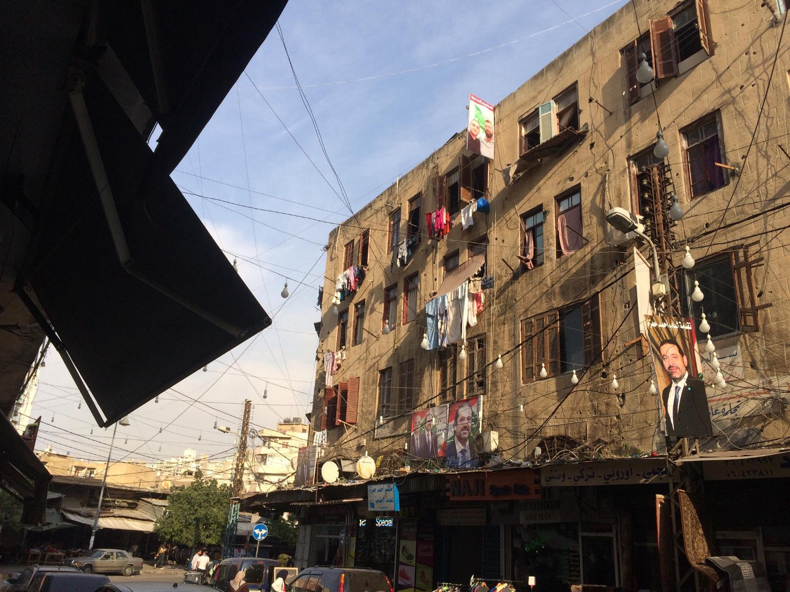
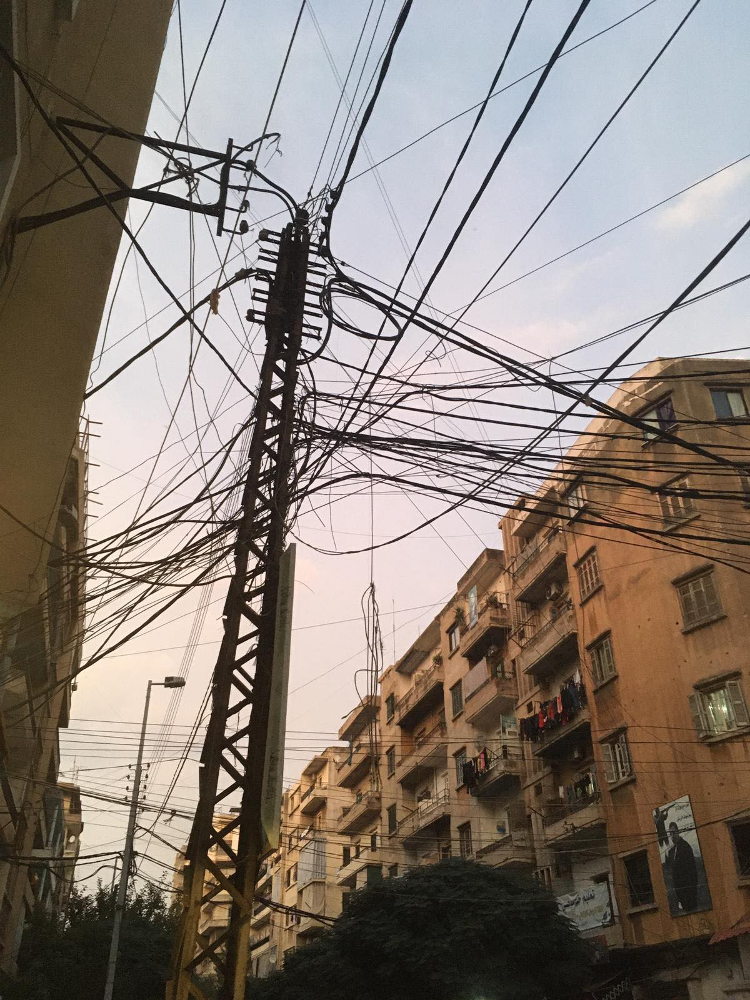
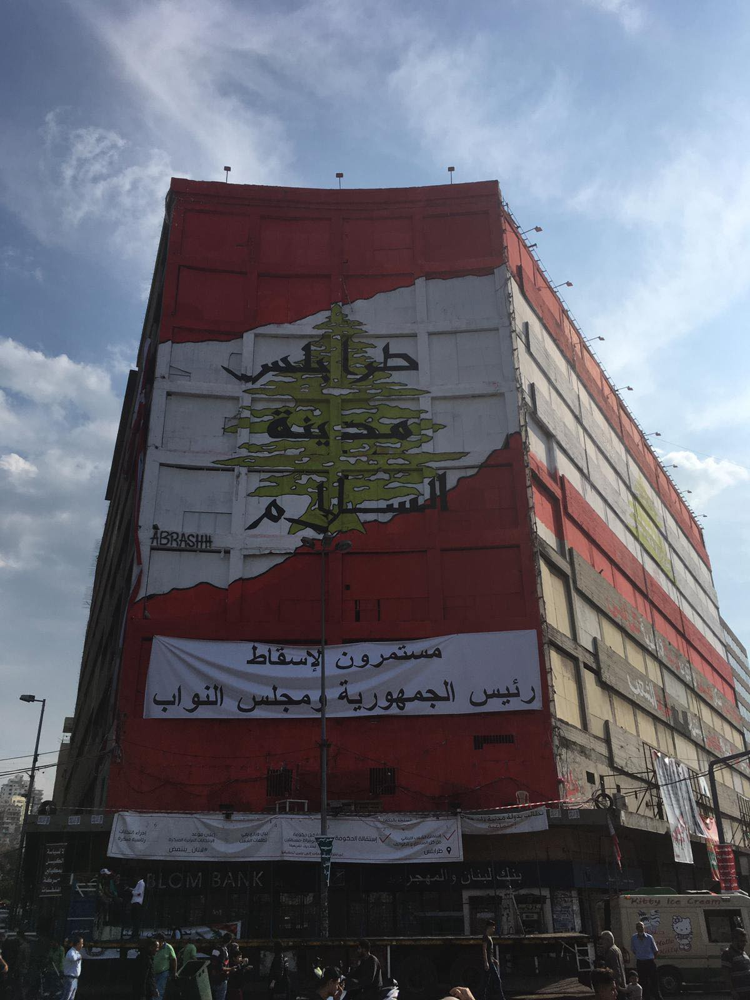
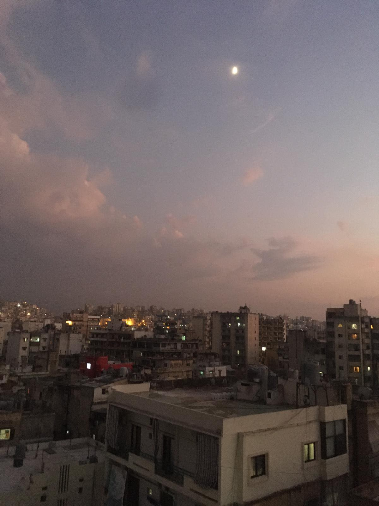

### AYS Special: **Shadows on the streets of Lebanon**
#### **_Lebanon hosts the highest number of refugees per capita in the world\. There are now approximately three million displaced people in need across the country\. With the_** _Syrian refugees across the country experiencing an increasingly hostile and xenophobic environment, two w_ omen were united in a rare moment of ‘normality’…

As I walked past the silhouetted figures crouching next to the busy road, something didn’t seem right\. The toddler in the buggy was lying in a heap, his head facing down towards the ground yet he was sleeping silently\. Something just wasn’t right\. Under the darkening sky I could just make out two women beside the buggy\. One woman was clutching an even smaller newborn in her arms, swaddled in dirty blankets\. Both women were covered head to toe in _niqabs_ but as I got closer I could see in their eyes that they were desperate\. I approached, offering to buy falafel from the street stall they were sitting by\.

_‘Milk’_ was the reply\. _‘We need milk, please help’\._ The woman thrust her newborn towards me and he let out a cat\-like cry\. He was a tiny thing, three weeks old and too delicate to be here on this polluted, noisy street in Tripoli, Lebanon\. I could smell him\. Attempting to communicate in Arabic, I discovered the women and children were, as I expected, from Syria\. Despite the language barrier I understood the words _war, bomb, hunger, refugee\. Hospital, sick, help_ \. Last week I wrote these words into my new notebook in the air\-conditioned classroom where I have committed to spending a year learning Arabic\. Now the words become reality, telling tales of a country turned to dust just 40 km from this street\.

The women told me they had fled Syria one year ago and since then had been living in a garage in one of the poorest areas of Tripoli\. They received help for one month from the UNHCR and then were left alone\. The youngest woman was, to my shock, just 19\. Now, every day they come here to beg as they don’t have enough money to buy food, diapers or drinking water for their family\. Their husbands work in a plastic factory but make no more than a few dollars a day which just isn’t enough to survive on with the high rent of the dilapidated garage\. Every member of the family is being exploited\.

The toddler lay listless in the buggy through our conversation, while the newborn squirmed and cried out\. Cautiously a little girl appeared from behind her mother’s legs, wearing filthy spotty leggings and a pink bow in her hair\. She was one and a half, and had a noticeable reddish tumour on her face\. She needed an operation to remove the lump but there was no way the women could pay for surgery when they couldn’t even buy bread\. Health care in Lebanon is extremely expensive; Lebanese and Syrian people alike die in the doorways of hospitals because they can’t pay the extortionate bills\. I asked about the birth of the newborn and discovered the mother had delivered her baby alone in the garage by candlelight\. She had not been to the hospital since, even though the baby was sick and wasn’t managing to feed\.

I went with the youngest woman to the supermarket to buy supplies\. She seemed exhausted, and vulnerable in the bright lights of the supermarket\. I saw her looking around hungrily at the shelves piled high with food and luxury items\. Feeling the weight of my purse in my pocket I was again reminded of my privilege and felt sick\. As we started down the steps she suddenly collapsed, dropping her little girl who screamed out in shock landing on her back\. Thankfully they were both were fine; in fact the small girl stopped crying within seconds, which worried me\. She must be used to discomfort and pain\.

Crossing back over the busy street the woman had no fear of the illuminated cars and taxis speeding by—she walked in front of vehicles in a daze with her little girl on her hip\. The sky now dark, she was a shadow in the night\. We all gathered again on the street corner by the buggy\. I held the newborn as he fell asleep to the sound of traffic and men shouting whilst pushing carts loaded with vegetables\. At the end of the road, past smashed up banks and the remains of burning tyres, crowds of people chanted in support of the revolution that has gripped the country since October\.

The bundle of blankets disguised how small he really was; a baby bird in my arms\. The toddler I had first noticed in the buggy suddenly woke and sat upright in shock\. He had piercing blue eyes and a huge smile\. Slowly he reached out and laughed, and we all looked at him and grinned\. Women united in a moment of normality\. All I could think was _‘what will become of him?’_ Of this whole family? We said goodbye and I watched the family walk away, the toddler with the blue eyes squashed back into the broken buggy with his sister wedged in next to him\. They faded into the distance, and into the dark streets of Lebanon\. Invisible, displaced\.

**_Lebanon [hosts the highest number of refugees](https://helprefugees.org/lebanon/) per capita in the world\. According to UNHCR estimates there are now approximately three million displaced people in need across the country\. It is currently hosting around 1\.5 million Syrians \(despite having put in place very strict restrictions on Syrians entering the country in 2015\), as well as hundreds of thousands of longer\-term Palestinian refugees and asylum\-seekers\._**

_UN reports state that 80% of the 215,000 Syrian households in Lebanon subsist below the poverty line and more than half live in sub\-standard conditions in overcrowded buildings and abandoned warehouses\. Amnesty International has reported that Syrian refugees within Lebanon are experiencing an “increasingly hostile and xenophobic environment\.”_

Written for AYS by Leyla Stephenson

**Find daily updates and special reports on our [Medium page](https://medium.com/are-you-syrious) \.**

**If you wish to contribute, either by writing a report or a story, or by joining the info gathering team, please let us know\.**

**We strive to echo correct news from the ground through collaboration and fairness\. Every effort has been made to credit organizations and individuals with regard to the supply of information, video, and photo material \(in cases where the source wanted to be accredited\) \. Please notify us regarding corrections\.**

**If there’s anything you want to share or comment, contact us through Facebook, Twitter or write to: areyousyrious@gmail\.com\.**

_Converted [Medium Post](https://medium.com/are-you-syrious/ays-special-shadows-on-the-streets-of-lebanon-3367b633a016) by [ZMediumToMarkdown](https://github.com/ZhgChgLi/ZMediumToMarkdown)._
