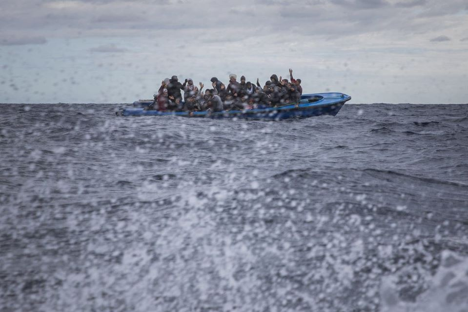
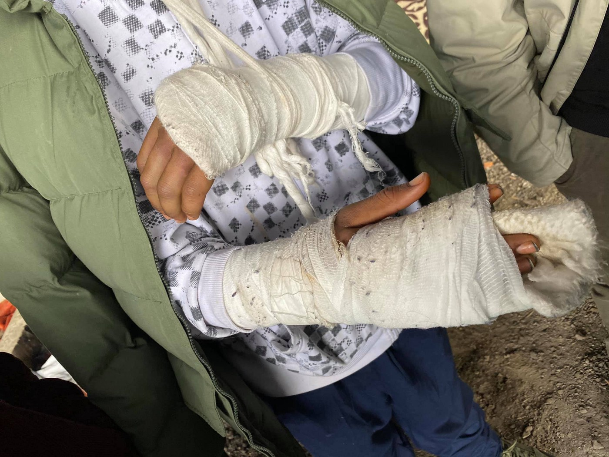

### AYS Weekend Digest 11–12/01/2020: CPR, Italian Guantanamos
#### Libyan coast guard allegedly open fire on civilians, again /// Two shipwrecks in the Aegean and Ionian sea kill 23 people and 17 missing /// Violence and resilience on the Bosnian/Croatian borders /// 29 people suspected of exploitation of migrant farm workers in the south of Italy

Mediterranean Sea, 10 January 2020\.
Refugees mainly from Morocco and Bangladesh wait on an overcrowded wooden boat, as aid workers from the Spanish Open Arms rescue ship approach them off the Libyan coast\.
Photograph by Santi Palacios
\#openEUborders — \#noborders

FEATURE — CPR, Italian Guantanamos

In the last weeks, some Italian media outlets have “discovered” the inhumane conditions of Italian CPR, administrative detention centres for rejected asylum seekers, who — it’s good to remember — have committed no crimes\.

Recent investigations have revealed abuses, violence, a systematic lack of health care and services, unhygienic conditions and overcrowding\. Truth be told, nothing new\. Prisoners of the Italian CPRs and people in solidarity have denounced the conditions they were forced to suffer since the first detention centres were opened with their different names\. Unheard from most media and politicians\.

In Turin, protests and revolts have been constant events over the last year, and have started again in 2020\. At the moment, as reported by [macerie collective](https://www.autistici.org/macerie/?p=33734) , after the revolt exploded in the first week of the year, and the brutal repression that followed, only 30 places are available within the centre\.

During the weekend, a 34\-year\-old man was [found dead](http://www.mediterraneocronaca.it/2020/01/12/morto-ragazzo-in-cpr-caltanissetta-esplode-la-protesta/?fbclid=IwAR1-BrBn4D3rRcYD709V2AxeGQg0nxq-jMxc0OTiZTSF_rgsMRAP6wLhLRA) in the CPR in Caltanisetta\. According to other detainees, he had been suffering for some time but guards and medical personnel ignored the situation\. The death caused a revolt within the centre, which was sedated by riot police\. Police headquarters released a comment describing the death as “natural”… he was 34 years old\.

The Italian government is planning to expand the number of CPR in the country\. One, in the north\-eastern territory of Gradisca d’Isonzo, was recently reopened\. One in Milan should open in the next months\. Others — like the one in Palazzo San Gervasio, in Basilicata, which was recently defined as the [Italian Guantanamo](https://www.meltingpot.org/L-Orrore-della-Guantanamo-Italiana-Il-CPR-di-Palazzo-San.html) — should be expanded and “improved” thanks to multi\-million euro projects funded with both private and public investment\.

Administrative detention is expanding throughout Europe\. With slightly different measures, each European country is finding new ways to detain and imprison the most vulnerable and those who can not defend themselves\. To imprison people who have committed no crimes other than reaching Europe in search of a better life\.

Administrative prisons, detention centres, CPRs, etc\. don’t need to be improved, they need to be closed down\.

For more information on Italian CPRs, please read our special: [An account from an Italian deportation centre — the story of Z](ays-special-an-account-from-an-italian-deportation-centre-the-story-of-z-4be560b0e61c) and [Dal rogo di Vulpitta ai nuovi CPR: 20 anni di galere](https://left.it/2019/12/28/dal-rogo-del-vulpitta-ai-nuovi-cpr-20-anni-di-galere/) \(in Italian\) \.

LIBYA
### Libyan Coast Guard \(LCG\) Allegedly Fire on Civilians Once Again

On Saturday, a boat was picked up at sea by the LCG carrying 65 people who then contacted [Alarm Phone](https://twitter.com/alarm_phone/status/1216042802699739136) to report that one man had been shot and thrown into the water\.

[IOM](https://twitter.com/IOM_Libya/status/1216057117137940481) , however, suggest that the injuries sustained by the man were inflicted before he left Libya on Thursday\. Either way, that all 65 lives were put at risk as a direct result of the EU’s deal with Libya, is undeniable\.

SEA
### 23 people die and 17 are missing in two shipwrecks trying to reach and escape Greece

From [Aegean Boat Report](https://www.facebook.com/AegeanBoatReport/) and media outlets \( [1](https://en24.news/2020/01/11-migrants-including-8-children-died-in-a.html?fbclid=IwAR2yzT-eBOgCqBzsY_SxKuWUqwXGdFH858ebRM7C6E8E3O8h53od7OOMi3M) , [2](https://www.theguardian.com/world/2020/jan/11/twelve-people-die-after-migrant-boat-sinks-off-greek-island-of-paxos) \)

Two tragedies unfolded in the Eastern and Central Mediterranean over the weekend\. On Saturday morning the Greek coast guard was alerted of a shipwreck south west of Paxos island, in the Ionian sea between Greece and Italy\. 12 people were found drowned and 21 were rescued alive\. The boat was most likely trying to reach Italy when it started to take on water and sank\. Those rescued reported that the boat was carrying at least 50 people, and 17 people are still missing, believed to have drowned\.

On the same day, at 20\.23 the Turkish coast guard was alerted of screams coming from the sea, near Sifne Bay, Cesme\. A boat, carrying 19 people heading to Chios, had capsized, killing 11 people, 8 off them children\. 4 managed to swim ashore and 4 were rescued\.

Since the beginning of the year, at least 35 people have died crossing sea borders, 80 were rescued and at least 25 are missing and are believed to have drowned\. These deaths are no accident, but precise policies of the European Union and of all European countries, for which death at sea is one of the most valuable deterrent factors in reducing migration flows\.

GREECE
### Arrivals

Over the weekend at least 318 people arrived to the Greek Aegean islands\. Find breakdowns on [Aegean Boat Report page](https://www.facebook.com/AegeanBoatReport/) \.

On January 11th seven boats were reported to have arrived on the islands, carrying 198 people\.

On January 12th 120 people arrived on Lesvos\. No information available regarding arrivals on the other Aegean islands\.

For more detailed statistics and information, click [here](https://datastudio.google.com/u/0/reporting/1CiKR1_R7-1UbMHKhzZe_Ji_cvqF7xlfH) \.

ITALY
### 29 people suspected of exploitation of migrant farm workers

[Infomigrants](https://www.infomigrants.net/en/post/22008/20-arrested-in-calabria-for-allegedly-exploiting-migrants?fbclid=IwAR0IKv_2gmVn5OxkH0CxTGKWl5l0VZsrscScySBUfxq_aWbeEAlVNoTdIU4) and [Italian news agency](http://www.ansa.it/english/) report that 20 people were arrested on suspicion of being part of a ring exploiting migrant farm workers in the area of Gioia Tauro, in Calabria \(south of Italy\) \. 9 more people were ordered to report to the police\. Among them both local land owners and entrepreneurs and “gangmasters” who were used to recruit migrant workers\.

The investigation started after a migrant worker reported his gangmaster to the police\. Workers were paid 2 to 3 euros per hour to work between 10 and 12 hours per day, 7 days a week in the citrus fruit sector of Gioa Tauro\.

At least one of the people arrested is also accused of sex trafficking\.

BOSNIA AND CROATIA
### Violence Continues at the Border, but also Cricket

\(Photo Credit: [Fabienne Dimmer](https://www.facebook.com/fabienne.dimmer?__tn__=%2Cd%2AF%2AF-R&eid=ARBtAtNmciQoNsu2CxCd68d9hLX__464HC6JFsHsUopVyEkndjkWrg6ieJSijT-P4ZoxnIjV9tf47byE&tn-str=%2AF) — “welcome to the EU…\.please
can we just beat you up and break your hands both…\.20 years old he is…\. \.I didnt know what to tell him why Croats do that…”\)

The resilience of people on the move astounds us every single day\.

DENMARK
### Victims of Ellebæk

An article has been published in [Politiken](https://l.facebook.com/l.php?u=https%3A%2F%2Fpolitiken.dk%2Fdebat%2Fdebatindlaeg%2Fart7594244%2FUdrejsecenter-Elleb%25C3%25A6k-siger-mere-om-os-end-om-dem-vi-ydmyger%3Ffbclid%3DIwAR10jGNxwmNR-kfv62lKz-agLWelmFZPOwsp6pw0cMqMcNXln7etR2-yGnQ&h=AT0zYoBmlNTFye8FjsUA2_YWNlCKEB4vDvYkSGoRIHpzy9SO1ZymLPG_BYhBhI2jQQ6chHKhi5eM7FfejokK01KikGWLWpNssmMqsApvzLtyROQKGl5_8U4GKIrqIi_iLecntJEvcIGhErykPK8) by local activist Anne Lise Marstrand\-Jørgensen, further detailing the situation in Ellebæk\.

> _The brutality of the system is cynical, but the suffering has names\. Here are a few: Nebuy Tesfaye, the Ethiopian who killed himself in the cell\._ 

> _Navid, the chronic pain patient, newly operated and unable to take a bath himself, refused help, visit by a doctor and pain relief\._ 

> _Ali Ghazi, who with his broken foot kept everyone awake for a week and only was transferred to the hospital when the foot had turned black\._ 

> _Amir, who has a son with a Danish woman\. The only thing he has in his possession in Ellebæk is the toys he had bought for his son, just before he was arrested without papers in front of toy shop\._ 

> _Omar that freezes when the heater breaks down, and who is tormented by pain and has not been helped\._ 

> _Rohullah, the young Uzbek who was forcibly deported to Afghanistan, a country where he never has lived\._ 

> _The silent, the invisible, who like most residents never get any visits\. Gone in a moment\. \[…\]_ 

> _Human rights is not a like buffet with a number of small warm dishes\. It’s a full menu, all or nothing regardless of fluctuating feelings and opinions\. Most people don’t care or turn their faces away\. More telling of us than of those humiliated by us\._ 

**Find daily updates and special reports on our [Medium page](https://medium.com/are-you-syrious) \.**

**If you wish to contribute, either by writing a report or a story, or by joining the info gathering team, please let us know\.**

**We strive to echo correct news from the ground through collaboration and fairness\. Every effort has been made to credit organisations and individuals with regard to the supply of information, video, and photo material \(in cases where the source wanted to be accredited\) \. Please notify us regarding corrections\.**

**If there’s anything you want to share or comment, contact us through Facebook, Twitter or write to: areyousyrious@gmail\.com**

Following
- [Refugees](/tag/refugees)
- [Digest](/tag/digest)
- [Cpr](/tag/cpr)
- [Administrative Detention](/tag/administrative-detention)
- [Death At Sea](/tag/death-at-sea)

_Converted [Medium Post](https://medium.com/are-you-syrious/ays-weekend-digest-11-12-01-2020-cpr-italian-guantanamos-d0b005a3c8da) by [ZMediumToMarkdown](https://github.com/ZhgChgLi/ZMediumToMarkdown)._
