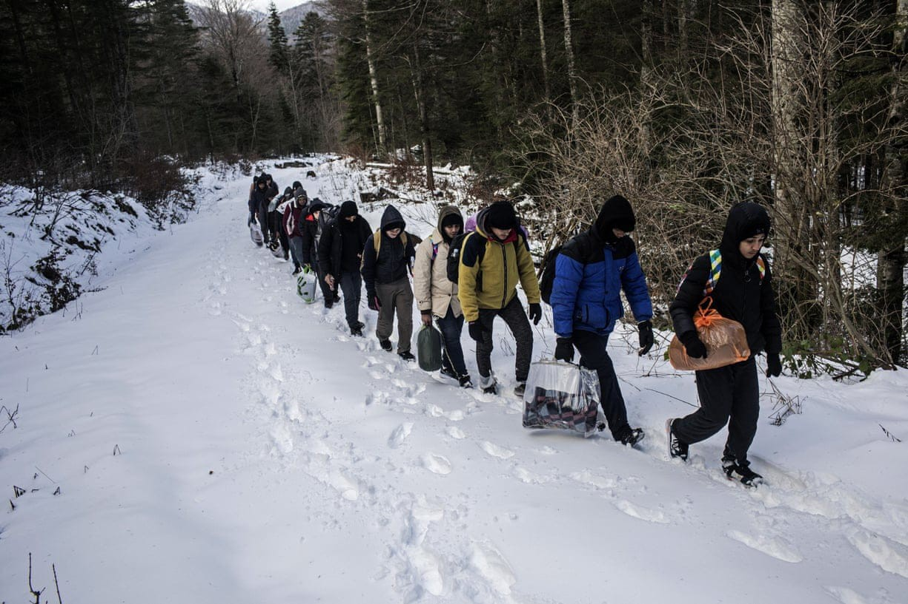
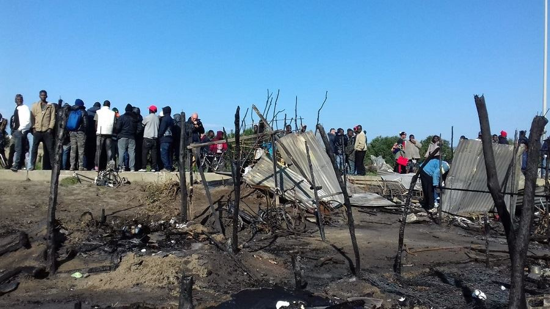
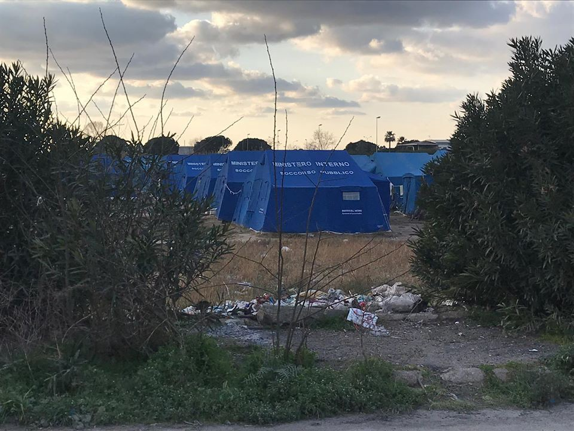

### AYS Special 2019/2020: Activists’ voices from across Europe
#### At the start of 2020, some reminders, thoughts, and recapitulation of last year’s experiences by individuals, groups and organisations that have decided to share their perspective to, hopefully, pave a better way for the future ahead\.

 \.](assets/a642e29c45/1*zRVFbcfzXNzO3K6p6PQskA.jpeg)

Repost from [Caritas Ambrosiana](https://twitter.com/caritas_milano/status/1217514374904066049?s=20) \.
### United system of making the people passive bystanders in their own lives

The fact that “we are now witnessing the highest level of displaced persons on record”, as the UNHCR keeps repeating, is a reality that affects all aspects of modern society and social progress, but still it seems that the main political ‘players’ in the field choose to bypass all humane and solidarity solutions that would benefit those fleeing whatever threatens their wellbeing, but also the societies in need of people and in a position to welcome them\.

Too often, refugees and people on the move are treated as passive bystanders in their own lives, and people coming with the intention to help, organizations founded to support them, and politicians working to bring about a solution to their displacement, all of them a lot of the time engage without challenging this assumption\.

In that way, they do a disservice to the communities they intend to represent\. This has unfortunately been a constant throughout 2019 and continues into 2020\.

**Small volunteer initiatives, individuals, NGOs, and other activists have been carrying a great deal of the issues that stemmed from the fact the borders, politics, and minds of the people were closed for the most of 2019 and in most of the places across the continent\.**
### Changing the history of a sea — the deadly 2019 and efforts to change it

> In 2019, we have assisted about 426 groups in distress in the Mediterranean Sea, 222 in the Aegean Sea, 104 in the Western Mediterranean Sea, and 100 in the Central Mediterranean Sea\. Since we started our project in October 2014, we have assisted in over 3,000 distress cases\. 

> We know these figures do not reflect the thousands of individual struggles & stories that are behind them\. We dedicate our work to those who lost their lives while trying to reach a place of freedom\. With each shift, we remove a brick from a wall and add it to a bridge\. — Alarm Phone 

](assets/a642e29c45/1*IfcQ-1k_pb633IKY756azw.jpeg)

[Watch The Med — Alarmphone](https://www.facebook.com/watchthemed.alarmphone/?__xts__%5B0%5D=68.ARC1p9Qcoqz00_72A5fSsxLxAx9NkBCDEtI2rbYjWpw4rpWHmyh6jt4jPuxpG59QPNJU9iAmSRhAN6Rj4NA2Hyu1eBBQzXkL1K9N3DKoPOBPxtHPQmS-1J2AOaTh7p28mvZn4hrkhzpydDngI_QEMfWVMmkPi-E7VSyKapttI3aFr2mDxX5_SinXldvSX03zx6DDWqmIUh1LcudTFsaI11ekJwNttQRS4ZtSoA8plXvrYSNv17CnAiHvxzu4Zhbq7jOUs_R7yKl78Pmeg7eJuO6ggG_wtvlgwySA2bmdU_XK1p5ow3WRNhCD8l3Cw2JidWN_1ZSCnibqqNGnXORXYB1H21L8&__tn__=k%2AF&tn-str=k%2AF)

> Año 2020\.
 

> 8 de enero\.
 

> 16 personas ahogadas en el Mediterráneo\.
 

> 2 personas han muerto al día\.
 

> Y mañana el contador sumará 1 bebé que nació a bordo y ha muerto hoy en una patera a la deriva desde la noche de Reyes\.
 

> Tan salvaje y despiadado como real\.
 

> Año 2020\.
 

> Ayúdanos a seguir\.
 

>  [Proactiva Open Arms](https://www.facebook.com/proactivaservice/?__xts__%5B0%5D=68.ARBZYWa8YHT5Vi4dxYIb0UKLfzbv8qggP-NqyfwU6WSIr8JL5smdCU4JYzXYU8JBqYVRGLNxQwgS2MdDionKRH_8wNql3mEOyAUJxbmGO4lkCvoxkl9ftLw8vOd6LkTTA_sslw4waP2qKTGjx1UDHPitgGApzhIpJofX_9UPyQE7NFEySvAGGwDsZe5MtkpAjreogHw65snXyFV0WZsyKXGtdpsi2AFX8UQ4l1WwZ5MlYu0JiYOn5YKVbNAEj7NdatOULoSl4rb6Og4NsZVP4UoyBfmx5-GhNsWILoUa_Br5m3z5PXAhK_9ebDxc1DQeiDwGwMv2ymdraD41dxyR_zl8ig&__tn__=k%2AF&tn-str=k%2AF) 

](assets/a642e29c45/1*00Ed_piAFBLFkArBffGYJw.jpeg)

[Proactiva Open Arms](https://www.facebook.com/proactivaservice/?__xts__%5B0%5D=68.ARBZYWa8YHT5Vi4dxYIb0UKLfzbv8qggP-NqyfwU6WSIr8JL5smdCU4JYzXYU8JBqYVRGLNxQwgS2MdDionKRH_8wNql3mEOyAUJxbmGO4lkCvoxkl9ftLw8vOd6LkTTA_sslw4waP2qKTGjx1UDHPitgGApzhIpJofX_9UPyQE7NFEySvAGGwDsZe5MtkpAjreogHw65snXyFV0WZsyKXGtdpsi2AFX8UQ4l1WwZ5MlYu0JiYOn5YKVbNAEj7NdatOULoSl4rb6Og4NsZVP4UoyBfmx5-GhNsWILoUa_Br5m3z5PXAhK_9ebDxc1DQeiDwGwMv2ymdraD41dxyR_zl8ig&__tn__=k%2AF&tn-str=k%2AF)
### The Aegean islands — very cold ‘spots’ of European policies

In Greece, during the 2019 situation on the Aegean islands has not changed and another winter has arrived, temperatures have dropped drastically and it has been raining for days on end\.

To illustrate, there are currently more than 7,500 people living in the hotspot on Samos, a camp that is build to only host 648 people\. This means the numbers of people had DOUBLED within10 months and the camp is more than 11 times overcapacity\. Most of these 7,500 people are sleeping in tents and makeshift shelters that provide no protection against the cold or wet\.

With the increased number of people and the terrible living conditions, the needs are getting bigger and bigger while the resources are scarce\. [Samos Volunteers](https://www.facebook.com/samosvolunteers/?__tn__=kC-R&eid=ARC3bK6eeaXDXYdLfcVSmYyff_qVh87Qr0LX41eGB7hyv040YHakwq-KPJJUiRpEsQCmjFgi7rttsmAr&hc_ref=ARR89nDhZSlcgZ_dP3QnIq-2BPvm21Io1ClkEo9z0dKYzo4vZNk23i-KStafoRP2wVs&fref=nf&__xts__%5B0%5D=68.ARBcBAuwUN56qKgSKqB6nzujlJWuSU-lmlVZcyp9Tj23k7Mc9AVDJUoblUk_ZFibT3BiqWosci4fMqmpNpoW-f0X_wGVeXCZKRGgZX1cy6kVDa78jZKSE1vGUmdqCSd3ml4ne3LQSfgjnzqCaQIW3QrRPAYxY7S7WLX2l0xaED6W49IUjhiot3Gi3SI-cUNYu3lJrO4j67Ud_KFWPi3dI0EtrR0tp7QLwU-Av8kKDUzd4BknvYqpj_gBen-gWF5ssJY2CtPvXInsBh_ecm5MCg7dtptY_G6eeA3zVWgaoNUYGg0dN4RUe0oKHYn81MYdeSKl9drpyF0aMDESGZyCyvpw_i6TJGfjVN96V4Y2S5W82Qvp_cPZrUzgfD4) are one of the teams in need of support in order to be able to maintain their activities on the island\. **2020 will need everyone’s solidarity\!**

In 2019, our friends from STEPS in Greece have dedicated their time to studying what has been happening with the **unaccompanied minors** throughout the country\. Regretfully, what is discernible is that the way that the policies are implemented practically leads to the social exclusion of the children, and their subsequent exploitation, leading to their inability to exercise their rights\. The research _Children Cast Adrift_ relies on interviews with professionals working directly with UAM, as well as policy papers, regulations and legislation, and records testimonies on the effects of social exclusion and the partial and ineffective child protection systems on the life of minors\. That is they key work they wish to share at the start of 2020 which brings more challenges to face\.

### Away from the eyes, away from the European mind

From **Bosnia and Herzegovina** , No Name Kitchen volunteers in Velika Kladuša reported:

“The year 2019, packed with vulnerability and difficulties for those in transit, closes with the critical episode of a 15 years old kid with a medication overdose\. After being moved to the hospital, the medical team wouldn’t take care of his condition and sent him out with the recommendation of not taking more pills or any other medicine for that night\. The paramedic team handled the situation themselves and saved the life of the kid\. The year starts with a similar incident when, on the 2nd of January, a call was received informing about another kid with medication overdose that couldn’t be awakened\. When the paramedics arrived, they could only certify his dead and contact the authorities\.”

> What I wish for this year for \(and I was thinking for a long time\) is one boring day\.
 

> Just one boring day this year\.
 

> \(Open borders are still my dream and will remain\. \)
 

> \. \.so I can just lay and watch stupid content on Netflix…
 

> Please pray, send your wishes or whatever you believe in…
 

> Have a peaceful night,
 

> One love from Velika Kladuša — _Pixi, long\-term Bosnian volunteer in Kladuša_ 

Photo by: Manu Brabo

Two Italian activists who were present in Bosnia and Herzegovina and in Italy shared their view of the situation in 2019 and hopes for 2020\.

> In this 2019, the second year of our intervention in Bosnia, which began on January 1, 2018, we have seen the condition of refugees in BiH constantly worsening, in regards to several issues: 

- the condition of the camps — Bira, Borići, Miral, Sedra, to which must be added the improvised municipal camp of Vučjak that was one of the main topics in 2019, and an illustration of consequences to the current policies\.
People in the camps lead a purely vegetative life, that nullifies people’s dignity\. The only hope is the ‘game’, the escape to Europe\. Even from the healthcare point of view, the situation has been at a breaking point\.
- the relationship with the local population, that has worsened compared to the quiet initial relationship\. Today, these people are prohibited from entering many commercial premises and circulating in town centers, with some partial exceptions\.
- the crossings at the Bosnian\-Croatian border, that is, the behavior of the Croatian police, who have always acted not only in an illegal way, because Croatia does not accept asylum requests, but are also violent towards people who either try to cross the border or have been encountered within the country\.
- the very harsh attitude of the Bosnian police, which at the beginning was quite different\. The Bosnian police are now giving very high fines to the Bosnians who accommodate migrants, even for free\.

Among the particularly serious facts that we want to point out: the frequent use of real torture by the Croatian police, that we have personally observed on tortured bodies; the establishment of the Vucjak camp by the municipality of Bihac, in degrading conditions, on a landfill, camp that eventually, as winter progressed, had to close, resulting in the move of the migrants to the Sarajevo area, unprotected and many sleeping rough — except for the hundreds who threw themselves into the Game, or who entered the IOM run camps in a ‘semi\-underground’ way\.

> For the future, what we can foresee is a further worsening of the situation\. The European Union is moving, without a real plan, to delegate the containment of migrants to the countries on its border, or however marginal, such as Greece, by paying them\. This containment is taking the form of the lager\. 

Moreover, the matrixes of these migrations from countries devastated by military and environmental wars are getting worse: the Middle East, Western Asia, the Maghreb, to limit the discourse to the Balkan route where volunteer activists operate\. The only horizon may be the formation of vast solidarity networks that unify the volunteers who are already working, to increase the number of people helping and also to take the form of a real political protest against this obtuse violence, while acting in solidarity, that is, in a constructive way\.

Many people have lost their lives along the so\-called Balkan Route, leaving still dozens of unidentified bodies in morgues across the countries of the Route\. Those who were identified, many times thanks to the efforts of their friends, and friends of their friends from the Balkans, don’t have families who can afford to organize for them to be buried at home\. Many remain missing\. Some, however, in spite of the official stance and lack of respect for their human dignity, don’t get a chance to be buried properly\. 
We met a man from a small border town in Slovenia who made possible for two young boys who had drowned in a river to be properly buried in the local cemetery, with all the trouble and difficulties that came with that decision, silently fighting for their last right to dignity\.

Thanks to efforts and people like that, the links of solidarity and signs of hope remain present in the Balkans, despite what’s written in the papers or who is installed on the borders\. — _AYS volunteer_
### **2019 — thoughts and practices for a daily, common civil resistance**

For the network **Mai Più Lager — NO AI CPR** , 2019 has started with a great energy, following the wave created after the demo on December 1st 2018\. During that event a consistent group of citizens took the streets of Milan, moving toward via Corelli, the place where a CPR \(Centro di Permanenza per i Rimpatri\) was and is still supposed to open\. CPRs are basically prisons for foreigners who have not committed any crime\. People gathered to protest the newly announced opening of the centre as well as to raise their voices against the Salvini Decree, the last drop representing twenty years of criminal migration policies\.

“Our network, which is formed by parties, movements, associations, local and non local realities, was created with the idea of being an organized platform to contrast the opening of CPRs as well as other demands addressed to institutions, which were presented in January to the public\.

Our goal to mobilize and gather groups of citizens continued with the demos in February and October, adding more and more individuals and realities that shared our values and goals in regards to social justice\.

In June, we established a NO CPR LAB with the intent of drafting common strategies and praxis and share them with all those who want to join the fight against this growing securitarian atmosphere, that has its final representation in the creation of CPRs\.

We faced difficulties, of course\. Namely the hostility of the public image, supported by a toxic vision of the media and the political parties that picture people on the move as perfect scapegoat to pour their intolerance and hate\.

Secondly, we had to face the uncertainty and the very vague response of institutions in regards to the exact date for the opening of the CPR of via Corelli\.

The fall of the government represented by Salvini was thought by the majority of the country to be a point of change in respect to migration policies, but the reality of facts was different: the new government is, in fact, following the blueprint of the previous one\.

Our resistance is made of constant weekly meetings and public interventions aimed at creating a counter\-information hub, in direct opposition against the censorship and the distorted image publicized by institutions and media\. We organized follow\-up meetings related to the Salvini Decrees, to the right to public gathering and housing and the right to freedom of movement\.

In early December, we took the streets to again raise awareness in regards to the opening of CPRs on the national territory, the abrogation of both Salvini Decrees and the fact that the Italian government is still responsible for the maintenance of the Libyan lagers and the MoU\.

Mid December, out of the blue, comes the news that the CPR of via Corelli will eventually open soon, even though it is very unclear when exactly, following the new openings of the CPR of Gradisca \(Friuli Venezia Giulia\) and Macomer \(Sardegna\) \.

We responded with a flash mob to remind the public about this issue and about the deprivation of rights and freedoms happening next to their houses\.

A new meeting will take place in January to create and share strategies to react and mobilize the public\.” — _Mai Più Lager — NO AI CPR, Milano_

> The air will clear out, Resistance is strong\. 

**At this [link](ays-special-an-account-from-an-italian-deportation-centre-the-story-of-z-4be560b0e61c) , you can find a Special containing an account from a CPR, translated from an original interview made by Mai Più Lager — NO AI CPR\.**
#### MEDU, Piana di Gioia Tauro, Calabria
### **Terragiusta — An account from Piana di Gioia Tauro**

For the sixth consecutive year, MEDU has been operating in the area of the Piana di Gioia Tauro, Calabria, and for the sixth consecutive year the team describes the situation as a proper humanitarian crisis: field workers forced to sleep and live in precarious tents funded by the government, abandoned, ruined farmhouses or old containers, totally deprived of basic services such as running water, electricity and heating systems\. [The precarious living conditions could be signal of an emergency situation](https://www.facebook.com/MEDUonlus/photos/a.10151424368349817/10157811580779817/?type=3&theater) , but the over 1000 workers present in the area have been there for long time; each year, in fact, around 2000 young people move to the area to seek employment in the fruit picking business, always forced to accept exploitation in order to earn few euros\. This year, though, the conditions are even worse due to the effects of the Salvini decrees that create additional bureaucratic obstacles to access services and renew permits\.

Medu and A Buon Diritto are present around the makeshift camps to offer medical and socio\-legal assistance, support access to health rights and monitor the violations that every year are occurring in this territory\.

> In a little over a year, 4 people burnt to death in these makeshift camps, symbolizing the total absence of any institutional plan to allow these workers to live in dignified conditions\. 

Credit: MEDU — Piana di Gioia Tauro, February/March 2019\.

Of the 438 people MEDU offered assistance to in the past year \(until May 2019\), 93% had a regular permit, but only half of them have had a regular employment in the past three months and, of these people, only 60% had a regular working contract, which anyway presented irregularities in the hour\-counting and in the final wages collected\. Less than half of those who had regular permits was registered to access the National Health System\.

In addition, regular evacuations are happening without a proper plan and without alternative housing solutions for the workers involved\.

MEDU demands these workers receive assistance in finding proper employment possibilities, taking hands away from the mafia system that thrives in these areas, more controls to contrast irregularities in the working conditions, empowerment of workers and support to those realities that employ workers with regular contracts\. Moreover, the team highlights the necessity to create proper infrastructures to support workers and the local population, as well as housing solutions by using the various abandoned buildings present on the territory\.

MEDU also insists on the necessity to create health care interventions in the area and to promote an education on health rights and an easier access to the national system for those in need\. This, together with a more structured union and legal assistance that would allow workers to register in the local townhall with the standard address used also for homeless people, could represent important steps forward to close the inhuman ghettos workers reside in and guarantee them more dignified living and working conditions\.

You can find their full report \(in Italian\) at this [link](https://mediciperidirittiumani.org/terraingiusta-presentato-il-v-rapporto-dalla-piana-di-gioia-tauro/) \.

Credit: MEDU — Piana di Gioia Tauro, February/March 2019\.

> ‘Those who love peace must learn to organize as effectively as those who love war\.’ — Martin Luther King Jr\. 

**Find daily updates and special reports on our [Medium page](https://medium.com/are-you-syrious) \.**

**If you wish to contribute, either by writing a report or a story, or by joining the info gathering team, please let us know\.**

**We strive to echo correct news from the ground through collaboration and fairness\. Every effort has been made to credit organizations and individuals with regard to the supply of information, video, and photo material \(in cases where the source wanted to be accredited\) \. Please notify us regarding corrections\.**

**If there’s anything you want to share or comment, contact us through Facebook, Twitter or write to: areyousyrious@gmail\.com\.**

_Converted [Medium Post](https://medium.com/are-you-syrious/ays-special-2019-2020-activists-voices-from-across-a642e29c45) by [ZMediumToMarkdown](https://github.com/ZhgChgLi/ZMediumToMarkdown)._
