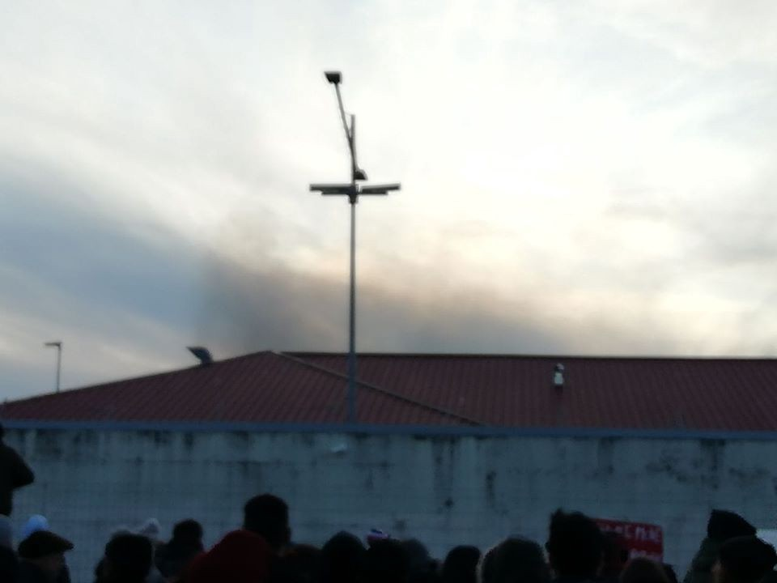

### AYS Weekend Digest 18–19/01/20: Italian police responsible for the death of a man imprisoned in the CPR of Gradisca
#### Statement of Afghanistan Migrants Advice and Support Organisation on their support for people deported to Kabul // Video showing Turkish Coastguards ramming refugee boat // Urgent petition to keep the transit camp on Lesvos running // Journalist beaten by fascists // Opening hours of Khora asylum support team // Czech Republic discussion about the fate of 40 unaccompanied minors // Numbers of latest deportations from Germany to Kabul // Upcoming deportation of a single 19 year old woman from France to Kabul

Demonstration in front of the CPR\. Copyrights: No Cpr no Frontiere — FVG
#### FEATURE

On Friday 17th January, riot police entered the deportation centre \(CPR\) of Gradisca d’Isonzo \(Gorizia\), beating up residents who, apparently, were protesting against the inhumane living conditions inside the prison and resisting the presence of the authorities\. One of them, V\.E\., a young man from Georgia, who a few days before had committed an act of self\-harm, received the most severe treatment and was so badly beaten that he had to be taken to the local hospital, where he died on Saturday\.

**His cell mates stated that 8 policemen in riot gears entered V\.E\.’s room and, after surrounding him, started to beat him up\. He then fell on the floor, beating his head to the ground\. At that point, police officers put their feet on his neck and back and handcuffed him, taking him away\. Then, he died\.**

Following [this link](https://www.facebook.com/nocprfvg/videos/vb.510064162801251/487359618643404/?type=2&theater) , you can find a detailed account of the events \(in Italian\), made by the other prisoners in detention with the victim\.

Residents filmed the presence and the actions of the police, you can find the video at [this link](https://nofrontierefvg.noblogs.org/post/2020/01/18/a-gradisca-si-muore-sappiamo-chi-e-stato/?fbclid=IwAR3_3lVBe9GHCV4ZnDQfN1zqN9hEyYvg-9BjMuiJkHrvsnmUUXXtRIcfFXY) \.

The centre re\-opened recently, a month ago, amidst protests and critiques concerning the clear violations of rights and human standards, so this death, occurring after such a short time can only represent a clear and sad proof of the necessity to abolish immigration detention\. Note that one of the reasons why the centre closed in 2013 is connected to [another death](https://www.meltingpot.org/Ogni-anima-muore-La-storia-di-Majid-morto-di-CIE.html#.XiTBtBNKg0o) , the one of Majid, that also happened inside those walls\.

The centre is managed by EDECO, a cooperative based in Padova, 2 hours from Gradisca, is sadly known to the public for being responsible for another centre, [Cona — a reception centre this time](https://www.meltingpot.org/Morte-di-Sandrine-occupata-la-prefettura-di-Venezia.html#.XiTE8RNKg0o) , where a young woman, Sandrine, died in 2017 and for being [investigated for criminal association for fraud in supplying public services](http://www.padovaoggi.it/cronaca/indagine-cooperativa-edeco-conetta-profughi-padova-26-gennaio-2018.html) \.

Other CPRs have their own records of recent deaths: In Caltanissetta a thirty year old man named Aymed from Tunis died due to unknown causes on the 12th of January 2020\. In Turin, thirty\-two year old Sahid Mnazi from Bengal died in July 2019\.

Immediately after the death of V\.E\., staff members of the cooperative discovered and denounced an [attempt to escape](https://messaggeroveneto.gelocal.it/udine/cronaca/2020/01/19/news/immigrati-scavano-un-tunnel-in-un-stanza-per-fuggire-dal-cpr-1.38351764?fbclid=IwAR2Tga703Sl1aGMoeW0UJfsKaMf4aaBQ1eZh-Vh6veXuwSxBApEM-L17gIM&refresh_ce) by some of the residents of the structure, who, allegedly out of desperation, were digging a tunnel under the floor of one of the cells\.

On Sunday, activists and people in solidarity gathered outside the centre to state the need to close the structure as soon as possible in order to avoid additional deaths\. They reported having to shout in order to communicate with the residents inside, separated by two lines of concrete walls and fences\. **Some other activists were in touch via phone with the residents and stated that those who were talking with them, were also beaten by the police in riot gears\. Heavy smoke and fire could also be seen by the people in solidarity outside the centre\.**

**Apparently, immediate procedures of forced repatriation are scheduled for those who witnessed and reported on the beating of V\.E\. The Magistrature opened a file on the death and took all the phones away from the residents\.**

Amidst all these tragic events and unnecessary deaths, [another CPR is about to be opened](https://www.facebook.com/NoaiCPR/posts/628762791028564?hc_location=ufi) on Monday in Sardinia, where around 50 people will be the first to be detained\. Again, this CPR is a former maximum\-security prison\.

How long will it take for a tragic death to occur in this newly opened structure? When will authorities understand that detention is far from being the right answer?
### GENERAL

The Afghanistan Migrants Advice and Support Organisation **AMASO** issued a statement clarifying the support it provides to people who have been deported to Afghanistan\. Apparently the migration authorities of some European Countries used the support AMASO provides to prove that those deported will not be without any support in Kabul\.

> “The latest example brought to our attention is from Austria, where the court has misused the nature of the support we provide to those deported, including an emergency shelter to justify deporting Afghans without networks in Kabul\.” 

AMASO clarified that it is not a state agency\. To use the support it provides for those that have been deported although they have no support network in Kabul in order to justify their deportation is “unjustified, inhumane and utterly cynical”\.

Find the full statement here:

### TURKEY

A video appeared on social media showing a boat of the Turkish coastguard ramming a dinghy with Syrian refugees\. Date and location of the incident are not clear, but it is most likely that it happened in the Aegean Sea\. The Turkish coastguard has often been criticized by humanitarian activists for their brutal actions against refugees trying to cross the sea\.

■■■■■■■■■■■■■■ 
> **[Conflict News](https://twitter.com/Conflicts) @ Twitter Says:** 

> > VIDEO: Footage circulating on social media appears to show the moment a Turkish coast guard ship deliberately rams a boat full of refugees. https://t.co/4kNNix0AAe 

> **Tweeted at [2020-01-19 13:00:49](https://twitter.com/conflicts/status/1218880996453552128).** 

■■■■■■■■■■■■■■ 

### GREECE
#### Urgent call to keep the transit camp on Lesvos running

The **Stage 2 Transit Camp in North Lesvos** will be closed by the end of the month as decided by the West Lesvos Municipal Council, unless the Hellenic Ministry of Public Order and Citizen Protection, or the Ministry of Migration Policy reverse this decision by January 22nd\. A petition has been designed by local NGOs in order to demand for the camp to stay operating\. From the petition:

> “Stage 2 Transit Camp, the UNHCR transit facility located on the north shore of Lesvos, temporarily hosts asylum seekers as they arrive, ensuring that they can access safety, vital medical aid, shelter and rest after the dangerous crossing from Turkey\. The north shore receives over half of the total arrivals to Lesvos\. This past year alone, 15,000 people were hosted at the camp, half of whom were children\. In December, Stage 2 welcomed people every night for two weeks straight — housing up to 286 people in one night\. With the closure of Stage 2, people arriving will be left waiting for hours on beaches, by the side of the road, or in remote rocky areas, sometimes in sub\-zero temperatures, with no access to immediate shelter, protection or medical aid\. They may even attempt to walk for hours to the south, in scenes reminiscent of 2015\.” 

Please sign the petition and spread the word\!

#### Support centers opening hours and schedules

**Khora asylum support team** in Athens will be closed from January 20th — 22nd\. On 23th and 24th it will be open between 1–3 pm\. The reason for this is plans to restructure how the team works\.

Find **Zaatar’s new schedule** for classes in Greek and English \(in Athens\) on [their Facebook](https://www.facebook.com/zaatarngo/posts/2803530653000593?hc_location=ufi) page\.
#### Journalist beaten up by fascists

A journalist of the Deutsche Welle, Thomas Jacobi, has been violently beaten by far\-rights while covering a rally against migrants\. Jacobi was involved in the production of a documentary on the Golden Dawn, the neo fascist Greek party\. Pictures show him with blood all over his face\.

For more information see:

### CZECH REPUBLIC

In the Czech Republic a discussion broke out about whether or not the country should accept 40 unaccompanied minors from Greece\. Greece has repeatedly called for other European countries to take in unaccompanied minors that are currently stuck in the horrendous conditions on the islands without any support\. The Czech prime minister and the minister for interior both reject the idea\. They argue that Czech should care for its own children, that almost adult minors are a security issue and that Greece is receiving subsidies from the EU in order to deal with the situation on the islands\.

For more information see:

### GERMANY

**Numbers of latest deportations to Afghanistan on January 14th**

37 male Afghan nationals have been deported from Germany to Afghanistan on January 14th\. This has been the 31st collective deportation carried out since the start of the deportations in late 2016\. About 800 people have been deported since then\.

Helpful information in German for people who fear they will be deported and their supporters can be found here:

**Arrivals thorugh relocations scheme** 
In the northern German city Hannover, around 250 Syrian nationals arrived by plane directly from Turkey\. The people were chosen through a humanitarian reception scheme for relocation in Germany\. The selection process apparently takes into regard family ties, vulnerability, integration capacity and the criminal record\. The agreement is part of the EU\-Turkey deal\.
### FRANCE

A **19 year old single woman is supposed to be deported to Afghanistan** on Monday 20th January\. The case is shocking in different aspects\. First of all, for the last years, France deported only a very small number of people to Afghanistan\. The chances of a positive asylum procedure for Afghans are higher in France than for example in Germany\. For this reason, many Afghans that fear deportation flee from another European country to France\. As a single woman, the 19 year old is regarded as a vulnerable person\. Other countries like Germany — that has been deporting to Afghanistan for three years now — is not deporting minors or single women\. It is also the first time that France is deporting a single woman\. The husband of the young woman is currently living in Germany where he is recognized as a refugee\. The woman entered France with a false ID in order to join her husband in Germany and has therefore not applied for asylum in France\. Her right to family unity is violated by her deportation\. She took steps on Friday to fill in an emergency asylum request in France, but this will not necessarily stop her deportation\. In September 2019 France has started to take measurements that would allow for more deportations from France to Afghanistan\.

For more information in French on this case see here:

and information on the change of legislation here:

**Find daily updates and special reports on our [Medium page](https://medium.com/are-you-syrious) \.**

**If you wish to contribute, either by writing a report or a story, or by joining the info gathering team, please let us know\.**

**We strive to echo correct news from the ground through collaboration and fairness\. Every effort has been made to credit organisations and individuals with regard to the supply of information, video, and photo material \(in cases where the source wanted to be accredited\) \. Please notify us regarding corrections\.**

**If there’s anything you want to share or comment, contact us through Facebook, Twitter or write to: areyousyrious@gmail\.com**

_Converted [Medium Post](https://medium.com/are-you-syrious/ays-weekend-digest-18-19-01-20-italian-police-responsible-for-the-death-of-a-man-imprisoned-in-e8a271522f57) by [ZMediumToMarkdown](https://github.com/ZhgChgLi/ZMediumToMarkdown)._
