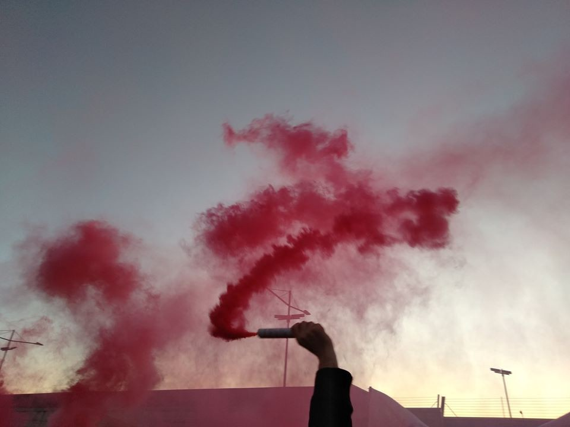

### AYS Daily Digest 20/01/20: Giving names to victims — deaths in Italian deportation centres
#### Updates from Gradisca//Ocean Viking will disembark the 39 people rescued in Pozzallo//18 year old woman stabbed in Moria//Video testimony of police brutality at the Spanish\-Moroccan border//Deportation from Finland to Afghanistan//Right\-wing Progress Party leaving as part of the Norwegian Parliament…

Demo in solidarity with the people detained in Gradisca\. January 2020\. Credit: No Cpr e no frontiere — FVG\.
#### **Twentynine people died in Italian deportation centres from 1998 until 2020\.**

The last death occurred on Saturday 18th January 2020 in the CPR of Gradisca d’Isonzo, when Vakhtang Enukidze lost his life, as he was surrounded by 8 policemen in riot gears and beaten heavily, causing him fatal injuries\.

Therefore, today’s digest will, in a way, try to pay respect to those “invisible” deaths occurred by the hand of the Italian state, those deaths that are not investigated properly because the victims are “unwanted” in the country, guilty of being alone in a hostile land\.

Data from 1998 until 2016 was collected by **Morti di CIE** , a collective of researchers and activists, which published a very comprehensive report in 2017\.

The common element and the most recurrent one in all these 29 cases is the lack or the delay in medical treatment and assistance, even when clearly demanded by the victim’s fellow detainees\. Another common detail is, needless to say, the brutality and excessive use of violence by the hand of police deployed in the centres\.

_Bari_

2015, **Reda Mohamed** : cardiorespiratory arrest\.

_Bologna_

2006, **Mohamed Aloui** : undefined and unclear causes of death, allegedly overdose of heroin and medications against epilepsy\. Presence of hemorrhage\.

2012, **Ac Nande** : suspected overdose, not investigated further\.

_Caltanisetta, Pian del Lago_

1998, **Amin Saber** : hit by a stray bullet when police members tried to sedate a riot\.

2006, **Mehdy Alik** : died while being transported in the ambulance, sudden illness\.

2008, **Yussuf Abubakr** : sudden illness\.

2020, **Aymen** : according to medical records, the man died of natural causes\. In reality fellow detainees denounced a lack of medical treatments and inhumane living conditions\.

Today, [protests were ongoing](https://www.facebook.com/LasciateCIEntrare/posts/3697706670254513?hc_location=ufi) inside the centre and riot police was present in the building\.

_Crotone_

2013, **Moustafa Anaki** : heart disease\.

_Gradisca d’Isonzo_

2014, **Abdel Majid El Kodra** : fallen from the roof of the centre during a protest, that police tried to sedate with heavy use of tear gas\.

2020, **Vakhtang Enukidze** : died from injuries reported after being battered by policemen\.

**At [this link](https://nofrontierefvg.noblogs.org/post/2020/01/20/nuove-testimonianze-la-polizia-continua-a-picchiare/?fbclid=IwAR001BAvM1pepW-3mK351Q73kwfb5xdtQyO6FpUcLU1LBMlmobDFdMX7ffA) , you can find testimonies of two phone calls \(in Italian\) received by activists from detainees during the protest that took place yesterday inside the centre\. Detainees that were communicating with the people in solidarity outside the structure were targeted and heavily beaten\.**

In regard to this most recent event, today members of the Italian Parliament, together with the public representative for the rights of detainees, [visited the centre in order to collect first hand information](https://www.telefriuli.it/cronaca/georgiano-morto-cpr-gradisca-garante-ospiti/2/201905/art/?fbclid=IwAR0ahYz7Im8gGrYjT6Rh0O2dPUxmsnkA8IvtxPLVuHjk8t_UdYCHXmrXRIo) from both the management and the detainees to be able to conduct a proper investigation on the events\. The personal phones of the detainees were seized by authorities to be analysed\. It is clear that there are some visible flaws in the management of the whole structure: abuse of psychiatric drugs, lack of legal information and difficulties to reach personal lawyers, numerous acts of self\-harm and overall, daily tensions due to the inhumane living conditions and the cage\-like environment\.

_Lamezia Terme_

2005, **Said Zigoui** : fallen from the second floor of the hospital he was hospitalised in for abdominal pain\.

2006, **Alexander Nikolov** : suicide\.

_Lampedusa_

1998, **Abdeleh Saler** : overdose of psychiatric drugs, apparently used to sedate him\.

2018, **two women and one 8 year old girl were taken to hospital** after reporting severe injuries during a riot and the attempt to sedate it by police\.

_Milano_

2009, **Santos da Costa** : suicide\.

_Modena_

2007, **Ajouli Monam** : suicide\.

2007, **Huri Mohamed** : suicide\.

_Ragusa_

2006, **Christiana Amankwa** : medical negligence\.

_Roma, Ponte Galeria_

1999, **Mohamed Ben Said** : medical negligence\.

2009, **Mabrouka Mimuni** : suicide\.

2009, **Salah Souldani** : medical negligence\.

2012, **Abdou Said** : suicide\.

_Torino_

2008, **Fathi Neji Hassan** : poisoning after excessive drugging\.

2019, **Sahid Mnazi** : unknown causes of decease\. He apparently had suffered sexual violence\.

_Trapani, Serraino Vulpitta_

1999, **Rabah, Nashreddine, Jamel, Ramsi, Lofti, Nasim** : suffocation and burnings after a fire was set in the room they were locked in with other detainees\. They were locked in the room by policemen trying to sedate a protest\.

**This is apparently not a satisfactory list for Italian authorities who decided to open \(or re\-open\) two additional deportation centres in Sardinia, Macomer, and Milano, via Corelli\.** The [CPR of Macomer](https://www.cronachenuoresi.it/2020/01/19/macomer-tra-le-polemiche-apre-ufficialmente-il-cpr/?fbclid=IwAR0Cr-5q3Aiawocm16fw62UYvVRiDSIzav8uigfcBDiTFUF1_-ctB1pCP3U) has opened today in a former maximum security prison and has apparently undergone all the necessary refurbishment works to make it “suitable for recpetion”\. Around 50 people will be hosted initially in the structure, which will be managed by a Swiss company, Ors, previously at the centre of an [investigation for bad management of reception centres](https://www.lasciatecientrare.it/sullapertura-del-cpr-in-sardegna-macomer/?fbclid=IwAR2HKaGu_ZoFlcd0n2sFLnToJ2OcmwdjBAwIMfQ6JgqsWy6dV7u6--Q4tRI) in Austria\. The local population has been reassured by the mayor that public security will be strengthen by installing additional street lights, especially around the area of the CPR\.
#### SEA
#### Nine cases of boats in distress in the Western Mediterranean reached Alarmphone just in the first two weeks of 2020, [amounting to a total of 137 lives in danger](https://www.facebook.com/watchthemed.alarmphone/posts/2568615630079331) , in addition to the 35 people who tried to enter Spain via Melilla and were heavily beaten by Moroccan authorities and directly pushed back inside the country\.

■■■■■■■■■■■■■■ 
> **[Sergio Scandura](https://twitter.com/scandura) @ Twitter Says:** 

> > #migranti BREAKING via Radio Radicale 19:15 🔴 POZZALLO assegnato come Place Of Safety per i 39 naufraghi, salvati venerdì 17 dalla nave SAR ONG #OceanViking. Lo sbarco in porto è previsto per le ore 08:00 ca. di martedì 21 gennaio.

(fonte mininterni) https://t.co/ydL7Lfy58w 

> **Tweeted at [2020-01-20 18:22:00](https://twitter.com/scandura/status/1219324209077407744).** 

■■■■■■■■■■■■■■ 

#### GREECE
#### While, the new Migration and Asylum Minister, Notis Mitarakis, is concerned with the [containment and reduction of migration flows](https://www.keeptalkinggreece.com/2020/01/19/greece-minister-migration-flows-reduce) in the Aegean islands, an [18 year old woman has been stabbed in Moria](https://www.keeptalkinggreece.com/2020/01/20/moria-afghan-woman-stabbed/) by a man leaving in the same hotspot\.

The victim reported severe injuries in the chest and abdomen and is now hospitalised in Mytileni; her conditions are critical\. The attacker, only two years older, has been arrested and charged\.

> It is the third deadly incident in Moria since beginning of the month\. 

> Last week, [a 20\-year\-old man from Yemen died](https://www.infomigrants.net/en/post/22191/homicide-at-moria-refugee-camp-sparks-riots?fbclid=IwAR0A5UVLDucWi1GFHI05Jwv_yJmnxHBrIrIdiZwUqInWJNuT5ypSMoZAVw8) following an knife attack by an unknown attacker\. 

> Also a 20\-year\-old man from Congo lost his life when he was stabbed by a 27\-year\-old Afghan\. 

#### Be aware that on Wednesday and Thursday [general strikes “against migration”](https://www.facebook.com/latitudeadjustmentpodcast/photos/a.299605643971780/556613708270971/?type=1&theater) will happen in Lesvos, Samos and Chios, meaning that all offices and businesses will be closed\. Violence is to be expected\.
#### SPAIN
#### Video testimonies have emerged on the brutality of the treatment Moroccan authorities reserved to 300 people trying to cross the Spanish border of Ceuta\. Only two of the 300 people intending to cross managed to actually reach Spanish territory, but were immediately pushed back to Morocco\.

In December 2019, the European Commission guaranteed 101,7 million euro to Morocco in order for the country to “manage migration flows” and “raise awareness” among young people and their families on the risks when deciding to cross the land and sea border\.

Original source [here](https://elforodeceuta.es/video-marruecos-no-debe-ser-socio-seguro-materia-migratoria/?fbclid=IwAR27XjPsutUbE_dO4tm0XaDozK39V7BSEf8KFz8SkQBt5iCGWDEidOy4rUk) \.
#### FINLAND

#### NORWAY
#### The Norwegian anti\-immigrant political party the Progress Party today declared that it is leaving as a part of the Norwegian government\.

Norwegian Finance Minister Siv Jensen and her right\-wing Progress Party are resigning over a cabinet decision to help bring a woman suspected of Islamic State affiliation back home to Norway\.

The [resignation](https://www.nrk.no/norge/frp-gar-ut-av-regjering-1.14867637?fbclid=IwAR1HmxykELxTIHHwIuzOvODgBhgvu6SyMS9AvSBuZErH2SqKZySqCG0c6rc) means that the Conservative Prime Minister Erna Solberg are losing her parliamentary majority and it will most likely make the country more difficult to govern, but Solberg still plans to remain in office as head of a minority coalition\.

According to parliamentary leader Hans Andreas Limi, the Prime Minister’s recent comment that it was morally right to bring home the IS woman and her two children, one of whom is considered seriously ill, has been received very badly in the Progress Party, where many members and voters have reacted incredibly negatively to this particular statement, according to Hans Andreas Limi\.

**Find daily updates and special reports on our [Medium page](https://medium.com/are-you-syrious) \.**

**If you wish to contribute, either by writing a report or a story, or by joining the info gathering team, please let us know\.**

**We strive to echo correct news from the ground through collaboration and fairness\. Every effort has been made to credit organisations and individuals with regard to the supply of information, video, and photo material \(in cases where the source wanted to be accredited\) \. Please notify us regarding corrections\.**

**If there’s anything you want to share or comment, contact us through Facebook, Twitter or write to: areyousyrious@gmail\.com**

_Converted [Medium Post](https://medium.com/are-you-syrious/ays-daily-digest-20-01-20-giving-names-to-victims-deaths-in-italian-deportation-centres-ad96ac5c8b5e) by [ZMediumToMarkdown](https://github.com/ZhgChgLi/ZMediumToMarkdown)._
