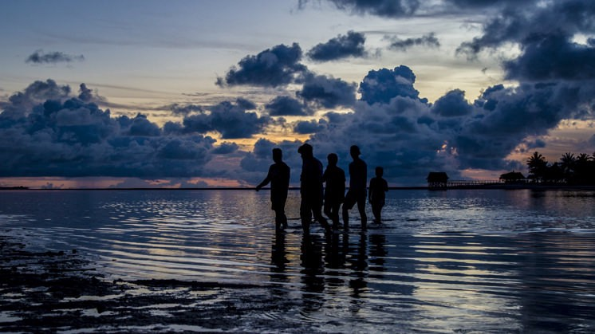

### AYS Daily Digest 21/01/2020 — How Groundbreaking is the UN’s Ruling on “Climate Refugees”?

_Boat Sinks Off Of Belgian Coast///Medical Discrimination Against People Without Papers in Greece///Unaccompanied Boys in Serbia Need Money for Bus Tickets///IOM Recommendations for Croatian EU Presidency_

People in Kiribati\. Source: [Iberdrola\.com](https://www.iberdrola.com/environment/kiribati-climate-change)

Earlier this month, the UN Office of the High Commissioner for Human Rights decided that people can be granted asylum status if they are fleeing the effects of climate change\. Major news outlets latched onto this story — CNN even called it a “ [landmark decision](https://edition.cnn.com/2020/01/20/world/climate-refugees-unhrc-ruling-scli-intl/index.html) \.” UN High Commissioner Filippo Grandi told world leaders and billionaires at Davos to brace for ‘ [millions](https://www.aljazeera.com/ajimpact/davos-world-prepare-millions-climate-refugees-200121175217520.html) ’ of climate refugees\.

Buried beneath the headlines is the fact that the committee decided to deport the person in the case being discussed, Ioane Teitiota, back to Kiribati from New Zealand\. It claimed that Teitiota did not demonstrate “ [a real risk of irreparable harm](https://www.facebook.com/notes/legal-centre-lesvos/decision-by-the-un-human-rights-committee-sets-new-precedent-for-granting-intern/2904524396252921/?fref=gs&dti=1652972374920129&hc_location=group) ,” even though he provided proof of violent conflict over land and needing to ration fresh water due to rising sea levels\. It is a scientifically accepted fact that the island of Kiribati will be uninhabitable very soon, some say in as little as a decade\. Despite the headlines, not only can climate refugees be sent back home, the UN itself decided to do so\. Instead of deciding to apply its principles in this current case, the UN explained that its decision might be useful in a few years, when the consequences of climate change will be even worse\.

The idea of offering special protection to people fleeing the effects of climate change is nothing new\. The UN itself first classified people as “climate refugees” in [2005](https://en.ird.fr/the-media-centre/scientific-newssheets/386-the-first-climate-change-refugees-from-vanuatu-still-under-threat) , conveniently timed with its Climate Convention\. Endless research reports have been published about climate refugeeism, and the International Organization for Migration explains that people have been fleeing climate change since the 1990s\. Since this is a problem that the UN itself acknowledged over a decade ago, acknowledging that people are forced to move due to climate and that they should be protected from deportation in a few years when the crisis gets bad enough to displace millions does not seem groundbreaking\.

The decision does not mean that the asylum process will be any easier than it already is\. The burden of proof is still on the person applying, who needs to show not only that the climate crisis has impacted their home but that they personally are affected by it \(even though all people living on an island are affected by rising sea levels\) \. We have seen people be deported back to countries that are indisputable war zones, such as Afghanistan and Syria, and there will be even more gray areas for governments to justify rejecting an residency application if the reason for applying is the climate\. There are already people on the move because of the climate — not only Pacific Islanders escaping rising sea levels that are being detained in gruesome conditions by Australia, but also farmers whose crops are destroyed by drought or disease\. Many people who are already on the move because of climate change are classified as economic migrants and deported\.

There is hope that this decision could really be a landmark, but we can only judge that by the UN’s and other governing bodies’ actions\. Legal Center Lesvos is currently [representing](https://www.facebook.com/notes/legal-centre-lesvos/decision-by-the-un-human-rights-committee-sets-new-precedent-for-granting-intern/2904524396252921/?fref=gs&dti=1652972374920129&hc_location=group) two people seeking asylum due to environmental conditions and we hope that their cases will be granted\. Until people actually start receiving residency due to fleeing climate change on a consistent basis, the Committee’s words are just empty rhetoric\.

SEA
### Eight People Missing After Boat Sinks Off Belgian Coast

The group of 14 people were [trying to cross](https://www.bbc.com/news/uk-england-kent-51192559?fbclid=IwAR11jfii932H1vdZH1w1BULLfRyyLi56Q2HcVJCRgA-lHSo2uUL0z84aKAc) from Belgium to the United Kingdom\. The eight who are missing probably made it back to shore as well, authorities say\.

It is very rare that people try to make the crossing from Belgium, which is 70km from the British coast across a cold and choppy sea\. However, French patrols along the seashore have almost doubled and the UK has made access to papers more and more difficult\. As people get more desperate, they will try newer ways to get to the UK, even if those ways are more dangerous\. It is likely that nobody died this time, but future crossings may not be so lucky\.

GREECE
### Medical Discrimination Against People Without Papers Continues

Medical Volunteers International in Thessaloniki [reported](https://www.facebook.com/medicalvolunteersinternational/?__tn__=kC-R&eid=ARCwmtdTyewZ9yOKN-DE6OAmk41l16KgRnde54OJwhGOlJf1z5KribK-aOrBKIHYO4FBH0-xgh_PjtYy&hc_ref=ARRsHh_ys0zcunExJoaRUt_TqcZFJ2VOSSeHcLxkb209L5Q8S4YOCAF7LDkrslbdVqU&fref=nf&__xts__[0]=68.ARA9mq1zOxxmhwlU5_0CC46VRLvFOpSUdhRDkaGnpp1DRUN_dtWgScE0dnbU_JkGKPnwLloGw0HC98yoldY1AiZ3j-lInj-Z4SbyD01hinASDLODNClYwSGtYVT7J1UA1m3EJXAQwso9BTXlnVJRnIM9IABUG8JZ-FAeAvcm0F8x4OA1cda1-VkZOCOK8NiaFhZdW6u1qu4R-zk9LzRTokThR1oRnC8vtHYNo8qB5t_dR081aXa5NxHKaYdmBvqlwQstpzvsNF6UPq8YZqYAYw4vMWEdvaaBQNkPs-1BCT2uQCY_Hs3dY2HBA7nggy2swtVMj-ZlHqSoj-5e37YdWiozVw) that a young man with head trauma from a car accident came to them on Monday for assistance\. The young man tried to go to the hospital first, but he was turned away for not having papers\. Medical Volunteers does not have proper equipment to deal with emergency cases like this, however, they frequently have people come in because they were turned away from the hospital due to their immigration status\.

Humanitarian organizations wrote a [letter](https://rsaegean.org/en/open-letter-to-minister-of-migration-and-asylum-en/?fbclid=IwAR0yi3xsUDZSseBHSdgLGtqCYCdFKM_t7GqQV0b7jfIHaMy6XKBj-Vdlwqw) to Notis Mitarakis, Minister of Immigration and Asylum, to draw his attention to the lack of healthcare many people on the move face\. The Greek government withdrew their right to access AMKA, the social security system, and overcrowded camps do not have enough doctors to treat everyone\. The camp conditions are so inhumane they create an environment where disease spreads rapidly and people easily fall ill, but they have no access to treatment\. The organizations provided numerous recommendations to the Greek government, including restoring access to AMKA, ending overcrowding in holding camps, and allowing people on the move to access labor markets\.

Mitarakis is already under fire from NGOs and Greek people alike\. He was heckled during a [recent trip](http://www.ekathimerini.com/248647/article/ekathimerini/news/govt-under-strain-over-migrants-poll-shows-skepticism?fbclid=IwAR2vL5mAYKcaf6dk63sVxYQ-peNlZ939uUIUKpBPF4ZzW4wzEoYCy-1g6Ck) to the Aegean Islands\. His government promised to reduce immigration flows but the Greek people think they are failing and a general strike is planned for Wednesday\. Immigration is on the forefront of many Greeks’ minds but usually the concern is about turning people away, not providing them with humane conditions\. In a [report](https://www.dianeosis.org/2020/?fbclid=IwAR0Eu0gAI2vVRkc2loF3sBaplw_6Bm9nxObduU8AuDaQfLHxH2wN3hoilvg) released by the diaNEOsis think tank, 85\.2% of people surveyed believed there were too many people on the move in Greece\. A smaller number also blamed them for growing crime rates\.

The nonprofit HIAS released a [report](https://www.hias.org/sites/default/files/report_on_low_profile_detention_in_greece_hias_dec_2019.pdf?fbclid=IwAR2J61PGEBNGMjTRK6Z02mKnaneBglUdh9En7pxRLAWJMCv1ckv49Iscn8M) on discriminatory practices in Greece’s asylum system\. Currently, single men from certain countries deemed safe are automatically detained on Lesvos, making it difficult for them to access legal help and gather evidence for their asylum case\. However, this violates Greek law by discriminating against people on the basis of nationality\. The report also called conditions in Lesvos “inhumane and degrading,” citing lack of clean water, hygiene products, cleaning supplies, or even changes in clothes\.

SERBIA
### Lack of Financial Support for People on the Move

The nonprofit InfoPark reports in their weekly newsletter on conditions in Serbia for people on the move:

> _As of 1 January 2020, Serbian reception centers were packed with nearly 5,500 people accommodated\. Newly arrived unaccompanied boys \(UASCs\) are referred to AC in Bogovađa, newly arrived families to RC in Vranje, while single men to RC in Bosilegrad\. Apart from the SCRM transportation arrangements, no other organization at the moment is providing financial assistance for bus tickets except Info Park\. We strongly urge partners and donors of Belgrade field NGOs to consider supporting this important service\._ 

CROATIA
### IOM Issues Recommendations to Croatia in Light of EU Presidency

In a [report](https://reliefweb.int/report/world/iom-recommendations-croatian-presidency-council-european-union-january-june-2020?fbclid=IwAR3Hdkdp9S4gof2vk3TZ_YG9wB5GNgfaNTUDbRqY8zF_4bZF9vn9-BF0_Og) released last week, the IOM requested that Croatia promotes a “more comprehensive approach” towards international migration and includes migration in the EU Green New Deal\.

Croatia is assuming the Council Presidency at the beginning of a “decade of action” to achieve the UN Sustainable Development Goals and will be in charge of leading a new pact over asylum policy and an EU\-Africa policy\. The specific recommendations included increasing access to legal migration and reforming the collective resettlement policy\.

As a reminder, Croatia has come under fire by people on the move, activists, and international watchers for police violence on its borders\.

ITALY
### Death of a Man in Deportation Center Still Surrounded by Mystery

There is no new information surrounding the death of Aymen Mekni, who died over a week ago in the CPR of Pian del Lago\. The government has not [released](https://www.facebook.com/permalink.php?story_fbid=3257535904275194&id=1117797201582419&hc_location=ufi) the autopsy results and the whereabouts of Mekni’s body is unclear, although it was probably returned to his family\.

The state suppressed an uprising by people living in Pian del Lago, who protested the neglect and horrible conditions that led to his death\. In response, the government accelerated deportations, presumably to get rid of witnesses\. A Gambian official was brought to the center to identify 5 of his countrymen for deportation\. They resisted, but were forced to comply by 20 riot police officers\.

The camp is still heavily damaged from the January uprisings as well as ones that took place in late 2019\. People’s demands for adequate care and humane treatment before yet another tragedy happens continue to be silenced\.

At the same time in Gradisca, at 4am on Monday, 3 Egyptian men who were cellmates of Vakhtang, beaten to death by riot police on Saturday, were forcibly [deported](https://www.facebook.com/nocprfvg/posts/806488846492113?hc_location=ufi) \. The three had previously talked to lawyers about their cellmate’s murder and this shows a clear campaign by the Italian government to make all of the witnesses to their crime disappear\.

A [report](https://www.fluechtlingshilfe.ch/assets/herkunftslaender/dublin/italien/200121-italy-reception-conditions-en.pdf?fbclid=IwAR0tMgxf-anQ4AFwCTBZV7asH_Kh_rfsjFtFuC3Qz3K7GJOkvyyG-6ecRjk) by the Swiss Refugee Council found conditions for people seeking asylum in Italy inadequate\. According to the Dublin Association Agreement, Italy is a safe country that people can be deported to from Switzerland\. However, returnees to Italy do not receive proper physical or mental health care or social support after a few months, forcing them to take exploitative jobs\. The asylum process is convoluted and difficult to understand, but many people on the move never receive information about their legal rights or procedures\. Many do not even receive their luggage because of processing errors at Fiumicino Airport\. The report also highlights a dangerous political climate for people on the move since the rise of Matteo Salvini and his power\.

Meanwhile, the Italian parliament voted that Salvini [can be processed](https://www.corriere.it/politica/20_gennaio_20/gregoretti-giunta-decide-se-salvini-deve-essere-processato-00b966fc-3b9d-11ea-b696-dcf03dd8fb7e.shtml?refresh_ce-cp&fbclid=IwAR26ODkuKM7Etl0jhNAqQg1EfU6FzhFMaogFXS5YrKA03yzF4MNu-_0HM74) for the Gregoretti Case, when he refused to let a rescue ship with 131 people on board dock\.

GERMANY
### New Report Highlights “Bleak Picture” of German Asylum Process

The [report](https://www.uni-goettingen.de/de/619137.html?fbclid=IwAR2DHxC4RVXK5_Ref8AI7tnTVyBMqCkXATeL8o6PKJSV08DkS1daBbxOhM4) was prepared by the RESPOND project and has information from interviews with people seeking asylum and people working in the German government as well as NGO statements\. It found serious humanitarian concerns in German treatment of people on the move\.

Many people were not given adequate information about their rights or what seeking asylum meant\. There were several cases of people waiting in detention centers before realizing that they were not even eligible for asylum\. People were not told that they could refuse the translators provided by the German government, who were often unreliable\. Translators were not always fluent in the language they were working in or were not working in the right language at all \(there were cases of Farsi speakers receiving Dari translators, even though they are two different languages\) \. In other cases, translators deliberately misinterpreted what their clients said out of personal or political bias, hurting their chances at asylum\. The German government did not process applications efficiently which is especially damaging for minors who are in danger of aging out of the system soon, lost paperwork, or confused people’s identities\. RESPOND also points out the demonization of people on the move by the media and politicians\.

They recommend the German government provide easy access to the asylum system, guarantee human rights, and improve asylum centers that are currently breeding grounds for isolation and rights violations\.

SWEDEN
### Swedish Government Separates Afghan Family in Mass Deportation

A mass deportation [was planned](https://www.facebook.com/AmasoAfg/posts/3022934941070103) from Sweden to Afghanistan Tuesday evening, despite Afghanistan being one of the most dangerous countries in the world\. The number of people being deported and all of their identities were unknown\. All that we know is that [4 or 5](https://www.facebook.com/elisabet.rundqvist/posts/2788370184557546?hc_location=ufi) were from Marsta detention facility along with numerous others from other centers around Sweden\.

Among those being deported was a young man named Nawroz\. Both of his brothers, his only surviving family members, were granted asylum while he was not\. He was no remaining family or social ties whatsoever in Afghanistan\. His situation is sadly just another case that shows the inhumane and arbitrary nature of asylum processes not just in Sweden but throughout the Western world\.

EU
### Berlin Conference on Libya “Gave New Impetus For Peace”

Angela Merkel praised the conference, which was the first time all sides of the Libya conflict gathered in one place, but she made sure to emphasize that they did not solve all the problems\.

All sides [agreed](https://www.facebook.com/ISPIonline/photos/a.241178709267402/3047202871998291/?type=3&theater&ifg=1) to an immediate ceasefire, creating a joint committee to supervise the ceasefire, and to implement an arms embargo\. All external actors agreed on creating a new, unified Libyan government, putting armed forces under the control of a civil government, creating a committee of experts to relaunch the economy, banning attacks on petroleum structures, and closing detention centers for people on the move\.

While the detention centers in Libya are inhumane and should be closed, it is unclear if the conference provided alternatives for detention or talked about protecting people on the move, who are most vulnerable to violence\. The conference also sidelined Libyan voices and most of the decisions were made by the external actors fueling the conflict\. Whether Libyans will accept the results of this conference remains to be seen\.

**Find daily updates and special reports on our [Medium page](https://medium.com/are-you-syrious) \.**

**If you wish to contribute, either by writing a report or a story, or by joining the info gathering team, please let us know\.**

**We strive to echo correct news from the ground through collaboration and fairness\. Every effort has been made to credit organisations and individuals with regard to the supply of information, video, and photo material \(in cases where the source wanted to be accredited\) \. Please notify us regarding corrections\.**

**If there’s anything you want to share or comment, contact us through Facebook, Twitter or write to: areyousyrious@gmail\.com**

_Converted [Medium Post](https://medium.com/are-you-syrious/ays-daily-digest-21-01-2020-how-groundbreaking-is-the-uns-ruling-on-climate-refugees-127c3e722fb9) by [ZMediumToMarkdown](https://github.com/ZhgChgLi/ZMediumToMarkdown)._
