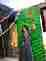
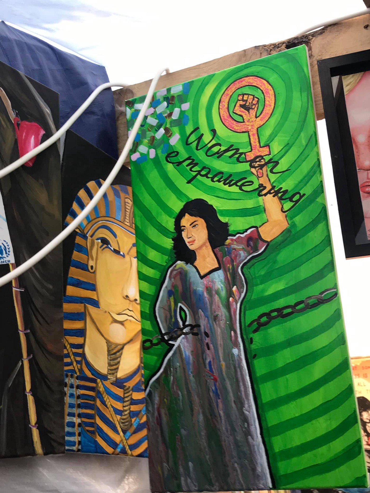

### YS DAILY DIGEST 24\.01\.2020: Witness to Beating Murder of Man in Italian Detention Centre Deported — A Coverup at Hand?

[Are You Syrious?](@AreYouSyrious?source=post_page-----ebb6adfce954----------------------)

[Jan 25](ays-daily-digest-24-10-2020-ebb6adfce954?source=post_page-----ebb6adfce954----------------------) · 8 min read

_Details emerge in the wake of police brutaliaty in Italy // More horrific testimony from Lesvos // Rescue at Sea // Hunger Strike in France_

[Photo Credits: Kayra Martinez](https://www.facebook.com/photo.php?fbid=10156508294676829&set=pcb.10156508295126829&type=3&theater)
### FEATURE: Sudden deportation of witness to beating murder of inmate in Gorizia

One of those who was demonstrating against the horrific conditions and deportations in the Gorizia \(CPR\), who witnessed the brutal beating that resulted in the death of another protester has been deported\.

For context, on January 17th the police entered the Gorizia deportation facility \(CPR\) to help quell a protest against inhumane conditions in the centre\.

> _“The centre re\-opened recently, a month ago, amidst protests and critiques concerning the clear violations of rights and human standards, so this death, occurring after such a short time can only represent a clear and sad proof of the necessity to abolish immigration detention\. Note that one of the reasons why the centre closed in 2013 is connected to [another death](https://www.meltingpot.org/Ogni-anima-muore-La-storia-di-Majid-morto-di-CIE.html#.XiTBtBNKg0o) , the one of Majid, that also happened inside those walls\._ 

> _The centre is managed by EDECO, a cooperative based in Padua, 2 hours from Gradisca, is sadly known to the public for being responsible for another centre, [Cona — a reception centre this time](https://www.meltingpot.org/Morte-di-Sandrine-occupata-la-prefettura-di-Venezia.html#.XiTE8RNKg0o) , where a young woman, Sandrine, died in 2017 and for being [investigated for criminal association for fraud in supplying public services](http://www.padovaoggi.it/cronaca/indagine-cooperativa-edeco-conetta-profughi-padova-26-gennaio-2018.html) \.”_ 

Please read the full report [here](ays-weekend-digest-18-19-01-20-italian-police-responsible-for-the-death-of-a-man-imprisoned-in-e8a271522f57) \.

Activists on the outside had contact with those inside via cellphones and collected more testimony and even videos of the arrival of police\. One of the inmates who was protesting was surrounded by riot police who then brutally beat him\. Although he was taken to hospital, he died of his injuries \(or possibly was already dead\) \. In the aftermath of the protest and the death, the cell phones of inmates were confiscated\.

Later, one of the activists reestablished contact with a former inmate, who reported that he had been deported to his home country in a surprise 4AM deportation in recent days\. This after being in Italy for 24 years — he arrived when he was seven\. Below is an approximate translation of their conversation\.

> _“\- Hello, can you hear me?_ 

> _\- I am the guy who spoke from the CPR\._ 

> _\- Yes, yes, I know it’s you\._ 

> _\- Nothing, I got expelled, now I’m in my country\._ 

> _\- Are you back in your country now?_ 

> _\- Yes, they transferred me when \[incomprehensible\] testified\._ 

> _\- Do they already have you, have they already repatriated you?_ 

> _\- Yes, yes, this morning at four I went to Monaco and then on from Monaco to XXX\._ 

> _\- Ok, but listen, before leaving they made you talk to someone to tell them what you saw?_ 

> _\- Yes, there were the parliamentarians there, who came from Rome\._ 

> _\- Ok, yes, I know they came\. Some of them are saying what you say, too,_ 

> _but, others continue to say that it is not true\._ 

> _\- Eh, they deny and all that he died, the ambulance, but he died there\._ 

> _\- Yup\._ 

> _\- He died at the CPR\._ 

> _\- I understand\._ 

> _\- Because I saw him on Friday and later \[that\] night he was already \. \._ 

> _\- He was already very unwell\._ 

> _\- Mm\. Then on Sunday they beat us with the bars and everything, they pushed us to take the phones, they saw the photos in the newspapers and everything\._ 

> _\- D — n\. this Sunday evening, right?_ 

> _\- Mh\._ 

> _\- Ok\. And indeed \. \._ 

> _\-That’s why I could not send you anything, they had taken my phone and everything, searched everything, threw clothes on the ground\._ 

> _\-Ok_ 

> _\- Yes, and inside they haven’t given them the phones back yet, they are all still without, we can’t talk to anyone\._ 

> _\- They are still burning clothes and everything, mattresses, they want \[incomprehensible\]”_ 

It is clear that much of the brutality is designed to punish and humiliate any who dare protest against their abuse, but the extent to which the CPR and those policing it are going to eliminate evidence and help suppress any news of the extrajudicial murder of the inmate V\.E\. is sinister\. [For the original, go to this page\. It is all in Italian but contains audio\.](https://nofrontierefvg.noblogs.org/post/2020/01/24/quarta-testimonianza-quando-la-verita-devessere-insabbiata-parte-3/)

Violence, intimidation, corruption, and coverup are all used while the public are fed lies about the criminality of the victims\.
### We should never be forgetting the situation in Greece

Yesterday ten people were deported from Greece to Turkey\. The Greek Government had been saying throughout 2019 \(after resuming deportations\) that they were planning to deport 10,000 people to Turkey by the end of 2020\. [According to Aegean Boat Report](https://www.facebook.com/AegeanBoatReport/photos/a.285312485325196/755893284933778/?type=1&theater) , 133 people arrived on the Greek Islands yesterday, and it is important to remember that the number of people who arrived in 2019 increased by 50% over the previous year\. On Lesvos alone in 2019, over 27,000 people arrived\. More than half of those remain in the horrific squalid conditions there, with the total number on Lesvos being [over 19,000](https://www.facebook.com/Bordermonitoring.eu/posts/1500160976774910?hc_location=ufi) \.

Refugee Support Aegean posted a horrific and unflinching account of the truth of the Moria “hotspot”

> _“It is estimated that three quarters of the refugee population are living around the Moria hotspot in tents and makeshift shelters\. The bad weather conditions have caused their situation to deteriorate, but that does not seem to sensitize the decision\-makers or public opinion, while solidarity groups from Greece and abroad [continue](https://stonisi.gr/post/6098/phran-thn-katastash-sta-xeria-toys) their efforts to support the situation\._ 

> _The conditions [\[7\]](https://rsaegean.org/en/moria-nightmare/#footnote-8) that have been created inside and outside Moria hotspot are now something more than inhuman and dangerous\. They are simply indescribable\. Many of the containers inside the hotspot house more people than their actual capacity so that refugees are not forced to stay in a tent\. A man from Congo who is a victim of torture and lives inside the Moria hotspot describes it: «We are 15 inside the container where there are 10 beds\. Some sleep using their blankets for mattresses\. Some share a bed\. \(While there is heating\) because there are frequent electricity cuts it is impossible to heat the area\. The conditions in which we live are dire»\._ 

> _In the ‘Olive Grove’ \(or, as the refugees call it, the ‘jungle’\) around the hotspot, the situation is once more out of control\. The extension of the informal settlement on the left side on the hill outside the hotspot is characteristic of the serious overcrowding\. Many new arrivals are not provided with a tent any more\. They must buy themselves a tent or build a shelter with materials they find in the garbage from the surrounding area\. They must also find a way to protect their tents and makeshift shelters from the weather conditions that have become more extreme in the last month\.”_ 

Due to these horrific conditions, is it any wonder that many people, after being transferred to the mainland, have lost hope in the system and pursue further journeys on their own? Instead, the response is either to pity or to criminalize those who are suffering the most\. For the full article and more horrific testimony, please go [here](https://rsaegean.org/en/moria-nightmare/) \.

This corroborates the report we shared from MSF regarding the horrific conditions faced by the children living in the camp\. MSF stated that there were at least 140 children with severe life\-threatening conditions on Lesvos\. For more on this, please read y [esterday’s digest](ays-daily-digest-23-01-20-at-least-140-severely-ill-children-are-denied-healthcare-in-lesvos-1ff8a893072e) \.

There is ongoing contention and discussion about evacuating unaccompanied minors from Greece, with Germany officially having mixed views\. Switzerland has pledged now that they will take [“a certain number” which is certainly something\. But we shall see how this plays out\.](https://www.swissinfo.ch/eng/society/asylum_switzerland-plans-to-take-in-unaccompanied-minors-from-greece/45515120)

However, in spite of this horror, some people are creating beauty\. Longtime volunteer Kayra Martinez shared some of the work at an installation at the Moria Refugee Camp organized by Zekria Farzad\.

[Photo Credits: Kayra Martinez](https://www.facebook.com/photo.php?fbid=10156508294676829&set=pcb.10156508295126829&type=3&theater)

There will be a deportation from Austria on February 4th\. Please share among your networks\.

> _“Warning\! Deportation alert\!_ 
 

> _Deportation Austria — Afghanistan 04\.02\.2020\!_ 
 

> _Spread it\!_ 

> _Unfortunately, more often heard: please forward\!_ 
 

> _Deportation Alert\!_ 
 

> _Charter deportation 04\.02\.2020 Austria — Afghanistan\.”_ 

For more updates go [here](https://www.facebook.com/plattform.refugees.welcome/posts/2415039485425797) \.
### Police repression and abuse in detention in France

Coverning police violence in detention and deportation centres, people in the detention centre of Oissel, France went on a hunger strike to show solidarity with an oppressed inmate and to protest the violent and dehumanizing conditions they are facing\. They released a press release detailing the abuse\. One inmate showed solidarity with a friend who was facing solitary confinement, and was subsequently punished with solitary confinement\. Later, police brought in dogs to intimidate them\. The whole press release is here \(translated\):

“ _At the Oissel detention centre \(near Rouen\) the police are violent and humiliate us every day\. They always provoke, they say “Lower your eyes\!”\. The food is cold and not halal, while the majority of prisoners are Muslim\._ 
_Even the prison is better than here\. They are 10 or 20 years old here and we put them in a detention centre\._ 
_Since Saturday it has been even worse\. The police still wanted to put a prisoner in solitary confinement\. His friend objected and they violently brought him to solitary confinement as well\. In the evening there was the police with dogs and hoods in the centre to scare us\._ 
_The prisoner who was in solitary confinement has just come out\. They_ 
_beat him up, he can speak, he has bruises everywhere\. His eyes and_ 
_ears are swollen\._ 
_Yesterday they broke the foot of another prisoner\._ 
_It is all wrong\. Everyone complains\. We are more than 42 prisoners locked up here\. So here we go on a common strike\. No one is eating tonight\._ 
_We will try to occupy the corridor because what happened since last Saturday is even worse than usual\._ 
_There is no hygiene here\. The rooms are not cleaned every day\._

_We demand:_ 
_\- The end of police violence, xenophobia of the police and their racism_ 
_\- A minimum of hygiene and dignity_ 
_\- Correct food_ 
_\- Correct care_

Prisoners on Oissel’s hunger strike, January 22"

For full coverage, go to [A Bas Les Cra here](https://abaslescra.noblogs.org/communique-des-prisonniers-de-oissel-en-lutte/) \.

**Find daily updates and special reports on our [Medium page](https://medium.com/are-you-syrious) \.**

**If you wish to contribute, either by writing a report or a story, or by joining the info gathering team, please let us know\.**

**We strive to echo correct news from the ground through collaboration and fairness\. Every effort has been made to credit organisations and individuals with regard to the supply of information, video, and photo material \(in cases where the source wanted to be accredited\) \. Please notify us regarding corrections\.**

**If there’s anything you want to share or comment, contact us through Facebook, Twitter or write to: areyousyrious@gmail\.com**

_Converted [Medium Post](https://medium.com/are-you-syrious/ys-daily-digest-24-01-2020-ebbe2c0aa4b) by [ZMediumToMarkdown](https://github.com/ZhgChgLi/ZMediumToMarkdown)._
