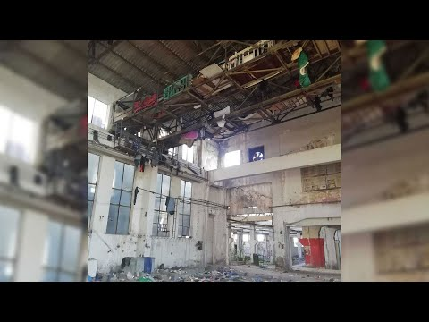
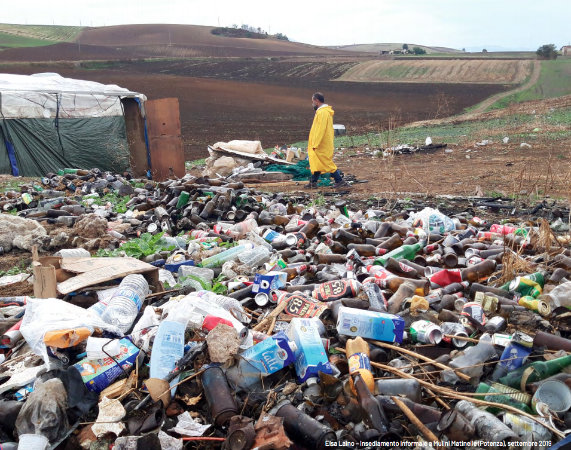

### AYS Weekend Digest 25–26/01/2020: European ghettoes

_Slums and tents are one of the faces of European migration policies — in the Greek islands and in Patras, in Sid and Velika Kladusa, in the Italian south, in Paris and Dunkirk\._

](assets/883495d5c965/1*QAaFAdAcbbdmqM_xSsoJ7w.jpeg)

[Lesvos, Photo by Knut Bry/Tinagent](https://www.facebook.com/sk.aldeen.3/posts/1593085910849899)
#### Feature: European migration policies: camps, slums and detention centres

From the Greek Islands to Dunkirk, from Patras to Sid, from the Italian south to Velika Kladusa, and all the way to Paris, in the last few years people on the move have been forced to live in the most horrible conditions\. Summer tents in snow, rain and freezing temperatures, set up on mud and ice\.

One would think that over the course of four years, national and EU authorities would have been able to put together a plan to improve conditions for the people arriving in Europe — even before working out if they would fit the categories of “refugee”, “economic migrant”, “legal”, “illegal”, so loved by our politicians\. Well, the situation has only gotten worse\. In the last few winters, governments boasted about their plans for winterisation, to prevent people living in tents in the freezing winter, to provide decent humane accomodation\. They lied\. But that was at least a concern\.

This weekend the newly appointed migration minister of the Greek government went to Kos and visited the RIC structure and talked with local authorities\.

He commented:

> Our country has a balanced immigration policy, it respects its international obligations, but beyond that we have national rules and those who are not eligible for international protection will now be returned to Turkey quickly\. We believe that this will play a major role in limiting the flow\. _\( [via Greek media](https://www.tanea.gr/2020/01/26/greece/mitarakis-apo-tin-ko-tha-kratithoun-gia-25-meres-osoi-prosfyges-eftasan-sto-nisi/?fbclid=IwAR1uYu4liS_PoDbKVXGV3KPQ0CRYVDW0I5fxSyru3Tq388gggv69KokLVi8) \)_ 

He also announced that he will ensure the implementation of a new law for which all people entering Greece will be detained for 25 days\. In that time, the Asylum Service will supposedly distinguish between people “deserving” protection and those who don’t\.

[Salam Aldeen](https://www.facebook.com/sk.aldeen.3/posts/1593085910849899) , a member of Team Humanity, who was recently arrested and then expelled from Greece for his actions in solidarity with people on the move and for his reporting on it, described again the situation on the islands:

> Moria Refugee camp on Lesvos island is worst then ever, I have been witnessing the worst things in my life in this camp, no women no child no human should go through this horrible inhuman conditions we shouldn’t allowed this to happen in this world and definitely not in Europe 

](assets/883495d5c965/1*CL9aztWOvcFdcXUBhq6RVg.jpeg)

[Lesvos, Photo by Knut Bry/Tinagent](https://www.facebook.com/sk.aldeen.3/posts/1593085910849899)

> \[…\] this island is being controlled by the authorities everything from hospitals to the asylum service, they do what ever they want and no one gets punished for the crimes, women and children getting raped and the police don’t care about this, there is no protection for this women and children, 

](assets/883495d5c965/1*S908ktzE4FlYPVW1XG2c9g.jpeg)

[Lesvos, Photo by Knut Bry/Tinagent](https://www.facebook.com/sk.aldeen.3/posts/1593085910849899)

> the police are arresting people when ever they want and throwing them in jail and then illegally deporting them back to Turkey, family’s are getting separated, this is a crime and should strongly be investigated, the food is disgusting even dog food is better then the food the military provides to refugees, 

](assets/883495d5c965/1*GHl87aZfbRHOIgheSZZzXA.jpeg)

[Lesvos, Photo by Knut Bry/Tinagent](https://www.facebook.com/sk.aldeen.3/posts/1593085910849899)

> \[…\] the authorities are going slowly to pick NGOs one by one and kick them out from the island, they already started with harassing few NGOs , without NGOs on the island this island would had never survived, and the NGOs on the island should stop the work they are doing only for 5 days and you will see hell for the authorities, then they will understand how important it is to have NGOs and volunteers on the island\. 

In Dunkirk as well, due to the cold temperatures and the reduction of the areas of woodland, people are now seeking refuge in several large abandoned warehouses, which are filled with loose concrete, scrap metal and rubbish\. Despite this, they became a temporary home for hundreds of people including dozens of small children, sleeping in their tents\. Each tent is packed extremely tightly, with little room for more — [as Mobile Refugee Support \(MRS\) state](https://www.facebook.com/MobileRefugeeSupport/posts/1171908166348126) \.

](assets/883495d5c965/1*FoETeIZB47A3lNQHGP9YmQ.jpeg)

[Dunkirk, Photo by Mobile Refugee Support](https://www.facebook.com/MobileRefugeeSupport/posts/1171908166348126)

In the first weeks of the year, MRS witnessed many new arrivals every day\. Having been harassed and detained at every step of their journey, many people arrive with little more than the clothes on their back and a handful of possessions\.

](assets/883495d5c965/1*S6wsZjx0_A6TsiZazigUKA.jpeg)

[Dunkirk, Photo by Mobile Refugee Support](https://www.facebook.com/MobileRefugeeSupport/posts/1171908166348126)

With the eviction of other small camps across France and Europe taking place regularly, more new arrivals are expected as well\. In Paris, a new eviction of the camp in Porte D’Aubervilliers is expected on the coming Tuesday, 28th of January — [Solidarité Migrants Wilson report](https://www.facebook.com/permalink.php?story_fbid=1346476912219744&id=598228360377940) \.

Also in Patras, on the west coast of Greece, people find refuge in abandoned warehouses\. Last week police stormed one of these, arresting a young man\. Another young man had to be taken to hospital as he injured himself falling down due to the conditions of the warehouse\.

Similar situations can be found all over Greece and the Balkans\. Listen to this weekly report by ENS MOVEN, in which three independent volunteers working with No Name Kitchen in Sid, Velika Kladusaand Patras, talk about the conditions for people on the move\. \(It’s in Spanish, but with English subtitles\) \.

On Saturday, Italian MSF, published a report titled [“Vite a giornata”](https://www.meltingpot.org/Vite-a-giornata-precarieta-ed-esclusione-dalle-cure-per-i.html?fbclid=IwAR3GYeKNh1XZ-VodeWj_9D1IIPl9NRmzFORriRj0VpNvq61HcJkIF0KbNUM#.Xi36Wy2ZM0o) , describing their outreach activity in the last 6 months of 2019 in informal migrant settlements in the Basilicata region, southern Italy\.

Such settlements are “home” to both seasonal farm workers, and workers who are based in the region, but also to those who have been evicted from other similar settlements in other regions of Italy and those who recently lost their “humanitarian protection” status, due to the change in the law of late 2018\.

In these ghettoes, difficulties caused by horrific hygienic and sanitary conditions adds to exploitation and social exclusion, resulting in the inability to see their basic human rights respected\.

Shantytowns, makeshift camps, old farmhouses or factories, all the settlements monitored by MSF are unhealthy and unfit for human habitation, but they act as places of refuge from a hostile environment\.

\(Photo by Maurizio Debanne/MSF\)

In a total of 900 medical checkups, MSF found out that

1 out of 3 patients presented inflamed muscles or bones, caused by harsh working condition in the fields;

1 out of 4 presented medical issues caused by their living conditions;

more than half of the people had had problems accessing the healthcare system\.

This is the face of European migration policies: camps, ghettoes, slums, shanty\-towns, where people live and die as hidden as possible\. Politicians state they want to build more structures to transform into concentration camps for those people deemed worthy of European protection, at least for now\. The others are to be forcibly deported to countries which are safe only for this purpose\.

This is Europe, 2020\.

ITALY
#### Fire broke out at the CPR in Gradisca d’Isonzo

Local media [report](https://www.ilfriuli.it/articolo/cronaca/nuovo-incendio-nel-cpr-di-gradisca/2/213720?fbclid=IwAR0Tn6QU0ZGM78h8NiGxNm5Hehhu-_zJXd3z4xjHu08fQdx-ZjclaCdgQGI) that detainees of the centre had tried to set mattresses on fire in the courtyard of the structure\. They were protesting the silencing and the attempted cover up of the death, one week ago, of Vakhtang Enukidze, who was beaten up by the police, was refused medical assistance and died on Saturday 18th\. Some of those who witnessed the events have been already deported to their native countries\.

Read more on Vakhtang’s death in our digests from last week \( [18–19 January](ays-weekend-digest-18-19-01-20-italian-police-responsible-for-the-death-of-a-man-imprisoned-in-e8a271522f57) , [20 January](ays-daily-digest-20-01-20-giving-names-to-victims-deaths-in-italian-deportation-centres-ad96ac5c8b5e) , [24 January](ays-daily-digest-24-10-2020-ebb6adfce954) \) \.
#### Three people arrested in Verona suspected of exploiting migrant workers

Verona’s authorities have arrested two owners of a job agency and one other person who acted as a recruiter as they are suspected of exploiting migrant workers, local media [report](https://m.larena.it/territori/citt%c3%a0/minacciati-e-pagati-meno-di-5-euro-l-ora-tre-arresti-per-caporalato-a-verona-1.7903058?fbclid=IwAR03m9-E8c9iIXc_emHmeFOoxVR2cupReUgBNR3Ry9FRgEhuD5HWh9CAJ6g&refresh_ce) \. They were hiring low\-cost workforce in the reception centre of the region\. Paid less than 5€ per hour, without a contract or security, threatened with physical violence, people were recruited to work for 5 farms of the area\.

**Find daily updates and special reports on our [Medium page](https://medium.com/are-you-syrious) \.**

**If you wish to contribute, either by writing a report or a story, or by joining the info gathering team, please let us know\.**

**We strive to echo correct news from the ground through collaboration and fairness\. Every effort has been made to credit organisations and individuals with regard to the supply of information, video, and photo material \(in cases where the source wanted to be accredited\) \. Please notify us regarding corrections\.**

**If there’s anything you want to share or comment, contact us through Facebook, Twitter or write to: areyousyrious@gmail\.com**

_Converted [Medium Post](https://medium.com/are-you-syrious/ays-weekend-digest-25-26-01-2020-european-ghettoes-883495d5c965) by [ZMediumToMarkdown](https://github.com/ZhgChgLi/ZMediumToMarkdown)._
