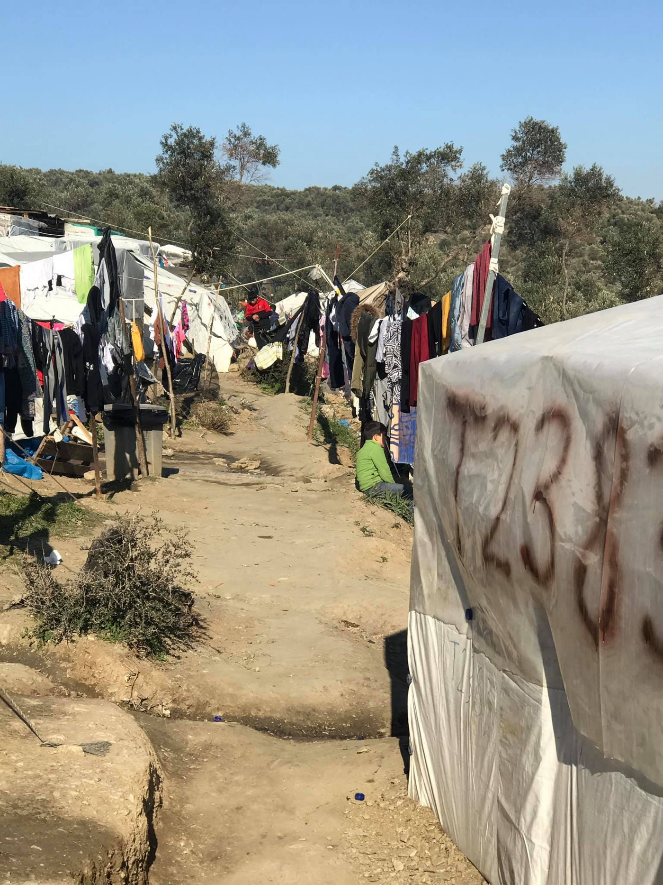
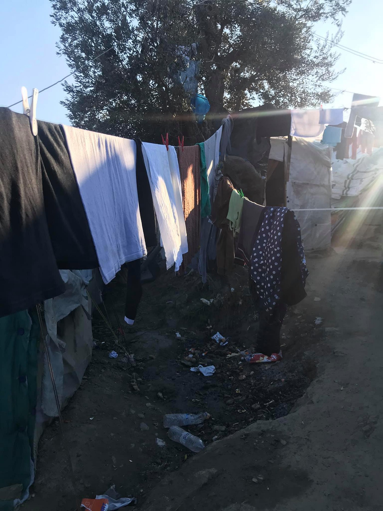
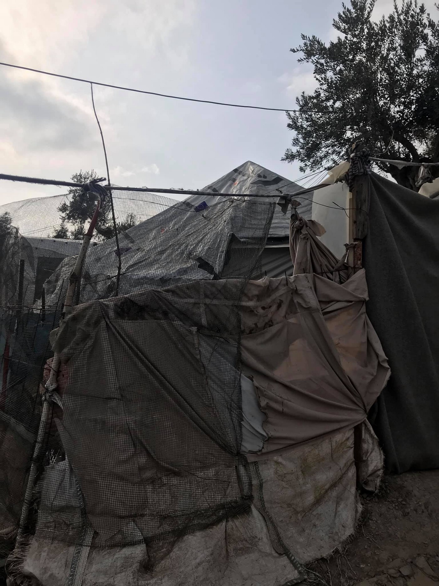
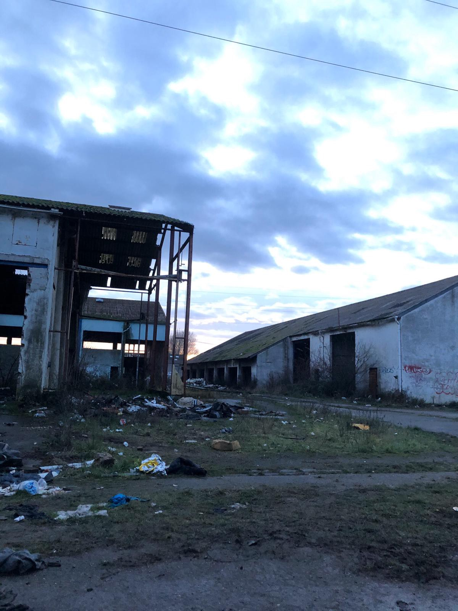
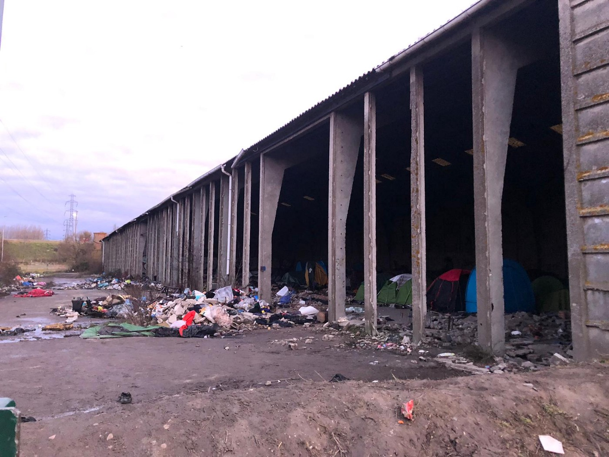

### AYS Daily Digest 27/1/20: “Member States shall not hold a person in detention for the sole reason that he/she is an applicant”
#### The new Greek law goes against Directive 2013/32/EU of the European Parliament and of the Council / More than 484 people saved across the Mediterranean during weekend / Serbia: physical punishment and degrading access to Afghans from security and KIRS / Still no proper local shelter available for those sleeping rough in Grande\-Synthe / &more news

 [EU\-Turkey Statement](https://rsaegean.org/en/category/topics/eu-turkey-statement/) [Stop The Toxic Deal](https://rsaegean.org/en/category/stop-the-toxic-deal-2/) [Χωρίς κατηγορία](https://rsaegean.org/en/category/%ce%b1%cf%84%ce%b1%ce%be%ce%b9%ce%bd%cf%8c%ce%bc%ce%b7%cf%84%ce%b1/) from 24 January 2020 \(Photo source: RSA\)](assets/413657a755d7/0*ZbLsNYL7b2yBhkMn.jpg)

Read more on the D [etention and Reception Conditions](https://rsaegean.org/en/category/topics/detention-and-reception-conditions/) [EU\-Turkey Statement](https://rsaegean.org/en/category/topics/eu-turkey-statement/) [Stop The Toxic Deal](https://rsaegean.org/en/category/stop-the-toxic-deal-2/) [Χωρίς κατηγορία](https://rsaegean.org/en/category/%ce%b1%cf%84%ce%b1%ce%be%ce%b9%ce%bd%cf%8c%ce%bc%ce%b7%cf%84%ce%b1/) from 24 January 2020 \(Photo source: RSA\)
#### FEATURED

Tight deadlines and firm decisions are at the core of the new Greek law that is being disputed across Europe\. “The Greek government plans to deport 10,000 migrants this year,” the international papers write\. That would be five times as many deportations as the Greek authorities have carried out since the refugee deal between the EU and Turkey was signed in March 2016\. However, the Greek authorities are taking far too long to process the current applicaants for asylum, and therefore the camps across the Aegean islands are far over their respective capacities\. The people there can barely survive in the past week\.

> According to some statistics, 76 percent of Greeks criticize their government’s refugee policy\. 

The new stricter law gives many options for extending detention\. Still, the rejected asylum seekers are allowed to appeal any decision\. Judges then have to decide on the application\. Until then, the asylum seekers must remain in the closed part of the camp on Kos\. Read more on the legal issues faced by thousands on the Aegean islands in our [previous News Digest edition](ays-daily-digest-22-1-20-the-uk-doesnt-want-children-to-join-their-families-while-the-greek-6a397dc06257) \.

> ‘Member States shall not hold a person in detention for the sole reason that he or she is an applicant in accordance with Directive 2013/32/EU of the European Parliament and of the Council of 26 June 2013 on common procedures for granting and withdrawing international protection’\. 

As the laws change, the fights and protests continue and dissatisfaction grows\. One of the increasingly popular moves is to hit the NGO and activist sector\. 
The enormous financial interests and participation of NGOs in the political parties are pervasive, says one of the local articles commenting on the much needed, though not ideal, work of the individuals and organizations, who are present to assist or take on a huge amount of the work required to fulfill some of the many needs of the concerned population\.

> For the small host communities on the Aegean islands, but not only there, international aid workers and volunteers have changed the make\-up of local society\. They have driven up rent prices, overcrowded local houses and, often coming for just a few days or weeks, shown little sympathy to those unable to fly back home\. There is widespread local resentment towards the white saviour complex of volunteers who can fly home and leave behind this tragic situation, whilst locals remain caught up in the crossfire between European politics and mass human migration\. 

However, the vilification of NGOs is for the most part based on a series of incorrect assumptions and a lack of information, [Jacob Warn](https://www.crossingstrings.co.uk/) writes\. The greatest mistake in the Greek island, as well as some other cases, seems to be the failure to establish positive and open communication with local communities\.
There are many underlying issues in each of the countries affected by similar issues\. One of the biggest problems is the political one, which stems from the corrupt system we should be careful not to become supporters of, as some people tend to defend everything that is local, including ultimately the current state of things; a result of the lack of political will\. The only way still seems to be, as Warn said, to work together with local community and NGOs, who share a vision of dignified living in order to find an end to a bankrupt system that has brought misery to hundreds of thousands of local people and asylum seekers\.
#### SEARCH AND RESCUE

Each time there is a successful SAR mission, due to a lack of political will on a European scale, there is a risk to the hundreds of people who end up waiting aboard rescue ships for days and weeks in order for some EU Member State to claim responsibility and allow them to dock into a safe harbor where the people will not be persecuted\. A similar case is ongoing right now\. Alan Kurdi and the Ocean Viking, made several rescues over the weekend in the Mediterranean\. In total, the two ships say they have 484 people on board\.

> “many were suffering from hypothermia and dehydration\.” 

Others have been exposed to fuel, which can develop into burns on the skin, a nurse on board the Ocean Viking [said](https://www.infomigrants.net/en/post/22364/nearly-500-migrants-rescued-in-the-mediterranean-over-weekend?fbclid=IwAR1pOG4dmot0GjQD4Ez2B2wYWJUs8hQubq58m1Nw54O99lDIDhRhfeNuaSM) \.

■■■■■■■■■■■■■■ 
> **[MSF Sea](https://twitter.com/MSF_Sea) @ Twitter Says:** 

> > 🚨BREAKING: A patient suffering severe fuel burns has just been evacuated from #OceanViking. The woman was transported to Malta via helicopter, along with her 3 children. Rescued last night, the #MSF team stabilised her condition, but she was at risk of developing complications. https://t.co/jhy4xUSa9m 

> **Tweeted at [2020-01-27 14:49:33](https://twitter.com/msf_sea/status/1221807460517806082).** 

■■■■■■■■■■■■■■ 

#### GREECE

On a day marking the 75th anniversary of the liberation of the Nazi Germany concentration camp, Auschwitz, a upon which many all over Europe are honoring the victims of the Holocaust, one of long term aid worker wrote what she has seen and heard in Moria from the people there:

> After four arduous years, I went back to Lesvos island to see for myself the situation in ‘The Jungle’,
 

> where all of the people are living in tents, no electricity and horrible conditions\. It reminded me of Nea Kavala, where I spent 2 1/2 years problem solving, one family at a time\.
 

> We went into one of the tents to sit and listen\. Problem solving is only accomplished through listening\. It’s the most powerful tool I can attest to\.
 

> The family from Afghanistan with four children were so happy to have someone to talk to\. We met a lovely woman from Iran, that used to be a dentist\. She’s now living in the jungle with her husband, thankful to be out of a country where she was threatened\. She helped to translate\. Within minutes, the tent was crowded with dozens of people in line asking about their minor child in Austria, their medical case, their asylum case and weren’t even aware of where to go to get help\.
 

> I connected people to lawyers, medical organizations and places they can go to get support locally\.
 

> Many people have the dreaded red stamp which prohibits them from leaving the island\.
 

> 20,000 people with the number growing\. My heart ached as I left yesterday\.
 

> I have to concentrate all my energy in Athens, where we’ve accommodated even more families in the last months, but urge all of you that can help, to connect with organizations working there, send aid or donations, because the governments aren’t working effectively to change this situation\.
 

> Am at a loss for words for the failure of the system for people that so badly need us, for the children that will be scarred for life to have to live in this situation and lose out on their education\.
 

> For all of you that are taking some action around the world, thank you\.
 

> We must all rise up together\.
 

> Please share\.
 

> The Jungle
 

> Moria Camp
 

> Greece
 

> January 26, 2020 

](assets/413657a755d7/1*0SmxdI2dp2pNJ9dLTWQPcA.jpeg)

Photos and testimony by: [Kayra Martinez](https://www.facebook.com/kayra.martinez?__tn__=%2Cd%2AF%2AF-R&eid=ARBNjucDVp39uguzhs4BraUixuzBrgGlNLSiDfJ-_jL3dOM20PdQcRXoefVBwqhsn9yy6ulVI4W3Z-9i&tn-str=%2AF&hc_location=group_dialog)

Read more on Moria [here](https://rsaegean.org/en/moria-nightmare/?fbclid=IwAR2q4Ragete4NytiojnwblwEQxWxQQBUHfUEWc9PGx0PXJ8a26WDxTivU7o) \.
Also, over the next two months, [Latitude Adjustment Podcast](https://www.youtube.com/watch?v=y3WXZpwn8CE&feature=youtu.be&fbclid=IwAR0zygJ32G-cwWQHoQeWhYKUSXcGTW_FkxJbSZX7Cjk6ZOscfiSACGJNlr8) will be working on a series of podcast episodes highlighting the stories of the people on the move along the borders of the European Union, reporting with the support of AYS\. His stories will be published also on our social media \(Instagram, Facebook and Twitter\) \.

 / ABR Statistics\.](assets/413657a755d7/1*_eAa69e9hreX2sjBHHUVZA.jpeg)

For more detailed statistics go to [aegeanboatreport\.com\.](http://aegeanboatreport.com/?fbclid=IwAR1ufkpGEoRLK-T1O8t7678fOwSB-5vmwM5kejtvV12JLcQzU8GzKqjTYAg) / ABR Statistics\.

The Greek media have [reported](https://www.protothema.gr/greece/article/968869/to-drone-tis-frontex-epese-oi-metanastes-erhodai/?fbclid=IwAR1Hpjfg3sTekXeYC2jCpQyapK0hM4ioLwrzV41FUxnLD0xHdk1vmSbr5iM) that FRONTEX has not been able to monitor Greece’s maritime borders since 8 January\. On that day the only unmanned aircraft of FRONTEX landed on the runway at Tympaki Airport in Crete and suffered extensive damage\.

The Israeli company Elbit’s Hermes 300 UAV crashed while in take\-off phase, possibly due to a loss of engine power and possible human error\. The unmanned aircraft, leased by FRONTEX, sent information used by the Port Authority mainly for policing the maritime field, but also for combating cross\-border crime\. It is estimated that it will take about two weeks for the UAV to be replaced
### How many people on the move are there on Leros

The UNHCR gives an official number of reported asylum seekers on the island to be 3120, but the mayor of the island Michalis Kolias states there are definitely over 3500 people there, adding that many are accommodated in apartments around the island\. As in other places, for an island of 8000 inhabitants, this number is far too heavy a burden to shoulder for the local island community\. According to official data from the Greek government posted online, from January 1 to January 23, a total of 220 immigrants were transferred from Leros to accommodations in mainland Greece\.
#### SERBIA

More than 800 people currently reside in the northern border of Sombor, Backa Braga via Subotica, Horgos, Kanjiža and Kikinda, mostly from Syria\. Among the people in Horgos and Kanjiza are families with young children, mainly from Syria, theAsylum Protection Centre reported\.

■■■■■■■■■■■■■■ 
> **[Azil u Srbiji Asylum Protection in Serbia](https://twitter.com/APC_CZA) @ Twitter Says:** 

> > Small portion of food in the camp of Presevo provided by Caritas, the refugees have to buy bread at the bakery in city to fulfill their need of hunger. https://t.co/mlcFrwlbPO 

> **Tweeted at [2020-01-27 13:17:08](https://twitter.com/apc_cza/status/1221784202611433473).** 

■■■■■■■■■■■■■■ 

The big issues surronding security companies who are, across the Balkan Route, in camps run by international organisations is something that the UN must face up to and solve once and for all and stop accusing activists of speaking out against them\. Another such instance was reported in Serbia, in a camp ‘in the middle of nowhere’, close to the border with Croatia\. The lawyers of the mobile team of APC documented cases of physical violence:

> In Adaševci there is occasionally physical punishment and degrading access to Afghans from security and KIRS\. 

In addition to the inhumane tapping, the conditions in the large tents are still very difficult, with no heating, they reported\.
#### FRANCE
### Grande\-Synthe

[Refugee Women’s Centre](https://www.facebook.com/refugeewomenscentre/?tn-str=k%2AF&hc_location=group_dialog) reports:

> Mud, rubble and burnt plastic\. Young children playing amongst piles of rubbish and ripped tents left by the police after the last eviction\. Mothers collecting wood in order to be able to prepare hot meals for their families\. Men hunched over dwindling fires playing cards and laughing bitterly at their fate\. 

> These derelict buildings are the site where **at least 47 families are currently living in Grande\-Synthe, in addition to 600 men in the nearby area** \. We have never seen so many families sleeping outside at this time of year since 2015\. The state’s politics of eviction and dispersal have failed, at great cost\. 

> Just over one week after a police eviction of this living site, most of those evicted have already felt no choice but to return to the area after having been proposed largely inadequate and unsuitable reception conditions in state accommodation centres elsewhere\. There is still no proper local shelter available for those sleeping rough in Grande\-Synthe, in contrast to previous years\. Even some local hotels, where we take families to in emergencies, are now showing themselves unwilling to take people without documents\. 

> This must stop\. Shelter must be opened\. The basic rights of men, women and children must be upheld\. 

](assets/413657a755d7/1*gjUut-A5gSGobKAJnrOQzw.jpeg)

Photos: [Refugee Women’s Centre](https://www.facebook.com/refugeewomenscentre/?tn-str=k%2AF&hc_location=group_dialog)
#### DENMARK
#### Deportation warning

An unconfirmed number of Afghan asylum seekers will be deported from Denmark to Afghanistan on January 28\. According to sources in Denmark, there are at least 10 people at detention centers waiting for deportation\. For fresh updates on this, please follow [Afghanistan Migrants Advice & Support Org](https://www.facebook.com/AmasoAfg/?__tn__=kC-R&eid=ARD3kx0zJ0DkDAuu9Q8Edvbq8Kp3KG9qXQvPQXeNBXTQK9IcJzFwecajJo9VZV2OZkbg1PRId3hBEDSn&hc_ref=ARQ94-UkizlLFJFY4V4Sv_oeWY7yv9BqFNV6_f5U0OKaRWvnljW1qB5yAQCPBBadWbM&fref=nf&__xts__%5B0%5D=68.ARDLLPMG8EcbHb7denqlNDYXuCikRwhSYgYw7qQ6_v574m33JNlUGgkl8BoP8JdpfsgAwiwuU_-npyNm39bOBqqu_0PDKB8oeIpQHXoi4f9mHGwFA-2BbyB-efLY14ZQ3Jn9-HXzwL76wtMzc2XIfmziiGmtlGdfF3e3ReKMcWH21jgcgLAV9em6KyVavvdwqdXGC76iAmSxcLLAu_XwxHoHaXCV9JmnM1_7GwsQPiGILo4U2_4Cgtsch5UGyunMoWcAhmUnZu22aGE37weYcAkaAhfnMyn7K1O4DrRo1MwFvCNrMYq5C4798e4K8yf1m4o187aCmm0rZJuC2F9CVYo8kbKvMzNtDbsbTxyROZd1GdlQIs6E1Kc) \.

2716 people applied for asylum in Denmark in 2019, a decrease from 3,559 in 2018, and the lowest figure in 11 years\. Among the countries with the most applicants in recent years are Syria, Eritrea and Somalia, the Ministry of Foreign Affairs and Integration [reports](https://www.dr.dk/nyheder/politik/antallet-af-asylansogere-er-det-laveste-i-11-ar?fbclid=IwAR0p01nq1drajw42npKvPgyIU08QtoIMV5QtPGrK3Fb46XZTqaoPbWzKCt8) \.

The number of asylum applications made in Denmark has dropped significantly since 2014 and 2015, when Europe was characterized by a large influx of refugees from especially civil war\-torn Syria\. In 2014 and 2015, 14,792 and 21,316 applied for asylum in Denmark, respectively\.

The minister of immigration and integration, Mattias Tesfaye, welcomes the development and states that it is important to have an increased focus on the group of rejected asylum seekers who will not voluntarily leave the country\. “Getting them back home is a difficult task\. But we are working on initiatives that will strengthen the efforts to make them travel back”, he says\.

> In 56 percent of the asylum cases decided in Denmark in 2019, the applicant was recognized as a refugee\. 

**Find daily updates and special reports on our [Medium page](https://medium.com/are-you-syrious) \.**

**If you wish to contribute, either by writing a report or a story, or by joining the info gathering team, please let us know\.**

**We strive to echo correct news from the ground through collaboration and fairness\. Every effort has been made to credit organisations and individuals with regard to the supply of information, video, and photo material \(in cases where the source wanted to be accredited\) \. Please notify us regarding corrections\.**

**If there’s anything you want to share or comment, contact us through Facebook, Twitter or write to: areyousyrious@gmail\.com**

_Converted [Medium Post](https://medium.com/are-you-syrious/ays-daily-digest-27-1-20-member-states-shall-not-hold-a-person-in-detention-for-the-sole-reason-413657a755d7) by [ZMediumToMarkdown](https://github.com/ZhgChgLi/ZMediumToMarkdown)._
