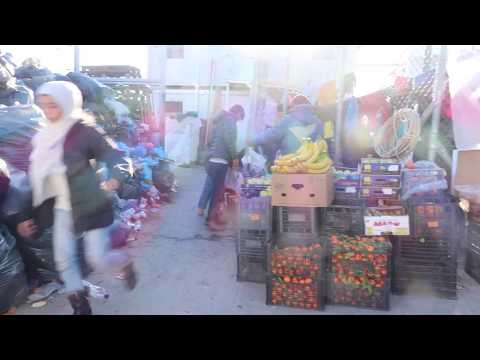

### AYS Daily Digest 28/01/20 — MEPs Confront Croatian Minister Over Border Violence
#### 3 Rescues at Sea in Less than 24 Hours///Video Walkthrough of Moria Shows Unsanitary Conditions///Police Destroy a Squat in Serbia///Police Fire at People on the Move at Hungarian Border/// **higher rates of asylum applications being denied in Italy** & more news

](assets/7b874cff9ce5/0*-GRS2wz6haR_uonM)

MEP Clare Daly holds up a photo of a person beaten by Croatian police\. Source: [GUENGL](https://twitter.com/GUENGL/status/1221825813286395905)

A group of leftist MEPs [confronted](https://www.borderviolence.eu/meps-show-evidence-of-torture-in-the-european-parliament/?fbclid=IwAR3UgAct7aStKaA5w-NgXA67fm_qxTW_JoU5mxeoqcbDh0-P1vAGwQqYWOg) Croatian Minister of Interior Davor Božinović in the European Parliament yesterday over Croatian police violence against people on the move\. They cited the Border Violence Monitoring Network’s yearly violence [report](https://www.borderviolence.eu/new-report-on-cases-of-torture-of-asylum-seekers-by-croatian-authorities-at-eu-external-borders/) , which found that over 80% of pushbacks had some element of violence\.

The MEPs held up pictures showing injured people, some of them children, and read testimonies of people on the move who were hurt by the police\.

> This is evidence of police violence, one of many examples of such occurrences\. And for you to come here and answer the questions by my colleagues, and almost put the blame on the victims by talking about people crossing at unofficial points\. Is it any wonder when they’ve been pushed back from police stations, from official crossings, from Zagreb itself? You’d wonder why they run away, well this is why they do that\. But for you to talk about that and to talk about “economic migrants” — whether you’re an economic migrant or an asylum seeker, nobody deserves to be treated like this… The European Union gave you almost 7 million \[euros\] last year, 300,000 of which is to investigate\. Why haven’t you commissioned independent monitoring? Why haven’t you lived up to your human rights obligations? 

■■■■■■■■■■■■■■ 
> **[Clare Daly](https://twitter.com/ClareDalyMEP) @ Twitter Says:** 

> > "He caught me and was beating me. He put this stick with electric shocks on my neck after I fell down on the floor. I swear he wanted to kill me."

One of many horror stories of Croatian police violence against migrants on EU borders. I asked @[DavorBozinovic](https://twitter.com/DavorBozinovic) to account for it. https://t.co/nYx8gQRQjH 

> **Tweeted at [2020-01-28 08:54:26](https://twitter.com/claredalymep/status/1222080481912590339).** 

■■■■■■■■■■■■■■ 

Božinović responded by dismissing the evidence as fake news and denying that Croatian police uses violence\. He also claimed the victims were all economic migrants, a phrase commonly used by xenophobes to dismiss the experiences of people on the move and to justify denying asylum\.

The confrontation was never going to change the Croatian minister’s mind\. However, more pressure from the EU can force Croatia to at least investigate border violence and hopefully stop it entirely\. It is also important that MEPs are using their powerful platform to share the voices of people most affected by the violent borders of Fortress Europe\.

It is important to note that Croatia is not the only European Union member state that commits violence against people on the move — none of them are innocent\. The governments of Hungary, France, Italy, and countless others should also be forced to face consequences for the violence they perpetrate at their borders\. However, Croatia’s human rights violations have been some of the most egregious and the perpetrators, including high\-ranking government officials that encourage this kind of behavior, need to be brought to justice\.

SEARCH AND RESCUE AT SEA
### Open Arms Foundation Carries Out 3 Rescues in Less Than 24 Hours

The nonprofit [rescued](https://twitter.com/openarms_found/status/1222132781007953922?fbclid=IwAR0QMs-gsrCf8CriMPQ2HRh2HLVnuN4vyUe7cdTqsWZiCxudQgAc4vr4PJg) 102 people at dawn on Tuesday, with 56 people already on board\. Later the same day, they rescued 79 people from an unsafe boat\.

■■■■■■■■■■■■■■ 
> **[Open Arms ENG](https://twitter.com/openarms_found) @ Twitter Says:** 

> > 🔴 #BREAKING 
 3rd rescue in less than 24 hours.
#OpenArms attended a distress call in channel 16 VHF of a possible unsafe drifting boat, about 30 miles from our position.  4h later we rescued 79 people.
Now there are 237 people, some medical case on board.
 #SaveOpenArms https://t.co/86v3wgf1OP 

> **Tweeted at [2020-01-28 16:24:50](https://twitter.com/openarms_found/status/1222193829593473029).** 

■■■■■■■■■■■■■■ 

The work Open Arms does is crucial and life\-saving — this night, as often happens, they were the only rescue ship in their entire region of the Mediterranean\. To help, you can donate [here](https://www.openarms.es/salvaopenarms/es/) \.

In a separate [incident](https://twitter.com/walkingborders/status/1222156054789873666?fbclid=IwAR3sa8By9kK-izUOU-_gLLblGxWKKLuK1bd1r5vpnZ9zjdYxW22u3RnnUoY) , the Moroccan navy rescued 35 people on a patera trying to reach the Canary Islands\.

The journey is not over once the rescued are on board a ship — finding a port to take in people, even those that are sick and need urgent medical attention, is never easy\. The Ocean Viking has [finally](https://twitter.com/MSF_Sea/status/1222096365179867141?fbclid=IwAR3rcVw7AcJN0_1j-mMJREGTF2AAtBa974_oHzvqjZ8it9lvha9YmYU2wH8) been allowed to land in Taranto, Italy, and the Alan Kurdi will be [allowed](https://twitter.com/seaeyeorg/status/1222191352617680896?fbclid=IwAR1hkjci2cGHoKuDd3gE4dPCdbxCLfIrJbkQDeiGdqOT21DvPMZEESJP8o8) to disembark in Malta\. These constant negotiations are inhumane to people on the move, who are stranded on ships for days while xenophobic governments must be convinced to open their ports\. As Sea\-Eye says, “Europe must finally agree on a mechanism which ensures that not every rescue ship is negotiated individually\.”

Overall, the IOM [reports](https://reliefweb.int/report/greece/mediterranean-migrant-arrivals-reach-4432-2020-deaths-reach-68-focus-greece?fbclid=IwAR0gL79mbdkIvi7Y97CfakBrChllFLa4QsX-hyIipP3t7WWB0CUdY11m0ng) that 4,432 people have crossed the sea into Europe in the past four weeks\. Of the 68 people who passed away, 63 died on the Eastern Mediterranean route between Greece and Turkey\. Their deaths are a result of neglect by governments who refuse to rescue ships in distress and deliberate violence by the coast guard, who sometimes ram boats during pushbacks and use other forms of sometimes\-deadly violence\.

GREECE
### Walkthrough of Moria Camp Shows Unsanitary Conditions

Journalist Eric Maddox is collaborating with Are You Syrious for a special series on his podcast, Latitude Adjustment, which will be released soon\. In advance of the podcast release, he published a short video walkthrough of Moria on his Youtube [channel](https://www.youtube.com/watch?v=jQoteX1yE8o&feature=youtu.be&fbclid=IwAR0HX3M_j3329DibnLfTEgI46EoE9YwmZUZr4m7fn0WvuMd8_k903xYvG48) \.

> Note the proximity of food vendors and housing to mountains of rubbish and filthy latrines\. Almost everyone I spoke with has complained of illness and lack of access to basic medical care while the conditions for a public health crisis are all but engineered\. This is \# [MoriaRefugeeCamp](https://www.youtube.com/results?search_query=%23MoriaRefugeeCamp) on [\#Lesvos](https://www.youtube.com/results?search_query=%23Lesvos) \. Moria was a Greek military base converted into a temporary housing facility expanded to accommodate approximately 3,000 people\. Presently more than 19,000 people are forced to live, sleep, eat, and wait for months or years in their own filth\. This includes roughly 1,000 unaccompanied children\. Those fortunate enough to be granted asylum will be taken to the Greek mainland where another set of challenges awaits\. Others will be deported\. There is no question that the European Union can do better\. But instead of providing for the basic humane treatment of people fleeing war and chronic poverty, funds are being spent to militarize [\#borders](https://www.youtube.com/results?search_query=%23borders) and to warehouse people on islands and out of sight, in brutal conditions, as part of a policy of deterrence\. 

You can follow Latitude Adjustment podcast on their [website](https://www.latitudeadjustmentpod.com/) , which also has a previous interview with Are You Syrious\. To find out about the podcast when it is published, keep following Are You Syrious\.

■■■■■■■■■■■■■■ 
> **[OurHouse community](https://twitter.com/ourhouseeu) @ Twitter Says:** 

> > Washing machine services and a free hair cut for #homeless people in #Athens every Saturday from 09:00-14:00 at #Cafe_Patogh ❤️

Our address is

I. Drosopoulou 160A
11256 Athens
Greece 

> **Tweeted at [2020-01-28 12:38:54](https://twitter.com/ourhouseeu/status/1222136968248729603).** 

■■■■■■■■■■■■■■ 

Our House also offers [free English classes](https://twitter.com/ulimuc1/status/1221917504827731969?fbclid=IwAR0WFmCyJyi0gABQzt9KcuslL_wsr_mPdS-F3xRXQle1RkylmPfVaqSbvKo) and a library with Farsi, Kurdish, Arabic, Greek and English books\.

BOSNIA & HERZEGOVINA
### International Organizations In Bosnia & Herzegovina — Aid or Confusion?

Many international organizations, from the IOM to the IRC to even Interpol, are involved with people on the move in Bosnia & Herzegovina\. However, the extent to which they are actually helping people is unclear as their roles are confusing and they often wind up empowering local actors who are xenophobic\.

There was an elaborate public discussion about whether the IOM will continue to support Bosnian border police and in a disputed email the contract was supposed to be terminated by the end of January\. However, it seems as if the collaboration will continue through February or March\. Local authorities claim they need financial support to “fight illegal migration” and spread rhetoric that criminalizes people on the move in order to play up the need for more security\. Not enough international money is going towards providing humanitarian living conditions for people on the move — most of it is being funneled towards border security\. Since Bosnia is seen as a bottleneck on the Balkan route, where people on the move can be stopped before they reach the EU, it is clear where international donors’ priorities will lie\.

The IRC recently [announced](http://ba.n1info.com/Vijesti/a406709/IRC-ce-od-februara-brinuti-o-migrantima-u-USK-koji-nisu-u-prihvatnim-centrima.html?fbclid=IwAR1oTTzTCMzzx0SZJDO4BJh4KlkpAH_L2TilLxu-CmHwOJ799GUeMUx5pFs) that it will begin working in Una Sana Canton, where it had not been active before, with a focus on helping people on the move who are not living in official collection centers\. They will provide humanitarian support as well as accurate information to people on the move\. The premier of the canton, Mustafa Ružnić, warned the IRC in a meeting about the confusion and humanitarian problems his canton has been facing for three years\. He cited lack of coordination and communication between different actors as the biggest problem\. The IRC plans to begin operations in February and is currently focused on building their team\. While there is certainly need for more humanitarian aid in Bosnia, there are already many international organizations active there who sometimes add more to the confusion than they help\.

Interpol was also active in Bosnia recently in an action called Operation Theseus to break up human\-trafficking rings in the Balkans\. 72 suspected traffickers and 167 smugglers were [arrested](https://www.infomigrants.net/en/post/22296/interpol-deals-blow-to-trafficking-and-smuggling-rings-in-balkans?fbclid=IwAR3NmV-Y3fI-N9MG3bqwP8a-rAuRlXt1tQL-y60cdlahT9_J7mMtaWWHwrc) in eight different countries — Albania, Bosnia, Bulgaria, Moldova, North Macedonia, Romania, Serbia and Turkey\. Organized crime groups target especially vulnerable people on the move and often force them into sex work, other forms of labor, or begging once they reach Europe\. Interpol said that all of the survivors they rescued received social service assistance\.

Even with these powerful multinational organizations active in Bosnia, many people on the move are still living in inhumane conditions with no access to legal information or advice\. Redistribution of resources and priorities is needed to actually make a difference\.

SERBIA
### Police Destroy a Squat in The Town of Šid

This information comes from No Name Kitchen Belgrade, who posted about the attack on their Facebook [page](https://www.facebook.com/NoNameKitchenBelgrade/posts/903844243347194) \.

> Saturday morning, when NNK volunteers came to the Squat as part of their daily routine in the town of Šid, police was already present — together with the owner of the property and a bunch of workers who were supposed to cut down bushes surrounding the Squat\. 

> However, some of them — together with police — started to set tents on fire that they found in the bushes, collected people’s belongings on a pile and set it on fire as well, while other workers tried to steal items that they deemed valuable\. When the volunteers tried to put off the fire and prevent the workers from stealing more stuff, things got more violent\. Police pushed and grabbed them, and one of the workers got particularly aggressive and even started hitting them\. Before they finally left, they also destroyed a tire of the NNK van\. 

> From their own car was hanging a black flag with a skull symbol, and one of the workers was wearing a “traditional” looking hat\. Later we found out that he was not a pirate fan with a penchant for Serbian folklore, but a supporter of the far\-right Chetnik movement\. 

CROATIA
### Students Under International Protection Can Apply for State\-Sponsored Scholarships

The Ministry of Science and Education [published](https://mzo.gov.hr/istaknute-teme/natjecaji-196/3146?fbclid=IwAR0vwL4qik4TV99ypKrYs7iqioaExwJyZQcmxBwOOwN3DLDqfqMx5rE2mhY) a call for applicants for 10,000 state scholarships\. Candidates can be Croatian nationals, EU citizens registered as Croatian residents, or who are residents in accordance with the Law on International and Temporary Protection\. AYS volunteers continue providing support to children and young adults who are asylum seekers or under international protection and wish to continue their education\. We encourage all of them to start applying for scholarships and other opportunities now for the 2020/2021 academic year\.

HUNGARY
### Police Fire At People on the Move on Hungarian\-Serbian Border

Hungarian police [fired](https://www.miamiherald.com/news/nation-world/article239707958.html?fbclid=IwAR2bO-pX9wF1jxKNI_C8voxXULevcjPAWoDdu85Fi93VUfiveF--9Qok3O8) “warning shots” at a group of 60–70 people that tried to cross the border from Serbia near the village of Roszke\. The police claimed they only fired after verbal warnings were ignored\. They also cited growing numbers of people attempting to cross the heavily protected border as justification for more violence\.

Several dozen people who were in the group [reported](https://www.reuters.com/article/us-europe-migrants-hungary-border/warning-shots-fired-as-migrants-rush-serbias-border-with-hungary-idUSKBN1ZR0UV?fbclid=IwAR2qi3PgPqgCUAECOwxYwZQZQEiamawcPjt2Hfx5LS-U0ZpZVeshpQ_Jfnc) violent treatment from the Hungarian police, whether from Tuesday morning’s incident or from earlier crossing attempts\. Some had cuts and bruises, while others reported that the police broke their phones\. Clearly, this is not an isolated incident of violence but part of a larger pattern\. This very border crossing was the site of a violent pushback in 2015 that led to Hungary building a barbed wire fence along the border\.

Applying for asylum legally at the Hungarian\-Serbian border was never easy, but now it is nearly impossible after Orban’s increased anti\-immigration actions\.

ITALY
### New Reports on The Situation for People on the Move

The ISPI published a detailed report on the effect of Salvini on people on the move in Italy, which can be found [here](https://www.ispionline.it/it/pubblicazione/migrazioni-italia-tutti-i-numeri-24893?fbclid=IwAR3rcVw7AcJN0_1j-mMJREGTF2AAtBa974_oHzvqjZ8it9lvha9YmYU2wH8) \(in Italian\) \. Despite Salvini’s anti\-immigration rhetoric, the number of people with irregular paperwork actually increased since his tenure\. However, a lot of this increase is due to **higher rates of asylum applications being denied** , not rapidly increasing arrivals\. Since there is no pathway to legal protection in Italy, more and more people have irregular status\. There has been a decrease in asylum applications and people living in official reception centers\. However, despite Salvini’s promises, there has been a decrease in deportations to third countries\.

There has not been a decrease in people on the move present in Italy despite Salvini’s blustering; if anything, there are more people without papers since he took office\. The only thing that’s decreased is safety, security and compassion\.

Another [report](https://refugee-rights.eu/wp-content/uploads/2018/08/RRE_InDangerousTransit.pdf?fbclid=IwAR2pDothsj5fEI4yPmWWVQ2z1TxRzLGakMEaHQHdNePAzShsfjhObE7fbrQ) published by Refugee Rights Europe details the inhumane conditions and violence from French and Italian police people on the move face in Ventimiglia\. Although most of the information was gathered in 2017, it is unfortunately still relevant\.

[This Friday](https://twitter.com/nev_it/status/1222174722420625408?fbclid=IwAR0DoDcCd2pSsCpZTi0XB1YZkxJjNHssWzW9wvym4EF2SWKnyJv6bRLRR1I) , 86 people on the move are expected to arrive in Rome from Lebanon\.

Activists are calling for a national day of struggle on February 1st against the inhumane conditions in CPR centers\. More information can be found [here](https://hurriya.noblogs.org/post/2020/01/28/con-sangue-agli-occhi-lottiamo-contro-cpr/?fbclid=IwAR26dGJl_RT8an5TOlVYI1yeEnmZ12sUb_yVe9EkAewBxRSV_YGCF1spXzw) and we will update as we know more\.

FRANCE
### Mass Evictions in Camps Across France

This morning, the [Porte d’Aubervilliers camp](https://twitter.com/MSF_france/status/1222158127300214785?s=20&fbclid=IwAR1dXbPfy0H4XC7hWoQ29pAhd2jOMRP3vQ51ADWPgmka5ZY3XRG106-taz8) in Paris was destroyed in the 60th eviction since 2015\. Although the government claimed people will be housed in shelters that offer better conditions than the camp, there were not enough buses to take people to the shelters and there is no clear information as to how long people will be allowed to stay there\. Activists are drawing attention to the [suspicious](https://www.facebook.com/Solidarit%C3%A9-migrants-Wilson-598228360377940/?__tn__=kC-R&eid=ARBbKix55OiwY_ddXFaXzX-ZNnnZzY7mj03wlyNTHR1hEz76BdLwslLHnwc0m6hzhvhiDJeA7HEEC-ij&hc_ref=ARRA4oX8wa3RZ4f4YEL9xpxwp_1fIthVbYaMdzLTe0nbIjTfetwixCbKsk7mTYcVMRc&__xts__[0]=68.ARAigM_aNeYtf7F_UMfCj2Ysuz-GFYBrqTjwTr7iXFt1rDgv8NcT2offaTitTnGXRgxv0QhohkiATuUT-8s1H-MbyS8EM6OgqqcHruMj--KPLGbMhWctnEkxg928nBiqTo8brca96WwG1qdD-Qobgk8eSNltOVREfiLh5lGa10vn1Txticwmvo7Ha4-kAQzpZlbe-8Wyx_GhrT2ktInn01pw43VoSoLn8W7GrAmKvv-6ScYJnfNd9zJroTXvlOOMva8kvCInT41YCkd-nRwEwux48jvVLyn1MDWA4dKDh3GrXda1cjFVXIbQjmBwrKXWwId-u0U2phO4kMuBwtXZDG6A8Q) timing of the evictions — in two days there is the yearly “Night of Solidarity,” which is just counting people who are on the street, and this could be a tactic to artificially lower the official numbers of people sleeping on the street\. In Calais, [160 people](https://twitter.com/twentyone_miles/status/1222060228960837632?fbclid=IwAR0jy-Bz5-fBXs5K-dtg16r6rXA05ZH06AY8xRL5XmDb-aCSEN6rb9Ixv48) were evicted this morning as well\.

These actions are not done out of the government’s benevolent concern for people’s living conditions but as an intimidation tactic\.

GERMANY
### Suspicious Statistics in German Asylum System

The organization Equal Rights Beyond Borders [reported](https://www.facebook.com/EqualRightsBB/posts/2727934720655635) that Germany rejected over 70% of family reunification requests from Greece\. However, once appeals are taken to court, 80% of the time the case is won\. Clearly there is some kind of misunderstanding about asylum law, and it is probable that applications are initially rejected even when they are valid to deter further applicants and turn away those who may not have access to a lawyer to appeal\. This is not only illegal but cruel treatment of people who are just trying to be with their families\.

According to the Bavarian Refugee Council, the next [deportation](https://www.facebook.com/Bayerischer.Fluechtlingsrat/posts/2893228890698145?hc_location=ufi) to Afghanistan will probably take place on February 12th\. All Afghan people living in Germany are advised to visit attorneys or counseling centers\.

UNITED KINGDOM
### Migration Advisory Committee Releases a Report Explaining New Immigration System

Post\-Brexit, the UK is [switching](https://migrationobservatory.ox.ac.uk/resources/commentaries/qa-migration-advisory-committee-report-on-post-brexit-salary-thresholds-and-the-australian-style-points-based-system/?fbclid=IwAR106GBWHgoz46aC9GnX5BfWAY6C3vvIF2WEJH0PY_2i4NW_f3RSoy7ivms) to an immigration system that uses salary thresholds and a points\-based visa determination system, similar to the Australian one\. Under this new system, most workers must earn at least 25,600 pounds per year to qualify for a long\-term visa, with exceptions for public service employees like teachers and nurses\. Low\-wage workers like cleaners are ineligible for visas because they “do not pass the skills threshold\.”

While disappointing, this is not surprising coming from a government so hostile to immigration it ended family reunification for children who are refugees\.

**Find daily updates and special reports on our [Medium page](https://medium.com/are-you-syrious) \.**

**If you wish to contribute, either by writing a report or a story, or by joining the info gathering team, please let us know\.**

**We strive to echo correct news from the ground through collaboration and fairness\. Every effort has been made to credit organisations and individuals with regard to the supply of information, video, and photo material \(in cases where the source wanted to be accredited\) \. Please notify us regarding corrections\.**

**If there’s anything you want to share or comment, contact us through Facebook, Twitter or write to: areyousyrious@gmail\.com**

_Converted [Medium Post](https://medium.com/are-you-syrious/ays-daily-digest-28-01-2020-meps-confront-croatian-minister-over-border-violence-7b874cff9ce5) by [ZMediumToMarkdown](https://github.com/ZhgChgLi/ZMediumToMarkdown)._
