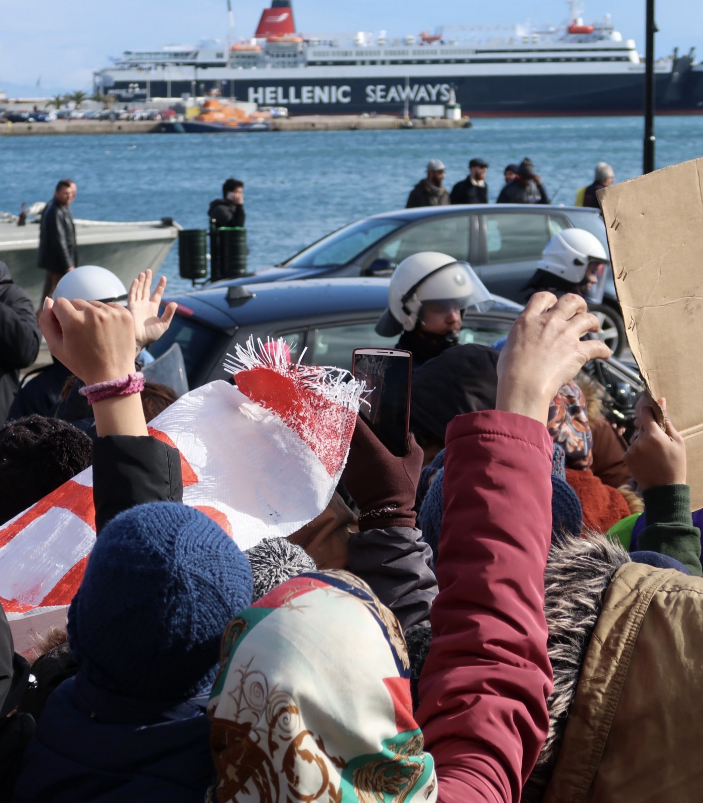
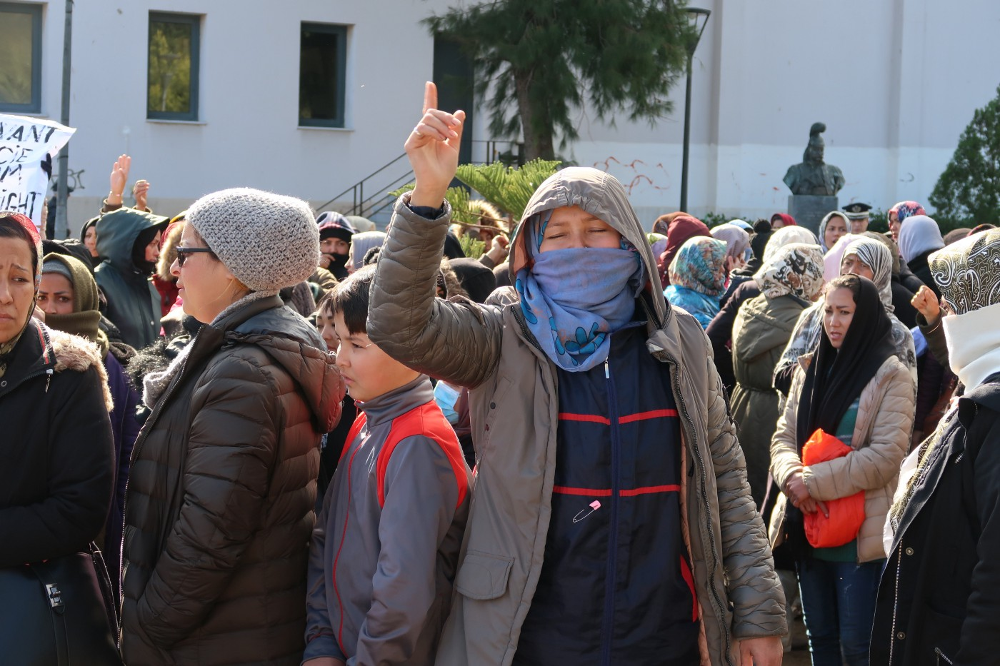
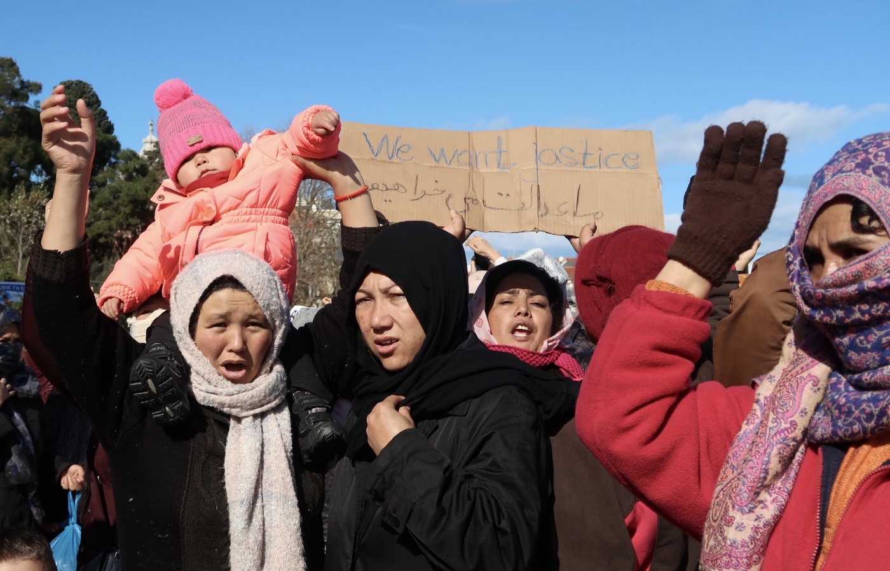

### **AYS Daily Digest 30/01/20: “Moria is hell” Women take to the streets in Lesvos**
#### 17 people stranded in the Mediterranean // 10 killed in Syria hospital bombing // Italian Secret Service Exposed // Plans for New Refugee Center in Belgium // & more news

 \)](assets/b70e7d5bbeac/1*b4AM2IUZJPO9dnv9tapaHg.jpeg)

Women’s protest in Lesvos \(Photo: [Latitude Podcast](https://www.latitudeadjustmentpod.com/) \)
#### **GREECE**

Around 300 women participated in a protest against the conditions of the Moria Refugee camp on Thursday\. In the town center, signs reading “Moria is Hell” flew in the air as women chanted and asked, “Aren’t we human too?”

Their demands include being transferred out of the Moria hotspot and improving safety for women inside the camp\. Moria was originally built with a capacity to _temporarily_ hold 2,000 people, yet is now currently inhabited by more than 19,500\.

](assets/b70e7d5bbeac/1*jqZjO2Oeq9k5eC1FkjJfAg.jpeg)

Photos: [Latitude Podcast](https://www.latitudeadjustmentpod.com/)

> The women I spoke to wanted to highlight that they feel unsafe in the camp and often face harassment when they go to use the toilet facilities \(which are filthy and often far away in the dark\) \. There is no meaningful medical care for pregnant women, no showers, the camp is unsafe, and many wait months or longer for any update on the status of their asylum applications\. 

](assets/b70e7d5bbeac/1*R5P1wna_kwwbUIhAljpNjQ.jpeg)

Photo: [Latitude Podcast](https://www.latitudeadjustmentpod.com/)

> If they complain then they face threats of deportation\. They say that three Afghans were deported to Turkey just yesterday\. Conditions in the camp are cold, dirty, and unsafe, with no electricity or heat other than burning what they can in primitive fires to keep warm which often produces toxic smoke leading to more health conditions for them and their families, with poor access to substandard healthcare\. — _Eric Maddox documents in [Latitude Podcast reports](https://www.latitudeadjustmentpod.com/)_ 

> The women I spoke to said they organized this march because if the men organized it, it would be stopped by the police\. 

In the coming weeks, follow his podcast for more insights into the lives and thoughts of people in Moria and on Lesvos\.

](assets/b70e7d5bbeac/1*Ia5B5mVgn3Qq_t6aa8CwKA.jpeg)

Photo: [Latitude Podcast](https://www.latitudeadjustmentpod.com/)

Following Tuesday’s news that two Afghani boys were stabbed in Moria, the suspected perpetrator has been caught by police, according to local reports\. Unfortunately, the 15\-year\-old victim remains in critical condition\. Since January last year at least 30 people have been injured in brawls in and around the camp\. According to the ANA\-MPA news agency, two have died from their injuries\. As the asylum process continues to slow, and arrivals continue to increase, conditions are dramatically worsening, leading many to lose hope\. MSF medical officer, Apostolos Veizi, told _InfoMigrants French,_ “These acts of violence do not respond to any logic, to any common sense\. In Moria, life itself no longer has any meaning\. People lose all dignity\.”
#### **SYRIA**

Some 700,000 Syrians have fled towards the Turkish border over the last three days as airstrikes have intensified in the northwestern region\. Warplanes, believed to be from Russia, struck Idlib and the surrounding areas more than 200 times — mainly harming civilians\. On Thursday, the strikes became more deadly, hitting a hospital and bakery in a local residential area\. The White Helmets and Britain\-based Syrian Observatory for Human Rights reported the airstrikes killed 10 people and wounded at least 24, including a doctor, a White Helmet’s volunteer, three women and two children\. The Ariha hospital, also known as al\-Shami, is the only medical facility in the area with surgical facilities\. There are no government\-run hospitals in these opposition\-held areas, so health and education services rely solely on donations and international aid\. Hospital Director Waguih Qarat said the hospital’s coordinates have been shared with the U\.N\., the Syrian government and Russia for the last three years, however the attacks continue\. Targeting hospitals and health facilities is illegal under international law, yet such actions have been systematic practice for the regime and its allies throughout the war\. Physicians for Human Rights have recorded over 530 attacks on health facilities by Syrian and Russian forces as well as more than 900 deaths of medical professionals, over 90 percent of which can be attributed to the government\.
#### **SEARCH AND RESCUE AT SEA**

Alarm Phone received a call for help today from 17 people stranded in the Mediterranean near Malta\.

Concerns are growing over Turkey’s apparent involvement with the so\-called Libyan Coast Guard in the Mediterranean\. Following yesterday’s reports regarding the rescue of 30 people and their return to Tripoli, Sea Watch is accusing Turkey of committing human rights violations\. Their message posted 29/01 states, “The crew of the Moonbird recorded yesterday how a Turkish frigate intercepted 30 people and handed them over to the so\-called Libyan Coastguard\. Turkey is a signatory to the European Human Rights Convention, but with this action it has taken part in a severe breach of human rights\.” Turkey denies these accusations and its English\-language newspaper the _Hurriyet_ has referred to their actions as “providing aid and medical support\.”

French president, Emanuel Macron, has also taken issue with Turkey’s actions in the Mediterranean\. On January 29th, Macron accused Turkey of “sending warships and mercenaries to \[Libya\]” and described the arrival of Turkish warships in Libyan waters as “a serious and explicit infringement of what was agreed upon in Berlin\.”
#### GREECE
### Floating barrier wall in the Mediterranean

A heated debate has begun about the Greek Defense Ministry’s call for a floating barrier wall in the Mediterranean\. Greece’s former Migration Minister, Dimitris Vitsas, described the barrier as a “stupid idea” that was bound to be ineffective\. “The idea that a fence of this length is going to work is totally stupid,” he said\. “It’s not going to stop anybody making the journey\.”

Amnesty International has also called out the idea but highlights the risk to asylum seekers and refugees, noting that the wall will only put lives in further danger\. In a statement on their website, Amnesty says, “This proposal marks an alarming escalation in the Greek government’s ongoing efforts to make it as difficult as possible for asylum\-seekers and refugees to arrive on its shores and will lead to more danger for those desperately seeking safety\.” [Read More Here\.](https://www.theguardian.com/world/2020/jan/30/greece-plans-to-build-sea-barrier-off-lesbos-to-deter-migrants?fbclid=IwAR02rN6a_2X050yI3RAsSjiBeNNyutUUNj00BCK7klqAlhJnnFozfQWwV7A)
#### ITALY

A bombshell report by Foreign Policy uncovered covert attempts by the Italian Secret Service to halt migration by working with Libyan tribes from the southern edge of the Sahara Desert\. The Italian Secret Service, masquerading as a humanitarian nongovernmental organization — summoned to Rome two dozen delegates from the Tuareg, the Tebu, and the Awlad Suleiman militia tribes under the guise of peace\-related talks for the war\-torn country\. In reality, the meetings focused heavily on Italian motivations to curb migration\. One speaker, an apparent representative of the Government was quoted saying, delegates should “deal with the issue of immigration and terrorism through border control mechanisms based on the optimization of reception centers that already exist in your countries\. For each of these centers, Italy and the European Union would pay a stipend to 50 security officials and 50 assistants\.” The towns that agreed to host this infrastructure would also be gifted with local development initiatives\. [For more read the FP article here\.](https://foreignpolicy.com/2020/01/29/italy-failed-migration-fix-capitano-ultimo-gentiloni-mogherini-chaos-libya/)
#### **BELGIUM**

A new plan to open a center for refugees and migrants in the municipality of Blegny was discussed Thursday\. The project would begin on February 3rd and run through March 31st\. The center would be in the former presbytery of the church of Barchon\. Reception will take place during the day, Monday to Friday from 8:30 a\.m\. to 4:30 p\.m\. The building can accommodate up to 24 people\. It is made up of 6 bedrooms, a bathroom, a kitchen and a large room for resting, playing\. The goal, “is to allow migrants to take a little rest and find a little bit of calm in a life that is very complicated for them\.” Citizens like, Delphine Verstraelen, welcome the initiative of this reception center\. Many have been engaged in helping migrants while calling for the creation of a proper structure for months\. According to them, this project will benefit both residents and migrants\. [Read More\.](https://www.rtbf.be/info/regions/liege/detail_barchon-ouverture-d-un-centre-d-accueil-de-jour-pour-transmigrants?id=10419675&utm_source=rtbfinfo&utm_campaign=social_share&utm_medium=fb_share)
### Justice for Mawda

In other news, the police officer responsible for shooting 2 year old Mawda has finally been charged\. On May 17th, 2018 a police officer accidentally shot and killed Mawda in a street chase on the E42\. December 18th, he was finally charged\. The Public Prosecutor of Mons Ignacio de la Serna said on Wednesday morning, “ _the police officer was charged with the count of manslaughter, article 418 of the penal code, that is to say that he is accused of having unintentionally caused the death of little Mawda_ \.” The investigating judge apparently waited for the reconstitution and the ballistic reports before deciding on this indictment which took according to reports an “abnormally” long time\. \#Justice4mawda is collecting support for the payment of lawyer fees at this [link](https://www.leetchi.com/c/justicepourmawda) \.
#### **MOROCCO**

](assets/b70e7d5bbeac/1*3q-nMCd1q2ng13LloXyCTA.jpeg)

[Association Marocaine des Droits Humains — Section Nador](https://www.facebook.com/AmdhNador/?tn-str=k%2AF&hc_location=group_dialog)

The organization, Amdh Nador or the Association Marocaine des Droits Humains in French was warned that sub\-Saharan migrants imprisoned in the Nador prison would be releases around noon on Thursday the 29th\. This comes after demands by the organization to close the center after reports of the illegal detention of migrants and serious rights violations\. However, a subsequent status update around 3pm yesterday noted that “so far no migrants have been released from the prison\. The judicial authorities say they are waiting to receive the list of migrants who will be released\.”
#### **FRANCE**

In French Guiana, conditions worsen for asylum seekers in downtown Cayenne\. With no access to state services, young children and families are forced to sleep outside on the ground\. While some have been able to take shelter in makeshift tents, they are very weak against the seaside winds and rains\. Faced with this unbearable situation, citizens have organized to ensure the distribution of meals, temporary accommodation for the most vulnerable and improvement of camp conditions\. Several of our organizations have taken turns to provide information on the asylum procedure as well as assistance in the implementation of their administrative and social procedures state the report’s signatories\. However, the question remains, “what is the state doing?” The local prefecture has systematically blamed limitations on resources in order to justify its lack of response\. However, the organizations note, since 2015, it has refused to work on a framework document supposed to organize the accommodation of asylum seekers\. The situation is exacerbating living conditions, endangering the vulnerable, and increasing social tensions\. “It is shameful that a country like France is not able to respect the dignity of sixty people who have come to ask for our protection\.” — The League for Human Rights, La Cimade, Doctor of the World, RESF Guyane\.
#### **DENMARK**

Authorities have lost track of more than 700 foreigners previously staying in Sjælsmark Exit Center in Hørsholm\. From Feb 15th, 2015 — December 1st 2019 there were reportedly 2,622 people accommodated at the center\. Since then, 1,322 have either been voluntarily or forcibly removed from Denmark and 79 have been granted residence permits\. The remaining 773 foreigners are no longer housed in the accommodation system and yet the authorities have no knowledge of where they are staying\. [Read More\.](https://www.dr.dk/nyheder/indland/773-udlaendinge-fra-sjaelsmark-er-forsvundet-fra-myndighederne?fbclid=IwAR1DjagWoKMwfmglXJHWAlC6mhipdiwy3KHybdaEVN3Y5rKUA8by_LDdOz8)
#### **EU**

The Luxembourg\-based European Court of Auditors \(ECA\) is set to audit the EU’s border and coast guard agency Frontex\. It will publish its findings next year\. “Our audit will ascertain whether it is carrying out its tasks effectively,” said Leo Brincat, the ECA member responsible in a statement\. Along with expanded powers, Frontex has been slated an €11bn budget for the 2021–2027\.

**Find daily updates and special reports on our [Medium page](https://medium.com/are-you-syrious) \.**

**If you wish to contribute, either by writing a report or a story, or by joining the info gathering team, please let us know\.**

**We strive to echo correct news from the ground through collaboration and fairness\. Every effort has been made to credit organisations and individuals with regard to the supply of information, video, and photo material \(in cases where the source wanted to be accredited\) \. Please notify us regarding corrections\.**

**If there’s anything you want to share or comment, contact us through Facebook, Twitter or write to: areyousyrious@gmail\.com**

_Converted [Medium Post](https://medium.com/are-you-syrious/ays-daily-digest-30-01-20-moria-is-hell-women-take-to-the-streets-in-lesvos-b70e7d5bbeac) by [ZMediumToMarkdown](https://github.com/ZhgChgLi/ZMediumToMarkdown)._
