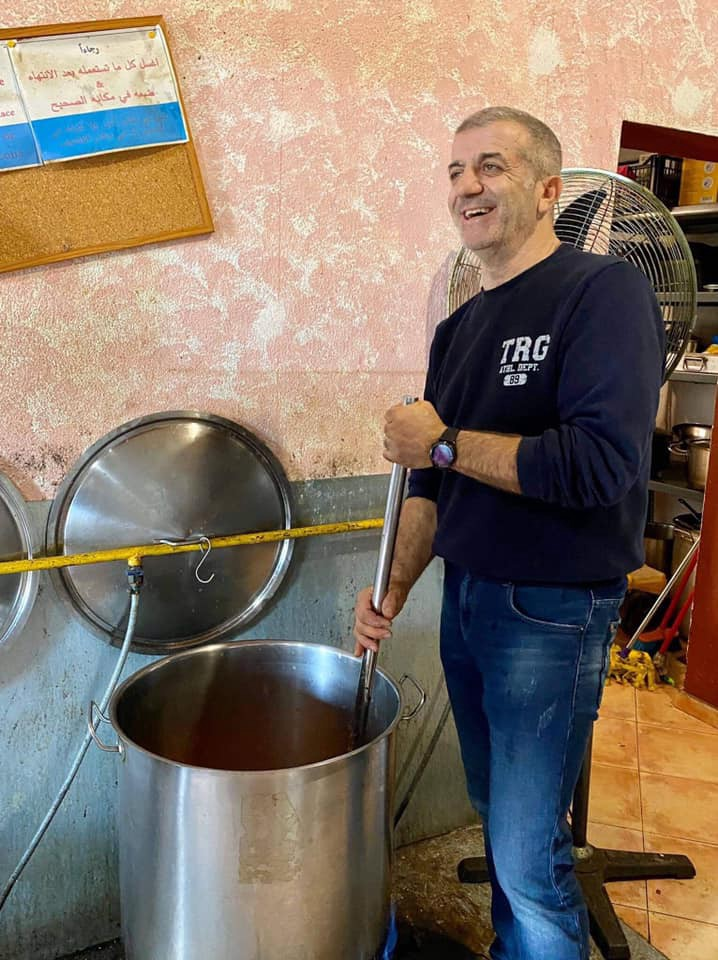
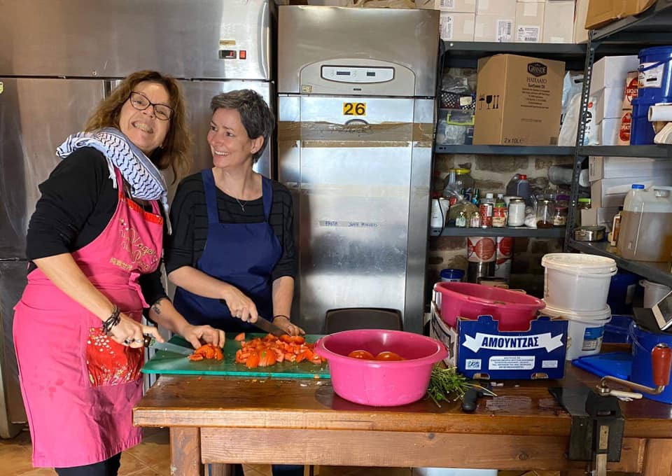
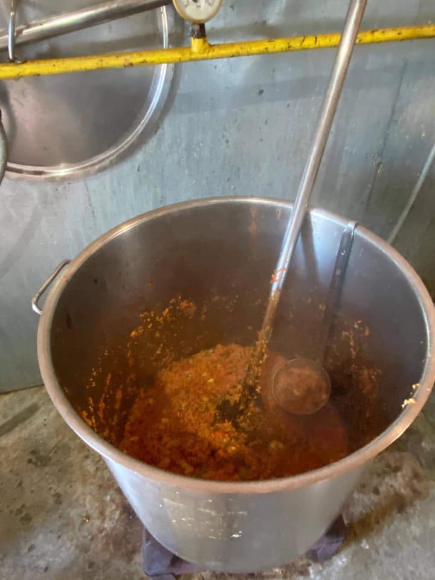

### AYS Daily Digest 31/1/2020 —Privatisation and commercialisation: the Italian reception system

Children traumatised in Libya /// Report on illegal detention in Moria /// 1500 days of hot food and good vibes thanks to Chios People’s Kitchen /// ECHR study of safe third country case law

 
[\#noborders](https://www.facebook.com/hashtag/noborders?epa=HASHTAG) [\#openEUborders](https://www.facebook.com/hashtag/openeuborders?epa=HASHTAG)](assets/38e4a1cb30ec/1*mbdcTVv-tOqqZyXkbIigVw.jpeg)

Paris, France 28 January 2020
Evacuation of a makeshift refugee camp near La Porte d’Aubervilliers in Paris\.
Photograph by Gonzalo Fuentes via [Art Against](https://www.facebook.com/artagainstproject/photos/a.704384742944296/2706454649403952/?type=3&theater) 
[\#noborders](https://www.facebook.com/hashtag/noborders?epa=HASHTAG) [\#openEUborders](https://www.facebook.com/hashtag/openeuborders?epa=HASHTAG)
#### Feature — Privatisation and commercialisation: the Italian reception system

After having won the bid for the management of the newly opened CPR in Macomer, Sardinia, in 2019, ORS Italia is now [in charge](https://www.avvenire.it/attualita/pagine/immigrazione-nel-business-dell-accoglienza-ai-migranti-sbarca-in-italia-una-multinazionale-svizzera?fbclid=IwAR3wCB7zRm2mbf-JgjUde2-zO8-xuzBOvp4PV3JzygdpOfAkpF0klNFVT4U) of the reception centre Malala, in Trieste, northeastern Italy\.

ORS Italia is the Italian branch of the Swiss company ORS, which has been active in the management of centres for migrants and refugees in Switzerland, Austria and Germany since 1992\. Born out of Adecco, the multinational job agency, and controlled by Barclays bank and other global financial services, ORS well represents the change towards business\-minded cost efficiency in the running of the “reception business”\. Instead of awarding such tasks to charities and non\-profit organisations, more and more private companies have won public bids, proposing significant reductions in running costs\. Nonetheless, these companies, by law, need to make money out of such activities, further reducing the budget spent on the actual services\.

ORS won the most recent bid, offering a 14% reduction on the budget plan presented by public authorities\. In Macomer, the opening of the CPR went hand in hand with the reduction of public services in the area\. At the end of January, the local Council [cut public transport](https://www.unionesarda.it/articolo/news-sardegna/nuoro-provincia/2020/01/29/macomer-il-cpr-isolato-dalla-citta-sospesi-i-trasporti-136-980883.html) to the neighbourhood where the CPR is located, in an attempt to hinder documentation of what happens within its walls and outside support for the people trapped there\.

In 2015, ORS was harshly [criticised](https://www.lasciatecientrare.it/sullapertura-del-cpr-in-sardegna-macomer/?fbclid=IwAR2HKaGu_ZoFlcd0n2sFLnToJ2OcmwdjBAwIMfQ6JgqsWy6dV7u6--Q4tRI) for the living conditions in the Traiskirchen refugee centre, not far from Vienna\. Built with a capacity of 1,800, it hosted up to [4,600 people](https://valori.it/migranti-bandi-trieste-ors/) \.

> The overcrowding meant that 2,200 women, children and men were forced to sleep in the open, weathering rainstorms and heat waves without mattresses, blankets, or any kind of shelter\. Hygiene conditions were horrendous\. Food, too, was short, refugees said\. _\( [media outlet](https://eu.usatoday.com/story/news/world/2015/10/12/austria-migrants-global-post/73806236/) , 2015\)_ 

As several reception and detention centres throughout Italy show, non profit is not equal to humane and dignified treatment, but the privatisation and commercialisation of the reception and detention of people on the move is a global phenomenon, ushered in by the precise choices of government and public authorities\. In Italy, Salvini’s security laws allowed for the cutting of allowances, [deregulation](https://valori.it/il-deja-vu-della-gestione-migranti-il-nuovo-decreto-e-una-pacchia-per-i-big/) in bidding mechanisms and for the possibility of offering the management of centres without public notice\. In the last few years these changes have favoured large profit and non\-profit entities, such as Badia Grande, Edeco, La Cascina Global Service \(involved in a criminal investigation about “Mafia Capitale”\) and the French Gepsa, a leader in the management of prisons and detention centres in France, and instead made it almost impossible for small co\-operatives and organisations, with proven and positive experience in the now defunct SPRAR system, to win such bids\.

LIBYA
#### **Children traumatised in Libya**

[Infomigrants reports](https://www.infomigrants.net/en/post/22470/among-migrants-rescued-by-ocean-viking-traumatized-teens-and-motherless-children?fbclid=IwAR14L9ykvhSIHfLgo7GzzKLSiFS5do_QuS4sIosDydpIhedJW_PxLfqkEwQ) that 149 of the people recently disembarked from the Ocean Viking in Italy were children\.

> Many of them experienced terrible things on their migration journeys, in particular in Libya, they told aid workers\. 

A total of 132 of these children were without their families\.

> According to Save the Children, two young girls — aged only 4 and 6 — aboard the Ocean Viking were traveling only with their 17\-year\-old sister, because their mother had been lost without a trace in Libya\. And a 16\-year\-old Somali girl told aid workers that she had been repeatedly raped in Libyan detention centers, where “young women are subjected to repeated torture and rape\.” Several young migrants reportedly showed symptoms of tuberculosis\. 

Due to the high number of people disembarked the Italian interior ministry is working with Germany, France, Romania, Ireland, and Luxembourg to redistribute them, hopefully to places were they feel safe and can take time to heal\.

GREECE
#### **Arrivals**

In the last two days seven boats have arrived on Lesvos, carrying 282 people\. For more info and a breakdown of arrival visit the [Aegean Boat Report](https://www.facebook.com/AegeanBoatReport/photos/a.285312485325196/760552614467845?hc_location=ufi) \.
#### **Moria — Locked Up Without Rights**

HIAS have produced a new and important [report](https://www.hias.org/sites/default/files/report_on_low_profile_detention_in_greece_hias_dec_2019.pdf#) on illegal detention practices within Moria\. It has long been known that people, especially young men, from countries with low acceptance rates are often detained in a central area within Moria, denied access to legal help or asylum pathways and deported to Turkey as soon as possible \(which often takes quite a long time\) \.

> HIAS has concluded that the detention of asylum seekers under the so\-called “low profile detention scheme” constitutes arbitrary detention for the purposes of Article 9 of the International Covenant on Civil and Political Rights\. 

Which means it is illegal under both International and Greek Law\.
#### **Stage 2 Transit Facility to Close**

[Lighthouse Relief report](https://www.facebook.com/lighthouserelief/posts/2677991522323372?hc_location=ufi) have received notification that Stage 2 Transit Facility in Skala Sikamineas will be closing at midnight tonight \(31\.01\.20\) \.

> We are extremely concerned and saddened by the impact of this decision\. For years, volunteers in Stage 2 have provided a warm and dignified welcome to people arriving — the facility has been a place of respite, where they can receive vital medical aid, shelter, dry clothes, hot tea and food before they are taken to Moria Camp\. Without this facility, new arrivals will be left vulnerable on arrival, stranded on the beach or in remote locations, without access to shelter and medical aid\. 

Learn more about their work and how to help [HERE](https://www.facebook.com/lighthouserelief/posts/2677991522323372?hc_location=ufi) \.
#### **Chios — 1500 days of hot food and good vibes**

After over four years of operation they are still distributing both hot meals and dry food packs to refugees trapped on Chios\.

 \)](assets/38e4a1cb30ec/1*R3aY8j8XYHBMG0rr7CnjZA.jpeg)

\(Photo Credit: [Chios People’s Kitchen](https://www.facebook.com/chiospeopleskitchen/?__tn__=kCH-R&eid=ARCSXpwKtwTG-1HKbhZT8WyiWMkVS26R9X62X2GWF0VweO3krr3gE9qxFVYxgcWZNriZgB6bdsG6ZQvl&hc_ref=ARQCp4Dh7ft3M3eTbvKYNVlQ4j9Ou5jruXHTMqYAdeiATZWK_p3sOyFJOuWpEJ_evew&fref=nf&__xts__[0]=68.ARD7fd7Ok19Uuq63G8731o8_rbc3h0-SipXJmNrMvZpfBqIkpBCL013xqmhV7xFN-FcV6Rk4tNOh5CTU36kEC0_Fn4TaQ9OXMSzOQBbnODOyGgFNSDuKJiK51FyzaskwKKdcsp_yA9Uvub5x7HQ6NL-q6zXMibHSM_97POB8_R5TZyBZOQFrFzkK5lGibw7cuA92dENyqfH2m24xZ7YqhDoKeWh37T-xK1y_yWCNXo0GYVGoUiALI-BOJveFSwlfWo-ixww0oQZSKDBLBZ7OA163DNLaQ86sM6egn1Ke0nWljJixYgyutDRoR-ZiZISFs57yuKLkmDBO0SVQvA) \)

Many people are forced to live in appalling conditions in Vial hotspot\.

To help Chios People’s Kitchen continue support them [HERE](https://donorbox.org/pomegranateaid?fbclid=IwAR2zc67mZoQ0DhgjQWceSxEyNNBtp7WIPsmEDeASxGeMlj6UZVqMw9fZZcI) \.

EU
#### **The concept of a “safe third country” in the case\-law of the Court**

The European Court of Human Rights has published a [study](https://www.echr.coe.int/Documents/Research_report_safe_third_country_ENG.pdf) summarising the case law relating to articles 2, 3, 8 and13, noting in the conclusion that:

> The deporting State cannot simply rely on its own definition of the third country as safe, and it has a general procedural obligation to carry out a fair and thorough examination of the conditions in that third country\. 

And further to this, although the burden of proof remains with the applicant, the state often has clear responsibilities to assess the risk in individual cases\.

> \(1\) the starting point is that it is on the applicant; \(2\) if there is a well\-known general risk in the third country, the authorities have the duty to carry out an assessment on their own motion; \(3\) concerning the individual risk, it remains on the applicant, but if the deporting State is made aware of relevant facts relating specifically to him/her, its authorities have to carry out an assessment on their own motion, especially if the applicant risks an ill\-treatment because of his/her membership in a persecuted group\. 
 

>  
 

> Finally, the authorities have the obligation to provide the applicant with the necessary information in order to be able to challenge the definition of a third country as “safe”\. 

**Find daily updates and special reports on our [Medium page](https://medium.com/are-you-syrious) \.**

**If you wish to contribute, either by writing a report or a story, or by joining the info gathering team, please let us know\.**

**We strive to echo correct news from the ground through collaboration and fairness\. Every effort has been made to credit organisations and individuals with regard to the supply of information, video, and photo material \(in cases where the source wanted to be accredited\) \. Please notify us regarding corrections\.**

**If there’s anything you want to share or comment, contact us through Facebook, Twitter or write to: areyousyrious@gmail\.com**

_Converted [Medium Post](https://medium.com/are-you-syrious/ays-daily-digest-31-1-2020-38e4a1cb30ec) by [ZMediumToMarkdown](https://github.com/ZhgChgLi/ZMediumToMarkdown)._
