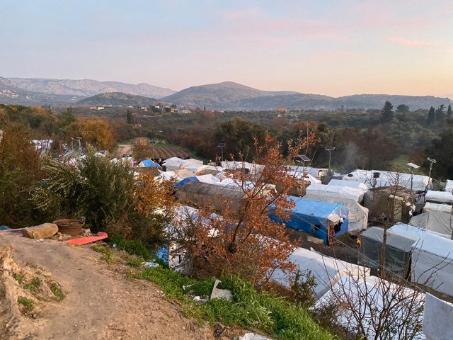
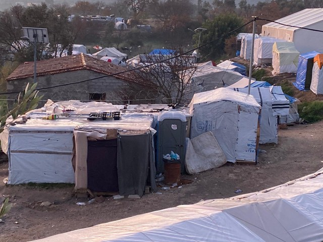
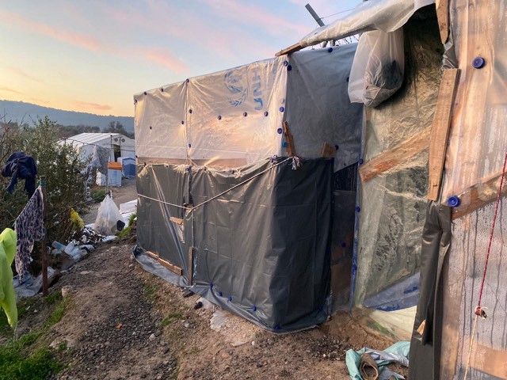
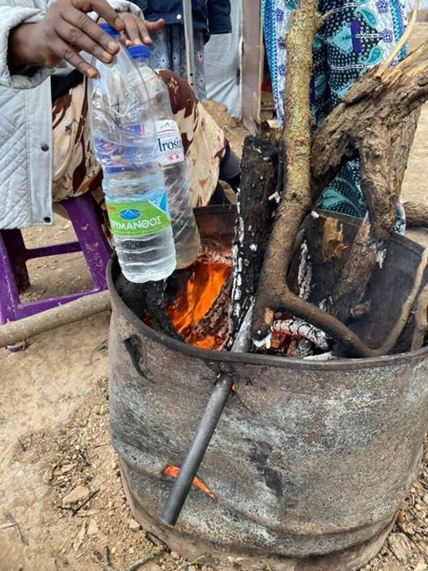
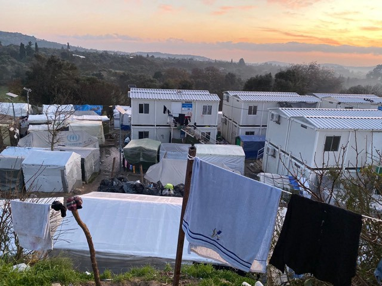
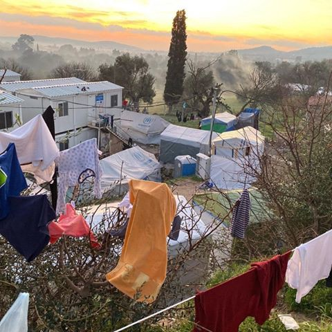
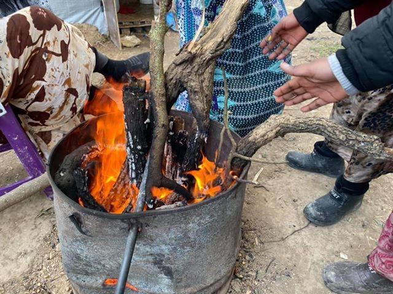

### AYS Special from Chios: What is life really like in a Greek Refugee Camp?
#### We were provided with this account from an anonymous single female residing in Vial Camp, Chios, to highlight the daily struggles faced by many living in camps in the EU Member States through a simple story of a single day and night in the camp Vial\. Please, take the time to read and to understand\.

> As I didn’t have a place to stay a family from Afghanistan kindly offered me space in their makeshift shelter for the night\. It was small, made of wood and plastic sheets and they said they had constructed it themselves which I thought was resourceful and clever\. 

Due to cultural reasons, the father and a teenage boy of the family stayed with some other male residents of the camp, so she stayed with the mother and daughter\. “However, I am aware that all the tents, containers and make\-shift shelters in the camp are cramped to the maximum which means that many people do not have this luxury or privacy of gender\-segregated sleeping quarters and most have to share with complete strangers\. Every nook and cranny of the camp is taken over and there is even with people who’s the only roof over their heads is a plastic sheet of tarpaulin secured down by stones\.”

All photos: Ruhi Loren Akhtar

I was shocked\. No one can fully tell from outside the devastating conditions that are inside\. Temperatures are as low as 3 Degrees Celsius at night\.

> The wind is biting, and the camp is situated on top of a hill making living conditions harsh and when there are rainstorms it is a mud bath\. 

this is the place she was welcomed in, a ‘home’ of a family with children

I was lucky that the shelter I was staying in had managed to wire electricity from elsewhere so there was a fan heater running all night\. It was warm enough for me to be able to fall asleep, but I woke up at 4 or 5 in the morning and drifted in and out of sleep feeling freezing and unable to sleep any further\. I don’t know how people manage with the cold in other areas of camp and I know there are similar shelters and tents with no electricity at all, she says\. Each person had two thin blankets and the ground was bumpy and hard\.

> A very small, thin ‘pillow’ was given to me, so I rolled up my jacket to try and make it into a pillow\. I know the family had gone above and beyond and given me everything they possibly could have with what little they had to make me comfortable and for this I was grateful\. 

I was a little wary when trying to get to this shelter because the terrain was poor and the ledge not wide enough\. At least there was no rain or mud today because then I really would have been scared in case I fell as this area was high up looking onto a lower section of the camp underneath\. The shelter was basic but cozy in its own sense\. The family made me feel welcome and protected and at the moment, that was all that mattered\. The mother of the household even came to the toilet with me although I could have gone alone\. It was a bit of walk through tight spaces, up and down pallets and wading through water from broken water supplies, containers, and shelters to get there\.

She even put a water bottle next to a heater to warm up and bought me a towel in the morning so I could wash my face\. The conditions of the toilets are the worst\. I was a little bewildered when I got there because there were no lights and I couldn’t see clearly\. There were feces everywhere and the smell was vile\. The water and flushing systems do not always work\. I guess for this reason and people are so desperate they went outside the actual cubicles and I know many people will go to the toilet in the surrounding jungle\. What else can they do?

Everyone has the right to basic toileting and sanitation facilities, and even that is not provided here\. I was a little freaked out that I somehow nearly went into a cubicle \(none have locks\) where someone else was in and I said sorry over and over as she shouted at me angry and as gross as this sounds I actually stepped in feces outside the cubicle in my confusion\. It's not my finest moment in life but this is the reality\. The toilets didn’t have bins and only one had a bin liner so there isn’t anywhere to put tissue or sanitary towels\.

> I dread to think how anyone copes with this every day and especially if they are ill, pregnant or were on their period\. 

At night I woke up around 3 am because I could hear a fight happening\. It seemed like it was right next to my shelter as the ground and walls seemed to be shaking but when I checked in the morning it would have been a little further and behind the containers\. I took this video so I could show you what it was like\. The voices and shouting were much louder and scarier than you can hear in the video, but it is some indication\. I was a bit scared\. I didn’t know if the fight would escalate and my safety would be threatened\. There are no locks on doors and the shelters provide no protection\. I was happy when the conflict subsided, and I could go back to sleep\.

This camp violates human rights and people are made to stay in conditions that no living being should ever have to encounter added with the lengthy and unpredictable asylum process I can understand how tensions are high, meaning \- little things soon erupt into a war\.

> I wouldn’t like to think about how people who already came from the countries of war and conflict and may have post\-traumatic stress disorder may feel when they hear these noises at night, and what about the children? 

If I was scared, they must be petrified\. Although the sound is not too clear, when I replayed the video, I noticed that at times I was breathing heavy and even gasped and this was because I was frightened\- you may hear this\. In the morning I went to stand in line with a food card\. It was like a cage with metal barriers on either side and there were Greek workers and police\. I stood in the female line for 1 hour 40 minutes which I was told is a short duration compared to other times\. Some people can stand for many hours\. We went at 7\.40 am but others had gone much earlier\. The line was already long when I got there\. It was cold and for the first 30 minutes, it seemed like the line was not moving\. I was a little frustrated as other people pushed in front of me, but I didn’t want to say anything\. Everyone is in a desperate situation\. I can see why and when people stay in lines like this all the time it soon can manifest in a negative way and I have often heard of fights happening in food, aid and asylum service lines\. Once our food card bar code was scanned into the system, we went to the line for water\.

> The Greek worker seemed to be shouting at people and instead of handing bottles of water he was literally throwing the heavy bottles and it almost fell on my foot\. We also weren’t given enough water as was written on our food card quota\. 

When I asked ‘mother’ who was still with me, she said she thought it was because there was a shortage of water and they were cutting down\. Which makes me wonder where is all the money that was given to the authorities to provide basic supplies to all in camp? Whilst waiting for and receiving the water children darted in and out trying to take cardboard sheets and boxes from whatever packaging they could\. They use this for their tents and shelters\. The food we received was dried nuts and some flatbread\. It is not substantial enough and will not provide us with much to fuel our bodies and not in these conditions\.

Despite everything, there is a sense of community in Vial camp\. People are nice and welcoming\. I was invited for dinner the previous evening \(Kabuli Pilau\) and in the morning the same group of brothers made me ‘Dhood Patti’ which is spicy\-sweet tea and fed me their own breakfast which was cake bars they bought from the store\. They asked me if I wanted them to make eggs for me and I said no\. Surprisingly although they lived in a container and had a heater it seemed colder in the container at 8 am in the morning compared to the shelter I stayed in and I wrapped a blanket around me\.

About the family who gave me shelter: The father of the family is a doctor and the mother, a teacher from Afghanistan\. I will never forget their kindness and hospitality\. The teenage boy has Harry Potter style glasses and spoke good English and the girl speaks some English, was shy but polite\.

> This is just one family but there are thousands like them in Greek refugee camps\. Educated professionals who because of wars and oppression in their countries have had no choice but to live in what I liken to savage conditions\. These are just two children but there are many more like them who deserve the chance to an education and safe life, BUT it has been taken away from them\. 

**What is life really like in a Greek Refugee Camp?** 
**IT IS NOT FOR HUMANS\.**

_— Written by a woman who wished to remain anonymous, story collected by_ _Ruhi Loren Akhtar_

**Find daily updates and special reports on our [Medium page](https://medium.com/are-you-syrious) \.**

**If you wish to contribute, either by writing a report or a story, or by joining the info gathering team, please let us know\.**

**We strive to echo correct news from the ground through collaboration and fairness\. Every effort has been made to credit organisations and individuals with regard to the supply of information, video, and photo material \(in cases where the source wanted to be accredited\) \. Please notify us regarding corrections\.**

**If there’s anything you want to share or comment, contact us through Facebook, Twitter or write to: areyousyrious@gmail\.com**

_Converted [Medium Post](https://medium.com/are-you-syrious/ays-special-from-chios-what-is-life-really-like-in-a-greek-refugee-camp-73e2cd288e8b) by [ZMediumToMarkdown](https://github.com/ZhgChgLi/ZMediumToMarkdown)._
