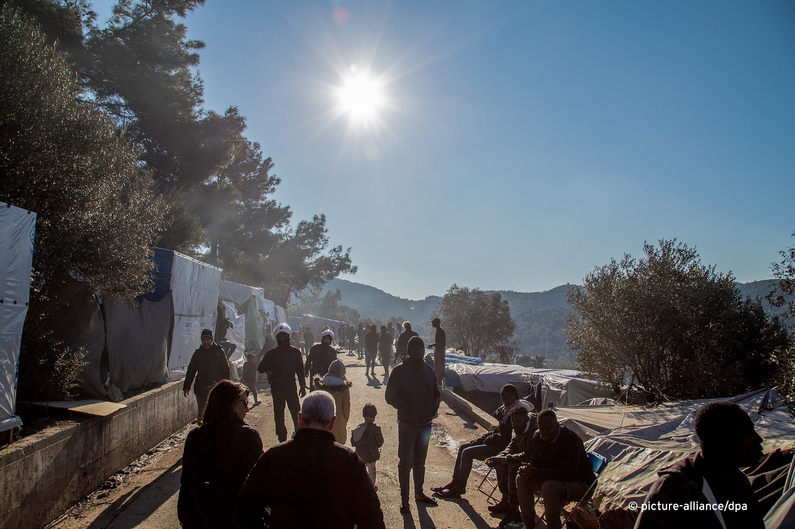
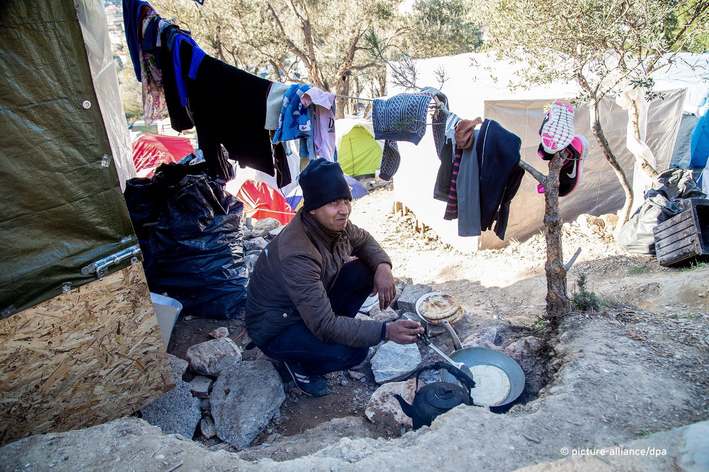
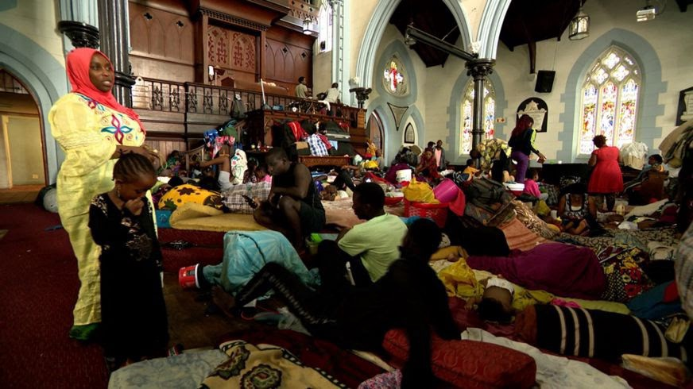
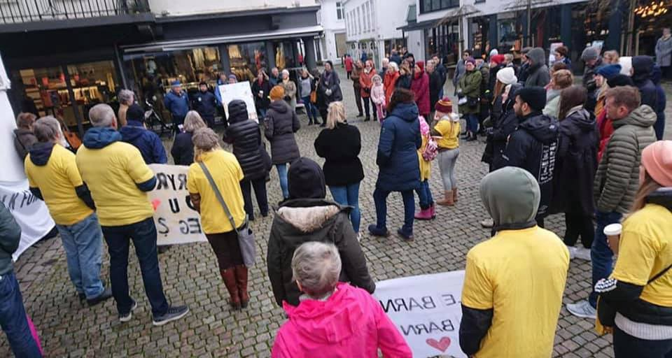
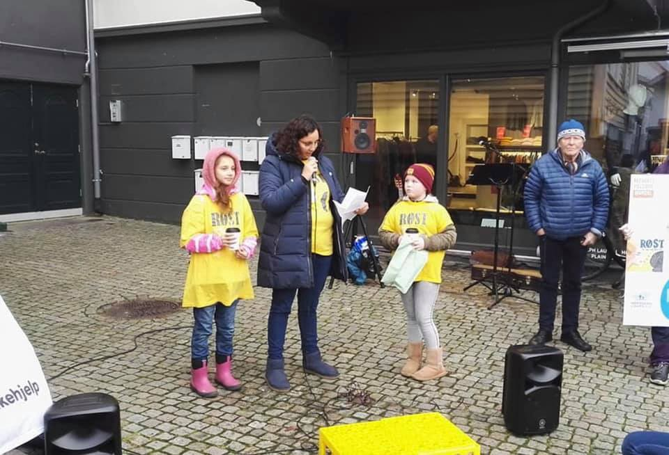
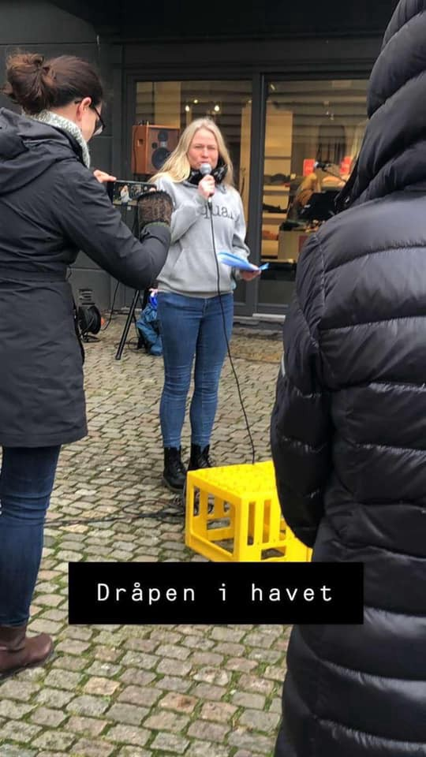
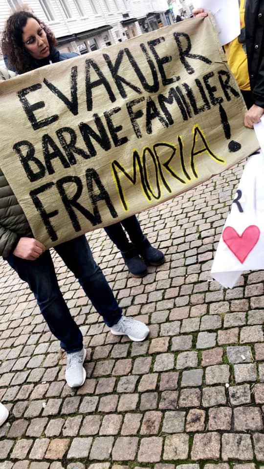

### AYS Weekend Digest 01–02/02/20: Greece to introduce ‘weekly return routes’
#### Plans to introduce ‘weekly return routes’ for individuals whose asylum applications have been rejected // Ongoing effects of the Greek government’s policy decision to refuse medical care for 55,000 people // More deportations from Sweden announced // & more news from Syria, SAR, Greece, Italy, Belgium, Malta, Spain, Norway, Denmark and Sweden

### FEATURED

In recent weeks, Greece has been making headlines for the continued shakeup of its migration policy and with the new announcement, this week by the Greek migration minister indicating another strong turn in migration policy emerging from Athens\. He announced plans to introduce [‘weekly return routes’](http://www.ekathimerini.com/249111/article/ekathimerini/news/weekly-migrant-returns-announced?fbclid=IwAR388K4f3KAJVO6pBjFKS0gq-obkiZM_VXTCLO2XoSTbD0RVHeiY6laXack) for individuals whose asylum applications have been rejected in attempts to alleviate ‘overcrowding’, something he described as a ‘political decision by the government’\.

Additionally, it was announced this week that all Greek asylum applications should state all the reasons why an individual is fleeing their country of origin in the full registration\. Additionally to the brief explanation of the reason for fleeing, any individual seeking asylum will be asked about their identity, how they travelled to Greece and if they already have family in other European countries\. [The Mobile Info Team for Refugees](https://www.facebook.com/mobileinfoteam/posts/2663941213834591) in Greece recommends for those seeking full registration that _“if you have any documents from your country of origin please bring them along as it might create problems if you later in the procedure state different or new reasons why you were fleeing your home country, already think beforehand what you want to say\. If you have been persecuted by your government or anybody else, or if your life was in danger because of certain circumstances, then this might be important reasons to state in the full registration\. Make always sure to be truthful with the authorities, as making something up might lead to your asylum claim being rejected\. If you can, try to get advice from a legal NGO, a lawyer or a social worker before your full registration\.”_

### SYRIA
### Germany will fund Turkey so it can ‘cope with a new influx’

[Over](https://www.aljazeera.com/indepth/inpictures/pictures-exodus-idlib-syria-conflict-escalates-200202065643945.html?fbclid=IwAR3L38CXIRbel-O0BVBYQeljVAQ2iOCA0DOQm8ZHBj8qORcNi-JMThfBv6A) the last 10 days, President Bashar al\-Assad has recaptured dozens of towns leading to the estimated daily displacement of 6,500 children\. It is estimated that between [December 1st 2019 and January 27th 2020, 390,000 people have fled northwest Syria, 80% of whom are women and children\.](https://ahvalnews.com/germany-turkey/germany-give-turkish-red-crescent-25-million-euro-syrias-idlib?fbclid=IwAR2xRrkVDubcSdPPQY60mlg372LhzhrWrRuHp76Mc4nvBHUgG81_fSpYqnk) Rights groups have criticised the use of air and ground offensive by Russian and Syrian forces and the continued demolition of hospitals, schools and homes in the region\.

This Sunday, the brutal reality of the airstrikes conducted by the Syrian and Russian military forces was laid bare with the announcement of the death of 14 civilians\. An AFP correspondent claimed that rescue workers pulled the bodies of a nine\-year\-old girl and a thirteen\-year\-old boy from the debris of a two\-story building, just two of the eight who died during the deadly barrel bomb attack in the town of Sarmeen\.

Responding to the new wave of refugee movements, Erdogan stated that “Turkey would not be able to cope with a new influx of migrants and that it would be willing to introduce a policy of military force if necessary to protect its [borders](https://www.aljazeera.com/news/2020/01/erdogan-warns-military-force-syria-idlib-exodus-200131193019362.html) \.”

Responding to the thousands currently fleeing Syria, the German Foreign Ministry announced this weekend that it will provide the Turkish Red Crescent a humanitarian aid support package of 25 million Euros\.
### GREECE

This week [Evelyn Peternel reports](https://kurier.at/politik/ausland/fluechtlinge-griechen-verwehren-schwer-kranken-kindern-versorgung/400742604?fbclid=IwAR1HldXrPsk4RxRhAwsr3CxtGQbmDAg0dc1yLeApjlgEXVkePzblqcg064s) on the ongoing effects of the Greek government’s policy decision to refuse medical care for 55,000 refugees, including terminally ill young children\. The decision has left thousands of people who have yet to receive an asylum decision whilst stuck on the Aegean islands or who have no official papers without medical care\. Hilfe Vocht, medical coordinator at MSF in Greece spoke to the Kurier paper of the “…catastrophic, unsanitary conditions” that many endure, leading to a vicious cycle stating “we see many children, including babies who suffer from diseases such as diabetes, asthma and heart diseases”\.

> _This government policy is shown in its most brutal form with the death of three young children living in Moria, Lesvos, the most recent child being a nine\-month\-old Congolese baby\._ 

### Postponed court case

The Appeal Trial of the Moria 35 will take place in Mytilene Court on February 5th instead of February 3rd, as previously announced\.

In 2018, 32 of the 35 men violently arrested by the police following demonstrations in Moria were convicted of the crime of dangerous bodily harm against police officers — with a suspended sentence of 26 months imprisonment — despite a complete lack of evidence against them\.

Find out more about the case in this video:

We were provided with this account from an anonymous single female residing in Vial Camp, Chios, to highlight the daily struggles faced by many living in camps in the EU Member States through a simple story of a single day and night in the camp Vial\. Please, take the time to read [**AYS Special from Chios: What is life really like in a Greek Refugee Camp?**](ays-special-from-chios-what-is-life-really-like-in-a-greek-refugee-camp-73e2cd288e8b) and to understand the daily reality of thousands\.
### SOUTH AFRICA

In [Cape Town](https://www.bbc.com/news/world-africa-51284576?fbclid=IwAR2RC6xh3Vuc2A1n_6MNAiiE-e_XhOE5aZydRbTvAt50yg3WLUixGfReFek) , South Africa, over the last four months, over 500 people have been forced to seek shelter inside Cape Town’s Central Methodist Church\. Since October the Central Methodist Church has offered this community sanctuary within its walls after the police, armed with an eviction order, sought to forcibly and often violently remove the group during a sit\-in protest outside UNHCR offices in South Africa\. Speaking to the BBC, the women sheltered within the church talk of their desire to move on from South Africa, a country ‘that since 2008 has seen multiple outbreaks of xenophobic violence’\. In addition to the violence and humiliation these men, women and children are forced to endure, a new policy set to be introduced by the South African government will undoubtedly make their lives far harder\. The Refugees Amendment Act is a new law seeking to limit the legal work that refugees can do and prevent them from taking part in all and any political activities relating to their home country\.

Agency [copyrights](https://ichef.bbci.co.uk/news/872/cpsprodpb/638F/production/_110678452_ch4.jpg)
### SEARCH AND RESCUE AT SEA
### Italy

After repeated denials by Spanish authorities and with only two days worth of food left for the 363 people rescued at sea by Spanish NGO open arms, their boat was finally given permission by both Italy and Malta to enter the Sicilian port of Pozzallo and dock\. It has been reported that in line with an EU agreement on settling migrants and refugees rescued in the Mediterranean, the individuals on the boat will be distributed across EU member states\.
### Malta

During the early hours of February 1st, a distress call from a boat containing 47 people was received by international NGO Alarm Phone\. The organisation informed the Maltese authorities of the boat and the 47 lives that were endangered, but Malta was unwilling to confirm if a rescue operation would be launched\. Further distress calls by the group to Alarm Phone confirmed that the groups had left Libya 30 hours prior and now the engine to their boat had stopped working and was rapidly taking on water, putting these people’s lives at serious risk\. After another gruelling 10 hours left helpless at sea without life vests on a sinking boat, Alarm Phone could confirm that a Maltese armed forces rescue operation was underway and had successfully rescued all 47 people on board\.
### BELGIUM

The police officer who shot a bullet which ended up fatally wounding a little girl during a high\-speed car chase of a van of people on the move has now [reportedly](https://www.infomigrants.net/en/post/22494/kurdish-toddler-killed-during-a-high-speed-car-chase-in-belgium-policeman-charged?fbclid=IwAR04V5bQlmWK4DkxuSZgfjVEoXhfpCt89l63HFxqEFIglzcwOZItZKVo9Uo) been charged with involuntary manslaughter\.

> _When the van driver refused to pull over, according to the officer’s account, one of the policemen drew his gun and aimed through the window of their car at the “left tire” whilst they were overtaking the van\. But at that point, according to reports, the police car swerved suddenly and the bullet was misdirected; ending up making contact with the cabin of the van, where the little girl, Mawda, was sitting behind the driver with her parents\. The bullet hit her head and she died in the ambulance on the way to the hospital\._ 

This is a reminder of another fatal police action that resulted in a death of a child, Madina Husseiny, but so far **nobody in Croatia bothered** to seek who is responsible for sending people off, illegally, into a dangerous and life\-threatening walk to another country, outside the EU, along the railways where Madina lost her young life\.
### SWEDEN

Another mass deportation tomorrow, another black Tuesday \(svart tisdag in Swedish\) \. There will be protests in several cities, so far at least in Stockholm, Lund, Malmö and Göteborg\. Activists will also gather outside of the detention facility in Märsta where the buses with rejected Afghani asylum seekers will depart from\. The plane will leave from Arlanda airport\. No info about exactly how many or when the flight is scheduled to leave is available\.

The goal with the protests is to reach politicians and change opinions\. Especially since the work of the migration committee is ongoing\. A new, long\-term and sustainable migration policy will be presented during the summer — now is the time to work for change\.
### [Svart tisdag — 4 febr 2020 — Stop Deportations to Afghanistan](https://www.facebook.com/events/610044163164666/?acontext=%7B%22ref%22%3A%224%22%2C%22feed_story_type%22%3A%22308%22%2C%22action_history%22%3A%22%5B%7B%5C%22surface%5C%22%3A%5C%22group%5C%22%2C%5C%22mechanism%5C%22%3A%5C%22main_list%5C%22%2C%5C%22extra_data%5C%22%3A%5B%5D%7D%5D%22%7D)
### [Edit description](https://www.facebook.com/events/610044163164666/?acontext=%7B%22ref%22%3A%224%22%2C%22feed_story_type%22%3A%22308%22%2C%22action_history%22%3A%22%5B%7B%5C%22surface%5C%22%3A%5C%22group%5C%22%2C%5C%22mechanism%5C%22%3A%5C%22main_list%5C%22%2C%5C%22extra_data%5C%22%3A%5B%5D%7D%5D%22%7D)
#### [www\.facebook\.com](https://www.facebook.com/events/610044163164666/?acontext=%7B%22ref%22%3A%224%22%2C%22feed_story_type%22%3A%22308%22%2C%22action_history%22%3A%22%5B%7B%5C%22surface%5C%22%3A%5C%22group%5C%22%2C%5C%22mechanism%5C%22%3A%5C%22main_list%5C%22%2C%5C%22extra_data%5C%22%3A%5B%5D%7D%5D%22%7D)
### DENMARK

The Ministry of Immigration and Integration has paid external consultants DKK 400,000 \(53\.500 €\) to interview 15 Syrians about why they are leaving Denmark\. “Waste of taxpayers’ money,” the Alternative party \(Alternativet\) claims\.

The consultants are specifically to interview 15 Syrian refugees, all of whom are waiting for the final approval before they are returning voluntary as part of the repatriation scheme\. The interview series will conclude in a report that will clarify, among other issues, “what motivates Syrian refugees to voluntarily return home, aiming at further development of the repatriation scheme”\. In a wider perspective, the work will also be used to “support voluntary departure \(…\) for rejected asylum seekers”\.

…from the Alternative party, the initiative meets severe criticism\. The Danish Refugee Council are responsible for advice on repatriation, so “the minister can ask the Danish Refugee Council if he wants to know why some Syrians choose to go home,” says the party’s foreign spokesperson, Sikandar Siddique\. “It’s a waste of taxpayers’ money and a completely wrong priority\. We are not opposed to investigating things in general\. But in this case, the government is off course,” he says\.

…Eva Singer, chief asylum manager at the Danish Refugee Council, has previously stated that several reasons exist why more and more Syrians are choosing to use the repatriation scheme\. “They find it really difficult to access the job market\. Financially, it is very difficult for them to live a decent and dignified life\. And moreover, there are difficulties with family reunification for some of them\.” “Not necessarily only their wives and children, but also other family members whom they cannot get to Denmark and for whom they miss and feel a responsibility,” she explained to the Danish Broadcast Corporation DR in August\.

…The government’s support party The Red\-Greens \(Enhedslisten\), is not surprised that the government will investigate how to get more Syrians to repatriate\. “Unfortunately, we have a government and a minister who wants people to leave Denmark,” says the party’s foreign spokesperson, Rosa Lund\. However, she thinks it might make sense to do this kind of research\. “It could mean finding out how bad conditions people are living under\. From this reason you can hope that the survey can lead to some people getting their residence permit extended,” she says\.

**_Letters from The Hell of Asylum_**

On the other side of the ‘fight’, a new Danish site in Facebook, “ [Breve fra asylhelvede](https://www.facebook.com/AsylhelvedeDK) ” \(“Letters from Asylum Hell”\) is a campaign site run by voluntary asylum activists\. With a knowledge of the people, the stories and the \(asylum\) system that is described as Asylum Hell DK\.
The campaign will consist of a series of personal letters to the minister of immigration and integration Mattias Tesfaye, describing the conditions and practices inside the system of asylum, refugees and exit centres in Denmark\.
### NORWAY

A demonstration in Mandal against the detention of families and for the evacuation of children from Moria camp on the island of Lesvos in Greece:

Photos: [Budbringeren fra Helvete](https://www.facebook.com/Budbringeren-fra-Helvete-181486232399790/?tn-str=k%2AF&hc_location=group_dialog)

**Find daily updates and special reports on our [Medium page](https://medium.com/are-you-syrious) \.**

**If you wish to contribute, either by writing a report or a story, or by joining the info gathering team, please let us know\.**

**We strive to echo correct news from the ground through collaboration and fairness\. Every effort has been made to credit organisations and individuals with regard to the supply of information, video, and photo material \(in cases where the source wanted to be accredited\) \. Please notify us regarding corrections\.**

**If there’s anything you want to share or comment, contact us through Facebook, Twitter or write to: areyousyrious@gmail\.com**
- [Digest](https://medium.com/tag/digest)
- [Refugees](https://medium.com/tag/refugees)
- [Europe](https://medium.com/tag/europe)
- [Greece](https://medium.com/tag/greece)
- [Migration](https://medium.com/tag/migration)

_Converted [Medium Post](https://medium.com/are-you-syrious/ays-weekend-digest-01-02-02-20-greece-to-introduce-weekly-return-routes-25cccb9f556a) by [ZMediumToMarkdown](https://github.com/ZhgChgLi/ZMediumToMarkdown)._
