### AYS Weekend Digest 8–9/2/2020: No support for people deported to Afghanistan
#### 13 people die on the Iranian\-Turkish border / 91 people feared dead in the Central Med / Updates from Moria / Solidarity protest in Athens / Commemoraction / Protests in Germany / Temporary shelters in Dunkirk

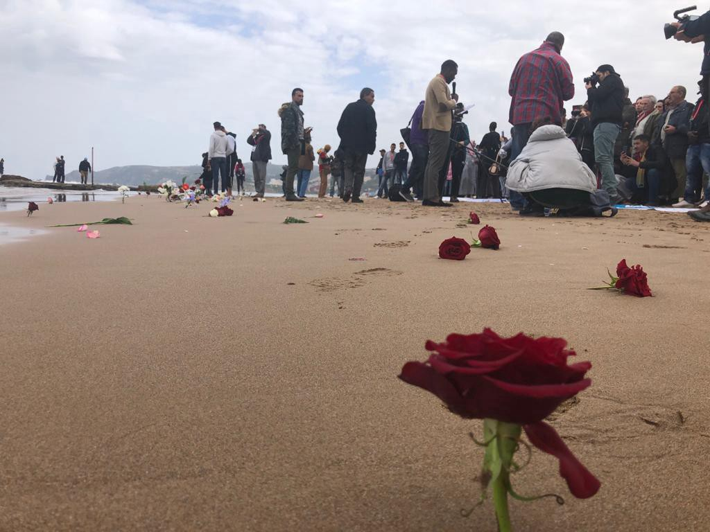

\(Memorial at Sea on the sea of Saidia, Morocco\. Photo Credit: [AlarmPhone](https://www.facebook.com/watchthemed.alarmphone/posts/2583302221944005) \)
### FEATURE STORY: No support for people deported to Afghanistan\. Deportees find themselves abandoned by the EU, International Agencies and the Afghan Government

Last week around 70 people were deported from Europe to Afghanistan\. [AMASO \(Afghanistan Migrants Advice and Support Organisation\)](https://www.facebook.com/AmasoAfg) met 4 of them in Kabul\. One of them, in need of medical assistance, was deported before their scheduled hospital appointment\.

Recently, European authorities and international agencies have really started scraping the barrel of their so\-called values, reaching new lows\. As previously reported, authorities started to use the activity of AMASO as proof of the safety of Afghanistan\.

As Abdul Ghafoor \(founder of AMASO\) [reports](https://www.facebook.com/abdul.ghafoor.378/posts/10158127285532973) , deportees are neglected by both the EU and the Afghan government\!

> _Unfortunately, many of them are in a very tough conditions since their return and do not have any social network and support in Afghanistan\. Several of them have been living in hotels with not so good living condition and will be soon on the streets when they are out of money\._ 

> _Some of them need serious mental and physical treatments, but there is no such system available for them either from the Afghan government or the International organizations\. They have to take care of everything by their own\._ 

> _With the number of people being deported to Afghanistan, despite the fact that I try to provide temporary shelter to some, it is really out of control and small organizations like ours can’t deal with it\. **IOM’s decision to end temporary accommodation and handover money instead is turning to be a wrong decision\.**_ 

> _Afghanistan Center for Excellence provides in kind support to deportees\. But it often takes between 2–8 months to receive the support\. No one cares how will the deportees in between those months waiting for the assistance\._ 

> _EU has to seriously reconsider their support method and stop making life any more miserable for these vulnerable deportees than they already have by deporting them to Afghanistan\._ 

IRANIAN\-TURKISH BORDER
### 13 people die trying to reach Turkey

[13 people froze to death](http://www.haberercis1.com/caldiran/vanin-caldiran-ilcesinde-13-multeci-donarak-can-verdi-h311863.html?fbclid=IwAR0PvEw_3NpNqrhKu2yRe2sjaivKlohq4vFiy7wubDbJjjMHOWFeIsypMF8) in the Çaldıran region of Van trying to cross the border between Iran and Turkey\. Temperatures in the area reached \-16 degrees C, and they [seem to have been caught in a snowstorm](https://www.facebook.com/sk.aldeen.3/posts/1605458559612634) \.

EUROPEAN BORDERS
### CommemorAction’s for People who Die at Borders

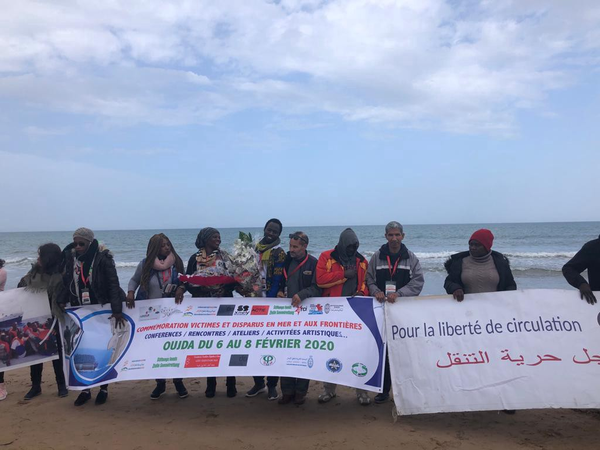

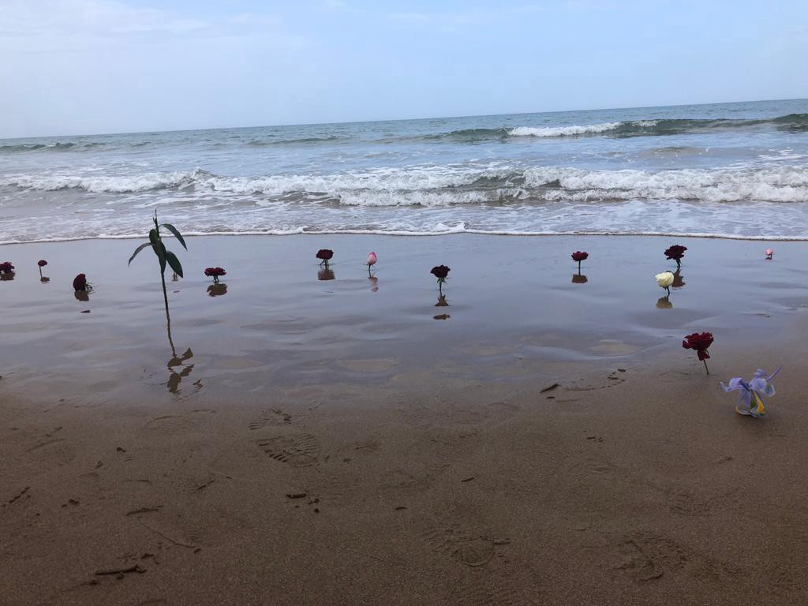

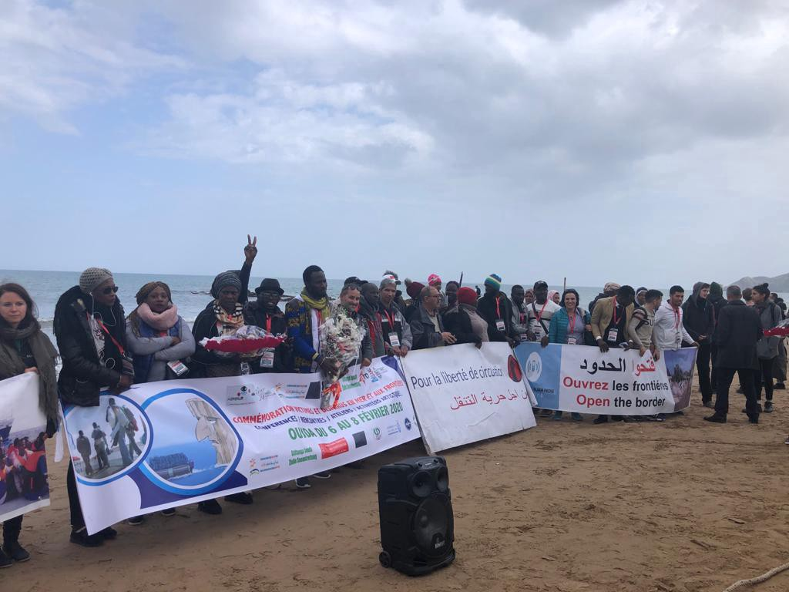

\(Memorial at Sea on the sea of Saidia, Morocco\. Photo Credit: [AlarmPhone](https://www.facebook.com/watchthemed.alarmphone/posts/2583302221944005) \)

On the 6th of February, the [**International Day of CommemorAction for People Killed and Missing on the Migration Routes**](https://alarmephonesahara.info/en/news/6th-of-february-2020-international-day-of-commemoraction-for-people-killed-and-missing-on-the-migration-routes) **\.** Acts of remembrance took place across Africa — in Morocco, Mali, Niger, Togo and Cameroon\.

> _On 6th of February 2014, more than 200 migrants tried to enter the city of Ceuta, a Spanish enclave, from Moroccan territory through the beach of Tarajal\. The Spanish Guardia Civil fired smoke cartridges and rubber bullets at the people in the water to prevent them from entering Spanish territory\. Fifteen migrants were killed on the Spanish side, dozens disappeared and others died on Moroccan territory\. — [Alarme Phone Sahara](https://alarmephonesahara.info/en/news/6th-of-february-2020-international-day-of-commemoraction-for-people-killed-and-missing-on-the-migration-routes?fbclid=IwAR3y40cMyIS-D09p70j8LcdhDbD-rsaknvkc864lMvJxJPntLts5OLMXefE)_ 

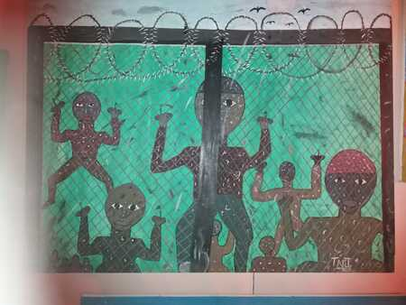

\(CommemorAction in Oujda, Morocco\. Art by a Camaroonian Artist\. Photo Credit: [AlarmPhone](https://alarmephonesahara.info/en/news/6th-of-february-2020-international-day-of-commemoraction-for-people-killed-and-missing-on-the-migration-routes) \)

> _A new movement is growing to fight against the borders that killed loved ones\. Be it in the desert or at sea, each death at the border is never an accident or a tragedy: it is murder by the border regime\. Those responsible for these murders are European states, their migration politics and the extension of their borders to African countries\. — Watch the Med — AlarmPhone_ 

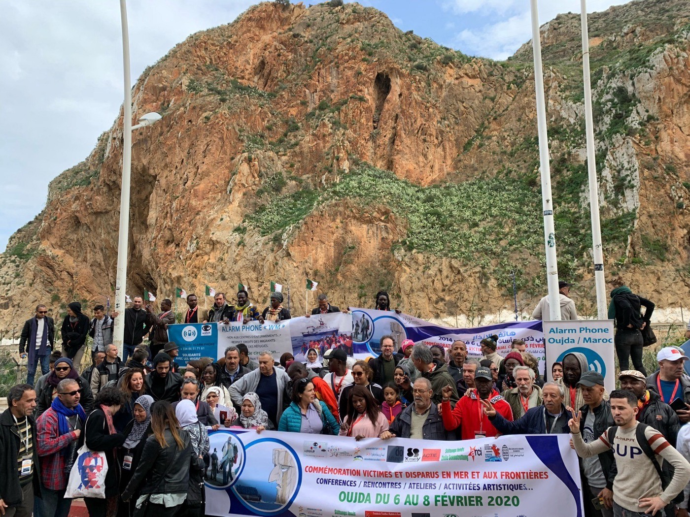

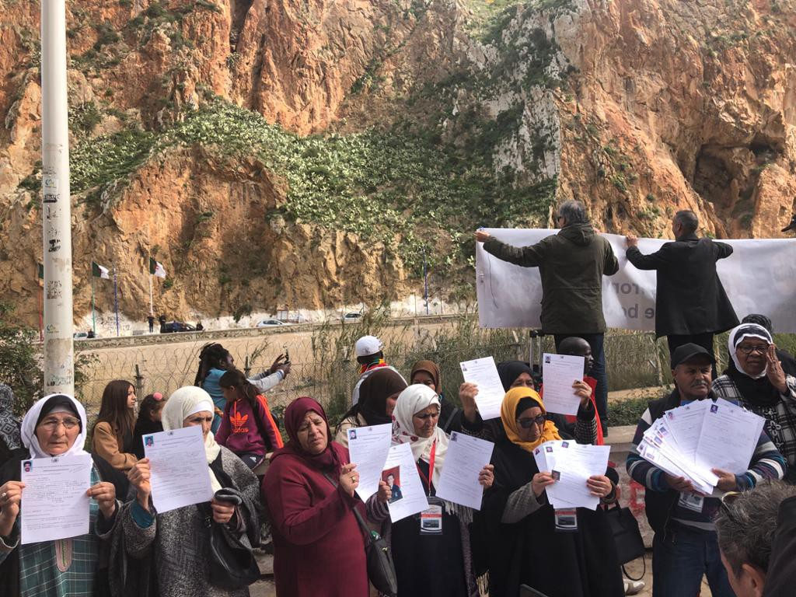

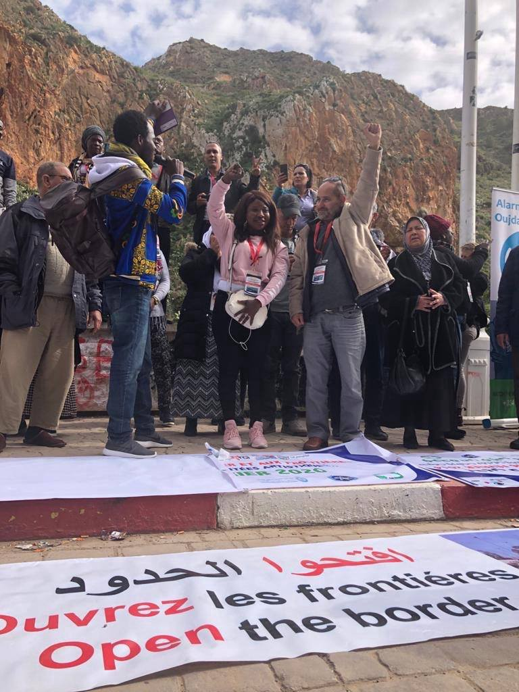

\(CommermorAction at the land border between Algeria and Morocco\. Photo Credit: [AlarmPhone](https://www.facebook.com/watchthemed.alarmphone/posts/2583302221944005) \)
### And yet we must report on more border deaths

At least two people are [reported to have died](https://twitter.com/HelenaMaleno/status/1226570542788071429?fbclid=IwAR2NhIZkRqqTZxHKnc-qwW6XK1aCsx2wngfjRknIAvbA6Sb7rEcjYBZ10e0) [despite rescue efforts](https://twitter.com/RTVCes/status/1226550712022261760?fbclid=IwAR0a6zKqEnapUWV8ZdGJ_r39ECTazfD5jE0YpHyWL2Na2TEofZQIiy2OKB8) and of the nineteen people who survived, [two more are in hospital](https://twitter.com/EFE_Canarias/status/1226554113489543168?fbclid=IwAR1GX_ecEisH_r2jSV9o2PJEKSnbenHMXJWSm681aupF1VILm5mCWS3fq20) , from a boat found 800 km off the coast of the Canary Islands\.

> _Family members expect to find out if it is the boat of 28 people missing for two weeks\. If they were not, the tragedy could be even worse\. — Helena Maleno Garzón_ 

### 91 people feared dead due to European indifference

Alarm Phone was contacted on Saturday night by a boat in distress off the Libyan coast, carrying 91 people\. Water was entering the boat and people were already in the sea\.

Despite having called authorities for hours, no action was taken:

More than 24 hours later, no new update about the situation was communicated\. No action was taken, by Libyan or European maritime authorities\. As analyst Matteo Villa [comment](https://twitter.com/emmevilla/status/1226606239871897603) s on twitter, these deaths are caused by European indifference\.

At around the same time, 93 people were [saved](https://twitter.com/maydayterraneo/status/1226535722481541121) by the Aita Mari vessel, which is now the [only rescue boat](https://www.facebook.com/watchthemed.alarmphone/posts/2583141741960053) in the Central Mediterranean\.

GREECE
### Island Arrivals

Since the weekend, 2 boats have been reported as arriving to Lesvos, carrying 74 people \(source: [ABR](https://www.facebook.com/AegeanBoatReport/photos/a.285312485325196/766402137216226/?type=1&theater) \) and 2 more boats arrived in Chios, 48 people \(source [SMH](https://www.facebook.com/smhumanitario/) \) \.
### The situation in Moria remains tense after a week of protests and police repression

[Reports from the ground](https://www.facebook.com/antonis.repanas/posts/2769961779760593?hc_location=ufi) state that up until 11 o’clock on the night of the 9th February three ambulances were seen coming and going from Moria camp on Lesvos\. The last one was escorted by the police\. Inside the “jungle” the situation looked very dangerous, with fighting now common place and police response always late\.

[ECRE report](https://www.ecre.org/greece-situation-in-lesvos-intensifies-after-police-crackdown-on-protesters/) that the Regional Governor Moutzouris stated:

> _It’s a powder keg ready to explode… Yesterday I was not just afraid, I was shaking at the idea of where the situation could end up\. \[…\]Things are said all the time and promises are made that are not kept\. The migrants are people who are suffering; they have crossed seas and oceans for a better life and are now trapped on Lesvos\. Coupled with the appalling living conditions, it is a situation that creates anger and desperation\.”_ 

Read also the special report on the violence on Lesvos in the last few days, written by Eric Maddox of [Latitude Adjustment Podcast](https://www.facebook.com/latitudeadjustmentpodcast/) for Are You Syrious: “ [Right Wing Attacks on Refugees, Volunteers, and Locals](http://Right Wing Attacks on Refugees, Volunteers, and Locals) ”
### Moria 2020
### RSA Update on Unaccompanied Children and Young People

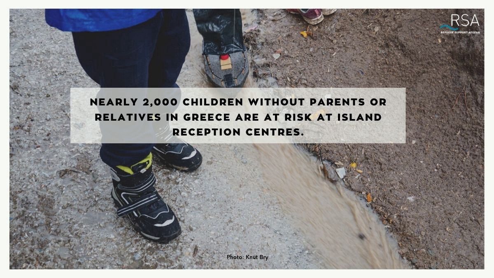

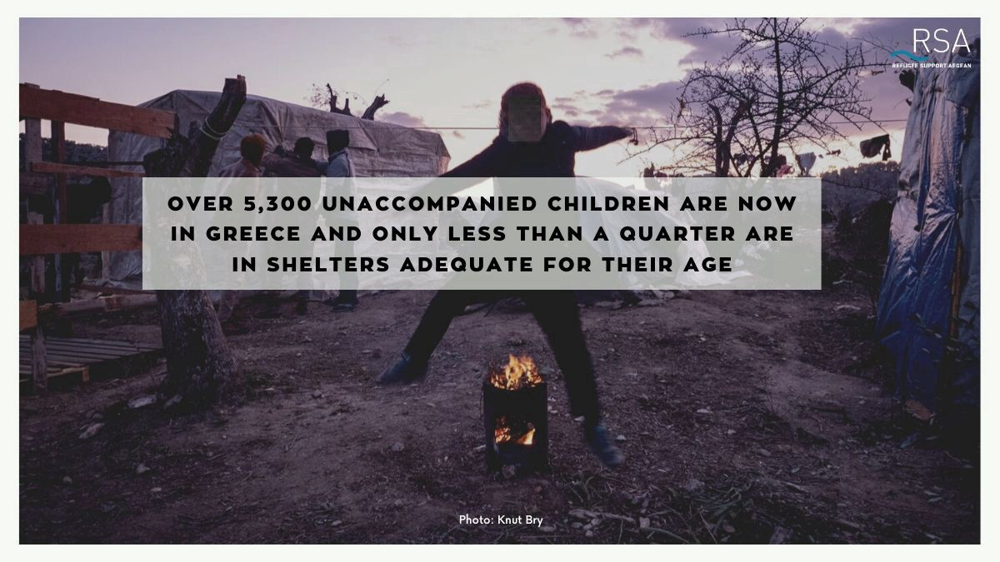

### Solidarity with Moria from Displaced People in Athens

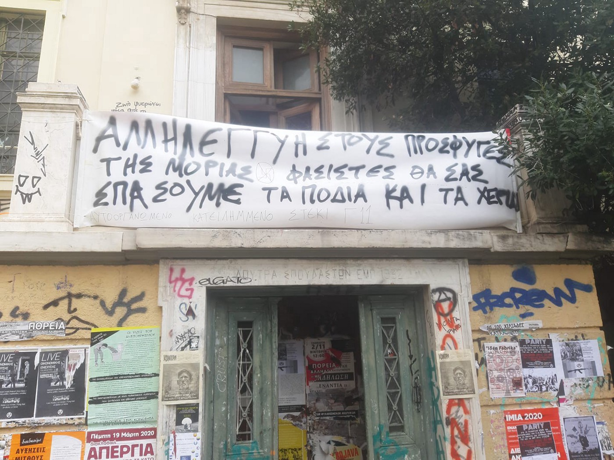

\(Squatted polytechnio by immigrants in solidarity with immigrants in Moria\. Photo Credit: [Anarchist Migrants](https://www.facebook.com/AnarchistMigrants/photos/a.477095259694830/667820703955617) \)

On Saturday, migrants occupied for the first time the whole of the Polytechnio university in Athens in solidarity with people struggling in the hell hole of Moria\.

Many of the protesters have been living in the Gyni squat within the university for several weeks now\. An open meeting has been organised for Monday 10th, at 19\.00 at the squat\.

Read their full statement [HERE](https://athens.indymedia.org/post/1602964/) \.

GERMANY

**Protest for Relocation of Unaccompanied Children and Teenagers from Greek Islands to Germany**

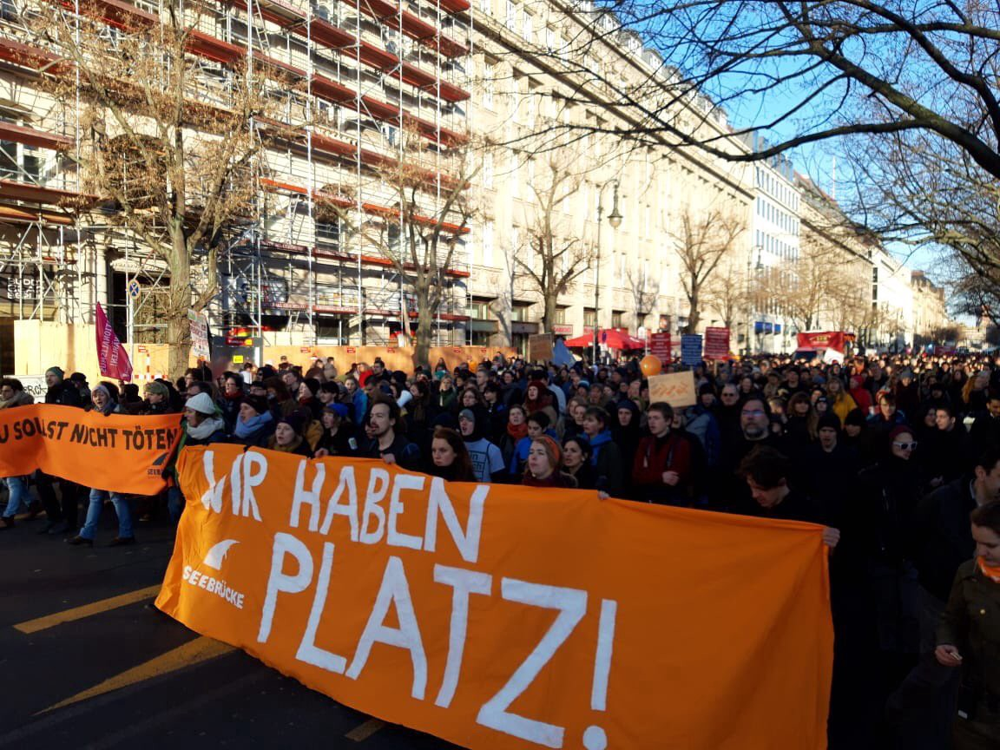

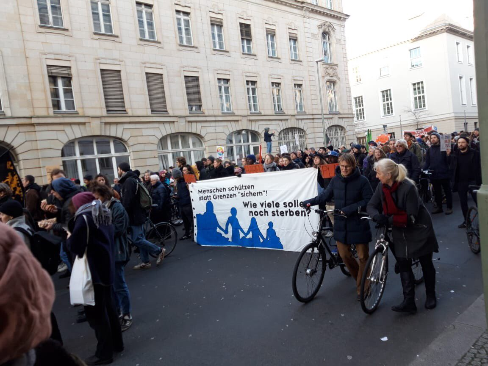

\(Photo Credit: [RSA](https://twitter.com/rspaegean/status/1226174086839140352?fbclid=IwAR2e3Vju_G0pT1Pz6_NHQ1MWbkK3jipjrpR8zhlCpqk21p8DhLDCP80iaZI) \)

A protest was held on Saturday in Berlin demanding the immediate admission of 4\.000 unaccompanied children and teenagers from the camps on the Greek islands to Germany\.

FRANCE
### Temporary emergency shelters opened in Dunkirk

Mobile Refugee Support [report](https://www.facebook.com/MobileRefugeeSupport/posts/1182435865295356) that authorities announced on Sunday the opening of three temporary emergency shelters to house displaced people in the Dunkirk area, as a measure to deal with the storms due in the next hours\.

> _However, unlike in previous years where these shelters were open for the entire winter season, it seems very likely that they will only be open for a few days until the weather passes\. By Tuesday, it is expected that those using these shelters will be pushed back outside\._ 

During the last months, regular evictions of makeshift shelters have continued to take place\. Every time possessions and shelters have been destroyed, “police officers and workers in hazmat suits will even begin to dismantle tents before the occupants have been removed, usually armed with knives for cutting the plastic”

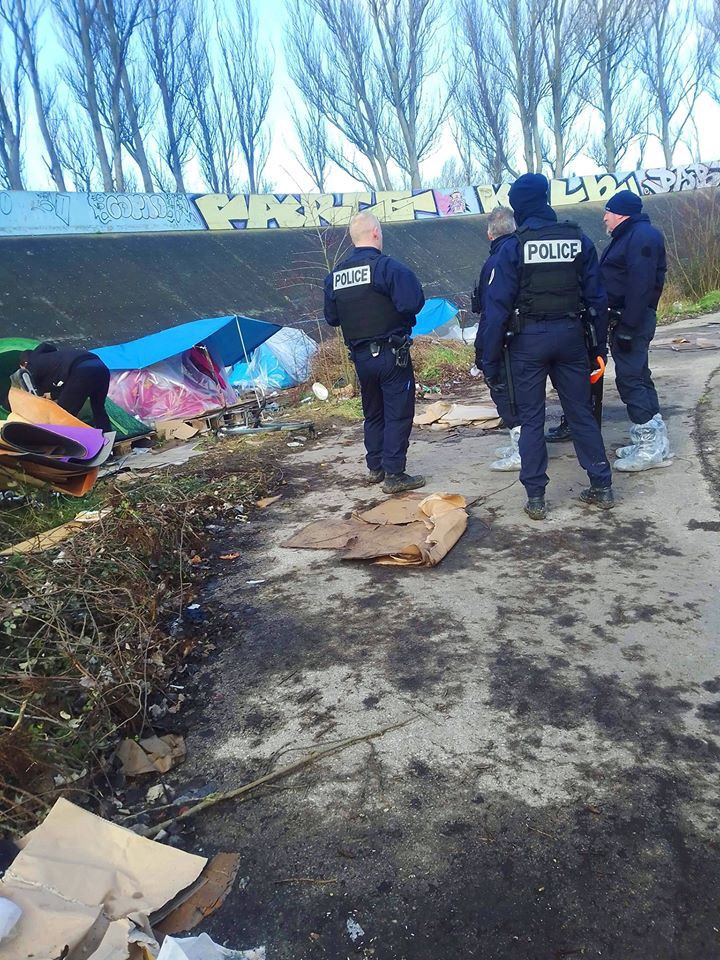

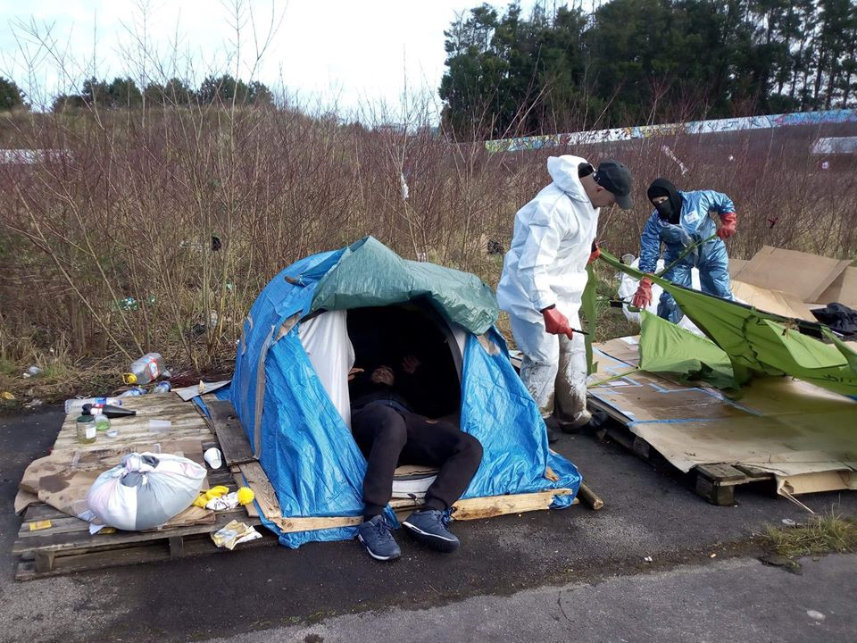

Destruction of tents and personal possessions by police and workers, Dunkirk\. Photo by [MRS](https://www.facebook.com/MobileRefugeeSupport/photos/pcb.1182435865295356/1182431995295743/?type=3&theater)

After the storm has passed, MRS will distribute and replace tents and other essential equipment to all those currently displaced in the Dunkirk area\. You can support them [HERE](https://www.facebook.com/Donate4Refugees.org/) , or contact them if you’re interested in joining them on the ground\.

**Find daily updates and special reports on our [Medium page](https://medium.com/are-you-syrious) \.**

**If you wish to contribute, either by writing a report or a story, or by joining the info gathering team, please let us know\.**

**We strive to echo correct news from the ground through collaboration and fairness\. Every effort has been made to credit organisations and individuals with regard to the supply of information, video, and photo material \(in cases where the source wanted to be accredited\) \. Please notify us regarding corrections\.**

**If there’s anything you want to share or comment, contact us through Facebook, Twitter or write to: areyousyrious@gmail\.com**

Following
- [Digest](/tag/digest)
- [Commemoration](/tag/commemoration)
- [Refugees](/tag/refugees)
- [Afghanistan](/tag/afghanistan)
- [Deportation](/tag/deportation)

_Converted [Medium Post](https://medium.com/are-you-syrious/ays-weekend-digest-8-9-2-2020-no-support-for-people-deported-to-afghanistan-4e19d6ed9bb1) by [ZMediumToMarkdown](https://github.com/ZhgChgLi/ZMediumToMarkdown)._
