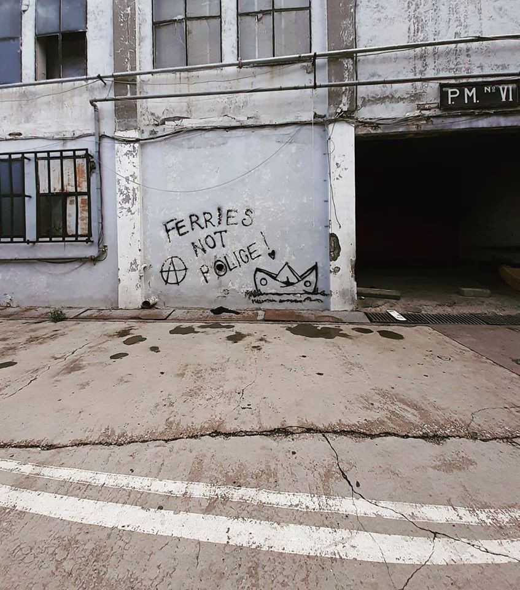

### AYS Daily Digest 12/02/2020: Italian MP ‘migrant kidnapping’ trial

MP to face trial in Italy / Torture in Turkey / Rescued boat found in Spain / Failings of the Dutch asylum system

Patras, Greece \(Photo Credit: Chrysoula Patsou\)
### Feature
### Italy

After a [vote held in the Italian Senate](https://www.euronews.com/2020/02/12/salvini-faces-key-senate-vote-over-migrant-kidnapping-allegations?fbclid=IwAR2qlwEzrrIMysnobYzUf-SgO-eYncm_r5AJubYHaXytyeMLcvrTFxvHAUY) , Matteo Salvini, former interior minister and leader of the League right\-wing party, will face charges over the alleged ‘migrant kidnapping’ last July\. The case concerns an incident over seven months ago when 131 migrants were prevented from disembarking at an Italian port for almost a week\. Yesterday’s indictment will not be the only indictment that the Italian politician faces, as the senate committee will announce on 27 February if he will be charged for ‘detaining’ 107 migrants on an NGO rescue boat in Sicily for six days in August\.

Matteo Salvini said on Twitter prior to yesterday’s vote “If I stand trial, I’ll explain to the judges that I had the duty to defend Italian citizens, and I will serenely walk into the hearing room representing millions of Italians — for what I did was what they wanted: checking those who come into Italy and those who leave, as I would in my own home\. When you do nothing wrong, there is nothing you should be afraid of\.”
### Netherlands

Of the [1,100 children](https://www.dutchnews.nl/news/2020/02/half-the-children-in-final-refugee-amnesty-review-can-stay/?fbclid=IwAR0VuRLfYXF6HgeLeT5zV2bRMP3v94vHq3LHW-hu1aO0MLmGXEYh0kroi7Y) in the Netherlands seeking to be granted the right to residency , it was announced this week that the Dutch government only granted this status to 51% of the child applicants\. In an indication of the failings of the current system, MPs agreed to review the criteria of residency and provided 263 children with an automatic review of their case and application\. Of the 263 children, whose cases were automatically reviewed, the Dutch government granted residency to 235 children\.

[The Children’s Amnesty policy](https://www.migrationpolicy.org/article/migration-netherlands-rhetoric-and-perceived-reality-challenge-dutch-tolerance) , introduced in 2012 by the VVD\-PvdA \(Labour Party\) coalition government essentially provided amnesty for children who have been residing in the Netherlands without legal status for five years or more\. The policy was proposed to address the issue of children who had previously applied for asylum in tandem with their parents but were rejected\. Throughout the duration of the asylum application process and the subsequent appeals to rejections, these children were schooled in the country, spoke the language and would find it difficult to adjust if they were returned to their country of origin when their petition was denied\. Whilst this was said to be a turning point for children’s rights in the Netherlands, a report in 2017 by the Children’s Ombudsman demonstrated that in reality, very few children achieved legal status, promoting both human rights groups and psychiatrists to lambaste the governments for its policy of child deportations\.
### Turkey

[Allegations have been made](https://www.infomigrants.net/en/post/22699/turkey-accused-of-torture-pushbacks-of-migrants-on-iran-border?fbclid=IwAR0kUqsQnugTCtlm77a0MP3NrAusAdy5sGsdE8Uo6xrAjA7WZ7W6iPoLWTI) against the Turkish authorities for the torture of a group of Pakistani men\. Mahmut Kacan, a lawyer working with the eastern Turkish province of Van to provide free legal aid and monitoring migrant border crossings, showed InfoMigrants an interview conducted with a group of men who describe how the Turkish soldiers stole their bags, belongings, gloves and shoes and pushed them back to Iran\. The disgusting actions taken by the Turkish authorities to rob them of their belongings and clothes have left the men hospitalized and facing amputation of their fingers that are black with frostbite\.

Discussing the incident with InfoMigrants, Kacan says that despite being illegal, reports do emerge of people being apprehended on the border by Turkish soldiers, tortured and pushed back to Iran\. He says ‘they don’t care about their needs or they don’t receive their asylum request if they have one’\.
### Spain

It can be confirmed that on Tuesday that the rubber dingy first believed to be holding 67 people, was spotted 67 kilometers south of the Spanish port city of Malaga by sailors on board a merchant ship, and successfully rescued\. The AP news agency claims that the boat that had been missing since Monday there were 13 women and five children onboard\.
### Ireland

[Amnesty Internationa](https://www.theguardian.com/football/2020/feb/12/refugees-welcome-bohemian-fc-team-up-with-amnesty-for-new-away-kit?CMP=share_btn_fb&fbclid=IwAR0bKLWXGG00uGBdSLJ725RdXhhROmkrdcG1-rBPLrrDWbf0KrxvbznX1Po) l has teamed up with the ‘ _Bohemians’,_ a Dublin\-based football team, to unveil their new season’s football kit that proudly displays ‘Refugees Welcome’ mid\-chest\. The shirt also features on its collar the slogan ‘Love Football, Hate Racism’\.

The Bohemians manager, Daniel Lamber, said “We made the decision to allow our shirt to be used as a platform, alongside Amnesty International, to highlight a very real and pressing issue in Ireland today, that of Direct Provision” and that this builds on the deep and lasting relationship we have built with MASI \[Movement of Asylum Seekers in Ireland\] and through multiple engagements with people living in Direct Provision\.”

At the unveiling of the new sports kit, Colm O’Gorman, the executive director for Amnesty Internal Ireland said “Bohemian FC and their supporters have an incredible track record on social justice issues\. We’ve long respected the practical solidarity they’ve shown people seeking asylum and refugees, so this is a fantastic opportunity to bring our supporters together to call for an end to Direct Provision”
### Greece

In the latest in a spate of attacks by fascist organisations and groups across Greece, it was reported yesterday that in the Greek capital of Athens a migrant worker was attacked by a group of fascists\.

A group of 10 people attacked the homes of Pakistani nationals screaming “get out of our country”, “ we will fuck you all” and “death to the Pakistanis “ as they threw stones at their windows\. The police were notified of the attack but failed to appear until two hours after the incident occurred\. The reports indicate that this is not the first time that these Pakistani households have been attacked, and that these types of incidents have been common over the past two weeks\.

Anti\-fascist organisations are calling on the public, municipal organisations and trade unions to condemn the attacks by fascists, and have called for a public rally on 21 March\.

■■■■■■■■■■■■■■ 
> **[Katy Fallon](https://twitter.com/katymfallon) @ Twitter Says:** 

> > Recently on Samos I met unaccompanied minors w/scabies.

Sharing these photos posted by Still Rise NGO to show current situ. 

“This is what untreated scabies looks like in the hands of a 15 year old unaccompanied minor living in a tent &amp; without a guardian to take care of him.” https://t.co/25Dhn5RP0g 

> **Tweeted at [2020-02-12 08:53:44](https://twitter.com/katymfallon/status/1227516121466703872).** 

■■■■■■■■■■■■■■ 

On the Greek Island of Samos, NGO Still Rise reports on the continuing issue of untreated scabies amongst minors\. They say “this is what untreated scabies looks like on the hands of a 15\-year\-old unaccompanied minor living in a tent & without a guardian to take care of him\.”

In a follow\-up to our ongoing reporting of the increasing number of racist attacks across Greece, the [Mytilene Criminal Prosecutor](https://www.naftemporiki.gr/story/1558744/mutilini-eleutheroi-afethikan-oi-epta-sullifthentes-pou-katigorountai-gia-epitheseis-kata-metanaston?fbclid=IwAR1fCnOx52uslD9qqXg2hYCVIcserc4G2bvKssGtTAUh8nQpCO13L3v4rJc) released a statement on Friday afternoon that seven men aged 17–24 have been accused of setting up a criminal group and violating gun laws\. The seven men, and an additional two who are still being search for, are residents of Lesvos and are set to be charged under the anti\-racist law\.
### Denmark

NGO [Refugees Welcome Denmark](https://www.facebook.com/refugeeswelcomedenmark/?__tn__=%2CdkCH-R-R&eid=ARBOBnHfKqK7ltDwqNMrLUdmwjTH8JQQrJb7FeWb8lawKbn5AAppF2MpTFFI5pEs9spwDgRyJFR8NWcD&hc_ref=ARSyzBkXk_uTF45YN0vsGvL8Y-iSbAMztIAmxOwXJvwL8_kuKDucRVPkKlsIuW7mUTQ&fref=nf&hc_location=group) report that a reunification case of an Eritrean family has been pending since December 2018\. The reunification case was originally estimated to take eight months, but now a letter has been received stating that the response to the case is expected at the end of May 2020\.

Refugee Welcome Denmark claims that ‘this is not a unique case — we receive letters that the decision is postponed on all our pending cases with the board’\. They say that ‘the number of asylum seekers has been historically low for the last three years, and many of our complaints relate to refugees who were granted asylum back in 2015’\. Illustrating the number of other similar cases the NGO provided this example:

> “Father was granted asylum in Denmark in 2014\. Originally an application for family reunification for ‘L’ with her mother and six younger siblings in January 2015, where she soon turned 17 years old\. DNA testing, including extension of time, was requested because the family could not come from Eritrea\. Eventually, mom \+ six younger siblings chose to leave for Ethiopia in October 2015, and they all got permission and travelled to Denmark\. The reason ‘L’ didn’t leave with her mother and siblings was because they considered it too dangerous for a teenage girl to cross the border illegally\. There is a great risk of the smugglers in the border area raping and / or kidnapping them\. The other daughter was only two years old, the rest of the children were boys\. ‘L’ could then stay with older siblings in Eritrea, but they also fled soon after\. In the rejection from the Immigration Service of October 2016, in addition to the older siblings, her grandmother is mentioned as a caregiver, but she did not know her grandmother, who was otherwise very old and died in 2017\. Ever since ‘L’ came out from Eritrea in October 2018, she has been waiting alone in a refugee camp in Ethiopia\.” 

### Request for help

**Find daily updates and special reports on our [Medium page](https://medium.com/are-you-syrious) \.**

**If you wish to contribute, either by writing a report or a story, or by joining the info gathering team, please let us know\.**

**We strive to echo correct news from the ground through collaboration and fairness\. Every effort has been made to credit organisations and individuals with regard to the supply of information, video, and photo material \(in cases where the source wanted to be accredited\) \. Please notify us regarding corrections\.**

**If there’s anything you want to share or comment, contact us through Facebook, Twitter or write to: areyousyrious@gmail\.com**

_Converted [Medium Post](https://medium.com/are-you-syrious/ays-daily-digest-12-02-2020-italian-mp-migrant-kidnapping-trial-58d5e11a46ef) by [ZMediumToMarkdown](https://github.com/ZhgChgLi/ZMediumToMarkdown)._
