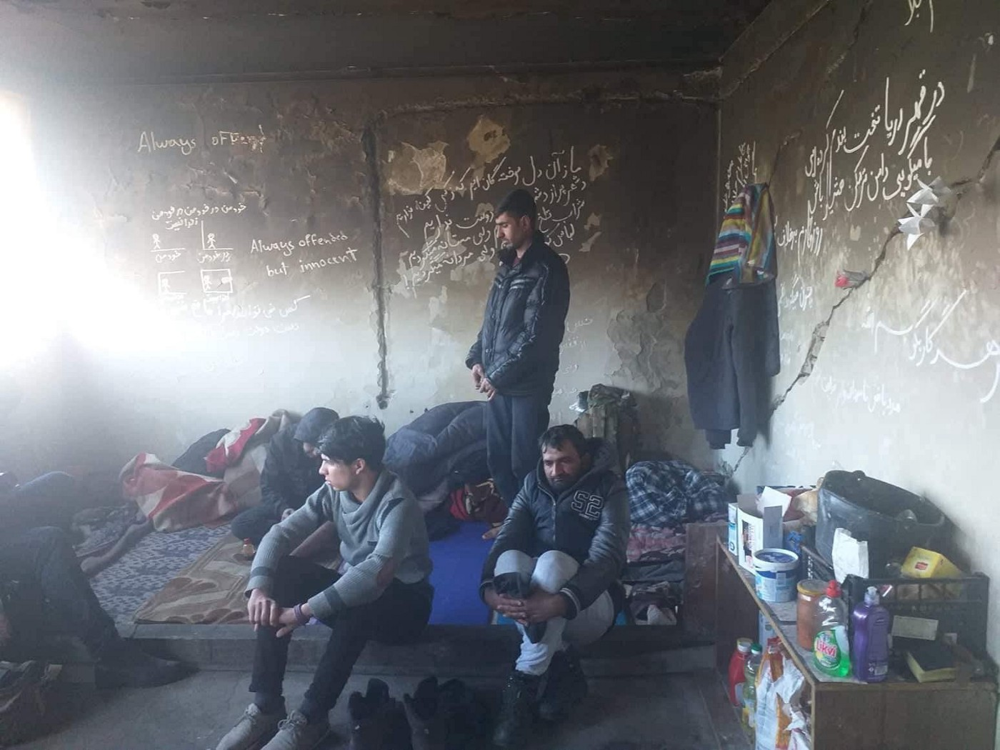
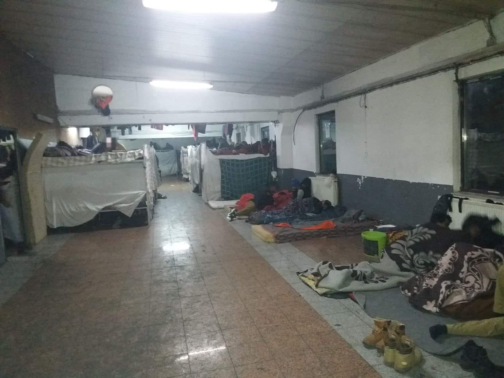
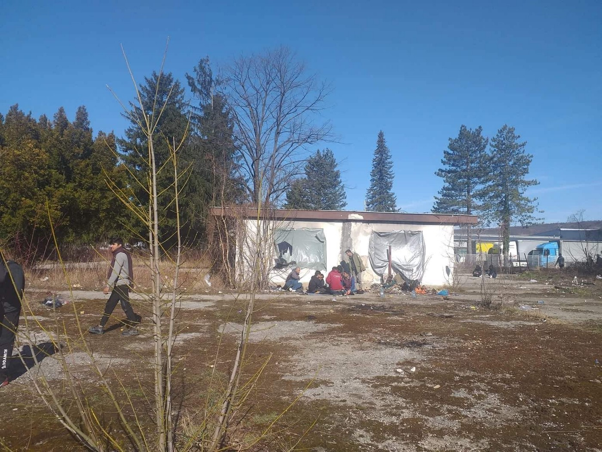
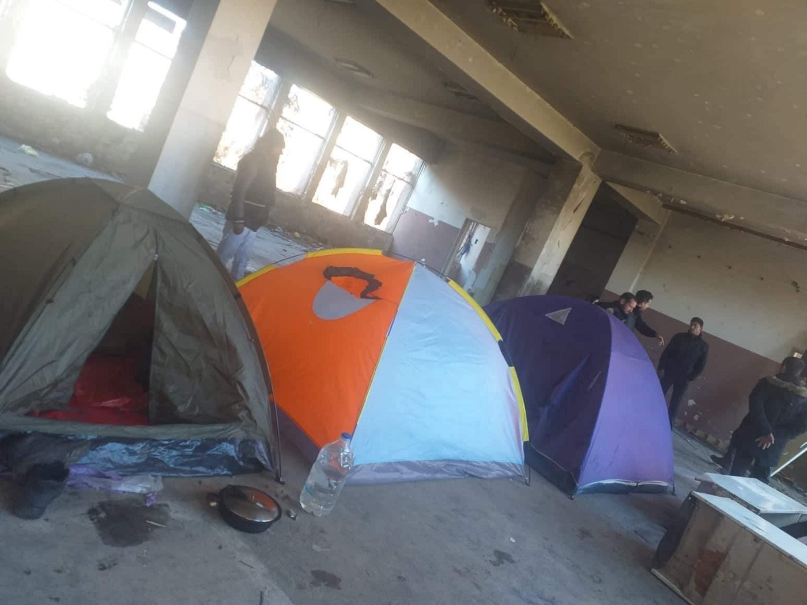
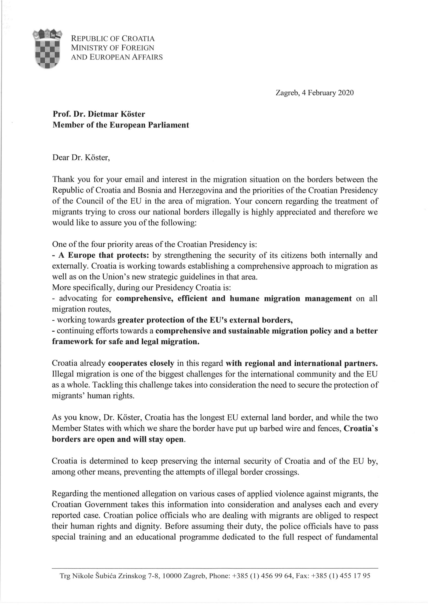
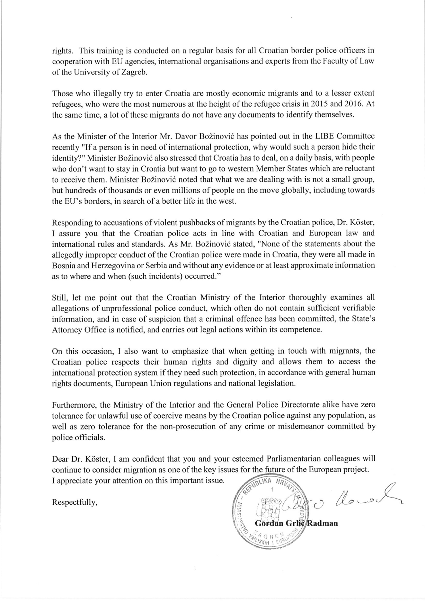
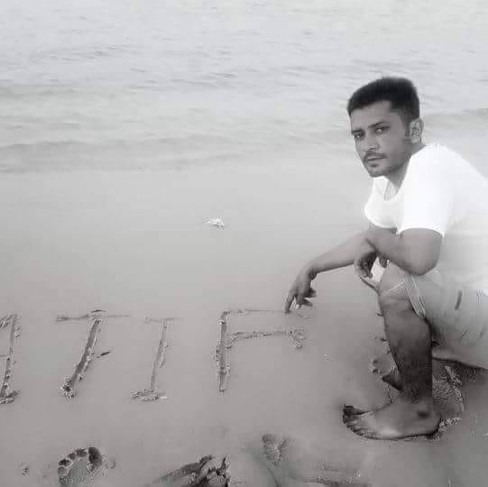

### AYS Weekend Digest 15–16/02/20 — Balkans: Police repression, violations of human rights and institutional lies
#### Protests in Tripoli, Lesvos and Velika Kladusa / Rescues in the Central Med / Further repercussions of new asylum law in Greece

Credit: [Vanja Stokić](https://www.facebook.com/vanjuska89?__tn__=%2CdC-R-R&eid=ARCXJrMySq7vxHD4Dx1AWH0Hki2BagNZvGz72orInvl2r7Wft4zSFAukAbX5uhYkMpqzlQA-T9m85RRP&hc_ref=ARR8PZIpKVv_T4eNsxldZNpYw_4bJeMLUOO4fGgP-Bmq1D4U-Yjk_0KoSV4iuyhaLIo&fref=nf)

**FEATURE: Balkans: Bosnian police respond to protest with human rights violations and repression, Croatian authorities keep spreading lies when faced with their illegal policies\.**

**Protests against living conditions in Miral \(Bosnia\)**

Protests took place on Saturday as people tried to leave the camp of Miral\. They were protesting again the appalling living conditions they are forced to endure and the brutality of the Croatian police\. The Bosnian police detained several people as a result, because there’s nothing so illegal these days as asking for your human rights to be respected\.

\(Balkan Route — Miral Camp, velika kladusa \(Bosnia\)
Refugees living in this structure, about 1000 people, protested for their rights\. They asked for better living conditions, they asked not to be beaten by Croatian police and with such great violence\.
Are they crazy requests? Are they meaningless requests? Photo Credit: [L’altra voce](https://www.facebook.com/1245970425495921/photos/a.1266360583456905/2789214561171492/?type=3&theater) \)

Some benevolent people from Velika Kladusa, the town in which Miral camp is situated, have said “the event was blown out of proportion” and that the police closed the fence in order to stop the group from getting to the border in an organised manner\. This means they have limited their right to movement, allegedly in order to prevent escalation\.

**The camps are full and people are sleeping rough, still\.**

\(There is no place in the camps in Bihac\. About a thousand people sleep outside, mostly in ruins\. They call me and say there are about 200 of them in one place\.

“ there is no doors, no windows, no electricity\. We bring the water from unai, walking to it two kilometers\. This is like on a wolf\! We don’t even have food, red cross comes 2–3 times a week\.”

They don’t ask me for anything, neither food nor money, or bags or bags… they just ask me to post these photos, to see what conditions they are in\. Photo Credit: [Vanja Stokić](https://www.facebook.com/vanjuska89?__tn__=%2CdC-R-R&eid=ARCXJrMySq7vxHD4Dx1AWH0Hki2BagNZvGz72orInvl2r7Wft4zSFAukAbX5uhYkMpqzlQA-T9m85RRP&hc_ref=ARR8PZIpKVv_T4eNsxldZNpYw_4bJeMLUOO4fGgP-Bmq1D4U-Yjk_0KoSV4iuyhaLIo&fref=nf) \)

Meanwhile, in Croatia, the lie machine continues to churn as reported by MEP, Dietmar Köster\.

> _On 4\. February, I received a reply from the Croatian Foreign Minister to my letter denouncing and demonstrating the serious abuse that Croatian border police committed to refugees at the Bosnian\-Croatian border\._ 

> _The minister justifies this practice in his response with security interests\. It is the necessary means for the Croatian border police to prevent “economic refugees” from crossing the border\._ 

> _The illegal pushbacks are a violation of numerous internationally binding conventions and must be stopped immediately\! Every day human rights are literally kicked by an EU Member State\. I don’t accept that\!_ 

LIBYA

**Ongoing Protests in Libya**

People who survived the bomb attack at Tajoura, which killed at least 44 people, are refusing to leave the GDF as they fear for their safety in the war torn country\.

SEA

**Landing in Lampedusa**

Alarm phone report that [14 people have landed in Lampedusa](https://twitter.com/alarm_phone) \. They originally reported that this boat contained 40 people and hope that this was a misunderstanding on their part\. As ever, the number of boats at sea, and the resulting deaths that too often occur, are difficult to keep track of and to verify\.

[Another report](https://www.facebook.com/252231521632595/photos/a.299900203532393/1304262139762856/?type=3&theater) states that it was 16 people who arrived, among them two pregnant women and six children, while yet [another states](https://twitter.com/AngiKappa/status/1229179149107023876?fbclid=IwAR0mjhYLBHW3Fj4aVwlMR2vJP2oukMdF5mSwyBCZyhgc6j7jd1uqYmTXq5s) “over ten”\.

**Ocean Viking back to sea**

GREECE

**Protests against new closed camp on Lesvos**

According to [local media](https://www.keeptalkinggreece.com/2020/02/15/lesvos-protest-life-jackets-migration-center/) the municipality of Lesvos together with locals have been dumping truck loads of rotten life vests on the land designated for the new closed detention centre\.

**Further repercussions of Governments new asylum laws**

While the [government celebrates](https://thepressproject.gr/o-adonis-panigyrizi-gia-tin-antiprosfygiki-apofasi-tou-edda-ke-yposchete-mazikes-epanaproothisis/) in the wake of the [ruling by the European Court of Human Rights](https://hudoc.echr.coe.int/app/conversion/pdf?library=ECHR&id=003-6638738-8816756&filename=Grand%20Chamber%20judgment%20N.D.%20and%20N.T.%20v.%20Spain%20-%20immediate%20return%20of%20migrants%20after%20unauthorised%20scaling%20of%20Melilla%20enclave%20fences%3A%20no%20violation%20of%20the%20Convention.pdf) that mass deportations can be completed in order to maintain the sovereignty of a state \(read more in our previous digest [HERE](ays-daily-digest-13-2-20-the-verdict-of-the-echr-could-be-used-to-justify-violations-in-the-future-28095b0a7cd) \), [further repercussions](https://www.keeptalkinggreece.com/2020/02/15/asylum-procedures-reduced-to-24-days-greece-migration-minister/) are becoming apparent regarding the new swift asylum procedures — while new arrivals have their claims looked at immediately \(although with limited attention and often negative results\) people who have been in Greece for years are still waiting for interviews\.

If you ever wondered what a dystopian nightmare looked like, just open your eyes to modern day Europe\.

**The ‘Migrant Job Agency’**

In a continuation of the current government’s war on the truth they are creating what may sound to many like a fantastic idea, a [Migrant Job Agency\.](https://www.keeptalkinggreece.com/2020/02/16/jobs-agriculture-refugees-migrants-greece/) Unsurprisingly, this agency will focus on agricultural labour, a sector already staffed by migrant workers who take up 90% of the labour force, many of whom are Albanian or undocumented and consequently difficult to tax\. Strange, you might say, that in a country where jobs are scarce more local people aren’t involved in the harvests\. Well, that’s probably because you are seldom paid, can even end up in debt to your foreman because you are paying an extortionate amount for your tiny, dirty living quarters and face threats of physical abuse, deportation and detainment against your will, all while working a ten hour day, seven days a week\. \( [1](http://theconversation.com/migrant-strawberry-pickers-face-deadly-risks-living-in-flammable-shacks-123576) , [2](https://www.thenationalherald.com/264808/living-conditions-for-greeces-migrant-strawberry-pickers-fire-shacks/) , [3](https://www.aljazeera.com/indepth/features/2017/03/pakistani-migrant-workers-face-exploitation-greece-170325065743630.html?fbclid=IwAR05lnwgIudlWFQzUonpAg8CDINcT8cKBnqmN0kOI0VX23EJ7e42Vbh2_Zk) \)

**Petition in support of activist facing deportation**

There is an [ongoing petition](https://secure.avaaz.org/en/community_petitions/to_the_greek_asylum_service_ministry_of_migration__greece_wants_to_deport_a_refugee_who_has_become_a_symbol_of_solidarity?fbclid=IwAR1_USgU7W9gvi0HqK7a5Ubdm-hdCjV8WdeFmSmS4t9rFwmsYukFN1RBymc) to prevent the deportation of Umer Sufyan, a young resident of Thessaloniki who has been active in solidarity projects for over two years\.

> _Umer is a fighter and a dedicated activist who has helped hundreds of others in need through his efforts even while facing numerous difficulties himself\. He is a very sensitive and serious person who embodies the values of humanism, solidarity, democracy and justice and proves it with every opportunity given\._ 

Find our more about the campaign [HERE](https://www.facebook.com/SaveUmersFuture/) \.

**Transport Strike in Athens on Tuesday 18th**

More info [HERE](https://www.livinlovin.gr/strikes-work-stoppages-in-greece-updated/?fbclid=IwAR1RgJGOsma4yj1VDtBvcPDXSIYn6C1RUkLs7k2lnTw78r8dXf2CPeoz_d8) \.

SLOVENIAN/ITALIAN BORDER

**Call to recover young man’s remains**

Atif, who drowned in the Isonzo river on December 18, 2019 was never recovered\.

\(Photo Credit: [L’altra Voce](https://www.facebook.com/L-ALTRA-VOCE-1245970425495921/?tn-str=k*F&hc_location=ufi) \)

> _Atif, who had “a happy heart”\. Atif, whose lack makes mom, sisters and cousins suffer terribly\. Atif, who had so many friends who always think about it\._ 
 

> _Atif, still in the waters of the isonzo\._ 
 

> _Atif, that we must search and find\._ 

**Find daily updates and special reports on our [Medium page](https://medium.com/are-you-syrious) \.**

**If you wish to contribute, either by writing a report or a story, or by joining the info gathering team, please let us know\.**

**We strive to echo correct news from the ground through collaboration and fairness\. Every effort has been made to credit organisations and individuals with regard to the supply of information, video, and photo material \(in cases where the source wanted to be accredited\) \. Please notify us regarding corrections\.**

**If there’s anything you want to share or comment, contact us through Facebook, Twitter or write to: areyousyrious@gmail\.com**

Following
- [Digest](/tag/digest)
- [Refugees](/tag/refugees)
- [Balkans](/tag/balkans)
- [Lesvos](/tag/lesvos)
- [Tripoli](/tag/tripoli)

_Converted [Medium Post](https://medium.com/are-you-syrious/ays-weekend-digest-15-16-02-20-balkans-police-repression-violations-of-human-rights-and-f32760db6a20) by [ZMediumToMarkdown](https://github.com/ZhgChgLi/ZMediumToMarkdown)._
