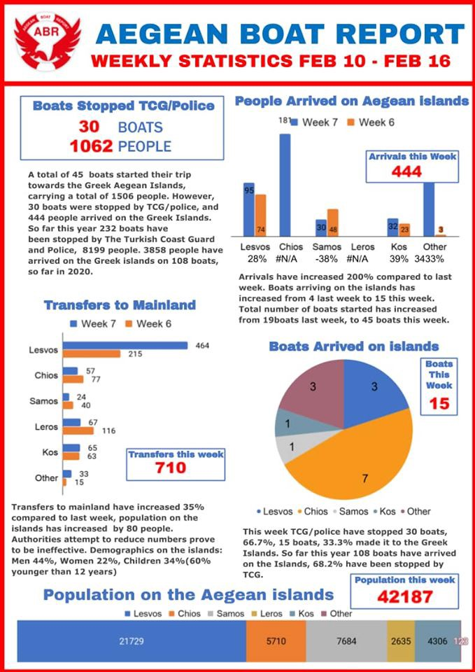

### AYS Daily Digest 17/02/2020 Asylum applications from China to Germany more than doubled in 2019

_Afghan refugees in Pakistan and elsewhere need consideration in peace deal // New wave of returnees from Lebanon to Syria // End of operation Sophia in Med // Requisition on hot spots for closed centers delayed // and more…_
#### FEATURE: GERMANY

](assets/e6f4a7cd674c/1*2h3AqZaajmphZ5uRGl4E8A.jpeg)

Uighar immigrants protest in Berlin Photo by [Getty Images/S\.Gallup](https://www.infomigrants.net/en/post/22804/china-asylum-claims-to-germany-more-than-double?preview=1581925630596&fbclid=IwAR09ygFa28zxIDJbTmmIoSiwAyQ8FjkGxxpvbt-DZKJKC2pGhEe6yigdWSs)
#### Asylum applications from China to Germany have more than doubled over the past year\.

While not a country we usually reference in our AYS Daily Digest, it is important to note that growing repression in China is resulting in a larger number of refugees to Europe\. In 2018 there were only 447 applications, but in [2019 that number grew to 962 applications\.](https://www.infomigrants.net/en/post/22804/china-asylum-claims-to-germany-more-than-double?preview=1581925630596&fbclid=IwAR09ygFa28zxIDJbTmmIoSiwAyQ8FjkGxxpvbt-DZKJKC2pGhEe6yigdWSs)

China’s suppression of ethnic minorities and people who are critical of the government is growing stronger\. **A significant number of asylum applications have come from the Uighur ethnic minority\.** There were 68 such asylum claims from people who identify as Uighur in 2018 and this figure rose to 193 in 2019\.

Uighurs are a Turkic\-speaking Muslim minority who predominately live in western China’s Xinjiang autonomous region\. Experts have reason to believe that 1 million Uighurs in the Xinjiang Automous Region are interned in re\-education camps and since 2016 repression measures and discrimination as a whole against the Uighurs has been on the rise\.
#### AFGHANISTAN

](assets/e6f4a7cd674c/1*_vp1QsU5xEfp920YKrU09A.jpeg)

Afghan refugees in a UN run centre in Pakistan in 2016 Photo by [NOORULLAH SHIRZADA/AFP/GETTY IMAGES](https://foreignpolicy.com/2019/05/09/for-afghan-refugees-pakistan-is-a-nightmare-but-also-home/)
#### As the US and the Taliban come slightly closer to brokering a peace deal, it is important to note how this could affect the lives of the [1\.5 million Afghans forced to live as refugees in Pakistan](https://www.nytimes.com/aponline/2020/02/17/world/asia/ap-as-afghanistan-refugees.html?fbclid=IwAR2EmsFcMH_Gmxz1pzc1AqkM_59buC5ejiX5rO4lEz0tykVi-ki0-z5A1j0) and all other others spread over the Middle East and Europe, seeking refuge from their war torn country\.

It is of particular importance to have a thorough understanding of just how much safer the country _might_ become, if at all\. One concern is that many European countries may further escalate their current efforts to deport Afghani refugees, in light any sweeping reports of a _safer_ Afghanistan\.

In referencing refugees who have been displaced over and over during the 40 some years of war in Afghanistan, U\.N\. Secretary\-General Antonio Guterres notes that:

> “I think this time around, the people who are still left outside will be very cautious in their judgment\. They would want to have guarantees that it can be sustainable\.” 

As part of creating a sustainable peace plan and ensuring the sustainable return of refugees, “ _the U\.N\. wants to set up 20 zones throughout Afghanistan that would offer returning refugees land to start anew, as a kind of prototype\._ ”

In Kabobayan Camp in Pakistan an Afghan refugee named Khan, who’s been displaced for 40 years, said:

> “We don’t ask for much…first we ask for peace…when there is peace, we should be provided with land on which we can build our homes first\. Then we need to have food, and then we need to be able to build our schools, our shops and our mosques\.” 

Pretty much just asking for a livelihood with dignity, like what anyone else would ever want\.
#### LEBANON\-SYRIA

](assets/e6f4a7cd674c/1*vAW-ilMyavEAzBl134Nu8g.jpeg)

A new wave of people went back to Syria from Lebanon last week\. There are voluntary returns made through the government, but also many people are forced to return, even though there is ongoing fighting in North Western Syria, because of the discrimination and absence of a proper legal framework to protect them in Lebanon\. Pictured are some Syrians on a bus in Beirut waiting to go back\. Photo by [EPA/Nabil Mounzer](https://www.infomigrants.net/en/post/22822/syrians-returned-home-from-lebanon)
#### SEA

[Alarm Phone](https://twitter.com/alarm_phone/status/1229079342531194893?fbclid=IwAR2Fgm_SGtScHUhN7JYguFhhm5PQDE7wPFitBiBW_OH1a4ZkYO8eyH1zoDo) was warned of 40 people in distress on Monday and later learned that they were picked up by the so\-called Libyan Coast Guard which was brought them back to the war zone\.
Salvamento Maritimo Humanitario \(SMH\) is looking for 5 boats with 143 people near the Canary islands\. As of this writing, no telephone contact or spottings have been made\. More [here](https://elpais.com/politica/2020/02/17/actualidad/1581966412_594939.html?fbclid=IwAR2Fa_bW92A05mwour_Dxjja_piGLKosXlWej-gBbn9VdgB0xVrKHgA5k1E) \.
#### GREECE

On Monday, [Migration Minister Notis Mitarakis](https://www.keeptalkinggreece.com/2020/02/17/greece-migration-minister-freezes-requisition-aegean-islands/) announced that the requisition of properties and land plots for the new detention centers on the five hot spots is being pushed back until Friday\. He is trying to please the locals who have reacted negatively to the requisition and to start a dialog to come up with alternatives\.

Many locals have called this move by the government as “authoritarian\.” Some are so displeased that “ _over the weekend, Lesvos authorities organized the blockade of the roads leading to the land plot where the new migration center is to be built and dumped tons of rotten used life\-vests in the area_ \.”

[Joel Hernedex’s piece in The New Humanitarian](https://www.thenewhumanitarian.org/opinion/2020/02/17/Lesvos-asylum-seekers-defuse-tensions?fbclid=IwAR1gGi9_jPLvRUEe3p4WUFIl1dLZaXMkbOvUYyyGpHHbjhi8UWQpCXaDLeI) , Head of Advocacy and Development with Refugee Trauma Initiative, brings up the important point that one of the biggest flaws in Europe’s migration policy rests on holding **“frontline states responsible for managing arrivals but denies affected communities the tools to control the outcomes of this policy\.”**

> “The situation is grievous for local communities as well \(as refugees\) \. Lesvos’ population of 100,000 includes more than 20,000 refugees, a higher proportion than almost anywhere else in the world, save Lebanon, Jordan, and other frontline Greek islands\. 

> The strain on local infrastructure is evident\. For years, raw sewage drained continuously from Moria camp to Moria village, one kilometre downstream, until the camp’s sewer was connected to the regional waste\-processing plant in 2019\. 

> Hospital staff on the island work wonders, with limited resources, to keep up with overwhelming numbers of vulnerable patients presenting complex conditions\. Limited access to educational and mental health support make it difficult for asylum seekers to integrate, leaving yawning gaps between recent arrivals and host communities\.” 

Local communities are justified in feeling aggrieved, but of course not at all justified in inflicting terror and harm onto refugees\. Far right groups that call for assaulting refugees who protested on Lesvos a few weeks ago should be investigated\. Yet a more livable solution on the islands involves working with locals and addressing these grievances, but remaining firm against prejudice and racism\.

The Greek government is trying to promote thousands of refugees to work in the country’s agriculture sector\. They are attempting to revitalize the rural economy, a fledgingly sector which most younger Greek people are not seeking jobs\. More [here](https://www.keeptalkinggreece.com/2020/02/16/jobs-agriculture-refugees-migrants-greece/) \.

In a conversation with [Christos Lazaridis of the Greek Forum of Refugees,Civil Space Watch](http://civicspacewatch.eu/greece-violence-against-migrants-volunteers-and-ngos-intensifies-in-the-islands-interview-with-greek-forum-of-refugees/?fbclid=IwAR2yTzkp_KRSkOqlTEmHqpS46u8KW3Tpt-tnhLQ085EDgOZ-q_y1G5jl9hI) asked her, _“The government just passed a law to ‘better monitor NGOs working with migrants\.’ Can you tell us how it perceived?”_

> “NGOs took up a very important role but, at this moment, they are targeted with very aggressive rhetoric concerning their transparency\. And this is how this law has been communicated\. In practice, this law will do what is necessary\. Of course, there is a need for understanding and mapping down who is operating in the camps, which is what this law is about\. Transparency must be evident, but the government has communicated about this law in a very aggressive way, implying and in times, clearly, stating that NGOs are deeply corrupted\. 

> This kind of rhetoric increases the tensions and allows for misinterpretations from people and groups that are waiting for opportunities to attack NGOs and volunteers\. We are, obviously, not against any form of transparency, because many people wish to contribute and help and they need to be properly coordinated and organized…\.This has created a very dangerous political climate\. 

> Seven people were arrested because, on 4 February, they were conducting street and house searches with batons looking for people working for NGOs in the village of Moria\. The police found their weaponry which indicated that they were acting as a “control squad”\. It has been proven that many of the people that operated in this way during those days were connected with Golden Dawn, a far — right wing party, which is currently under process for being a criminal organization, in a Trial that has been ongoing for the last 4,5 years\.” 

#### ITALY

2 quick headlines: [10 alleged human traffickers](https://www.infomigrants.net/en/post/22812/ten-suspected-migrant-traffickers-arrested-in-italy) were arresting in North Western Italy\. They have allegedly taken people from Italy to France at least 16 times\. This comes as Italy revved up its security detail on the Franco\-Italian border over the course of 2019\.

There was an attack on the only center in Sardinia for the stay and repatriation of refugees and asylum seekers\. Threats started coming in, even to the health staff, and a fire had broken out\. More [here\.](https://www.unionesarda.it/articolo/news-sardegna/nuoro-provincia/2020/02/14/macomer-ancora-danneggiamenti-all-interno-del-cpr-136-987058.html?fbclid=IwAR1OooToLKJN8YoTjtCi2EdI-hkLdWzNTp8Feu9saKeb1L_Fu3g1IcHJGfY)
#### SPAIN

In a conference [on Monday](https://elpais.com/politica/2020/02/17/actualidad/1581949679_731369.html?fbclid=IwAR07vuvVKa1RiEWxuCHCqnQHvsN4A5yQPEBHCEmgoGYDWEM__UP8B2GjwdA) , Minister Fernando Grande\-Marlaska in the Interior Commission of the Congress, talked of new concepts, such as “human security” or “model 2030” and some reiterations of many of the proposals he had already made over the last year\. He wants to raise the elevation of the fenses at the borders of Ceuta and Melilla by 30%\. He did not clarify if Spain will continue with hot returns\.

Activist [Irene Ruano Blanco](https://twitter.com/irene_r_b/status/1229470177881939969) reacted by explaining:

> “Marlaska is proud of its relationship with third countries of origin and transit to “end irregular entries\.” But he forgets that they are not partners as he calls them, they are countries with which he continues to establish a colonial relationship of consideration\.” 

#### DENMARK

](assets/e6f4a7cd674c/1*B8I5p9zk8wImtM9kaz470g.jpeg)

“One Afghan asylum seeker deported from Denmark has arrived in Kabul today morning\. Denmark is one of the countries with limited number of deportation at the moment\.” Photo by [Afghanistan Migrant Advice and Support Org](https://www.facebook.com/AmasoAfg/photos/a.1419588361404777/3082340208462909/?type=3&theater)
#### EU

](assets/e6f4a7cd674c/1*7CvOs_V8--sAirsTEyIKvg.jpeg)

Arbitrary detention in Libya: A system fueled by Europe turning a blind eye and in some cases, actively pursuing partnerships with Libya\. Photo by [Mohamed Alhmozzi](https://twitter.com/msehlisafa/status/1229386235896123393?fbclid=IwAR37VDoYjqbDuZwx2McQBf-GIndDV-Awdp-ax6m5CjoR1VFJOhos2xWUQdo)
#### European Union foreign ministers agreed on Monday to end Operation Sophia and will launch a new maritime effort that focuses on enforcing the U\.N arms embargo around Libya\. As the AP reports:

> “Operation Sophia was set up in 2015 as tens of thousands of migrants headed across the sea from North Africa to Europe\. Its aim was to crack down on migrant smugglers, but also to enforce the arms embargo, which is routinely being flouted\. 

> But tensions over how to distribute migrants picked up at sea and claims that the naval presence encouraged people to leave led Italy to block the deployment of naval vessels last year\. Austria, too, opposed the return of warships and the operation has been functioning for months exclusively using aircraft and pilot\-less drones\.” 

But of course not all agree this will be a smarter move:

■■■■■■■■■■■■■■ 
> **[Judith Sunderland](https://twitter.com/sunderland_jude) @ Twitter Says:** 

> > EU says Op Sophia will be replaced by a mission to enforce Libyan arms embargo, with boats REALLY far away to avoid having to rescue anyone at sea. I have been working on EU migration policies for years, and I am still SHOCKED by explicit inhumanity.  [apnews.com/219796f97fba5d…](https://apnews.com/219796f97fba5dc1a2c2ad29423a9ead) https://t.co/LsPBukqBg2 

> **Tweeted at [2020-02-17 16:11:46](https://twitter.com/sunderland_jude/status/1229438296318717958).** 

■■■■■■■■■■■■■■ 

**Find daily updates and special reports on our [Medium page](https://medium.com/are-you-syrious) \.**

**If you wish to contribute, either by writing a report or a story, or by joining the info gathering team, please let us know\.**

**We strive to echo correct news from the ground through collaboration and fairness\. Every effort has been made to credit organisations and individuals with regard to the supply of information, video, and photo material \(in cases where the source wanted to be accredited\) \. Please notify us regarding corrections\.**

**If there’s anything you want to share or comment, contact us through Facebook, Twitter or write to: areyousyrious@gmail\.com**

_Converted [Medium Post](https://medium.com/are-you-syrious/ays-daily-digest-17-02-2020-asylum-applications-from-china-to-germany-more-than-doubled-in-2019-e6f4a7cd674c) by [ZMediumToMarkdown](https://github.com/ZhgChgLi/ZMediumToMarkdown)._
