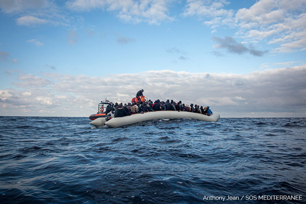

### AYS Daily Digest 18/02/20: “We hope for your help\. We just want to be free\.”
#### Fire in the Amygdaleza Detention Centre // 14 Drowned off Canary Islands // Rising right\-wing propaganda in Serbia // Misinformation in Italy // & More

### **FEATURED**

Someone set fire to the rooms in the Amygdaleza detention center in Greece Tuesday in protest of the conditions and system that keeps people trapped\. A message from one of the detainees states:

> _“I am a young man from Syria, detained in Greece\. I escaped the war in my country in order to obtain safety, but instead I was detained in Greece for a long time\. I no longer feel safe, reassured nor stable that I was looking for here in the camp\. There is nothing and they do not offer us any help\. We hope for your help\. Someone decided to commit suicide because of the difficulties he is facing here\. We just want to be free\.”_ 

■■■■■■■■■■■■■■ 
> **[Zübeyir Koçulu](https://twitter.com/zubeyirkoculu) @ Twitter Says:** 

> > Some residents of Amygdaleza detention center of Attiki reportedly set fire to their room today "in protest at conditions and the system that keeps people trapped" there. Young Syrian cries out to be "free" after he escaped the war: https://t.co/KHenmhOMIJ 

> **Tweeted at [2020-02-18 12:36:30](https://twitter.com/zubeyirkoculu/status/1229746512596545537).** 

■■■■■■■■■■■■■■ 

### SOUTH AFRICA

In seven days, the City of Cape Town will be allowed to enforce its public spaces bylaw, which prevents refugees from congregating outside church to wash clothes, sleep or make fires\. However, numerous complications mean it’s uncertain whether the group will have vacated the area by then\. The City has the responsibility of providing temporary accommodation for the group of about 600 people who currently sleep and reside there, but the City says it has no space available\.

The current order makes no provisions for the City to supply housing\. The question now is where the men, women and children in and around the church will go\. [Read More Here\.](https://www.dailymaverick.co.za/article/2020-02-18-we-have-nowhere-to-go-cape-town-refugees-fear-the-worst-after-court-grants-interdict/?fbclid=IwAR1Gc9EyDduRJ9_1sFXoJad0zC8sGYlTjlrVfL7FuLTybSYhytnUfPlv5y0)
#### GREECE

At least two boats arrived on the Greek Aegean islands Tuesday, carrying in total 72 people, according to Aegean Boat Report\.

The Greek Appeals Authority requests that the Lesbos Regional Asylum Office conducts the required personal interview with all asylum claimants\. As lawyers for 28 Africans who were not given this interview pointed out, omitting the interview based on allegedly having difficulty finding an interpreter has _no legal basis_ \. It also seems highly unlikely that authorities ever looked for interpreters as they neither used any time to search nor adhered to the standard search protocol\. The rejected applicants spoke Portuguese, which is of course an official EU language\. [Read more here\.](https://www.efsyn.gr/ellada/dikaiomata/231220_ypohreotiki-i-prosopiki-synenteyxi-sti-diadikasia-asyloy)

The situation on Lesvos continues to worsen\. On Tuesday the infamous Life Jacket Graveyard was set on fire\. Some report the fire was set intentionally\. This comes amid rising tensions between Greek residents and Moria’s inhabitants\.

■■■■■■■■■■■■■■ 
> **[Raphael Knipping](https://twitter.com/RaphaelKnipping) @ Twitter Says:** 

> > The life jacket pile on #lesvos is currently burning. Fire fighters are trying to cover it with soil using trucks and bulldozers. They also confirmed that the fire was started deliberately. #lesvosisland #lesbos #refugeesgr https://t.co/wVIVcrMS6A 

> **Tweeted at [2020-02-18 15:22:07](https://twitter.com/raphaelknipping/status/1229788190560661504).** 

■■■■■■■■■■■■■■ 

Minors in Moria are reported to be receiving spoiled food\.

And overcrowding is at an all time high, with approximately 18,342 people in a facility originally built for 2,200\. Eric Maddox from Latitude Adjustment Podcast walked through the camp filming the conditions there, earlier this week\. He decided to post about the conditions in an effort to raise awareness and combat misinformation which he believes is outweigh the potential privacy concerns most NGOs raise\.

_“The volume of ignorance and misinformation that I have encountered around the conditions in Moria has made it clear to me that visual evidence is a necessary tool for educating the public, countering xenophobic propaganda, and effectively petitioning for the rights of Moria’s inhabitants\.”_

For a more detailed analysis of what’s going on in Moria right now, find Malcom Brabant’s article on PBS [here\.](https://www.pbs.org/newshour/show/in-these-parts-of-greece-crisis-is-building-between-residents-and-migrants?fbclid=IwAR08SGR3HvEgqPqKBgtLf9Gb9gMx7e0c-SxrbZw6gULnZnhCMnltu7G_zrA)
### **SEA**

At least 300 people were returned to Libya by the coast guard yesterday, says UN spokesperson Safa Msehli\. That same harbor was later hit by shells, but so far no injuries were reported\.

■■■■■■■■■■■■■■ 
> **[Safa Msehli](https://twitter.com/msehlisafa) @ Twitter Says:** 

> > 🚨 At least 300 people were returned to #Libya by the coast guard yesterday. 

More than 1,500 #migrants fleeing abuse and escalating hostilities were returned to Libya so far in 2020. https://t.co/e0cwN65063 

> **Tweeted at [2020-02-18 10:18:23](https://twitter.com/msehlisafa/status/1229711753174552576).** 

■■■■■■■■■■■■■■ 

■■■■■■■■■■■■■■ 
> **[Tam](https://twitter.com/tamhimo) @ Twitter Says:** 

> > And this is the harbour to which the so called #Libya|n Coastguard pushed back 235 fleeing people yesterday.

With the funding and coordination of #EU|ropean authorities and its member states' military. As witnessed by @[alarm_phone](https://twitter.com/alarm_phone) and #Moonbird of @[seawatch_intl](https://twitter.com/seawatch_intl). 

> **Tweeted at [2020-02-18 13:00:22](https://twitter.com/tamhimo/status/1229752518449729537).** 

■■■■■■■■■■■■■■ 

After 3 days at sea, a boat has capsized yesterday morning and 14 people drowned, including 2 children\.

■■■■■■■■■■■■■■ 
> **[Alarm Phone](https://twitter.com/alarm_phone) @ Twitter Says:** 

> > +++ Shipwreck in #Morocco, 14 deaths reported +++ 
The #AlarmPhone was alerted to a boat moving toward the Canary Islands on February 14, carrying 28 people. After 3 days at sea, the boat capsized yesterday morning. According to survivors, 14 people drowned, including 2 children. https://t.co/G46tQBqdTF 

> **Tweeted at [2020-02-18 13:19:58](https://twitter.com/alarm_phone/status/1229757447839059969).** 

■■■■■■■■■■■■■■ 

■■■■■■■■■■■■■■ 
> **[Caminando Fronteras](https://twitter.com/walkingborders) @ Twitter Says:** 

> > Los fallecidos compartían embarcación con otras catorce personas que han sobrevivido. Trabajamos junto a los servicios de rescate para localizar a quienes siguen desaparecidos. #DerechoAlaVida 

> **Tweeted at [2020-02-18 18:24:56](https://twitter.com/walkingborders/status/1229834197432438786).** 

■■■■■■■■■■■■■■ 

Alarm phone reported receiving an alert from a boat in distress in the Malta search and research zone\. The boat was carrying 97 people who fled the war zone in Libya\.

■■■■■■■■■■■■■■ 
> **[Alarm Phone](https://twitter.com/alarm_phone) @ Twitter Says:** 

> > At night we were alerted by a boat in distress in #Malta SAR, with 97 people who fled the war zone of #Libya. We informed the Maltese authorities, but have not received info about any rescue activities. We lost contact to the people several hours ago. We hope they are safe! https://t.co/7OhWdtRKzy 

> **Tweeted at [2020-02-18 07:19:47](https://twitter.com/alarm_phone/status/1229666807981707265).** 

■■■■■■■■■■■■■■ 

In more hopeful news, MSF & SOSMedIntl teams completed a rescue of 98 people from the Mediterranean Tuesday\.

■■■■■■■■■■■■■■ 
> **[MSF Sea](https://twitter.com/MSF_Sea) @ Twitter Says:** 

> > 🔴BREAKING! In a second operation today, #MSF &amp; @[SOSMedIntl](https://twitter.com/SOSMedIntl) teams have completed a rescue of 98 people from the #Mediterranean. While deteriorating weather conditions threatened to collapse the rubber boat’s fragile structure, all survivors were safely evacuated to #OceanViking. https://t.co/iZS9JxDO95 

> **Tweeted at [2020-02-18 19:20:31](https://twitter.com/msf_sea/status/1229848187013341185).** 

■■■■■■■■■■■■■■ 

### SERBIA

Serbia’s right\-wing opposition party launched an anti\-immigration campaign on Tuesday, warning that the country risked becoming “the biggest migrant center in this part of Europe,” despite statistics that show the vast majority of people who enter Serbia pass through quickly en route to Western Europe\.

■■■■■■■■■■■■■■ 
> **[ДВЕРИ](https://twitter.com/SPDveri) @ Twitter Says:** 

> > Караван Двери за уторак, 18. фебруар 2020. године
▪️Мрчајевци 10 ч
▪️Градски трг у Чачку 13 ч, а КЗН Бошка Обрадовића у 14 ч https://t.co/W7c2cCi1Gg 

> **Tweeted at [2020-02-17 15:12:04](https://twitter.com/spdveri/status/1229423273827610624).** 

■■■■■■■■■■■■■■ 

Serbia’s Commissariat for Refugees and Migration has repeatedly disputed Obradovic’s immigration claims\. Of the hundreds of thousands of people from Asia, Africa and the Middle East who have entered Serbia en route to Western Europe since 2015, “no one is in the country anymore,” the Commissariat said in a statement carried by the daily newspaper Danas\.

_“In Serbia today, 5,638 migrants are housed in reception and asylum centers, and they all want to move on\.”_

To learn more about the official reports on the situation in Serbia, you can also read UNHCR’s recent report [here\.](https://reliefweb.int/…/reliefweb…/files/resources/74066.pdf)
### HUNGARY

In a brief press conference following a visit to Hungary’s southern border fence near Röszke, Prime Minister Viktor Orbán warned of a growing, more organized migration pressure as the weather gets warmer\. Meeting with his Slovak counterpart, Orbán thanked Slovakia for their support in guarding the Schengen border\.

_“Here we don’t only protect the Hungarian border, but also the Slovak\. This is a difficult job, one that we wouldn’t be able to carry out without help from our allies\.”_

Orbán then argued to press that the Hungarian border “was not closed” and that in fact life would be easy for people on the move if they would “behave accordingly\.”

He finished by saying, “Recently \[migrants\] have begun storming the fence in groups; it was the first time \[border guards\] had to fire in the air,” PM Orbán said\.
### **ITALY**

Update people on the move in Italy: Beware Misinformation

■■■■■■■■■■■■■■ 
> **[Ero Straniero - L'umanità che fa bene](https://twitter.com/Ero_Straniero) @ Twitter Says:** 

> > ❗Questa è una truffa 👇

Non c'è stata nessuna sanatoria e non esistono kit da compilare per avere il permesso di soggiorno!

❗️Attenzione a chi dice o scrive cose non vere. https://t.co/JFDjypICaR 

> **Tweeted at [2020-02-18 14:28:02](https://twitter.com/ero_straniero/status/1229774578819502082).** 

■■■■■■■■■■■■■■ 

### DENMARK

The Danish government has recently made the decision that no Syrians will be returned by force to Syria even though the Government has previously deemed the security situation in Syria to be safe “enough\.”

_“For various reasons, we do not believe that we can return Syrians by force\. Even if this is something we would like to be able to do, as it applies to other asylum seekers\.”_

Denmark has reportedly taken this decision because they refuse to collaborate with Bashar al\-Assad and his regime\. This type of collaboration would be a prerequisite for deporting rejected asylum seekers if they do not want to leave voluntarily\. For now, if rejected asylum seekers do not leave voluntarily, they must stay in an exit center under further appeals are heard\. Read more about the decision [here\.](https://nyheder.tv2.dk/politik/2020-02-18-regeringen-dropper-at-tvangshjemsende-syrere?fbclid=IwAR2lIkJSEn37eHkMHQlHaf8hjjDPh13L6vCjGOO9wov4dfMsTAzAlQ-omLg)
### SWEDEN

The Migration Agency last week made a clarification about the high school act and what “active participation” in Swedish, “aktivt deltagande” means in relations to asylum seekers and refugees\. Active participation is mandatory in order to get the temporary residency permit prolonged because of high school studies\. Before, it was measured by grades and exam results\. Therefore, students could thereby be eligible to stay in Sweden even if one or two grades are missing\.

Many teachers and headmasters are still critical\. According to professionals that Ekot spoke to, there are still room for interpretations of what active participation actually means: which means that students in different schools still can have different chances to get their residency prolonged\. Some political parties are unhappy and would like to see austerity measures used instead\. [Read more here\.](https://sverigesradio.se/sida/artikel.aspx?programid=83&artikel=7408365&fbclid=IwAR25Vw2AuMWb5ohJYwJcwVRpLUj58-ZwL2vMx3BShdbF-2be9JDszP0lJnE)
### **EU**

Info Migrants has put together a list of the most frequently asked questions and answers regarding asylum\. With a team of Lawyers they covered topics from pregnancy and deportation to family relocation\. Read the whole article [here](https://www.infomigrants.net/en/post/22852/family-and-migration-your-questions-answered?fbclid=IwAR31MxNSSvu7Sd0dgr8U_82SNghtjT3ogY2x3440GA1OsgCORrjstLW93fA) \.

> “There is a lack of strategy and coherence in the management of mobility policies by the Commission and the Member States, especially as regards Africa and the Mediterranean\.” 

In the European Union budget proposal or 2021/2027, funds for Migration, Asylum and Border are expected to increase from 13 to 35 million euros\. A new maxi\-fund has allocated 90 billion euros to development efforts and requires that at least 10% of expenditure is allocated for the management of international migration\. Humanitarian organizations working on the protection of the rights of people on the move and on development cooperation as they believe it is impossible to delegate border control in exchange for resources\.

For more in depth coverage, read [here](https://www.redattoresociale.it/article/home/l_ue_aumenta_i_fondi_per_la_gestione_delle_frontiere_ong_nessuna_emergenza_?fbclid=IwAR0tFFVfYDHlbZLRCZNQIW9imYfKqUj2sMQfpqx_chWrggSlo6cfSPcdOzw) \.
### UNITED KINGDOM

The High Court was scheduled to hear the latest instalment in the legal challenge launched by human rights charity Detention Action over individuals being denied access to justice in Immigration Removal Centres \(IRCs\) before their planned removal to Jamaica\.

On 3 February 2020, Detention Action issued its legal challenge over the Home Office’s failure to provide effective access to legal advice to those held in Immigration Removal Centres \(IRCs\) \. The challenge followed ongoing mobile phone signal outage in the Heathrow detention centers, which left those facing imminent removal from the UK unable to contact their solicitors or NGOs that assist with referrals to solicitors\.

In response the Home Office was forced to acknowledge that it has been aware of a mobile phone outage since 13 January 2020, potentially affecting hundreds of people held in detention, including those facing imminent removal to Jamaica\. The Home Office was further forced to admit that it did not begin issuing working SIM cards until 5th February, missing the crucial window leading up to removal flights during which access to legal advice is vital\.

The hearing comes amid a flurry of public attacks on the judiciary and the rule of law following Lady Justice Simler’s judgment, with the Prime Minister reported to be “furious” and Dominic Cummings branding it the “perfect symbol of the British state’s dysfunction\.”

**Find daily updates and special reports on our [Medium page](https://medium.com/are-you-syrious) \.**

**If you wish to contribute, either by writing a report or a story, or by joining the info gathering team, please let us know\.**

**We strive to echo correct news from the ground through collaboration and fairness\. Every effort has been made to credit organisations and individuals with regard to the supply of information, video, and photo material \(in cases where the source wanted to be accredited\) \. Please notify us regarding corrections\.**

**If there’s anything you want to share or comment, contact us through Facebook, Twitter or write to: areyousyrious@gmail\.com**

_Converted [Medium Post](https://medium.com/are-you-syrious/18-02-20-ays-daily-digest-we-hope-for-your-help-we-just-want-to-be-free-e0e0a6fb1d4c) by [ZMediumToMarkdown](https://github.com/ZhgChgLi/ZMediumToMarkdown)._
