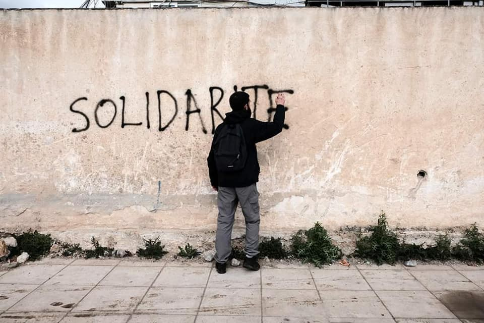
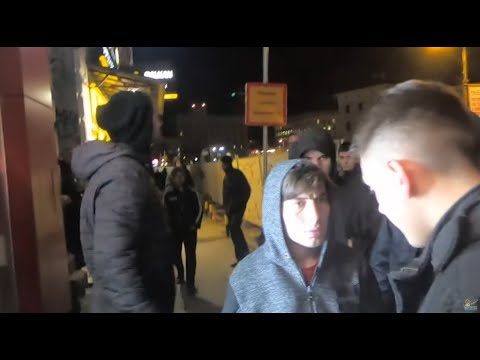
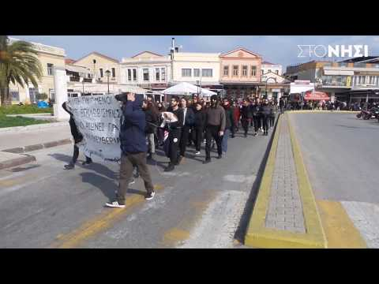
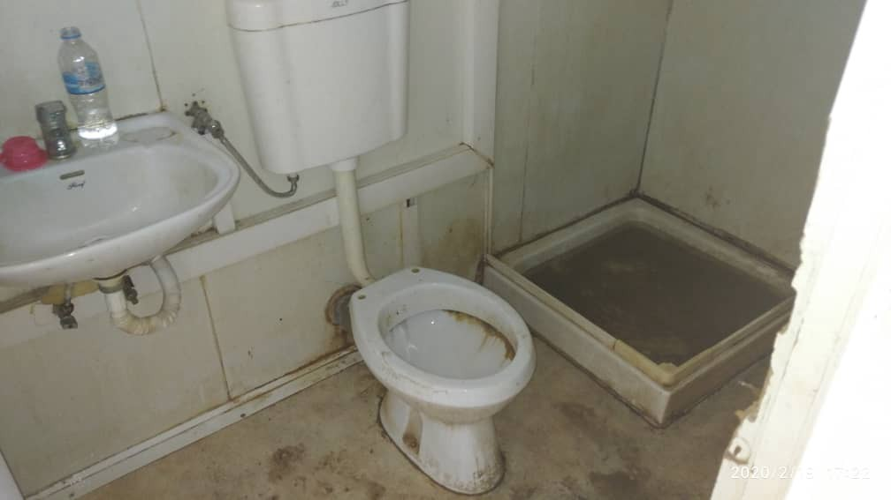

### AYS Weekend Digest 22–23/2/2020: Fascists patrol the streets of Belgrade

Far\-right activity in Serbia / Anti\-fascist protests across Greece / Finnish governments plans to accept 175 refugees / Update from the Latitude Adjustment Podcast\.

Credit: Marios Lolos
### **Feature**

[A video circulating](https://www.slobodnaevropa.org/a/30449807.html?fbclid=IwAR2g0AUZmoGNyFkyQEOiPyafytDwfzHcoOQisRJwFUkqvBKr8qwfIgkqFpI\) on social media has shown a group of 20 hooded men patrolling the streets and parks of Belgrade and confronting migrants and refugees during the night\. Known as “No Surrender of Kosovo and Metohija”, the group announced that they will begin daily patrols of Belgrade\.

Within the video description, it states that pamphlets were distributed to refugees and migrants in Serbian, English and Arabic that read:
“Because of the frequent sick attacks on Serbian women and girls, you are prohibited from moving outside the migrant centres from 10 pm to 6 am, and moving more than three people in a group during the day\. Attacks on our citizens will not go unpunished\.”

The Serbian Interior Ministry \(MUP\) has informed the prosecution of the so\-called “national patrols” by the organisation, and have been instructed to examine the facts surrounding the case\.

### Serbia

A Facebook group called ‘United Citizens of Subotica” [was uncovered](http://voice.org.rs/subotica-grupa-gradana-koja-siri-lazne-informacije-pozvala-na-protest-protiv-migranata/?fbclid=IwAR2A0bTEbPNPov6xsgWkZ3k7Xh3zc1Dh7LXJAnUd3k_XDhP0TmZOSwilFaA) that has been encouraging protests against migrants in Subotica and Serbia\. The public Facebook page founded in October 2019 now has over 5,000 likes \(4,338 in the past 30 days\) and is averaging over 20 posts per day\. This is yet another example of the growing visibility of far\-right and fascist groups across the Balkans and Europe\.

A now banned Youtube video calling for an anti\-migrant protest to be held on the 29th was shared across the group\. The video claimed “the world we know is disappearing, the Islamist invasion of Europe and Serbia is obvious\. Do we leave our children and grandchildren with jihad warriors, masked ‘refugees’\. The corrupt government is rattling and pretending to be normal\. The police hands are tied, the Islamists are above us, our laws and the Constitution\. They will settle jihad fighters in our Serbia\.”

One of the administrators of the group wrote in a post “If we are united and persistent we will cleanse our city and our country from the evil that comes to us and we will be able to walk the streets of our beautiful city normally\! We will persevere in this fight because I believe in the people who started this story, and I hope all of you will help us clean up our city and our country\! It will be easy, it will NOT be\! But we will not give up\.”
### **Greece**

[On Saturday 22nd February](https://www.stonisi.gr/post/7072/antiratsistikh-kinhtopoihsh-allhleggyhs-sth-mytilhnh-pics-video?fbclid=IwAR0bcvknVs-gDH1kMbekMVlanZCFsXxyeaw3Do5wQP_4u6fUyO803BfweH0) , as part of the Pan\-Hellenic Day of Action against Racism and Fascism a solidarity march and rally was held in the city of Mytilene, Lesvos, and on the islands of Samos and Kos\.

In Mytilene, it was reported that the rally was called with announcements by the local movement “Disobedient Mytilene”, the Anti\-Fascist Lesvos Coordination and the NGO Workers’ Assembly in Lesvos\. At 1 pm local time, participants started marching through Ermou to the Upper Stairs and then progressed to the General Secretariat of the Aegean and Island Policy where they stood shouting slogans declaring their solidarity with refugees, immigrants and their opposition to nationalism, war and fascism\.

Additionally, in an apparent attempt to curb the ongoing protests occurring around Greece, this weekend it was [announced](https://twitter.com/BrunoTersago/status/1231623769992704000?s=19&fbclid=IwAR1I1CEGXn8MVQuZLzbPmGhKIFxCrW5BfQrlYRw5IagH0LkQukoxRSlLgqA) that the Greek government will send 14 squads of riot police from Athens and Thessaloniki to Chios \(7 squads\) and Lesvos \(7 squads\) as part of its plan to immediately begin construction work on the new detention centres\.

The UNHCR is concerned that hundreds of unaccompanied children in Greece –already experiencing hardship–will be exposed to greater risks after a guardianship programme, ended at the start of this year but has not been replaced yet by a planned Governmental scheme\. The programme was supported by UNHCR with the Ministry of Labour and NGO METAdrasi
— [@rspaegean](http://twitter.com/rspaegean)

](assets/32df1335f497/1*waK3fkGNzImD8gg__M8CGQ.jpeg)

Broken and unsanitary bathroom facilities at Amygdaleza\. Credit: [The Crisis Isn't Over](https://medium.com/u/943d9fd29334)

Medium page [The Crisis Isn't Over](https://medium.com/u/943d9fd29334) reports on the recent protests and appalling conditions in Amygdaleza, an immigration detention centre on the outskirts of Athens\. The report highlights how the conditions are unsanitary and overcrowded with broken facilities throughout\. [The Crisis Isn't Over](https://medium.com/u/943d9fd29334) also reports on the multiple suicide attempts that have been made in Amygdaleza, arguing that they were all preventable if the appropriate medical care had been provided at the time\. To read the full report please see:

### **Finland**

The [Finnish government has announced](https://www.helsinkitimes.fi/finland/news-in-brief/17355-finnish-government-agrees-to-take-in-175-refugees-from-mediterranean-camps.html?fbclid=IwAR33cmhlwVKz6Iyu3RlvB9rPpBlDM2j_gfvCPY_P2OKLHdW_8jywAJDb7OE) their plans to ‘take in’ 175 refugees from camps in Greece, Italy and Cyprus\. Whilst the Interior Minister Maria Ohisalo claimed that the decision was humanitarian and showed ‘that Finland respects human rights’, the ministry announced that they believed that the costs of relocation of the 176 asylum seekers would be covered by the European Asylum, Migration, and Integration Fund \(AMIF\) \. People from Afghanistan and Syria will be prioritised over other groups or nationalities\.

Whilst the Finnish government’s plan to accept 175 refugees is welcomed, by comparison, the Greek camp of Moria, a single camp from one of three countries selected by the Finnish government, is estimated to be 16,000 people over capacity with current estimates of the total number of people being around 19,000\.
### France

### Border Violence

[The Border Violence Monitoring Network](https://www.borderviolence.eu/violence-reports/january-10-2020-0020-bogorodica-north-macedonia/?fbclid=IwAR1PFX4jKEOrnidnrdx6erpysabtFe5d7rOLIiDTYXDrUQQbU5tB_99s0FY) report on the ongoing violent push backs occurring across the Balkans:

> On Friday, the 10th of January 2020, the respondents attempted to cross the Greece\-Macedonia border in a transit group of 107 people\. The respondents were three Moroccan men aged 22yrs, 27yrs and 29yrs old\. The transit group crossed the Greece\-Macedonia border by train, travelling from Thessaloniki, Greece\. 

> The transit group of 107 people comprised of Algerian, Syrian, Pakistani, Palestinian and Afghan people ranging from the ages of 20–35yrs old\. There were two women in the transit group from Palestine and Syria\. At around 20:00 in the evening, the transit group were stopped by approximately 30–40 police officers when the train arrived in Macedonia \(close to the town of Gevgelija\) \. 

> The police officers were wearing a uniform that read ‘POLIZI’ and had Czech flags on the arms\. The respondent recounts the presence of many large police cars as well\. The police officers beat the transit group using batons\. The respondents explain that they were beaten with batons all over their body\. The respondents’ bags were taken by the officers and were threatened with more beating if the group did not leave\. 

> One of the respondents explains that the officers also stole 100 euros from his friend\. The officers asked the respondents for their identification papers to which they responded that they did not have any\. The respondents explain that the police officers took their cigarettes and lighters as well\. The respondents were returned to Greece the same\. 

### **Turkey**

[Footage has been unearthed](https://ahvalnews-com.cdn.ampproject.org/c/s/ahvalnews.com/turkish-airlines/turkish-police-wraps-man-plastic-boarding-plane?amp&fbclid=IwAR1yFBxo8i9GsRx5-Icd3QPOaSaP0kdp-PS4d4P54t-cPAxqgqU6168j_Sk) by news site France 24 of a 47\-year old man being wrapped in plastic by Turkish authorities before being placed on a deportation flight to Cameroon\. The video shows the authorities placing a small blanket over the plastic wrapped body of Emmanuel Fosso Someon Chedjou in an attempt to hide it from other passengers\. Once on the plane Chedjou and the other people around him protested his treatment and recorded it on their phones\. Chedjou claims that the officers wrapped him in rolls of plastic and scotch tape, tied his wrists and ankles, stuffed his mouth with tissue and beat him\.

■■■■■■■■■■■■■■ 
> **[Ehuzu D. Gbèmènou](https://twitter.com/Ehuzud) @ Twitter Says:** 

> > @[_AfricanUnion](https://twitter.com/_AfricanUnion) @[africaupdates](https://twitter.com/africaupdates) @[AFRICANGLORY](https://twitter.com/AFRICANGLORY) @[AFRICA24TV](https://twitter.com/AFRICA24TV) @[africaradioOFF](https://twitter.com/africaradioOFF) #Cameroun @[rdussey](https://twitter.com/rdussey)  Expulsion d'un africain avec Turkish Airlines... https://t.co/OsQWyaMh0O 

> **Tweeted at [2020-02-17 11:21:49](https://twitter.com/ehuzud/status/1229365329727512576).** 

■■■■■■■■■■■■■■ 

### Syria

Mazen Alhummanda, Syrian political activist and former detainee, returned to Syria after contacting the Syrian embassy in Berlin\. [Reports indicate](https://twitter.com/HassounMazen) that Alhummada was arrested upon arrival at Damascus international airport\. It is yet unclear why Alhummada who was previously arrested and tortured 3 times before fleeing Syria was returned to the country\.
### **Latitude Adjustment Podcast**

Eric Maddox, from Latitude Adjustment Podcast, posted a walkthrough of Moria refugee camp, highlighting the terrible conditions and overcrowding that its residents are forced to endure\. Are You Syrious and the Latitude Adjustment Podcast are working on an upcoming five\-episode special set to be released later this year\.

**Find daily updates and special reports on our [Medium page](https://medium.com/are-you-syrious) \.**

**If you wish to contribute, either by writing a report or a story, or by joining the info gathering team, please let us know\.**

**We strive to echo correct news from the ground through collaboration and fairness\. Every effort has been made to credit organisations and individuals with regard to the supply of information, video, and photo material \(in cases where the source wanted to be accredited\) \. Please notify us regarding corrections\.**

**If there’s anything you want to share or comment, contact us through Facebook, Twitter or write to: areyousyrious@gmail\.com**

_Converted [Medium Post](https://medium.com/are-you-syrious/ays-weekend-digest-22-23-2-2020-fascist-patrol-the-streets-of-belgrade-32df1335f497) by [ZMediumToMarkdown](https://github.com/ZhgChgLi/ZMediumToMarkdown)._
