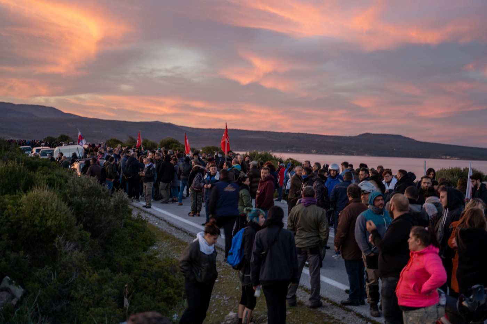
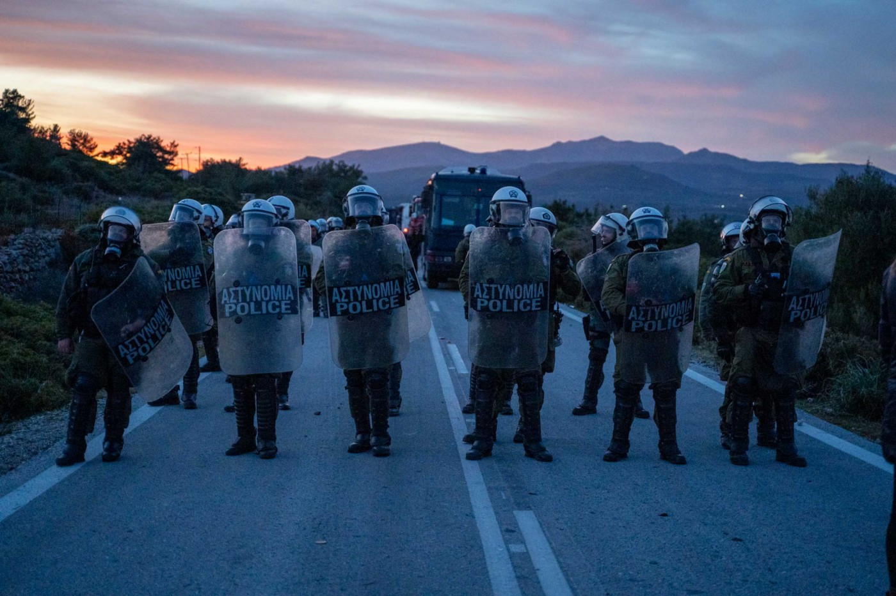
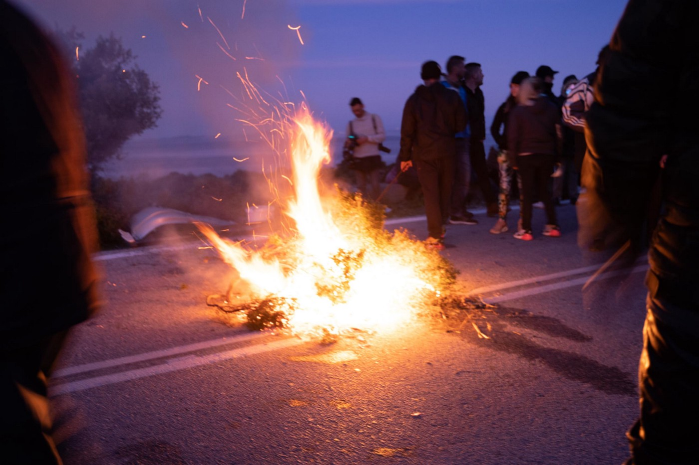
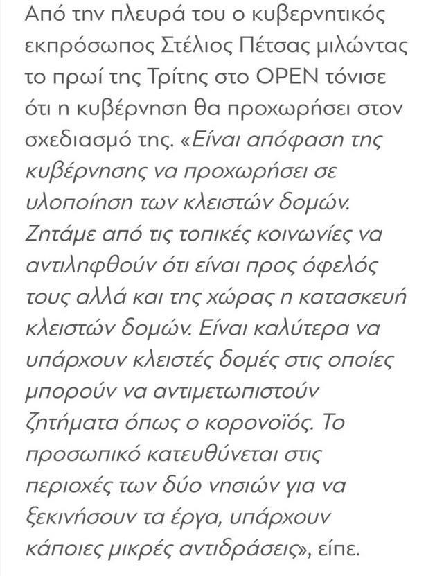
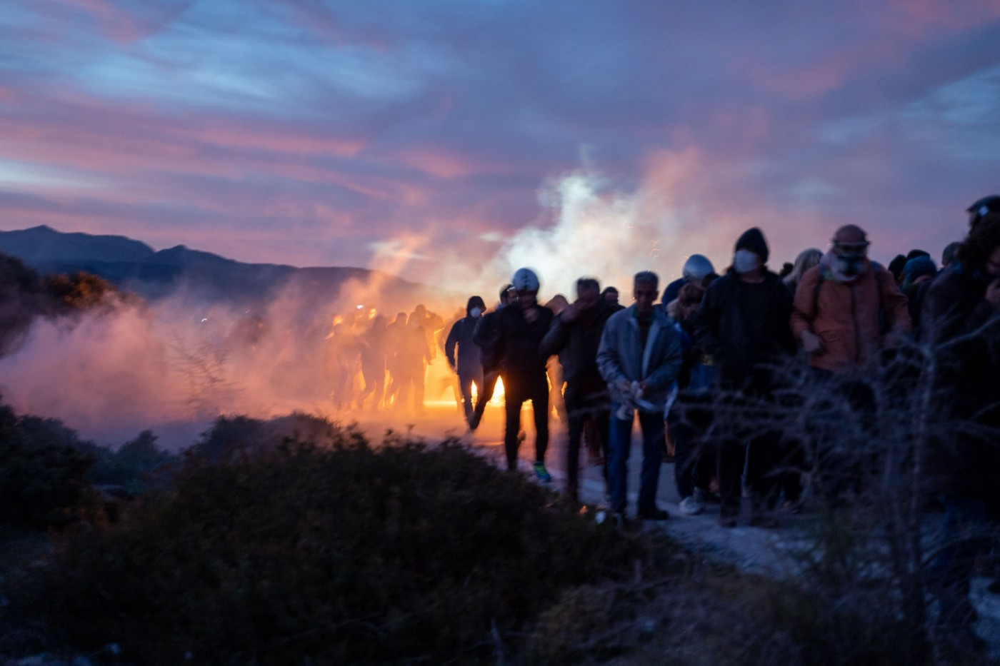
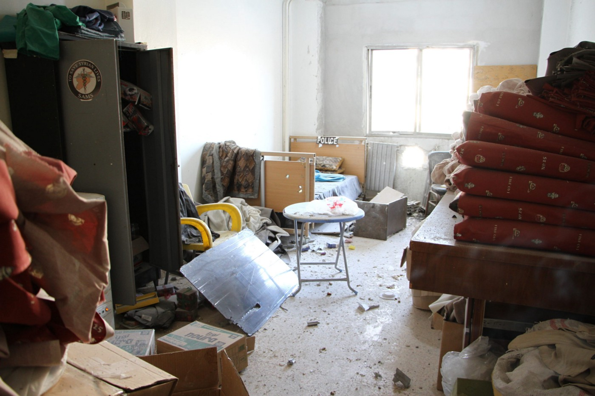

### AYS Daily Digest 25/2/20: 5,000 protest over new detention centre
#### Protest and police crackdown in Chios / Open letter to the Greek Prime Minister on Unaccompanied Minors / Search and Rescue Updates from the Libyan Coast / Attack on Hospital in Idlib

Lesbos\. Photo Credit: Erik Marquardt
#### FEATURED

More than 5\.000 people protested on Chios today against the violence from the riot police\. They announced their decision to continue the fight against government planning for the construction of a Closed Migrant Center\.

The local protesters tried to prevent authorities from bringing excavating machines from the mainland to build new detention camps on the Aegean islands of Lesvos and Chios, which caused a riot\. Roadblocks have been erected on the main road by cars of the Municipality of West Lesvos\. Also, reportedly, the protesters set fire to trash bins and used municipal garbage trucks to try and block off the port area\.

Lesbos\. Photo Credit: Erik Marquardt

During Tuesday, police cordoned off areas around roadblocks set up over the past few days by demonstrators\. Police on Chios also used tear gas and flash grenades, so several people, including the mayor of Chios and the president of the Chios Clergy Association, ended up hospitalized\.

Lesbos\. Photo Credit: Erik Marquardt

> Today’s crackdown is another aspect of the implementation of the toxic EU\-Turkey deal that came into effect in 2016\. The deal had catastrophic consequences turning the islands into prisons, destroying the residents’ solidarity towards refugees and targeting volunteers and organizations supporting refugees\. The EU and other member states shift the responsibility once more to Greece without considering the destabilization and polarization of an already unmanageable situation in the Aegean islands region\. This policies only fuel racism\. — [**Refugee Support Aegean Pro Asyl**](https://rsaegean.org/en/refugee-support-aegean-and-pro-asyl-stand-side-by-side-with-the-residents-fighting-against-the-creation-of-the-detention-centres/?fbclid=IwAR2JmBrsuRMtq0wWq9FE4qY3nCb489-ku-h331eSFphrReGiv9gxLm63bt0) 

The Greek government spokesperson Petsas have been spreading words linking the Corona Virus to the concentration of refugees and migrants on the islands, so the latest official explanation for such a sped up and defensive action said that “proper health checks couldn’t be carried out at existing overcrowded camps”, so they had to hurry with the already announced construction of the new detention facilities that neither the locals want to host, nor the people want to stay there\.

Lesbos\. Photo Credit: Erik Marquardt

> We need them to be processed, we need them to move on\! 

— telling both about the mainstream Greek media silence and attempts of hiding the police actions, and also about the fear of many locals that the widespread use of teargas will ignite forest fires in the area, locals are calling for help and support to both people stuck on the islands and the locals, who are not being heard by neither the Greek government nor the European Union\.

Aphrodite has been in the forefront of helping refugees from the beginning of the large arrivals in 2015, and her words are directed to the Greek government as well as to the EU:

> Our children say they don’t believe in their country anymore\. We tell them to have faith, while trying to hold on to our own\. The islands of the Northern Aegean tonight are paying the price of Europe’s and Greece’s betrayal\. MAT special forces, Police, Army forces and endless machines vs the islanders who want decongestion of the Moria camp via fair distribution of refugees throughout Greece and Europe and for all our lives to go back to “normal”, to whatever extent that may be\. 

> I feel ashamed of the representatives in the Greek and European Parliament\. 

> Let it be known that our voice WILL BE heard and we WILL NOT give up EVER\. What happens from this moment on is upon you\. 

#### GREECE

19 civil society organizations have sent an open letter to the Greek Prime Minister, requesting a solution for the serious issue of the protections of thousands of unaccompanied minors in Greece\.

Among other things, they stress out that the long\-term accommodation places for children continue to be far fewer than those required, in spite of the fact that there was an increase of 182 places in 2019, bringing the total number of places to 1,286 at the end of January 2020\.

> 187 children are under detention 

— although the practice of “protective custody” has already been ruled by the European Court of Human Rights \(ECtHR\) as being in breach of the European Convention of Human Rights\.

> In the last year alone, the ECtHR condemned Greece for the protective custody of minors in successive judgments delivered by the Court\. Finally, 1,077 unaccompanied children continue to live under precarious conditions or are homeless, with all the risks that this entails for their safety and welfare\. 

They ask the prime minister to ensure:
- The institution and operation of a single system for children’s protection, which shall support and protect all children, irrespective of their legal status and origins, until they enter adulthood at least\.
- The immediate transfer of unaccompanied children from the Reception and Identification Centres on the islands to mainland Greece with a simultaneous increase of the number of places in shelters with special care given to the creation of spaces that are not of a temporary nature and which promote the implementation of alternative housing schemes, such as Semi\-Autonomous Supported Living schemes\.
- The implementation of Law 4554/2018 on the guardianship of unaccompanied children as soon as possible, with an immediate provision covering the transitional period until the full implementation of the legal framework, so that children do not remain without a Guardian\.
- Putting an end to the “protective custody” of children in detention centres, police stations and other facilities throughout Greece, which constitutes a blatant violation of the fundamental rights and has resulted in our country’s conviction by the European Court of Human Rights\. Moreover, their immediate transfer to appropriate structures\.
- The obligation to examine requests for international protection of all unaccompanied children, irrespective of age, with the regular rather than the fast track procedure\. Taking into account the principle of best interest of children, we are requesting the amendment of the provision of article 75\(7\) of Law 4636/2019, to include unaccompanied children in the regular procedure\.

The entire letter can be found [here\.](https://rsaegean.org/wp-content/uploads/2020/02/Letter-PM-25-02-2020_2_ENG.pdf)
#### SEARCH AND RESCUE AT SEA

At 11\.20 am Sea Watch 3 received a mayday call on the radio\. The connection was too bad to understand any detail\. They have been trying to find out more about the case in order to be able to help\. As they have reported, the Italian and Maltese MRCCs deny having any information although it is their duty to monitor the emergency channel\. However, Italy has later assigned Messina as the port of safety for [t](https://twitter.com/hashtag/SeaWatch3?src=hashtag_click) he SAR vessel\.

> We are on the way there and we are glad to finally be able to bring our guests to safety\. — [Sea\-Watch International](https://twitter.com/seawatch_intl) 

The Sea Watch 3 is now heading north to bring the **194 people on board** to safety, but two other boats are in distress off the Libyan coast\.

■■■■■■■■■■■■■■ 
> **[Alarm Phone](https://twitter.com/alarm_phone) @ Twitter Says:** 

> > Alle 19.44 ci ha chiamati una barca in pericolo con 85 persone in fuga dalla #Libia. Erano quasi nella zona SAR di #Malta ma abbiamo perso contatto e non sappiamo cosa sia successo. Tutte le autorità sono informate ma @[Armed_Forces_MT](https://twitter.com/Armed_Forces_MT) rifiutano di intervenire. Urge un soccorso! https://t.co/rW7HqAM0Mv 

> **Tweeted at [2020-02-25 22:24:11](https://twitter.com/alarm_phone/status/1232431122287616001).** 

■■■■■■■■■■■■■■ 

#### ITALY

In her [letter addressed to Italian Foreign Minister Luigi Di Maio](https://www.coe.int/en/web/commissioner/-/commissioner-urges-italy-to-suspend-co-operation-activities-with-libyan-coast-guard-and-introduce-human-rights-safeguards-in-future-migration-co-opera) , Council of Europe Commissioner for human rights Dunja Mijatović urged the Italian government to “introduce human rights in the Memorandum of Understanding between Italy and Libya”\.

■■■■■■■■■■■■■■ 
> **[Commissioner for Human Rights](https://twitter.com/CommissionerHR) @ Twitter Says:** 

> > Italy should suspend co-operation activities with Libyan Coast Guard and introduce #HumanRights safeguards in future #migration co-operation 
Read my letter to #Italy’s Minister of Foreign Affairs @[luigidimaio](https://twitter.com/luigidimaio) [coe.int/en/web/commiss…](https://www.coe.int/en/web/commissioner/-/commissioner-urges-italy-to-suspend-co-operation-activities-with-libyan-coast-guard-and-introduce-human-rights-safeguards-in-future-migration-co-opera) 

> **Tweeted at [2020-02-21 09:07:58](https://twitter.com/commissionerhr/status/1230781193865637888).** 

■■■■■■■■■■■■■■ 

However, the Italian government saw the ‘decrease in deaths in the Mediterranean’ \(which has dropped by roughly 60% — from over 5,000 in 2017 to under 2\.000 in 2019\) as a positive reinforcement, claiming that it “tells us that we must continue to work in this direction rather than disengage ourselves from this country”\.
### Rome — Training project for children

The training courses, all focused on the acquisition of digital skills to work in the non\-profit sector of social and culture, have a duration of 80 hours and will be held **from March to the end of May 2020** , at the end of the course for all children is A 6\-month internship, paid monthly, is foreseen in the network of Scalabrinian institutions\. Registration by March 2, 2020\.
More information: [www\.cser\.it](http://www.cser.it/)

[**viaggioidaimparare\.it**](https://viaggidaimparare.it/) — A project intended for teachers and school children as “in Italy the knowledge of the phenomenon very often is limited to the aspects relating to the landing of migrants and asylum seekers\. Few people know the reasons that drive these people to leave their countries, the difficulties related to travel and the violence they are forced to endure in transit countries\. This absence of knowledge determines a distorted view of the phenomenon which over time risks fueling discriminatory attitudes towards asylum seekers and refugees “
#### AUSTRIA

Earlier in the morning, the [Afghanistan Migrants Advice & Support Org](https://www.facebook.com/AmasoAfg/?__tn__=kC-R&eid=ARAwZHi2HUIM4iGe5j0OsLS6lbYlWHBpGnw1J6XKdXAGVfwcIqtljTp5898LaSIk6pFgLlosyM_mqaMr&hc_ref=ARQQ5yGvTrCxqZpA6DtTgKlbA0SPMBgvuYCbgEIicY8tKczXIBG4Q56zVq07ccXlcsw&fref=nf&__xts__%5B0%5D=68.ARDpNsqYCj2iYw5_52vRVzuqXM2d0Ks1Y0vkYYZcLKqICCs0YI5hOlo6cczt_CFmF_WxV01zJPQ4dTljsbvF70hCQ22eqEwR2G-ZVFtFzRaAedBoX-cyECCRNXYNQxqn2YZnnBAEvOheP7H-OtnbJVhUc7JBjhJ8txGqwAtCTBugVVmHVOWqrtMlVV_CiueH5wmp88eiQIdeVl9qO1Q9spvWfS_Pll9rf8Dc0W4-Qo6l1SkUiWz8YpGe5tNkmePmgdfe9gd-btZhRKOXZntDF_rqHBzz7fP4hoYJXA4mlZ6LXwhFJBQk_-xrMeygQ9YaIAe4J7uD3fgyXpnV7PONqSitTw) team published that and unconfirmed number of Afghan asylum seekers would be deported from Austria to Afghanistan in the evening\. We still have no updates on that, but there are some indications that the next deportation flight might take place on March 15\. If you have more information on this, please let us know so we can inform more people\.
### U\.K

[Refugees at Home](https://twitter.com/RefugeesAtHome/status/1232335165294288896/photo/1) , a UK based charity that connects people who have a spare room in their home with asylum seekers and refugees who need accommodation are in desperate need of an Oxford\-based host to help accommodate a young man for a month or two\.

@RefugeesAtHome
### Syria

[A direct target attac](https://www.sams-usa.net/press_release/civilians-civilian-infrastructure-in-northwest-syria-face-heightened-attacks-ten-schools-one-hospital-attacked-today/?fbclid=IwAR0c_00Ba0FWq1uhqatnURg1ubcLzm51SuFhIcZlL3BAsySuvoWbspFrKMM) k on the Idlib Central Hospital has caused major structural damage and injured 4 health workers\. In addition to the attack on the medical facility that occurred on February 25th, 10 schools and 2 preschools were also attacked, killing 6 people and severely injuring 31\.

Reports coming from the ground suggest that the number of fatalities in Idlib from today’s attack are over 20, including 10 children and 5 women, in addition to the 80 people who have been injured\.

The hospital provides on average 11,500 services on a monthly basis and its oncology department is the only centre providing cancer treatment in the area\. The attack on the hospital has left hundreds of vulnerable patients without access to lifesaving care\.

> _In a statement released today, the Syrian American Medical Society said: ‘_ SAMS strongly condemns today’s attacks, which represent the cruel and illegal tactic of deliberately targeting civilians and civilian infrastructure, and demands an immediate ceasefire and the entrance of international monitors to oversee its implementation\. Additionally, SAMS calls for international humanitarian law to be upheld in Idlib and for civilians and medical personnel to receive the protection to which they are entitled’\. 

](assets/914419aac259/1*uWwSMQdjANFRjy3o3v1oLg.jpeg)

Photo Credit: [www\.sams\-usa\.ne](http://www.sams-usa.ne)

**Find daily updates and special reports on our [Medium page](https://medium.com/are-you-syrious) \.**

**If you wish to contribute, either by writing a report or a story, or by joining the info gathering team, please let us know\.**

**We strive to echo correct news from the ground through collaboration and fairness\. Every effort has been made to credit organisations and individuals with regard to the supply of information, video, and photo material \(in cases where the source wanted to be accredited\) \. Please notify us regarding corrections\.**

**If there’s anything you want to share or comment, contact us through Facebook, Twitter or write to: areyousyrious@gmail\.com**

_Converted [Medium Post](https://medium.com/are-you-syrious/ays-daily-digest-25-2-20-5-000-protest-in-chios-over-closed-migrant-centre-914419aac259) by [ZMediumToMarkdown](https://github.com/ZhgChgLi/ZMediumToMarkdown)._
