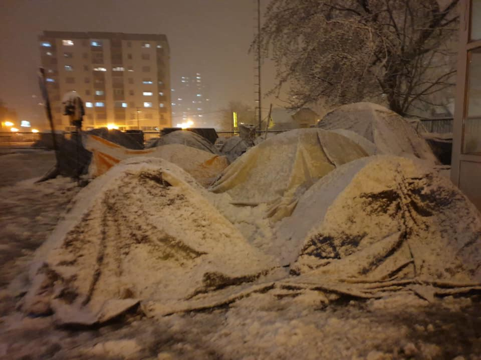
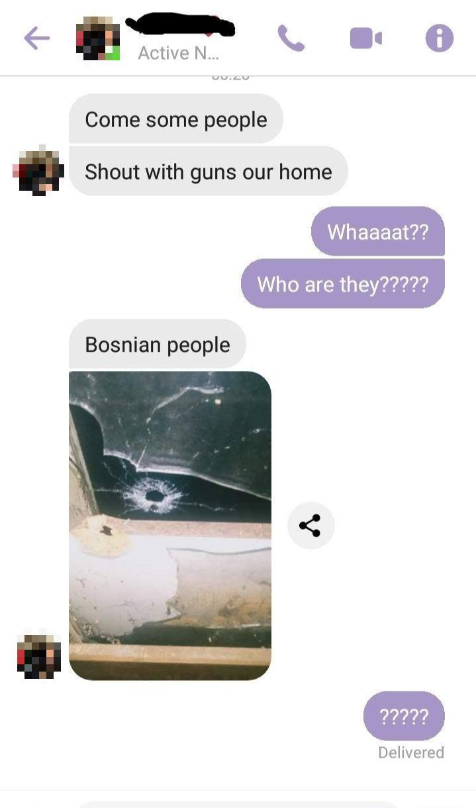
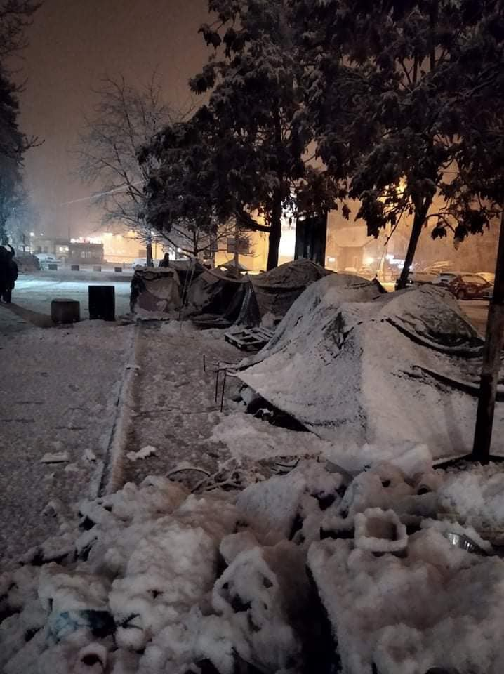
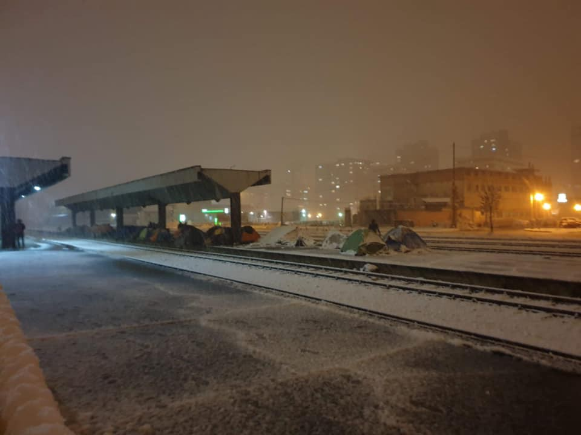
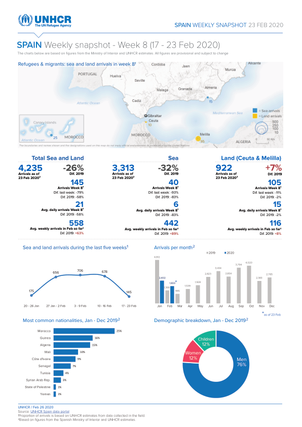

### AYS Daily Digest 26/2/20: Unprotected, attacked and shot at across the Balkan Route
#### Fascist groups arrested in Belgrade after their raid across the city — reactions / A letter from the Aegean islands — activists have expressed their concerns / Growing insecurity for both people on the move and for those defending human rights / Denmark back in the ‘quota system’ / UK’s post\-Brexit immigration full of flaws / & more info

Tuzla, Bosnia and Herzegovina
#### FEATURED

BOSNIA AND HERZEGOVINA — According to several statements and different local sources, on Tuesday night of this week, there was an attack by so\-far unidentified, reportedly local, individuals against a dozen people staying in one of the secluded squats in the Velika Kladuša area, in northern Bosnia and Herzegovina\. The boys, who were preparing to go to bed, also reported that they were shouted at, and following that several gunshots were fired at the shabby wooden shack where they were staying\.

Nobody came to investigate, ask if they are alright, care for their wellbeing as seekers of international protection…

People on the move are still being left alone to find their own ways to cope, means to survive and places to stay, with not much worry being expressed clearly by the international organisations present in Bosnia and Herzegovina, or other cantons, or the federal government\. While the ball is being tossed from one side to the other and money is being spent in not always transparent ways and often not the best way, given the state of things, people are dying\. People are afraid, cold, hungry, desperate, psychologically very vulnerable, and left without any choice but to try again and again to leave the country, being further beaten and abused at the borders and inside the EU Member states which show no solidarity either to the country of Bosnia and Herzegovina, or to the people who are stuck there with barely any protection\. On a daily basis, the people on the move who gather in several places across town are being threatened especially by several well\-known locals, who have demonstrated all kinds of violent behaviour, constantly calling the police for no reason, who then detain and beat up the boys who have only so many options, being left alone by everyone except for those individuals willing to help and support them, drawing a kind of bullseye on their back as well\. No official reactions so far\.

In Tuzla, after reports of hair salons refusing to welcome clients who were basically youth on the move, and restaurants and bars who denied them entry, now more racist attacks are being reported by the locals\. While there is a substantial number of locals in Tuzla active and present on a daily basis in aiding and helping people in transit during their stay in Tuzla, there is a growing hostility documented across the country, including here\. This week an Afghan boy entered a cafe to order coffee only to be attacked by an older local man, who threatened him and kept verbally attacking him\. The young man did not react to the harassment that was, reportedly, witnessed by a number of locals and representatives of the international organisations present\.

Tuzla this evening, Photos: Selma Dzafic

BELGRADE, SERBIA — Organisations have called for protection of the people in transit and those who are asylum seekers in Serbia, all of whom are exposed to violence and threats

In the collective call they published, the organisations say that the threats, intimidation and violence that has been carried out by individuals and informal groups over the past few weeks, targeting refugee and migrant communities, as well as the spreading of hate present in the public sphere, in media coverage and individual media communications, all can have unsurmountable consequences for the security, health and benefit of the children and adults who were forced to leave their countries precisely because of the violence and insecurity\. These violations go against the national laws and they are in contrast with the international conventions, including the Charter of the Human Rights, whose signatory is Serbia\. This also opposes the significant results Serbia has achieved in providing support to these people, and this is also why these practices must be stopped, as the orgranisations have stated\.

> It is extremely important that all members of the society, individuals as well as those active in public and political life, act with the aim of promoting and protecting human rights so as to stop the threats, intimidation and violence directed at refugees and migrants, and prevent any similar incidents in the future\. 

They called for immediate reactions from the authorities and an efficient manner for sanctioning the unlawful actions by the individuals and groups\.

The authorities must act to prevent and sanction such actions, so that they can work continuously to secure a safe place for all people\. This could be done by more a constant presence of the police patrols in the places where people on the move stay, as well as other measures that would decrease the risks of those people whenever they are outside the centres\.

> With their unprofessional reporting, as well as their publishing of not\-checked and unclear information, the media often take part in spreading messages of hate, thus contributing to the spread of fear and hate\. It is necessary for the media to hold to the professional code of conduct of journalists in Serbia, and to rely on relevant sources of information, such as institutions and organisations, both at the national level, and those of the civil society who provide support to the refugees and migrants\. 

The signatories of this documents are the following organisations active in Serbia:

ATINA
Centar za Integraciju Mladih
Centar za Kriznu Politiku i Reagovanje
Info Park
Jesuit Refugee Service
Mreža psihosocijalnih inovacija
PRAXIS
Save the Children International
### Frontex against activists

Frontex seems more and more to be taking up the role of the international community’s bad side\. In their latest offensive, activists have been targets\. The most recent [petition](https://act.wemove.eu/campaigns/luisa-arne-vs-frontex-en) is out:

> Luisa Izuzquiza and Arne Semsrott tried to watch the watchers, a secretive, well\-funded EU body, Frontex, in charge of Europe’s borders, both the surveillance and human rights aspect\. 

> They asked for very simple information — what type of boats does Frontex have in the Mediterranean, an area where human lives are needlessly lost every year and where NGOs are no longer welcome? Frontex repeatedly refused to give this information, so they took them to court\. \[2\] 

> Not only did they not get an answer, they lost\. As a clear threat against appealing this decision, Frontex sent them a clear message — a bill of €23,700\.81 for legal fees to be paid in two days\. European public institutions almost never send legal bills to citizens\! \[3\] 

> Thankfully, **Frontex** likely **hates** one thing more than information requests — **bad publicity\.** 

> Luisa and Arne plan to spread their story across Europe\. But it would be so much more powerful if this weren’t just their struggle, but all of ours\. All it takes is your signature to stand with them and **let Frontex know Europeans don’t respond well to bullies\.** 

> \*This petition text originally read €24,000 but was updated on 26\.02\.2020 at 17:30 with the precise amount of €23,700\.81\. 

Read this thread to find out more:

■■■■■■■■■■■■■■ 
> **[Apostolis Fotiadis](https://twitter.com/Balkanizator) @ Twitter Says:** 

> > THREAD: @[Frontex](https://twitter.com/Frontex) is demanding that @[luisaizuz](https://twitter.com/luisaizuz) and @[arnesemsrott](https://twitter.com/arnesemsrott), two transparency activists that lost a case against it a few months ago pay a crushing amount of 23,700 euro for legal costs within a month's deadline
[act.wemove.eu/campaigns/luis…](https://act.wemove.eu/campaigns/luisa-arne-vs-frontex-en) 

> **Tweeted at [2020-02-27 08:42:53](https://twitter.com/balkanizator/status/1232949208837173254).** 

■■■■■■■■■■■■■■ 

#### EU

More than 714,000 people applied for asylum or some form of international protection in Europe last year, up 13% from 2018, the European Asylum Support Office, or EASO, said in its latest report on asylum trends in 2019\.
### Call to sign a petition
#### **Sea rescue is a must — no one is allowed to look away**

Lena Meurer and Julian Pahlke from Sea\-Eye, who are operating the civil rescue ship ALAN KURDI on the Mediterranean, are asking for support with signatures to their petition\.

> **We call on** the foreign ministers of the EU member states, in particular Josep Borrell, High Representative of the EU for Foreign Affairs and Security Policy, the German Foreign Minister Heiko Maas and the Austrian Foreign Minister Alexander Schallenberg to provide an explicit search and rescue mandate and to actively rescue people from distress\. The ships must be deployed off the entire Libyan coast at a distance of significantly less than 100 km\. 

> The EU member states have long withdrawn from the search and rescue area\. In this emergency, a few civilian sea\-rescue organizations are trying to take on the task of the EU member states and fill the gap\. This cannot go on like this\! 

> **Let us together demand that the ships of _Operation EU Active Surveillance be used_ to save lives\.** 

> If we can save people from distress, EU ships can do it too\. 

#### GREECE

In a letter from the Aegean islands, activists have expressed their concerns\. Here is what they had to say:

> “We in the midst of really dangerous, critical times in Greece\. Tomorrow Chios Island will see a second day of protests which, today, ended in violence against riot police after tear gas was used\. 

> A frenzy has been whipped, there is anger & frustration all across the Aegean\. Locals are venting with passion at governments, NGOs, refugees, the EU\. Their feelings of fear and distrust are not without reason — though their anger should not be directed towards those living in camps\. Refugees are the most vulnerable group, but we cannot forget that so too are locals \(who have been at the forefront of this catastrophic mishandling of human needs since 2015\) \. 

> Protests in Chios Square today were very tense and edgy, those occurring in other areas of the island were more extreme & troubling\. As an NGO team \(who have been both verbally abused & targeted online\) we are taking things step by step & continually assessing our actions in the context of on\-going events in order to be as safe as is possible\. 

> With another day of protests & a further island lockdown scheduled for tomorrow, we fear mostly for those in the camp\. They must not be the next target\. Now, more than ever, we have hit a humanitarian crisis which has so far been very avoidable\. People are hurting, there are no winners here\.” 

■■■■■■■■■■■■■■ 
> **[Franziska Grillmeier](https://twitter.com/f_grillmeier) @ Twitter Says:** 

> > Tomorrow the 27th of February, another general strike is planned on the island of #Lesvos. People will gather at 10:30 at Sappho Square the Workers Union has declared. All shops, petrol stations, schools &amp; coffee will remain closed another day. #refugeesgr #protest #closedcamps 

> **Tweeted at [2020-02-26 19:23:37](https://twitter.com/franzieire/status/1232748069999063040).** 

■■■■■■■■■■■■■■ 

62 people were injured after the clashes on the islands and now it was announced that the government is withdrawing most of the riot police units that were stationed there\.

The main protests took place in the areas of Diavolorema, Kavakli and Karava on Lesvos, where the government is expropriating land to build the centers\. During the clashes, locals hurled stones at police, who responded with tear gas, resulting in injuries on both sides, reports Ekathimerini\.

Prime Minister Mitsotakis said any resistance to the new detention camps being built is futile and everything will go as planned, [adding](https://www.ethnos.gr/english-version/90736_dont-come-greece-pm-mitsotakis-warns-migrants-not-qualifying-asylum) : “I want to send a clear message to those not entitled to asylum, who nevertheless choose to come to our country\. Don’t come because the route on which the traffickers are leading you, for which you pay them handsomely, does not lead to the Greek mainland and ultimately to Europe\. It stops on the islands and from there starts the road of your return”\.
### How long should you wait for your travel document after being granted asylum?

[Mobile Info Team for refugees in Greece](https://www.facebook.com/mobileinfoteam/?__tn__=kCH-R&eid=ARBBHo2qSCAD6MsaAUR7oPY9rHiPMm3mbFW3O3TsMa-sF6__WS_5aB--LjifoxWRYM6FISgMcDzpTQop&hc_ref=ARRMAgxqeaPbZsMrt9rATHEDGgaVSBxvjWH-jANHIblktj4VEbTUDjk_MqLBJFLP3KM&fref=nf&__xts__%5B0%5D=68.ARDfYYCqAyfTcUkjp6ixjGezrfzWLkwRyj6E8xblAlX4XkbFH4MrgNPEolwaCc1BL0E7w1G3B2tpP551lmORfwjNwJvCi_4qZ8_1tscMxSp_1UsXHCEhXRjvbbfURZcvtgg7L_mpWRioo-pZzF06nuAiNTE8-BN4ww0CllU3yEe2v4EvzemCvZ4arnk1WusFA212pkQ6lS3W1mGQvvcKpVDJyHFn49R0H8X_PMrj5ohgtc3CwrwUChqfSBXHVoRvgcF2-yq-RtvPDycZYCJoB-KuiFG87qq8vIlTYkJl22yr4P0jbAkNVzE2zoL3qtpTldhc7rnDsFNPlbClQa49TWOc2kYu26bXD5LCoamAZajWagv9) explained that firstly it’s important to know that one **needs to apply** for a travel document\.

> The earliest you can apply is when you receive the decision granting permanent asylum from the regional asylum office\. If you get a sub\-protection, it will be difficult to apply and only some people will be able to get a travel document\. You can’t apply for a travel document while you’re still an asylum seeker\. 

> In General, it is difficult to determine how long it will take to receive a travel document after application\. It depends on the circumstances of your case, in which region of Greece you applied for asylum, and other factors\. After applying for a travel document, the Greek police will conduct background checks and other security details to see if you are allowed to receive a travel document\. It may take several months for these tests to be completed, and in some cases it may be up to a year\. Currently the Greek authorities are trying to accelerate this process\. But the waiting times are still long\. 

> If the decision is positive, you can apply for the actual travel document with the Greek foreign police\. This will take up to four months for the travel document to be ready to be received\. 

On their website, you can find detailed information about the process of obtaining a travel document: [https://www\.mobileinfoteam\.org/travel\-documents\-ar](https://www.mobileinfoteam.org/travel-documents-ar?fbclid=IwAR0FihZ6qXMN3qgfL-H8VbdmLXOJXZZQ_0FyD5DE1-bzaRaGRVIyR9w_LBw)
#### SPAIN

#### GERMANY
### Deportation to Afghanistan announced for March 11

[Bayerischer Flüchtlingsrat](https://www.facebook.com/Bayerischer.Fluechtlingsrat/?__tn__=%2CdkCH-R-R&eid=ARBmneBi7DKeaMch8mDWvW_Svl3c4cX1JPMq-KjO3NBW2lBa-vk31FLcmgGPVN5lbOdNS5A8IYF0-Csw&hc_ref=ARSqwB26NwxJaY3CtXFWlpEW6Y9xHxv4KYOuObq6ZfBiCdQRL7LtY-uw5aUFwz7A2kc&fref=nf&hc_location=group) reports that there is evidence to support announcements we had previously published that the next deportation to Kabul is expected to take place on Wednesday, 11 March\.

> We advise all Afghans who are subject to deportation to visit a consultancy or a lawyer urgently\. We particularly recommend that the foreigners authorities are informed about upcoming training sessions, as well as about other integration services and existing diseases\. 

More info: [https://www\.fluechtlingsrat\-bayern\.de/abschiebungen\-nach\-afghanistan\.html](https://www.fluechtlingsrat-bayern.de/abschiebungen-nach-afghanistan.html?fbclid=IwAR2id-bmcA1e8JaiWJUlxWKJP_xTXGXGjD6kBFbpWoutiRRG_jxoD2vbin4)
#### DENMARK

This weekend, Denmark will receive the UN quota of refugees for the first time since 2017\. This is reported by the Immigration Service\. The group is a total of 16 people from three families who have so far stayed in camps in Turkey\. Prior to 2017, Denmark received an average of 500 people annually\. This is the first part of a total of 30 Syrian and stateless ‘quota refugees’ who, according to the Immigration Service, are expected to land in Denmark over the coming months\.
#### UK
### Jailed for smuggling

Four British men accused of smuggling 29 people have been jailed in the UK\. [InfoMigrants](https://www.infomigrants.net/en/post/22994/people-smugglers-jailed-in-the-uk?fbclid=IwAR3NEy-2H6hl1pwWhF5_WH201t_GIw1S_iopQ_B9c9fo_3MmYupZvXTY2dM) shared this information from the British media\.

At the trial, the sentencing judge said that the men had treated the people “like freight,” and accused the men of “not caring \[about the people\] one jot\.” He accused the men of making money by “benefiting from human misery\.”
The conditions on the boat were “dreadful” during a rough nighttime crossing, with nothing to eat and inadequate toilet facilities\.

■■■■■■■■■■■■■■ 
> **[Cornwall Live](https://twitter.com/CornwallLive) @ Twitter Says:** 

> > Men, women and children were crammed into the back of a van [cornwalllive.com/news/cornwall-…](https://www.cornwalllive.com/news/cornwall-news/men-who-smuggled-29-illegal-3879152) 

> **Tweeted at [2020-02-24 08:25:37](https://twitter.com/cornwalllive/status/1231857701505896448).** 

■■■■■■■■■■■■■■ 

> “We hope it serves as a reminder that people are not commodities to be handled like cattle with total disregard for their health and safety\.” 

### The concept of only seeking to accept those who can benefit the economy is scandalous

The current and proposed rules for immigrants, among other faults, demean many jobs\. On the other side of the spectrum, they also tighten the regulations on professionals and [scientists with post\-Brexit directives and decisions](https://www.theguardian.com/education/2020/feb/25/academics-refused-permanent-uk-visas-because-of-field-trips-abroad?fbclid=IwAR07F-jnGwaaPBhSO_U9_zAhz9dFe4IhrVf7s8B6Y0Y5Yy-oyicsr14DPms) \.

These were therefore under public scrutiny, as it has been said that Britain needs to take a much broader and sympathetic attitude to immigration in general\.

> The children and grandchildren of immigrants to Britain are certainly not the first individuals to adopt harsh policies that run diametrically opposed to the laws that enabled their ancestors to come to Britain\. 

One of the comments in a recent article in the British media reads:

> If there is to be any progress towards global prosperity, it is counter\-productive for the rich West to entice the brightest and most skillful people to feed its already strong — though horribly inequitable — economies\. 

**Find daily updates and special reports on our [Medium page](https://medium.com/are-you-syrious) \.**

**If you wish to contribute, either by writing a report or a story, or by joining the info gathering team, please let us know\.**

**We strive to echo correct news from the ground through collaboration and fairness\. Every effort has been made to credit organisations and individuals with regard to the supply of information, video, and photo material \(in cases where the source wanted to be accredited\) \. Please notify us regarding corrections\.**

**If there’s anything you want to share or comment, contact us through Facebook, Twitter or write to: areyousyrious@gmail\.com**

_Converted [Medium Post](https://medium.com/are-you-syrious/ays-daily-digest-26-2-20-unprotected-attacked-and-shot-at-across-the-balkan-route-85ffff18f9d5) by [ZMediumToMarkdown](https://github.com/ZhgChgLi/ZMediumToMarkdown)._
