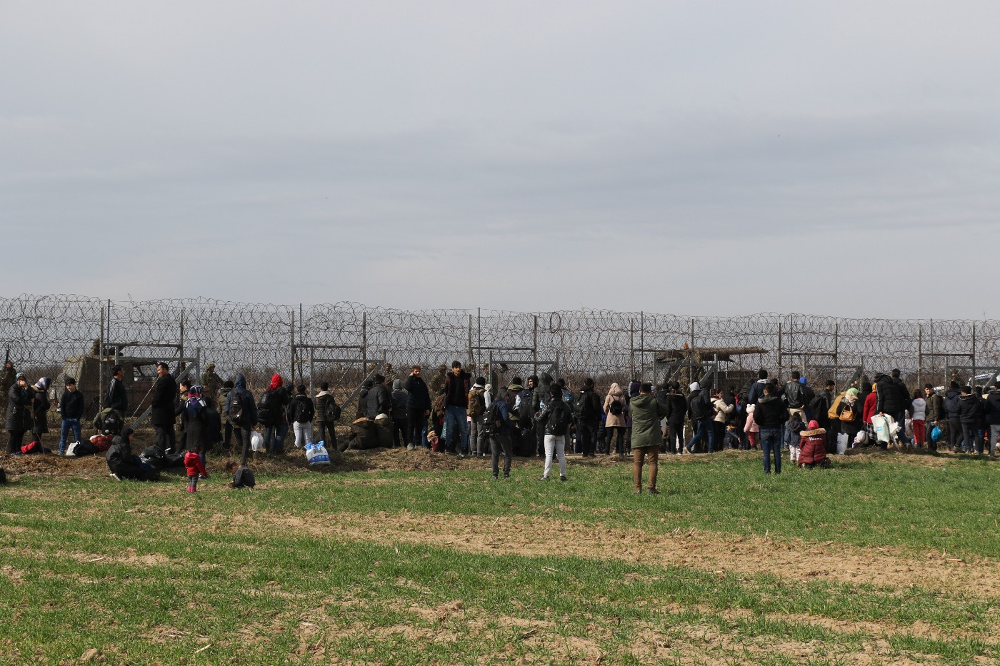

### AYS Daily Digest 27/2/20: Turkey ‘opens’ its borders to Syrian refugees

Turkey ‘opens’ its borders / Frontex demands thousands in payment from two transparency activist / Italy justifies taking four years to process citizenship requests / Updates from Bosnia / ICRC demanded safe passage for civilians fleeing Syria\.

Photo Credit iha\.com\.tr
### **Feature**

Following the airstrikes that killed 33 Turkish soldiers in Idlib Syria, the Turkish government has made the sudden announcement that it will open its southwestern border with Syria for 72\-hours, allowing free passage for Syrians fleeing the country\. Turkish officials have claimed that the police, coast guard and border security officials have been told to step down, with one senior official claiming that Syrian refugees heading towards Europe would not be stopped either on land or by sea\.

Turkish authorities have blamed the airstrikes that killed their soldiers on the Syrian government forces who are backed by Russia\. The RIA news agency published a statement by Russias defence ministry that claims the Turkish troops had been hit by fire from Syrian government forces who were trying to repel an offensive by Turkish\-backed rebel forces who currently ‘control’ Idlib\.

Turkish state\-run media outlets have published footage of migrants heading towards the Greek/Bulgarian land border with Turkey and have allowed news crews to film migrants boats departing for Lesvos\.

[Greek government](https://www.middleeasteye.net/news/turkey-syrian-refugees-free-passage-europe-soldiers-killed-Idlib?fbclid=IwAR0cUytTpnvS4Q7UVFdTJE4Xxdn015VwAVMyeqnZHukg-ed8F1nC2bGlym4) sources told Reuters that they have tightened sea and land borders with Turkey due to the overnight developments\.

Early this morning [Patrick Kingsley](https://twitter.com/PatrickKingsley/status/1233296880731402240) from the New York Times reported that the Turkish\-Syrian border is still shut\.

■■■■■■■■■■■■■■ 
> **[Abdullah Bozkurt](https://twitter.com/abdbozkurt) @ Twitter Says:** 

> > News channel A-Haber, owned by President #Erdogan's family, advertises all border crossings to Europe, on both sea and land, were opened and refugees in #Turkey started moving towards #Greece. 

Erdogan raised the stakes in his blackmail policy to extract concessions. https://t.co/GlXdtV76RS 

> **Tweeted at [2020-02-28 05:34:36](https://twitter.com/abdbozkurt/status/1233264214808158208).** 

■■■■■■■■■■■■■■ 

### Frontex

On June 18th 2017 Arne Semsrott, a journalist and freedom of information activist requesting ‘a list of all ships currently used by Frontex in the central and eastern Mediterranean”\. Three weeks later Luisa Izuzquiza, also an activist for freedom of information, requested documents pertaining to a meeting between the Frontex chief and representatives of Italy and other member states\.

The joint lawsuit filed by Semsrott and Izuzquiza against Frontex for its continued refusal to comply with freedom of information request was the first case of its kind launched by a civil society group\. The judgment ruled that Frontex did not have to disclose any information about their ships in connection with operations at the EU’s external borders\.

After the ruling, not only satisfied with not having to comply with freedom of information request, Frontex also requested that their legal fees were paid\. International observers have claimed that Frontex demand for over €23,000 from two transparency activist is an attempt to send a clear message to activists, NGOs and civil society everywhere that anyone that seeks to challenge them again in the future may end up receiving a hefty legal bill\.

Speaking to the [EUobserver](https://euobserver.com/migration/147562) Luisa Izuzquiza said: “Our case was the first case against Frontex, so if this becomes the norm, having to pay five\-figure legal fees for taking them to court for a human rights case, then everyone is going to think twice”\.

At the moment Luisa Izuzquiza and Arne Semsrott are refusing to pay Frontex legal fees and instead are seeking to spread the word about their tactics of intimidation

For more information and to find the petition calling for withdrawing the demand of a €23,700\.81 legal fees from transparency activist Luisa Lzuzquiza and Arne Semsrott\.

### Greece

Photo Credit: Erik Marquardt

A statement released by MEP Erik [Marquardt](https://www.facebook.com/ErikMarquardtde/?__tn__=%2CdkCH-R-R&eid=ARAqkYcf2PiN2YDes7EmLzhS9-n07LCpkdfpM_3Y8ifKq9G3dyj59WiGbfcQjtgTcFph-ZoFPUiQ0qjq&hc_ref=ARSPMy0LoQBAbngPAX98ccOb6iL-HLk7ZvwypnSr6fKpyzRfmLlDUyiNT1cW1sLM1ok&fref=nf&hc_location=group) :

> There’s a lot of protests on Lesvos in the past few days\. The government wants to build closed camps where the refugees can be arrested\. This is not only a bad perspective for refugees, but it is also unacceptable for the islands population\. 

> In the community of Mytilene on Lesvos, there are 35\.000 inhabitants\. Approximately 25\.000 refugees are added, the living conditions at Camp Moria are unbearable\. The islands depend on tourism, but the many reports of bad conditions are getting fewer and fewer people to go on vacation here\. 

> In the evening some people gathered in the hotel lobby — no shops or restaurants are open because of the general strike on the island\. Another group is offering us pizza from yesterday, they had better prepared for the strike than we did\. 

> On TV reports of the protests against the closed camp are running, while there are surreal scenes: policemen throw stones at protesters after apparently running out of tear gas\. 

> Instead of support, the central government sent special police in Athens a few days ago\. “They sent police to beat the people of Lesvos”, an employee at the hotel told me\. I was unsure about the protests if they would be instrumentalized by right wing radicals\. But so far, the protests are not aimed at refugees, but against a populist, clueless government that abandons the islands\. 

> Since the EU\-Turkey deal, refugees are not allowed to leave the islands during the asylum procedure\. As long as nothing changes, I can’t see a solution for the overwhelmed Greek islands 

[Greece’s Civil Protection](https://www.keeptalkinggreece.com/2020/02/27/greece-coronavirus-civil-protection-guidelines-foreign-languages) has issued guidelines to protect from coronavirus in six languages\. The guidelines provide standard advise including the frequent and thorough washing of hands and covering your mouth and nose with a tissue or in a bent elbow when you cough or sneeze\.

■■■■■■■■■■■■■■ 
> **[Civil Protection GR](https://twitter.com/GSCP_GR) @ Twitter Says:** 

> > 📌 Σε 6⃣ γλώσσες ΕΝ FR RU SQ AR FA η ενημερωτική καμπάνια της @[GSCP_GR](https://twitter.com/GSCP_GR)  με οδηγίες προστασίας από τον Κορωνοϊό
Δεν φοβόμαστε❌– Προστατευόμαστε✅ 
🛡Ασπίδα μας, η γνώση‼
#coronavirus #handshygiene @[YpYgGR](https://twitter.com/YpYgGR) @[eody_gr](https://twitter.com/eody_gr)

Δείτε περισσότερα ➡️[bit.ly/2HZazQf](https://bit.ly/2HZazQf) https://t.co/Wy5Cp9cSEO 

> **Tweeted at [2020-02-27 10:22:12](https://twitter.com/gscp_gr/status/1232974202753474560).** 

■■■■■■■■■■■■■■ 

For more information and to find the guidlines in English, French, Russian, Albanian, Arabic and Farsi please see:

Photo Credit : ekathimerini\.com

The United Nations reports that over the past five years more than 2 million people have been forced the flee their home country and make the perilous Mediterranean Sea crossing\.

[A first of its kind study](http://www.ekathimerini.com/249959/gallery/ekathimerini/community/nine-out-of-10-migrants-who-come-to-greece-are-escaping-violence) has been released by Greek think tank diaNEOsis that reveals what the people themselves think about the journeys they have been forced to take and the communities that ultimately end up receiving them\. The study coordinated with Dr Vasiliki Tsagkroni, lecturer in political science at the University of Leiden, and Dr Vasileios Leontitsis, lecturer in Globalization Studies at the University of Brighton and Kapa Research to collect information from 800 migrants and refugees who participated\.

The study found that 91 per cent of new arrivals on the Greek islands — and almost all the Syrians surveyed — said the main reason they travelled to Greece was “to escape violence, dispelling this ongoing myth of ‘economic migrants’ being the majority of arrivals in Greece\. The study additionally found that 75 per cent of new asylum seekers have experienced airstrikes, 69 per cent have survived bomb attacks, and 53 per cent have seen their own home destroyed\.
### Italy

Di Bari claimed that “faced with a progressive increase in citizenship requests, there is a need for greater attentiveness in the examination, in part due to a greater risk of terrorism and the counterfeiting of documents from countries of origin”\. He continued to argue that “the system of the administration considers it necessary to maintain the four\-year term\. Every request is assessed through examining requirements, residency, the lack of impediments from the national security point of view, and checks on documents pertaining to specific situations to prevent marriages of convenience\. We need this amount of time\.”
### Syria

On Tuesday the International Committee of the Red Cross \(ICRC\) demanded safe passage for civilians fleeing the ongoing attacks in Idlib, Syria\. In a statement released this week, the ICRC asked ‘all parties involved’ to allow civilians to move to safety and requested that the ICRC be granted safe passage to the region to help provide humanitarian aid\. The ICRC also added that:

> “Vulnerable groups such as the elderly and the disabled have been hit particularly hard by the lack of essential goods and services\. Infants deprived of essential nutrients for healthy growth can suffer life\-long consequences\. The daily reality of cold, wet and snowy weather is compounding the conditions that create serious harm,” 

> “The Red Cross said that if “civilians must flee for safety reasons, all possible measures must be taken to ensure that members of the same family are not separated and that everyone is relocated under satisfactory conditions of shelter, hygiene, health, safety, and nutrition\.” 

> “With the ongoing fighting and shifting frontlines, access for humanitarian workers/volunteers is challenging and risky\. However, if the situation allows, the ICRC together with the Syrian Arab Red Crescent \(SARC\) reiterates their readiness to increase their humanitarian response\. We urge all parties to provide us with access and security guarantees, so they can adequately respond to the needs of people on both sides of the frontlines,” 

### Bosnia

Freezing weather and snow in Tuzla, where dozens of men are still sleeping rough around the bus and train station, some of them without even having a tent\. The cold increased the need for wood \(for fire\), tents, sleeping bags, nylon sheets, warm male clothes \(sizes S and M\), male winter shoes or boots \(sizes 40–45\) \. Yesterday a man from Brčko and a couple who decided to stay anonymous saved the day by providing enough logs for the next few days, but more support is desperately needed\.

Tuzla in the Snow\. Photo Credit: Facebook\.com/Tuzlanski\-volonteri

**Find daily updates and special reports on our [Medium page](https://medium.com/are-you-syrious) \.**

**If you wish to contribute, either by writing a report or a story, or by joining the info gathering team, please let us know\.**

**We strive to echo correct news from the ground through collaboration and fairness\. Every effort has been made to credit organisations and individuals with regard to the supply of information, video, and photo material \(in cases where the source wanted to be accredited\) \. Please notify us regarding corrections\.**

**If there’s anything you want to share or comment, contact us through Facebook, Twitter or write to: areyousyrious@gmail\.com**

_Converted [Medium Post](https://medium.com/are-you-syrious/ays-daily-digest-27-2-20-turkey-opens-its-borders-to-syrian-refugees-13db77a2d403) by [ZMediumToMarkdown](https://github.com/ZhgChgLi/ZMediumToMarkdown)._
