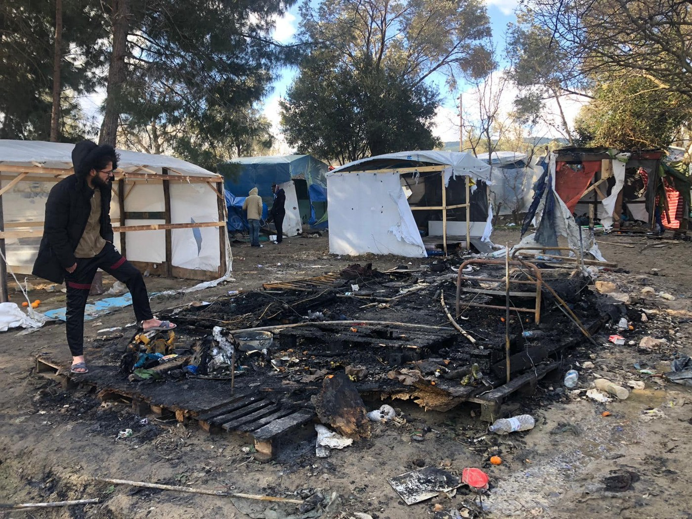
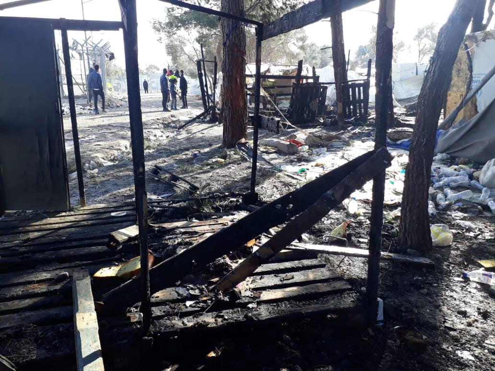
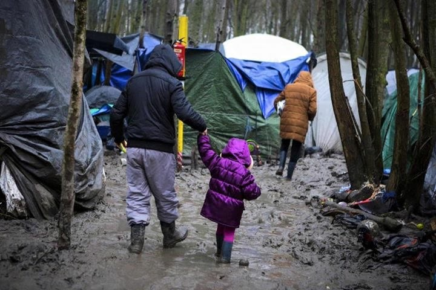
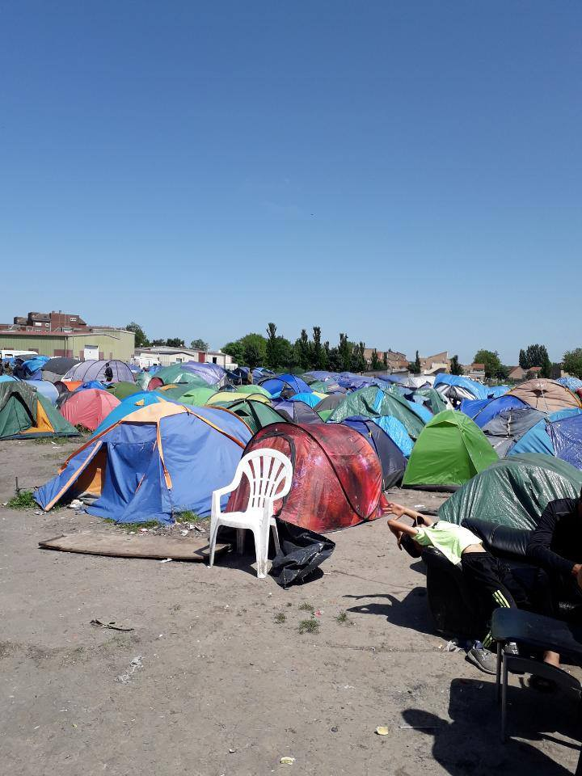

### AYS Weekend Digest 29/2 — 01/3 2020: Greece — Emergency measures and live\-ammo training at border

Emergency measures imposed in Greece, and live ammunition training along the land and sea borders with Turkey / Reports of torture in Libyan centres / Deceitful behaviour of IOM in Bosnia

 \)](assets/73a737de9017/1*KcBS7qVr351OPYALivh09w.jpeg)

“What we have seen at the European external border in the last 48 hours is the complete breakdown of the European Union as the so\-called defender of human rights\.” \( [Sea Watch](https://twitter.com/seawatch_intl/status/1234168191989014532) \)
#### FEATURE: Greece — Emergency measures and live ammunition training at both land and sea borders with Turkey

Over the weekend there have been multiple developments in Greece and along the Greek border with Turkey as people have moved to try and cross after it was announced that the Turkish border guards and coast guards would no longer prevent people from leaving Turkey\. This has led to the Greek government imposing emergency measures and announcing [training on the 2nd of March with live ammunition](https://www.keeptalkinggreece.com/2020/03/02/greece-army-exercise-live-ammunition-mar2/) in both the Evros region and [off the coast of Lesvos](https://www.armyvoice.gr/2020/03/%CE%B1%CF%83%CE%BA%CE%AE%CF%83%CE%B5%CE%B9%CF%82-%CE%BC%CE%B5-%CF%80%CF%81%CE%B1%CE%B3%CE%BC%CE%B1%CF%84%CE%B9%CE%BA%CE%AC-%CF%80%CF%85%CF%81%CE%AC-%CF%83%CE%AE%CE%BC%CE%B5%CF%81%CE%B1-2-3-%CF%83/) \.

According to government spokesman Stelios Petsas, [the following five measures](https://m.tvxs.gr/mo/i/311913/f/news/ellada/syskepsi-kysea-ti-apofasise-i-kybernisi-gia-prosfygiko.html?fbclid=IwAR3oPTx9s7lxPWovYqQevtH77qdulc5CWKcxogFlzRWhlgpTBe7lnqSpkvE) were taken after the meeting of the National Security Council \(KSSEA\), at the Maximos Palace, convened by Prime Minister Kyriakos Mitsotakis:

> – Upgrading security measures at the eastern, land and sea borders of the country by security forces and the armed forces to prevent illegal entry into the country\. 

> – The temporary suspension, for one month from the date of receipt of this Decision, of the lodging of asylum by those entering the country illegally\. 

> – The immediate return, wherever possible, to the country of origin of those who illegally enter Greek territory without registration\. 

> – Applying to FRONTEX for the development of the RABIT team with the aim of guarding the country’s external borders, which also constitute the European Union’s borders\. 

> – The immediate notification of this Decision to the Council of Ministers of Foreign Affairs of the European Union and the initiation of the procedure referred to in Article 78 \(3\) of the Treaty on European Union to take provisional measures in favor of the Hellenic Republic in response to an emergency due to the sudden influx of nationals third countries, in the context of solidarity between Member States of the European Union\. 

We must hope that the use of live ammunition, announced late Sunday night at the same time as the emergency measures, is merely a scare tactic\. A deplorable move by a government who has left human rights far behind them\. However, people in the area should be aware and not enter the training zones as this will of course pose a risk to life\.

Over the weekend the brutal repression of those trying to cross has been well documented at the land border and across the Aegean Islands\.

Conflicting reports over the death of a young man from Syria in Ipsala, on the Evros land border, appeared early this morning\. [Several Turkish media outlets](https://haber.sol.org.tr/turkiye/edirne-sinirinda-bir-siginmaci-olduruldu-281708) report that he was shot dead by Greek border patrols\. According to [Jenan Moussa](https://twitter.com/jenanmoussa/status/1234403547330088961) , who first reported about it and spoke with his family, he was killed by a rubber bullet\. The [Greek government](https://www.skai.gr/news/politics/petsas-fake-news-vinteo-deixnei-nekro-prosfyga-sta-ellinotourkika-synora?fbclid=IwAR3GlLpv9fT_KVajP3lSIyaVkTCWal6oi6pEW4OpiiQvgoWziBEduEVoQyM) have denied any involvement and have labelled this as fake news\.

The land border on Friday:

■■■■■■■■■■■■■■ 
> **[Giorgos Christides](https://twitter.com/g_christides) @ Twitter Says:** 

> > #Evros this morning: hundreds of migrants and refugees remain stuck at Kastanies crossing point Tear gas deterrence by Greek authorities continues when they get too close to police cordon Refugee who shot this video says they are afraid to go back, intend to stay https://t.co/wwL32OIGD1 

> **Tweeted at [2020-02-29 06:51:52](https://twitter.com/g_christides/status/1233646049450917888).** 

■■■■■■■■■■■■■■ 

On Saturday we published a [Special from Lesvos](ays-special-lesvos-well-beyond-the-brink-this-is-what-we-know-so-far-7c11873e12f8) , unpicking the increasingly confusing situation there and bringing together documentation of the continued brutality [against people on the move](https://www.keeptalkinggreece.com/2020/03/01/lesvos-locals-mob-migrants-journalists) , solidarity and [NGO workers](https://twitter.com/VassilisTsarnas/status/1234188789154799616?fbclid=IwAR0Ck_LBq7E6vaYoQvDu2g4fBpnzmjWV00HN3whRqM8LpksfMWzM-kPHfco) and the attempted suppression of journalists\.

■■■■■■■■■■■■■■ 
> **[SKAI.gr](https://twitter.com/skaigr) @ Twitter Says:** 

> > Επίθεση σε μέλη ΜΚΟ στο λιμάνι της Θέρμης στη Λέσβο. Πέταξαν τις κάμερές τους στη θάλασσα. https://t.co/UYvzfgFwNN 

> **Tweeted at [2020-03-01 13:03:10](https://twitter.com/skaigr/status/1234101875366092801).** 

■■■■■■■■■■■■■■ 

Attacks on journalists on Lesvos have been so severe that they led the Foreign Press Association of Greece to [release a statement](http://www.fpa.gr/category/announcements/?fbclid=IwAR2sooKXru6hCEScRaf9a2sB_JEGQtHSlmeoS-uZP-LLzDjrfdFcKu6d45A) and advise caution to journalists working in the area:

> We note with great concern that certain groups on the island of Lesvos move in an organized manner to intimidate and attack journalists covering the flow of refugees and migrants arriving from Turkey\. 

> At least two colleagues have already suffered such attacks, resulting in grave injury, pursuits and misappropriation or damage of their equipment\. 

[Chios has also felt the strain](https://www.facebook.com/JacobWarn/posts/10156894733481190?hc_location=ufi&comment_id=Y29tbWVudDoyNDM3ODI1ODc2NDM0NzcxXzI0Mzc5MDU4Mzk3NjAxMDg%3D) :

> Chios has descended into crisis\. After days of protests that have seen locals attacked by riot police, volunteers made victim to abuse and violence, mass strikes across the islands, finally, an unending chain of fights are breaking the camp of Vial\. Tear gas used to break up inter\-cultural skirmishes harm children and innocent bystanders, forced to stay within the perimeter of the camp\. Whilst on the one hand, anonymous threats are made against those that stand in solidarity, hundreds of vulnerable people are displaced from tents ruined by fires overnight\. Access is restricted in and out\. 

 \)](assets/73a737de9017/1*27rckOSjgyslWS1Fh1tflg.jpeg)

\(Aftermath of fires on Friday\. 20 tents were burned\. Police reacted by closing the road\. Photo Credit: [Pothiti Kitromilidi](https://www.facebook.com/pothiti.kitromilidi?fref=gs&__tn__=%2CdC-R-R&eid=ARAO5RoMZkZNjA8aexhgdHHJ5S9cB8qQ659AJcQiaKdy95m17C_LnbHW6-W68oTs700jNgpQ5JyhXhJn&hc_ref=ARTgn_bNCXPwZTYxLoIrM5zT-9SJt43oZTAs1jQB71F2g57njdZEiNhW5JUQl4ebqP4&dti=421759534684819&hc_location=group) \)

[Aegean Boat Report decry](https://www.facebook.com/AegeanBoatReport/posts/780067692516337?hc_location=ufi&comment_id=Y29tbWVudDoyNDM3ODI1ODc2NDM0NzcxXzI0Mzc5NzM0NjMwODY2Nzk%3D) the effects of misinformation \- the fact that Turkey is not stopping people from leaving does not mean that they will be welcomed on the other side\.

> The land border will remain shut, and it’s disturbing to see that so many are publishing information that obviously isn’t true, sending thousands of people on the move towards a border that never will open, inflicting even more suffering upon people who already have lost so much\. Make no mistake, the land border will never open\! 

However, the sea border is a different story as [ABR have also reported](https://www.facebook.com/AegeanBoatReport/posts/780842805772159?hc_location=ufi&comment_id=Y29tbWVudDoyNDM3ODI1ODc2NDM0NzcxXzI0Mzg5MDcyMzI5OTMzMDI%3D) \.

> It has been difficult to get good confirmed information on arrivals, because there had been so many\. So far today it seems that at least 16 boats have arrived on the Islands, carrying over 600 people, \(10 boats Lesvos, 4 boats Chios and 2 boats Samos\) \. These numbers are not confirmed, and most likely way to low, and I will try to post arrivals later today\. But boats keeps coming, we have only seen the beginning\. 

> There are also numerous reports on boats being blocked by Greek coast guard inside Greek waters, and boats in distress that Greek coast guard do not try to rescue\. This information is utterly disturbing\! 

The latest boat report is available [HERE](https://www.facebook.com/AegeanBoatReport/posts/781061839083589?hc_location=ufi&comment_id=Y29tbWVudDoyNDM3ODI1ODc2NDM0NzcxXzI0Mzg5NjE2MjI5ODc4NjM%3D) \.

[Local media](https://www.keeptalkinggreece.com/2020/03/01/lesvos-east-west-border-blocks/) have stated that a road block has been put in place between east and west Lesvos to prevent new arrivals from reaching Moria\. The municipality is instead calling for the people who arrived this weekend to be immediately relocated to the mainland\. More info from mainstream sources [HERE](https://www.aljazeera.com/news/2020/03/islanders-lesbos-block-camp-port-refugee-arrivals-spike-200301181623591.html?fbclid=IwAR3pfkc6iZ89IqGDs9w3D982OiDJRjsmT9zmN5IJqsg8QOaCSuPuEHpCcOE) \.

Further [reports from Alarmphone](https://www.facebook.com/watchthemed.alarmphone/photos/a.1526182797655958/2600790226861871/?type=3&__xts__[0]=68.ARBvZUkiXZHpViMzDVaz1BzJKPcjyAQX2Tcm7MPKJQed6OcetydW7HZ9ST2FBxiwj7niYhb1l5VWoIQ3K3_eO_0F4tWXzXuf00_eVyLAgNYE5l21CRkJc2017ndj6zdMKwc-bba8N1wgqSsJgBJ4zYmsnAXNkEEJT5kVHlNZyOqZnsUiEGNwPUf3aS3HgOhds_NnqVf9fdE5EfQhiiOQwxhxZywKvTta1UBCiZ-BfvXWQMbRfOSUp_qIppXGIDoCi3rbcXQwXhgsdSHhAhBxuEdEvqZMayLAULmnc9OMlux8L2KLOib1GoZurVBgA5CC-7OrELccxgyh5MMdL8GvxRi4QF4Y&__tn__=-R&hc_location=ufi&comment_id=Y29tbWVudDoyNDM3ODI1ODc2NDM0NzcxXzI0Mzg5MzM4NzYzMjM5NzE%3D) state that people have also been attacked at sea by masked my men\. A boat carrying 49 people including 18 children had their engine destroyed and had to paddle to shore using their hands\. On arrival many boats faced [further violent attacks](https://www.facebook.com/AegeanBoatReport/posts/780748139114959?hc_location=ufi&comment_id=Y29tbWVudDoyNDM3ODI1ODc2NDM0NzcxXzI0Mzg5MzU4MDI5OTA0NDU%3D) and verbal abuse\.

Road blocks are also appearing in Chios as [residents of Xalkios blocked](https://astraparis.gr/se-chalkoysiko-kloio-vriketai-i-vial-apo-to-apogeyma-tis-kyriakis/?fbclid=IwAR2UcH8FJIbgiO1DhYodNAYx9ClkPXi4-RuxCC8Z8EfdFGlH6mrmgC0tx5o) the roads leading to Vial on Sunday, 1st of March\. They are allowing vehicles carrying food, water and medical care to pass, but not buses carrying new arrivals\.

The Greek authorities have [reportedly](https://www.keeptalkinggreece.com/2020/03/01/greece-sms-warning-migrants-evros/) written an SMS which will be received by phones in the vicinity of the land border:

> From Hellenic Republic: Greece is increasing border security level to maximum\. Do not attempt to cross the border illegally\. 

If there has ever been any question of the EU being directly involved in the suppression and obliteration of human rights at Europe’s borders then there is no longer:

■■■■■■■■■■■■■■ 
> **[Charles Michel](https://twitter.com/eucopresident) @ Twitter Says:** 

> > Support for Greek efforts to protect the European borders. Closely monitoring the situation on the ground. 

I will be visiting the Greek-Turkish border on Tuesday with @[PrimeministerGR](https://twitter.com/PrimeministerGR) Mitsotakis. 

> **Tweeted at [2020-03-01 18:49:10](https://twitter.com/eucopresident/status/1234188948735430656).** 

■■■■■■■■■■■■■■ 

Charles Michel is the President of the European Council\.

While we are aware that the political and humanitarian situation in the first countries of entry at the so\-called Balkan route is difficult, we’d like to use this opportunity to remind both governments and citizens that respect of fundamental human rights \(such as the right to seek asylum\) can not be conditional to any political or other factor\.

Turkey, Greece, Bulgaria and other countries on the refugee route have all co\-signed the Convention Relating to the Status of Refugees, also known as the Geneva Convention\. The Convention builds on Article 14 of the 1948 Universal Declaration of Human Rights, which recognises the right of persons to seek asylum from persecution in other countries\. It also introduces the principle of non\-refoulement, a fundamental principle of international law that forbids a country receiving refugees and asylum seekers from returning them to a country in which they would be in likely danger\.

Furthermore, the prohibition of collective expulsion is explicitly prescribed in Article 4 of Protocol №4\. of the European Convention on Human Rights\. Collective expulsion is considered to be “any measure of the competent authority which forces foreigners as a group to leave the country, unless such a measure is taken over and on the basis of a reasonable and objective examination of individual cases of each person in that group individually”\.

By continuing such practices, the countries are not only in violation of international law, but also in violation of national legislations that build upon the mentioned conventions\.

■■■■■■■■■■■■■■ 
> **[RSA](https://twitter.com/rspaegean) @ Twitter Says:** 

> > The right to seek asylum is enshrined in international and EU law, namely the Asylum Procedures Directive, which already caters for cases of large numbers of arrivals. No suspension of the possibility to apply for international protection is permitted by the Directive. 

> **Tweeted at [2020-03-01 20:54:05](https://twitter.com/rspaegean/status/1234220385132064769).** 

■■■■■■■■■■■■■■ 

Greek officials quote the TFEU \( [Treaty on the Functioning of the European Union](https://eur-lex.europa.eu/legal-content/EN/TXT/PDF/?uri=CELEX:12012E/TXT&from=EN) \) as the legal basis to suspend the right to seek asylum for new arrivals\. However, Article 78\(3\) of the TFEU provides a specific legal basis to deal with emergency situations at the external borders\. It states that “in the event of one or more Member States being confronted by an emergency situation characterised by a sudden inflow of nationals of third countries, the Council, on a proposal from the Commission, may adopt provisional measures for the benefit of the Member State\(s\) concerned\. It shall act after consulting the European Parliament’’\. None of this has been officially done, therefore the TEFU has been used by the Greek government as a means to justify an illegal decision, just like the Croatian government misleadingly uses Article 13 of the Schengen Border Code to justify illegal pushbacks\.

Greece is poised on a precipice, if it does not step back from the edge, there will be nothing left to fight for\.

LIBYA

Giulia Tranchina has been [reporting](https://www.facebook.com/rastajuly/videos/10157418760108621/) on the torture perpetrated by Libyan officials/traffickers against people on the move in the Zawiyah detention centre\. She has received [horrific audio messages](https://www.facebook.com/rastajuly/videos/10157418760108621/) from inside the centre\.

A group was taken there 2 days ago, after being caught at sea, deported back and then detained and transferred to Zawiyah\. They are from sub\-Saharan countries and UNHCR refuse to register them, nor can they access help in Zawiyah\.

The same thing is happening to 2 Sudanese and 6 Eritreans from the UNHCR’s GDF, arrested for having tried to get out to get food when their group from Abu Selim was being refused food by UNHCR\. They are being held underground in Tariq Al Sikka, tortured and denied access to the toilet when they need it\. They are said to be in horrific conditions\.

**This is what Italy and Europe are paying for, when they allocate funding for “curbing migration flows” in Libya\.**

BiH
#### IOM tricks people on the move for a photo opportunity

Bejza Kudic reports on the [shameful behaviour](https://www.facebook.com/permalink.php?story_fbid=1119896168364364&id=100010319738101) of IOM Bosnia and Herzegovina:

> Today more than one refugee informed us that journalists arrived outside the Bira camp in Bihac with cameras, maybe brought over by IOM\. 

> People were lined up with the excuse of issuing their registration cards to enter the camp\.
 

> They stand there for over an hour\. 

> Once the reporters’ little show was over and they were gone, IOM workers simply said: Sorry guys, there is no place for you\. 

> Be ashamed, you and also those who pay you\. 

> These are people who besides sleeping outside in the freezing weather, not having food, not having a bathroom and clean clothes, are also used for your bullshit\. 

> They felt deceived and mocked\. 

> You are not helping refugees, you are using them\! 

HUNGARY

Several sources report that the Hungarian government is using concerns over coronavirus to reinforce its anti\-refugees policies\.

■■■■■■■■■■■■■■ 
> **[Viktória Serdült](https://twitter.com/viktoriaserdult) @ Twitter Says:** 

> > JUST IN: #Hungarian government indefinitely suspends accepting asylum-seekers to transit zones because of #coronavirus. They claim new arrivals from Iran may pose danger to those already inside. 

> **Tweeted at [2020-03-01 13:29:08](https://twitter.com/viktoriaserdult/status/1234108411324850182).** 

■■■■■■■■■■■■■■ 

What they failed to mention, Viktória Serdült [continues](https://twitter.com/viktoriaserdult/status/1234109571406364672) , is that people on the move from Iran have already spent several months in camps in Turkey before reaching Europe\.

Hungarian Helsinki Committee [point out](https://twitter.com/hhc_helsinki/status/1234113994035781638) that, “as people without a valid visa can only file applications in transit zones since the 28 of March 2017, this effectively shuts down access to asylum”\.

FRANCE

[Gent4Humanity](https://www.facebook.com/VZWBelgiumGent4Humanity/posts/2543843955933415) reports from Dunkirk:

> Yesterday in Dunkirk the heavy rain stopped and started and
 

> strong winds brought the temperature way down\. From morning until early evening this was how it was\. The unpredictability of the weather was a reflection of the same situation for so many refugee men, women and children surviving in tents in\-between mud, rocks, garbage, and rats\. 

 \)](assets/73a737de9017/1*kv9qMLt6YD4-uK1fMFo3eg.jpeg)

Dunkirk makeshift camp \(Photo by [Gent4Humanity](https://www.facebook.com/VZWBelgiumGent4Humanity/posts/2543843955933415) \)

> We ignored the extreme conditions because we were fortunate to be going home to where it’s safe and warm, unlike the refugees in their flimsy tents with hands red from the cold\. We administered first aid, gave out food items, beanies, gloves, socks, blankets, sleeping bags, and we managed to stay on site until 6pm despite the weather\. A young child had a rusty nail go through his foot\. An ambulance was called\. They came quickly but were annoyed when they found out the family had no papers\. Reluctantly they took the child to hospital\. Life in these conditions is harsh\. But so many are still showing resilience despite having to face the fact that Europe shows them no compassion\! \! 

 \)](assets/73a737de9017/1*9WELgZvFLENXfqozQDBPxA.jpeg)

Dunkirk makeshift camp \( [Gent4Humanity](https://www.facebook.com/VZWBelgiumGent4Humanity/posts/2543843955933415) \)

> “It is the obligation of every person born in a safer room to open the door when someone in danger knocks\.” — Dina Nayeri\. 

You can support them in many ways\. Find out more [here](http://gent4humanity.mystrikingly.com/) \.

**Find daily updates and special reports on our [Medium page](https://medium.com/are-you-syrious) \.**

**If you wish to contribute, either by writing a report or a story, or by joining the info gathering team, please let us know\.**

**We strive to echo correct news from the ground through collaboration and fairness\. Every effort has been made to credit organisations and individuals with regard to the supply of information, video, and photo material \(in cases where the source wanted to be accredited\) \. Please notify us regarding corrections\.**

**If there’s anything you want to share or comment, contact us through Facebook, Twitter or write to: areyousyrious@gmail\.com**

_Converted [Medium Post](https://medium.com/are-you-syrious/ays-weekend-digest-29-02-01-03-2020-greece-emergency-measures-and-live-ammo-training-at-border-73a737de9017) by [ZMediumToMarkdown](https://github.com/ZhgChgLi/ZMediumToMarkdown)._
