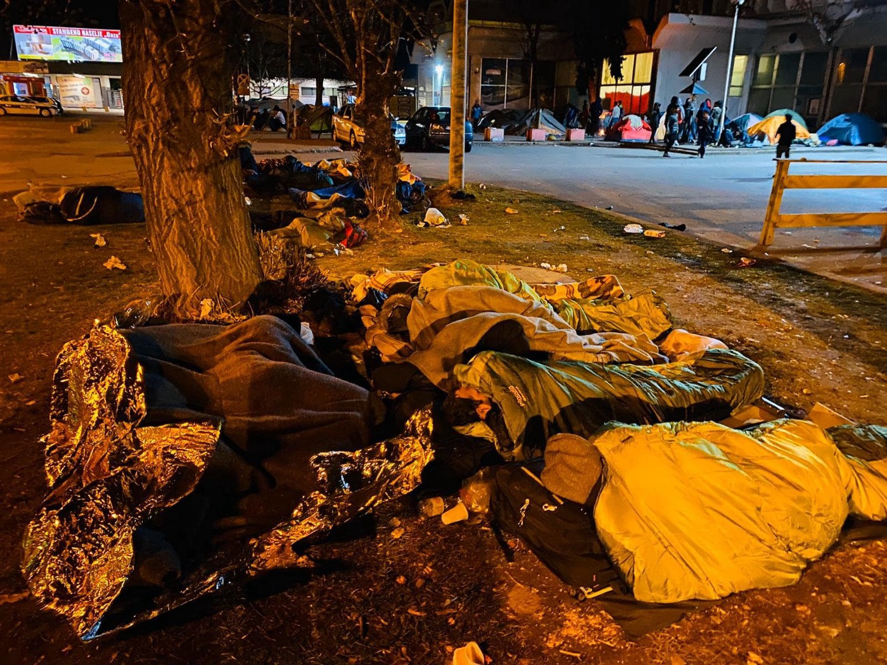

### AYS Daily Digest 2/3/20: A child dies off the coast of Lesvos
### Updates from Greece and the Greek\-Turkish border; Locals respond with more violence on Lesvos // EU countries send more defense to borders // Bulgarian pushbacks // Belgrade locals targeting refugees // A surge of arrivals in Tuzla, Bosnia and Herzegovina // and more…

[Are You Syrious?](@AreYouSyrious?source=post_page-----ef1d0ff4de14----------------------)

[Mar 3](ays-daily-digest-2-3-20-a-child-dies-off-the-coast-of-lesvos-ef1d0ff4de14?source=post_page-----ef1d0ff4de14----------------------) · 12 min read

### FEATURE: MONDAY’S UPDATES ON THE GREEK — TURKISH BORDER

The Turkish Prime Minister Erdogan announced on [Saturday](https://www.nytimes.com/2020/02/29/world/europe/turkey-migrants-eu.html) that Turkish forces will no longer stop refugees from leaving Turkey for Greece and Bulgaria\. He accuses Europe of providing very little help to Turkey, the country with the most refugees in the entire world, especially with the growing number of Syrians fleeing across the border over the last few months\. This decision to “open the door” caused a lot of outcry from European authorities over the weekend\. Human rights organizations are sounding the alarm that state violence should not be used against anyone trying to cross the border into Europe\. As this dramatic event is unfolding, here is a continuation of AYS’ reporting of the latest news and responses from the various parties involved:
### A child dies after a boat capsizes off the coast of Lesvos

At around 8:30 a\.m\. on Monday morning, a [boat with 48 people](https://www.aljazeera.com/news/2020/03/child-dies-boat-carrying-migrants-capsizes-lesbos-200302092321525.html) on board capsized off the coast of Lesvos near the airport\. A child was found unconscious and taken to hospital along with another child\. According to the [Greek Coast Guard](http://www.hcg.gr/node/22624) , _“No resuscitation attempts were made\. The other child is out of danger\.”_

The sad truth is, Alan Kurdi was not a lone example\. There have been many little Alan Kurdis since, and unfortunately there will continue to be, until Europe wakes up and does the right thing: putting human rights first\.
### A video surfaces of Greek coast guard trying to sink a dinghy

The video below was sent [to Sky News by the Turkish Coast Guard](https://twitter.com/Stone_SkyNews/status/1234454621818703873) and shows the Greek Coast Guard using long spears against a dinghy and also firing in front of the boat into the water\. They say it was taken at 07:26 Monday morning:

In response, Alarm Phone lamented: _“These images of the Greek coastguard trying to deter & capsize migrant boats are sickening\. Out in the open a war is carried out against people in distress at sea\. We condemn these criminal activities that will lead to further deaths if not immediately stopped\.”_
### Teargas at Evros

It has been reported that the goal of the Greek Army is to apparently [seal off](https://www.keeptalkinggreece.com/2020/03/02/greece-army-live-ammunition-exercises-aegean-islands/) Evros\. The Greek media reports, _“For this reason, patrols are enhanced 24 hours a day with thermal cameras while helicopters fly day and night controlling the entire border\.”_

[The Greek Military](https://www.keeptalkinggreece.com/2020/03/02/greece-army-live-ammunition-exercises-aegean-islands/) is also expected to continue its live ammunition exercises in Evros and on the hotspot islands on Tuesday\. According to a Greek Army statement, this involves the following: _“Shots will be carried out with live fire by light and heavy armaments with straight\-line trajectory, in sea regions east of the islands of the Eastern Aegean, from the island of Samothrace to Megisti\.”_ It will last 24 hours and the danger zones will be announced by local military commands\.
### Angry and violent response on Lesvos

As [Florian Schmitz](https://www.dw.com/en/refugee-crisis-in-greece-anger-and-foreboding-grow-on-lesbos/a-52615534?fbclid=IwAR0tAN74kFeLtO7TN81fiXPlcPdIP7Xeg-y6twDk6yK5ylu7uiSUJnrzyls) for DW reports:

> _“Locals on the Aegean island of Lesvos blocked the road to the Moria refugee camp on Sunday\. They are fed up and don’t want even more migrants on their island, crammed into an already overcrowded camp in disastrous conditions\. But boats from Turkey carrying many new arrivals landed on the island on Sunday morning — several hundred people, according to Greek media\._ 

> _The locals also threatened Erik Marquardt, a Green Party member of the European Parliament, and a group of journalists watching the scene\. The police detained Marquardt and the DW correspondent, who authored this article and made it clear that they were not allowed to go to the beach\.”_ 

Julian Busch, a freelance photographer, also reports violence outside Moria by locals:

Locals attacked the rescue mission Mare Liberum e\.V\. docked in Skala Loutron, Lesvos as well\. According to the mission:

> _“They shouted, threatened us & poured gasoline on our deck\! Our crew saw themselves forced to leave & is now anchoring offshore\. We’ll stay & continue monitoring\!”_ 

Update: There are reports of nearly 500 new arrivals being detained in the ferry terminal in Mytilini on Lesvos, and close to 400 in the north\.

> _Non\-existent facilities and services, people sleeping on buses and on ground\._ 

Aegean Boat Report reported late on Monday evening that: _“So far today at least 10 boats have arrived on the Greek Aegean islands, carrying **approximately 390 people** \. It’s very difficult to get confirmed solid information, most likely there are more boats arrived that I’m not aware of, but it’s difficult times\.”_

Lesvos had two boats, where two children were taken to hospital and **one child sadly passed away** ; Chios had 1 boat, which included 20 children; Oinousses had 1 boat, in a very difficult area where they will be helicoptered out first thing in the morning; Leros had 2 boats; Farmakonisi had 3 boats; Strongyli had 1 boat\.

Some other important island news:

Responding to the news from Turkey, [governments in Austria and Hungary](https://www.infomigrants.net/en/post/23113/austria-there-will-be-no-waving-them-through-at-the-border?fbclid=IwAR2ZwRVFEMsEIT-qo72galah-BaF22ico15-drJfsiuBJ4QcLloq1UKwBPw) are preparing to beef up the defense on their borders, in case people are able to travel the Balkan route through Greece\. As Austria’s Interior Minister Karl Nehammer said “There will be no waving them \[migrants\] through at the border\.”

Germany’s Prime Minister [Merkel](http://www.ekathimerini.com/250129/article/ekathimerini/news/merkel-says-erdogan-shouldnt-use-refugees-to-show-discontent?fbclid=IwAR20ccWhCBbcTNTPk1utEUEfOgNFJxH0N53hH_iEXorhU35AH8Uh0E0TwG0) made her response on Monday, saying:

> _“I understand that Turkey is facing a very big challenge regarding Idlib,” Merkel told reporters\. “Still, for me it’s unacceptable that he — President Erdogan and his government — are not expressing this dissatisfaction in a dialogue with us as the European Union, but rather on the back of the refugees\. For me, that’s not the way to go forward\.”_ 

[The entire leadership](https://greece.greekreporter.com/2020/03/02/the-entire-leadership-of-the-eu-will-visit-evros-on-tuesday/) of the European Union will be on Evros on Tuesday to assess the situation on the Greek/Turkish border\. The Greek Prime Minister will also be there, and wants the message to be clear that what is happening in Evros requires a European response, in other words it is not only Greece’s responsibility\.

On Sunday in Athens, European Commission Vice President [Margaritis Schinas](https://www.keeptalkinggreece.com/2019/12/02/schinas-europe-migration-solidarity/) made the remarks:

> _“In a few months, the European coast guard will add guards to protect its borders\. This shows the EU’s decision — finally — to protect our common borders…\(The Commission\) will propose a new agreement on migration and asylum\. All EU member states will share the burden and pressures fairly\. **Either Europe shows solidarity, or it is no longer Europe\.** Greece is Europe, and it will manage its difficulties as Europe, with the support of its partners\.”_ 

### Hundreds of NGOs in response…

Hundreds of groups and organizations worldwide have come together to sign the multilingual Statement “demanding peace, fundamental rights and freedoms of every person on the move\.”

Their main point addresses: _“Xenophobia, racism and their normalization must be opposed everywhere they surface, be it in Turkey, Greece and anywhere else\. The \(use\) of the lives of migrants, asylum seekers and refugees reduced to a threat and a bargaining chip must end, both in domestic electoral campaigns and in the relations between the Turkish government and the EU\.”_ Read the statement in full [here](https://crossbordersolidarity.com/?fbclid=IwAR30NWpUsxfm1t81ytXThNJxo7yzuFoYDMZtqdYAdx6a-jhB9T8MvmiinKo#english) \.

Europe Must Act Now for the Immediate Decongestion of the Aegean Islands\. \(Here is an excerpt from the open letter signed by over 75 NGOs and thousands of civilians, and counting…sign it [here\!](https://www.change.org/p/charles-michel-europe-must-act-now-for-the-immediate-decongestion-of-the-aegean-islands-37ac8a88-cf7e-4ce2-9a98-1b2969f1bda4) \)

To Charles Michel, president of the European Council, Ursula von der Leyen, president of the European Commission, and Heads of Member States,

… **Today, Europe must act to correct 5 years of negligent policy\-making** … As the humanitarian situation worsens beyond anyone’s reckoning, it is your responsibility, as EU leaders, to ensure decisive and coordinated action to protect human life\. We, the undersigned, call for:
1. Immediate action from all Member States to decongest the Aegean Islands of Lesvos, Chios, Samos, Kos and Leros through fair relocation of asylum seekers across European countries for the sake of universal human rights and in accordance with obligations set out under Art 78\(3\) of the TFEU and the 2001 Directive on Temporary Protection\.
2. The immediate provision by EU states of support to, and oversight of, the Greek government’s Reception and Identification Centres, to ensure access to a safe and legal asylum process in accordance with humanitarian law, the EU Charter of Fundamental Rights, and the European Convention on Human Rights\.
3. The creation of a shared European register of legal, medical and protection staff to support the Greek government through rotational placements in the Aegean in processing asylum applications in a humane, dignified and legal way\.

In a statement on Monday, [the UN’s refugee agency](https://www.unhcr.org/news/press/2020/3/5e5d08ad4/unhcr-statement-situation-turkey-eu-border.html?fbclid=IwAR20ccWhCBbcTNTPk1utEUEfOgNFJxH0N53hH_iEXorhU35AH8Uh0E0TwG0&__cf_chl_jschl_tk__=33312099cb92e0f91792bd0a743bce586d83ba80-1583200372-0-AYvsNp4Bye08THeb0PEW9RcrxT-Gbp-2JJGIxEyL4NdO_pYxIAfd1MdP1XZgN0CdliR9AyNf-nGzdACeSl6sBzT-d7N2DIka47y8VxxlOrxEg81Y6cmeOTfTVwxy2nkdGQ_e7HnblwynyEXwIcawM6sQ-w2AGmV7zZOX15tpBiirsxmWS5_5l2PEKf12je0xXRtPm6qYz2ofJ5suGDOMzrwF9MJbivIw1uc79xhZJqDqUjidMnXhVIx6GFh08KeXq9AEnMnul5Oe-ylB5GAYUiUPCpjb3o6XuporTpbjLFIa5-I0z87X5BJRbYYbsltjXw_9-8d_yLGYcFcMFCGwHHB74DDO7tMpPgcLgVGL1HtPXCm6zmfXbacmWj8sqIlDHmBFbcUOsFC5_M8DFQjK_kI3ymiIzKkxqVpykJtG6pAnFn5Wi60tahD3AXdYf-fBgfJ6JDKQfK8lYJG6I0tjM6k) dispassionately emphasized the need to refrain from “excessive or disproportionate force”, confirming that systems of asylum need to remain intact\. They send the reminder that:

> _“Neither the 1951 Convention Relating to the Status of Refugees nor EU refugee law provides any legal basis for the suspension of the reception of asylum applications\. Article 78\(3\) of the Treaty of the Functioning of the EU \(TFEU\) has been evoked by the Greek Government in this regard, however this provision allows for provisional measures to be adopted by the Council, on a proposal from the Commission and in consultation with the European Parliament, in the event that one or more Member States are confronted by an emergency situation characterised by a sudden inflow of third country nationals while it cannot suspend the internationally recognized right to seek asylum and the principle of non\-refoulement that are also emphasized in EU law\. Persons entering irregularly on the territory of a State should also not be punished if they present themselves without delay to the authorities to seek asylum\.”_ 

### TURKEY

With the news that Turkey detained four journalists on Saturday in the country’s western Edirne province for covering refugees along the border, C [ommittee to Protect Journalists](https://cpj.org/2020/03/journalists-covering-refugee-movements-in-turkey-d.php) ’ Europe and Central Asia program coordinator, Gulnoza Said insisted that:

> _“As Turkish authorities crack down on journalists covering refugees in the country, they are revealing how little they care for the freedom of the press…Authorities must immediately release journalists who remain in detention and drop any charges against them, and allow reporters to work freely\.”_ 

The journalists are:

> _“Reporters **İdris Sayılgan** and **Naci Kaya** from the pro\-Kurdish Mezopotamya News Agency, and reporter **Rawin Stêrk** and camera operator **Mehmet Şirin** Akgün from the Iraqi\-Kurdish outlet Rudaw, according to reports from Rudaw and the Mezopotamya News Agency\. Officers accused the journalists of filming in a forbidden zone, according to those reports\.”_ 

The authorities released Kaya on Monday\. Sayılgan is set to be sent to prison pending trial “ _for an alleged parole violation_ \.” Both Stêrk and Şirin remain in custody \(at this writing\) and it remains unknown if charges have been brought against them\. More [here](https://cpj.org/2020/03/journalists-covering-refugee-movements-in-turkey-d.php) \.
### BULGARIA

[Bordermonitoring Bulgaria](https://bulgaria.bordermonitoring.eu/2020/03/02/bulgaria-is-not-changing-its-push-back-policy-at-its-border-to-turkey/?fbclid=IwAR3QqpzP_5A4DsQKc5DTXTejmIRNMZPCWOWg-_qWXEH6YaxECNDowNlyFIc) reports that pushbacks will not stop along the Turkish and Greek borders, in spite of the events of this weekend, when Turkey announced it will no longer stop people trying to migrate across\.

> _“Following this statement thousands are moving on to Edirne, which is located in the three\-country border region\. For this they used buses \(non\-stop\), organized by the Turkish government, some took taxis\. While during the night many people tried to cross the Turkish\-Greek border, 60 migrants have been pushed back at the Bulgarian\-Turkish border on the following morning\._ 

> _The practice of pushing people back to Turkey has not changed so far…The Bulgarian Defence Minister Krassimir Karakachanov just stated that the Bulgarian army is ready at any time…Media reported that FRONTEX installed 60 additional staff members to the already existing 50 ones at the Bulgarian\-Turkish border\. This raises the question of whether FRONTEX will only watch the Bulgarian authorities while they go on with their push\-back practice in the upcoming days\. Until now, the number of crossing incidents around the Turkish\-Bulgarian border near Kapıkule/Kapitan Andreevo seems much lower in comparison to the Greek\-Turkish border around Pazarkule/Kastanies — both border crossings are only about 10 km away from each other\._ 

> _Meanwhile in the whole border region thousands of people, including families, are waiting in the border region under critical weather conditions\. Bordermonitoring Bulgaria calls on the Bulgarian authorities and FRONTEX to stop the push back practice, which is against international law and the Non\-refoulement principle\.”_ 

### SERBIA

Following the recent developments in Belgrade, a group of civilians calling themselves the Narodna Patrola \(National Patrol\) group, are still going around Belgrade targeting people on the move and falsely introducing themselves as police officers\. The latest video of their actions shows how they have started introducing themselves as the authorities\. They target darker skinned men and “share pamphlets containing creepy rules of conduct that should be followed\.” Some of the members have discussed “sending kids” to accompany their targets to figure out where they sleep\. More [here](https://www.blic.rs/vesti/drustvo/narodna-patrola-opet-divlja-beogradom-ponovo-presrecu-migrante-predstavljaju-se-kao/mee8xlg?utm_source=blic_naslovna_sidebar&utm_medium=sidebar_najnovije_info&fbclid=IwAR34gzp-IUZbly43U9Ow4nHdQAuaWO5w6V1XIyrzaDFnUnmYQjAn5jo7-8k) \.
### BOSNIA AND HERZEGOVINA
### Tuzla

During the day more than 200 new people arrived, among them were two families with seven children, followed by about 150 more people in the afternoon\. The two non\-working days in a row \(due to the Independence Day\) will surely take their toll on the situation in the city\.

There is a multitude of people with barely anything needed for survival — no proper clothes, shelter, amenities, food or anything of the kind\. Along with the locals, individuals and groups who continue assisting people in transit, during the day the police assisted in making the distribution and assistance possible, given the conditions and the number of people\.

There is a growing number of unaccompanied minors who are not treated any differently than the rest of the people\. The officials, both those of the city and the heads of the Canton, have so far done nothing to alleviate the troubles and difficulties the people are in, or to help their own citizens in dealing with what is becoming an unsurmountable number of issues, from the health problems, sleep deprivation and poor psychological state of most of the people passing through, to the desperation of those with no place to lay their head and those who have been coming back from the north of the country after a number of failed attempts to cross the border and continue, having been beaten up and robbed of their few possessions\.

SWEDEN

FINLAND

[A deportation](https://www.facebook.com/pg/AmasoAfg/posts/?ref=page_internal) was expected on Monday evening from Finland to Afghanistan\. Afghanistan Migrants Advice & Support Org said “The number of Afghan facing deportation is not confirmed as of now, but AMASO has received requests to help two individuals so far\. More updates following …”

UK

**Find daily updates and special reports on our [Medium page](https://medium.com/are-you-syrious) \.**

**If you wish to contribute, either by writing a report or a story, or by joining the info gathering team, please let us know\.**

**We strive to echo correct news from the ground through collaboration and fairness\. Every effort has been made to credit organisations and individuals with regard to the supply of information, video, and photo material \(in cases where the source wanted to be accredited\) \. Please notify us regarding corrections\.**

**If there’s anything you want to share or comment, contact us through Facebook, Twitter or write to: areyousyrious@gmail\.com**

_Converted [Medium Post](https://medium.com/are-you-syrious/ays-daily-digest-2-3-20-a-child-dies-off-the-coast-of-lesvos-d7ddbb4522f9) by [ZMediumToMarkdown](https://github.com/ZhgChgLi/ZMediumToMarkdown)._
