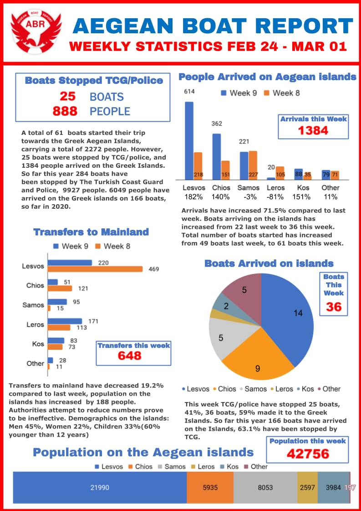
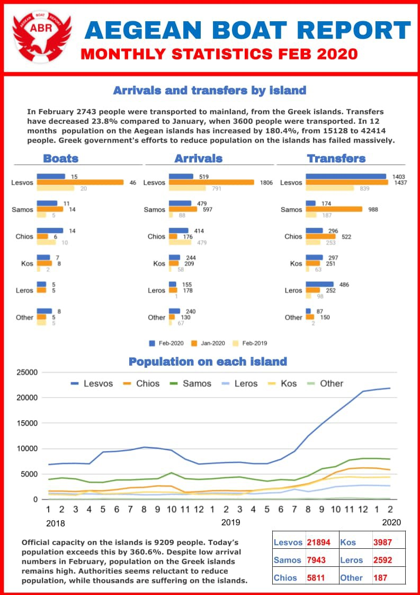
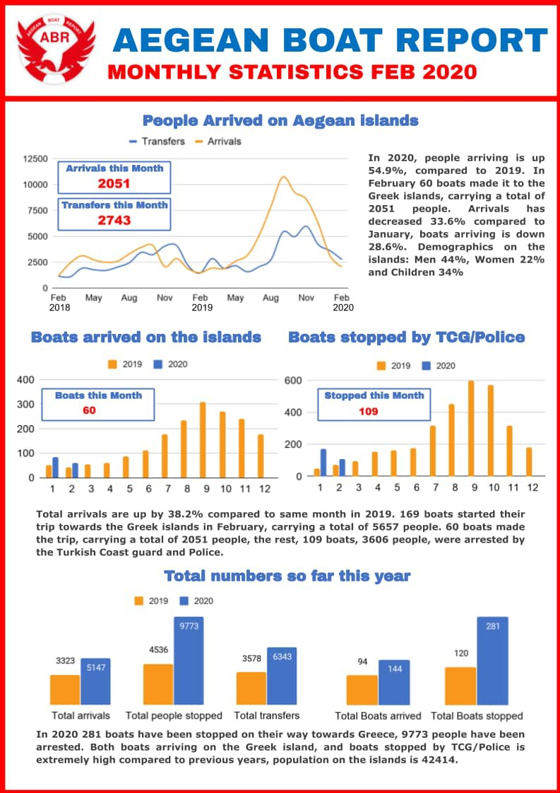
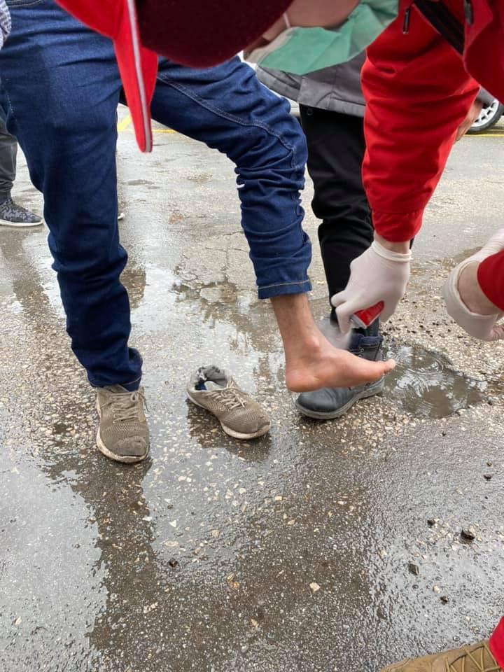
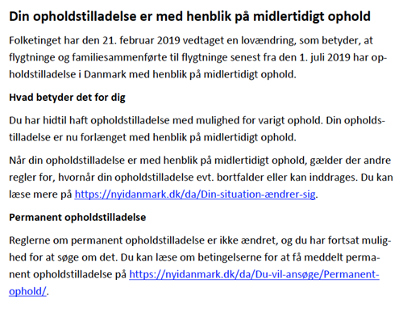

### AYS Daily Digest 3/3/20: Deliberate cruelty as official policy
#### Chios warehouse burnt down, reactions / Greek decision to suspend asylum claims draws a number of harsh reactions from all over / The bottom hit by the EU Commissioner&co\. is deeper than we thought / News on the arrivals / Tuzla volunteers stop activities / Changes in terminology on documents confuses people in Denmark

](assets/a2290587bd6c/1*jUymnjZYTcsBUZGCci_WFA.jpeg)

[“The solidarity will win\!” — Chios, photo by: Katerina Anastasiou](https://www.facebook.com/lll.KAT.lll?__tn__=%2Cd%2AF%2AF-R&eid=ARAQqnbxPe5V_vW5Dqq0I6uRSmDxZSXa5QNm9B4t04WMfFDEaglCx3Gsy8EshCjsSuSfkL1_7xrnFtB4&tn-str=%2AF)
#### FEATURED

According to Greek police tear gas is being fired from the Turkish side of the border, but the same information comes from different sides about the situation on the Greek side\. In an effort to “blackmail” Brussels into offering more money or supporting Ankara’s geopolitical aims in the Syrian conflict, Turkey continues to let people uninformed and unprepared to go towards the closed Greek border that has sadly started to symbolize the European “shield” in the face of some of the most vulnerable people out there\. Please, read our previous News Digest editions to find out more on the events of the past few days\.
#### Chios warehouse burnt

Clashes between refugees and Greek border officials continued\. One of the key warehouses on Chios island was completely burnt, destroying many emergency items, clothes and other helpful and basic items for people in need\.

The video published by [Europe Must Act](https://www.facebook.com/europemustact/?tn-str=k%2AF) shows the ruins left behind\. They also commented:

> This arson against a local warehouse, run by members of the Chios solidarity group is testimony to how divided the Aegean Islands now are, and how dangerous the situation has become\. As the EU Leaders meet in Greece, we keep calling for immediate action to decongest the islands, de\-escalate the situation, and to do so through effective policy measures that safeguard human lives and enshrine the right to a fair and safe asylum process\. 

Locals have been blockading the road to Vial for the past three days\. No NGOs or volunteers were allowed to pass\. Food trucks were blocked as well until police forces came to open the way for them\. Initially, they were letting organizations through, but not newly arrived people\. Those are now being housed in two buildings, one in town and one outside of it\.
Today however the blockade did not allow anyone through, including the food trucks\. Those were finally let through later in the day when the police intervened\.

**Find the story on attacks at journalists here:**

> “As long as we tolerate our neighbours, old friends, family, collegues or anyones casual passive racism, it has the potential to explode\. And you will one day find these people with facists on the street, shouting to exterminate all that is other\. From the people we allow to set to policy, to the bureacrats who sign the checks, to their collaborators in the working class, to the pigs who protect them, all of them are guilty\. And as long as we leave this hate unchallenged we are too\.” — [No Border Kitchen Lesvos](https://www.facebook.com/NBKLesvos/?__tn__=kC-R&eid=ARCtMzGJORuWZgJsOI3UqmPoJNZ6_sJFCOH6mH3eP00QwWhFs9QdxZUbbuVV22lgiIWnbuSf5pw3gRqT&hc_ref=ARRwyMjX9ao66DbQSHt5YF5UUjrNICOBGEu6_1IZdI8cy4yK1_PT2E1BquDKvwkm1vc&fref=nf&__xts__%5B0%5D=68.ARDx1_OZhQRG-GbzGp8eHSPx64ndkAmgpq3Ee7HMbnNXJNRWEIHexQQ2CrNDnqMZ5yTfHwuf38CbOt0faCqYEuTD6TiK4wK2oISSonR89Wr38DNx5DHkwYVygVaTYTKQNHvUk42WJ_fCb6bzMVpil73A1m6UnxMBBkOSyEeTxnB4CLrAeGKeucYNRplNm-dvd0i6KXJK4vKV63RgXMI_RGelVEkxQLsNhUZ5TkUYlLXgdySB9fn3uabn9aJNt1mTaZMU25o7wgPu-uWqn5bMxU9jOOzxoJAawuPKBJP6DW7xNamQivMJEmDPYWuFabmQnpYzjAKs1EJxMtbwqshQ2IcxFA) 

The Greek authorities said that in the 24 hours between Monday and Tuesday morning, they had “prevented a total of 5,183 people from entering Greece, and arrested 45 people”\. They also said they had stopped more than 24,000 attempted illegal crossings at the land border with Turkey since early Saturday, and arrested 183 people\.

Greece has sent military and police reinforcements to the area, which have used tear gas and water cannon to repel mass attempts of people to cross into the country\.
#### Dear EU, the people who are leading you prioritize lawlessness over human lives

> “If the EU’s highest officials are willing to turn a blind eye to such abuses and violations of international law, they will invite more of the same\.” — [Human Rights Watch](https://medium.com/u/61be7482827f) 

■■■■■■■■■■■■■■ 
> **[Andrew Stroehlein](https://twitter.com/astroehlein) @ Twitter Says:** 

> > The Universal Declaration of Human Rights &amp; EU Charter of Fundamental Rights recognize the right to seek asylum. 

Many asylum seekers in Turkey do not have effective protection and Turkey does not meet EU criteria for a safe 3rd country to which asylum seekers can be returned. 

> **Tweeted at [2020-03-04 06:25:52](https://twitter.com/astroehlein/status/1235089054355595265).** 

■■■■■■■■■■■■■■ 

We have previously published a post reflecting our personal feelings and reactions as activists and fellow human beings to people in distress, but also as EU citizens whom these people are representing:

The text read out:

> SHAME ON YOU, EU OFFICIALS\!
 

> If you want to find a perfect illustration of the EU hypocrisy, just follow official Twitter accounts of the President of the European Commission [Ursula von der Leyen](https://www.facebook.com/ursulavonderleyen1/?__tn__=%2CdK%2AF-R&eid=ARD5hJbSbl7tsg0rLSvLvlP_-PZ9gf3x9Bn1jEU1xugaA95_26XUMGRtv8XyJusfe-EzrEtCL0jceiMG) , President of the European Parliament [David Sassoli](https://www.facebook.com/pagina.DavidSassoli/?__tn__=%2CdK%2AF-R&eid=ARDIjI5ql8vuQFGp4oW6Gx7NNNJrsBqvYJXN4jrR_Hsk4_KaPpXd8QSXDlALR0x9kTM6yfrBWL-DpJ27) , President of the European Council [Charles MICHEL](https://www.facebook.com/CharlesMichel/?__tn__=%2CdK%2AF-R&eid=ARCL33k5MBatgDjzsJJ5q-a5M8cehMkP8IJFiBuvHCKZrDlFPKYci1ne1-KP9JMqsODW4Ue85Creo96X) and Croatian PM Andrej Plenković\. Together with the Greek Prime Minister Kyriakos Mitsotakis, they’ve “inspected the situation at the border” with Turkey from a military plane\. Cowardly and far enough to see people as mere dots on the ground\. Depersonalised, inspected from above like they’re a natural catastrophe\. They didn’t talk to any of the affected people, they only talked to each other\. But they had time to do a quick social media PR before holding a press conference on the issue they’ve glanced from distance\. Hypocritical dedication to European values, hypocritical interest for well\-being of refugees and migrants, hypocritical solidarity with people of Greece, who actually needed support years ago\. Hard to expect anything but more hypocrisy and militarisation from these folks\. 

During and after their visit, the EU representatives kept enforcing the defensive rhetoric, speaking of how they would organize armies at the borders and such, not mentioning their plans to actively get involved in solving at least some of the most burning issues when it comes to current conflicts, persecutions, political and economic injustices driving these people out of their homes, lands they grew up in and having to often leave their dignity along the way as well\.

The EU Commissioner for Home Affairs has publicly stated that “assisting people in need remains a priority”\.

However:

■■■■■■■■■■■■■■ 
> **[Amandine Bach](https://twitter.com/AmandineBach) @ Twitter Says:** 

> > @[YlvaJohansson](https://twitter.com/YlvaJohansson) @[vonderleyen](https://twitter.com/vonderleyen) @[EP_President](https://twitter.com/EP_President) @[eucopresident](https://twitter.com/eucopresident) @[EU_Commission](https://twitter.com/EU_Commission) If assisting people in need remains a priority, it is urgent that you speak out against the new measures of Greek government that have enshrined refoulement in law 👇and violate EU and international law https://t.co/jKrEAkOZQu 

> **Tweeted at [2020-03-03 08:50:52](https://twitter.com/amandinebach/status/1234763157987569665).** 

■■■■■■■■■■■■■■ 

■■■■■■■■■■■■■■ 
> **[Equal Rights Beyond Borders](https://twitter.com/EqualRightsBB) @ Twitter Says:** 

> > Yesterday, a legislative act suspending the submission of asylum appl. from 01/03 was issued -retroactively! That this is illegal: well known. That @[PrimeministerGR](https://twitter.com/PrimeministerGR) doesn't care: incredible. That @[EU_Commission](https://twitter.com/EU_Commission) doesn't act: a matter of concern. #RefugeesGR
[bit.ly/2wkuBCr](https://bit.ly/2wkuBCr) https://t.co/8BryqgeQEC 

> **Tweeted at [2020-03-03 07:07:04](https://twitter.com/equalrightsbb/status/1234737034939510785).** 

■■■■■■■■■■■■■■ 

More reactions of shame and disbelief at what the head of the Commission managed to say, regarding to Greece as a “shield” of Europe, arriving from many sides:

■■■■■■■■■■■■■■ 
> **[MSF Sea](https://twitter.com/MSF_Sea) @ Twitter Says:** 

> > #MSF outraged as EU @[eucopresident](https://twitter.com/eucopresident) and @[vonderleyen](https://twitter.com/vonderleyen) do not condemn violence against refugees, violent pushbacks and remain blind to human tragedy on Greek islands. History written as EU abandons basic human values and last bit of moral leadership. https://t.co/Wpb2spOHtg 

> **Tweeted at [2020-03-04 11:40:04](https://twitter.com/msf_sea/status/1235168126901399553).** 

■■■■■■■■■■■■■■ 

In Germany, these events sparked many reactions and concrete actions\. The Seebrücke has called for people to join actions in their towns and regions and to start their own so as to strengthen the voice of civilized humane Europe\.

> We call for protests nationwide against the murderous isolation of the European external border\! Participate in nationwide campaigns all week\! 

> Participate in demos and rallies in your city\! You can find all the promotions below\!
 

> Nothing is planned for you yet? Then organize an action yourself\! [Send them to us here\!](https://docs.google.com/forms/d/e/1FAIpQLSdeOI9J06m2mIqKl9okEHWPqZHtc1TSrv3ZD3BPbuthdUst8w/viewform) 

> The Greek military and Frontex fire at the Turkish border with tear gas, stun grenades and water cannons to seek protection, in front of Lesbos a small child drowned in front of Lesbos in the presence of the Greek coast guard\. While families, children and young people are being fought militarily at the border, reception facilities are empty in Germany and other countries, and hundreds of cities are ready to accept them\. Let us work together loudly to ensure that people in Greek camps and at the Greek\-Turkish border are treated humanely and evacuated\. 

> We say: We can and want to welcome these people and take them in\. We give people a future and do not allow ourselves to be blackmailed by the fascist Salvinis, Orbans and Erdogans of this world\! Human rights for everyone\! Against the fortress Europe, Erdogan and the crisis of humanity\! Defend the fundamental right to asylum\! \#WirHabenPlatz 

Find more details here:

#### GREECE

Greece’s National Meteorological Service EMY issued a weather warning of heavy rainfalls and thunderstorms, possible with hail falls, and powerful South winds up to 8 and 9 Beaufort\. The barometric low is expected to hit Greece from the North\-West as of Tuesday afternoon\.
### Weather warning

The road to Vial has been blocked by demonstrators all day\. No NGOs or volunteers allowed to pass\. Food trucks were blocked as well until police forces came to open the way for them
#### Arrivals

Here is the weekly report from Aegean Boat Report for Week 9, 2020\.

Arrival numbers for 01\.03\.2020, 902 people, has not been added to population numbers by Greek government, and can be connected to the latest developments on the Greek Aegean islands and the temporary shut down of asylum registrations\.

Here is the monthly report from Aegean Boat Report for February 2020:

### Children must be relocated\!

64 human rights and humanitarian organizations said in a [statement](https://www.hrw.org/news/2020/03/04/ngos-urgent-call-action-eu-relocation-unaccompanied-children) that the children trapped in the inhumane conditions at the Aegean islands urgently need to be taken to safety in the territory of the EU Member States, while ensuring that the children’s best interests are taken into account, HRW reports\.

> The groups warned of widespread violations of children’s rights and threats to their health and safety across the Aegean islands’ refugee hotspots\. Action is all the more urgent in light of the [escalating violence](https://www.bbc.com/news/world-europe-51695468) on Lesbos and as increased arrivals to the islands could lead to further deterioration of the dangerous conditions in the camps\. 

“ Exposed to multiple dangers, many are forced to sleep out in the open, without essential support to alleviate their suffering or uphold their rights\. All the children must be protected\. Those with family in other parts of Europe must be reunited with them\. This can happen through existing reunification channels or new bilateral agreements between Member States and Greece”, the head or the Greek IRC said\.

#### BOSNIA AND HERZEGOVINA
### Tuzla

The Tuzla volunteers informal group who upheld the efforts to help and support the people on the move in tranzit through their city will no longer work in the way and capacities they have been since the whole situation started in Tuzla\. It is no longer possible for them to keep providing the type of assistance and keep the presence they think is needed in order for things to run smoothly and people to feel welcomed\. It is no longer safe for them to work this way, they are overwhelmed with the number of people, needs, lack of manpower and aid, but also solid support from the big organisations and firstly from their city, cantonal and federal officials\. They also hope this decision will move the responsible politicians in charge of the city to do something more sustainable to help alleviate the suffering of the people\. They will keep the warehouse with needed items as some of the vulnerable people are being hosted in different ways and this still requires support\.

However, faced with the challenges, they feel that more radical actions are needed in order for the mangitude of peeople affected to be understood in the right places, for those in charge to take responsibility and fix what can be fixed at this point\. The local organisations will keep on providing help in the minimum scope and to the most vulnerable ones\.
#### DENMARK

Many seem to have misunderstood the recent change in wording on the asylum status and documents change in Denmark\. 
People are also confused over the fact that the municipality now informs all refugees about ‘access to a lot of money’ if they go home voluntarily, the Refugees\.dk [report](http://refugees.dk/en/news/2020/march/confusion-over-the-words-temporary-stay/?fbclid=IwAR1yxdTuHVUV8E2QugbhZq75lN1wvkCeUkWilYH7Nc5bVhFch1UwPmEFong) \.

> Before the change, there was a destinction between “residence permit allowing for durable stay” \(asylum under Danish art\. 7\(1\), 7\(2\) and 8, and “residence granted for temporary stay” \(humanitarian stay and asyl under 7\(3\) \. Since February 2019, **all** refugees are under the second wording — but everybody **still** has the access to apply for permanent stay\. 

The parliament did pass some rules making it easier to revoke residence permts, but for most refugees it will not be possible because of international conventions, they conclude\.

**Find daily updates and special reports on our [Medium page](https://medium.com/are-you-syrious) \.**

**If you wish to contribute, either by writing a report or a story, or by joining the info gathering team, please let us know\.**

**We strive to echo correct news from the ground through collaboration and fairness\. Every effort has been made to credit organisations and individuals with regard to the supply of information, video, and photo material \(in cases where the source wanted to be accredited\) \. Please notify us regarding corrections\.**

**If there’s anything you want to share or comment, contact us through Facebook, Twitter or write to: areyousyrious@gmail\.com**

_Converted [Medium Post](https://medium.com/are-you-syrious/ays-daily-digest-3-3-20-deliberate-cruelty-as-official-policy-a2290587bd6c) by [ZMediumToMarkdown](https://github.com/ZhgChgLi/ZMediumToMarkdown)._
