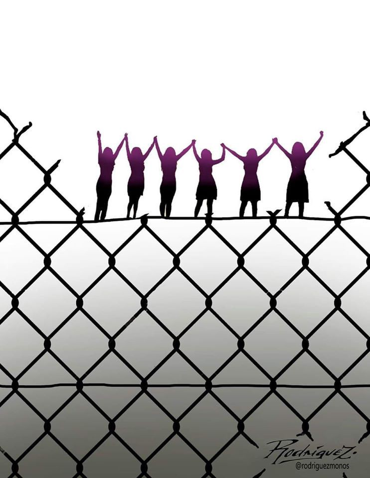
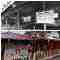
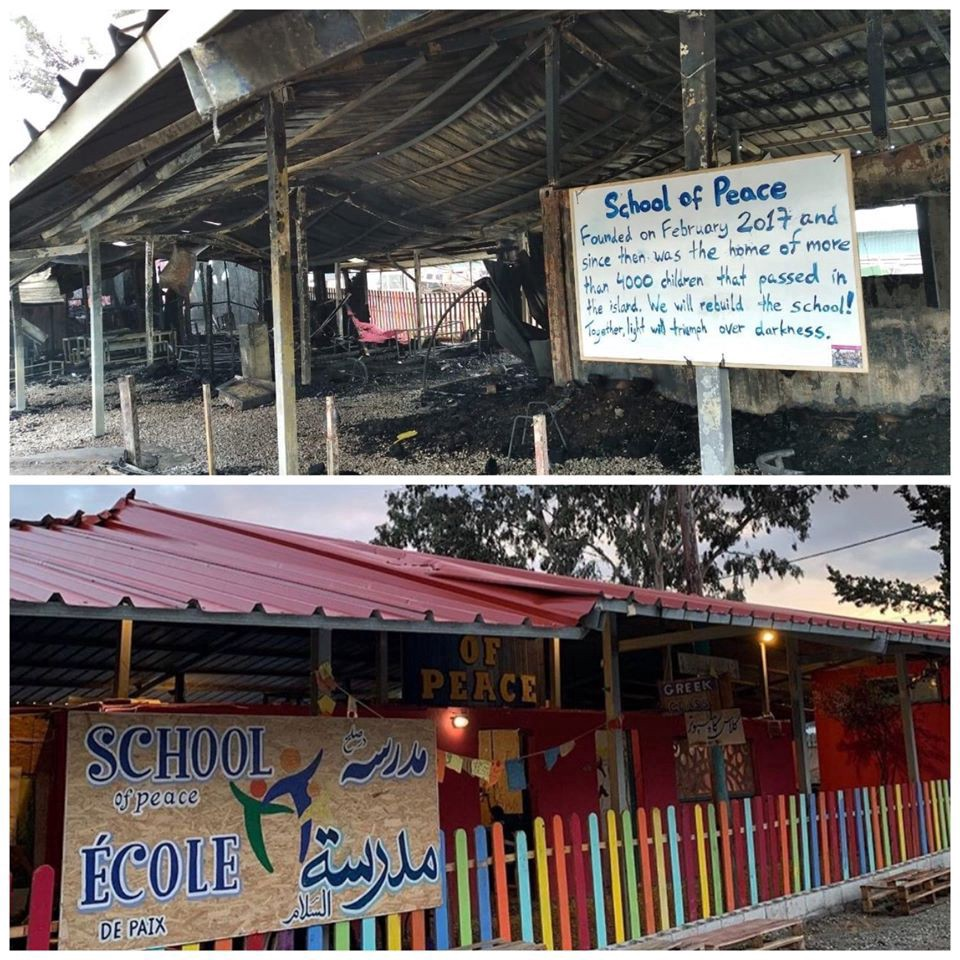
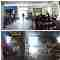
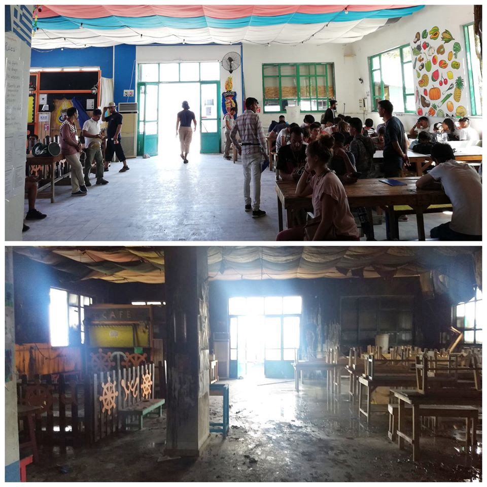
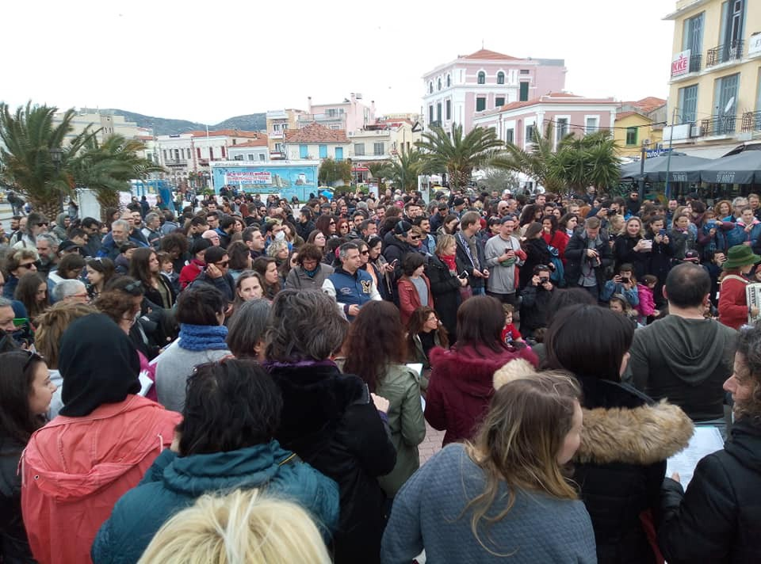
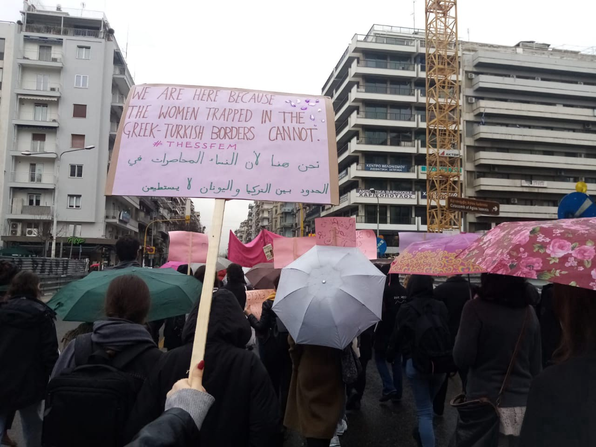
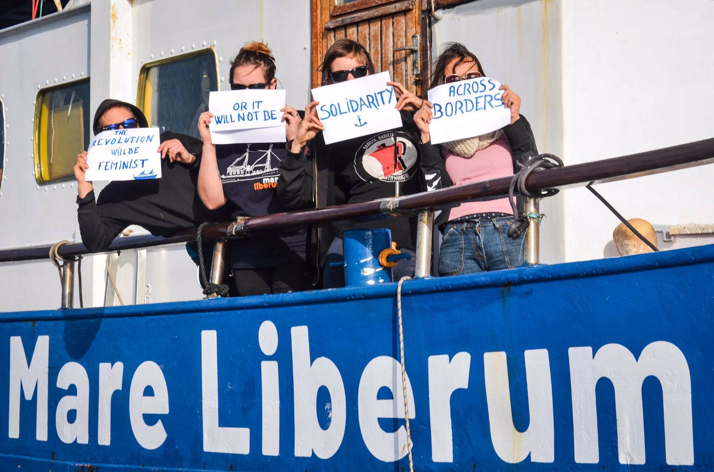

### AYS Weekend Digest 7–8/3/2020 Greece: Rhetorics of “invasion” cause more damage daily
#### Updates from Lesvos and the land border between Greece and Turkey\. Greece: Further cuts to support for refugees\. Libya: Fire at Zintan detention centre\. Germany: 5,000 people against institutional violence at Europe’s border\. Albania: Syrian group reach the country from Greece\.

### GREECE: The rhetorics of “invasion” cause more damage daily\.

Continuing our reports from the Greek borders, on Saturday 7th two buildings of the One Happy Family community centre in Lesvos were deliberately set on fire\. Luckily no one was inside\.

From One Happy Family:

> _It’s not buildings that burned down\._ 
 

> _It’s part of a place of hope and solidarity that were destroyed by this fire\._ 

> _It’s with a broken heart that we inform you that the school building burned completely down\. Our partner [בית ספר השלום לפליטים ביוון — The International School of Peace](https://www.facebook.com/InternationalSchoolOfPeace/?__tn__=K-R&eid=ARCeuMa08N70kBMk1AwyNgWzMB7ZI64jEVPjsRxd_SuCxgqEtkGcfCN2ej0qWjQw7id3UMO8kWilBKsA&fref=mentions&__xts__%5B0%5D=68.ARCZWyYPpUtvvqgoSfcZcsTl5tE0AtMEhaKzVkJwgouhhygnMzUDZZ_0A7_FUfhAnkOtyW3cSNdI_ejqAgnRENIYYbgzw5A2Byu-xqkPKnGps_eF4YlrpuKSm6d8M0j9T4_qiBKD0HLsJQTU45z-R8y774EzOtxGSAzzaX0j4X9rMPov8D1WjEtzG1VSVHXYm7s7igzR3jTYtksSHwqDOFWRm77qEnPyorhNNlGDbyMf66Tz5NbsJc1QUs-xBpmJz12QqHMXqEpDm_GQrjRNQRqMrVHJOvC15GXYuPGXUzSS9wEB-vpETv9mP7zkQOX3FsBNAhnaAEq16IwXd5VYRFM) run the children school there — allowing children stuck on Lesvos to have one of their basic right: Education\. Always with dignity and respect\. A basic right that isn’t given to them in Moria\._ 

> _At the same time classes for adults took place every day — allowing people to have a purpose, aim and as our Adult School Director Abdul put it “to do something useful while waiting”\. While waiting, sometimes for years, in an overcrowded European Refugee Camp\._ 

> _Our two main offices, the coordination team office and the helpers office, burned down completely as well\. These offices were the heart of the busy community centre — a place where everyone was welcome, where the visions of OHF have been formed and noted on the walls — “Humanity will win\!” Where all of our Helpers had a special place with their picture being put on the “Wall of fame”\. Dear former helpers, your pictures are gone, but all of you are always in our hearts, never forget that\!_ 

> _All the destroyed things are devastating, it will take us some time to recover and make OHF accessible again, but there is a very important message that we want to share:_ 

> _We are still shocked by the pictures of OHF and the School of Peace in flames\._ 
 

> _We are amazed by all your kind words and messages\._ 

> _No one got hurt and we still do not know how the fire started\._ 

> _But what we really need now is not only your kind words and your financial support\._ 
 

> _We don’t need anger or hate\._ 
 

> _What we need is a political change\!_ 

> _The real victims are the people seeking safety in Europe\._ 
 

> _The people on the Aegean Islands\._ 
 

> _All the people who are trapped in inhumane and unlawful conditions since years\!_ 
 

> _As well as the locals of the Aegean Islands that are left alone\._ 

> _We need all of you to stand up and fight for a humane European asylum system, for freedom of movement for everyone and for [\#Safepassage](https://www.facebook.com/hashtag/safepassage?source=feed_text&epa=HASHTAG&__xts__%5B0%5D=68.ARCZWyYPpUtvvqgoSfcZcsTl5tE0AtMEhaKzVkJwgouhhygnMzUDZZ_0A7_FUfhAnkOtyW3cSNdI_ejqAgnRENIYYbgzw5A2Byu-xqkPKnGps_eF4YlrpuKSm6d8M0j9T4_qiBKD0HLsJQTU45z-R8y774EzOtxGSAzzaX0j4X9rMPov8D1WjEtzG1VSVHXYm7s7igzR3jTYtksSHwqDOFWRm77qEnPyorhNNlGDbyMf66Tz5NbsJc1QUs-xBpmJz12QqHMXqEpDm_GQrjRNQRqMrVHJOvC15GXYuPGXUzSS9wEB-vpETv9mP7zkQOX3FsBNAhnaAEq16IwXd5VYRFM&__tn__=%2ANK-R) \!_ 

> _We will not let this stop us\._ 
 

> _One Happy Family is a place of Hope and Solidarity — we will continue our work and not let this stop us\._ 

The arson attack happened only a few hours after a large solidarity demonstration in Mytilene\. Thousands of people gathered to protest against the overcrowding of the islands, against the violent attacks upon activists, locals and NGOs who stand in solidarity with refugees on the islands, against the fascists — tourists of misery — who arrived on the islands from different European countries over the last week, and against the policies of both the Greek government and the European Union\.

This arson is only the last in a series of attacks against structures and individuals\. Over a week ago the UNHCR’s Stage 2 facility in Skala Sykamnias was burned down\. Last week a warehouse in Chios was hit in the same way\. Gasoline was poured on the deck of the Mare Liberum to prevent the crew from docking in Lesvos\. FEOX rescue team’s warehouse in Chios had to [shut down following threats](https://www.facebook.com/FEOX-rescue-team-1584119558539350/) \. The attacks against individuals are countless \-physical beatings, the destruction of cameras \(evidence\), cars being smashed and burnt out — have been a daily occurrence, the last happening on Friday night on Samos, when the car of a volunteer nurse from Scandinavia was [set on fire](https://www.samostimes.gr/portal2/nea-samos/koinonia/1994-alli-mia-epithesi-se-melos-mko-sti-samo-pyrpolisan-aftokinito?fbclid=IwAR0zM4nrLpPryRATldjmn-pKNsVfkMC3x6v-W8afChHmn-ZNjYPrbvArdsQ) \. The Greek Photojournalists Association [denounced](https://www.facebook.com/AegeanBoatReport/photos/a.285312485325196/785720515284388?hc_location=ufi&comment_id=Y29tbWVudDoyNDQyOTgwMDcyNTg2MDE4XzI0NDQwMDc3ODkxNDk5MTM%3D) that, despite several calls to stop violence against journalists on Lesvos, “state authorities, such as some port and police officers, systematically hinder, terrorize, and detain colleagues when covering events involving immigrants or refugees”\.

A number of German Nazis were spotted outside the One Happy Family building, admiring the fire and spreading false news about the centre, as reported by [Leftvision](https://enoughisenough14.org/2020/03/08/lesvos-german-fascists-spotted-near-burning-one-happy-family-centre-video/) \. A politician from the government party Neo Demokratia, Diamantis Karasoulas has been removed from office after having commented that the fire at One Happy Family was “ [more idyllic than a sunset in Santorini](https://www.lesvosnews.net/articles/news-categories/politiki/stelehos-tis-nd-poy-harike-me-tin-fotia-ston-kara-tepe-mytilinis) ”\.

The situation is not any better at the land border with Turkey\. The “invasion” rhetoric used by Mitsotakis and his government has allowed groups of “patriots” to take up arms and create paramilitary bands with the aim of hunting down people on the move\.

While both Greek and Turkish governments are heavily committed to a blame game made of false news, denials and [reciprocal accusations of human rights violations](https://www.middleeastmonitor.com/20200308-turkey-says-greece-firing-live-ammunition-at-border-greece-denies/?fbclid=IwAR3C-WkMUcLsvRQurjD3_iR3nOlYQFL1j_9yixCZBvVcMMEEQtftc2M-ebc#.XmX_Fc3nInA.facebook) , they are playing a criminal game with the lives of people on the move\.

[Refugee Accommodation and Solidarity Space City Plaza](https://www.facebook.com/sol2refugeesen/) has confirmed that one of the people who was reported dead at the border was Muhamad Gulzar, once a resident of the Athens squat\. They wrote on Saturday:

The rumor of a second refugee killed at the borders, spread three days ago\. How could we imagine that it could be our friend? How could this happen? And yesterday the first messages\. His wife, appearing in a Sky News reportage\. A distant take, outside the hospital, crying and mourning\. It was for her, we learned, that Muhamad crossed the borders once again, this time from Greece to Turkey and back to Pakistan\. To bring her here and be together\.

Last Wednesday, in the morning, our friend Muhamad, our Muhamad from the room 611, was shot dead just for being a migrant\. A struggling man, an innocent person, declared as an “enemy” and “invader” of Europe\. A civilian shot down like a wild animal\.

The bullet came out from a gun at the greek side, a gun that once pointed to the air and once pointed to the group of people crossing the border — was it border police, was it a militia, a greek or foreign fascist volunteer or was it a young soldier ordered by the government to use “live ammunition”?

The government said it’s fake news and Turkish propaganda\. The European Commissioner the day before said that the Greek government is doing the right thing, it acts as a “shield of Europe”\.

We, friends of Muhamad Gulzar, who met him at the squatted hotel City Plaza in Athens three years ago, we say that our brother has been murdered\. We cannot find the actual murderer, but we know who is responsible\. We cannot know who was carrying the weapon, but we know that Muhamad was killed by a bullet came out from a gun, that once pointed to the air and once pointed at the running people, in a disgraceful human hunting at the borders of Europe in 2020\.

Muhamad, for you, for your wife and family, for all of us and for the children to be born\. For all the people, despite nationalities, skin colour and religions, we are saying that we will struggle more and we will fight harder\. We shall overcome the barbarism spreading so fast in the world\. And we will remember you running free over the bloody borders\. In Greece, in Turkey, in Europe and everywhere in the world, everywhere where people struggle for a better life, without war and racism, without oppression and humiliation of the people\.

Your friends and comrades from the ex City Plaza squat, Athens\!

Tvxs\.gr also report that a greek policeman was shot by armed paramilitary patrols, who mistook him for an asylum seeker\. He was wearing a bulletproof vest and is not in a serious condition, the media outlet report\. The event is denied by the Regional Police Directorate of East Macedonia and Thrace\.

Nonetheless it brings into question what is actually happening at the border, and how many people have been targeted, hurt or killed in the name of Europe\.

**The calls to defend Greece and to defend Europe from a Turkish\-engineered invasion touch all the right buttons and have created the best possible climate for the Greek government to introduce emergency measures that further restrict the rights of people on the move\. This rhetoric plays on a deep\-rooted animosity between Greece and Turkey, on racist stereotypes and on fear\. But it also plays on 5 years of EU migration policies, that used both Turkey and Greece as large\-scale detention centres for people on the move\.**

Among these measures, an amendment was approved yesterday reducing people’s right to support and accommodation, which will now be cut 30 days after receiving their final decision, down from 2 months\. It had already been reduced from 6 months under the Syriza government\. Minors and other categories of beneficiaries are spared from this further cut\.

These cuts will reportedly be immediately effective\. Minister Mitarakis is quoted as saying that “Anyone who receives asylum will be responsible for himself or herself\. There are some integration programs, there are some support programs but beyond that we can’t fund these things\.” The sad irony is that most of the programs that will be cut are not funded by the Greek government but by EU funds\. Another proof of the distance between politicians’ statements and reality is the fact that such forms of support are considered a pull\-factor for people on the move, when instead barriers to benefits and to the labour market are already well documented for refugees in Greece, as shown in a 2017 report from RSA and Pro Asyl, titled “ [Rights and effective protection exist only on paper](https://rsaegean.org/wp-content/uploads/2017/06/2017-06-23-Legal-note-RSA-beneficiaries-of-international-protection-in-Greece-1.pdf) ”, and the main reasons for the high number of people on the move in Greece are the very policies of the EU and Greece which trap them there\.

Despite this widespread madness, on Saturday thousands of people took the streets in Athens for the third time this week against borders and in solidarity with refugees\.

“Highlights of tonight’s solidarity with immigrants and refugees\. Mass, slogans, banners, collapse of the myth of national unity\.”

On Sunday, March 8, International Women Day demonstrations took place all around the world\.

A protest was held in Parazkule, on the Turkish side of the border by women on the move:

Hundreds of women, who have been kept at the Pazarkule border gate for days, expressed their demands with their banners on the 8th of March for their right to live: “Open the borders” — More [here](https://www.theguardian.com/world/2020/mar/08/international-womens-day-protests-strikes-marches-violence?fbclid=IwAR2MIG6YFjG9JHSlASjaIqwQKxfBoA0PWNxpprU-FF4YI_T4bQyMr9Aeg3c)

AFGHANISTAN

Updates from deportees from Sweden

AMASO have [published an update](https://www.facebook.com/AmasoAfg/posts/3127273687302894) on 3 of the young people deported from Sweden last week whom they have met with\.

LIBYA

Fire in Zintan detention centre

At the end of last month, on the 29th of February, a young man from Eritrea who was only 24 years old, died during a [fire in a warehouse at Zintan Detention Centre](https://www.infomigrants.net/en/post/23190/libya-one-dead-and-several-injured-in-fire-at-detention-center?preview=1583501208076&fbclid=IwAR0JASC_Bwwa_MTy385gKcZX5eVpFE-hYU4DXn5Smcaf8G8NLdA_pyhMMME) and several other people were injured\. 50 people were ‘housed’ in this space and many lost belongings\. Despite a continuation of these dangerous situations, the EU is still returning people to Libya on an almost daily basis\.

ALBANIA

Syrian group reach the country from Greece

50 people, mainly from Syria, managed to reach the Albanian town of Gjirokastra on Saturday night according to [local media](https://www.albaniandailynews.com/index.php?idm=40152&mod=2&fbclid=IwAR0lNU78ch4yQIE4_idzpld3lkvJ0osoHXyU9uGQeK7UCQJWYwqYK0vXjSI) \. They are currently being housed in Gerhot Reception Centre just outside the town\. The government is planning to build a further 6 reception centres along the southern border, with some sources suggesting that they are likely to receive 30,000 new arrivals\.

GERMANY

5,000 people against institutional violence at Europe’s border

A [protest was held in Hamburg](https://www.dw.com/en/germany-thousands-rally-urging-government-to-accept-more-refugees/a-52678683?fbclid=IwAR0FHGUzutQguUimNrvC8H4daZfcxOwKZynDFwPxPRWoaHQ4wb6j8k_hqwc) on Saturday with more that 5000 people on the streets according to organisers\. Activists wanted to speak out against the [institutional violence](https://www.dw.com/en/opinion-europe-has-lost-its-soul-at-the-border/a-52655589) at the Evros border, the diabolical state of Moria and to ask Germany to accept more people trapped in Greece\.

Meanwhile, [Mission Lifeline](https://mission-lifeline.de/en/from-lesbos-to-berlin-charter-flight-for-children-and-mothers/) are trying to raise money for a charter flight from Lesvos to Berlin, to evacuate women and children\.

GENERAL

[UNHCR’s 2019](https://www.unhcr.org/5baa00b24) list of contributors is an enlightening read, their $3,659,097,045 largely comes from the USA, EU and other governments\.

Could this have any impact on how they spend it?

**Find daily updates and special reports on our [Medium page](https://medium.com/are-you-syrious) \.**

**If you wish to contribute, either by writing a report or a story, or by joining the info gathering team, please let us know\.**

**We strive to echo correct news from the ground through collaboration and fairness\. Every effort has been made to credit organisations and individuals with regard to the supply of information, video, and photo material \(in cases where the source wanted to be accredited\) \. Please notify us regarding corrections\.**

**If there’s anything you want to share or comment, contact us through Facebook, Twitter or write to: areyousyrious@gmail\.com**

Following
- [Refugees](/tag/refugees)
- [Digest](/tag/digest)
- [Lesvos](/tag/lesvos)
- [Evros](/tag/evros)
- [Libya](/tag/libya)

_Converted [Medium Post](https://medium.com/are-you-syrious/ays-weekend-digest-7-8-3-2020-greece-rhetorics-of-invasion-cause-more-damage-daily-1f10e423a32f) by [ZMediumToMarkdown](https://github.com/ZhgChgLi/ZMediumToMarkdown)._
