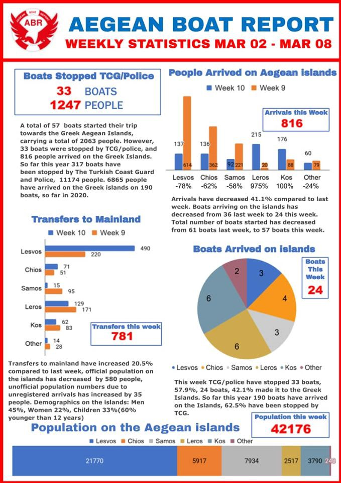

### AYS Daily Digest 09/03/2020 — Coronavirus Reaches Lesvos, Supermarket Worker Falls Ill
#### Xenophobic Rally Held in Belgrade This Weekend/// Spain’s Government to Send More Police to Greece/// More Information on German Fascists Traveling to Greece/// & More

](assets/eec0d7fc162d/0*N5kpkuL0rfP9ZJXh)

Mytilene hospital\. Source: [Politischios](https://www.politischios.gr/ygeia/epibebaionetai-krousma-koronoiou-ste-lesbo?fbclid=IwAR3-TWRqBeHcyjByU-I1C_tYtNmrPKxD3bq7qvYf3XCFDtDRmmUicbFhDC4)

The first case of COVID\-19 on Lesvos was [confirmed](https://www.politischios.gr/ygeia/epibebaionetai-krousma-koronoiou-ste-lesbo?fbclid=IwAR2W917GQIb1CGrfc1vdz6WzcloKmddLqCVmQhcfzhtV2fbT5vWYJH5oVGk) on Monday by local media\. The [patient](http://www.ekathimerini.com/250385/article/ekathimerini/news/suspected-case-of-covid-19-reported-on-lesvos) is a 40\-year\-old woman who was part of a group tour to Israel and Egypt a few weeks ago and many other members of the group are also reportedly sick\. She has been put in isolation at Mytilene hospital\. Schools in the village that her children attended have been closed for several days\. The woman is an employee at a local supermarket in Plomari and could have infected multiple people\. We will continue updating our digests as more information comes in\.

As a response to the increasing number of cases in Greece \(the health ministry [reported](https://medicalxpress.com/news/2020-03-coronavirus-case-greek-island-housing.html?fbclid=IwAR2wQT3B4iUJ_nAGKC0BWqGzdWbxJDFH9iBNEXw4KAtpGAntC-Rxj-8CDmE) 11 new ones on Monday alone, although they did not mention Lesvos\), the government has imposed some quarantine measures\. Public gatherings are banned, several schools and universities are closed, and sporting events will be held without spectators\.

It is ironic that it is a Greek person who is the first case of a COVID\-19 infection on Lesvos after weeks of fear\-mongering against people on the move\. Prime Minister Kyriakos Mitsotakis used fears of coronavirus to [justify](https://www.euractiv.com/section/justice-home-affairs/news/greece-invokes-coronavirus-to-halt-migration/) setting border controls to “maximum deterrent” levels\. He is not alone as his ideological bedfellows across Europe, for example Viktor Orban, also used fears of coronavirus to justify increased border violence\. However, facts are not likely to stop xenophobia\. As the arrival of coronavirus on the Greek islands moves from a possibility to a reality, the possibility of hate crimes and violence will also become very real\.

Although COVID\-19 is not in itself a very deadly disease, it can be lethal for vulnerable populations, such as those who are already ill\. Many people in camps on Lesvos or other islands have preexisting health conditions that have not been treated due to inadequate medical facilities\. There are only a few doctors for thousands of camp residents and they are already overburdened — their workload if an epidemic spreads through the camps would be unbearable\. People cannot access healthcare outside of the camps due to discrimination and their lack of AMKA numbers\. Sanitary conditions in the camps are also horrendous\. Most people do not have access to soap and hot water, making one of the most important precautions against infectious diseases — washing hands — nearly impossible\.

A UNHCR team [traveled](https://www.infomigrants.net/en/post/23309/un-team-advises-migrants-in-greece-about-coronavirus?fbclid=IwAR0XKQyIK_fxrkaoy75JgVu9X_QWp7WQnmA1tYqY1eGnlEDYA3i63GoN4As) to the Greek border to advise people on the move about coronavirus\. Official Margaritis Petrizikis described the team’s mission as providing information to the Greek government about containing the spread and providing information to people on the move about “the basic principles of hygiene personal prevention\.” However, the sanitary problems facing camps in Greece are not caused by people from outside Europe not knowing how to wash their hands, but by unhygienic living conditions created by the powers that manage these camps\. It is unclear how people on the move are supposed to practice “hygiene personal prevention” when they are denied access to soap, water, and medical care\.

There are some people working to stop the spread of disease in Lesvos\. Stand by Me Lesvos, working with Refugee Corona Information Resource, published a Corona Information Center specifically for people on the move\. The page in Farsi can be found [here](https://www.facebook.com/%D9%BE%D9%86%D8%A7%D9%87%D9%86%D8%AF%D9%87-%D9%85%D9%86%D8%A7%D8%A8%D8%B9-%D8%A7%D8%B7%D9%84%D8%A7%D8%B9%D8%A7%D8%AA%DB%8C-%DA%A9%D8%B1%D9%88%D9%86%D8%A7-102542584699981/?fref=mentions&__tn__=K-R) , and they are working on creating pages in English, Arabic, and French\. To support the work they are doing, you can donate [here](https://standbymelesvos.gr/support-us/?fbclid=IwAR2uP4FBDSDzQHiLmE9cSjTSl9u9DpqNJXqYLQ3EcU4wR6gAQDsonk-8H50) \.

As a coronavirus epidemic in the camps becomes more and more likely, its consequences are likely to be tragic\. It is important to remember that none of this was inevitable but that every death on the islands is due to deliberate negligence by the Greek and EU governments\.

More information is trickling in about the spate of fascist violence against solidarity workers last week\. A video [has been released](https://thepressproject.gr/vinteo-ntokoumento-apo-epithesi-se-ethelontes-tis-one-happy-family-sti-lesvo/?fbclid=IwAR1Hcr1VhCu6fVIQEiaXqmJLR6vRtXqX4dRodbVfg2cT0rDp_tKi4cG1GrQ) of an attack on One Happy Family volunteers last Thursday\. A car that has the markings of the NGO was attacked by a group of 20 people, who smashed the car, broke the windows, and tried to drag out the two volunteers who were inside\. The perpetrators were recognized from other episodes around the island and hopefully they will be brought to justice once the public prosecutor has a chance to process the video\.

Armed border patrols by civilians [continue](https://www.dw.com/en/greek-civilian-militias-patrol-border-amid-migrant-and-refugee-crisis/a-52697255?fbclid=IwAR0ObHwQAZMvwOdGzDLpMnGFDfwvPpJDXn4n3z0Gn2N1H06mPZu8lfuNHYE) at the border\. Many of the men that make up these patrols are members of the Greek National Guard and were armed by the Greek government itself to take action in case of emergency, and right now they see people on the move fleeing to safety as a state of emergency\. Many believe that people on the move are given maps and supplies by Erdogan as part of his plan to destabilize Greece, which is false — what knowledge people have of conditions in Greece and where to hide comes mostly from word of mouth or smugglers\. However, it is a potent rumor given the tensions between Greece and Turkey\.

Volunteers and solidarity workers are advised to be careful who they give interviews to as many fascists are posing as foreign journalists\. People should also avoid walking alone, make sure others always know where they are headed, and keep their phones charged\.

There will be another solidarity march in Mytilene, Lesvos this Saturday at 11am\. More information can be found [here](https://enoughisenough14.org/2020/03/09/lesvos-call-for-march-14-no-to-the-requisition-of-lesvos-by-fascists-no-to-fear-and-shame/?fbclid=IwAR3dXdKCG_IbKpuZ3NCd1D2Oxtr5ShndGNJTwmcu-dshC1sV_GR9JDbeYc0) \.

](assets/eec0d7fc162d/0*cMm3XvsT_ygQ8k1I.jpg)

poster, originally from the Lesvos Solidarity [Facebook page](https://www.facebook.com/pikpalesvos/posts/2587370428205039)

The Aegean Boat Report for the week of March 2nd was released [here](https://www.facebook.com/AegeanBoatReport/posts/786449121878194?hc_location=ufi&comment_id=Y29tbWVudDoyNDQ0NDA3OTM5MTA5ODk4XzI0NDQ4Mzg2MDU3MzM0OTg%3D) \. The Greek government has not been counting March arrivals, probably due to the shutdown of asylum registrations, so we are reliant on independent sources for information more than ever\.

SERBIA
### White Supremacist Rally in Belgrade This Weekend

■■■■■■■■■■■■■■ 
> **[Admirim](https://twitter.com/admirim) @ Twitter Says:** 

> > A white supremacist, anti-refugee rally in Belgrade on Sunday had it all: the motto "You will not replace us" and the Confederate flag, the symbol of black slavery.

Sitting Serbian President, Vucic, recently said his former boss Milosevic was "a great Serbian leader." https://t.co/ezcRBUgUOF 

> **Tweeted at [2020-03-09 10:37:49](https://twitter.com/admirim/status/1236964401204338688).** 

■■■■■■■■■■■■■■ 

Some participants stoned the “Miksalište” building and the site of the Serbian Commissariat for Refugees and Migration\.

This rally is just one example of global fascist solidarity that has solidified around Greece this past week\. The symbolism on display also shows the international nature of the fascists attacking people on the move\. In addition to chetnik symbolism, marchers had Confederate flags and carried signs referencing The Great Replacement Theory\. Some participants were identified as perpetrators of anti\-LGBT violence in the past\.

However, coalitions in solidarity with people on the move are just as international and are not standing down in the face of injustice\. Belgrade\-based organization Info Park strongly condemned the march and questioned the police’s motives in approving it even after President Vučić himself said such manifestations were fascist\. Their full statement \(in Serbian\) can be found on their Facebook page [here](https://www.facebook.com/infoparkserbia/posts/2726071627447084?__tn__=K-R) \.

SPAIN
### Spain’s Government to Send More Police to Greece

The “leftist” Spanish government [is sending](https://www.wsws.org/en/articles/2020/03/09/spai-m09.html?fbclid=IwAR1g-IzOwlaiNsyTe8WQ42fwoWA9e0gKYBGUePLFO1Mwm-Scjwzc30G9I8k) police officers to Greece — not in solidarity with people on the move, but with the violent Greek government\. These National Police and paramilitary Civil Guard units are in addition to the 111 Spanish officers already working for Frontex\.

It is unfortunate that even an allegedly left\-leaning government cannot show solidarity to vulnerable people\. However, this is in line with Spanish migration policy, which has plenty of blood on its hands on its own borders\. Spain began the practices that are now a part of “fortress Europe” and was the first country to externalize its border control \(to Morocco\), now an EU\-wide policy that has caused countless deaths\.

GERMANY
### More Information on German Fascists Traveling to Greece

Another example of international fascist solidarity are the [German fascists](https://www.berliner-zeitung.de/politik-gesellschaft/neonazis-aus-deutschland-reisen-nach-griechenland-li.78064?fbclid=IwAR3NIUAI0x45Hu2CTRdkviJxOAPYzss3ly26eV8eQoWCwmG81eZxGYnSzv4) traveling to Greece with the goal of “protecting” Greeks from people on the move\. The mobilization apparently happened through a chat group for neo\-Nazis after a call by the French Identitarian movement for all European nationalists to go defend Greece\. Although records of clashes in Mytilene between German fascists and Greeks have already been [reported](daily-digest-06-03-20-mep-joins-far-right-vigilantes-in-greece-b6b2ed9381fa) , the exact number of their presence is hard to determine\. There are some rumors that the Germans were part of the group that burned down One Happy Family over the weekend\.

These people, some of whom are veterans of militias in the Balkans, Lebanon and the Donbass, are violent and dangerous\. One German MP, Katharina Konig\-Preuss, advocated last week for preventing German fascists from traveling to Greece, however, it is unclear if any action has been taken yet\. It is unseemly that fascists receive more freedom of movement than innocent people fleeing violence and poverty\.

NETHERLANDS
### Dutch Government Refuses to Help Refugee Children

Despite lobbying from aid groups, The Netherlands [will not](https://www.dutchnews.nl/news/2020/03/the-netherlands-will-not-bring-in-refugee-children-from-greece-pm/?fbclid=IwAR36tTjpPxEUHlgxAA_PTcnCLHW3JGUrIR08RduyPvIhCd4Z_5KzlM3yX3s) provide a safe haven for children currently stuck in camps in Greece, ignoring Greece’s call for solidarity \(although it is not alone in doing so\) \. Prime minister Mark Rutte said the Netherlands will help improve conditions in camps “but that is far as we will go\.” However, the biggest problems in the camps is overcrowding, which would be fixed most easily by other EU countries accepting people on the move\. Rutte is not alone in his disdain for helping vulnerable children — there is very little support in parliament for providing asylum\.

UNITED KINGDOM
### Summary of the UK’s New Resettlement Schemes

The House of Commons published a briefing of the UK’s resettlement plans going forward\. The full briefing can be found [here\.](https://www.ein.org.uk/news/house-commons-library-publishes-briefing-uks-resettlement-schemes-refugees?fbclid=IwAR0tcz2Yp6EIK8KCXC42ArrZ8cBylm7-NJPKE0fKoWo3OJ_iq3WS--1RPXI) Part of this change is to consolidate settlement schemes from five different plans into one\. For the first year, 5000 people are projected to be resettled but beyond that no numbers are offered\.

Resettlement offers in the UK have steadily declined in the past few years, as has family reunification and other programs for accepting people on the move, even those fleeing war zones\.

EU
### EU Commission President Von der Leyen Calls on Turkey to Increase Border Security

Instead of showing solidarity with people on the move and condemning border violence ahead of talks with President Erdogan of Turkey, European Commission President Ursula von der Leyen [called](http://www.ekathimerini.com/250386/article/ekathimerini/news/eu-executive-tells-turkey-to-take-migrants-back-from-greek-border?fbclid=IwAR1qSlKb-1E-8w2KgVfY6rRnZRqTZkG0a7F8rBxJ5FuWlGwTyWMEMWfD0MM) on Turkey to “relieve the pressure that is being put on the border\.” By that, she means that Turkey should prevent people on the move from reaching the border, which can only be done through force\. Yet again the EU’s priority is maintaining its borders over people’s actual wellbeing\.

Her actions in office so far and the EU’s disregard for human rights have been heavily criticized by humanitarian organizations\.

■■■■■■■■■■■■■■ 
> **[MSF Sea](https://twitter.com/MSF_Sea) @ Twitter Says:** 

> > In 100 days @[vonderleyen](https://twitter.com/vonderleyen) &amp; @[EU_Commission](https://twitter.com/EU_Commission) have managed to undermine EU's most basic democratic values –  the respect of human dignity and fundamental refugee rights. You should be ashamed! We need to see an EU which upholds the principles enshrined in its laws. 

> **Tweeted at [2020-03-09 17:47:04](https://twitter.com/msf_sea/status/1237072425705254913).** 

■■■■■■■■■■■■■■ 

**Find daily updates and special reports on our [Medium page](https://medium.com/are-you-syrious) \.**

**If you wish to contribute, either by writing a report or a story, or by joining the info gathering team, please let us know\.**

**We strive to echo correct news from the ground through collaboration and fairness\. Every effort has been made to credit organisations and individuals with regard to the supply of information, video, and photo material \(in cases where the source wanted to be accredited\) \. Please notify us regarding corrections\.**

**If there’s anything you want to share or comment, contact us through Facebook, Twitter or write to: areyousyrious@gmail\.com**

_Converted [Medium Post](https://medium.com/are-you-syrious/ays-daily-digest-09-03-2020-coronavirus-reaches-lesvos-supermarket-worker-falls-sick-eec0d7fc162d) by [ZMediumToMarkdown](https://github.com/ZhgChgLi/ZMediumToMarkdown)._
